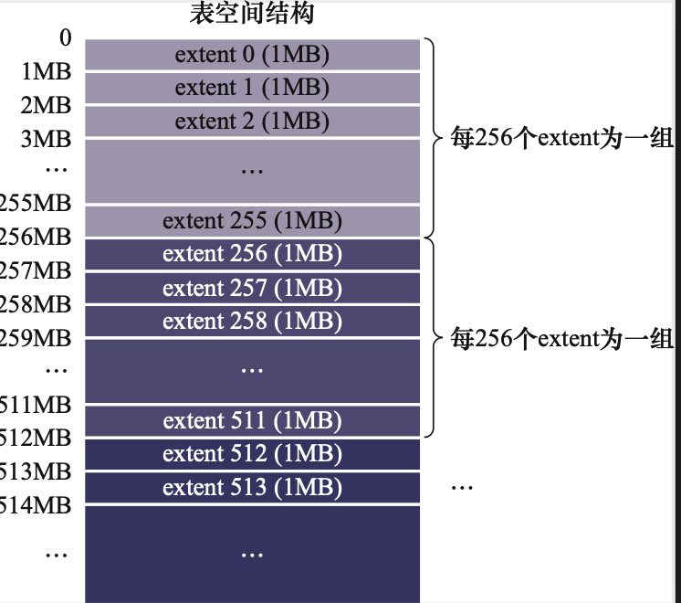
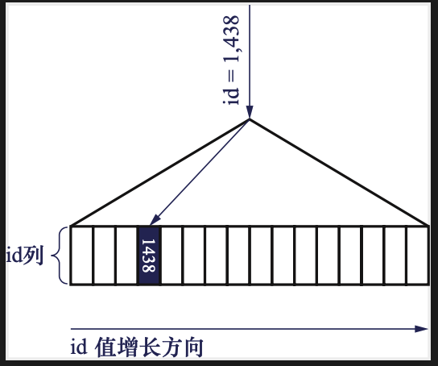
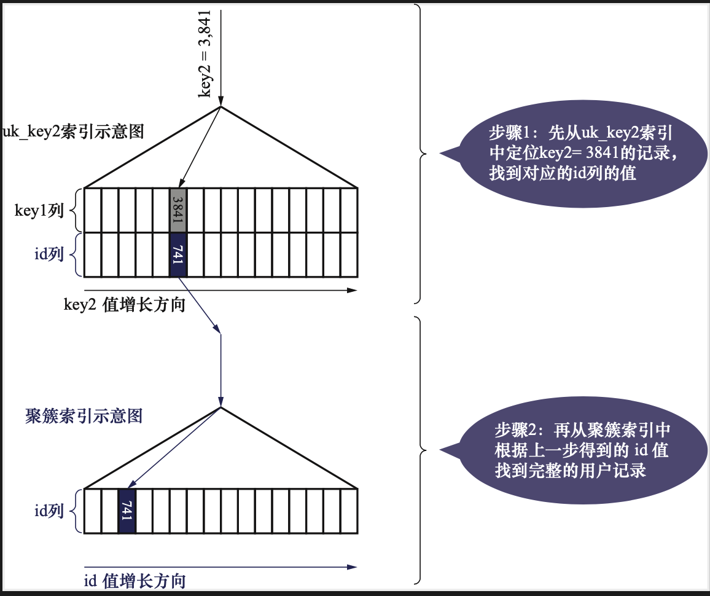
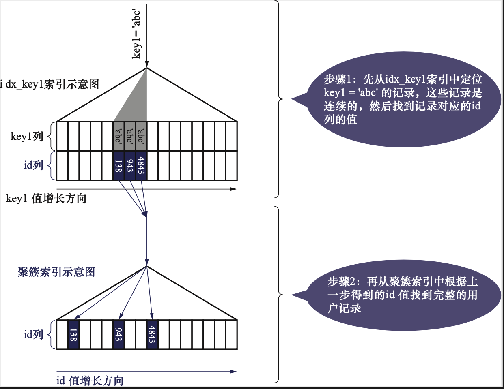
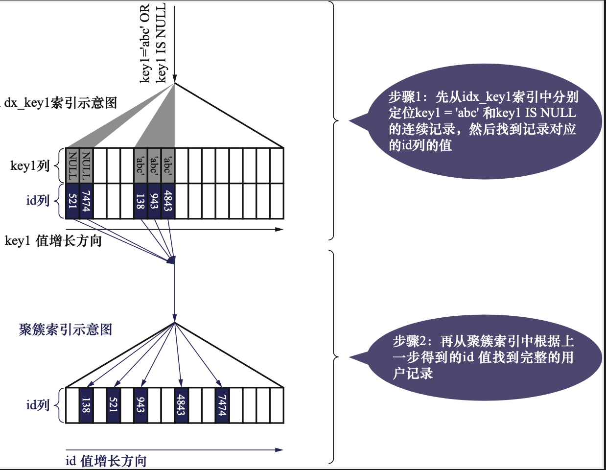
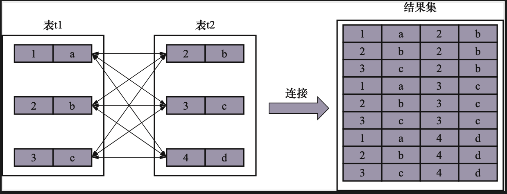
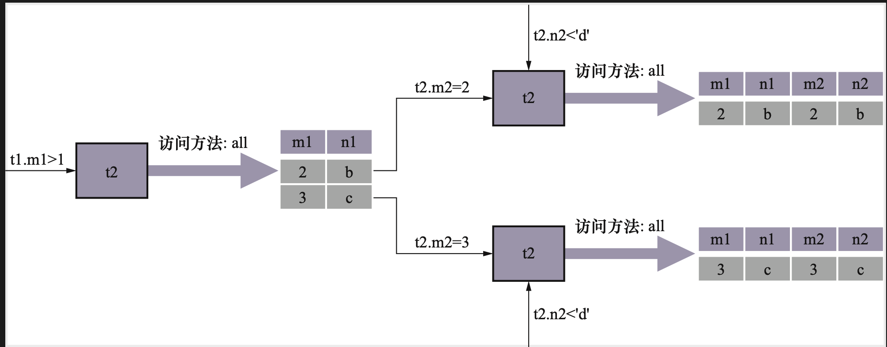
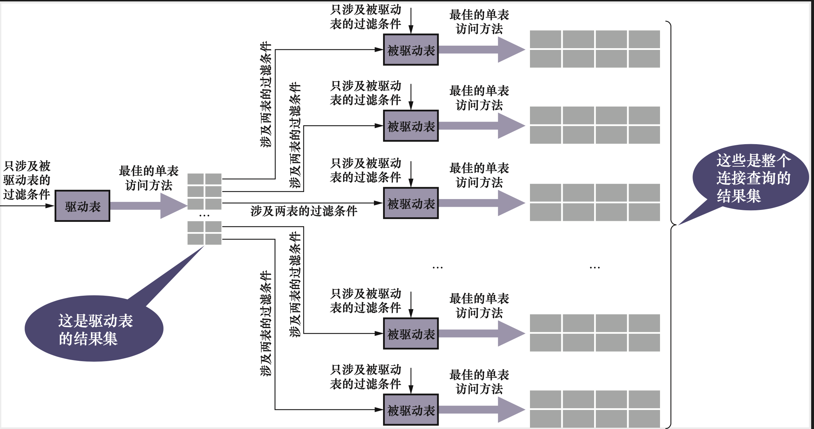

# MySQL是怎样运行的

## 第1章-初识MySQL

假设已经把mysql的bin目录添加到了环境变量

## 1.1 客户端与服务器连接的过程

运行中的服务器程序和客户端本质都是一个计算机上的进程，客户端向服务器发送请求并且得到响应实际是一个进程间通信的过程

+ TCP/IP

真实环境中，数据库服务器进程和客户端进程可能运行在不同的主机中，它们之间必须通过网络进行通信。MySQL采用TCP作为服务器和客户端之间的网络通信协议。网络中的其他进程可以通过IP地址+端口号的方式与这个进程建立连接，这样进程之间就可以进行网络通信了。

MySQL在服务启动的时候默认申请3306端口号。

如果3306已经被占用，可以通过`-p`参数来指定端口号。比如

```mysql
mysqld -P3307
```

+ 命名管道和共享内存
  + 使用命名管道和共享内存进行通信，需要在启动服务器程序的命令加上`--enable-named-pipe`参数。然后在启动客户端的命令加上`--pipe`或者`--protocol=pipe`
  + 使用共享内存进行通信，需要在服务端加上`--shared-memory`参数。在客户端加上`--protocol=memory` 
+ UNIX域套接字

如果服务器进程和客户端进程都运行在**类UNIX的同一台机器上**。可以使用UNIX域套接字进行通信。如果启动客户端的时候没有指定主机名，或者指定的主机名为localhost，或者指定了`--protocol=socket`。那么服务器和客户端程序就可以通过UNIX套接字进行通信了。

MySQL服务器默认UNIX域套接字名称为`\tmp\mysql.sock`。如果想改变这个名称，可以指定socket参数。`mysqld --socket=/tmp/a.txt`。客户端需要指定连接的UNIX域套接字文件名称:`mysql -hlocalhost -uroot --socket=/tmp/a.txt`

## 1.2 服务器处理客户端请求

无论服务器和客户端采用什么方式通信。最后都是客户端进程向服务器发送一段文本(MySQL语句)，服务器进程处理后再向客户端进程返回一段文本（处理结果）。大致可以如下所示


+ 连接管理：当有一个客户端进程连接到服务器进程的时候，服务器会创建一个线程与客户端进行交互。当客户端断开连接的时候，服务器不会理解销毁线程，而是缓存起来，当有一个新的客户端进行连接的时候，把这个缓存的线程分配给新客户端

+ 解析与优化：

  + 查询缓存
    + MySQL会把刚刚处理过的查询请求和结果缓存起来。如果下一次有同样的请求，直接从缓存中查找结果即可。
    + 如果有两个查询清幽有任何字符上的不同（空格、注释、大小写），都会导致缓存不命中。
    + 有些请求不会缓存，例如mysql、information_schema、performance_schema数据库中的表的请求。还包括一些系统函数例如`NOW()`
    + 缓存失效：当表的结构或者数据被修改，则与该表的所有查询缓存都将无效并且从查询缓存中删除。

  > MySQL5.7.20开始，不推荐使用查询缓存，在MySQL8.0中被删除

  + 语法解析：客户端发送的请求是一段文本，这时候MySQL服务器需要对这段文本进行分析，判断语法是否正确，然后从文本中将要查询的表、各种查询条件提取出来放到MySQL服务器内部使用的一些数据结构。
  + 查询优化：MySQL会对我们的语句做一些优化，比如外连接转换为内连接、表达式简化、子查询转换为连接

+ 存储引擎：MySQL把数据存储和提取操作都封装到了一个名为存储引擎的模块中。

MySQL服务器处理请求的过程简单划分为server层和存储引擎层。连接管理、查询缓存、语法解析、查询优化是server层。真正存取数据的层称为存储引擎层。

server层和存储引擎层交互的时候，一般以记录为单位。以SELECT为例。server层根据执行计划先向存储引擎层取一条记录，判断是否符合条件，如果符合，发送给客户端，否则跳过。

## 1.3 常用的存储引擎

| Feature                                | MyISAM       | Memory           | InnoDB       | Archive      | NDB          |
| :------------------------------------- | :----------- | :--------------- | :----------- | :----------- | :----------- |
| B-tree indexes                         | Yes          | Yes              | Yes          | No           | No           |
| Backup/point-in-time recovery (note 1) | Yes          | Yes              | Yes          | Yes          | Yes          |
| Cluster database support               | No           | No               | No           | No           | Yes          |
| Clustered indexes                      | No           | No               | Yes          | No           | No           |
| Compressed data                        | Yes (note 2) | No               | Yes          | Yes          | No           |
| Data caches                            | No           | N/A              | Yes          | No           | Yes          |
| Encrypted data                         | Yes (note 3) | Yes (note 3)     | Yes (note 4) | Yes (note 3) | Yes (note 3) |
| Foreign key support                    | No           | No               | Yes          | No           | Yes (note 5) |
| Full-text search indexes               | Yes          | No               | Yes (note 6) | No           | No           |
| Geospatial data type support           | Yes          | No               | Yes          | Yes          | Yes          |
| Geospatial indexing support            | Yes          | No               | Yes (note 7) | No           | No           |
| Hash indexes                           | No           | Yes              | No (note 8)  | No           | Yes          |
| Index caches                           | Yes          | N/A              | Yes          | No           | Yes          |
| Locking granularity                    | Table        | Table            | Row          | Row          | Row          |
| MVCC                                   | No           | No               | Yes          | No           | No           |
| Replication support (note 1)           | Yes          | Limited (note 9) | Yes          | Yes          | Yes          |
| Storage limits                         | 256TB        | RAM              | 64TB         | None         | 384EB        |
| T-tree indexes                         | No           | No               | No           | No           | Yes          |
| Transactions                           | No           | No               | Yes          | No           | Yes          |
| Update statistics for data dictionary  | Yes          | Yes              | Yes          | Yes          | Yes          |

## 第2章-启动选项和系统变量

略

## 第3章-字符集和比较规则

 ## 3.1 字符集

### 3.2.1 MySQL中的utf8和utf8mb4

+ utf8mb3：只使用1-3字节表示字符
+ Utf8mb4：正宗的UTF-8字符集，使用1-3字节表示字符

在MySQL中，utf8是utf8mb3的别名。

## 第4章-InnoDB记录存储结构

### 4.1 InnoDB页简介

InnoDB是一个将表中的数据存储到磁盘上的存储引擎。真正处理数据的过程发生在内存中，所以需要把磁盘中的数据加载到内存。如果处理写入或者修改请求，需要把内存的内容刷新到磁盘上。InnoDB将数据划分为若干页，以页作为磁盘和内存之间交互的单位。页大小一般为16KB。

### 4.2 InnoDB行格式

我们平时都是以记录为单位向表中插入数据的，这些记录在磁盘上的存放方式称为行格式或者记录格式。有四种不同的行格式，`COMPACT`、`REDUNDANT`、`DYNAMIC`和`COMPRESSED`

#### 4.2.1 指定行格式的语法

`CREATE TABLE {{表名}} (列的信息) ROW_FORMAT=行格式名称;`

`ALTER TABLE {{表名}} ROW_FORMAT=行格式名称;`

#### 4.3.2 COMPACT行格式


+ 记录的额外信息：这部分是服务器为了管理记录不得不添加的一些信息。

  + 变长字段长度列表：MySQL支持变长字段，比如VARCHAR(M),VARBINARY(M)、各种TEXT类型、各种BLOB类型。变长字段存储数据大小不确定，所以存储真实数据的时候需要顺便把这些数据占用的字节数存储起来。

  > 在COMPACT中，所有变长字段的真实数据占用的字节数都在记录的开头位置。各变长字段的真实数据占用的字节数按照列的顺序逆序存放。**逆序存放**

  + NULL值列表:COMPAT把一条记录中值为NULL的列统一管理起来，存储到NULL值列表
    + 首先统计表中允许存储NULL的列
    + 如果表中没有存储NULL的列，则NULL不存在了。否则每一个NULL的列对应一个二进制位。二进制位1，代表值是NULL。二进制位0，代表值不为NULL。
    + NULL列必须用整个字节位表示，如果NULL数量不是整数个，最高位补0 
  + 记录头信息：固定5字节组成。


+ + deleted_flag:标记是否被删除

  + min_rec_flag:B+树每层非叶子结点最小的目录项记录会添加该标记
  + n_owned:一个页面中记录会被分成若干组。第一个组的n_owned代表该小组中所有记录条数
  + heap_no:当前记录在页面堆中的相对位置
  + record_type:当前记录类型。0：普通，1：B+树非叶子结点目录项记录。2：infimum记录。3：supremum记录
  + next_record：下一条记录的相对位置

+ 记录的真实数据
  + MySQL会为每个记录默认添加一些列。
    + row_id:非必要，行ID，唯一标识一条记录
    + trx_id：必要，事务ID
    + roll_pointer：必要，回滚指针

InnoDB主键生成策略：优先使用用户自定义的主键，否则选一个一个UNIQUE键作为主键。否则默认添加一个row_id作为主键

#### 4.3.3 REDUNDANT行格式


+ 字段长度偏移列表：逆序，使用偏移长度，例如`0C 06`即第一列0x06,第二列0x0c字节。
+ NULL值处理：对应偏移量的第一个比特位。如果是1，就是NULL。

#### 4.3.4 溢出列

如果一个字符串超过了页数，怎么办呢

在COMPACThe REDUNDANT中，对占用存储了非常多的列。只存储一部分，剩余数据存储在其他页中。记录真实数据用20字节指向这些页的地址

#### 4.3.5 DYNAMIC和COMPRESSED

+ DYNAMIC：类似于COMPACT。处理溢出的时候把所有数据存储到溢出页中。真实数据存储20字节大小的溢出页地址。
+ COMPRESSED使用压缩算法压缩。

## 第5章-InnoDB数据页结构

存放表中记录的那种类型的页。**索引(INDEX)页**。

### 5.1 数据页结构快览


| 名称             | 中文名                     | 占用空间大小 | 简单描述               |
| ---------------- | -------------------------- | ------------ | ---------------------- |
| File Header      | 文件头部                   | 38字节       | 页的一些通用信息       |
| Page Header      | 页面头部                   | 56字节       | 数据页专有的一些信息   |
| Infimum+Supremum | 页面中的最小记录和最大记录 | 26字节       | 两个虚拟的记录         |
| User Records     | 用户记录                   | 不确定       | 用户存储的记录内容     |
| Free Space       | 空闲空间                   | 不确定       | 页中尚未使用的空间     |
| Page Directory   | 页目录                     | 不确定       | 页中某些记录的相对位置 |
| File Trailer     | 文件尾部                   | 8字节        | 校验页是否完整         |

### 5.2 记录在页中的存储

我们自己存储的记录会放在`User Records`部分。每当插入一条数据，会从`Free Space`部分申请一个记录大小的空间，并且将这个空间划分到`User Record`部分。

### 5.3 页目录

+ 将所有正常的记录（包括Infimum和Supremum）划分为几个组
+ 每个组最后一条记录（也是组内最大的那条记录），最后一条记录的`n_owned`表示组内一共有几条记录
+ 每个组最后一条记录在页面中的地址偏移量单独提取出来，按照顺序存储到靠近页尾部的地方。这个地方就是`Page Directory`

比如，现在又6条记录，会被分为两组


+ 对于Infimum记录在的分组只能有一条记录
+ Supremum分组记录在1-8之间
+ 剩下的条数范围只能在4-8之间
  + 初始情况下，一个数据页中只有Infimum记录和Supremum。分属两个组。页目录中也只有两个槽。代表Infimum和Supremum在页中的地址偏移量
  + 每插入一条记录，都会在页目录中找到对应记录的主键值比待插入记录的主键值大并且差值最小的槽。然后把该槽对应的记录的`n_owned`加1，直到该组记录等于8个。
  + 当一个组记录等于8后，在插入一条记录，会分为两个组。其中一个4条记录，另一个5条记录。这个过程会在页目录中新增一个槽。

## 第6章-B+树索引

### 6.1 索引


+ 目录项的`record_type`值是1
+ 目录项只有主键值和页的编号两个列。

多个目录页可以再组合


1.联合索引

我们想让B+树按照c2和c3排列

+ 先把各个记录的页按照c2进行排列

+ 然后再采用c3进行排列

2.聚簇索引

+ 使用记录主键值进行记录和页的排序
+ 叶子结点存储了完整的用户记录

满足这两个条件称为聚簇索引

3.二级索引

聚簇索引只能搜索条件是主键的时候发挥作用。

我们可以多建几颗B+树。按照不同的排序规则排序

找到叶子结点后，叶子结点存储了主键信息，然后到聚簇索引去查找

## 第7章-B+树索引使用

略

## 第8章-MySQL的数据目录

如何确定MySQL中的数据目录

```mysql
SHOW VARIABLES LIKE 'datadir';
```

### 8.1 数据目录的结构

每次使用`CREATE DATABASE`的时候。MySQL会做两件事

+ 在数据目录下创建一个与数据库同名的子目录
+ 在子目录下创建一个`db.opt`的文件，包含了数据库的一些属性

### 8.2 表在文件系统中的表示

+ 保存表结构信息：`表名.frm`
+ 保存表数据：`表名.ibd`

## 第9章-InnoDB的表空间

### 9.1 区的概念

表空间中页太多了。对于16KB的页来说，连续64个页就是一个区，一个区默认占用1MB大小。每256个区被划分成一组。



## 第10章-单表的访问方法

### 10.1 Const

有时候可以通过主键列来定位一条记录，比如下面这个查询

`SELECT * FROM single_table where id =1438;`

MySQL会直接利用主键值在聚簇索引中定位对应的用户记录




我们根据唯一二级索引来定位一条记录的速度也是很快的，例如：

```mysql
SELECT * FROM single_table WHERE key2=3841;
```

执行分为两步：

1.在B+树索引中，根据key2列与常数的等值比较条件定位到一条二级索引记录

2.然后根据记录的id到聚簇索引中获取完整的用户记录



通过主键或者唯一二级索引与常数的比值比较来定位非常快。

### 10.2 ref

有时候我们需要普通的二级索引与常数进行比较

```mysql
select * from single_table where key1='abc';
```

采用二级索引来执行查询的访问方式称为`ref`

此时对应的扫描区间就是`['abc','abc']`。



### 10.3 ref_or_null

如果有时候二级索引查找NULL的时候。例如下面

```mysql
select * from single_table where key1='abc' or key1 is NULL;
```

当使用二级索引而不是全表扫描的时候，对应的扫描区间就是`[NULL,NULL]`以及`['abc','abc']`。这时候查询方法就称为`ref_or_null`



### 10.4 range

有时候我们的搜索条件很复杂，如下面所示

```mysql
SELECT * FROM single_table where key2 in (1438,6328) OR (key2>=38 and key2<=79);
```

对应的查询区间是`[1438,1438]`,`[6328,6328]`以及`[38,79]`

### 10.5 index

来看下面这个例子，其中`key_part1,key_part2,key_part3`建立了联合索引。

来看这个查询语句:

```mysql
select key_part1,key_part2,key_part3 from single_table where key_part2 = 'abc';
```

由于key_part2不是联合索引最左边的列，从而无法使用ref或者range来访问。

我们可以遍历联合索引的所有记录，针对每一条记录，判定`key_part2='abc'`是否成立。如果成立就读取出三个列的值。

由于二级索引比聚簇索引小得多，所以直接扫描全部二级索引代价比扫描全表小。这种扫描全部二级索引的方法称为index方法。

### 10.6 all

全表查询。全表扫描。

### 10.7 注意事项

#### 10.7.1 二级索引+回表

如下查询

```mysql
select * from single_table where key1= 'abc' and key2>1000;
```

查询优化器会识别下面两个条件

+ key1= 'abc'
+ key2 > 1000

如果使用第一个，扫描区间是`['abc','abc]`。如果第二个，扫描区间是`(1000,+)`。优化器根据一定的算法来计算这两种执行的成本是多少。然后选择成本更小的执行查询。

如果选择了`key1='abc'`来查询的话。

+ 根据条件在B+树种定位到扫描区间`['abc','abc']`
+ 检测记录是否满足key2>1000
+ 如果满足，则发送给客户端
+ 知道记录不满足key1='abc'

#### 10.7.2 索引合并

看看下面这个语句

```mysql
select * from single_table where key1='a' and key3 = 'b';
```

方案1：按照key1找，然后和'b'比较

方案2：按照key2找，然后和'a'比较

还可以有方案3，同时使用key1和key3进行查询，查询到的记录取交集

+ 从key1中取出第一条索引，主键为1.然后从key3中取出一条索引，主键为2。 1<2 ，所以直接把key1的记录丢弃
+ 从key1拿下一条，主键为3 。 3> 2 ，key2的主键为2的记录丢掉。
+ 接着从key3中拿出主键为3的记录，返回给客户端。

如此继续下去。

#### 10.7.3 Union索引合并

现在有如下查询语句

```mysql
select * from single_table where key1='a' or key3='b';
```

我们需要同时扫描key1和key3.然后根据结果去重

## 第11章-两个表连接的原理

本质来说，连接就是把各个表的记录都取出来进行匹配，并且把匹配的组合发给客户端



### 11.1 连接过程

我们看一下下面的语句

```mysql
SELECT * from t1,t2 where t1.m1>1 and t1.m1=t2.m2 and t2.n2<'d';
```

这个连接执行过程如下：

+ 首先确定第一个需要查询的表，称为驱动表。怎么在但表中查询请参考前一章。
+ 步骤1得到的每一条记录，都需要到t2表中查找匹配的记录。匹配的记录是指符合过滤条件的记录。因为从t1到t2中找，t2称为被驱动表。
+ 对于t1得到的表，当t1.m1=2的时候，过滤条件就相当于`t2.m2=2,t2.n2<'d'`

整个过程如图所示



### 11.2 内连接和外连接

#### 11.2.1 外连接

外连接可以分为两种

+ 左外连接
+ 右外连接

ON子句的过滤条件：

对于外连接的驱动表记录，如果无法匹配ON过滤条件，那么驱动表记仍然加入到结果集，对应的被驱动表的字段使用NULL代替。

#### 11.2.2 内连接

内连接不会把不符合条件的记录使用NULL代替。

### 11.3 嵌套循环连接

对于两表连接来说，驱动表只会访问一遍，被驱动表访问很多遍。

内连接：选择哪个驱动表都没关系

外连接：驱动表是固定的

+ 选择驱动表，代价最低的单表访问方法来执行驱动表的单表查询
+ 对驱动表的每一条记录，分别到被驱动表中进行查询



### 11.4 基于块的嵌套循环连接

如果记录非常多，有的在内存，有的在磁盘。

我们可以将驱动表的数据放到`Join Buffer`缓冲区中。把若干驱动表的数据放到这边来。然后扫描被驱动表，每一条记录一次性的和`Join Buffer`中的记录比较。这样可以显著减少被驱动表的`i/o`代价

## 第12章-基于成本的优化

 ### 12.1 单表查询的成本

在真正执行一条单表查询语句之前，MySQL优化器会找出所有可以用来执行该语句的方案，并在对比这些方案之后找出成本最低的方案。这个成本最低的方案就是所谓的执行计划。之后才会调用存储引擎提供的接口真正去执行。

+ 根据搜索条件，找出所有可能使用的索引
+ 计算全表扫描的代价
+ 使用不同索引执行查询的代价
+ 对比各种执行方案，找出成本最低的那个方案

## 第13章-统计数据是如何收集的

略

## 第14章-基于规则的优化

### 14.1 条件简化

+ 移除不必要的括号：有时候表达式有许多无用的括号，比如这样
  `SELECT * FROM (t1,t2) where t1.a=t2.a`
  优化器会把不必要的括号移除：
  `SELECT * FROM t1,t2 where t1.a=t2.a`

+  常量传递：有时候某个表达式是某个列和某个常量等值匹配。
  当使用AND操作符的时候可以替换
  例如：`a =5 and b > a`替换为`a=5 and b > 5`

+ 移除没用的条件：对于一些明显的永远为TRUE或者FALSE的表达式，优化器会移除掉。
  比如`(a<1 and b=b)`变成`(a<1 and TRUE)`

+ 表达式计算：如果表达式包含常量，它的值会被计算下来，比如下面这个:`a = 5 + 1`

+ 常量表检测：下面两种类型的查询比较快

  + 查询表中一条记录没有，或者只有一条记录
  + 使用主键等值匹配或者唯一二级索引等职匹配作为搜索条件

  这两种方式称为常量表查询。先把这些查询中的条件替换成常数，最后分析其余表的查询成本。

### 14.2 外连接消除

只要我们在WHERE子句中的搜索条件指定“被驱动表的列不为NULL”，外连接在驱动表中找不到符合ON子句的驱动表记录。在这种情况下，外连接和内连接没有什么区别了。

```mysql
select * from t1 left join t2 on t1.m1=t2.m2 where t2.n2 is not null;
```

这种指定WHERE子句中符合空值拒绝的条件后，外连接和内连接可以相互转转。优化器可以通过评估表的不同连接顺序的成本，选出成本最低的连接顺序来执行查询。

### 14.3 子查询优化

如果使用IN子查询。

+ 如果可以转换为半连接的条件，查询优化器会优先把孩子查询转换成半连接，然后选择成本最低的执行策略进行查询。
+ 如果不能转成半连接，查询优化器会从下面选择一种成本更低的方式执行。
  + 现将子查询物化，然后查询
  + 执行IN到EXISTS的转换。

