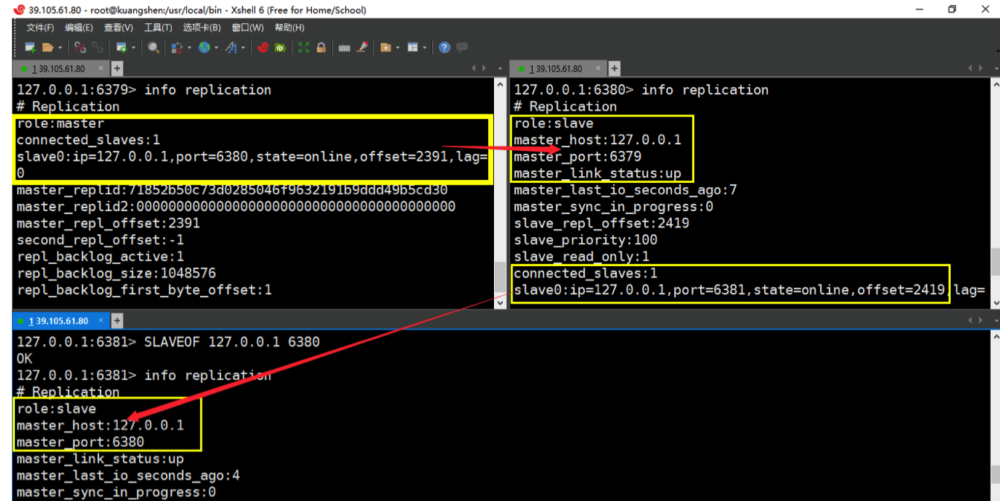

# 1.NoSQL概述

## 为什么用NoSQL

> 1.单机MySQL的美好年代

在90年代，一个网站的访问量一般不大，用单个数据库完全可以轻松应付！ 在那个时候，更多的都是静态网页，动态交互类型的网站不多。

上述架构下，我们来看看数据存储的瓶颈是什么？

1. 数据量的总大小，一个机器放不下时

2. 数据的索引（B+ Tree）一个机器的内存放不下时

3. 访问量（读写混合）一个实例不能承受

如果满足了上述 1 or 3个，进化.... DAL：数据库访问层


> 2.Memcached（缓存）+ MySQL + 垂直拆分

后来，随着访问量的上升，几乎大部分使用MySQL架构的网站在数据库上都开始出现了性能问题，web 程序不再仅仅专注在功能上，同时也在追求性能。程序猿们开始大量使用缓存技术来缓解数据库的压 力，优化数据库的结构和索引，开始比较流行的是通过文件缓存来缓解数据库压力，但是当访问量继续 增大的时候，多台web机器通过文件缓存不能共享，大量的小文件缓存也带了比较高的IO压力，在这个 时候，Memcached就自然的成为一个非常时尚的技术产品。


> 3.MySQL主从读写分离

由于数据库的写入压力增加，Memcached只能缓解数据库的读取压力，读写集中在一个数据库上让数 据库不堪重负，大部分网站开始使用主从复制技术来达到读写分离，以提高读写性能和读库的可扩展 性，MySQL的master-slave模式成为这个时候的网站标配了。


> 4.分表分库+水平拆分+Mysql集群

在Memcached的高速缓存，MySQL的主从复制，读写分离的基础之上，这时MySQL主库的写压力开始 出现瓶颈，而数据量的持续猛增，由于MyISAM使用表锁，在高并发下会出现严重的锁问题，大量的高 并发MySQL应用开始使用InnoDB引擎代替MyISAM。 同时，开始流行使用分表分库来缓解写压力和数据增长的扩展问题，这个时候，分表分库成了一个热门 技术，是面试的热门问题，也是业界讨论的热门技术问题。也就是在这个时候，MySQL推出了还不太稳 定的表分区，这也给技术实力一般的公司带来了希望。虽然MySQL推出了MySQL Cluster集群，但性能 也不能很好满足互联网的需求，只是在高可靠性上提供了非常大的保证。


> 5.MySQL的扩展性瓶颈

MySQL数据库也经常存储一些大文本的字段，导致数据库表非常的大，在做数据库恢复的时候就导致非 常的慢，不容易快速恢复数据库，比如1000万4KB大小的文本就接近40GB的大小，如果能把这些数据 从MySQL省去，MySQL将变的非常的小，关系数据库很强大，但是它并不能很好的应付所有的应用场 景，MySQL的扩展性差（需要复杂的技术来实现），大数据下IO压力大，表结构更改困难，正是当前使 用MySQL的开发人员面临的问题。

> 6.今天


> 7.为什么使用NoSQL

今天我们可以通过第三方平台（如：Google，FaceBook等）可以很容易的访问和抓取数据。用户的个 人信息，社交网络，地理位置，用户生成的数据和用户操作日志已经成倍的增加、我们如果要对这些用 户数据进行挖掘，那SQL数据库已经不适合这些应用了，而NoSQL数据库的发展却能很好的处理这些大 的数据！

## 什么是NoSQL

> NoSQL

NoSQL = Not only SQL

> NoSQL特点

1. 易扩展

NoSQL 数据库种类繁多，但是一个共同的特点都是去掉关系数据库的关系型特性。

数据之间无关系，这样就非常容易扩展，也无形之间，在架构的层面上带来了可扩展的能力。

2. 大数据量高性能

NoSQL数据库都具有非常高的读写性能，尤其是在大数据量下，同样表现优秀。这得益于它的非关系 性，数据库的结构简单。

一般MySQL使用Query Cache，每次表的更新Cache就失效，是一种大力度的Cache，在针对Web2.0的 交互频繁应用，Cache性能不高，而NoSQL的Cache是记录级的，是一种细粒度的Cache，所以NoSQL 在这个层面上来说就要性能高很多了。

官方记录：Redis 一秒可以写8万次，读11万次！

3. 多样灵活的数据模型

NoSQL无需事先为要存储的数据建立字段，随时可以存储自定义的数据格式，而在关系数据库里，增删 字段是一件非常麻烦的事情。如果是非常大数据量的表，增加字段简直就是噩梦。

4. 传统的RDBMS VS NoSQL

```
传统的关系型数据库 RDBMS

- 高度组织化结构化数据

- 结构化查询语言（SQL）

- 数据和关系都存储在单独的表中

- 数据操纵语言，数据定义语言

- 严格的一致性

- 基础事务

NoSQL

- 代表着不仅仅是SQL

- 没有声明性查询语言

- 没有预定义的模式

- 键值对存储，列存储，文档存储，图形数据库

- 最终一致性，而非ACID属性

- 非结构化和不可预知的数据

- CAP定理

- 高性能，高可用性 和 可伸缩性
```

## NoSQL四大分类

+ KV键值
  + 新浪：BerkeleyDB+redis 
  + 美团：redis+tair 
  + 阿里、百度：memcache+redis
+ 文档型数据库
  + MongoDB
+ 列存储数据库
  + Cassandra, HBase 
  + 分布式文件系统
+ 图关系数据库
  + 它不是放图形的，放的是关系比如:朋友圈社交网络、广告推荐系统 社交网络，推荐系统等。专注于构建关系图谱 Neo4J, InfoGrid

> 四者对比


# 2.Redis入门

## 概述

> Redis是什么

Redis：REmote DIctionary Server（远程字典服务器）

是完全开源免费的，用C语言编写的，遵守BSD协议，是一个高性能的（Key/Value）分布式内存数据 库，基于内存运行，并支持持久化的NoSQL数据库，是当前最热门的NoSQL数据库之一，也被人们称为 数据结构服务器

Redis与其他key-value缓存产品有以下三个特点

+ Redis支持数据的持久化，可以将内存中的数据保持在磁盘中，重启的时候可以再次加载进行使 用。 
+ Redis不仅仅支持简单的 key-value 类型的数据，同时还提供list、set、zset、hash等数据结构的存 储。 
+ Redis支持数据的备份，即master-slave模式的数据备份。

## Redis基础知识说明

> **redis压力测试工具-Redis-benchmark**

Redis-benchmark是官方自带的Redis性能测试工具，可以有效的测试Redis服务的性能。

redis 性能测试工具可选参数如下所示：

| 序号 | 选项  | 描述                                       | 默认值    |
| ---- | ----- | ------------------------------------------ | --------- |
| 1    | -h    | 指定服务器主机名                           | 127.0.0.1 |
| 2    | -p    | 指定服务器端口                             | 6379      |
| 3    | -s    | 指定服务器 socket                          |           |
| 4    | -c    | 指定并发连接数                             | 50        |
| 5    | -n    | 指定请求数                                 | 10000     |
| 6    | -d    | 以字节的形式指定 SET/GET 值的数据大小      | 2         |
| 7    | -k    | 1=keep alive 0=reconnect                   | 1         |
| 8    | -r    | SET/GET/INCR 使用随机 key, SADD 使用随机值 |           |
| 9    | -P    | 通过管道传输 请求                          | 1         |
| 10   | -q    | 强制退出 redis。仅显示 query/sec 值        |           |
| 11   | --csv | 以 CSV 格式输出                            |           |
| 12   | -l    | 生成循环，永久执行测试                     |           |
| 13   | -t    | 仅运行以逗号分隔的测试命令列表。           |           |
| 14   | -I    | Idle 模式。仅打开 N 个 idle 连接并等待。   |           |

```redis
# 测试
redis-benchmark -h localhost -p 6379 -c 100 -n 100000
```

> 基本数据库常识

默认16个数据库，类似数组下标从零开始，初始默认使用零号库

```
查看 redis.conf ，里面有默认的配置
databases 16
```

**Select**命令切换数据库

```
select 7
```

**Dbsize**查看当前数据库的key的数量

```
DBSIZE
keys * # 查看具体的key
```

**Flushdb**：清空当前库 

**Flushall**：清空全部的库

> 为什么redis是单线程

我们首先要明白，Redis很快！官方表示，因为Redis是基于内存的操作，CPU不是Redis的瓶颈，Redis 的瓶颈最有可能是机器内存的大小或者网络带宽。既然单线程容易实现，而且CPU不会成为瓶颈，那就 顺理成章地采用单线程的方案了！

Redis采用的是基于内存的采用的是单进程单线程模型的 KV 数据库，由C语言编写，官方提供的数据是 可以达到100000+的QPS（每秒内查询次数）。这个数据不比采用单进程多线程的同样基于内存的 KV 数据库 Memcached 差！

# 3.五大数据类型

## Redis键(key)

1. 查看所有的key ： `keys *`
2. 判断某个key是否存在 ： `EXISTS name`
3. 将某个key移动到别的数据库: `move name 1`
4. 设置过期时间:`EXPIRE name 10`。-1永不过期，-2表示已经过期，单位是秒
5. 查看key的类型：`type name`

## 字符串String

```bash
# ===================================================
# set、get、del、append、strlen
# ===================================================
127.0.0.1:6379> set key1 value1 
OK # 设置值
127.0.0.1:6379> get key1 
"value1"	# 获得key
127.0.0.1:6379> del key1 
(integer) 1 # 删除key
127.0.0.1:6379> keys * 
(empty list or set) # 查看全部的key
127.0.0.1:6379> exists 
key1 (integer) 0 # 确保key1不存在
(integer) 0
127.0.0.1:6379> append key1 "hello" # 对不存在的 key 进行 APPEND ，等同于 SET
key1 "hello"
(integer) 5 # 字符长度
127.0.0.1:6379> APPEND key1 "-2333" # 对已存在的字符串进行 APPEND
(integer) 10 # 长度从 5 个字符增加到 10 个字符
127.0.0.1:6379> STRLEN key1 # # 获取字符串的长度
(integer) 10


# ===================================================
# incr、decr 一定要是数字才能进行加减，+1 和 -1。
# incrby、decrby #命令将 key 中储存的数字加上指定的增量值。
# ===================================================
127.0.0.1:6379> set views 0 
OK
127.0.0.1:6379> incr views 
(integer) 1
127.0.0.1:6379> incr views 
(integer) 2
127.0.0.1:6379> decr views 
(integer) 1
127.0.0.1:6379> incrby views 10 
(integer) 11
127.0.0.1:6379> decrby views 10 
(integer) 1

# ===================================================
# range [范围]
# getrange 获取指定区间范围内的值，类似between...and的关系，从零到负一表示全部
# ===================================================
127.0.0.1:6379> set key2 abcd123456 
OK
127.0.0.1:6379> getrange key2 0 -1 
"abcd123456"
127.0.0.1:6379> getrange key2 0 2 
"abc"

# ===================================================
# setrange 设置指定区间范围内的值，格式是setrange key值 具体值
# ===================================================
127.0.0.1:6379> get key2
"abcd123456"
127.0.0.1:6379> SETRANGE key2 1 xx # 替换值
(integer) 10
127.0.0.1:6379> get key2 
"axxd123456"

# ===================================================
# setex（set with expire）键秒值 
# setnx（set if not exist）
# ===================================================
127.0.0.1:6379> setex key3 60 expire 
OK# 设置过期时间
127.0.0.1:6379> ttl key3 # 查看剩余的时间
(integer) 55
127.0.0.1:6379> setnx mykey "redis" # 如果不存在就设置，成功返回1
127.0.0.1:6379> setnx mykey "mongodb" # 如果存在就设置，失败返回0

# ===================================================
# mset Mset 命令用于同时设置一个或多个 key-value 对。
# mget Mget 命令返回所有(一个或多个)给定 key 的值。如果给定的 key 里面，有某个 key 不存在，那么这个 key 返回特殊值 nil 。
# msetnx 当所有 key 都成功设置，返回 1 。
# 如果所有给定 key 都设置失败(至少有一个 key 已经存在)，那么返回 0
127.0.0.1:6379> mset k10 v10 k11 v11 k12 v12
OK
127.0.0.1:6379> mget k10 k11 k12 k13
1) "v10"
2) "v11"
3) "v12"
127.0.0.1:6379> msetnx k10 v10 k15 v15 # 原子性操作！
(integer) 0

# ===================================================
# getset（先get再set）
# ===================================================
127.0.0.1:6379> getset db mongodb # 没有旧值，返回nil
(nil)
127.0.0.1:6379> get db 
"mongodb"
127.0.0.1:6379> getset db redis # 返回旧值 mongodb
"mongodb"
127.0.0.1:6379> get db
"redis"
```

String数据结构是简单的key-value类型，value其实不仅可以是String，也可以是数字。 常规key-value缓存应用： 常规计数：微博数，粉丝数等。

## 列表List

**单值多Value**

```bash
# ===================================================
# Lpush：将一个或多个值插入到列表头部。（左）
# rpush：将一个或多个值插入到列表尾部。（右）
# lrange：返回列表中指定区间内的元素，区间以偏移量 START 和 END 指定。
# 其中 0 表示列表的第一个元素， 1 表示列表的第二个元素，以此类推。
# 你也可以使用负数下标，以 -1 表示列表的最后一个元素， -2 表示列表的倒数第二个元素，以此 类推。
# ===================================================
127.0.0.1:6379> LPUSH list "one" 
(integer) 1
127.0.0.1:6379> LPUSH list "two" 
(integer) 2
127.0.0.1:6379> RPUSH list "right" 
(integer) 3
127.0.0.1:6379> Lrange list 0 -1
1) "two"
2) "one"
3) "right"
127.0.0.1:6379> Lrange list 0 1
1) "two"
2) "one"

# ===================================================
# lpop 命令用于移除并返回列表的第一个元素。当列表 key 不存在时，返回 nil 。
# rpop 移除列表的最后一个元素，返回值为移除的元素。
# ===================================================
127.0.0.1:6379> Lpop list
"two"
127.0.0.1:6379> Rpop list
"right"
127.0.0.1:6379> Lrange list 0 -1
1) "one"

# ===================================================
# Lindex，按照索引下标获得元素（-1代表最后一个，0代表是第一个）
# ===================================================
127.0.0.1:6379> Lindex list 1
(nil)
127.0.0.1:6379> Lindex list 0 
"one"
127.0.0.1:6379> Lindex list -1 
"one"

# ===================================================
# llen 用于返回列表的长度。
# ===================================================
127.0.0.1:6379> llen list
(integer) 1

# ===================================================
# lrem key 根据参数 COUNT 的值，移除列表中与参数 VALUE 相等的元素。
# ===================================================
127.0.0.1:6379> lrem list 1 "two"
(integer) 0

# ===================================================
# Ltrim key 对一个列表进行修剪(trim)，就是说，让列表只保留指定区间内的元素，不在指定区 间之内的元素都将被删除。
# ===================================================
127.0.0.1:6379> lpush mylist "hello"
(integer) 1
127.0.0.1:6379> lpush mylist "hello1"
(integer) 2
127.0.0.1:6379> lpush mylist "hello2"
(integer) 3
127.0.0.1:6379> lpush mylist "hello3"
(integer) 4
127.0.0.1:6379> ltrim mylist 1 2
OK
127.0.0.1:6379> lrange mylist 0 -1
1) "hello2"
2) "hello1"

# ===================================================
# rpoplpush 移除列表的最后一个元素，并将该元素添加到另一个列表并返回。
# ===================================================
127.0.0.1:6379> rpush mylist "foo"
(integer) 3
127.0.0.1:6379> rpush mylist "bar"
(integer) 4
127.0.0.1:6379> lrange mylist 0 -1
1) "hello2"
2) "hello1"
3) "foo"
4) "bar"
127.0.0.1:6379> rpoplpush mylist myotherlist
"bar"
127.0.0.1:6379> lrange myotherlist 0 -1
1) "bar"

# ===================================================
# lset key index value 将列表 key 下标为 index 的元素的值设置为 value 。
# ===================================================
127.0.0.1:6379> lset mylist 1 hi
OK
127.0.0.1:6379> lrange mylist 1 1
1) "hi"

# ===================================================
# linsert key before/after pivot value 用于在列表的元素前或者后插入元素。
# 将值 value 插入到列表 key 当中，位于值 pivot 之前或之后。
# ===================================================
127.0.0.1:6379> lrange mylist 0 -1
1) "hello2"
2) "hi"
3) "foo"
127.0.0.1:6379> linsert mylist before "hello" "hello"
(integer) -1 # 没有成功
127.0.0.1:6379> lrange mylist 0 -1
1) "hello2"
2) "hi"
3) "foo"
```

Redis的list是每个子元素都是String类型的双向链表，可以通过push和pop操作从列表的头部或者尾部 添加或者删除元素，这样List即可以作为栈，也可以作为队列。

## 集合Set

单值多value

```bash
# ===================================================
# sadd 将一个或多个成员元素加入到集合中，不能重复 
# smembers 返回集合中的所有的成员。 
# sismember 命令判断成员元素是否是集合的成员。
# ===================================================
127.0.0.1:6379> sadd myset "hello"
(integer) 1
127.0.0.1:6379> sadd myset "hello1"
(integer) 1
127.0.0.1:6379> sadd myset "hello2"
(integer) 1
127.0.0.1:6379> smembers myset
1) "hello2"
2) "hello"
3) "hello1"
127.0.0.1:6379> sismember myset "hello"
(integer) 1

# ===================================================
# scard，获取集合里面的元素个数
# ===================================================
127.0.0.1:6379> scard myset
(integer) 3

# ===================================================
# srem key value 用于移除集合中的一个或多个成员元素
# ===================================================
127.0.0.1:6379> srem myset hello2
(integer) 1
127.0.0.1:6379> smembers myset
1) "hello"
2) "hello1"

# ===================================================
# srandmember key 命令用于返回集合中的一个随机元素。
# ===================================================
127.0.0.1:6379> srandmember myset
"hello"
127.0.0.1:6379> srandmember myset 2
1) "hello"
2) "hello1"

# ===================================================
# spop key 用于移除集合中的指定 key 的一个或多个随机元素
# ===================================================
127.0.0.1:6379> spop myset
"hello1"

# ===================================================
# smove SOURCE DESTINATION MEMBER
# 将指定成员 member 元素从 source 集合移动到 destination 集合。
# ===================================================
127.0.0.1:6379> smove myset myset2 "hello"
(integer) 1
127.0.0.1:6379> smembers myset
1) "hello2"
2) "hello1"

# ===================================================
- 数字集合类
	- 差集： sdiff
	- 交集： sinter
	- 并集： sunion
# ===================================================
127.0.0.1:6379> sadd myset "hello1" "hello2"
(integer) 2
127.0.0.1:6379> smove myset myset2 "hello"
(integer) 1
127.0.0.1:6379> smembers myset
1) "hello2"
2) "hello1"
127.0.0.1:6379> sadd key1 "a" "b" "c"
(integer) 3
127.0.0.1:6379> sadd key2 "c" "d" "e"
(integer) 3
127.0.0.1:6379> sdiff key1 key2
1) "a"
2) "b"
127.0.0.1:6379> sinter key1 key2
1) "c"
127.0.0.1:6379> sunion key1 key2
1) "a"
2) "b"
3) "d"
4) "c"
5) "e"
```

## 哈希Hash

**kv模式不变，但V是一个键值对**

```bash
# ===================================================
# hset、hget 命令用于为哈希表中的字段赋值 。 
# hmset、hmget 同时将多个field-value对设置到哈希表中。会覆盖哈希表中已存在的字段。 
# hgetall 用于返回哈希表中，所有的字段和值。 
# hdel 用于删除哈希表 key 中的一个或多个指定字段
# ===================================================
127.0.0.1:6379> hset myhash field1 "hello"
(integer) 1
127.0.0.1:6379> hget myhash field1
"hello"
127.0.0.1:6379> hget myhash field1
"hello"
127.0.0.1:6379> hmset myhash field1 "hello" field2 "world"
OK
127.0.0.1:6379> hgetall myhash
1) "field1"
2) "hello"
3) "field2"
4) "world"

# ===================================================
# hlen 获取哈希表中字段的数量。
# ===================================================
127.0.0.1:6379> hlen myhash
(integer) 2

# ===================================================
# hexists 查看哈希表的指定字段是否存在。
# ===================================================
127.0.0.1:6379> hexists myhash field2
(integer) 1

# ===================================================
# hkeys 获取哈希表中的所有域（field）。
# ===================================================
127.0.0.1:6379> hkeys myhash
1) "field1"
2) "field2"

# ===================================================
# hincrby 为哈希表中的字段值加上指定增量值。
# ===================================================
127.0.0.1:6379> hset myhash num 5
(integer) 1
127.0.0.1:6379> hincrby myhash num 1
(integer) 6

# ===================================================
# hsetnx 为哈希表中不存在的的字段赋值 。
# ===================================================
127.0.0.1:6379> HSETNX myhash field1 "hello"
(integer) 1 # 设置成功，返回 1 。
127.0.0.1:6379> HSETNX myhash field1 "world"
(integer) 0 # 如果给定字段已经存在，返回 0 。
```

## 有序集合Zset

在set基础上，加一个score值。之前set是k1 v1 v2 v3，现在zset是 k1 score1 v1 score2 v2

```bash
# ===================================================
# zadd 将一个或多个成员元素及其分数值加入到有序集当中。
# zrange 返回有序集中，指定区间内的成员
# ===================================================
127.0.0.1:6379> zadd myset 1 "one" 2 "two" 3 "three"
(integer) 3
127.0.0.1:6379> zrange myset 0 -1
1) "one"
2) "two"
3) "three"

# ===================================================
# zrangebyscore 返回有序集合中指定分数区间的成员列表。有序集成员按分数值递增(从小到大) 次序排列。
# ===================================================
127.0.0.1:6379> zrangebyscore myset 0 100
1) "one"
2) "two"
3) "three"
# Inf无穷大量+∞,同样地,-∞可以表示为-Inf。
127.0.0.1:6379> zrangebyscore myset -inf +inf
127.0.0.1:6379> ZREVRANGE salary 0 -1 WITHSCORES # 递减排列
127.0.0.1:6379> zrangebyscore myset -inf +inf withscores # 显示分数
1) "one"
2) "1"
3) "two"
4) "2"
5) "three"
6) "3"

# ===================================================
# zrem 移除有序集中的一个或多个成员
# ===================================================
127.0.0.1:6379> zrem myset "one"
(integer) 1
127.0.0.1:6379> zrange myset 0 -1
1) "two"
2) "three"

# ===================================================
# zcard 命令用于计算集合中元素的数量。
# ===================================================
127.0.0.1:6379> zcard myset
(integer) 2

# ===================================================
# zcount 计算有序集合中指定分数区间的成员数量。
# ===================================================
127.0.0.1:6379> zcount myset 2 3
(integer) 2

# ===================================================
# zrank 返回有序集中指定成员的排名。其中有序集成员按分数值递增(从小到大)顺序排列。
# ===================================================
127.0.0.1:6379> zrank myset three
(integer) 1
```

和set相比，sorted set增加了一个权重参数score，使得集合中的元素能够按score进行有序排列


# 4.三种特殊数据类型

## GEO地理位置

Redis 的 GEO 特性在 Redis 3.2 版本中推出， 这个功能可以将用户给定的地理位置信息储存起来， 并对 这些信息进行操作。来实现诸如附近位置、摇一摇这类依赖于地理位置信息的功能。geo的数据类型为 zset。

GEO 的数据结构总共有六个常用命令：geoadd、geopos、geodist、georadius、 georadiusbymember、gethash

> geoadd

```bash
# 语法
geoadd key longitude latitude member ...
# 将给定的空间元素(纬度、经度、名字)添加到指定的键里面。 
# 这些数据会以有序集he的形式被储存在键里面，从而使得georadius和georadiusbymember这样的 命令可以在之后通过位置查询取得这些元素。 
# geoadd命令以标准的x,y格式接受参数,所以用户必须先输入经度,然后再输入纬度。 
# geoadd能够记录的坐标是有限的:非常接近两极的区域无法被索引。 
# 有效的经度介于-180-180度之间，有效的纬度介于-85.05112878 度至 85.05112878 度之间。， 当用户尝试输入一个超出范围的经度或者纬度时,geoadd命令将返回一个错误。

127.0.0.1:6379> geoadd Sicily 13.361389 38.115556 "Palerom"
(integer) 1
```

> geopos

```bash
127.0.0.1:6379> geopos Sicily "Palerom"
1) 1) "13.36138933897018433"
   2) "38.11555639549629859"

# 从key里返回所有给定位置元素的位置（经度和纬度）
```

> geodist

```bash
# 语法
geodist key member1 member2 [unit]
# 返回两个给定位置之间的距离，如果两个位置之间的其中一个不存在,那么命令返回空值。 # 指定单位的参数unit必须是以下单位的其中一个： 
# m表示单位为米 # km表示单位为千米 # mi表示单位为英里 # ft表示单位为英尺 
# 如果用户没有显式地指定单位参数,那么geodist默认使用米作为单位。 #geodist命令在计算距离时会假设地球为完美的球形,在极限情况下,这一假设最大会造成0.5%的误 差。

127.0.0.1:6379> geoadd Sicily 15.087269 37.502669 "Catania"
(integer) 1
127.0.0.1:6379> geodist Sicily Palerom Catania
"166274.1516"

# 返回两个给定位置之间的距离，如果两个位置之间的其中一个不存在,那么命令返回空值。
```

> georadius

```bash
127.0.0.1:6379> georadius Sicily 15 36 200 km
1) "Catania"
# 以给定的经纬度为中心， 找出某一半径内的元素
```

> georadiusbymember

```bash
127.0.0.1:6379> georadiusbymember Sicily Catania 100 km
1) "Catania"

# 找出位于指定范围内的元素，中心点是由给定的位置元素决定
```

> geohash

```bash

# Redis使用geohash将二维经纬度转换为一维字符串，字符串越长表示位置更精确,两个字符串越相似 表示距离越近。
127.0.0.1:6379> geohash Sicily Catania
1) "sqdtr74hyu0"
```

> zrem

GEO没有提供删除成员的命令，但是因为GEO的底层实现是zset，所以可以借用zrem命令实现对地理位 置信息的删除.

## HyperLogLog

> 简介

Redis 在 2.8.9 版本添加了 HyperLogLog 结构。 Redis HyperLogLog 是用来做基数统计的算法，HyperLogLog 的优点是，在输入元素的数量或者体积 非常非常大时，计算基数所需的空间总是固定 的、并且是很小的。

在 Redis 里面，每个 HyperLogLog 键只需要花费 12 KB 内存，就可以计算接近 2^64 个不同元素的基 数。这和计算基数时，元素越多耗费内存就越多的集合形成鲜明对比。

举个栗子：假如我要统计网页的UV（浏览用户数量，一天内同一个用户多次访问只能算一次），传统的 解决方案是使用Set来保存用户id，然后统计Set中的元素数量来获取页面UV。但这种方案只能承载少量 用户，一旦用户数量大起来就需要消耗大量的空间来存储用户id。我的目的是统计用户数量而不是保存 用户，这简直是个吃力不讨好的方案！而使用Redis的HyperLogLog最多需要12k就可以统计大量的用户 数，尽管它大概有0.81%的错误率，但对于统计UV这种不需要很精确的数据是可以忽略不计的。

> 什么是基数

比如数据集 {1, 3, 5, 7, 5, 7, 8}， 那么这个数据集的基数集为 {1, 3, 5 ,7, 8}, 基数(不重复元素)为5。 基数估计就是在误差可接受的范围内，快速计算基数。

> 基本命令

| 命令                                       | 描述                                                 |
| ------------------------------------------ | ---------------------------------------------------- |
| [PFADD key element [element ...]           | 添加指定元素到 HyperLogLog 中。                      |
| [PFCOUNT key [key ...]                     | 返回给定 HyperLogLog 的基数估算值。                  |
| [PFMERGE destkey sourcekey [sourcekey ...] | 将多个 HyperLogLog 合并为一个 HyperLogLog，并 集计算 |

```bash
127.0.0.1:6379> PFADD mykey a b c d e f g h i j
(integer) 1
127.0.0.1:6379> PFCOUNT mykey
(integer) 10
127.0.0.1:6379> PFADD mykey2 i j z x c v b n m
(integer) 1
127.0.0.1:6379> PFMERGE mykey3 mykey mykey2
OK
127.0.0.1:6379> PFCOUNT mykey3
(integer) 15
```

## BitMap

> 简介

在开发中，可能会遇到这种情况：需要统计用户的某些信息，如活跃或不活跃，登录或者不登录；又如 需要记录用户一年的打卡情况，打卡了是1， 没有打卡是0，如果使用普通的 key/value存储，则要记录 365条记录，如果用户量很大，需要的空间也会很大，所以 Redis 提供了 Bitmap 位图这中数据结构， Bitmap 就是通过操作二进制位来进行记录，即为 0 和 1；如果要记录 365 天的打卡情况，使用 Bitmap 表示的形式大概如下：0101000111000111...........................，这样有什么好处呢？当然就是节约内存 了，365 天相当于 365 bit，又 1 字节 = 8 bit , 所以相当于使用 46 个字节即可。

BitMap 就是通过一个 bit 位来表示某个元素对应的值或者状态, 其中的 key 就是对应元素本身，实际上 底层也是通过对字符串的操作来实现。Redis 从 2.2 版本之后新增了setbit, getbit, bitcount 等几个 bitmap 相关命令。

> setbit设置操作

SETBIT key offset value : 设置 key 的第 offset 位为value (1或0)

```bash
# 使用 bitmap 来记录上述事例中一周的打卡记录如下所示：
# 周一：1，周二：0，周三：0，周四：1，周五：1，周六：0，周天：0 （1 为打卡，0 为不打卡）
127.0.0.1:6379> setbit sign 0 1 0
127.0.0.1:6379> setbit sign 1 0 0
127.0.0.1:6379> setbit sign 2 0 0
127.0.0.1:6379> setbit sign 3 1 0
127.0.0.1:6379> setbit sign 4 1 0
127.0.0.1:6379> setbit sign 5 0 0
127.0.0.1:6379> setbit sign 6 0 0
```

> getbit 获取操作

GETBIT key offset 获取offset设置的值，未设置过默认返回0

```bash
127.0.0.1:6379> getbit sign 3 1
127.0.0.1:6379> getbit sign 6 0
```

> bitcount 统计操作

bitcount key [start, end] 统计 key 上位为1的个数

```bash
# 统计这周打卡的记录，可以看到只有3天是打卡的状态：
127.0.0.1:6379> bitcount sign 
3
```

# 5.Redis的持久化

Redis 是内存数据库，如果不将内存中的数据库状态保存到磁盘，那么一旦服务器进程退出，服务器中 的数据库状态也会消失。所以 Redis 提供了持久化功能！

## RDB(Redis DataBase)

> 什么是RDB

在指定的时间间隔内将内存中的数据集快照写入磁盘，也就是行话讲的Snapshot快照，它恢复时是将快 照文件直接读到内存里。

Redis会单独创建（fork）一个子进程来进行持久化，会先将数据写入到一个临时文件中，待持久化过程 都结束了，再用这个临时文件替换上次持久化好的文件。整个过程中，主进程是不进行任何IO操作的。 这就确保了极高的性能。如果需要进行大规模数据的恢复，且对于数据恢复的完整性不是非常敏感，那 RDB方式要比AOF方式更加的高效。RDB的缺点是最后一次持久化后的数据可能丢失。


> 如何恢复

1、将备份文件（dump.rdb）移动到redis安装目录并启动服务即可 

2、CONFIG GET dir 获取目录

## AOF (Append Only File)

> 什么是AOF

以日志的形式来记录每个写操作，将Redis执行过的所有指令记录下来（读操作不记录），只许追加文件 但不可以改写文件，redis启动之初会读取该文件重新构建数据，换言之，redis重启的话就根据日志文件 的内容将写指令从前到后执行一次以完成数据的恢复工作

# 6.Redis配置

>  NETWORK 网络配置

```bash
bind 127.0.0.1 # 绑定的ip
protected-mode yes # 保护模式
port 6379 # 默认端口
```

>  GENERAL 通用

```bash
daemonize yes # 默认情况下，Redis不作为守护进程运行。需要开启的话，改为 yes # 
supervised no ## 可通过upstart和systemd管理Redis守护进程
pidfile /var/run/redis_6379.pid #以后台进程方式运行redis，则需要指定pid 文件
loglevel notice # 日志级别。
logfile ""  #日志文件的位置，当指定为空字符串时，为标准输出 
databases 16 # 设置数据库的数目。默认的数据库是DB 0 
always-show-logo yes # 是否总是显示logo
```

>  SNAPSHOPTING 快照

```bash
# 900秒（15分钟）内至少1个key值改变（则进行数据库保存--持久化） save 900 1 # 300秒（5分钟）内至少10个key值改变（则进行数据库保存--持久化） save 300 10 # 60秒（1分钟）内至少10000个key值改变（则进行数据库保存--持久化） save 60 10000
stop-writes-on-bgsave-error yes
# 持久化出现错误后，是否依然进行继续进行工作

rdbcompression yes 缩，需要更多的磁盘空间

# 使用压缩rdb文件 yes：压缩，但是需要一些cpu的消耗。no：不压

rdbchecksum yes # 是否校验rdb文件，更有利于文件的容错性，但是在保存rdb文件的时 候，会有大概10%的性能损耗

dbfilename dump.rdb

# dbfilenamerdb文件名称

dir ./

# dir 数据目录，数据库的写入会在这个目录。rdb、aof文件也会写在这个目录
```

>  SECURITY安全

访问密码的查看，设置和取消

```bash
# 启动redis # 连接客户端

# 获得和设置密码 
config get requirepass 
config set requirepass "123456"

#测试ping，发现需要验证

127.0.0.1:6379> ping

NOAUTH Authentication required. 
# 验证

127.0.0.1:6379> auth 123456 OK

127.0.0.1:6379> ping 
PONG
```

> 限制

```bash
maxclients 10000 # 设置能连上redis的最大客户端连接数量

maxmemory <bytes> # redis配置的最大内存容量

maxmemory-policy noeviction # maxmemory-policy 内存达到上限的处理策略 #volatile-lru：利用LRU算法移除设置过过期时间的key。 #volatile-random：随机移除设置过过期时间的key。 #volatile-ttl：移除即将过期的key，根据最近过期时间来删除（辅以TTL） #allkeys-lru：利用LRU算法移除任何key。 #allkeys-random：随机移除任何key。 #noeviction：不移除任何key，只是返回一个写错误。
```

> append only 模式

```bash
appendonly no # 是否以append only模式作为持久化方式，默认使用的是rdb方式持久化，这种 方式在许多应用中已经足够用了

appendfilename "appendonly.aof"

# appendfilename AOF 文件名称

appendfsync everysec # appendfsync aof持久化策略的配置

# no表示不执行fsync，由操作系统保证数据同步到磁盘，速度最快。 # always表示每次写入都执行fsync，以保证数据同步到磁盘。 # everysec表示每秒执行一次fsync，可能会导致丢失这1s数据。
```

## 常见配置介绍

1、Redis默认不是以守护进程的方式运行，可以通过该配置项修改，使用yes启用守护进程

daemonize no

2、当Redis以守护进程方式运行时，Redis默认会把pid写入/var/run/redis.pid文件，可以通过pidfile指 定

pidfile /var/run/redis.pid

3、指定Redis监听端口，默认端口为6379，作者在自己的一篇博文中解释了为什么选用6379作为默认 端口，因为6379在手机按键上MERZ对应的号码，而MERZ取自意大利歌女Alessia Merz的名字

port 6379

4、绑定的主机地址

bind 127.0.0.1 5、当 客户端闲置多长时间后关闭连接，如果指定为0，表示关闭该功能

timeout 300

6、指定日志记录级别，Redis总共支持四个级别：debug、verbose、notice、warning，默认为 verbose

loglevel verbose

7、日志记录方式，默认为标准输出，如果配置Redis为守护进程方式运行，而这里又配置为日志记录方 式为标准输出，则日志将会发送给/dev/null

logfile stdout

8、设置数据库的数量，默认数据库为0，可以使用SELECT 命令在连接上指定数据库id

databases 16

9、指定在多长时间内，有多少次更新操作，就将数据同步到数据文件，可以多个条件配合

save Redis默认配置文件中提供了三个条件： save 900 1 save 300 10 save 60 10000 分别表示900秒（15分钟）内有1个更改，300秒（5分钟）内有10个更改以及60秒内有10000个更 改。

10、指定存储至本地数据库时是否压缩数据，默认为yes，Redis采用LZF压缩，如果为了节省CPU时 间，可以关闭该选项，但会导致数据库文件变的巨大

rdbcompression yes

11、指定本地数据库文件名，默认值为dump.rdb

dbfilename dump.rdb

12、指定本地数据库存放目录

dir ./

13、设置当本机为slav服务时，设置master服务的IP地址及端口，在Redis启动时，它会自动从master 进行数据同步

slaveof

14、当master服务设置了密码保护时，slav服务连接master的密码

masterauth 15、设置Redis连接密码，如果配置了连接密码，客户端在连接Redis时需要通过AUTH 命令提供密码， 默认关闭

requirepass foobared

16、设置同一时间最大客户端连接数，默认无限制，Redis可以同时打开的客户端连接数为Redis进程可 以打开的最大文件描述符数，如果设置 maxclients 0，表示不作限制。当客户端连接数到达限制时， Redis会关闭新的连接并向客户端返回max number of clients reached错误信息

maxclients 128

17、指定Redis最大内存限制，Redis在启动时会把数据加载到内存中，达到最大内存后，Redis会先尝 试清除已到期或即将到期的Key，当此方法处理 后，仍然到达最大内存设置，将无法再进行写入操作， 但仍然可以进行读取操作。Redis新的vm机制，会把Key存放内存，Value会存放在swap区

maxmemory

18、指定是否在每次更新操作后进行日志记录，Redis在默认情况下是异步的把数据写入磁盘，如果不 开启，可能会在断电时导致一段时间内的数据丢失。因为 redis本身同步数据文件是按上面save条件来 同步的，所以有的数据会在一段时间内只存在于内存中。默认为no

appendonly no

19、指定更新日志文件名，默认为appendonly.aof

appendfilename appendonly.aof

20、指定更新日志条件，共有3个可选值：

no：表示等操作系统进行数据缓存同步到磁盘（快） always：表示每次更新操作后手动调用fsync()将数据写到磁盘（慢，安全） everysec：表示每秒同步一次（折衷，默认值） appendfsync everysec

21、指定是否启用虚拟内存机制，默认值为no，简单的介绍一下，VM机制将数据分页存放，由Redis将 访问量较少的页即冷数据swap到磁盘上，访问多的页面由磁盘自动换出到内存中（在后面的文章我会仔 细分析Redis的VM机制）

vm-enabled no

22、虚拟内存文件路径，默认值为/tmp/redis.swap，不可多个Redis实例共享

vm-swap-file /tmp/redis.swap

23、将所有大于vm-max-memory的数据存入虚拟内存,无论vm-max-memory设置多小,所有索引数据 都是内存存储的(Redis的索引数据 就是keys),也就是说,当vm-max-memory设置为0的时候,其实是所有 value都存在于磁盘。默认值为0

vm-max-memory 0 24、Redis swap文件分成了很多的page，一个对象可以保存在多个page上面，但一个page上不能被多 个对象共享，vm-page-size是要根据存储的 数据大小来设定的，作者建议如果存储很多小对象，page 大小最好设置为32或者64bytes；如果存储很大大对象，则可以使用更大的page，如果不 确定，就使用 默认值

vm-page-size 32

25、设置swap文件中的page数量，由于页表（一种表示页面空闲或使用的bitmap）是在放在内存中 的，，在磁盘上每8个pages将消耗1byte的内存。

vm-pages 134217728

26、设置访问swap文件的线程数,最好不要超过机器的核数,如果设置为0,那么所有对swap文件的操作都 是串行的，可能会造成比较长时间的延迟。默认值为4

vm-max-threads 4

27、设置在向客户端应答时，是否把较小的包合并为一个包发送，默认为开启

glueoutputbuf yes

28、指定在超过一定的数量或者最大的元素超过某一临界值时，采用一种特殊的哈希算法

hash-max-zipmap-entries 64 hash-max-zipmap-value 512

29、指定是否激活重置哈希，默认为开启（后面在介绍Redis的哈希算法时具体介绍）

activerehashing yes

30、指定包含其它的配置文件，可以在同一主机上多个Redis实例之间使用同一份配置文件，而同时各 个实例又拥有自己的特定配置文件

include /path/to/local.conf

# 7.Redis事务

## 理论

**Redis事务的概念：**

Redis 事务的本质是一组命令的集合。事务支持一次执行多个命令，一个事务中所有命令都会被序列 化。在事务执行过程，会按照顺序串行化执行队列中的命令，其他客户端提交的命令请求不会插入到事 务执行命令序列中。

总结说：redis事务就是一次性、顺序性、排他性的执行一个队列中的一系列命令。

**Redis事务没有隔离级别的概念：**

批量操作在发送 EXEC 命令前被放入队列缓存，并不会被实际执行！

**Redis不保证原子性：**

Redis中，单条命令是原子性执行的，但事务不保证原子性，且没有回滚。事务中任意命令执行失败，其 余的命令仍会被执行。

**Redis事务的三个阶段：**

+ 开始事务
+ 命令入队
+ 执行事务

**Redis事务相关命令：**

```bash
watch key1 key2 ... #监视一或多个key,如果在事务执行之前，被监视的key被其他命令改动，则 事务被打断 （ 类似乐观锁 ） 
multi # 标记一个事务块的开始（ queued ） 
exec # 执行所有事务块的命令 （ 一旦执行exec后，之前加的监控锁都会被取消掉 ） 
discard # 取消事务，放弃事务块中的所有命令 
unwatch # 取消watch对所有key的监控
```

## 实践

> 正常执行


> 放弃事务


> 若在事务队列中存在命令性错误（类似于java编译性错误），则执行EXEC命令时，所有命令都不会 执行


> 若在事务队列中存在语法性错误（类似于java的1/0的运行时异常），则执行EXEC命令时，其他正确 命令会被执行，错误命令抛出异常。


> Watch监控

**悲观锁**

悲观锁(Pessimistic Lock),顾名思义，就是很悲观，每次去拿数据的时候都认为别人会修改，所以每次在 拿数据的时候都会上锁，这样别人想拿到这个数据就会block直到它拿到锁。传统的关系型数据库里面就 用到了很多这种锁机制，比如行锁，表锁等，读锁，写锁等，都是在操作之前先上锁。

**乐观锁**

乐观锁(Optimistic Lock),顾名思义，就是很乐观，每次去拿数据的时候都认为别人不会修改，所以不会 上锁。但是在更新的时候会判断一下再此期间别人有没有去更新这个数据，可以使用版本号等机制，乐 观锁适用于多读的应用类型，这样可以提高吞吐量，乐观锁策略：提交版本必须大于记录当前版本才能 执行更新。

**测试**

1. 初始化信用卡可用余额和欠额

```bash
127.0.0.1:6379> set balance 100
OK
127.0.0.1:6379> set debt 0
OK
```

2. 使用watch检测balance，事务期间balance数据未变动，事务执行成功

```bash
127.0.0.1:6379> watch balance
OK
127.0.0.1:6379> multi
OK
127.0.0.1:6379(TX)> decrby balance 20
QUEUED
127.0.0.1:6379(TX)> incrby debt 20
QUEUED
127.0.0.1:6379(TX)> exec
1) (integer) 80
2) (integer) 20
```

一但执行 EXEC 开启事务的执行后，无论事务使用执行成功， WARCH 对变量的监控都将被取消。

故当事务执行失败后，需重新执行WATCH命令对变量进行监控，并开启新的事务进行操作。

**小结**

watch指令类似于乐观锁，在事务提交时，如果watch监控的多个KEY中任何KEY的值已经被其他客户端 更改，则使用EXEC执行事务时，事务队列将不会被执行，同时返回Nullmulti-bulk应答以通知调用者事 务执行失败。

# 8.发布订阅

Redis 发布订阅(pub/sub)是一种消息通信模式：发送者(pub)发送消息，订阅者(sub)接收消息。 Redis 客户端可以订阅任意数量的频道。

订阅/发布消息图：


当有新消息通过 PUBLISH 命令发送给频道 channel1 时， 这个消息就会被发送给订阅它的三个客户 端：

> 命令

这些命令被广泛用于构建即时通信应用，比如网络聊天室(chatroom)和实时广播、实时提醒等。

+ PSUBSCRIBE：订阅频道
+ PUBSUB：查看发布订订阅状态
+ PUBLISH：将信息发送到指定的频道
+ PUNSUBSCRIBE:退订所有给定模式的频道
+ SUBSCRIBE:订阅给定的一个或者多个频道的信息
+ UNSUBSCRIBE：退订给定的频道

> 测试

```bash
redis 127.0.0.1:6379> SUBSCRIBE redisChat

Reading messages... (press Ctrl-C to quit)
1) "subscribe"
2) "redisChat"
3) (integer) 1
```

现在，我们先重新开启个 redis 客户端，然后在同一个频道 redisChat 发布两次消息，订阅者就能接收 到消息。

```bash
redis 127.0.0.1:6379> PUBLISH redisChat "Hello,Redis" (integer) 1 redis 127.0.0.1:6379> PUBLISH redisChat "Hello，Kuangshen" (integer) 1

# 订阅者的客户端会显示如下消息
1) "message"
2) "redisChat"
3) "Hello,Redis"
1) "message"
2) "redisChat"
3) "Hello，Kuangshen"
```

# 9.Redis主从复制

主从复制，是指将一台Redis服务器的数据，复制到其他的Redis服务器。前者称为主节点 (master/leader)，后者称为从节点(slave/follower)；数据的复制是单向的，只能由主节点到从节点。 Master以写为主，Slave 以读为主。

默认情况下，每台Redis服务器都是主节点；且一个主节点可以有多个从节点(或没有从节点)，但一个从 节点只能有一个主节点。

主从复制的作用主要包括：

1、数据冗余：主从复制实现了数据的热备份，是持久化之外的一种数据冗余方式。

2、故障恢复：当主节点出现问题时，可以由从节点提供服务，实现快速的故障恢复；实际上是一种服务 的冗余。

3、负载均衡：在主从复制的基础上，配合读写分离，可以由主节点提供写服务，由从节点提供读服务 （即写Redis数据时应用连接主节点，读Redis数据时应用连接从节点），分担服务器负载；尤其是在写 少读多的场景下，通过多个从节点分担读负载，可以大大提高Redis服务器的并发量。

4、高可用基石：除了上述作用以外，主从复制还是哨兵和集群能够实施的基础，因此说主从复制是 Redis高可用的基础。


## 环境配置

> 基本配置

配从库不配主库，从库配置：

```bash
slaveof 主库ip 主库端口 # 配置主从 
Info replication # 查看信息
```

每次与 master 断开之后，都需要重新连接，除非你配置进 redis.conf 文件！

> 修改配置文件

准备工作：我们配置主从复制，至少需要三个，一主二从！配置三个客户端！

1、拷贝多个redis.conf 文件


2、指定端口 6379，依次类推 

3、开启daemonize yes 

4、Pid文件名字 `pidfile /var/run/redis_6379.pid` ,以此类推

5、Log文件名字` logfile "6379.log"` , 依次类推 

6、Dump.rdb 名字` dbfilename dump6379.rdb` , 依次类推

上面都配置完毕后，3个服务通过3个不同的配置文件开启，我们的准备环境就OK 了！

## 一主二从

1、环境初始化


默认三个都是Master 主节点

2、配置为一个Master 两个Slave


3、在主机设置值，在从机都可以取到！从机不能写值！

> 层层链路

上一个Slave 可以是下一个slave 和 Master，Slave 同样可以接收其他 slaves 的连接和同步请求，那么 该 slave 作为了链条中下一个的master，可以有效减轻 master 的写压力！



一主二从的情况下，如果主机断了，从机可以使用命令 `SLAVEOF NO ONE `将自己改为主机！这个时 候其余的从机链接到这个节点。对一个从属服务器执行命令 SLAVEOF NO ONE 将使得这个从属服务器 关闭复制功能，并从从属服务器转变回主服务器，原来同步所得的数据集不会被丢弃。

> 复制原理

Slave 启动成功连接到 master 后会发送一个sync命令 Master 接到命令，启动后台的存盘进程，同时收集所有接收到的用于修改数据集命令，在后台进程执行 完毕之后，master将传送整个数据文件到slave，并完成一次完全同步。

全量复制：而slave服务在接收到数据库文件数据后，将其存盘并加载到内存中。

增量复制：Master 继续将新的所有收集到的修改命令依次传给slave，完成同步 

但是只要是重新连接master，一次完全同步（全量复制）将被自动执行

# 10.哨兵模式

> 概述

主从切换技术的方法是：当主服务器宕机后，需要手动把一台从服务器切换为主服务器，这就需要人工 干预，费事费力，还会造成一段时间内服务不可用。这不是一种推荐的方式，更多时候，我们优先考虑 哨兵模式。Redis从2.8开始正式提供了Sentinel（哨兵） 架构来解决这个问题。

哨兵模式是一种特殊的模式，首先Redis提供了哨兵的命令，哨兵是一个独立的进程，作为进程，它会独 立运行。其原理是哨兵通过发送命令，等待Redis服务器响应，从而监控运行的多个Redis实例。


这里的哨兵有两个作用

+ 通过发送命令，让Redis服务器返回监控其运行状态，包括主服务器和从服务器。 
+ 当哨兵监测到master宕机，会自动将slave切换成master，然后通过发布订阅模式通知其他的从服 务器，修改配置文件，让它们切换主机。

然而一个哨兵进程对Redis服务器进行监控，可能会出现问题，为此，我们可以使用多个哨兵进行监控。 各个哨兵之间还会进行监控，这样就形成了多哨兵模式。


假设主服务器宕机，哨兵1先检测到这个结果，系统并不会马上进行failover过程，仅仅是哨兵1主观的认 为主服务器不可用，这个现象成为**主观下线。**当后面的哨兵也检测到主服务器不可用，并且数量达到一 定值时，那么哨兵之间就会进行一次投票，投票的结果由一个哨兵发起，进行failover[故障转移]操作。 切换成功后，就会通过发布订阅模式，让各个哨兵把自己监控的从服务器实现切换主机，这个过程称为 **客观下线。**

> 配置测试

1、调整结构，6379带着80、81

2、自定义的 /myredis 目录下新建 sentinel.conf 文件，名字千万不要错 3、配置哨兵，填写内容

+ sentinel monitor 被监控主机名字 127.0.0.1 6379 1

+ 上面最后一个数字1，表示主机挂掉后slave投票看让谁接替成为主机，得票数多少后成为主机

4、启动哨兵 Redis-sentinel /myredis/sentinel.conf 上述目录依照各自的实际情况配置，可能目录不同 

5、正常主从演示 

6、原有的Master 挂了 

7、投票新选 

8、重新主从继续开工，info replication 查查看

> 哨兵模式优缺点

**优点**

1. 哨兵集群模式是基于主从模式的，所有主从的优点，哨兵模式同样具有。

2. 主从可以切换，故障可以转移，系统可用性更好。

3. 哨兵模式是主从模式的升级，系统更健壮，可用性更高。

**缺点**

1. Redis较难支持在线扩容，在集群容量达到上限时在线扩容会变得很复杂。

2. 实现哨兵模式的配置也不简单，甚至可以说有些繁琐

> 哨兵配置说明

```bash
# Example sentinel.conf

# 哨兵sentinel实例运行的端口 默认26379 port 26379

# 哨兵sentinel的工作目录 dir /tmp

# 哨兵sentinel监控的redis主节点的 ip port # master-name 可以自己命名的主节点名字 只能由字母A-z、数字0-9 、这三个字符".-_"组成。 # quorum 配置多少个sentinel哨兵统一认为master主节点失联 那么这时客观上认为主节点失联了 # sentinel monitor <master-name> <ip> <redis-port> <quorum> sentinel monitor mymaster 127.0.0.1 6379 2

# 当在Redis实例中开启了requirepass foobared 授权密码 这样所有连接Redis实例的客户端都 要提供密码 # 设置哨兵sentinel 连接主从的密码 注意必须为主从设置一样的验证密码 # sentinel auth-pass <master-name> <password> sentinel auth-pass mymaster MySUPER--secret-0123passw0rd

# 指定多少毫秒之后 主节点没有应答哨兵sentinel 此时 哨兵主观上认为主节点下线 默认30秒 # sentinel down-after-milliseconds <master-name> <milliseconds> sentinel down-after-milliseconds mymaster 30000

# 这个配置项指定了在发生failover主备切换时最多可以有多少个slave同时对新的master进行 同 步， 这个数字越小，完成failover所需的时间就越长， 但是如果这个数字越大，就意味着越 多的slave因为replication而不可用。 可以通过将这个值设为 1 来保证每次只有一个slave 处于不能处理命令请求的状态。 # sentinel parallel-syncs <master-name> <numslaves> sentinel parallel-syncs mymaster 1

# 故障转移的超时时间 failover-timeout 可以用在以下这些方面： #1. 同一个sentinel对同一个master两次failover之间的间隔时间。 #2. 当一个slave从一个错误的master那里同步数据开始计算时间。直到slave被纠正为向正确的 master那里同步数据时。 #3.当想要取消一个正在进行的failover所需要的时间。 #4.当进行failover时，配置所有slaves指向新的master所需的最大时间。不过，即使过了这个超 时，slaves依然会被正确配置为指向master，但是就不按parallel-syncs所配置的规则来了 # 默认三分钟 # sentinel failover-timeout <master-name> <milliseconds> sentinel failover-timeout mymaster 180000

# SCRIPTS EXECUTION

#配置当某一事件发生时所需要执行的脚本，可以通过脚本来通知管理员，例如当系统运行不正常时发邮 件通知相关人员。 #对于脚本的运行结果有以下规则： #若脚本执行后返回1，那么该脚本稍后将会被再次执行，重复次数目前默认为10 #若脚本执行后返回2，或者比2更高的一个返回值，脚本将不会重复执行。 #如果脚本在执行过程中由于收到系统中断信号被终止了，则同返回值为1时的行为相同。 #一个脚本的最大执行时间为60s，如果超过这个时间，脚本将会被一个SIGKILL信号终止，之后重新执 行。

#通知型脚本:当sentinel有任何警告级别的事件发生时（比如说redis实例的主观失效和客观失效等 等），将会去调用这个脚本，这时这个脚本应该通过邮件，SMS等方式去通知系统管理员关于系统不正常 运行的信息。调用该脚本时，将传给脚本两个参数，一个是事件的类型，一个是事件的描述。如果 sentinel.conf配置文件中配置了这个脚本路径，那么必须保证这个脚本存在于这个路径，并且是可执 行的，否则sentinel无法正常启动成功。 #通知脚本 # sentinel notification-script <master-name> <script-path> sentinel notification-script mymaster /var/redis/notify.sh

# 客户端重新配置主节点参数脚本 # 当一个master由于failover而发生改变时，这个脚本将会被调用，通知相关的客户端关于master 地址已经发生改变的信息。 # 以下参数将会在调用脚本时传给脚本:

# <master-name> <role> <state> <from-ip> <from-port> <to-ip> <to-port> # 目前<state>总是“failover”,

# <role>是“leader”或者“observer”中的一个。
# 参数 from-ip, from-port, to-ip, to-port是用来和旧的master和新的master(即旧的 slave)通信的

# 这个脚本应该是通用的，能被多次调用，不是针对性的。 # sentinel client-reconfig-script <master-name> <script-path> sentinel client-reconfig-script mymaster /var/redis/reconfig.sh
```

# 11.缓存穿透和雪崩

## 缓存穿透

缓存穿透的概念很简单，用户想要查询一个数据，发现redis内存数据库没有，也就是缓存没有命中，于 是向持久层数据库查询。发现也没有，于是本次查询失败。当用户很多的时候，缓存都没有命中，于是 都去请求了持久层数据库。这会给持久层数据库造成很大的压力，这时候就相当于出现了缓存穿透。

> 解决

**布隆过滤器**

布隆过滤器是一种数据结构，对所有可能查询的参数以hash形式存储，在控制层先进行校验，不符合则 丢弃，从而避免了对底层存储系统的查询压力；


**缓存空对象**

当存储层不命中后，即使返回的空对象也将其缓存起来，同时会设置一个过期时间，之后再访问这个数 据将会从缓存中获取，保护了后端数据源；


但是这种方法会存在两个问题：

1、如果空值能够被缓存起来，这就意味着缓存需要更多的空间存储更多的键，因为这当中可能会有很多 的空值的键；

2、即使对空值设置了过期时间，还是会存在缓存层和存储层的数据会有一段时间窗口的不一致，这对于 需要保持一致性的业务会有影响。

## 缓存击穿

这里需要注意和缓存击穿的区别，缓存击穿，是指一个key非常热点，在不停的扛着大并发，大并发集中 对这一个点进行访问，当这个key在失效的瞬间，持续的大并发就穿破缓存，直接请求数据库，就像在一 个屏障上凿开了一个洞。

当某个key在过期的瞬间，有大量的请求并发访问，这类数据一般是热点数据，由于缓存过期，会同时访 问数据库来查询最新数据，并且回写缓存，会导使数据库瞬间压力过大。

> 解决

**设置热点数据永不过期**

从缓存层面来看，没有设置过期时间，所以不会出现热点 key 过期后产生的问题。

**加互斥锁**

分布式锁：使用分布式锁，保证对于每个key同时只有一个线程去查询后端服务，其他线程没有获得分布 式锁的权限，因此只需要等待即可。这种方式将高并发的压力转移到了分布式锁，因此对分布式锁的考 验很大。

## 缓存雪崩

> 概念

缓存雪崩，是指在某一个时间段，缓存集中过期失效。

产生雪崩的原因之一，比如在写本文的时候，马上就要到双十二零点，很快就会迎来一波抢购，这波商 品时间比较集中的放入了缓存，假设缓存一个小时。那么到了凌晨一点钟的时候，这批商品的缓存就都 过期了。而对这批商品的访问查询，都落到了数据库上，对于数据库而言，就会产生周期性的压力波 峰。于是所有的请求都会达到存储层，存储层的调用量会暴增，造成存储层也会挂掉的情况。


其实集中过期，倒不是非常致命，比较致命的缓存雪崩，是缓存服务器某个节点宕机或断网。因为自然 形成的缓存雪崩，一定是在某个时间段集中创建缓存，这个时候，数据库也是可以顶住压力的。无非就 是对数据库产生周期性的压力而已。而缓存服务节点的宕机，对数据库服务器造成的压力是不可预知 的，很有可能瞬间就把数据库压垮。

> 解决方案

**redis高可用**

这个思想的含义是，既然redis有可能挂掉，那我多增设几台redis，这样一台挂掉之后其他的还可以继续 工作，其实就是搭建的集群。

**限流降级**

这个解决方案的思想是，在缓存失效后，通过加锁或者队列来控制读数据库写缓存的线程数量。比如对 某个key只允许一个线程查询数据和写缓存，其他线程等待。

**数据预热**

数据加热的含义就是在正式部署之前，我先把可能的数据先预先访问一遍，这样部分可能大量访问的数 据就会加载到缓存中。在即将发生大并发访问前手动触发加载缓存不同的key，设置不同的过期时间，让 缓存失效的时间点尽量均匀。

