# oKafka学习

## 01_大纲部分

1.[官方网站](https://kafka.apache.org/documentation/)

2.[学习视频](https://www.bilibili.com/video/BV1a4411B7V9?p=1)

3.Kafka深入,看书<<深入理解Kakfa 核心设计与实践原理>>

4.官方文档(doing)

## 02_Kafka入门

Kafka 是一个**分布式**的基于**发布/订阅模式**的**消息队列**（Message Queue）

Kafka是一个分布式流式处理平台，它以**高吞吐、可持久化、可水平扩展、支持流数据处理**等多种特性而被广泛使用。

> Kafka扮演的三大角色

+ **消息系统**：Kafka和传统的消息系统（也称消息中间件）都具备系统解耦、冗余存储、流量削峰、缓冲、异步通信、扩展性、可恢复性等功能。Kafka也提供了大多数消息系统难以实现的消息顺序性保障以及回溯消费的功能。
+ **存储系统**：Kafka把消息持久化到磁盘，有效的降低了数据丢失的风险。得益于Kafka的消息持久化功能和多副本机制，我们可以把Kafka作为长期的数据存储系统使用（把数据保留策略设置为”永久“或者启用主题的日志压缩功能）。
+ **流式处理平台**：Kafka不仅为每个流式处理框架提供了可靠的数据来源，还提供了一个完整的流式处理类库，比如窗口、连接、变换和聚合等各类操作。

### 1.发布/订阅

在软件架构中，**发布-订阅**是一种消息范式，消息的发送者（称为发布者）不会将消息直接发送给特定的接收者（称为订阅者）。而是将发布的消息分为不同的类别，无需了解哪些订阅者（如果有的话）可能存在。同样的，订阅者可以表达对一个或多个类别的兴趣，只接收感兴趣的消息，无需了解哪些发布者（如果有的话）存在。

### 2.消息队列
当不需要立即获得结果，但是并发量又需要进行控制的时候，差不多就是需要使用消息队列的时候。

消息队列主要解决了应用耦合、异步处理、流量削锋等问题。


## 03_Kafka入门_定义


### 使用消息队列的好处
1. **解耦**
   - 允许你独立的扩展或修改两边的处理过程，只要确保它们遵守同样的接口约束。
2. **可恢复性**
   - 系统的一部分组件失效时，不会影响到整个系统。消息队列降低了进程间的耦合度，所以即使一个处理消息的进程挂掉，加入队列中的消息仍然可以在系统恢复后被处理。
3. **缓冲**
   - 有助于控制和优化数据流经过系统的速度， 解决生产消息和消费消息的处理速度不一致的情况。
4. **灵活性 & 峰值处理能力（削峰）**
   - 在访问量剧增的情况下，应用仍然需要继续发挥作用，但是这样的突发流量并不常见。如果为以能处理这类峰值访问为标准来投入资源随时待命无疑是巨大的浪费。使用消息队列能够使关键组件顶住突发的访问压力，而不会因为突发的超负荷的请求而完全崩溃。
5. **异步通信**
   - 很多时候，用户不想也不需要立即处理消息。消息队列提供了异步处理机制，允许用户把一个消息放入队列，但并不立即处理它。想向队列中放入多少消息就放多少，然后在需要的时候再去处理它们。
6. **可扩展性**
   + kafka集群支持热扩展
7. **冗余存储**
   + Kafka可以通过设置`replication`副本数来冗余存储


## 04_消息队列的两种模式

### 1.点对点模式

**一对一，消费者主动拉取数据，消息收到后消息清除**

消息生产者生产消息发送到Queue中，然后消息消费者从Queue中取出并且消费消息。消息被消费以后， queue 中不再有存储，所以消息消费者不可能消费到已经被消费的消息。Queue 支持存在多个消费者，但是对一个消息而言，只会有一个消费者可以消费。


### 2.发布/订阅模式

**一对多，消费者消费数据之后不会清除消息**

消息生产者（发布）将消息发布到 topic 中，同时有多个消息消费者（订阅）消费该消息。和点对点方式不同，发布到 topic 的消息会被所有订阅者消费。

发布订阅模式：

1. 由队列推送数据  

2. 由消费者拉取数据（kafka使用这方式）

kafka使用第二种,可能存在问题，消费者一直询问


## 05_Kafka基础架构


1. **Producer** ： 消息生产者，就是向 Kafka生产数据；
2. **Consumer** ： 消息消费者，向 Kafka broker 取消息的客户端；
3. **Consumer Group （CG）**： 消费者组，由多个 consumer 组成。 消费者组内每个消费者负责消费不同分区的数据，一个分区只能由一个组内消费者消费；消费者组之间互不影响。 所有的消费者都属于某个消费者组，即消费者组是逻辑上的一个订阅者。**消费者存储具体的消费位置**

   + **一个消费者可以消费多个分区的数据，反过来不行**

   + **消费者小于等于分区，消费者和分区的分区相等比较好**
4. **Broker** ：服务代理结点 一台 Kafka 服务器就是一个 broker。一个集群由多个 broker 组成。一个 broker可以容纳多个 topic。
5. **Topic** ： 主题，可以理解为一个队列， 生产者和消费者面向的都是一个 topic；
6. **Partition**： 分区，为了实现扩展性，一个非常大的 topic 可以分布到多个 broker（即服务器）上，一个 topic 可以分为多个 partition，每个 partition 是一个有序的队列；

分区中的所有副本称为**AR（Assigned Rewplicas）**。所有与leader副本保持一定程度同步的副本称为**ISR（In-Sync Replicas）**(包括leader)。消息先发送到leader副本然后发送到follower副本。与leader滞后过多的副本称为**OSR（Out-of-Sync Replicas）**。**AR=ISR+OSR**

leader副本负责维护ISR。当有follower落后时从ISR移除。如果有OSR有follower”“追上”“则加入ISR。

+ HW:high watermark 高水位。标志了一个offset，消费者只能拉取到这个offset以及之前的消息。
+ LEO:Log End Offset：当前日志文件中下一个待写入的offset.LEO相当于当前日志最后一条offset加一

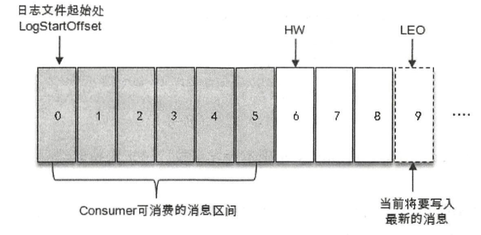


1. **Replica**： 副本（Replication），为保证集群中的某个节点发生故障时， 该节点上的 partition 数据不丢失，且 Kafka仍然能够继续工作， Kafka 提供了副本机制，一个 topic 的每个分区都有若干个副本，一个 leader 和若干个 follower。
2. **Leader**： 每个分区多个副本的“主”，生产者发送数据的对象，以及消费者消费数据的对象都是 leader。
3. **Follower**： 每个分区多个副本中的“从”，实时从 leader 中同步数据，保持和 leader 数据的同步。 leader 发生故障时，某个 Follower 会成为新的 leader。
4. **Zookeeper**：存储Kafka集群信息 ,负责集群元数据管理、控制器的选举等操作

**一些服务端Kafka重要参数**

+ zookeeper.connect:设置要连接的zookeeper集群地址。`zookeeper.connect=localhost1:2181,localhost2:2181`
+ *listeners*:指定broker监听客户端的链接地址列表,`listeners=PLAINTEXT://:9092`.如果有多个地址，使用`,`隔开.支持的协议有PLAINTEXT/SSSL/SASL_SSL等。
+ broker.id:   broker的唯一标志，kafka集群唯一
+ log.dir和log.dirs：配置Kafka日志文件根目录。log.dirs比log.dir优先级高，log.dirs可以设置多个目录，使用`,`分割
+ message.max.bytes: broker可以接受的最大值.


## 06_Kafka安装-启动-关闭

### 1.安装

略

### 2.启动

+ 启动前可以修改`conf`文件夹下的配置
+ 使用`kafka-server-start config/server.properties`启动，注意，这是mac的启动。推荐简单的启动方法，使用homebrew安装，然后使用`brew services start kafka`可以快速启动
+ 如果想要后台运行可以加上`-daemon`

### 3.关闭

直接使用`kafka-server-stop`进行关闭


## 07_Kafka 主题和分区

主题作为消息的归类，可以再细分为一个或多个分区，分区 也可以看作对消息的二次归类。 分区的划分不仅为 Kafka 提供了可伸缩性、水平扩展的功能， 还通过多副本机制来为 Kafka 提供数据冗余以提高数据可靠性 。

从 Kafka 的底层实现来说，主题和分区都是逻辑上的概念，分区可以有一至多个副本，每个副本对应一个日志文件 ，每个日志文件对应一至多个日志分段（ LogSegment ），每个日志分段还可以细分为索引文件、日志存储文件和快照文件等 。

### 1.主题的管理

#### 1.1 创建主题

主题的管理包括创建主题、 查看主题信息、修改主题和删除主题等操作。可以通过 Kafka 提供的 kafka-topics.sh 脚本来执行这些操作,核心代码只有一行

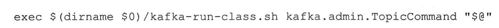

可以看到其实质上是调用了 kafka.admin.TopicCommand 类来执行主题管理的操作 。

如果 broker 端配置参数 `auto .create.topics .enable` 设置为 true （默认值就是 true) , 那么当生产者向一个尚未创建的主题发送消息时，会自动创建一个分区数为 `num . partitions` （默认值为 1 ）、副本因子为 `default.replication.factor` （默认值为 1 ）的主题，当一个消费者开始从未知主题中读取消息时，或者当任意一个客户端向未知主题发送元 数据请求时，都会按照配置参数 num.partitions 和 default.replication .factor 的 值来创建一个相应的主题。

`kafka-topics --create --zookeeper localhost:2181 --topic topic-demo --partitions 1 --replication-factor 1`

- --topic 定义 topic 名,这里建立了一个名字叫`topic-demo`的topic
- --replication-factor 定义副本数
- --partitions 定义分区数

***默认auto.create.topics.enable='true'***

***auto.create.topics.enable='true'***情况

在执行完脚本之后，

Kafka 会在 `log.dir` 或 `log.dirs` 参数所配置的目录下创建相应的主题分区

主题、分区、副本和 Log （日志）的关系如图 4-1 所示， 主题和分区都是提供给上层用户 的抽象， 而在副本层面或更加确切地说是 Log 层面才有实际物理上的存在。 同一个分区中的多 个副本必须分布在不同的 broker 中，这样才能提供有效的数据冗余。

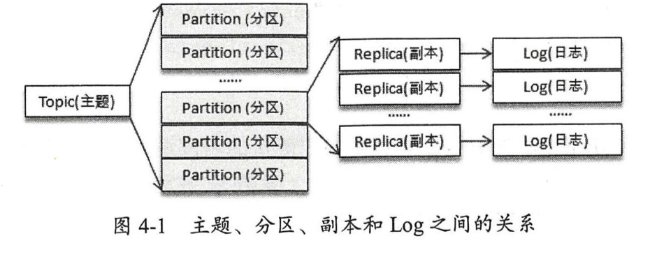

在 kafka-topics.sh 脚本中 对应的还有 `list` 、` describe` 、 `alter` 和 `delete` 这 4 个同级别的指令类型 ， 每个类型所需 要的参数也不尽相同。

还可以通过 describe 指令类型来查看分区副本的分配细节，

`kafka-topics --topic topic-demo --describe --zookeeper localhost:2181`

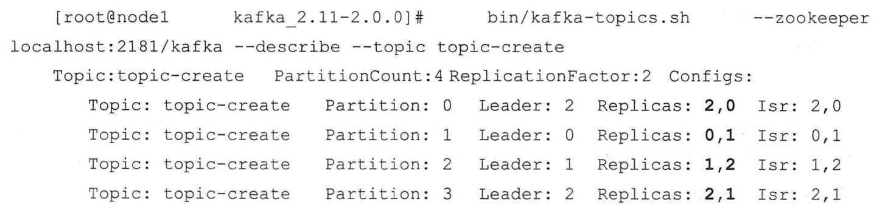

示例中的 Topic 和 Partition 分别表示主题名称和分区号 。 Partition 表示主 题中分区的个数 ， ReplicationFactor 表示副本因子 ， 而 Configs 表示创建或修改主题时 指定的参数配置 。 Leader 表示分区的 leader 副本所对应的 brokerld , Isr 表示分区的 ISR 集合， Replicas 表示分区的所有 的副本分配情况 ，即 AR 集合，其中 的数字都表示的是 brokerld.

`kafka-topics.sh`脚 本中还提 供 了一个`replica - assignment` 参数来手动指定分区副本的分配方案。

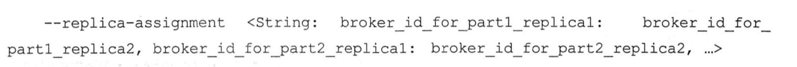

这种方式根据分区号的数值大小按照从小到大的顺序进行排 列 ， 分区与分区之间用 逗号 “，” 隔开， 分区内多个副本用冒号“：”隔开。并且在使用 replica-assignment 参数创建主题时 不需要原本必备 的 partitions 和 replication - factor 这两个参数。

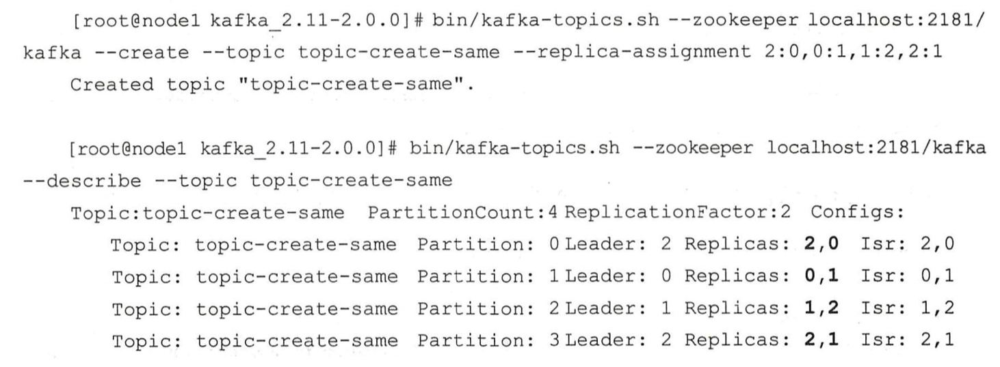

注意同一个分区内的副本不能有重复， 比如指定了 0 : 0 , 1 : 1 这种

在创建主题时我们还可以通过 config 参数来设置所要创建主题的相关参数 ， 通过这个参数可以覆盖原本的默认配置。在创建主题时可以同时设置多个参数

`--config <String : namel=valuel> --config <String:name2=value2>`

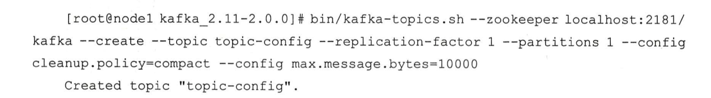

我们再次通过 descr ibe 指令来查看所创建的主题信息：

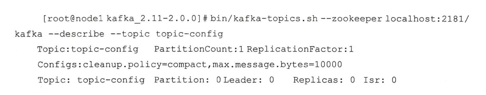

在 kafka-topics.sh 脚本中还提供了一个 if-not-exists 参数 ， 如果在创建主题时带上了这个参 数，那么在发生命名冲突时将不做任何处理（既不创建主题，也不报错）

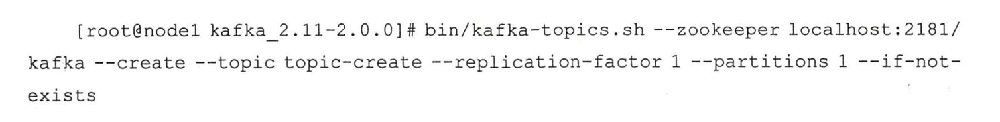

kafka-topics.sh 脚本在创建主题时还会检测是否包含“．”或“－”字符。 为什么要检测这两 个字符呢？ 因 为在 Kafka 的 内部做埋点时会根据主题的名称来命名 metrics 的名称， 并且会将点 号“．”改成下画线 “_’。 假设遇到一个名称为“ topic.1_2 ＇’的主题， 还有一个名称为“ topic_1 .2 ” 的主题， 那么最后的 metrics 的名称都会为“ topic_ 1_2 ”，这样就发生了名称冲突。 举例如下， 首先创建一个以“ topic.1_2 ”为名称的主题， 提示 WARNING 警告 ， 之后再创建“topic. 1_2 ” 时发生 InvalidTopicException 异常。

Kafka 从 0.10.x 版本开始支持指定 broker 的机架信息（机架的名称）。如果指定了机架信息，则在分区副本分配时会尽可能地让分区副本分配到不同的机架上。指定机架信息是通过 broker 端参数 broker . rack 来配置的，比如配置当前 broker 所在的机架为“ RACK1”

`broker.rack=RACKl`

如果一个集群中有部分 broker 指定了机架信息，并且其余的 broker 没有指定机架信息，那 么在执行 kafka-topics.sh 脚本创建主题时会报出的 AdminOperationException 的异常

此时若要成功创建主题 ， 要么将集群中的所有 broker 都加上机架信息或都去掉机架信息 ， 要么使用 `disable-rack- aware` 参数来忽略机架信息 

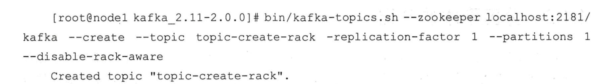

如果集群中 的所有 broker 都有机架信息，那么也可以使用 `disable - rack- aware` 参数来 忽略机架信息对分区副本的分配影响

代码：

```go
func main() {
	config := sarama.NewConfig()

	topicDetial := sarama.TopicDetail{
		NumPartitions:     2,
		ReplicationFactor: 1,
	}

	admin, err := sarama.NewClusterAdmin([]string{"localhost:9092"}, config)
	if err != nil {
		panic(err)
	}
	defer admin.Close()

	err = admin.CreateTopic("topic-demo", &topicDetial, false)
	if err != nil {
		panic(err)
	}
}
```

#### 1.2 分区副本的分配

存疑？


### 2.查看主题

1. 通过了`list`指令可以查看当前所有可用的主题

`kafka-topics --list --zookeeper localhost:2181`

代码实现:

**查看所有Topic**

```go
func main() {
	consumer, err := sarama.NewConsumer([]string{"localhost:9092"}, nil)
	defer consumer.Close()
	if err != nil {
		panic(err)
	}

	topics, err := consumer.Topics()
	if err != nil {
		panic(err)
	}
	for _, topic := range topics {
		fmt.Println("topic:", topic)
	}
}
```

2. --topic还支待指定多个主题，可以和`--describe`结合使用

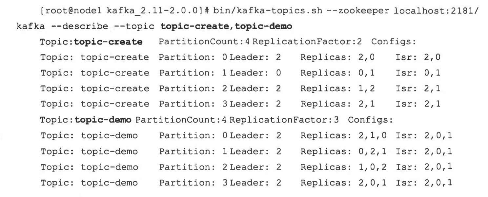

**查看topic详细信息**

```go
func main() {
	client, err := sarama.NewClient([]string{"localhost:9092"}, nil)
	defer client.Close()
	if err != nil {
		panic(err)
	}
  // admin
	admin, err := sarama.NewClusterAdminFromClient(client)
	defer admin.Close()
	if err != nil {
		panic(err)
	}
  // get topics
	topics, err := client.Topics()
	if err != nil {
		panic(err)
	}
  // get describe of topic
	topicsMetadata, err := admin.DescribeTopics(topics)
	if err != nil {
		panic(err)
	}
	for _, metadata := range topicsMetadata {
		fmt.Printf("topic name: %v\n", metadata.Name)
		for _, partition := range metadata.Partitions {
			fmt.Printf("partition: %v, ISR: %v, Replicas: %v, Leader: %v\n", partition.ID, partition.Isr, partition.Replicas, partition.Leader)
		}
	}
}
```

在使用 describe 指令查看主题信息时还可以额外指定 `topics-with-overrides`、 `under-repplicated-partitions`和`unavailable-partitions`这三个参数来增加 一 些 附加功能。

增加`topics-with-overrides`参数可以找出所有包含覆盖配置的主题， 它只会列出包含了与集群不一样配置的主题。

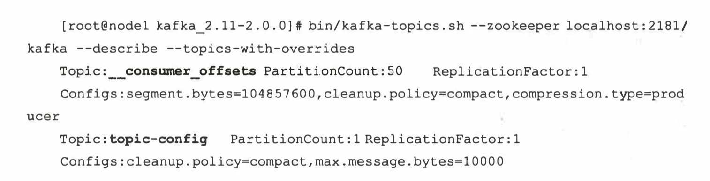

`under-replicated-partitions`和`unavailable-partitions`参数都可以找出有 问题的分区。 通过`under-replicated-partitions` 参数可以找出所有包含失效副本的分区。 包含失效副本的分区可能正在进行同步操作， 也有可能同步发生异常， 此时分区的ISR集 合小于AR集合。

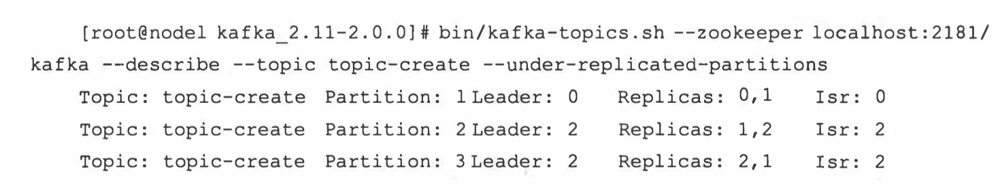

通过`unavailable-partitions`参数可以查看主题中没有leader副本的分区

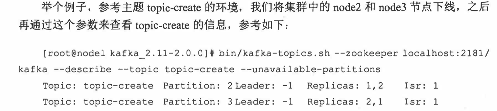

### 3.修改主题

修改的功能就是由`kafka-topics.sh`脚本中的`alter`指令提供的

我们首先来看如何增加主题的分区数。 以前面的主题`topic-config`为例， 当前分区数为1, 修改为3

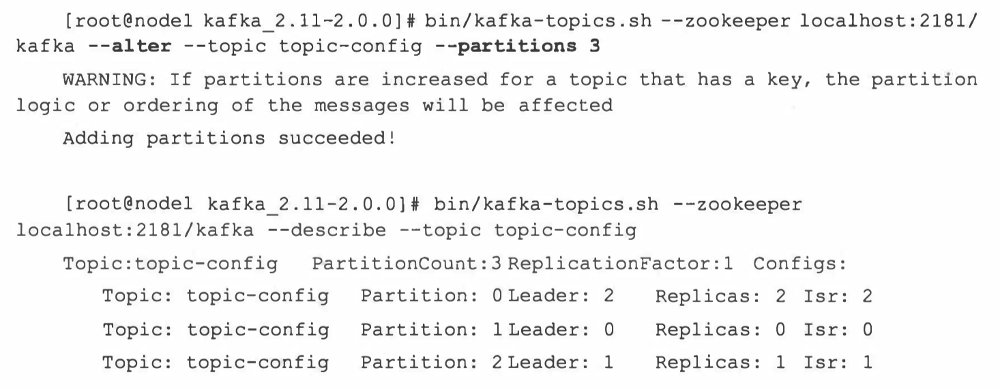

kafka不支持减少分区：

```
按照Kafka现有的代码逻辑， 此功能完全可以实现，不过也会使代码的复杂度急剧增大。 实现此功能需要考虑的因素很多， 比如删除的分区中的消息该如何处理？如果随着分区一起消 失则消息的可靠性得不到保障；如果需要保留则又需要考虑如何保留。 直接存储到现有分区的 尾部， 消息的时间戳就不会递增， 如此对于Spark、Flink这类需要消息时间戳（事件时间）的 组件将会受到影响；如果分散插入现有的分区， 那么在消息量很大的时候， 内部的数据复制会 占用很大的资源， 而且在复制期间， 此主题的可用性 又如何得到保障？与此同时， 顺序性问题、 事务性问题， 以及分区和副本的状态机切换问题都是不得不面对的。 反观这个功能的收益点却 是很低的， 如果真的需要实现此类功能， 则完全可以重新创建一个分区数较小的主题， 然后将 现有主题中的消息按照既定的逻辑复制过去即可。
```

在创建主题时有 一 个`if-not-exists`参数来忽略异常，在这里也有对应的参数 ，如果所要修改的主题不存在 ，可以通过`if-exists`参数来忽略异常

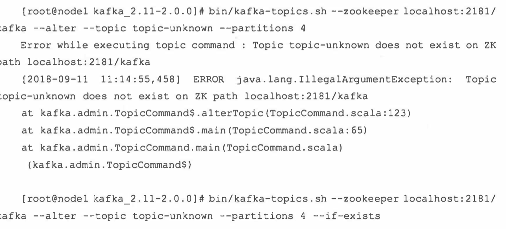

除了修改分区数 ， 我们还可以使用kafka-topics.sh脚本的`alter`指令来变更主题的配置。 在创建主题的时候我们可以通过config参数来设置所要创建主题的相关参数 ， 通过这个参数 可以覆盖原本的默认配置


我们可以通过`delete-config`参数来删除之前覆盖的配置

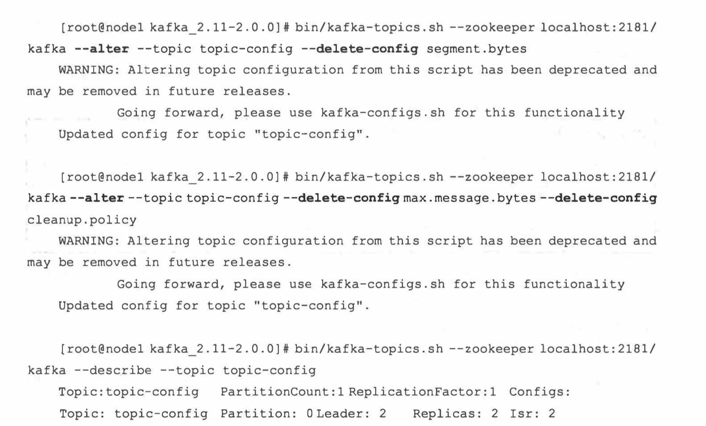

### 4.配置管理

kaflca-configs.sh 脚本是专门用来对配置进行操作的，这里的操作是指在运行状态下修改原有的配置，如此可以达到动态变更的目的。kaflca-configs.sh脚本包含变更配置alter和查看配 一 置describe这两种指令类型。 同使用kaflca-topics.sh脚本变更配置的原则 样， 增、 删、 改 的行为都可以看作变更操作， 不过kafka-configs.sh脚本不仅可以支持操作主题相关的配置， 还 可以支待操作broker、 用户和客户端这3个类型的配置。

kafka-configs.sh脚本使用entity-type参数来指定操作配置的类型，并且使用entity-name 参数来指定操作配置的名称。 比如查看主题 topic-config的配置可以按如下方式执行：

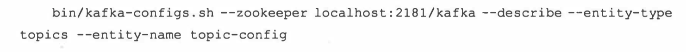

--describe指定了查看配置的指令动作，--entity-type指定了查看配置的实体类型， 一entity - name指定了查看配置的实体名称。 entity-type只可以配置4个值： topics、 brokers 、clients和users

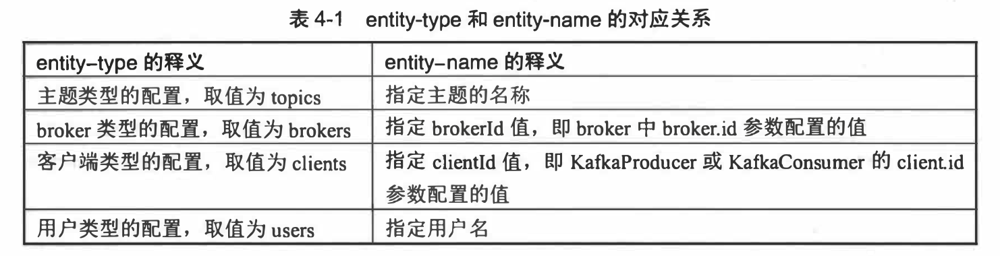

使用alter指令变更配置时，需要配合add-config和delete-config这两个参数 起使用。 add-config参数用来实现配置的增、改，即覆盖原有的配置； delete-config参 数用来实现配置的删， 即删除被覆盖的配置以恢复默认值。

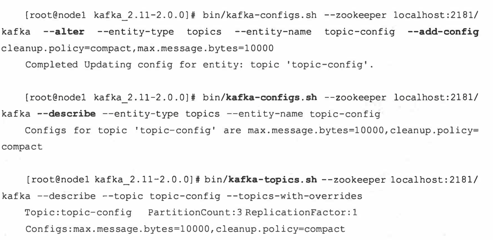

使用delete-con丘g参数删除配置时， 同add-config参数 一 样支持多个配置的操作，多个配置之间用逗号

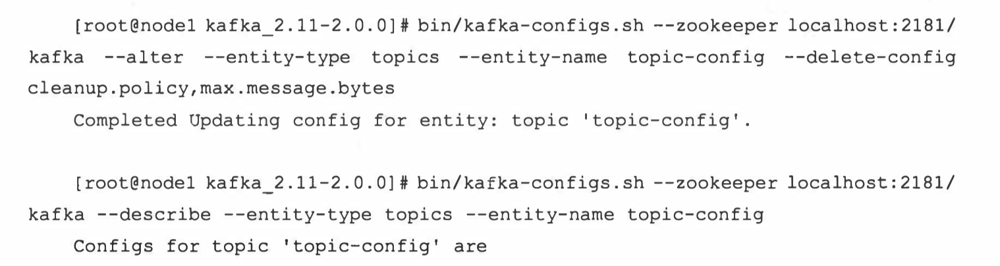

**改变配置**

改变主题端参数配置

```go
func main() {
	client, err := sarama.NewClient([]string{"localhost:9092"}, nil)
	defer client.Close()
	if err != nil {
		panic(err)
	}
	admin, err := sarama.NewClusterAdminFromClient(client)
	defer admin.Close()
	if err != nil {
		panic(err)
	}

	entries := make(map[string]*string)
	value := "60000"
	entries["retention.ms"] = &value
	err = admin.AlterConfig(sarama.TopicResource, "topic-A", entries, false)
	if err != nil {
		panic(err)
	}
	fmt.Println("更改成功")
}

```

### 5.删除Topic

`kafka-topics --delete --zookeeper localhost:2181 --topic topic-demo`

**删除代码**

```go
func main() {
	client, err := sarama.NewClient([]string{"localhost:9092"}, nil)
	defer client.Close()
	if err != nil {
		panic(err)
	}
	admin, err := sarama.NewClusterAdminFromClient(client)
	err = admin.DeleteTopic("topic-A")
	defer admin.Close()
	if err != nil {
		panic(err)
	}
	fmt.Println("删除成功")
}
```

### 6.主题端参数

| 主题端参数                               | 释义                                                         | 对应的broker端参数                       |
| ---------------------------------------- | ------------------------------------------------------------ | ---------------------------------------- |
| cleanup.policy                           | 日志压缩策略。 默认值为 delete, 还可以配 置为compactcompression.type消息的压缩类型。 默认值为producer, 表示 保留生产者中所使用的原始压缩类型。还可 以配置为uncompressed 、 snappy 、 lz4 、 gzip | log.cleanup.policy                       |
| compression.type                         | 消息的压缩类型。 默认值为producer, 表示 保留生产者中所使用的原始压缩类型。还可 以配置为uncompressed 、 snappy 、 lz4 、 gzip | compression.type                         |
| delete.retention.ms                      | 被标识为删除的数据能够保留多久。默认值 为86400000, 即 1 天   | log.cleaner.delete.retention. ms         |
| file.delete.delay.ms                     | 清理文件之前可以等待多长时间，默认值为 60000, 即 l 分钟      | log.segment.delete.delay.ms              |
| flush.messages                           | 需要收集多少消息才会将它们强制刷新到 磁盘， 默认值为Long.MAX_VALUE, 即让 操作系统来决定。建议不要修改此参数的默 认值 | log.flush.interval.messages              |
| flush.ms                                 | 需要等待多久才会将消息强制刷新到磁盘， 默认值为Long.M心又VALUE, 即让操作系 统来决定。 建议不要修改此参数的默认值 | log.flush.interval.ms                    |
| follower.replication.throttled. replicas | 用来配 置 被 限 制 速 率 的 主题所 对 应 的 follower副本列表 | follower.replication.throttled. replicas |
| index.interval.bytes                     | 用来控制添加索引项的频率。每超过这个参 一 数所设置的消息 字节数时就可以添加 个 新的索引项， 默认值为4096 | log.index.interval.bytes                 |
| leader.replication.throttled. replicas   | 用来配置被限制速率的主题所对应的leader 副本列表              | leader.replication.throttled. replicas   |
| max.message.bytes                        | 消息的最大字节数， 默认值为1000012                           | message. max. bytes                      |
| message.format.version                   | 消息格式的版本， 默认值为2.0-IVI                             | log.message.format.version               |
| message.timestamp.difference. max.ms     | 消息中自带的时间戳与broker收到消息时 的 时 间戳之间最 大的差值， 默 认 值 为 Long.MAX_VALUE。此参数只有在meesage. timestamp.type参数设置为CreateTime 时才 有效 | log.message.timestamp. difference.max.ms |
| message.timestamp.type                   | 消息的时间戳类型。 默认值为CreateTime , 还可以设置为ogAppendTime | Llog.message.timestamp. type             |
| min.cleanable.dirty.ratio                | 日志清理时的最小污浊率， 默认值为0.5                         | log.cleaner.mm.cleanable. ratio          |
| min.compaction.lag.ms                    | 日志再被清理前的最小保留时间， 默认值为0log.cleaner.min.compaction. lag.ms分区ISR集合中至少要有多少个副本，默认 值为1 | min.insync.replicas                      |
| min.insync.replicas                      |                                                              |                                          |
| preallocate                              | 在创建日志分段的时候是否要预分配空间， 默认值为false         | log.preallocate                          |
| retention.bytes                          | 分区中所能保留的消息总量， 默认值为-1 , 即没有限制           | log.retention.bytes                      |
| retention.ms                             | 使用delete的日志清理策略时消息能够保留 多长时间， 默认值为604800000, 即 7天。 如果设置为-1, 则表示没有限制 | log.retention.ms                         |
| segment.bytes                            | 日志分段的最大值， 默认值为1073741824, 即 1GBsegment.mdex.bytes日志分段索引的最大值， 默认值为10485760, 即 10MB | log.segment.bytes                        |
| log.index.size.max.bytes                 | 日志分段索引的最大值， 默认值为10485760, 即 10MB             | log.index.size.max.bytes                 |
| segment.jitter.ms                        | 滚动日志分段时，在segment.ms的基础之上 增加的随机数， 默认为0 | log.roll.Jitter.ms                       |
| segment.ms                               | 最长多久滚动一 次日志分段， 默认值为 604800000, 即 7天       | log.roll.ms                              |
| unclean.leader.election.enable           | 是否可以从非ISR集合中选举leader副本， 默认值为false, 如果设置为true, 则可能造 成数据丢失 | unclean.leader.election. enable          |

### 7.kafka-topic脚本的参数

| 参 数名称                     | 释义                                                         |
| ----------------------------- | ------------------------------------------------------------ |
| alter                         | 用于修改主题， 包括分区数及主题的配置                        |
| config <键值对＞              | 创建或修改主题时， 用于设置主题级别的参数                    |
| create                        | 创建主题                                                     |
| delete                        | 删除主题                                                     |
| delete-config <配置名称＞     | 删除主题级别被覆盖的配置                                     |
| describe                      | 查看主题的详细信息                                           |
| disable-rack-aware            | 创建主题时不考虑机架信息                                     |
| help                          | 打印帮助信息修改或删除主题时使用，只有当主题存在时才会执行动作 |
| if-exists                     | 修改或删除主题时使用，只有当主题存在时才会执行动作           |
| if-not-exists                 | 创建主题时使用，只有主题不存在时才会执行动作                 |
| list                          | 列出所有可用的主题                                           |
| partitions <分区数＞          | 创建主题或增加分区时指定分区数                               |
| replica-assignment<分配方案＞ | 手工指定分区副本分配方案                                     |
| replication-factor<副本数＞   | 创建主题时指定副本因子                                       |

### 8.初识KafkaAdminClient

#### 8.1 基本使用

一 般情况下，我们都习惯使用kafka-topics.sh脚本来管理主题，但有些时候我们希望将主题 管理类的功能集成到公司内部的系统中， 打造集管理、 监控、 运维、 告警为 一 体的生态平台， 那么就需要以程序调用API的方式去实现。 本节主要介绍`KafkaAdminClient` 的基本使用方式， 以及采用这种调用API方式下的创建主题时的合法性验证。

KafkaAdmin实现了很多方法

```go
type ClusterAdmin interface {
	// Creates a new topic. This operation is supported by brokers with version 0.10.1.0 or higher.
	// It may take several seconds after CreateTopic returns success for all the brokers
	// to become aware that the topic has been created. During this time, listTopics
	// may not return information about the new topic.The validateOnly option is supported from version 0.10.2.0.
	CreateTopic(topic string, detail *TopicDetail, validateOnly bool) error

	// List the topics available in the cluster with the default options.
	ListTopics() (map[string]TopicDetail, error)

	// Describe some topics in the cluster.
	DescribeTopics(topics []string) (metadata []*TopicMetadata, err error)

	// Delete a topic. It may take several seconds after the DeleteTopic to returns success
	// and for all the brokers to become aware that the topics are gone.
	// During this time, listTopics  may continue to return information about the deleted topic.
	// If delete.topic.enable is false on the brokers, deleteTopic will mark
	// the topic for deletion, but not actually delete them.
	// This operation is supported by brokers with version 0.10.1.0 or higher.
	DeleteTopic(topic string) error

	// Increase the number of partitions of the topics  according to the corresponding values.
	// If partitions are increased for a topic that has a key, the partition logic or ordering of
	// the messages will be affected. It may take several seconds after this method returns
	// success for all the brokers to become aware that the partitions have been created.
	// During this time, ClusterAdmin#describeTopics may not return information about the
	// new partitions. This operation is supported by brokers with version 1.0.0 or higher.
	CreatePartitions(topic string, count int32, assignment [][]int32, validateOnly bool) error

	// Alter the replica assignment for partitions.
	// This operation is supported by brokers with version 2.4.0.0 or higher.
	AlterPartitionReassignments(topic string, assignment [][]int32) error

	// Provides info on ongoing partitions replica reassignments.
	// This operation is supported by brokers with version 2.4.0.0 or higher.
	ListPartitionReassignments(topics string, partitions []int32) (topicStatus map[string]map[int32]*PartitionReplicaReassignmentsStatus, err error)

	// Delete records whose offset is smaller than the given offset of the corresponding partition.
	// This operation is supported by brokers with version 0.11.0.0 or higher.
	DeleteRecords(topic string, partitionOffsets map[int32]int64) error

	// Get the configuration for the specified resources.
	// The returned configuration includes default values and the Default is true
	// can be used to distinguish them from user supplied values.
	// Config entries where ReadOnly is true cannot be updated.
	// The value of config entries where Sensitive is true is always nil so
	// sensitive information is not disclosed.
	// This operation is supported by brokers with version 0.11.0.0 or higher.
	DescribeConfig(resource ConfigResource) ([]ConfigEntry, error)

	// Update the configuration for the specified resources with the default options.
	// This operation is supported by brokers with version 0.11.0.0 or higher.
	// The resources with their configs (topic is the only resource type with configs
	// that can be updated currently Updates are not transactional so they may succeed
	// for some resources while fail for others. The configs for a particular resource are updated automatically.
	AlterConfig(resourceType ConfigResourceType, name string, entries map[string]*string, validateOnly bool) error

	// Creates access control lists (ACLs) which are bound to specific resources.
	// This operation is not transactional so it may succeed for some ACLs while fail for others.
	// If you attempt to add an ACL that duplicates an existing ACL, no error will be raised, but
	// no changes will be made. This operation is supported by brokers with version 0.11.0.0 or higher.
	CreateACL(resource Resource, acl Acl) error

	// Lists access control lists (ACLs) according to the supplied filter.
	// it may take some time for changes made by createAcls or deleteAcls to be reflected in the output of ListAcls
	// This operation is supported by brokers with version 0.11.0.0 or higher.
	ListAcls(filter AclFilter) ([]ResourceAcls, error)

	// Deletes access control lists (ACLs) according to the supplied filters.
	// This operation is not transactional so it may succeed for some ACLs while fail for others.
	// This operation is supported by brokers with version 0.11.0.0 or higher.
	DeleteACL(filter AclFilter, validateOnly bool) ([]MatchingAcl, error)

	// List the consumer groups available in the cluster.
	ListConsumerGroups() (map[string]string, error)

	// Describe the given consumer groups.
	DescribeConsumerGroups(groups []string) ([]*GroupDescription, error)

	// List the consumer group offsets available in the cluster.
	ListConsumerGroupOffsets(group string, topicPartitions map[string][]int32) (*OffsetFetchResponse, error)

	// Delete a consumer group.
	DeleteConsumerGroup(group string) error

	// Get information about the nodes in the cluster
	DescribeCluster() (brokers []*Broker, controllerID int32, err error)

	// Get information about all log directories on the given set of brokers
	DescribeLogDirs(brokers []int32) (map[int32][]DescribeLogDirsResponseDirMetadata, error)

	// Get information about SCRAM users
	DescribeUserScramCredentials(users []string) ([]*DescribeUserScramCredentialsResult, error)

	// Delete SCRAM users
	DeleteUserScramCredentials(delete []AlterUserScramCredentialsDelete) ([]*AlterUserScramCredentialsResult, error)

	// Upsert SCRAM users
	UpsertUserScramCredentials(upsert []AlterUserScramCredentialsUpsert) ([]*AlterUserScramCredentialsResult, error)

	// Close shuts down the admin and closes underlying client.
	Close() error
}
```

### 9. 主题合法性验证

一般情况下， Kafka 生产环境 中的 `auto.create.topics.enable` 参数会被设置为 false ，即自动创建主题这条路会被堵住。 kafka-topics.sh 脚本创建的方式一般由运维人员操作， 普通用户无权过问。那么 KafkaAdminClient 就为普通用户提供了一个“口子”，或者将其集成 到公司内部的资源申请、审核系统中会更加方便 。普通用户 在创建主题的时候，有可能由于误 操作或其他原因而创建了不符合运维规范的主题，比如命名不规范，副本因子数太低等，这些 都会影响后期的系统运维 。 如果创建主题的操作封装在资源申请、 审核系统中，那么在前端就 可以根据规则过滤不符合规范的申请操作 。

Kafka broker 端有－个这样的参数：create.topic.policy.class.name ，默认值为null ，它 提供了一个入口用来验证主题创建的合法性。使用方式很简单，只需要自定义实现 org.apache.kafka.se凹er.policy.CreateTopicPolicy 接口，比如下面示例中的 PolicyDemo 。然后在broker 端的配置文件 config/server.properties 中配置参数 create . topic . policy . class . name 的值为 org.apache.kafka.se凹er.policy.PolicyDemo ， 最后启动服务。

存疑？

### 10.分区管理

包括优先副本的选举、分区重分配、 复制限流、修改副本因子

分区使用多副本机制来提升可靠性， 但只有leader副本对外提供读写服务， 而follower副 本只负责在内部进行消息的同步。如果 一 个分区的leader副本不可用， 那么就意味着整个分区 变得不可用， 此时就需要Kafka从剩余的follower副本中挑选一 个新的leader副本来继续对外 提供服务。 虽然不够严谨， 但从某种程度上说， broker节点中leader副本个数的多少决定了这 个节点负载的高低。

随着时间的更替， Kafka集群的broker节点不可避免地会遇到宅机或崩溃的问题， 当 分区 的leader节点发生故障时， 其中 一 个follower节点就会成为新的leader节点， 这样就会导致集 群的负载不均衡， 从而影响整体的健壮性和稳定性。 当原来的leader节点恢复之后重新加入集 群时， 它只能成为 一个新的follower节点而不再对外提供服务。

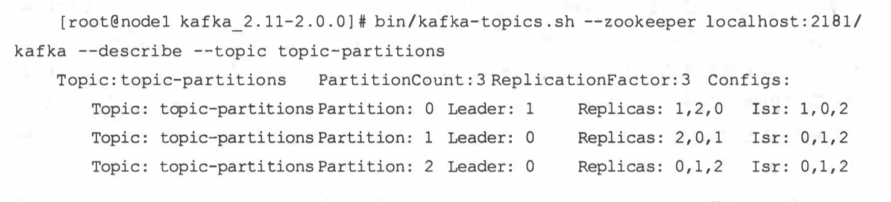

为了能够有效地治理负载失衡的情况，Kafka引入了优先副本(preferred replica) 的 概念 。 所谓的优先副本 是指在 AR 集合列表中的第 一 个副本 。 比如上面 主题 topic-partitions中 分区 0 的AR集合列表 (Replicas)为[1,2 0 , ], 那么分区0 的优先副本即为1。 理想情况下， 优先副 本就是该分区的leader副本， 所以也可以称之为 preferred leader。 Kafka要确保所 有主题的优先 副本在Kafka集群中均匀分布， 这样就保证了所有分区的le ader均衡 分布。 如果leader 分布过 于集中， 就会造成集群 负载不均衡。

所谓的优先副本的选举 是指通过 一 定的方式促使优先副本 选举为 leader副本， 以此来促进 集群的负载均衡， 这 一 分区平衡 行为也可以称为 。

需要注意的是， 分区平衡 并不意味着Kafka集群的负载均衡， 因为还 要考虑集群中的分区 分配 是否均衡。 更进 一 步， 每个 分区的leader副本的负载也是各不相同的 ， 有些leader副本的 负载很高， 比如需要承载TPS为30000 的负荷， 而有些leader副本只需承载个位数的负荷 。 也 就是说， 就算集群中的分区 分配均衡、leader 分配均衡， 也并不能 确保整个集群的负载就是均 衡的， 还需要其他 一 些硬性的指标来做进 一 步的衡量， 这个 会在后面的章节中涉及， 本节只探 讨优先副本的选举。

在Kafka中可以提供分区自动平衡的功能， 与此对应的broker端参数 是 auto.leader. rebalance.enable, 此参数的默认值为tru e , 即默认情况下此 功能是开启的。 如果开启分区 自动平衡的功能， 则Kafka的控制器会启动 一 个定时任务， 这个定时任务会轮询所有的broker 节点， 计算每个broker节点的分区不平衡率(broker中的不平衡率＝非优先副本的leader个数／ 分区总数）是否超过leader.imbalance.per.broker.percentage参数配置的比值， 默认值为10%, 如果超过设定的比值则会自动执行优先副本的选举动作以求分区平衡。 执行 周期由参数leader.imbalance.check.interval.seconds控制， 默认值为300秒， 即 5分钟。

Kafka中kafka-perferred-replica-election.sh脚本提供了对分区leader副本进行重新平衡的功 一 能。优先副本的选举过程是 个安全的过程，Kafka客户端 可以自动感知分区leader副本的变 更。 下面的示例演示了kafka-perferred-replica-election.sh脚本的具体用法：

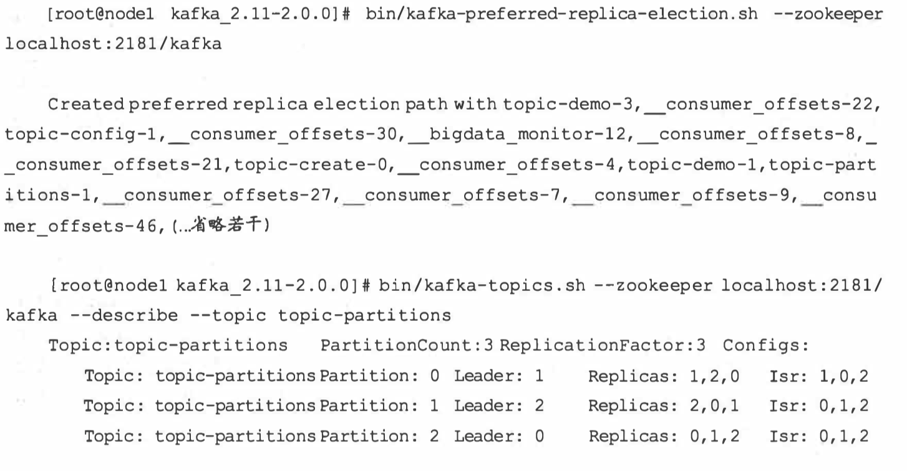

kafka-perferred-replica-election.sh脚本中还提供了path-to-json-file参数来小批量地 对部分分区执行优先副本的选举操作。通过path-to-json-file参数来指定 一 个 JSON 文件， 这个 JSON 文件里保存需要执行优先副本选举的分区清单。

举个例子， 我们再将集群中brokerld为2的节点重启， 不过我们现在只想对主题 topicpart山ons执行优先副本的选举操作， 那么先创建一 个 JSON 文件， 文件名假定为election.json, 文件的内容如下：

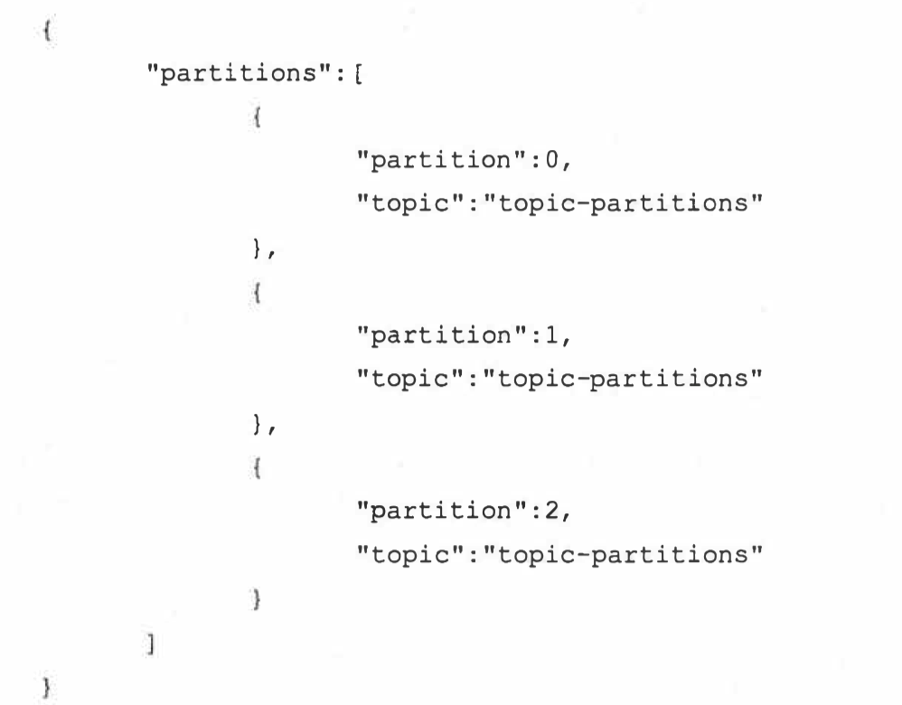

然后通过kafka-perferred-replica-election.sh脚本配合path-to-json-file参数来对主题 topic-partitions执行优先副本的选举操作， 具体示例如下

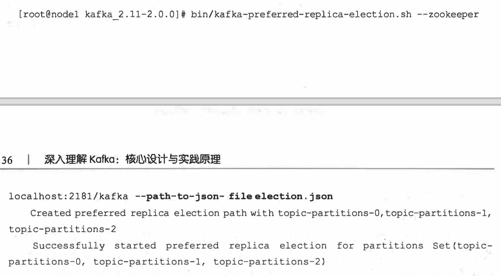

#### 10.1 分区重分配

当集群中的 一 如果节点上的分区是单副本的， 那么这些分区就变 得不可用了， 在节点恢复前， 相应的数据也就处于丢失状态；如果节点上的分区是多副本的， 那么位于这个节点上的leader副本的角色会转交到集群的其他 follower副本中。 总而言之， 这 个节点上的分区副本都已经处于功能失效的状态，Kafka并不会将这些失效的分区副本自动地 迁移到集群中剩余的可用broker节点上， 如果放任不管， 则不仅会影响整个集群的均衡负载， 还会影响整体服务的可用性和可靠性。

当要对集群中的 一 个节点进行有计划的下线操作时， 为了保证分区及副本的合理分配， 我 们也希望通过某种方式能够将该节点上的分区副本迁移到其他的可用节点上。

当集群中新增broker节点时， 只有新创建的主题分区才有可能被分配到这个节点上， 而之 前的主题分区并不会自动分配到新加入的节点中， 因为在它们被创建时还没有这个新节点， 这 样新节点的负载和原先节点的负载之间严重不均衡。

为了解决上述问题，需要让分区副本再次进行合理的分配，也就是所谓的分区重分配。Kafka 提供了kafka-reassign-partitions.sh脚本来执行分区重分配的工作， 它可以在集群扩容、broker节点失效的场景下对分区进行迁移。

kafka-reassign-partitions.sh脚本的使用分为3 个步骤:1.创建包括主题清单的json文件 2.根据主题清单和broker结点重新生成一套方案 3.执行具体的分配动作

下面我们通过 一 个具体的案例来演示kafka-reassign-part山ons.sh脚本的用法。首先在 一 个由 3个节点 (broker 0、broker 1、broker2)组成的集群中创建 一 个主题topic-reassign, 主题中包 含4个分区和2个副本：

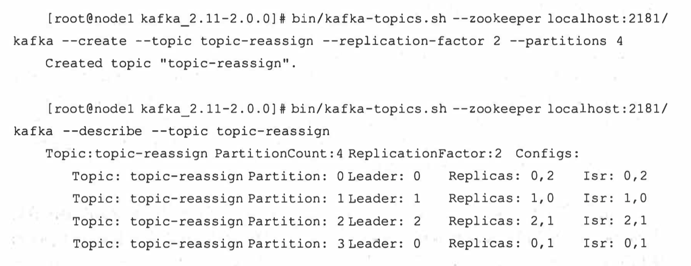

我们可以观察到主题topic-reassi gn 在3个节点中都有相应的分区副本分布。由于某种原因， 我们想要下线brokerld为1的broker 节点 ， 在此之前， 我们要做的就是将其上的分区副本迁移 一 出去。首先创建一份json文件，文件内容为要进行分区重分配的主题清单

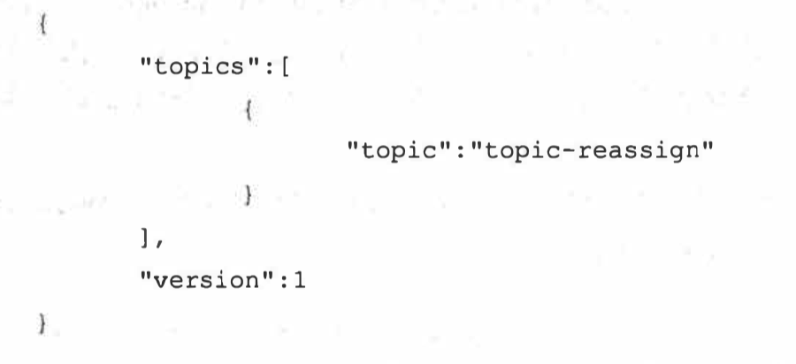

第二步就是根据这个JSON文件和指定所要分配的broker节点列表来生成 配方案， 具体内容参考如下：

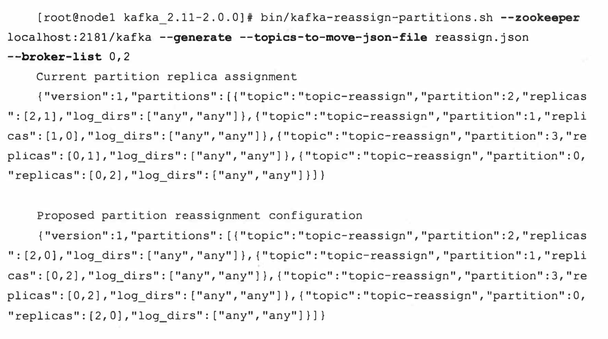

上面的示例中包含4个参数， 其中zookeeper已经很常见了， 用来指定ZooKeeper的地 址。generate是 kafka-reassign -parti tions.sh脚本中指令类型的参数，可以类比于kafk:a-topics.sh 脚本中的create、 巨st等， 它用来生成 一 个重分配的候选方案 。 topic-to-move-json 用来指定分区重分配对应的主题清单文件的路径， 该清单文件的具体的格式 可以归纳为 { " topics " : [{ " topic": " foo"},{ " topic " : " fool"}],"version": 1 }。 broker-list用来指定 所要分配的 broker节点列表， 比如示例中的"0,2"。

上面示例中打印出了两个 JSON 格式的内容。 第 一 个"Current parti tion replica assignment" 所对应的 JSON 内容为当前的分区副本分配情况， 在执行分区重分配的时候最好将这个内容保 存起来， 以备后续的回滚操作。 第二个"Proposed partition reassignment configura tion"所对应的 JSON 内容为重分配的候选方案， 注意这里只是生成 一 份可行性的方案， 并没有真正执行重分 配的动作。 生成的可行性方案的具体算法和创建主题时的 一 样， 这里也包含了机架信息，

我们需要将第二个 JSON 内容保存在 一 个 JSON 文件中，假定这个文件的名称为 project.json。

第三步执行具体的重分配动作

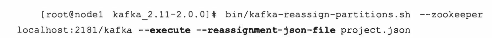

可以看到主题中的所有分区副本都只在0和2的broker节点上分布了。

在第三步的操作 中又多了2个参数，execute也是指令类型的参数，用来指定执行重分配 的动作。 reassignment-json-file指定分区重分配方案的文件路径， 对应于示例中的 project.json文件。

除了让脚本自 动 生成候选方案， 用户还可以自定义重分配方案， 这样也就不需要执行第一  步和第二步的 操作了。

#### 10.2 复制限流

分区重分配本质在于数据复制，先增加新的副本，然后进行数据同 步， 最后删除旧的副本来达到最终的目的。

数据复制会占用额外的资源， 如果重分配的量太大 必然会严重影响整体的性能， 尤其是处于业务高峰期的时候。 减小重分配的粒度， 以小批次的 方式来操作是 一 如果集群中某个主题或某个分区的流量在某段时间内特别 种可行的解决思路。 大， 那么只靠减小粒度是不足以应对的， 这时就需要有 一个限流的机制

副本间的复制限流有两种实现方式：kafka-config.sh脚本和kafka-reassign-partitions.sh脚本

首先， 我们讲述如何通过kafka-config.sh 脚本来实现限流，kafka-config.sh脚本主要以动态配置的方式来达到限流的目的， 在broker级别有两个与复制限 流相关的配置参数： follower.replication.throttled.rate和leader.replication.throttled.rate, 前者用千设置follower副本复制的速度， 后者用来设置leader副本传输的 速度， 它们的单位都是B/s。 通常情况下， 两者的配置值是相同的。

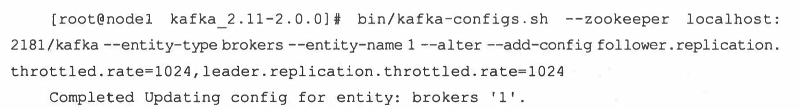

删除刚刚添加的配置也很简单

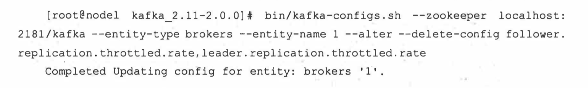

在主题 级别也有两个相关的参数来限制复制的速度：leader.replication.throttled.replicas和follower.replication.throttled.replicas,

它们分别用来配置被限 制速度的主题所对应的leader副本列表和follower副本列表

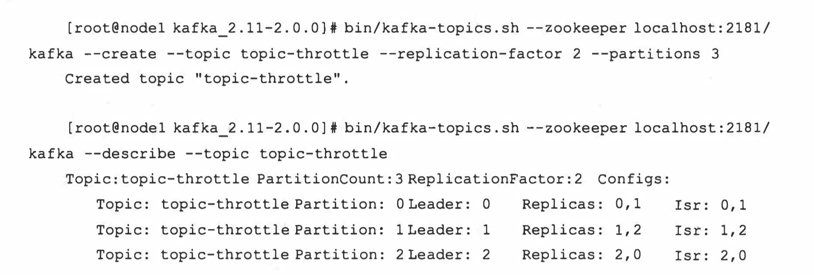

在上面示例中， 主题topic-throttle的三个分区所对应的leader节点分别为0、1、2, 即分区 与代理的映射关系为0:0、1: 1、2:2, 而对应的follower节点分别为1、2、0, 相关的分区与代 理的映射关系为0:1、1:2、 2:0, 那么此主题的限流副本列表及具体的操作细节如下：

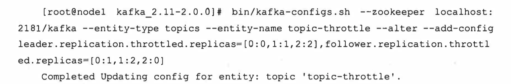

在了解了与限流相关的4个配置参数之后， 我们演示一下带有限流的分区重分配的用法

首先按照4.3.2节的步骤创建 一个包含可行性方案的 pro ject.json文件，

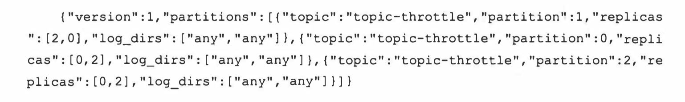

接下来设置被限流的副本列表， 这里就很有讲究了，首先看 一 下重分配前和分配后的分区,副本布局对比， 详细如下：

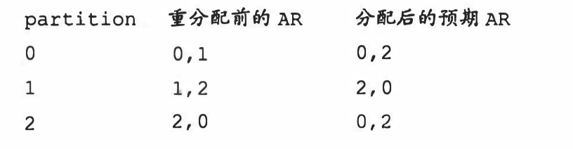

如果分区重分配会引起某个分区AR集合的变更， 那么这个分区中与leader有关的限制会 应用千重分配前的所有副本，因为任何 一 个副本都可能是leader, 而与follower有关的限制会应 用于所有移动的目的地。 从概念上理解会比较抽象， 这里不妨举个例子， 对上面的布局对比而 言， 分区0重分配的AR为[0,1], 重分配后的AR为[0,2], 那么这里的目的地就是新增的2。 也 就是说， 对分区0而言， leader.replication.throttled.replicas配置为[0:0,0:1], follower.replication.throttled.replicas 配置为[0:2]。 同理， 对于分区1 而言， leader.replication.throttled.replicas配置为[1:1,1:2],follower. replication. throttled.replicas配置为[1:O]。 分区3的AR集合没有发生任何变化， 这里可以忽略。

获取限流副本列表之后， 我们就可以执行具体的操作了

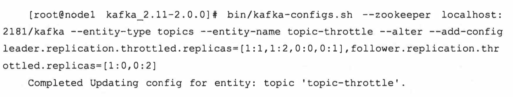

接下来再设置broker2的复制速度为10B/s, 这样在下面的操作中可以很方便地观察限流与 不限流的不同：

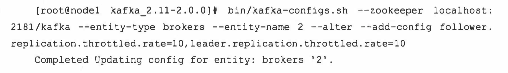

在执行具体的重分配操作之前， 我们需要开启 一 个生产者并向主题topic-throttle中发送一  批消息， 这样可以方便地观察正在进行数据复制的过程

之后我们再执行正常的分区重分配的操作， 示例如下

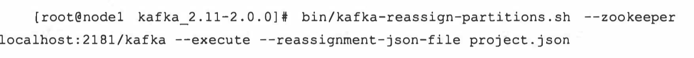

执行之后， 可以查看执行的进度，示例如下：

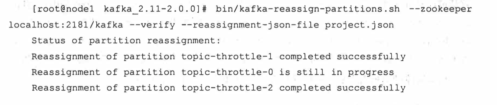

可以看到分区topic-throttle-0还在同步过程中，因 为 我们之前设置了broker 2的复制速度为 10B/s, 这样使同步变得缓慢， 分区topic-throttle-0需要同步数据到位于broker 2的新增副本中。 随着时间的推移， 分区topic-throttle-0最终会变成"completed successful"的状态。

为了不影响Kafka本身的性能， 往往对临时设置的 一 些限制性的配置在使用完后要及时删 除， 而kafka-reassign-partitions.sh脚本配合指令参数verify就可以实现这个功能，在所有的 分区都重分配完成之后执行查看进度的命令时会有如下的信息：

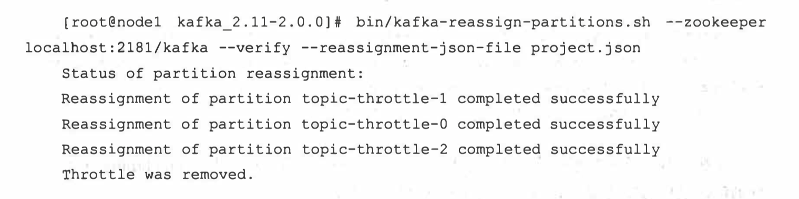

#### 10.3 修改副本因子

创建主题之后我们还可以修改分区的个数， 同样可以修改副本因子（副本数）。 修改副本 因子的使用场景也很多， 比如在创建主题时填写了错误的副本因子数而需要修改， 再比如运行 一段时间之后想要通过增加副本因子数来提高容错性和可靠性。

我们可以自行添加一个副本，可以改成下面的内容

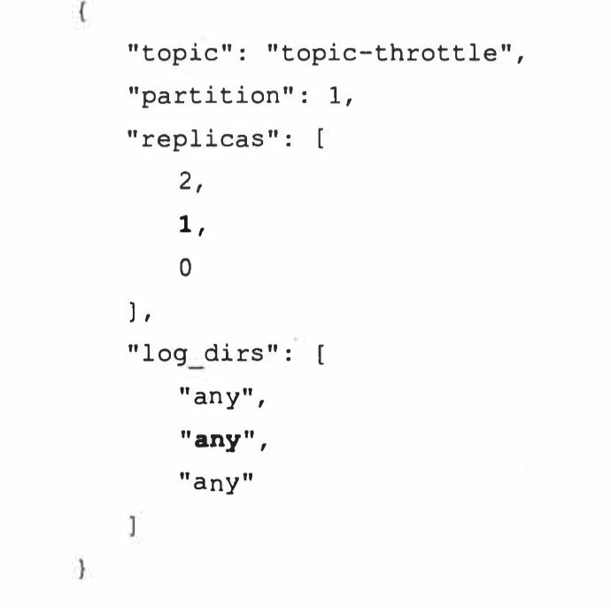

注意增加副本因子时也要在log_dirs中添加一个"any" , 这个log_dirs代表Kafka中的日志目录， 对应于broker端的log.dir或log.dirs参数的配置值， 如果不 需 要关注此方面的细节， 那么可以简单地设置为"any"。

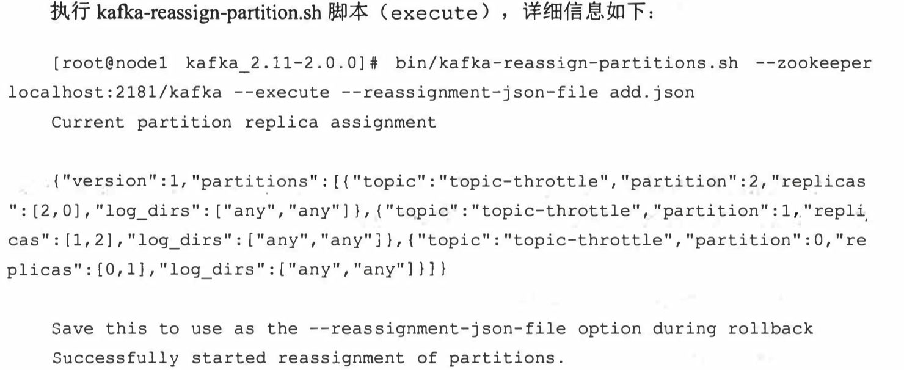

### 11. 如何选择合适的分区数

在Kafka中，性能与分区数有着必然的关系，在设定分区数时一般也需要考虑性能的因素。

对不同的硬件而言，其对应的性能也会不太一样。在实际生产环境中，我们需要了解一套硬件

所对应的性能指标之后才能分配其合适的应用和负荷，所以性能测试工具必不可少。

本节要讨论的性能测试工具是 Kafka 本身提供的用于生产者性能测试的 kafka-produce-perf-test.sh 和用于消费者性能测试的 kafka -consumer-perf-test. sh。

首先我们通过一个示例来了 解一下 kafka-producer-perf-test.sh 脚本的使用。我们向一个只有

l 个分区和 l 个副本的主题 topic-1 中发送 100 万条消息，并且每条消息大小为 1024B ，

对应的 acks 参数为 1. 详细内容参考如下 ：

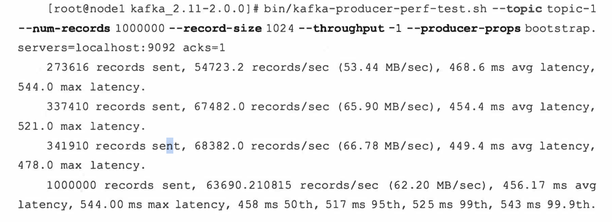

示例中在使用katka-producer-perf-test.sh脚本时用了多一个参数， 其中七opic 用来指定生产者发送消息的目标主题； nurn-records用来指定发送消息的总条数； record-size 用来 设置每条消息的字节数； producer-props 参数用来指定生产者的配置， 可同时指定多组配 置，各组配置之间以空格分隔，与producer-props参数对应的还有 一 个producer.config 参数， 它用来指定生产者的配置文件； throughput 用来进行限流控制， 当设定的值小于0时 不限流， 当设定的值大于0时， 当发送的吞吐量大于该值时就会被阻塞 一段时间。

kafka-producer-perf-test.sh脚本中 还有 一 个有意思的参数print-metrics, 指定了这个参 数时会在测试完成之后打印很多指标信息， 对很多测试任务而言具有 一 定的参考价值。 

#### 11.1 分区数越多吞吐量越高吗

分区是Kafka 中最小的并行操作单元， 对生产者而言， 每 一 个分区的数据写入是完全可以 并行化的；对消费者而言， K afka 只允许单个分区中的消息被 一 个消费者线程消费， 一 个消费 组的消费并行度完全依赖于所消费的分区数。 如此看来， 如果 一 个主题中的分区数越多， 理论 上所能达到的吞吐量就越大， 那么事实真的如预想的 一 样吗？

我们使用 4.4.1节中介绍的性能测试工具来实际测试 一 下。 首先分别创建分区数为1、 20、 50、100、200、500、1000的 主题，对应的主题名称分别 为 topic-I、topic-20、topic-50、topic-100、 topic-200、 topic-500、 topic-I000, 所有主题的副本因子都设置为1 。

消息中间件的性能 一 般是指吞吐量（广义来说还包括延迟）。 抛开硬件资源的影响， 消息写入的吞吐量还会受到消息大小、 消息压缩方式、 消息发送方式（同步／异步） 、 消息确认类型

(acks) 、 副本因子等参数的影响， 消息消费的吞吐量还会受到应用逻辑处理速度的影响。 本 案例中暂不考虑这些因素的影响，所有的测试除了主题的分区数不同， 其余的因素都保持相同。

使用 kafka - producer-perf-test.sh脚本分别向这些主题中发送100万条消息体大小为 1KB的 消息， 对应的测试命令如下：

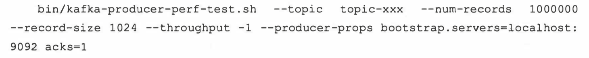

对应的生产者性能测试结果如图4-2所示。 不同的硬件环境， 甚至不同批次 的测试得到的 测试结果也不会完全相同， 但总体趋势还是会保持和图4-2中的 一 样。

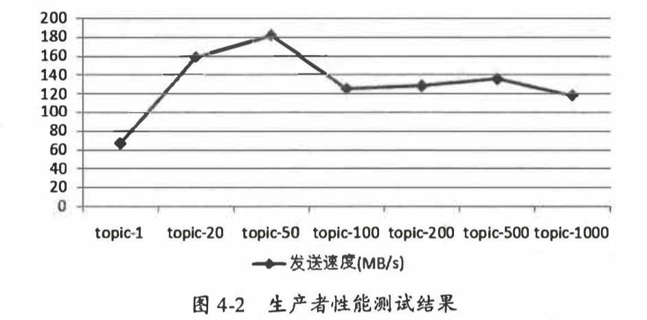

上面针对的是消息生产者的测试， 对消息消费者而言同样有 吞吐量方面的考量。 使用 kafka-consumer-perf-test.sh脚本分别消费这些主题中的100万条消息， 对应的测试命令如下：

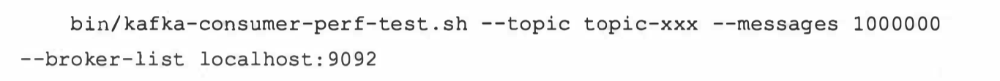

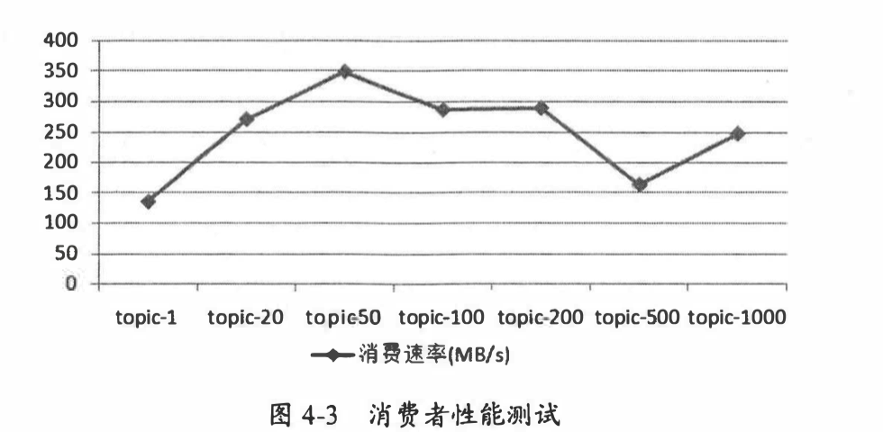


## 08_生产者消费者发送消息

### 1.消费者消费消息

`kafka-console-consumer --bootstrap-server localhost:9092 --topic topic-demo`

+ --bootstrap-server:指定了连接的kafka集群

#### 1.1 消费者组

消费者(Consumer)负责订阅Kaflca 中的主题(Topic), 并且从订阅的主题上拉取消息。 一 与其他 一 些消息中间件不同的是： 在Kaflca 的消费理念中还有 层消费组(Consumer Group) 一 的概念， 每个消费者都有 个对应的消费组。

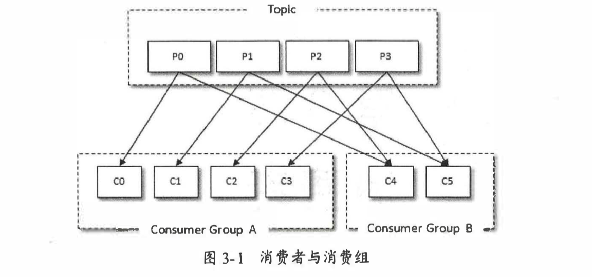

如图3-1所示， 某个主题中共有4个分区(Partition): P0 、 P1、 P2 、 P3。 有两个消费组A 和B都订阅了这个主题， 消费组A中有4个消费者(C0、 C1、 C2 和C3), 消费组B中有2 个消费者(C4和CS)。 按照Kafka默认的规则， 最后的分配结果是消费组A中的每 一 个消费 者分配到1个分区， 消费组B中的每 一 个消费者分配到 2 个分区， 两个消费组之间互不影响。 每个消费者只能消费所分配到的分区中的消息。 换言之， 每 一 个分区只能被 一 个消费组中的一  个消费者所消费。

消费者与消费组这种模型可以让整体的消费能力具备横向伸缩性，我们可以增加（或减少） 消费者的个数来提高（或降低）整体的消费能力。对分区数固定的清况， 一 味地增加消费者 并不会让消费能力 一 直得到提升，如果消费者过多，出现了消费者的个数大于分区个数的清况， 就会有消费者分配不到任何分区。

以上分配逻辑都是基于默认的分区分配策略进行分析的， 可以通过消费者客户端参数 `partition.assignment.strategy`来设置消费者与订阅主题之间的分区分配策略.

消费组是 一 个逻辑上的概念， 它将旗下的消费者归为 一 类，每 一 个消费者只隶属于 一 个消 费组。每 一 个消费组都会有 一 个固定的名称，消费者在进行消费前需要指定其所属消费组的名 称，这个可以通过消费者客户端参数`group.id`来配置， 默认值为空字符串。 消费者并非逻辑上的概念，它是实际的应用实例，它可以是 一 个线程，也可以是 一 个进程。 同 一 个消费组内的消费者既可以部署在同 一 台机器上， 也可以部署在不同的机器上。

#### 1.2 客户端开发

```go
func main() {
	groupId := "group-demo"
	topics := "topic-demo"

	config := sarama.NewConfig()

	/**
	 * Setup a new Sarama consumer group
	 */
	consumer := Consumer{
		ready: make(chan bool),
	}

	ctx, cancel := context.WithCancel(context.Background())
	client, err := sarama.NewConsumerGroup([]string{"localhost:9092"}, groupId, config)
	if err != nil {
		log.Panicf("Error creating consumer group client: %v", err)
	}

	wg := &sync.WaitGroup{}
	wg.Add(1)
	go func() {
		defer wg.Done()
		for {
			// `Consume` should be called inside an infinite loop, when a
			// server-side rebalance happens, the consumer session will need to be
			// recreated to get the new claims
			if err := client.Consume(ctx, strings.Split(topics, ","), &consumer); err != nil {
				log.Panicf("Error from consumer: %v", err)
			}
			// check if context was cancelled, signaling that the consumer should stop
			if ctx.Err() != nil {
				return
			}
			consumer.ready = make(chan bool)
		}
	}()

	<-consumer.ready // Await till the consumer has been set up
	log.Println("Sarama consumer up and running!...")

	sigterm := make(chan os.Signal, 1)
	signal.Notify(sigterm, syscall.SIGINT, syscall.SIGTERM)
	select {
	case <-ctx.Done():
		log.Println("terminating: context cancelled")
	case <-sigterm:
		log.Println("terminating: via signal")
	}
	cancel()
	wg.Wait()
	if err = client.Close(); err != nil {
		log.Panicf("Error closing client: %v", err)
	}
}

// Consumer represents a Sarama consumer group consumer
type Consumer struct {
	ready chan bool
}

// Setup is run at the beginning of a new session, before ConsumeClaim
func (consumer *Consumer) Setup(sarama.ConsumerGroupSession) error {
	// Mark the consumer as ready
	close(consumer.ready)
	return nil
}

// Cleanup is run at the end of a session, once all ConsumeClaim goroutines have exited
func (consumer *Consumer) Cleanup(sarama.ConsumerGroupSession) error {
	return nil
}

// ConsumeClaim must start a consumer loop of ConsumerGroupClaim's Messages().
func (consumer *Consumer) ConsumeClaim(session sarama.ConsumerGroupSession, claim sarama.ConsumerGroupClaim) error {
	// NOTE:
	// Do not move the code below to a goroutine.
	// The `ConsumeClaim` itself is called within a goroutine, see:
	// https://github.com/Shopify/sarama/blob/master/consumer_group.go#L27-L29
	for message := range claim.Messages() {
		log.Printf("Message claimed: value = %s, timestamp = %v, topic = %s", string(message.Value), message.Timestamp, message.Topic)
		session.MarkMessage(message, "")
	}

	return nil
}

```

#### 1.3 必要的参数配置

+ bootstrap . servers:该参数的释义和生产者客户端KafkaProducer 中的相同，用 来指定 连 接 Kafka 集 群所需的 broker 地 址清 单，具体内容形式为 `host:port,host2:post`, 可以设置 一个或多个地址， 中间用逗号隔开
+ group.id:消费者隶属的消费组的名称

#### 1.4 消费消息

Kafka中的消费是基于 拉模式的。消息的消费 一 般有两种模式：推模式和 拉模式。推模式 是服务端主动将消息推送给消费者， 而 拉模式是消费者主动向服务端发起请求来拉取消息。

配置的时候有一个参数`config.Consumer.MaxWaitTime`:用来配置没有消息的时候最大等待时间，默认是250ms

消费者消费到 的每条消息的类型为`ConsumerRecord` (注意与ConsumerRecords 的区别）， 这个和生产者发送的消息类型ProducerRecord相对应，不过ConsumerRecord中的内容更加丰富

#### 1.5 位移提交

对于 Kafka 中的分区而言，它的每条消息都有唯一 的 offset，用来表示消息在分区中对应 的 位置 。 对于消费者而言 ， 它也有一个 offset 的概念，消费者使用 offset 来表示消费到分区中某个 消息所在的位置。

在旧消费者客户端中，消费位移是存储在 ZooKeeper 中的 。 而在新消费者客户端中，消费 位移存储在 Kafka 内 部的主题 `__consumer_offsets` 中 。 这里把将消费位移存储起来（持久化）的 动作称为“提交’3 ，消费者在消费完消息之后需要执行消费位移的提交。

参考图 3-6 的消费位移 ， x 表示某一次拉取操作 中此分 区消息 的最大偏移量 ，假设当前消费 者已经消费了 x 位 置 的消息，那么我们就可以说消费者的消 费位移 为 X ，图中也用了 lastConsumedOffset 这个单词来标识它 。

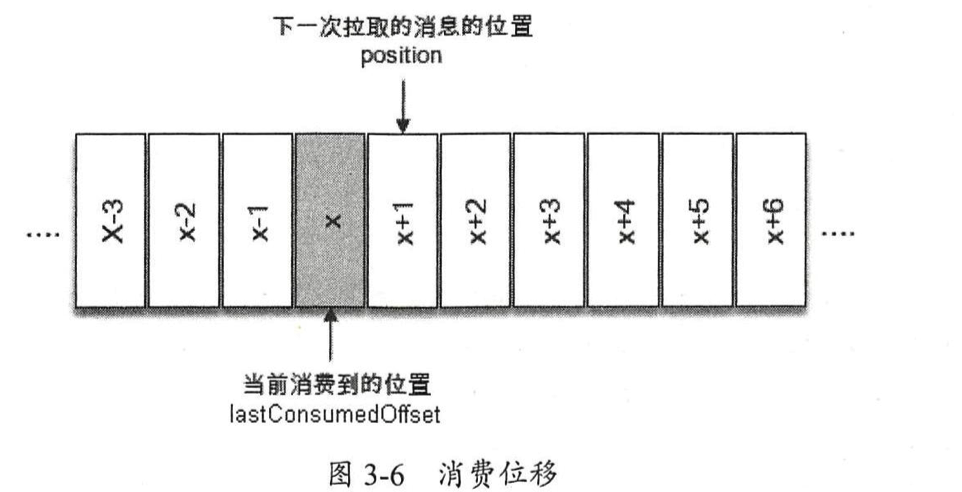

不过需要非常明确的是 ， 当前消费者需要提交的消 费位移并不是 x，而是 x+ 1,在消费者中还有一个 `committed offset` 的概念，它表示已经提交过的消费位移。

在 Kafka 中默认的消费位移的提交方式是自动提交，这个由消费者客户端参数 `enable . auto . commit` 配置，默认值为 true。当然这个默认的自动提交不是每消费一条消息 就提交一次，而是定期提交，这个定期的周期时间由客户端参数 `auto . commit . interval . ms` 配置，默认值为 5 秒，此参数生效的前提是 enable . auto.commit 参数为 true 。

+ 消息丢失:对于位移提交的具体时机的把握也很有讲究，有可能会造成重复消费和消息丢失的现象 。 参考图 3-7 ，当前一次 自动提交操作所拉取的消息集为［x+2, x+7], x+2 代表上一次提交的消费位移， 说明己经完成了 x+1之前（包括 x+1 在内）的所有消息的消费， x+5 表示当前正在处理的位置。 如果拉取到消息之后就进行了位移提交，即提交了 x+8，那么 当 前消费 x+5 的时候遇到了异常， 在故障恢复之后，我们重新拉取的消息是从 x+8 开始的。也就是说， x+5 至 x+7 之间的消息并 未能被消费，如此便发生了消息丢失的现象。
+ 重复消费：位移提交的动作是在消费完所有拉取到的消息之后才执行的，那么当消费 x+5 的时候遇到了异常，在故障恢复之后，我们重新拉取的消息是从 x+2 开始的。也就 是说， x+2 至 x+4 之间的消息又重新消费了 一遍，故而又发生了重复消费的现象 。

#### 1.6 指定位移消费

```go
// 指定最晚
config.Consumer.Offsets.Initial = sarama.OffsetOldest
// 指定最早
config.Consumer.Offsets.Initial = sarama.OffsetNewest
```

#### 1.7 消费者分区再均衡

再均衡是指分区的所属权从一 个消费者转移到另 一 消费者的行为， 它为消费组具备高可用 性和伸缩性提供保障， 使我们可以既方便又安全地删除消费组内的消费者或往消费组内添加消 费者。 不过在再均衡发生期间， 消费组内的消费者是无法读取消息的。 也就是说， 在再均衡发 生期间的这 一 小段时间内， 消费组会变得不可用。 另外， 当一 个分区被重新分配给另 一 个消费 者时， 消费者当前的状态也会丢失。 比如消费者消费完某个分区中的 一 部分消息时还没有来得 及提交消费位移就发生了再均衡操作， 之后这个分区又被分配给了消费组内的另 一 个消费者， 原来被消费完的那部分消息又被重新消费 一 遍， 也就是发生了重复消费。 一 般情况下， 应尽量 避免不必要的再均衡的发生。

再均衡监听器用来设定发生再 均衡动作前后的 一些准备或收尾的动作。

```go
config.Consumer.Group.Rebalance.Strategy
// 需要实现接口
// BalanceStrategy is used to balance topics and partitions
// across members of a consumer group
type BalanceStrategy interface {
	// Name uniquely identifies the strategy.
	Name() string

	// Plan accepts a map of `memberID -> metadata` and a map of `topic -> partitions`
	// and returns a distribution plan.
	Plan(members map[string]ConsumerGroupMemberMetadata, topics map[string][]int32) (BalanceStrategyPlan, error)

	// AssignmentData returns the serialized assignment data for the specified
	// memberID
	AssignmentData(memberID string, topics map[string][]int32, generationID int32) ([]byte, error)
}
```

#### 1.8 消费者拦截器

实现接口

```go
type ConsumerInterceptor interface {

	// OnConsume is called when the consumed message is intercepted. Please
	// avoid modifying the message until it's safe to do so, as this is _not_ a
	// copy of the message.
	OnConsume(*ConsumerMessage)
}
```

#### 1.9 重要的消费者参数

1. fetch.min.bytes:该参数用来配置 Consumer 在一次拉取请求（调用 poll()方法）中能从 Kafka 中拉取的最小 数据量，默认值为 1 ( B ）Kafka 在收到 Consumer 的拉取请求时，如果返回给 Consumer 的数 据量小于这个参数所配置的值，那么它就需要进行等待，直到数据量满足这个参数的配置大小。
2. fetch .max.bytes:该参数与 fetch . max . bytes 参数对应，它用来配置 Consumer 在一次拉取请求中从 Kafka 中拉取的最大数据量，默认值为0，也就是 不限制。
3. fetch.max.wait.ms

这个参数也和 fetch.min . bytes 参数有关，如果 Kafka 仅仅参考 fetch.min.byt e s 参数的要求，那么有可能会一直阻塞等待而无法发送响应给 Consumer， 显然这是不合理的 。 fetch.max.wait.ms 参数用于指定 Kafka 的等待时间

4. receive.buffer.bytes:个参数用来设置 Socket 接收消息缓冲区（ SO_RECBUF)的大小
5. request.timeout.ms:这个参数用来配置 Consumer 等待请求响应的最长时间
6. metadata.max.age.ms:这个参数用来配置元数据的过期时间
7. reconnect.backoff.ms:这个参数用来配置尝试重新连接指定主机之前的等待时间
8. retry.backoff.ms:这个参数用来配置尝试重新发送失败的请求到指定的主题分区 等待时间
9. isolation.level:这个参数用来配置消费者的事务隔离级别。 字符串类型， 有效值为“ read uncommitted" ，和 “ read committed ＂，表示消费者所消费到的位置， 如果设置为“ read committed ”，那么消费 者就会忽略事务未提交的消息， 即只能消费到 LSO ( LastStableOffset ）的位置， 默认情况下为“ read_ uncommitted ”，即可以消 费到 HW (High Watermark ）处的位置
10. 其他参数

| 参数名称                     | 默认值 | 参数释义                                                     |
| ---------------------------- | ------ | ------------------------------------------------------------ |
| bootstrap.servers            |        | 指定连接 Kafka 集群所需的 broker 地址清单                    |
| key.deserializer             |        | 消息中 key 所对应的反序列化类                                |
| value.deserializer           |        | 消息中 key 所对应的反序列化类                                |
| group.id                     |        | 此消费者所隶属的消费组的唯一标识                             |
| client.id                    |        | 消费者客户端的 id                                            |
| heartbeat.interval.ms        | 3000   | 当使用 Kafka 的分组管理功能时， 心跳到消费者 协调器之间的预计时间。心跳用于确保消费者的 会话保持活动状态 ， 当有新消费者加入或离开组 时方便重新平衡 。 |
| session. timeout.ms          | 10000  | 组管理协议中用来检测消费者是否失效的超时时间                 |
| auto.offset.reset            | latest | 参数值为字符串类型，有效值为“ earliest”＂ latest” “ none ”，配置为其余值会报 出 异常 |
| enable.auto.commit           | false  | boolean 类型 ， 配置是否开启自动提交消费位移的 功能          |
| auto.commit.interval.ms      | 5000   | 当 enbale剧to.commit 参数设置为 true 时才生效 ， 表示开启自动提交消费位移功能 时自 动提交消 费位移的时间间 隔 |
| partiton.assignment.strategy |        | 消费者的分区分配策略                                         |


### 2.生产者发送消息

`kafka-console-producer --broker-list localhost:9092 --topic topic-demo`

+ --broker-list:指定连接的Kafka集群地址

```go
import (
	"fmt"
	"github.com/Shopify/sarama"
)

func main() {
	config := sarama.NewConfig()
	// 等待服务器所有副本都保存成功后的响应
	config.Producer.RequiredAcks = sarama.WaitForAll
	// 随机的分区类型：返回一个分区器，该分区器每次选择一个随机分区
	config.Producer.Partitioner = sarama.NewRandomPartitioner
	// 是否等待成功和失败后的响应
	config.Producer.Return.Successes = true
	// 使用给定代理地址和配置创建一个同步生产者
	producer, err := sarama.NewSyncProducer([]string{"localhost:9092"}, config)
	if err != nil {
		panic(err)
	}
	defer producer.Close()

	msg := &sarama.ProducerMessage{
		Topic: "topic-demo",
		Value: sarama.StringEncoder("Hello, Kafka!"),
	}

	partition, offset, err := producer.SendMessage(msg)
	fmt.Printf("Partition = %d, offset=%d\n", partition, offset)
}
```

**ProducerMessage结构体**

```go
sarama.ProducerMessage{
		Topic:     "",	//主题
		Key:       nil,	//键
		Value:     nil,	//值
		Headers:   nil,	//消息头部
		Metadata:  nil,	//元数据
		Offset:    0,		//偏移量
		Partition: 0,		//指定分区
		Timestamp: time.Time{},	//时间戳
	}
```

+ headers:消息的头部，设定一些与应用相关的信息
+ key：可以用来计算分区号让消息发往指定的分区
+ timestamp是消息的时间戳，有`CreateTime`和`LogAppendTime`两种类型

#### 2.1 自定义发送消息的编码

在sarama中有一个接口类型，只要实现这个接口就可以自定义编码

```go
// Encoder is a simple interface for any type that can be encoded as an array of bytes
// in order to be sent as the key or value of a Kafka message. Length() is provided as an
// optimization, and must return the same as len() on the result of Encode().
type Encoder interface {
   Encode() ([]byte, error)
   Length() int
}
// 在发送消息的时候使用  Value: sarama.StringEncoder("Hello, Kafka!"),
```

#### 2.2分区器

如果消息中指定了`Partition`字段，就不需要分区器。否则就需要依赖分区器根据`Key`的值来计算分区。

```go
type Partitioner interface {
	// Partition takes a message and partition count and chooses a partition
	Partition(message *ProducerMessage, numPartitions int32) (int32, error)

	// RequiresConsistency indicates to the user of the partitioner whether the
	// mapping of key->partition is consistent or not. Specifically, if a
	// partitioner requires consistency then it must be allowed to choose from all
	// partitions (even ones known to be unavailable), and its choice must be
	// respected by the caller. The obvious example is the HashPartitioner.
	RequiresConsistency() bool
}

// 在配置config的时候使用  config.Producer.Partitioner=sarama.NewRoundRobinPartitioner
```

#### 2.3 生产者拦截器

生产者拦截器可以在发送之前做一些准备工作，比如过滤不符合要求的消息，修改消息内容，也可以做一些定制化的需求，比如统计的工作.

```go
// ProducerInterceptor allows you to intercept (and possibly mutate) the records
// received by the producer before they are published to the Kafka cluster.
// https://cwiki.apache.org/confluence/display/KAFKA/KIP-42%3A+Add+Producer+and+Consumer+Interceptors#KIP42:AddProducerandConsumerInterceptors-Motivation
type ProducerInterceptor interface {

	// OnSend is called when the producer message is intercepted. Please avoid
	// modifying the message until it's safe to do so, as this is _not_ a copy
	// of the message.
	OnSend(*ProducerMessage)
}

// 设置一个生产者拦截器。
	interceptor := NewOTelInterceptor()
// 可以发现，生产者拦截器可以设置多个
	config.Producer.Interceptors = []sarama.ProducerInterceptor{interceptor}

// 生产者拦截器OTelInterceptor,实现了ProducerInterceptor接口
type OTelInterceptor struct {
	num int //统计发送了多少个
}

func NewOTelInterceptor() *OTelInterceptor {
	oi := OTelInterceptor{}
	return &oi
}

func (oi *OTelInterceptor) OnSend(msg *sarama.ProducerMessage) {
	oi.num++
}

func (oi *OTelInterceptor) GetNum() int {
	return oi.num
}
```

#### 2.4 原理分析

生产者客户端的架构

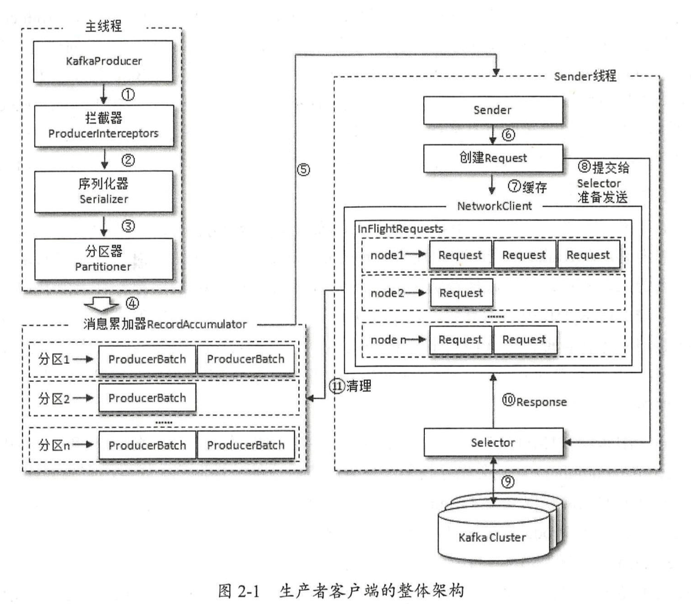

整个生产者客户端由两个线程协调运行，这两个线程分别为`主线程`和 `Sender 线程` （发送线程）。 在主线程中由 KafkaProducer 创建消息， 然后通过可能的拦截器、序列化器和分区器的作 用之后缓存到`消息累加器`（ RecordAccumulator， 也称为消息收集器〉中。 Sender 线程负责从 RecordAccumulator 中 获取消息并将其发送到 Kafka 中 。

`RecordAccumulator `主要用来缓存消息 以便 Sender 线程可以批量发送， 进而减少网络传输 的资源消耗以提升性能 。 RecordAccumulator 缓存的大 小可以通过生产者客户端参数 `buffer . memory` 配置， 默认值为 33554432B ，即 32MB 。 如果生产者发送消息的速度超过发 送到服务器的速度 ，则会导致生产者空间不足， 这个时候 KafkaProducer 的 send（）方法调用要么 被阻塞， 要么抛出异常， 这个取决于参数 `max . block . ms` 的配置， 此参数的默认值为 60000, 即 60 秒 。

主线程中发送过来的消息都会被迫加到 RecordAccumulator 的某个双端队列（ Deque ）中， 在 RecordAccumulator 的内部为每个分区都维护了 一 个双端队列， 队列中的内容就是 `Producer Batch`， 即 `Deque<ProducerBatch＞`。 消息写入缓存时， 追加到双端队列的尾部： Sender读取消息时 ，从双端队列的头部读取。注意 ProducerBatch 不是 ProducerRecord, ProducerBatch 中可以包含一至多个 ProducerRecord。 通俗地说，` ProducerRecord `是生产者中创建的消息，而 `ProducerBatch` 是指一个消息批次 ， ProducerRecord 会被包含在 ProducerBatch 中，这样可以使宇 节的使用更加紧凑。与此同时，将较小的 ProducerRecord 拼凑成一个较大的 ProducerBatch，也 可以减少网络请求的次数以提升整体的吞吐量 。 ProducerBatch 和消息的具体格式有关.如果生产者客户端需要向很多分区发送消息， 则可以 将 buffer . memory 参数适当调大以增加整体的吞吐量 。

消息在网络上都是以字节 Byte 的形式传输的，在发送之前需要创建一块内存区域来保 存对应的消息 。 不过频繁的创建和释放是比较耗费资源的，在 RecordAccumulator 的内部还有一个 BufferPool, 它主要用来实现 ByteBuffer 的复用，以实现缓存的高效利用 。不过 BufferPool 只针对特定大小 的 ByteBuffer 进行管理，而其他大小的 ByteBuffer 不会缓存进 BufferPool 中，这个特定的大小 由 `batch.size` 参数来指定，默认值为 16384B ，即 16KB 。 我们可以适当地调大 `batch.size`参数 以便多缓存一些消息。

ProducerBatch 的大小和 batch . size 参数也有着密切的关系。当一条消息（ProducerRecord) 流入 RecordAccumulator 时，会先寻找与消息分区所对应的双端队列（如果没有则新建），再从 这个双端队列的尾部获取一个 ProducerBatch （如果没有则新建），查看 ProducerBatch 中是否 还可以写入这个 ProducerRecord ，如 果可以 则 写入，如果不可 以则 需要 创 建一个新 的 ProducerBatch。在新建 ProducerBatch 时评估这条消息的大小是否超过 batch . size 参数 的大 小，如果不超过，那么就以 batch . size 参数的大小来创建 ProducerBatch，这样在使用完这 段内存区域之后，可以通过 BufferPool 的管理来进行复用；如果超过，那么就以评估的大小来 创建 ProducerBatch， 这段内存区域不会被复用。

Sender 从 RecordAccumulator 中 获取缓存的消息之后，会进一 步将原本＜分区， Deque< ProducerBatch＞＞的保存形式转变成＜Node, List< ProducerBatch＞的形式，其中 Node 表示 Kafka 集群的 broker 节点 。对于网络连接来说，生产者客户端是与具体 的 broker 节点建立的连接，也 就是 向具体的 broker 节点发送消息，而并不关心消息属于哪一个分区；

在转换成＜Node, List<ProducerBatch＞＞的形式之后， Sender 还 会进一步封装成＜Node, Request>的形式，这样就可以将 Request 请求发往各个 Nod巳了， 这里的 Request 是指 Kafka 的 各种协议请求

请求在从 Sender 线程发往 Kafka 之前还会保存到 InFlightRequests 中，InFlightRequests 保存对象的具体形式为 Map<Nodeld, Deque<R巳quest>＞，它的主要作用是缓存 了已经发出去但还

没有收到响应的请求（ Nodeld 是一个 String 类型，表示节点的 id 编号）。与此同时， InFlightRequests 还提供了许多管理类 的方法，并且通过配置参数还可 以限制每个连接（也就是 客户端与 Node 之间的连接）最多缓存的请求数。这个配置参数为` max.  in . flight.requests . per. connection `，默认值为 5 ，即每个连接最多只能缓存 5 个未响应的请求，超过该数值 之后就不能再向这个连接发送更多的请求了，除非有缓存的请求收到了响应（ Response ）。通 过比较 Deque<Request>的 size 与这个参数的大小来判断对应的 Node 中是否己经堆积了很多未 响应的消息，如果真是如此，那么说明这个 Node 节点负载较大或网络连接有问题，再继续 向 其发送请求会增大请求超时的可能。

#### 2.5 元数据的更新

InFlightRequests 还可以获得 leastLoadedNode ，即所有 Node 中负载最小的 那一个 。这里的负载最小是通过每个 Node 在 InFlightRequests 中还未确认的请求决定的，未确认的请求越多则认为负载越大。 对于图 2-2 中的 InFlightRequests 来说，图中展示了 三个节点Node0、Node1 和 Node2 ，很明显 Nodel 的负载最小 。 也就是说， Node1 为当前的 leastLoadedNode。 选择 leastLoadedNode 发送请求可以使它能够尽快发出(发送元数据更新相关的请求)，避免因网络拥塞等异常而影响整体的进 度。 leastLoadedNode 的概念可以用于多个应用场合，比如元数据请求、消费者组播协议的交互。

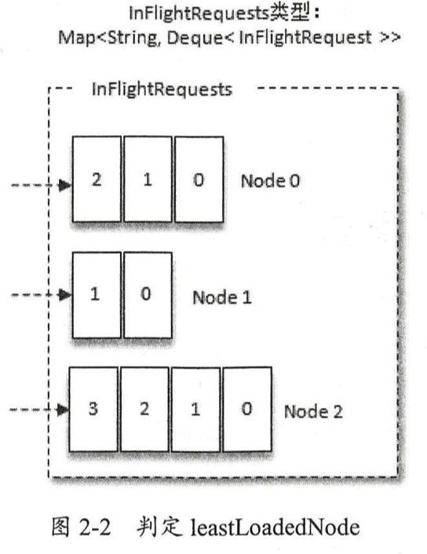


我们前面发送的消息

```go
msg := &sarama.ProducerMessage{
		Topic: "topic-demo",
		Value: sarama.StringEncoder("Hello, Kafka!"),
	}
```

我们只知道主题的名称，对于其他一些必要的信息却一无所知 。 KafkaProducer 要将此消息 追加到指定主题的某个分区所对应的 leader 副本之前，首先需要知道主题的分区数量，然后经 过计算得出（或者直接指定〉目标分区，之后 KafkaProducer 需要知道目标分区的 leader 副本所 在的 broker 节点的地址、端口等信息才能建立连接，最终才能将消息发送到 Kafka，在这一过程中 所需要 的信息都属于元数据信息。

元数据是指 Kafka 集群的元数据，这些元数据具体记录了集群中有哪些主题，这些主题有 哪些分区，每个分区的 lead巳r 副本分配在哪个节点上， follower 副本分配在哪些节点上，哪些副 本在 AR、 ISR 等集合中，集群中有哪些节点，控制器节点又是哪一个等信息。

当客户端中没有需要使用的元数据信息时，比如没有指定的主题信息，或者超 过`metadata . max.age.ms`

时间没有更新元数据都会引起元数据的更新操作 。客户端参数`metadata . max.age.ms` 的默认值为 300000 ，即 5 分钟。元数据的更新操作是在客户端 内部进行的，对客户端的外部使用者不可见 。当需要更新元数据时，会先挑选出 leastLoadedNode, 然后 向这个 Node 发送 MetadataRequest 请求来获取具体的元数据信息。这个更新操作是由 Sender 线程发起 的， 在创建完 MetadataRequest 之后 同样会存入 InFlightRequests ，之后的步骤就和发送 消息时的类似 。 元数据虽然由 Sender 线程负责更新，但是主线程也需要读取这些信息，这里的 数据同步通过 synchronized 和 final 关键字来保障。


#### 2.6 生产者的一些重要参数

1. acks

这个参数用来指定分区中必须要有多少个副本收到这条消息，之后生产者才会认为这条消 息是成功写入的。 acks 是生产者客户端中一个非常重要 的参数 ，它涉及消息的可靠性和吞吐 量之间的权衡 。 a cks 参数有 3 种类型的值（都是字符串类型）。

+ acks = 1 。默认值即为 1 。生产者发送消息之后，只要分区的 leader 副本成功写入消 息，那么它就会收到来自服务端的成功响应 。 如果消息无法写入 leader 副本，比如在 leader 副本崩溃、重新选举新的 leader 副本的过程中，那么生产者就会收到一个错误 的响应，为了避免消息丢失，生产者可以选择重发消息 。如果消息写入 leader 副本并 返回成功响应给生产者，且在被其他 follower 副本拉取之前 leader 副本崩溃，那么此 时消息还是会丢失，因为新选举的 leader 副本中并没有这条对应的消息 。 acks 设置为1，是消息可靠性和吞吐量之 间的折中方案。 
+ acks = 0 。生产者发送消 息之后不需要等待任何服务端的响应。如果在消息从发送到 写入 Kafka 的过程中出现某些异常，导致 Kafka 并没有收到这条消息，那么生产者也 无从得知，消息也就丢失了。在其他配置环境相同的情况下， acks 设置为 0 可以达 到最大的吞吐量。 
+ acks ＝ 一1或 acks =all 。生产者在消 息发送之后，需要等待 ISR 中的所有副本都成功 写入消息之后才能够收到来自服务端的成功响应。在其他配置环境相同的情况下， acks 设置为 -1 (all ）可以达到最强的可靠性。但这并不意味着消息就一定可靠，因 为 JSR 中可能只有 leader 副本，这样就退化成了 acks= 1 的情况。要获得更高的消息 可靠性需要配合 `min.insync.replicas` 等参数的联动，

2. max.request.size

这个参数用来限制生产者客户端能发送的消息的最大值，默认值为 1048576B ，即 10MB 。 一般情况下，这个默认值就可以满足大多数的应用场景了。笔者并不建议读者盲目地增大这个 参数的配置值，尤其是在对 Kafka 整体脉络没有足够把控的时候。因为这个参数还涉及一些其 他参数的联动，比如 broker 端的 `message.max . bytes` 参数，如果配置错误可能会引起一些不 必要的异常 。 比如将 broker 端的 `message . max.bytes` 参数配置为 10 ，而 `max.request . size` 参数配置为 20 ， 那么当我们发送一条大小为 15B 的消息时，生产者客户端就会报出异常

3. retries 和 retry. backoff.ms

retries 参数用来配置生产者重试的次数，默认值为 0，即在发生异常的时候不进行任何 重试动作。消息在从生产者发出到成功写入服务器之前可能发生一些临时性的异常， 比如网络 抖动、 leader 副本的选举等，这种异常往往是可以自行恢复的，生产者可以通过配置 retries 大于 0 的值，以此通过 内 部重试来恢复而不是一昧地将异常抛给生产者的应用程序。 如果重试 达到设定的次数 ，那么生产者就会放弃重试并返回异常。不过并不是所有的异常都是可以通过 重试来解决的，比如消息太大，超过 max . request . size 参数配置的值时，这种方式就不可 行了 。

重试还和另一个参数 retry . backoff.ms 有关，这个参数的默认值为 100 ，

它用来设定

两次重试之间的时间间隔，避免无效的频繁重试。在配置 retries 和 retry . backoff.ms 之前，最好先估算一下可能的异常恢复时间，这样可以设定总的重试时间大于这个异常恢复时 间，以此来避免生产者过早地放弃重试。

Kafka 可以保证同一个分区中的消息是有序的。如果生产者按照一定的顺序发送消息，那 么这些消息也会顺序地写入分区，进而消费者也可以按照同样的顺序消费它们。对于某些应用

来说，顺序性非常重要 ，比如 MySQL 的 binlog 传输，如果出现错误就会造成非常严重的后果 。 如果将 acks 参数配置为非零值，并且 `max . in .flight.requests . per . connection` 参数 配置为大于 l 的值，那么就会出现错序的现象 ： 如果第一批次消息写入失败， 而第二批次消息 写入成功，那么生产者会重试发送第一批次的消息， 此时如果第一批次的消息写入成功，那么 这两个批次的消息就出现了错序 。 一般而言，在需要保证消息顺序的场合建议把参数 max.in.flight . requests . per.connection 配置为 1 ，而不是把 acks 配置为 0， 不过 这样也会影响整体的吞吐。

4. compression.type

这个参数用来指定消息的压缩方式，默认值为“ none ”，即默认情况下，消息不会被压缩。该参数还可以配置为“ gzip ”“ snappy ” 和

“ lz4 ” 。对消息进行压缩可以极大地减少网络传输量 、降低网络 1/0 ，从而提高整体的性能 。消息压缩是一种使用时间换空间的优化方式，如果对 时延有一定的要求，则不推荐对消息进行压缩 。

5. connections.max.idle.ms

这个参数用来指定在多久之后关闭闲置的连接，默认值是 540000（ms），即九分钟

6. linger.ms

这个参数用来指定生产者发送 ProducerBatch 之前等待更多消息（ ProducerRecord ）加入 ProducerBatch 的时间，默认值为 0。生产者客户端会在 ProducerBatch 被填满或等待时间超过 linger . ms 值时发迭出去。增大这个参数的值会增加消息的延迟，但是同时能提升一定的吞 吐量。

7. receive.buffer.bytes

这个参数用来设置 Socket 接收消息缓冲区（ SO_RECBUF ）的大小，默认值为 32768 （ B， 即 32MB。如果设置为-1 ，则使用操作系统的默认值。如果 Producer 与 Kafka 处于不同的机房 ， 则可以适地调大这个参数值 。

8. send.buffer. bytes

这个参数用来设置 Socket 发送消息缓冲区 (SO_RECBUF ）的大小 ，默认值为 131072 (B) , 即 128KB 。与 receive . buffer . bytes 参数一样 ， 如果设置为 -1，则使用操作系统的默认值。

9. request.timeout.ms

这个参数用来配置 Producer 等待请求响应的最长时间，默认值为 3 0000 ( ms ）。请求超时 之后可以选择进行重试。注意这个参数需要 比 broker 端参数 `replica. lag . t ime . max . ms` 的 值要大 ，这样可 以减少因客户端重试而引起的消息重复的概率。

10. 其他参数


| 参数名称                              | 默认值                                                       | 参数释义                                                     |
| :------------------------------------ | ------------------------------------------------------------ | ------------------------------------------------------------ |
| bootstrap.servers                     | ""                                                           | 设定kafka连接的broker地址                                    |
| key.serializer                        | ""                                                           | 消息key的序列化类                                            |
| value.serializer                      | ""                                                           | 消息中value 对应的序列化类， 需要实现接口                    |
| buffer.memory                         | 33554432 (32MB)                                              | 生产者客户端中用于缓存消息的缓冲区大小                       |
| batch.size                            | 16384 (16KB)                                                 | 用于指定ProducerBatch可以复用内存区域的 大小                 |
| client.Id                             | ""                                                           | 用来设定KafkaProducer对应的客户端id                          |
| max.block.ms                          | 60000                                                        | 用 来控制KafkaProducer中send()方 法和 partitionsFor()方法的阻塞时间。 当生产者的发 送缓冲区已满， 或者没有可用的元数据时，这 些方法就会阻塞 |
| partitioner.class                     | org.apache.kafka.clients.producer intemals.DefaultPartitLoner | 用来指定分区器， 需要实现 分区器接口                         |
| enable.idempotence                    | false                                                        | 是否开启幕等性功能                                           |
| max.m.flight.requests. per.connection | 5                                                            | 限制每个连接（也就是客户端与Node之间的 连接）最多缓存的请求数， |
| metadata.max.age.ms                   | 300000 (5分钟）                                              | 如果在这个时间内元数据没有 强制更新， 详见22.2节更新的话会被 |
| Interceptor.classes                   | “”                                                           | 用来指定拦截器                                               |
| transactional.id                      | null                                                         | 设置事物id，必须唯一                                         |

## 09_Kafka日志存储

### 1.文件目录布局

Kafka 中的消息是以主题为基本单位进行归类的， 各个主题在逻辑 上相互独立。 每个主题又可以分为 一 个或多个分区， 分区的数量可以在主题创建的时候指定， 也可以在之后修改。 每条消息在发送的时候会根据分区规则被追加到指定的分区中， 分区中的 每条消息都会被分配 一 个唯 一 的序列号， 也就是通常所说的偏移量(offset )

如果分区规则设置得合理， 那么所有的消息可以均匀地分布到不同的分区中， 这样就可以 实现水平扩展。 不考虑多副本的情况， 一个分区对应 一 个日志(Log)。 为了防止Log过大， Ka住a又引入了日志分段(LogSegment)的概念， 将Log切分为多个LogSegment, 相当于 一 个 巨型文件被平均分配为多个相对较小的文件， 这样也便于消息的维护和清理。 事实上， Log 和 LogSegnient也不是纯粹物理意义上的概念， Log在物理上只以文件夹的形式存储， 而每个 LogSegment对应于磁盘上的 一个日志文件 和两个索引文件

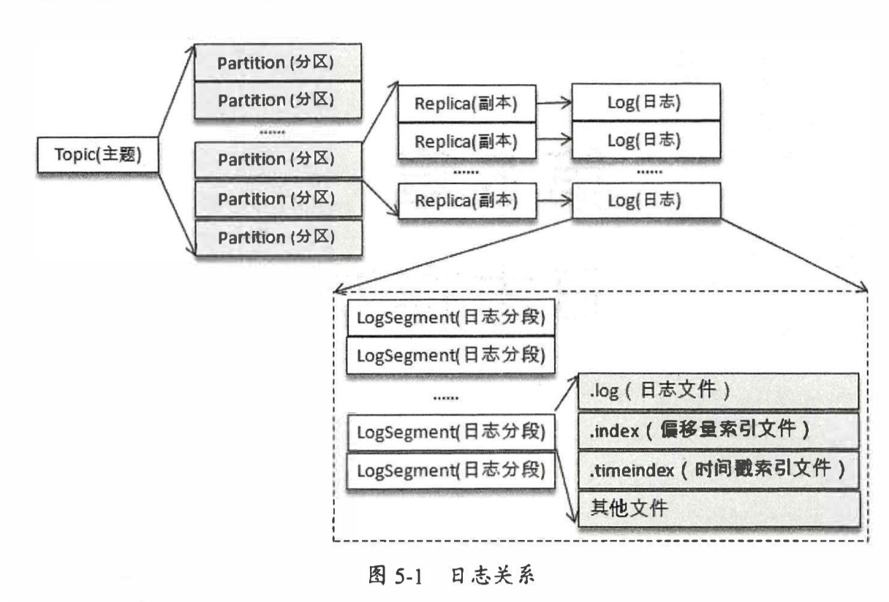

在4.1.1节中我们知道Log对应了 一 个命名形式为<topic > <partition>的文件夹。 举个例子， 假设有 一 个名为"topic-log" 的主题 ， 此主题中具有4 个分区， 那么在实际物理存储上表现为 "topic-log-0" "topic-log-1" "topic-log-2" "topic-log-3"这4个文件夹：

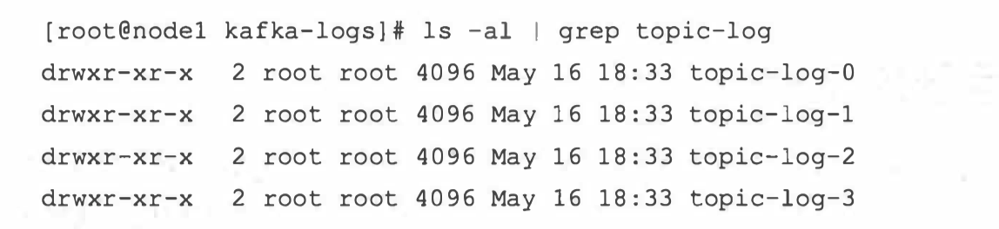

向Log中追加 消息时是顺序写入的， 只有最后 一 个LogSegment才能执行写入操作， 在此 之 前所有的LogSegment都 不能写入数据。 为了方便描述， 我们将最后 一 个LogSegment称为 "activeSegment" , 即表示当前活跃的日志分段。 随着消息的不断写入 ， 当activeSegment满足 一定的条件时 ， 就需要创建新的activeSegment, 之后追加的消息将写入新的activeSegment。

为了便于消息的检索， 每个LogSegment中的日志文件 （以 " .log"为文件后缀）都有对应 的两个索引文件：偏移量 索引文件（以".index"为文件后缀）和时间戳索引文件（以" .timeindex" 为文件后缀） 。 每个LogSegment都有 一 个基准偏移量baseOffset, 用来表示当前LogSegment 中第 一 条消息的offset。 偏移量是 一 个64位的长整型数， 日志文件和两个索引文件都是根据 基 准偏移量(baseOffset)命名 的， 名称固定为20 位数字， 没有达到的位数则用 0 填充。 比如第 一个LogSegment的基准偏移量为0, 对应的日志文件为00000000000000000000.log。

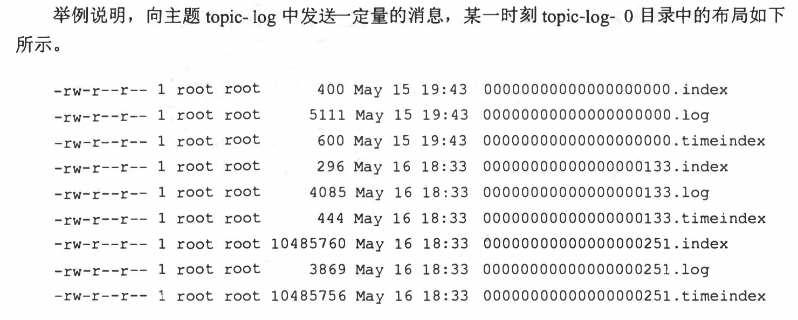

示例中第2个LogSegment对应的基准位移是133, 也说明了该LogSegment中的第 一 条消息的偏移量为133,

注意每个LogSegment中不只包含" .log"".index"".timeindex"这3种文件， 还可能包 含" . deleted"" .cleaned " " .swap " 等临时文件， 以及 可能的" . snapshot"".txnindex" " leader-epoch-checkpoint"等文件。

从更加宏观的视角上看， Katka 中的文件不只上面提及的这些文件， 比如还有 一 些检查点 文件， 当 一个Katka服务第 一次启动的时候， 默认的根目录下就会创建以下 5个文件


消费者提交的位移是保存在 Kafka内部_consume__offset 中的， 初始情况下这个主题并不存在， 当第 一次有消费者消费消息时会自动创建这个主题

在某一 时刻， Kafka中的文件目录布局如图5 -2所示。 每 一 个根目录都会包含最基本的4 个检查点文件(xxx-checkpoint)和meta.properties文件。在创建主题的时候， 如果当前broker 中不止配置了 一 个根目录， 那么会挑选分区数最少的那个根目录来完成本次创建任务。

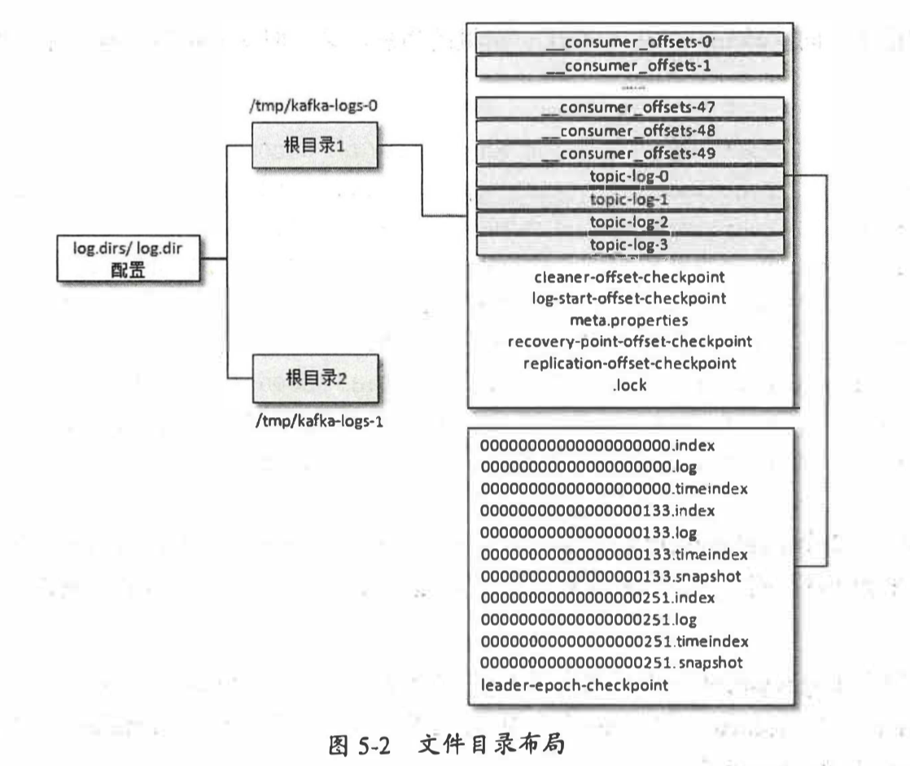

### 2. 日志格式的演变

随着 Kaflca 的迅猛发展， 其消息格式也在不断升级改进， 从 0.8.x 版本开始到现在的 2.0.0 版本， Kaflca 的消息格式也经历了 3 个版本: v0 版本、 v1 版 本和v2版本。

每个分区由内部的每一 条消息组成， 如果消息格式设计得不够精炼， 那么其功能和性能都 会大打折扣。 比如有冗余字段， 势必会不必要地增加分区的占用空间， 进而不仅使存储的开销 变大、网络传输的开销变大，也会使 Kaflca 的性能下降。反观如果缺少字段，比如在最初的 Kaflka 消息版本中没有timestamp字段， 对内部而言， 其影响了日志保存、 切分策略， 对外部而言， 其影响了消息审计、 端到端延迟、 大数据应用等功能的扩展。 虽然可以在消息体内部添加一个 时间戳，但解析变长的消息体会带来额外的开销， 而存储在消息体(参考图5-3中的value字 段)前面可以通过指针偏移量获取其值而容易解析， 进而减少了开销

#### 2.1 v0版本

Kafka消息格式的第一个版本通常称为v0版本， 在Kafka0.10.0之前都采用的这个消息格 式

图5-3中左边的"RECORD"部分就是v0版本的消息格式， 大多数人会把图5-3中左边的 整体(即包括offset和message size字段)都看作消息， 因为每个RECORD(v0和v1 版)必定对应一个offset和message size。 每条消息都有一个offset用来标志它在分 区中的偏移量，这个offset是逻辑值，而非实际物理偏移值， messagesize表示消息的大小， 这两者在一起被称为日志头部(LOG_OVERHEAD), 固定为12B。 LOG_OVERHEAD和RECORD一 起用来描述一条消息

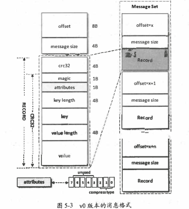

下面具体陈述一下消息格式中的各个字段

+  crc32 (4B) : crc32校验值。 校验范围为magic至value之间。
+ magic(1B) : 消息格式版本号， 此版本的magic值为0。
+ attributes  (1B) : 消息的属性。 总共占1个字节， 低3位表示压缩类型: 0表示NONE、 1表示GZIP、 2表示SNAPPY、 3表示LZ4 (LZ4自Kafka 0.9.x引入)， 其余位保留。
+  key length(4B) : 表示消息的key的长度。 如果为-1, 则表示没有设置key, 即key= null。
+ key: 可选， 如果没有key则无此 字段。
+ value length (4B) : 实际消息体的长度。 如果为-1, 则表示消息 为空。
+ value: 消息体 。 可以为空， 比如墓碑(tombstone) 消息 。

v0版本中 一个消息的最小长度(RECORD_OVERHEAD_VO)为crc32+ magic + attributes+ keylength+valuelength= 4B+1B+1B+4B+4B=14B。 也就是说， v0版本中一条消息的最小长度为14B, 如果小于这个值， 那么这就是 一 条破损的消息而不被接收。

#### 2.2 v1版本

Kafka从0.10.0版本开始到0.11.0版本之前所使用的消息格式版本为v1, 比v0版本就多了

一个timestamp字段， 表示消息的时间戳

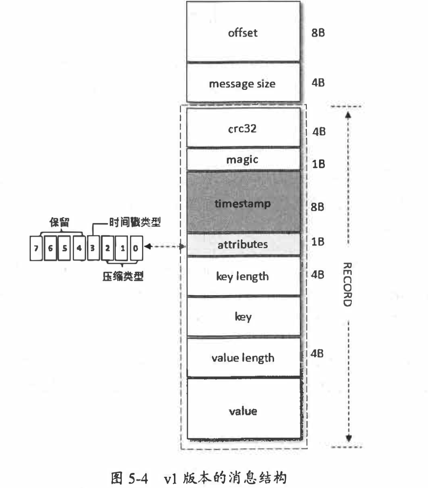

vl版本的magic字段的值为1。 vl版本的attributes字段中的 低3位和v0版本的 样， 还是表示压缩类型而 第4个位(bit)也被利 用了起来：0表示timestamp类型为CreateTime, 而1表示timestamp类型 为LogAppendTime, 其他位保留。 timestamp类型由broker 端参 数log.message.timestamp.type来配置， 默认值为CreateTime, 即采用生产者创建消息时的时间戳

v1版本的消息的最小长度(RECORD_OVERHEAD_V1)要比v0版本的大8个 字节， 即 22B。

#### 2.2 消息压缩

而Kafka实现的压缩方式是将多条消息 一起进行压缩，这样可以保证较好的压缩 效果。

Kafka日志中使用哪种压缩方式是通过参数compression.type来配置的， 默认值为

"producer", 表示保留生产者使用的压缩方式。这个参数还可以配置为"gz ip" "snappy" "lz4", 分别对应GZIP、 SNAPPY、 LZ4这3种压缩算法。如果参数compression.type配置为 "uncompressed" , 则表示不压缩。

以上都是针对消息未压缩的情况， 而当消息压缩时是将整个消息集进行压缩作为内层消息 (inner message),内层消息整体作为外层 (wrapper message) 的value

压缩后的 外层消息(wrapper message)中的key为null, 所以图5-5左半部分没有画出key 字段，value字段中保存的是多条压缩消息 (inner message , 内层消息）， 其中 Record表示的 是从crc32到value的消息格式。 当生产者创建压缩消息的时候， 对内部压缩消息设置的 offset从0开始为每个 内部消息分配offset

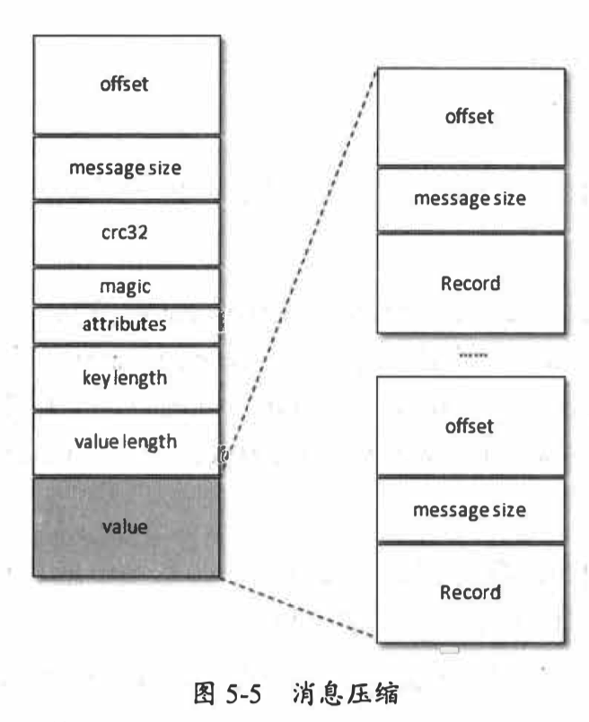

其实每个从生产者发出的消息集中的消息offset都是从0开始的，当然这个offset不能直接 存储在日志文件中， 对offset 的转换是在服务端进行的， 客户端不需要做这个工作。 外层消息 保存了内层消息中最后 一 条消息的绝对位移(absolute offset) , 绝对位移是相对于整个分区而 言的。

参考图5-6, 对于未压缩的情形， 图右内层消息中最后 一 条的offset理应是1030, 但被压 缩之后就变成了5, 而这个1030被赋予给了外层的offset 。 当消费者消费这个消息集的时候， 首先解压缩整个消息集， 然后找到内层消息中最后 一 条消息的inner offset, 根据如下公式找到 内层消息中最后 一 条消息前面的消息的absolute offset (RO表示Relative Offset, IO表示I n ner Offset, 而AO表示Absolute Offset) :

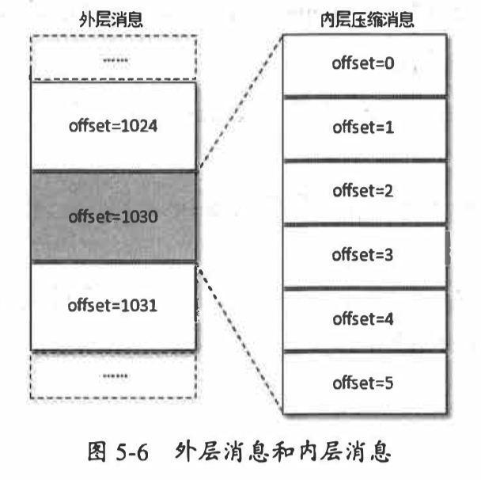

RO = IO of a message - IO of the last message 

AO = AO Of Last Inner Message + RO

在讲述v1 版本的消息 时， 我们了解到v1 版本比 v0 版的消息多了 一 个timestamp字段。 对于压缩的情形， 外层消息的timestamp设置为： • 如果timestamp类型是CreateTime, 那么设置的是内层消息中最大的时间戳。

如果timestamp类型是LogAppendTime, 那么设置的是Kafka服务器当前的时间戳。 内层消息的timestamp设置为：

• 如果外层消息的timestamp类型是CreateTime, 那么设置的是生产者创建消息 时的 时间戳。

• 如果外层消息的timestamp类型是LogAppendTime, 那么所有内层消息的时间戳都 会被忽略。 对attributes 字段而言 ， 它的 times tiamp 位只在外层消息中 设置 ， 内层消息中的 一 timestamp类型 直都是CreateTime 。

#### 2.3 变长字段

Kafka从0.11 .0版本开始所使用的消息格式版本为v2, 这个版本的消息相比v0和 v1的版本 而言改动很大 ， 同时还参考了Protocol Buffe而引入了变长整型(Varints)和ZigZag编码。Varints 是使用 一 个或多个字节来序列化整数的 一 种方法。 数值越小 ， 其占用的字节数就越 少。 Varints中的每个字节都有 一 个位于最高位的msb位(most significant bit) , 除最后 一 个字 节 外， 其余msb位都设置为1, 最后 一 个字节的msb位为0。这个nisb位 表示其后的字节 是否和当前字节起来表示同一个整数.除msb位外， 剩余的7位用于存储数据本身.一个字节 8 位可以表示256个值， 所以称为Ba se 256.而 这里 只能用 7位表示，2的7次方即128。Var ints 中采用的是小端字节序 ，即最小的字节放在最前面。

举个例子， 比如数字1, 它只占 一 个字节 ， 所以msb位为0:

`0000 0001`

再举

一 个复杂点的例子，比如数 字 300:`1010 1100 0000 0010`.300的二进制表示原本为0000 0001 0010 1100 = 256+32+8 +4=300, 那么为什么300的变长 表示为上面的这种形式？

首先去掉每个字节的msb位， 表示如下：

`1010 1100 0000 0010`->`010 1100 000 0010`

如前所述， 使用的是小端字节序的布局方式 ， 所以这里两个字节的位置需要翻转`010 llOO 000 0010`->`000 0010 010 llOO (翻转）`->`000 0010 ++ 010 1100`->`0000 0001 0010 1100 = 256+32+8+4=300`

#### 2.4 v2版本

v2 版本中消息集称为 Record Batch，而不是先前的 Message Set,其内部也包含了一条或多条消息，消息的格式参见图 5-7 的中部和右部。在消息压缩的情形下， Record Batch Header 部 分（参见图 5-7 左部， 从 first offset 到records coun t 字段）是不被压缩的，而被压缩的是 records 字段中的所有内容。。 生产者客户端中的 ProducerBatch 对应这里的RecordBatch,而 ProducerRecord对应这里的 Record.

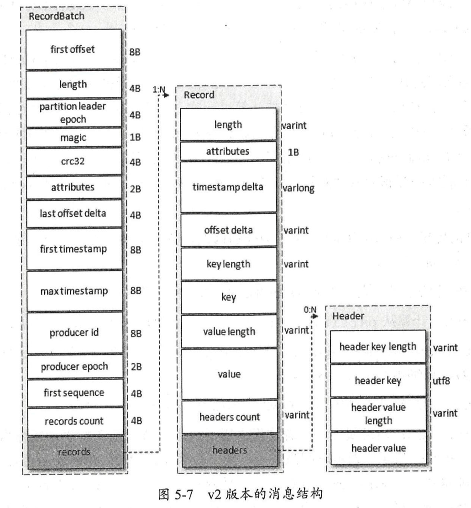

先讲述消息格式 Record 的关键字段， 可以看到内部宇 段大量采用了 Varints ， 这样 Kafka 可 以根据具体的值 来确定需要几个 字节来保存。 v2 版本的消息格式 去掉了 ere 字段， 另外增加了 length （消息总长度〉、 timestamp delta （时间戳增量）、 offset delta （位移增量）和 headers 信息，并且 attributes 字段被弃用了

+ length ：消息总长度 。 
+ attributes ： 弃用， 但还是在消息格 式中占据 1B 的大小， 以备未来的格式 扩展。 
+ timestamp delta ： 时间戳增量。 通常一个 time stamp 需要占用 8 个字节， 如果像 这里一样保存与 RecordBatch 的起始时间戳的 差值， 则可以进一步节 省占用的字节数 。 
+ offset delta ： 位移增量。 保存与 RecordBatch 起始位移的差值 ， 可以节省占用的字节数。
+ headers ：这个字段用来支持应用级别的扩展，而不需要像 v0 和 v1' 版本一样不得不 将一些应用级别的属性值嵌入消息体 。 Header 的格式如图 5-7 最右部分所示，包含 key 和 value ，一个 Record 里面可以包含 0 至多个 Header

对于 v1 版本的消息，如果用户指定的 times tamp 类型是 LogAppendTime 而不是 CreateTime ，那么消息从生产者进入 broker 后， times tamp 字段会被更新，此时消息的 crc 值将被重新计算，而此值在生产者中己经被计算过一次 。 再者， broker 端在进行消息格式转换 时（比如 v1 版转成 v0 版的消息格式〉也会重新计算 crc 的值 。 在这些类似的情况下，消息从 生产者到消费者之间流动时， crc 的值是变动的，需要计算两次 crc 的值，所以这个宇段的设 计在 v0 和 v1 版本中显得比较“鸡肋 .v2版本中crc转移到了RecordBatch中

v2 版本对消息集（ RecordBatch ）做了彻底的修改， 参考图 5-7 最左部分，

+ first offset ：表示当前 RecordBatch 的起始位移 。
+ l ength ：计算从 partition leade repoeh 字段开始到末尾的长度。
+ partition leader epoeh ：分区 leader 纪元，可以看作分区 leader 的版本号或更 新次数，
+ magic ：消息格式的版本号
+ attributes ：消息属性，注意这里占用了两个字节 。 低 3 位表示压缩格式，可以参 考 vO 和 vl ；第 4 位表示时间戳类型；第 5 位表示此 RecordBatch 是否处于事务中，。0 表示非事务， l1表示事务 。 第 6 位表示是否是控制消息 （ ControlBatch ），。表示非控 制消息，而 1 表示是控制消息，控制消息用来支持事务功能
+ last offset delta: RecordBatch 中最后一个 Record 的 offset 与first offset 的差值 。 主要被 broker 用 来确保 RecordBatch 中 Record 组装的正确性
+ first timestamp: RecordBatch 中第一条 Record 的时间戳。
+ max timestamp: RecordBatch 中最大的时间戳， 一般情况下是指最后一个 Record 的时间戳，和 last offset delta 的作用 一样，用来确保消息组装的正确性
+ producer id: PID ，用来支持幂等和事务
+ producer epoch ：和 producer id 一样，用来支持幕等和事务
+ first sequence ：和 producer id producer epoeh 一样,支持幂等性和事务
+ records count : RecordBatch 中 Record 的个数。

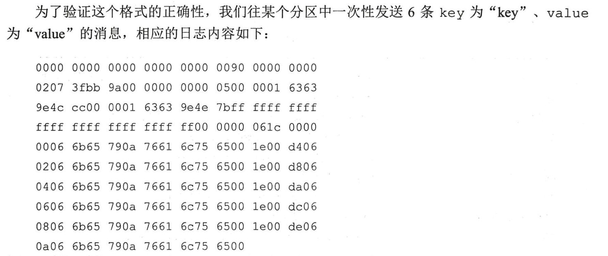


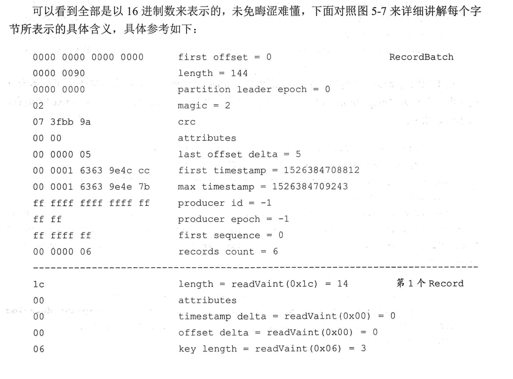

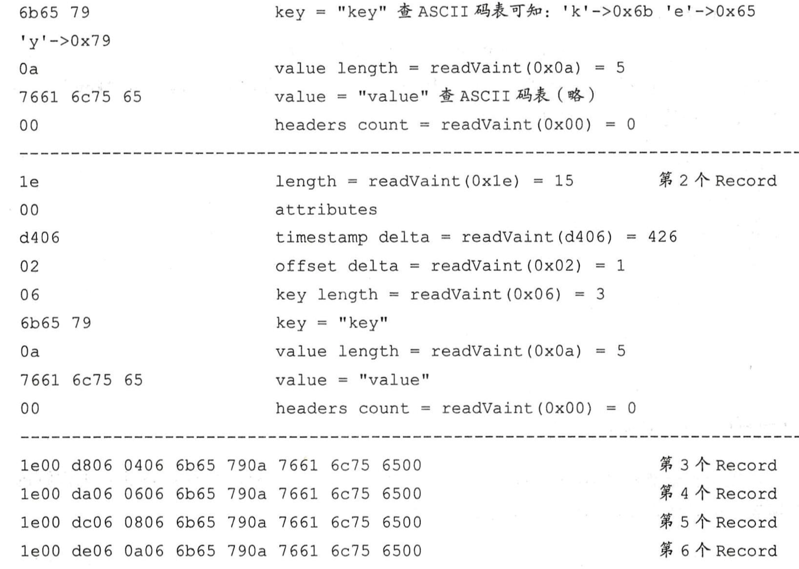

#### 2.5 日志索引

偏移量索引文件用来建立消息偏移量（ offset ）到物理地址之间的映射关系，方便快速定位消息 所在的物理文件位置；时间戳索引文件则根据指定的时间戳（ timestamp ）来查找对应的偏移量 信息。

Kafka 中的索引文件以稀疏索引（ sparse index ）的方式构造消息的索引，它并不保证每个 消息在索引文件中都有对应的索引 项。 每当写入一定量（由 broker 端参数 log.index. interval.bytes 指定，默认值为 4096 ，即 4KB ）的消息时，偏移量索引文件和时间戳索引 文件分别增加一个偏移量索引项和时间戳索引项，增大或减小 log.index.interval.bytes 的值，对应地可以增加或缩小索引项的密度。

稀疏索引通过 MappedByteBuffer 将索引文件映射到内存中，以加快索引的查询速度。偏移量索引文件中的偏移量是单调递增的，查询指定偏移量时，使用二分查找法来快速定位偏移量的位置，如果指定的偏移量不在索引文件中，则会返回小于指定偏移量的最大偏移量 。 时间戳 索引文件中的时间戳也保持严格的单调递增，查询指定时间戳时，也根据二分查找法来查找不 大于该时间戳的最大偏移量，至于要找到对应的物理文件位置还需要根据偏移量索引文件来进 行再次定位。稀疏索引的方式是在磁盘空间、内存空间、查找时间等多方面之间的一个折中。

本章开头也提及日志分段文件达到一定的条件时需要进行切分，那么其对应的索引文件也 需要进行切分。日志分段文件切分包含以下几个条件，满足其一 即可 。

( 1) 当前日志分段文件的大小超过了 broker 端参数 log.segment . bytes 配置的值。log.segment.bytes 参数的默认值为 1073741824 ，即 1GB 。

(2 ）当前日志分段中消息的最大时间戳与当前系统的时间戳的差值大于 log.roll .ms或 log.roll.hours 参数配置的值。如果同时配置了 log.roll.ms 和 log.roll.hours 参数，那么 log.roll.ms 的优先级高。 默认情况下，只配置了 log.ro ll.hours 参数，其值为 168,即 7 天。

(3 ）偏移量索引文件或时间戳索引文件的大小达到 broker 端参数 log . index.size .max. bytes 配置的值。 log.index . size .max ·. bytes 的默认值为 10485760 ，即 10MB 。

(4 ）追加的消息的偏移量与当前日志分段的偏移量之间的差值大于 Integer.MAX_VALUE, 即要追加的消息的偏移量不能转变为相对偏移量（ offset - baseOffset > Integer.MAX_VALUE ）。

对非当前活跃的日志分段而言，其对应的索引文件内容己经固定而不需要再写入索引项， 所以会被设定为只读 。 而对当前活跃的日志分段 (activeSegment ）而言，索引文件还会追加更多的索引项，所以被设定为可读写。在索引文件切分的时候， Kafka 会关闭当前正在写入的索 引文件并置为只读模式，同时以可读写的模式创建新的索引文件，索引文件的大小由 broker 端参数log . index.size .max.bytes配置。

##### 2.5.1 偏移量索引

偏移量索引项的格式如图 5-8 所示。每个索引项占用 8 个字节，分为两个部分。 

( 1 ) relativeOffset：相对偏移量，表示消息相对于 baseOffset 的偏移量，占用 4 个字节 ， 当前索引文件的文件名即为 baseOffset 的值。 

( 2) position：物理地址，也就是消息在日志分段文件中对应的物理位置，占用 4 个字节。

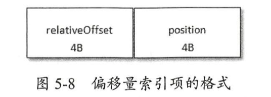

消息的偏移量（ offset ）占用 8 个字节，也可以称为绝对偏移量 。 索引项中没有直接使用绝

对偏移量而改为只占用 4 个字节的相对偏移量 CrelativeOffset =offset - baseOffset），这样可以 减小索引文件占用的空间。举个例子 ， 一个日志分段的 baseOffset 为 32 ，那么其文件名就是 00000000000000000032.log, offset 为 35 的消息在索引文件中的 relativeOffset 的值为 35-32=3 。

##### 2.5.2 时间戳索引

时间戳索引项的格式如图 5-11 所示

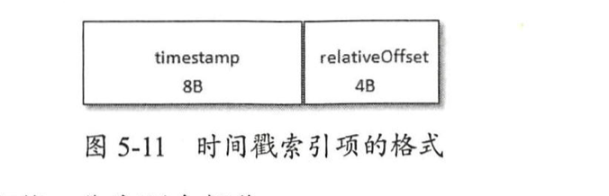

每个索 引 项占用 12 个字节， 分为两个部分。

( 1 ) timestamp ： 当前日志分段最大的时间戳。 ( 2) relativeOffset：时间戳所对应的消息的相对偏移量。 时间戳索引文件中包含若干时间戳索引项 ， 每个追加的时间戳索引项中的 timestamp 必须 大于之前追加的索引项的 timestamp ，否则不予追加 。 如果 broker 端参数 log . message . timestamp . type 设置为 LogAppendTime， 那么消息的时间戳必定能够保持单调递增；

与偏移量索 引 文件相似， 时间戳索 引 文件大小必须是索引项大小（ 12B ）的整数倍， 如果 不满足条件也会进行裁剪。 同样假设 broker 端参数 log . index . size . max.bytes 配置为 67 , 那么对应于时间戳索引文件， Kafka 在内部会将其转换为 60 。

#### 2.6 日志清理

Kafka 将 消息存储在磁盘中，为了 控制磁盘占用空间的不断增加就需要对消息做 一 定的清 理操作。 Kafka 中 每 一 个分区副本都对应 一 个 Log, 而Log又可以分为多个日志分段， 这样也 便于日志的清理操作。 Kafka提供了两种日志清理策略。

(1)日志删除(LogReten tion): 按照 一 定的保留策略直接删除不符合条件的日志分段。

(2)日志压缩 (LogCompaction): 针对每个消息的key进行整合， 对千有相同 key的不 同value 值， 只保留 最后 一 个版本。

我们可以通过broker端参数log.cleanup.policy来设置 日志清理策略，此参数的默认 值为" delete " , 即采用日志删除的清理策略。 如果要采用日志压缩的清理策略， 就需要将 log.cleanup.policy设置为"compact" , 并且还需要将log.cleaner.enable (默认值 为true )设定为true。 通过将log.cleanup.policy参数 设置为"del ete,compact" , 还可以 同时支持日志删除和日志压缩两种策略。 日志清理的粒度可以控制到主题级别， 比如与 log.cleanup.policy 对应的主题级别的参数为cleanup.policy

##### 2.6.1日志删除

在Kafka 的日志管理器中会有一 个专门的日志删除任务来周期性地检测和删除不符合 保留条 件的日志分段文件，这个周期可以通过broker端参数`log.retention.check.interval.ms`配置

来配置 ，默认值为3 00000, 即5分钟。当前日志分段的保留策略有3种：基于时间 的保留策略、基于日志大小的保留策略 和基于日志起始偏移量的保留策略。

1. 基于时间：日志删除任务会检查当前日志文件中是否有保留时间超过设定的阙值(retentionMs)来寻 找可删除的日志分段文 件集合(deletableSegments) , 如图5-13 所示。retentionMs 可以通过 broker 端参数log.retention.hours、log.retentien.minutes和log.retention.ms来配 置 ， 其 中 log.retention.ms 的优先级最 高 ， log.retention.minutes 次之， log.retention.hours最低。 默认情况下只配置 了log.retention.hours参数， 其值为 168, 故默认情况下日志分段文件的保留时间为7天。

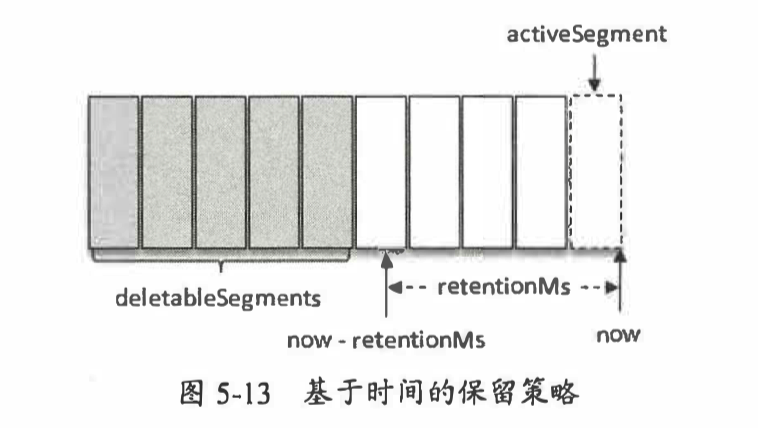

查找过期的日志分段文件，并不是简单地根据日志分段的最近修改时间 lastModifiedTime 来计算的， 而是根据日志分段中最大的时间戳largestTimeStamp来计算的。 因为日志分段的 lastModifiedTime可以被有意或无意地修改， 比如执行了touch操作 ， 或者分区副本进行了重新 分配， lastModifiedTime并不能真实地反映出日志分段在磁盘的保留时间。要获取日志分段中的 最大时间戳largestTimeStamp的值， 首先要查询该日志分段所对应的时间戳索引文件，查找 时 间戳索引文件中最后 一 条索引项， 若最后 一 条索引项的时间戳字段值 大于0,则取其值， 否则 才设置为最近修改时间 lastModifiedTime 。

若待删除的日志分段的总数等于该日志文件中所有的日志分段的数量， 那么说明所有的日 志分段都已过期， 但该日志文件中还要有 一 个日志分段用来接收消息的写入， 即必须要 保证有 一个新的日志分段作为 个活跃的日志分段activeSegment, 在此种情况下， 会先切分出 一 activeSegment, 然后执行删除操作。

删除日志分段时，首先会从Log对象中所维护日志分段的跳跃表中移除待删除的日志分段， 以保证没有线程对这些日志分段进行读取操作。 然后将日志分段所对应的所有文件添加上 ".deleted"的后缀（当然也包括对应的索引文件）。 最后交由 一 个以"delete-file"命名的延迟 任务来删 除这些 以 " . de l eted "为 后 缀的 文 件 ， 这个任务的 延 迟执 行 时间可 以 通 过 file.delete.delay.ms参数来调配， 此参数的默认值为60000, 即1 分钟。

2. 基于日志大小

日志删除任务会检查当前日志的大小是否超过设定的阀值 (retentionSize)来寻找 可删除的 日志分段的文件集合(deletableSegments), 如图5-14所示。retentionSize可以通过 broker端参 数log.retention.by 七 es来配置 ，默认值为-1 , 表示无穷大。注意log.re tention.bytes 配置的是Log中所有日志文件的总大小， 而不是单个日志分段（确切地说应该为log 日志文件） 的大小。

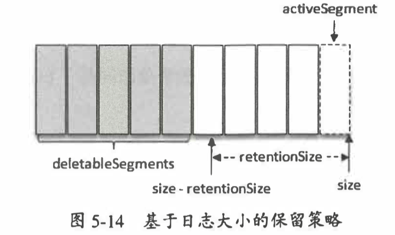

3. 基于日志起始偏移量

般情况下， 日志文件的起始偏移量 logStartOffset等于第 一 个日志分段的baseOffset

基于日志起始偏移量的保留策略的判断依据是某日志分段的下一 个日志分段的起始偏移量 baseOffset 是否小于等于logStartOffset, 若是， 则可以删除此日志分段。假设 logStartOffset等于25

(1 )从头开始遍历每个日志分段 ， 日志分段1 的下 一 个日志分段的起始偏移量为11, 小 于logStartOffset的大小， 将日志分段 l加入deletableSegments。

(2)日志分段2的下 一 个日志偏移量的起始偏移量为23, 也小于logStartOffset的大小， 将日志分段2页 加入deletableS egments。

(3)日志分段3的下 一 个日志偏移量在logStartOffset的右侧， 故从日志分段3开始的所 有日志分段都不会 加入deletableSeg ments。

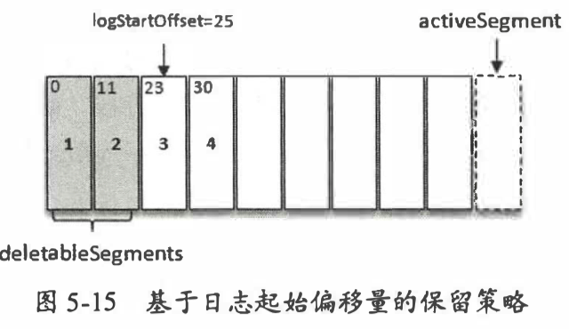

##### 2.6.2 日志压缩

Kafka中的Log Compaction是指在默认的日志删除(Log Retention)规则之外提供的 一 种 清理过时数据的方式。 如图5-16所示， Log Compaction对千有相同key的不同value值， 只保 留最后 一个版本。

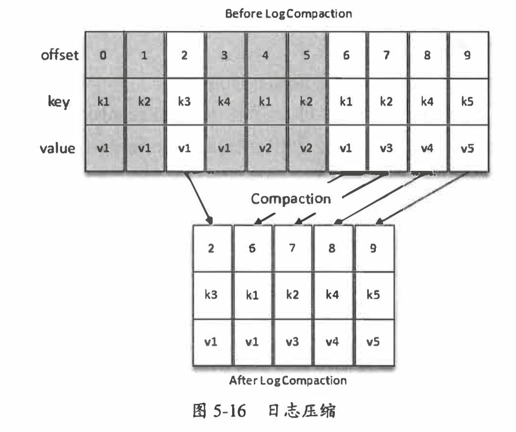

Log Compaction执行前后， 日志分段中的每条消息的偏移量和写入时的偏移量保待 一 致。 Log Compaction 会生成新的日志分段 文件， 日志分段中每条消息的物理位置会重新按照新文件 来组织。 Log Compaction执行过后的偏移量不再是连续的， 不过这并不影响日志的查询。

我们知道可以通过配置log.dir或log.dirs参数来设置Kafka 日志的存放目录， 而每 一个日志目录下都有 一 个名为"cleaner-offset-checkpoint" 的文件， 这个文件就是清理检查点文 件， 用来记录每个主题的每个分区中已清理的偏移量。 通过清理检查点文件可以将L og 分成两 个部分

通过检查点cleaner checkpoint来划分出 一个 已经清理过的clean部分 和一 个还未清理过的 dirty 部分。 在日志清理的同时， 客户端也可以读取日志中的消息。 dirty 部分的消息偏移量是逐 一递增的， 而 clean 部分的消息偏移量是断续的，如果客户端总能赶上 dirty部分， 那么它就能读取日志的所有消息， 反之就不可能读到全部的消息。

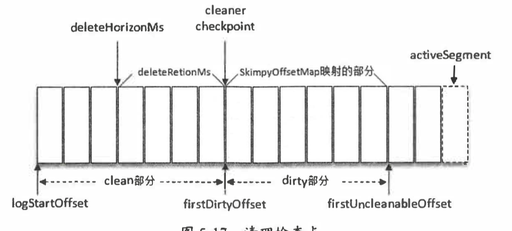

如图5-19所示，假设所有的参数配置都 为默认值，在Log Compaction之前checkpoint的初 始值为 0。 执行第 一 次 Log Compaction 之 后， 每个非活跃的日志分段的大小都有所缩减， checkpoint的值也有所 变化。 执行第二次Log Compaction时会组队成[0.4GB, 0.4GB]、[0.3GB, 0.7GB]、[0.3GB]、[1GB]这4个分组，并且从第二次Log Compaction 开始还会涉及墓碑 消息的 清除。同理，第三次Log Compaction过后的情形可参考图5-19的尾部。Log Compaction过程中 会将每个日志分组中需要保留的消息复制到 一 个以".clean" 为后缀的临时文件中， 此 临时文件 以当前 日志分组中第 一 个日志分段的文件名命名， 例如00000000000000000000.log.clean。 Log Compaction过后 将".clean"的文件修改为".swap"后缀的文件，例如： 00000000000000000000. log.swap。 然后 删除原本的日志文件， 最后才把文件的".swap" 后缀去掉。 整个过程中的索引

文件的变换也是如此， 至此 一 个完整Log Compaction操作才算完成。

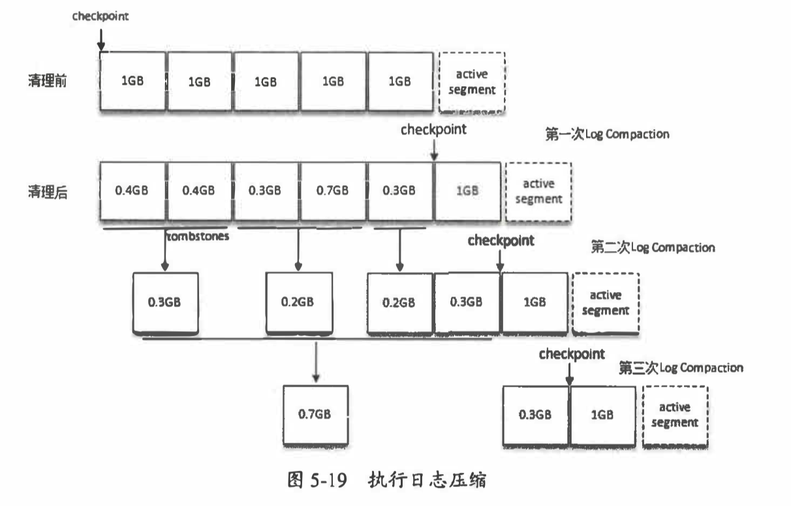

#### 2.7 磁盘存储

Kafka 在设计时采用了文件追加的方式来写 入消息， 即只能在日志文件的尾部追加新的消 息， 并且也不允许修改己写入的消息， 这种方式属于典型的顺序写盘的操作， 所以就算K afka 使用磁盘作为存储介质， 它所能承载的吞吐量也不容小觑。 

页缓存：页缓存是操作系统实现的 一 种主要的磁盘缓存， 以此用来减少对磁盘I/0 的操作。 具体 来说， 就是把磁盘中的数据缓存到内存中， 把对磁盘的访间变为对内存的访问。 为了弥补性 “ 能上的差异， 现代操作系统越来越 激进地 ” 将内存作为磁盘缓存， 甚至会非常乐意将所有 可用的内存用作磁盘缓存， 这样当内存回收时也几乎没有性能损失， 所有对于磁盘的读写也 将经由统 一 的缓存。

#### 2.8 零拷贝

所谓的零拷贝是指将数据直接从磁盘文件复制到网卡设备中，而不需要经由应用程序之 手 。

## 10_Kafka：深入服务端

### 10.1协议设计

在实际应用中，Kafka经常被用作高性能、 可扩展的消息中间件。Kafka自定义了 一 组基于 TCP的二进制协议， 只要遵守这组协议的格式， 就可以向Kafka发送消息， 也可以从Kafka中 拉取消息， 或者做一 些其他的事情， 比如提交消费位移等。

一 共包含了43种协议类型， 每种协议类型都有对应的请求 (Request)和响应(Response), 它们都遵守特定的协议模式 。 每种类型的Request都包含相同 结构的协议请求头(RequestHeader)和不同结构的协议请求体(RequestBody) , 如 图6-1所示。

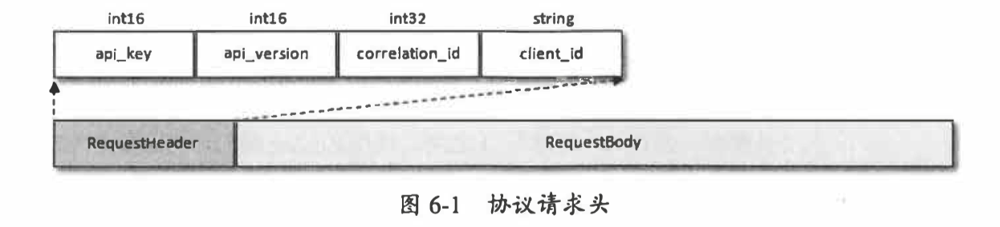

协议请求头中包含4个域（Field): api_key、 api_version、 correlation_id和client_id

| 域(Field)      | 描述(Description)                                            |
| -------------- | ------------------------------------------------------------ |
| api_key        | API标识， 比如PRODUCE、FETCH等分别表示发送消息和拉取消息的请求 |
| api version    | API版本号                                                    |
| correlation_id | 一 由客户端指定的 个数字来唯 一地标识这次请求的id, 服务端在处理完请求后也 会把同样的coorelation_id写到Response中，这样客户端就能把某个请求和响应 对应起来了 |
| client_id      | 客户端id                                                     |

每种类型的Response也包含相同结构的协议响应头(ResponseHeader)和不同结构的响应 体(ResponseBody) , 如图6-2所示。

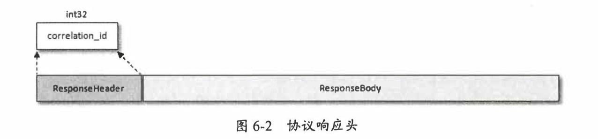

协议响应头中只有 一个correlation_id

细心的读者会发现不管是在图6-1中还是在图6-2中都有类似int32、int16、 string 的字样， 它们用来表示当前域的数据类型。 Kafka中所有协议类型的Request和Response的结构都是具 备固定格式的， 并且它们都构建千多种基本数据类型之上。 这些基本数据类型如图6-2所示。

| 类型(Type)      | 描述(Description)                                            |
| --------------- | ------------------------------------------------------------ |
| boolean         | 布尔类型，使用0和1分别代表false和true                        |
| int8            | 带符号整型， 占8位， 值在-2^7至2^7- 1之间                    |
| intl6           | 带符号整型， 占16位， 值在-2^15 至2^15-1之间                 |
| int32           | 带符号整型， 占32位， 值在-2^31至2^31- 1之间                 |
| int64           | 带符号整型， 占64位， 值在-2^63至2^63-1之间                  |
| unit32          | 无符号整型， 占32位， 值在0至2^32 - 1之间                    |
| varint          | 变长整型， 值在 －2^31-2^31-1之间， 使用ZigZag编码           |
| varlong         | 变长长整型， 值在-2^63至2^63- 1之间， 使用ZigZag编码         |
| string          | 字符串类型。 开头是 一个int 16类型的长度字段（非负数），代表字符串的长度 N, 后面包含N个UTF-8编码的字符 |
| nullable_string | 可为空的字符串类型。 如果此类型的值为空， 则用-J表示， 其余情况同string 类型 一样 |
| bytes           | 表示 一个字节序列。开头是 一个int32类型的长度字段，代表后面字节序列的长 度N, 后面再跟N个字节 |
| nullable_bytes  | 个消息序列，表示Kafka中的一也可以看作nullable_bytes          |
| array           | 表示 一 个给定类型T的数组， 也就是说， 数组中包含若干T类型的实例。 T可 以是基础类型或基础类型组成的 一 个结构。该域开头的是 一 个int32类型的长度 字段，代表T实例的个数为N, 后面再跟N个T的实例。可用-1表示 一 个空的 数组 |

下面就以最常见的消息发送和消息拉取的两种协议类型做细致的讲解。 首先要讲述的是消 息发送的协议类型， 即ProduceRequest/ ProduceResponse, 对应的api_key = 0, 表示PRODUCE。

从Kafka建立之初， 其所支待的协议类型就 一 直在增加， 并且对特定的协议类型而言， 内部的 组织结构也并非 一 成不变。 以ProduceRequest/ ProduceResponse为例， 截至目前就经历了7个 版本(v0-v6)的变迁。 下面就以最新版本(V6, 即api_version = 6)的结构为例来做细致的 讲解。 ProduceRequest的组织结构如图6-3所示。

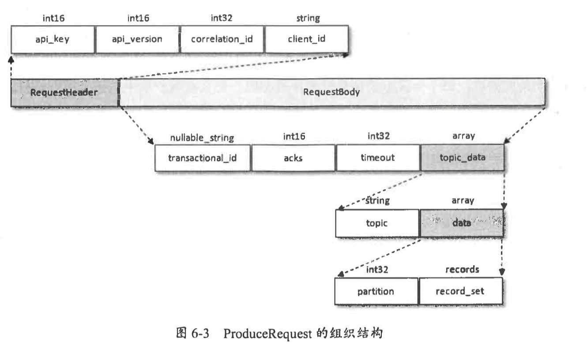

除了请求头中的4个域， 其余ProduceRequest请求体中各个域的含义如表6-3所示

| 域(Field)        | 类型            | 描述(Description)                                            |                                           |
| ---------------- | --------------- | ------------------------------------------------------------ | ----------------------------------------- |
| transactional id | nullable_string | 事务心从Kafka 0.11.0开始支持事务。 如果不使用事 务的功能， 那么该域的值为null |                                           |
| acks             | intl6           | 对应2.3节中提及的客户端参数acks                              |                                           |
| timeout          | mt32            | 请求超时时间， 对应客户端参数 request.timeout.ms, 默 认值为30000, 即30秒 |                                           |
| topic_data       | array           | 代表ProduceRequest中所要发送的数据集合。 以主题名 称分类， 主题中再以分区分类。 注意这个域是数组类型 |                                           |
|                  | topic           | string                                                       | 主题名称                                  |
|                  | data            | array                                                        | 与主题对应的数据， 注意这个域也是数组类型 |
|                  | int32           | partition                                                    | 分区编号                                  |
|                  | record set      | records                                                      | 与分区对应的数据                          |

消息累加器RecordAccumulator 中的消息是以＜分区， Deque<ProducerBatch>>的形式进行缓存的， 之后由Sender线程转变成<Node, List<ProducerBatch>>的 形式，针对每个Node, Sender线程在发送消息前会将对应的List< ProducerBatch>形式的内容转 变成ProduceRequest 的具体结构。 List<ProducerBatch>中的内容首先会按照主题名称进行分 类 （对应ProduceRequest中的域topic) , 然后按照分区编号进行分类（对应ProduceRequest中 的域parti巨on), 分类之后的ProducerBatch集合就对应ProduceRequest中的域record_set。 从另 一 个角度来讲， 每个分区中的消息是顺序追加的， 那么在客户端中按照分区归纳好之后就 可以省去在服务端中转换的操作了， 这样将负载的压力分摊给了客户端， 从而使服务端可以专 注于它的分内之事， 如此也可以提升整体的性能。

如果参数acks设置非0值， 那么生产者客户端在发送ProduceRequest请求之后就需要（异 步）等待服务端的响应ProduceResponse。对ProduceResponse而言，V6版本中ProduceResponse 的组织结构如图6-4所示

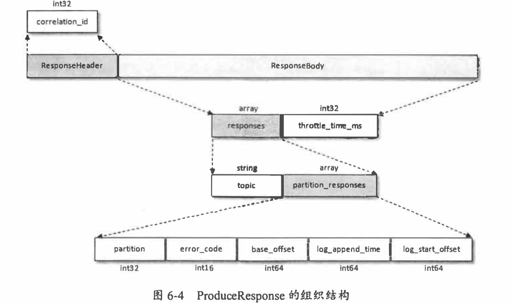

| 域(Field)类型       | 类型   | 描述(Description)                                            |
| ------------------- | ------ | ------------------------------------------------------------ |
| throttle_time_ms    | int32  | 如果超过了配额(quota)限制则需要延迟该请求的处理 时间。 如果没有配置配额， 那么该字段的值为0 |
| responses           | array  | 代表ProudceResponse中要返回的数据集合。 同样按照主 题分区的粒度进行划分， 注意这个域是一个数组类型 |
| topic               | string | 主题名称                                                     |
| partition_responses | array  | 主题中所有分区的响应， 注意这个域也是 一个数组类型           |
| partitlon           | int32  | 分区编号                                                     |
| error code          | int16  | 错误码，用来标识错误类型。目前版本的错误码有74种， 具体可以参考： http://katka.apache.org/protocol.html# protocol_error_codes |
| base offset         | int64  | 消息集的起始偏移量                                           |
| log_append_ time    | mt64   | 消息写入broker端的时间                                       |
| log_start_offset    | int64  | 所在分区的起始偏移量                                         |

我们再来了解 一下拉取消息的协议类型， 即FetchRequest/ Fetch_Response, 对应的api_key= 1

下面就以最新版本(V8)的结构为例来做细致的讲解.FetchRequest的组织结构如图6-5所 示

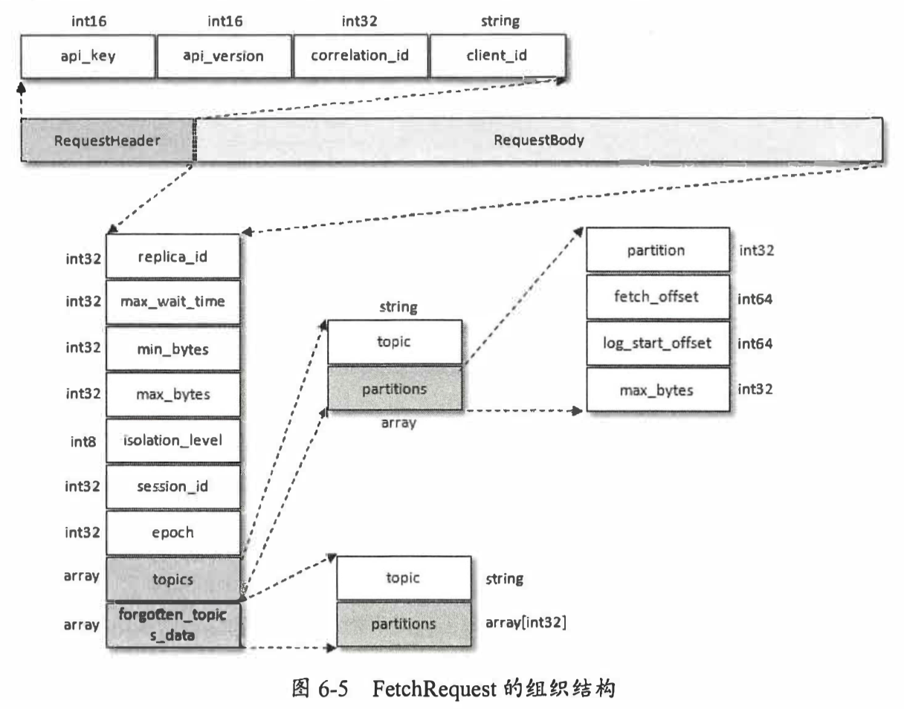

| 域(Field)             | 类 型  | 描述(Description)                                            |
| --------------------- | ------ | ------------------------------------------------------------ |
| replica_id            | int32  | 用来指定副本的brokerld, 这个域是用于follower副本向 leader副本发起FetchRequest请求的，对于普通消费者客 户端而言，这个域的值保持为-1 |
| max_wait_time         | int32  | 和消费者客户端参数fetch.max.wait.ms对应，默认值为 500, 具体参考3.2.11节的内容 |
| mm_bytes              | int32  | 和消费者客户端参数fetch.min.bytes对应，默认值为I, 具体参考3.2.11节的内容 |
| max_bytes             | int32  | 和消费者客户端参数 fetch.max.bytes 对应， 默认值为 52428800, 即50MB, 具体参考3.2.11节的内容 |
| isolation_level       | int8   | 和消费者客户端参数isolation.level对应， 默认值为 "read_uncommitted" , 可选值为"read_com血tted" , 这两个值分别对应本 域的0和1的值，有关isolation.level 的细节可以参考3.2.11节的内容 |
| session id            | int32  | fetch session的心详细参考下面的释义                          |
| epoch                 | int32  | fetch session的epoch纪元，它和 sees1on_1d 一 样都是fetch session的元 数据， 详细参考下面的释义 |
| topics                | array  | 所要拉取的主题信息， 注意这是 个数组类型                     |
| topic                 | string | 主题名                                                       |
| partition             | int32  | 分区名                                                       |
| fetch offset          | int64  | 指定从分区的哪个位置开始读                                   |
| log_start_offset      | int64  | 该域专门用于follower副本发起的FetchRequest 请求，用 来指明分区的起始偏移量。对于普通消费者客户端而言 这个值保持为-1 |
| max_bytes             | int32  | 注意在最外层中也包含同样名称的域， 但是两个所代表 的含义不同， 这里是针对单个分区而言的， 和消费者客 户端参数 max.partition.fetch.bytes对应， 默认值为 1048576, 即1MB, |
| forgotten_topics_data | array  | 数组类型， 指定从fetch sess10n中指定要去除的拉取信 息， 详细参考下面的释义 |
| topic                 | string | 主题名称                                                     |
| partitions            | array  | 数组类型， 表示分区编号的集合                                |

不管是follower副本还是普通的消费者客户端， 如果要拉取某个分区中的消息， 就需要指 定详细的拉取信息，也就是需要设定partition、 fetch offset、 log start offset 和max_bytes这4个域的具体值，那么对每个分区而言，就需要占用4B+8B+8B+=24B的空间。一般情况下， 不管是follower副本还是普通的消费者， 它们的订阅信息是长期固定.如果可以将这24KB的状态保存起来， 那么就可以节省这部分所占用的 带宽 。

Kafka从1.1.0版本开始针对FetchRequest引入了session_id、epoch和 forgotten_topics_data等域，session_id和epoch确定 条拉取链路 的 fetch session,当session建 立或变更时会发送全量式的 FetchRequest, 所谓的全量式就是指请求体中包含 所有需要拉取的 分区信息；当session稳定时则会发送增 量式的Fetc hRequest请求，里面 的topics域为空， 因 为topics域的内容已经被缓存在了session链路的两侧。 如 果需要从当前fetc h session中取消 对某些分区的拉取订阅， 则可以使用forgotten_topics_data 字段来实现。

与FetchRequest对应的FetchResponse的组织结构(V8版本）

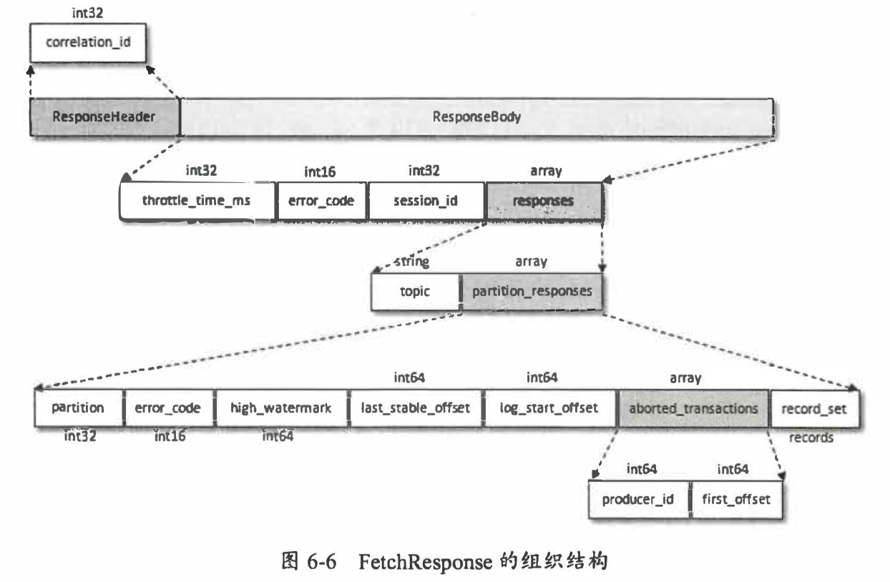

FetchResponse结构中的域也 很多， 它主要分为4层， 第1层包含throttle_time_ms、 error_code、 session_id和 responses, 前面3 个域都见过， 其中session_id和 Fetc hReq u est中的 session_id 对应。 responses是 一 个数组类型， 表示响应的具体内容， 也 就是 Fetc hResp onse结构中的第 2 层， 具体地细化到每个分区的响应。 第3层中包含分区的元 数据信 息(partition、 error code 等 ） 及具 体 的 消息内 容 (record set) ,aborted_transactions和事务相关。

### 10.2 时间轮

Kafka中 存在大量的延时操作， 比如延时生产、 延时 拉取和延时 删除等 。Kafka并没有使用 一 JDK自带的Timer 或DelayQueue来实现 延时的功能，而是基于时间轮的概念自定义 实现了 个 用延时 功能的定时器(SystemTimer)

Kafka中的时间轮(TimingWheel)是 个存储定时任务的环形队列， 底层 采用 数组 实现， 数组中的每个元素可以存放 一 个定时任务列表(TimerTaskList)。TimerTaskList 一 是 个环形的双向链表，链表中的每 一 项 表示的都是定时任务项(TimerTaskEntry), 其中封装 了真正的定时任务(TimerTask)。

时间轮由多个时间格组成， 每个时间格代表当前时间轮的基本时间跨度(tickMs)。 时间 轮的时间格个数 是固定的，可用wheelSize来表示， 那么 整个时间轮的总体时间跨度(interval) 可以通过公式tickMs X wheelSize计算得出。 时间轮 还有 一 个表 盘指针(currentTime) , 用来表 示 时间轮当前所处的时间，currentTime 是tick Ms的整 数倍。 currentTime可以将整个时间轮划分 为到期部分和未到期部分， currentTime当前指向的时间格也属千到期部分， 表示刚好到期， 需 要 处 理此 时间格 所对 应的TimerTaskList中的所有任务。

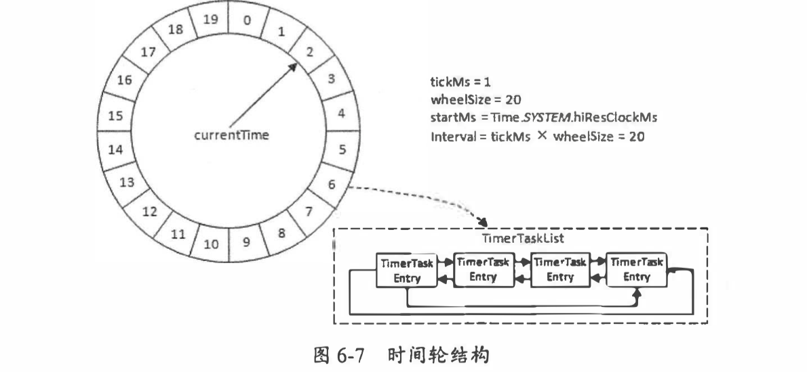

若时间轮的 tickMs为lms且wheelSize等于20, 那么可以计算得出总体时间跨度interval 为20ms。 初始情况下表盘指针cur r entTime指向时间格O, 此时有 一 个定时为2ms的任务插进 来会存放到时间格为2的TimerTaskList中。 随着时间的不断推移， 指针CWTentTime不断向前 推进， 过了2ms之后， 当到达时间格2时， 就需要将时间格2对应的TimeTaskList 中的任务进 行相应的到期操作。 此时若 又有 一 个定时为 8ms 的任务插进来， 则会存放到时间格 10 中， cur r entTime再过 8ms后会指向时间格10。 如果同时有 一 个定时为19ms的任务插进来怎么办？ 新来的TimerTaskEntry会复用原来的TimerTaskList , 所以它会插入原本已经到期的时间格1。 总之， 整个时间轮的总体跨度是不变的， 随着指针cur r entTime的不断推进， 当前时间轮所能处 理的时间段也在不断后移， 总体时间范围在 cWTentTime和CWTentTime+interval之间 。

如果此时有 一个定时为350ms的任务该如何处理？

第 一层的时间轮 tickMs = 1ms、wheelSize = 20、inter 第二层的时间轮的 tickMs为第 一 层时间轮的int erval, 即20ms。每 一 层时间轮的wheelSize是固 定的， 都是 20, 那么第二层的时间轮的总体时间跨度interval为400ms。以此类推 ， 这个 400ms 也是第三层的 tickMs的大小， 第三层的时间轮的总体时间跨度为8000ms。

复用之前的案例，第 一层的时间轮 tickMs = 1ms、wheelSize = 20、inter 第二层的时间轮的 tickMs为第 一 层时间轮的int erval, 即20ms。每 一 层时间轮的wheelSize是固 定的， 都是 20, 那么第二层的时间轮的总体时间跨度interval为400ms。以此类推 ， 这个 400ms 也是第三层的 tickMs的大小， 第三层的时间轮的总体时间跨度为8000ms。

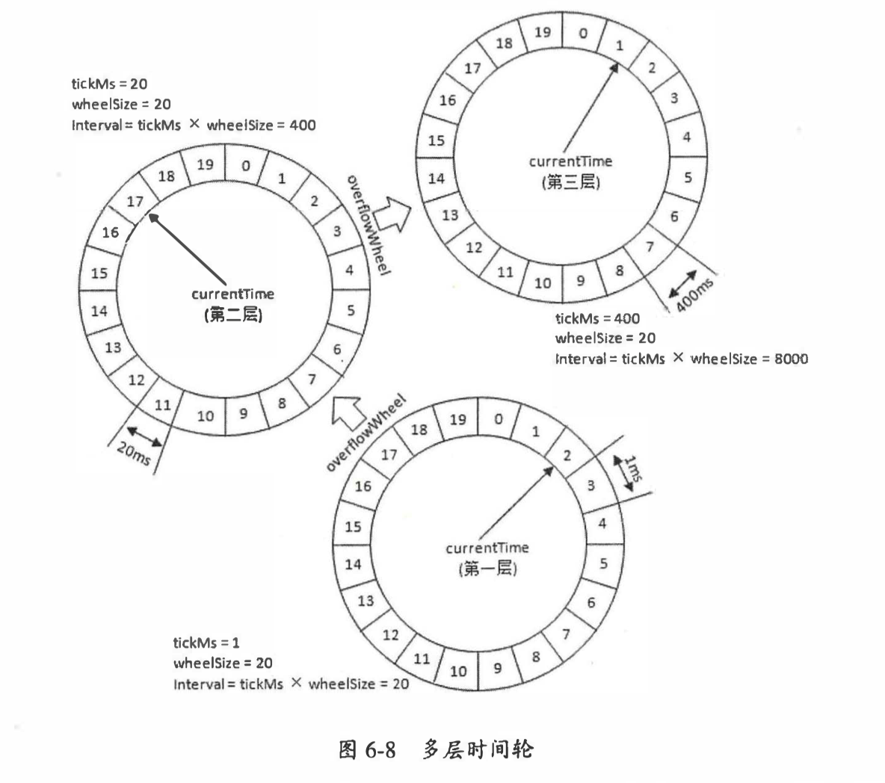

### 10.3 延时操作

如果在使用生产者客户端发送消息的时候将acks参数设置为-1, 那么就意味着需要等待 ISR集合中的所有副本都确认收到消息之后才能正确地收到响应的结果， 或 者捕获超时异常。

在Kafka中有多种延时操作， 比如前面提及的延时生产， 还有延时拉取(DelayedFetch)、 延时数据删除(DelayedDeleteRecords)等。 延时操作需要延时返回响应的结果， 首先它必须有

一 个超时时间(d e layMs) , 如果在这个超时时间内没有完成既定的任务， 那么就需要强制完成 以返回响应结果给客户端。

延时操作创建之后会被加入延时操作管理器( DelayedOperationPurgatory)来做专门 的 处 理。 延时操作有可能会超时， 每个延时操作管理器都会配备一 个定时器 (SystemTimer) 来做 超时管 理， 定时器的底层就是采用时间轮 (TimingWheel)实现的

图 6-12描绘了客户端在请求写入消息到收到响应结果的过程中与延时生产操作相关的细 节， 在了解相关的概念之后应该比较容易理解： 如果客户端设置的acks参数不为-1, 或者没 有成功的消息写入， 那么就直接返回结果给客户端， 否则就需要创建延时生产操作并存入延时 操作管理器， 最终要么由外部事件触发， 要么由超时触发而执行

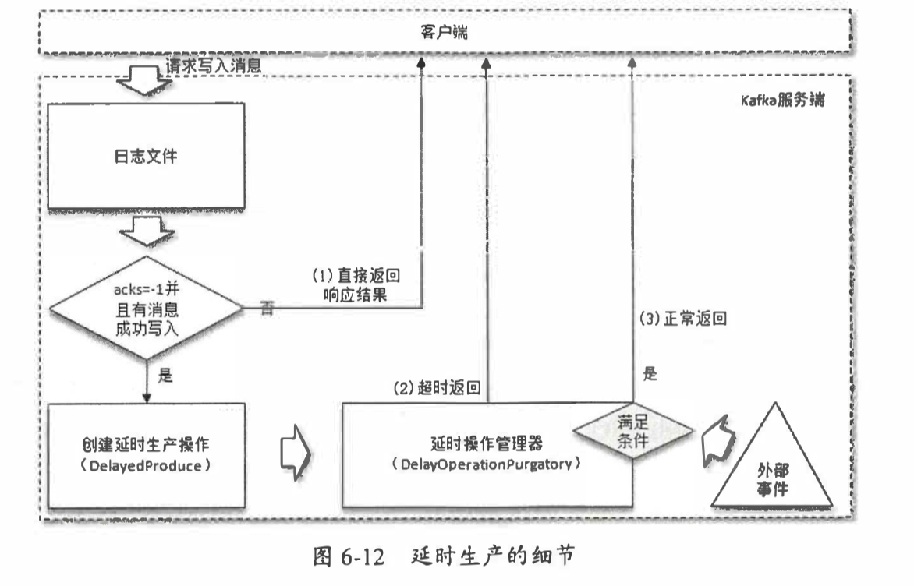

有延时生产就有延时拉取.Kafka选择了延时操作来处理这种情况。Kafka 在处理拉取请求时，会先读取 一 次日志文件， 如果收集不到足够多(fetchMinBytes , 由参数fetch.min.bytes配置，默认值为l)的消息， 那么就会创建 一 个延时拉取操作(DelayedFetch)以等待拉取到足够数量的消息。 当延时拉取操 作执行时， 会再读取 一次日志文件， 然后将拉取结果返回给follower副本。

延时拉取操作同样是由超时触发或外部事件触发而被执行的。 超时触发很好理解， 就是等 到超时时间之后触发第二次读取日志文件的操作。 外部事件触发就稍复杂了 一 些， 因为拉取请 求不单单由follower副本发起， 也可以由消费者客户端发起， 两种情况所对应的外部事件也是 不同的。 如果是follower副本的延时拉取， 它的外部事件就是消息追加到了leader副本的本地 日志文件中；如果是消费者客户端的延时拉取， 它的外部事件可以简单地理解为HW的增长。

### 10.4 控制器

在 Kafka 集群中会有 一 个或多个broker, 其中有 一 个broker 会被选举为控制器(Kafka Controller), 它负责管理整个集群中所有 分区 和副本的状态。 当某个分区的leader副本出现故 障时， 由控制器负责为该分区选举 新的 leader副本。 当检测到某个分区的 ISR集合发生变化时， 由控制器负责通知所有broker更 新其元数据信息。当使用kafka-to pics.sh脚本为某个topic 增加 分区数量时， 同样还是由控制器负责 分区的重新 分配。

**选举和异常恢复**

Kafka中的控制器选举工作依赖于ZooKeeper, 成功竞选为控制器的brok er会在ZooKeeper 中创建/controller这个临时(EPHEMERAL)节点， 此临时 节点的内容参考如下：

`{"version": 1, "broker id": 0,"timestamp":"1529210278988"}`

在任意时刻， 集群中有且仅有 一 个控制器。 每个broker启动的时候会去尝试读取 /controller节点的broker过的值，如果读取到brokerid的值不为-1, 则表示已经有其 他broker 节点成功竞选为控制器， 所以当前broker就会放弃竞选；如果ZooKeeper 中不存在 /controller节点， 或者这个节点中的数据异常， 那么就会尝试去创建/controller节点。 当前broker去创建节点的时候， 也有可能其他broker同时去尝试创建这个节点， 只有创建成功 的那个broker才会成为控制器， 而创建失败的broker竞选失败。 每个broker都会在内存中保存 当前控制器的brokerid值， 这个值可以标识为activeControllerld 。

ZooKeeper 中还有 一 个与控制器有关的/controller_epoch节点， 这个节点是待久 (PERSISTENT)节点， 节点中存放的是 一 个整型的controller— epoch值。controllerepoch用于记录控制器发生变更的次数， 即记录当前的控制器是第几代控制器， 我们也可以称 之为 "控制器的纪元"

具备控制器身份的broker需要比其他普通的broker多 一 份职责， 具体细节如下：

监听 分区相关的变化。 为ZooKeeper中的/admin/reassign_par巨巨ons节点注 册 PartitionReassignmentHandler, 用来处理分区重 分配的动作。 为 ZooKeeper 中的 红sr_change_noti丘cation节点注册IsrChangeNotificetionHandler, 用来处理 ISR 集合变更的动作。 为ZooKeeper中的/admin/preferred-rep巨ca-electio n节 点添加PreferredReplicaElectionHandler, 用来处理优先副本的选举动作。

+  监 听 主 题 相 关 的 变 化 。 为 ZooKeeper 中 的 /brokers/ topics 节 点 添 加 TopicChangeHandler , 用 来 处理主 题 增 减 的 变 化； 为 ZooKeeper 中的/admin/ delete_topics节点添加TopicDeletionHandler, 用来处理删除主题的动作。

+ 监听broker相关的变化。 为ZooKeeper中的/brokers/ids节点添加BrokerChangeHandler, 用来处理broker增减的变化。
+  从ZooKeeper中读取获取当前所有与主题、 分区及broker有关的信息并进行相应的管 理。 对所有主题对应的 ZooKeeper 中的/brokers/topics/<topic＞节点添加 PartitionModificationsHandler, 用来监听主题中的分区分配变化。
+  启动并管理分区状态机和副本状态机。
+  更新集群的元数据信息。
+ 如果参数auto.leader.rebalance.enable设置为 true, 则还会开启 一 个名为 "auto-leader-rebalance-task"的定时任务来 负责维护 分区的优先副本的均衡 。

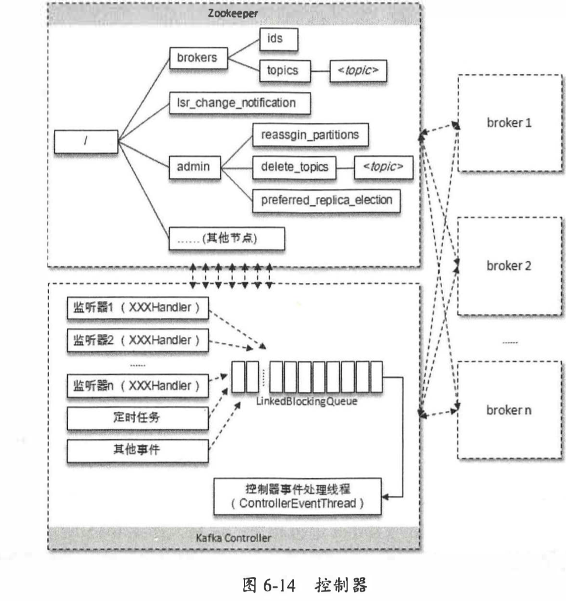

/controller 节点的数据发生变化时， 每个 broker 都会更新自身内存中保存 的 activeControllerld 。 如果 broker 在数据变更前是控制器， 在数据变更后自身的 brok erid 值与 新的 activeControllerld 值不 一 致， 那么就需要 “ 退位 ” ， 关闭相应的资源， 比如关闭状态机、 注销相应的监听器等。 有可能控制器由于异常而下线， 造成 /controller 这个临时节点被自 动删除； 也有可能是其他原因将此节点删除了。

当 /controller 节点被删除时， 每个 broker 都会进行选举， 如果 broker 在节点被删除前 是控制器， 那么在选举前还需要有 一 个 “ 退位 ” 的动作。 如果有特殊需要， 则可以手动删除 /controller 节点来触发新 一 轮的选举。 当然关闭控制器所对应的 broker, 以及手动向 /controller 节点写入新的 brokerid 的所对应的数据， 同样可以触发新 一 轮的选举。

### 10.5 分区Leader选举

分区leader副本的选举由控制器负责具体实施。当创建分区（创建主题或增加分区都有创 建分区的动作） 或分区上线（比如分区中原先的 leader副本下线， 此时分区需要选举 一 个新的 leader 上线来对外提供服务）的时候都 需要执行 leader 的选举动作， 对应的选举策略为 OftlinePartitionLeaderElectionStrategy。这种策略的基本思路是按照AR 集合中副本的顺序查找 第 一 个存活的副本，并且这个副本在JSR集合中。 一个分区的AR集合在分配的时候就被指定， 并且只要不发生重分配的情况，集合内部副本的顺序是保待不变的，而分区的ISR集合中副本 的顺序 可能会改变。

### 10.6 参数解密

**broker.id**

broker . id 是 broker 在启动之前必须设定 的参数之一， 在 Kafka 集群中 ，每个 broker 都 有唯一 的 id （ 也可以记作 brokerld ）值用来区分彼此 。 broker 在启动时会在 ZooKeeper 中的 /brokers/ ids 路径下创建一个以当前 brokerId 为名称的虚节点， broker 的健康状态检查就依 赖于此虚节点。 当 broker 下线时， 该虚节点会自动删除， 其他 broker 节点或客户端通过判断 /brokers/ids 路径下是否有此 broker 的 brokerld 节点来确定该 broker 的健康状态。

可以通过 broker 端的配置文件 config/server.properties 里的 broker . i d 参数来配置 broke rid ， 默认情况下 broker.id 值为 l 。在 Kafka 中 ， brokerld 值必须大于等于 0 才有可能 正常启动 ，但这里并不是只能通过配置文件 con fig/ server. properties 来设定这个值 ，还可以通过meta.properties 文件或 自动生成功能来实现。

broker 在成功启动之后在每个日志根 目录下都会有一个 meta.properties 文件 。

(1)如果 log . dir 或 log.dirs 中配置了多个日志根目录，这些日志根目录中的 meta. properties 文件所配置的 broker . id 不 一致则会抛出 InconsistentBrokerldException 的 异常。

( 2 ）如果 config/ server. poperties 配置文件里配置 的 br oker ． id 的值和 meta.properties 文 件里的 broker . id 值不一致 ，那么同样会抛出 InconsistentBrokerldException 的异常 。

( 3 ）如 果 config/server.properties 配置文件中井未配置 broker ．工d 的值，那么就以

meta.properties 文件中的 broker . id 值为准。

( 4 ）如果没有 meta.properties 文件，那么在获取合适的 broker . id 值之后会创建一个新

的 meta.prop巳rties 文件并将 broker . id 值存入其中。

如果 config/ server. properties 配置文件中并未配置 broker . id ，并且日志根目录中也没有 任何 meta.properties 文件（ 比如第－次启动时 ） ，那么应该如何处理呢 ？

还提供 了另外两个 broker 端参数 ： broker . id . generation . enable 和 reserved . broker . max . i d 来配合生成新的 brokerId 。 broker . id . geηeratio口 . enable 参数用来配置是否开启自动生成 brokerId 的功能，默认情况下为廿ue， 即开启此功能 。自 动生 成的 brokerId 有一个基准值，即自动生成的 brokerId 必须超过这个基准值，这个基准值通过 reserverd . broker.max . id 参数配置，默认值为 1000 。 也就是说，默认情况下自动生成的 broker Id 从 1001 开始 。

**bootstrap.server**

bootstrap.servers 不仅是 Kafka Producer、 Kafka Consumer 客户端 中的必备参数 ，而 且在 Kafka Connect、 Kafka Streams 和 KafkaAdminClient 中都有涉及 ， 是一个至关重要 的参数。

我们一般可以简单地认为 bootstrap.servers 这个参数所要指定的就是将要连接的 Kafka 集群的 broker 地址列表。不过从深层次的意义上来讲，这个参数配置的是用来发现 Kafka 集群元数据信息的服务地址。为了更加形象地说明问题，我们先来看一下图 6- 19 。

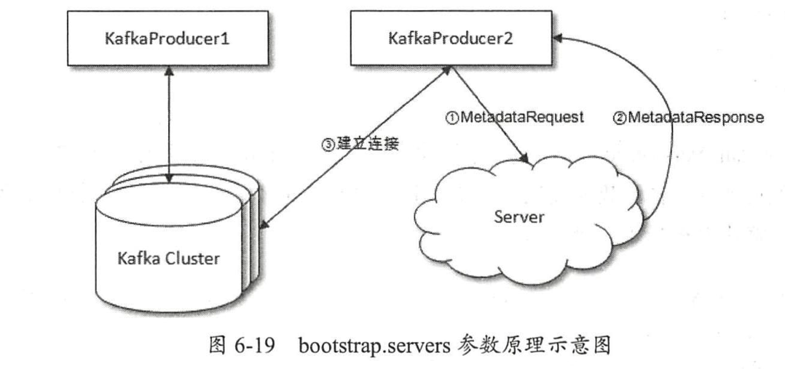

客户端 KafkaProducer1 与 Kafka Cluster 直连，这是客户端给我们的既定印象，而事实上客 户端连接 Kafka 集群要经历以下 3 个过程，如图 6-19 中的右边所示。

Cl ）客户端 KafkaProducer2 与 bootstrap.servers 参数所指定的 Server 连接，井发送 MetadataRequest 请求来获取集群的元数据信息 。

(2) Server 在收到 MetadataRequest 请求之后，返回 MetadataResponse 给 KafkaProducer2, 在 MetadataResponse 中包含了集群的元数据信息。

(3 ）客户端 KafkaProducer2 收到的 MetadataResponse 之后解析出其中包含的集群元数据信 息，然后与集群中的各个节点建立连接，之后就可以发送消息了。

### 10.7 服务端参数列表

| 参数名称                                | 默认值                               | 参数释义                                                     |
| --------------------------------------- | ------------------------------------ | ------------------------------------------------------------ |
| auto.create.topcs.enable                | true                                 | 是否开启自动创建主题的功能，详细 参考4.1.1节                 |
| auto.leader.rebalance.enable            | true                                 | 是否开始自动leader再均衡的功能， 详细参考4.3.l节             |
| background.threads                      | 10                                   | 指定执行后台任务的线程数                                     |
| compression.typedelete.topic.enable     | producer                             | 消息的压缩类型。Kafka支持的压缩 类型有Gzip、Snappy、LZ4等。 默 认值"producer"表示根据生产者使 用的压缩类型压缩，也就是说，生产 者不管是否压缩消息，或者使用何种 压缩方式都会被broker端继承。 "uncompressed"表示不启用压缩， 详细参考5.2.3节 |
| leader.imbalance.check.interval.seconds | 300                                  | 检查 leader是否分布不均衡的周期， 详细参考4.3 I节            |
| leader.imbalance.per.broker.percentage  | 10                                   | 允许leader不均衡的比例，若超过这 个 值就会触发leader再均衡的操作 |
| log.flush.interval.messages             | 9223372036854775807 (Long.MAX_VALUE) | 如果日志文件中的消息在存入磁盘 前的数量达到这个参数所设定的阙 值时，则会强制将这些刷新日志文件 到磁盘中。 |
| log.flush.interval.ms                   | null                                 | 刷新日志文件的时间间隔。如果没有配置 这个值， 则会依据log.flush. scheduler.mterval.ms参数设置的值 来运作 |
| log.flush.scheduler.interval.ms         | 9223372036854775807 (Long.MAX VALUE) | 检查日志文件 是否需要刷新的时间 间隔                         |
| log.retention.bytes                     | -1                                   | 日志文件的最大保留大小（分区级 别， 注意与log.segment.bytes的区 别）， 详细参考5.4.1节 |
| log.retention.hours                     | 168(7天）                            | 日志文件的留存时间， 单位为小时， 详细参考5.4.1节            |
| log.retention.mmutes                    | null                                 | 日志文件的留存时间， 单位为分钟， 详细参考5.4.1节            |
| log.retention.ms                        | null                                 | 日志文件的留存时间， 单位为毫秒。 log.retent10n. {hours血inuteslms}这三 个参数 中log.retention.ms的优先级 最高， log.retention.minutes次之， log.retention.hours 最低， 详细参考 5.4.1节 |
| log.roll.hours                          | 168 (7天）                           | 经过多长时间之后会强制新建一个 日志分段，默认值为7天，详细参考 53节 |
| log.roll.ms                             | null                                 | 同上， 不过单位为毫秒。 优先级比 log.roll.hours要高， 详细参考53节 |
| log.segement.bytes                      | 1073741824 (1GB)                     | 日志分段文件的最大值，超过这个值 会强制创建 一个新的日志分段，详细 参考5.3节 |
| min.insync.rephcas                      | 1                                    | ISR 集合中最少的副本数， 详细参考 8.1.4节                    |
| num.io.threads                          | 8                                    | 处理请求的线程数， 包含磁盘I/O                               |
| num.network.threads                     | 3                                    | 处理接收和返回响应的线程数                                   |
| log.cleaner.enable                      | true                                 | 是否开启日志清理的功能，详细参考 54节                        |
| log cleaner.mm.cleanable.ratio          | 05                                   | 限定可执行清理操作的最小污浊率， 详细参考5.4.2节             |
| log.cleaner.threads                     | 1                                    | 用千日志清理的后台线程数                                     |
| log.cleanup.poltcy                      | delete                               | 日志清理策略， 还有 一个可选项为 compact, 表示日志压缩， 详细参考 54节 |
| log.index.interval.bytes                | 4096                                 | 每隔多少个字节的消息量写入就添 加 一条索引， 详细参考5.4.2节 |
| log.mdex.size.max.bytes                 | 10485760 (10MB)                      | 索引文件的最大值                                             |
| log.message.format.version              | 2.0-IVl                              | 消息格式的版本                                               |
| log.message.timestamp.type              | CreateTime                           | 消息中的时间戳类型另一个可选项 为LogAppendTime。             |
| log.retent1on.check.interval.ms         | 300000 (5分钟）                      | 日志清理的检查周期， 详细参考 5.4.1节                        |
| num.partitions                          | I                                    | 主题中默认的分区数， 详细参考 4.1.1节                        |
| reserved.broker.max.id                  | 1000                                 | broker.id能配置的最大值， 同时 reserved.broker.max.id+ I也是自动创 建broker.id值的起始大小，详细参考 6.5.1节 |
| create.top1c.policy.class.name          | null                                 | 创建主题时用来验证合法性的策略， 这个参数配置的是一 个类的全限定 名，需要实现org.apache.kafka.server. policy.CreateTop1cP0!1cy接口， 详细 参考4.2.2节 |
| broker.id.generation.enable             | true                                 | 是否开启自动生成broker.id的功能， 详细参考6.5.1节            |
| broker.rack                             | null                                 | 配置 broker 的机架信息， 详细参考 4.1.2节                    |

## 11_Kafka:深入客户端

### 11.1 分区分配策略

Kafka提供了消费者客户端参数partition.assignment.strategy 来 设 置消费者与订阅主题之间的分区分配策略。 默认情况下， 此参数的值为org.apache.kafka. clients. consumer.RangeAssignor, 即采用 RangeAssignor分配策略。 除此之外， Kafka还提供了另 外 两 种分配策略： RoundRobinAssignor和StickyAssignor 。

`config.Consumer.Group.Rebalance.Strategy=sarama.BalanceStrategyRoundRobin`

1. RangeAssignor分配策略

RangeAssignor 分配策略的原理是按照消费者总数和分区总数进行整除运算 来 获得 一 个跨 度， 然后将分区按照跨度进行平均分配， 以保证分区尽可能均匀地分配给所有的消费者。

RangeAssignor策略会将消费组内所有订阅这个主题的消费者按照名称的字典序排 序，然后为每个消费者划分固定的分区范围，如果不够平均分配，那么字典序靠前 的消费者会 被多分配 一 个分区。

2. RoundRobinAssignor分配策略

RoundRobinAssi gn or 分配策略的原理是将消费组内所有消费者及消费者订阅的所有主题的分 区按照字典序排序，然后通过轮询方式逐个将分区依次分配给每个消费者。

如果同 一 个消费组内所有的消费者的订阅信息都是相同的， 那么RoundRobinAssi gn or 分配

策略的分区分配 会是均匀的。举个例子， 假设消费组中有2个消费者 co 和CL都订阅了主题 tO和tl, 并且每个主题都有3个分区， 那么订阅的所有分区可以标识为：tOpO、 tOpl、t0p2、tlpO、 tlpl、tlp2。最终的分配结果为：

消费者CO: tOpO、t0p2、tlpl 消费者Cl: tOpl、tlpO、tlp2

举个例子， 假设消费组内有3个消费者(CO、 Cl和C2), 它们共订阅了3个主题(tO、 tl 、 t2), 这 3个主题分别有1 、 2、 3个分区， 即整个消费组订阅了tOpO、 tlpO、 tlpl、 t2p0 、 t2pl、 t2p2这6个分区。 具体而言， 消费者 co 订阅的是主题tO, 消费者Cl 订阅的是主题tO和tl, 消费者C2 订阅的是主题tO、ti和t2, 那么最终的分配结果为：

消费者CO: tOpO 消费者Cl: tlpO 消费者C2: tlpl 、七 2p0 、 t2pl 、 t2p2

3. StickyAssignor分配策略

我们再来看 一 下StickyAssignor分配策略，  从0.11.x版本开始引入这种分配策略， 它主要有两个目的

 (1)分区的分配要尽可能均匀。

(2)分区的分配尽可能与上次分配的保待相同。

假设消费组内有3个消费者(CO、 Cl和C2), 它们都订阅了4个主题(tO、 tl、 t2、 t3), 并且每个主题有2个分区。 也就是说， 整个消费组订阅了tOpO、 tOpl、 tlpO、 tlpl、 t2p0 、 t2pl、 t3p0 、 t3pl这8个分区。 最终的分配结果如 下：

消费者CO: 七 OpO、tlpl 、 t3p0 消费者Cl: tOpl、t2p0、t3pl 消费者C2: tlpO、t2pl

这样初看上去似乎与采用RoundRobinAssi gn or分配策略所分配的结果相同， 但事实是否真 的如此呢？再假设此时消费者 Cl脱离了消费组， 那么消费组就会执行再均衡操作， 进而消费 分区会重新分配。 如果采用RoundRobinAssignor 分配策略， 那么此时的分配结果如下：

消费者CO: tOpO、tlpO、t2p0、t3p0 消费者C2: tOpl、tlpl、t2pl、t3pl

如分配结果所示，RoundRobinAssignor分配策略会按照消费者 co 和C2进行重新轮询分配。 如果此时使用的是StickyAssignor分配策略，那么分配结果为：

消费者CO: tOpO、tlpl 、 七3p0、t2p0 消费者C2: tlpO、t2pl、tOpl、t3pl

可以看到分配结果中保留了上 一 次分配中对消费者 co 和C2的所有分配结果，并将原来消 “ 费者Cl的 负担 “ 分配给了剩余的两个消费者 co 和C2, 最终 co 和C2的分配还保持了均衡。

到目前为止，我们分析的都是消费者的订阅信息都是相同的情况，我们来看 一 下订阅信息 不同的清况下的处理。

举个例子，同样消费组内有3个消费者(CO、Cl和C2) , 集群中有3个主题(tO、tl和 t2) , 这3个主题分别有1 、 2、 3个分区。也就是说，集群中有tOpO、 tlpO、 tlpl、 t2p0 、 t2pl、 t2p2这6个分区。 消费者 co 订阅了主题tO, 消费者Cl订阅了主题tO和tl, 消费者C2订阅了 主题tO、ti和t2。

消费者CO: tOpO 消费者Cl: 七lpO、tlpl 消费者C2: 七2p0、t2pl、t2p2

4. 自定义分区分配策略

读者不仅可以任意选用Kafka提供的3种分配策略， 还可以自定义分配策略来实现更多可 选的功能。

实现接口

```go
// BalanceStrategy is used to balance topics and partitions
// across members of a consumer group
type BalanceStrategy interface {
	// Name uniquely identifies the strategy.
	Name() string

	// Plan accepts a map of `memberID -> metadata` and a map of `topic -> partitions`
	// and returns a distribution plan.
	Plan(members map[string]ConsumerGroupMemberMetadata, topics map[string][]int32) (BalanceStrategyPlan, error)

	// AssignmentData returns the serialized assignment data for the specified
	// memberID
	AssignmentData(memberID string, topics map[string][]int32, generationID int32) ([]byte, error)
}
```

### 11.2 消费者协调器和组协调器

消费者协调器和组协调器的概念是针对新版的消费者客户端 而言的，Kafka建立之初并没 有它们。

每个消费组(<group>)在Zoo Keeper中都维护了 个/consumers/<group>/ids 路径， 在此路径下使用临时节点记录隶属于此消费组的消费者的唯 一 标识 (consumerldString)，其中 consumer.id是旧版消费者客户端中的配置，相当于新版客户端中的 client.id。

参考图7-4, 与/consumers/<group>/ids 同级的还有两个节点： owners和 offsets, /consumers/<group>/owner 路径下记录了分区和 消费者的对应关系，/consumers/ <group>/offsets路径下记录了此消费组 在 分区中对应的消费位移 。

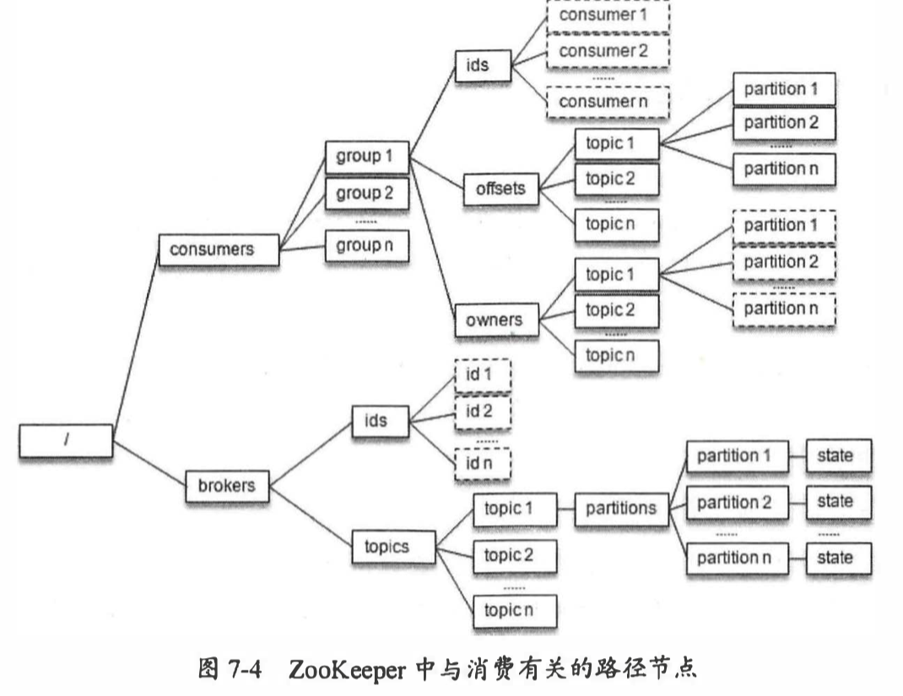

每个broker、 主题和 分区在ZooKeeper中也都 对应 一 个路径 ： /brokers/ids/<id>记录 了host、port及分配在 此broker上的主题 分区列表； /brokers/topics/<topic>记录了每 个分区的 leader 副本、ISR集合等信息。/brokers/topics/<top乓>/partitions/ <parti巨on>/state 记录了当前leader副本、leader—epoch等信息

每个消费者在启动时都会在/consumers/<group>八ds和/brokers/ids路径 上注册 一个监听器。当/consumers/<group>/ids路径下的子节点发生变化时，表示消费组 中的消 费者发生了变化；当/brokers/ids路径下的子节点发生变化时，表示broker出现了增减。这 样通过ZooKeeper 所提供的Watcher, 每个消费者就可以监听消费组和Kafka集群的状态了

#### 11.2.1再均衡的原理

新版的消费者客户端对此进行了重新设计，将全部消费组分成多个子集， 每个消费组的子 集在服务端对应 一 个GroupCoordinator对其进行管理， GroupCoordinator是Kafka服务端中用于 管理消费组的组件。而消费者客户端中的 ConsumerCoordinator组件负责与GroupCoordinator 进 行交互。

ConsumerCoordinator与GroupCoordinator之间最重要的职责就是负责执行消费者再均衡的 操作，包括前面提及的分区分配的工作也是在再均衡期间完成的 。就目前而言， 一 共有如下几 种情形会触发再均衡的操作：

• 有新的消费者加入消费组 。

• 有消费者宅机下线。消费者并不 一 定需要真正下线， 例如遇到长时间的 GC、网络延 迟导致消费者长时间未向GroupCoordinator发送心跳等情况时，GroupCoordinator会认 为消费者已经下线。

• 有消费者主动退出消费组（发送LeaveGroupRequest 请求）。比如客户端调用了 unsubscrible()方法取消对某些主题的订阅 。

• 消费组所对应的GroupCoorinator节点发生了变更。

• 消费组内所订阅的任一 主题或者主题的分区数量发生变化 。


1.第一阶段 (FIND_COORDINATOR)

消费者需要确定它所属的消费组对应的GroupCoordinator所在的 broker,并创建与该broker 相互通信的网络连接 。如果消费者已经保存了与消费组对应的GroupCoordinator节点的信息， 并且与它之间的网络连接是正常的，那么就可以进入第二阶段。否则， 就需要向集群中的某个 节点发送FindCoordinatorRequest请求来查找对应的GroupCoordinator,这里的 “ 某个节点 ” 并 非是集群中的任意节点，而是负载最小的节点

FindCoordinatorRequest请求体中只有两个域(Field): coordinator_key  和 coordinator_ type。coordina or— key在这里就是消费组的名称，即 groupid, coordinator_type置为 0。 这个FindCoordinatorRequest请求还会在Kafka事务（参考7.4.3 节）中提及，为了便于说明问题，这里我们暂且忽略它。

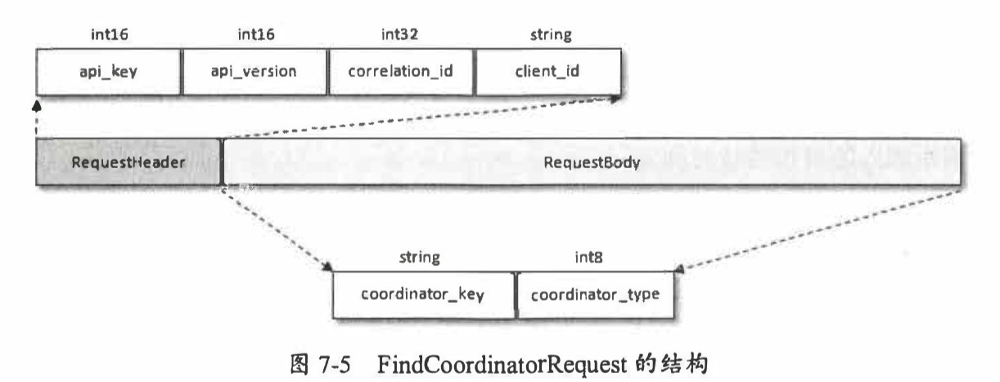

Kafka 在收到 FindCoordinatorRequest 请求之后，会根据 coordinator— key(也就是 gr oupld)查找对应的GroupCoordinator节点，如果找到对应的GroupCoordinator则会返回其相 对应的 node_id、host和port信息。

具体查找GroupCoordinator的方式是先根据消费组groupld的哈希值计算_consumer—offsets 中的分区编号

2. 第二阶段(JOIN_GROUP)

在成功找到消费组所对应的GroupCoordinator 之后 就进入加入消费组的阶段， 在此阶段的 消费者会向GroupCoordinator发送JoinGroupRequest请求，并处理响应。

如图 7-6 所示， JoinGroupR巳quest 的结构包含多个域 ：

group_id 就是消费组的 id ，通常也表示为 groupld。 

sessioηtimout 对应消费端参数 session.timeout.ms ，默认值为 10000 ，即 10 秒 。 GroupCoordinator 超过 session_timeout 指定的时间内没有收到心跳报文则 认为此消 费者已经下线。 

rebalance timeout 对应消费端参数 max .poll . interva l.ms ， 默认值 为 300000 ，即 5 分钟 。表示当消费组再平衡的时候， GroupCoordinator 等待各个消费者 重新加入的最长等待时间 。 

memb er_i d 表示 GroupCoordinator 分配给消费者 的 id 标识。 消 费者第一次发送 J oinGroupRequest 请求的时候此字段设置为 nulla  pr o toc o l_type 表示消费组实现的协议 ，对于消费者而言此字段值为“ consumer”。

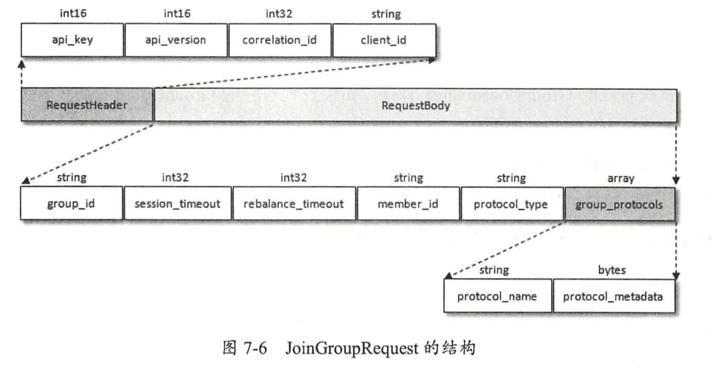

**选举消费纽的 leader**

GroupCoordinator 需要为消费组内的消费者选举出一个消费组的 leader，这个选举的算法也 很简单，分两种情况分析。如果消费组内还没有 leader，那么第一个加入消费组的消费者即为 消费组的 leader。如果某一时刻 leader 消费者由于某些原因退出了消费组，1 那么会重新选举一 个新的 leader

**第三阶段（ SYNC GROUP)**

leader 消 费者根据在第二阶段中选举 出来的分区分配策略来实施具体的分区分配， 在此之 后需要将分配的方案同步给各个消费者， 此时 leader 消费者并不是直接和其余的普通消费者同 步分配方案， 而是通过 GroupCoordinator 这个“中间人”来负 责转发同步分配方案的

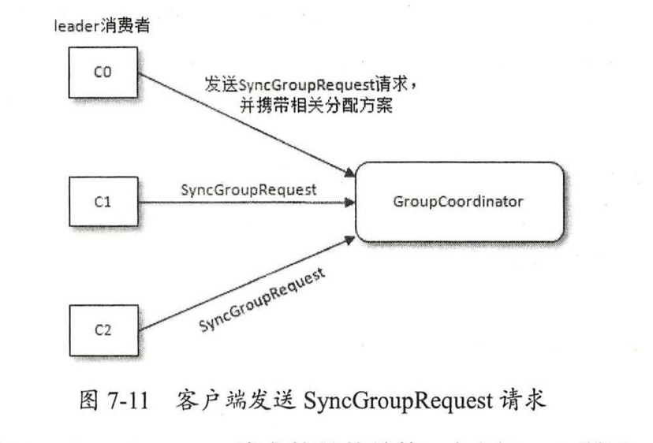

**消费纽元数据信息**

我们知道消费者客户端提交的消费位移会保存在 Kafka 的 consumer offsets 主题中，这里 Ea I 3b e也一样，只不过保存的是消费组的元数据信息 （ GroupMetadata ） 。具体来说，每个消费组的元 数据信息都是一条消息，不过这类消息并不依赖于具体版本的消息格式，因为它只定义了消息 中的 key 和 value 字段的具体内容，

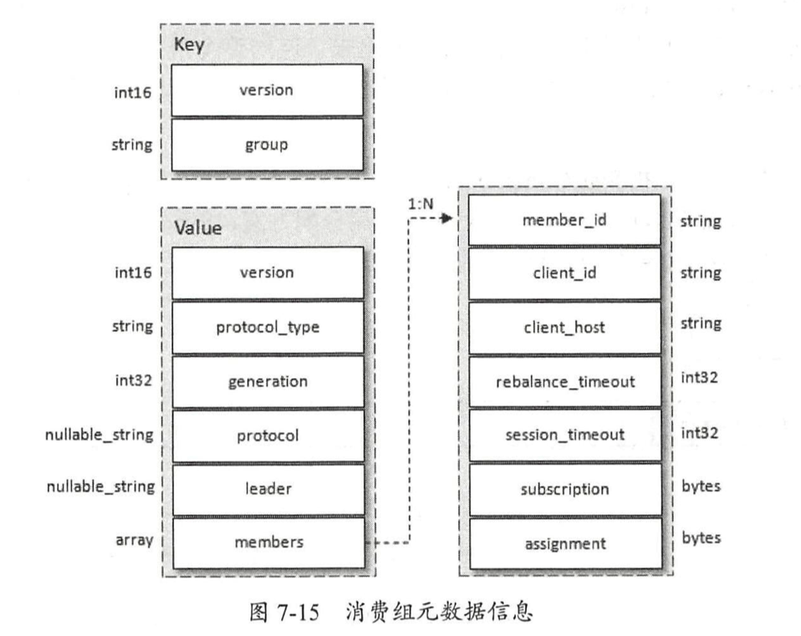

protocol type ：消费组实现的协议，这里的值为“ consumer”。 

gene rat tion：标识当前消费组的年代信息，避免收到过期请求的影响。 

protocol ： 消费组选取的分区分配策略。

 leader ： 消费组的 leader 消费者的名称。 

members ： 数组类型，其中包含了消费组的各个消费者成员信息，图 7- 15 中右边部分 就是消费者成员的具体信息，每个具体字段都 比 较容易辨别， 需要着重说明的是 subsc ription 和 assignment 这两个字段 ， 分别代码消费者的订阅信息和分配信 患。

**第四阶段（ HEARTBEAT)**

进入这个阶段之后，消 费组中的所有消费者就会处于正常工作状态。在正式消费之前 ，消 费者还需要确定拉取消息的起始位置。假设之前已经将最后的消费位移提交到了 GroupCoordinator， 并且 GroupCoordinator 将其保存到了 Kafka 内 部的一consumer_offsets 主题中 ， 此时消费者可以通过 OffsetFetchRequest 请求获取上次提交的消 费位移并从此处继续消费 。

### 11.3 __consumer_offsets 剖析

位移提交的内容最终会保存到 Kafka 的内部主题 consumer offsets 中

一般情况下， 当集群中第一 次有消费者消费消息时会自动创建主题 consumer offsets ，不 过它的副本因子还受 offsets. topic.replication. factor 参数的约束， 这个参数的默认值为 3 （下载安 装的包中此值可能为 1 ），分区数可以通过 offsets.topic.num.partitions 参数设置， 默认为 50 。客 户端提交消费位移是使用。 他etCommitRequest 请求实现的， OffsetCommitRequest

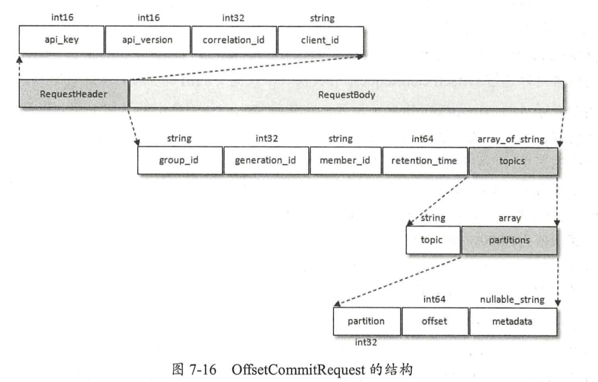

retention time 表示当前提交的消费位移所能保留的时长， 不过对于消费者而言 这个值保持为 I 。也就是说， 按照 broker 端的配置 o ffsets . retention . minutes 来确定 保留时长 。 offsets . retention . minutes 的默认值为 10080 ，即 7 天，超过这个时间后消 费位移的信息就会被删除（使用墓碑消息和日志压缩策略） 。

同消费组的元数据信息 一 样，最终提交的消费位移也会以消息的形式发送至主题 _consumer_ offsets ，与消费位移对应的消息也只定义了 key 和 value 字段的具体内容，它不依 赖于具体版本的消息格式，以此做到与具体的消息格式无关 。

图 7”17 中展示了消费位移对应的消息内容格式，上面是消息的 key，下面是消息的 value 。 可以看到 key 和 value 中都包含了 version 宇段，这个用来标识具体的 key 和 value 的版本信 息，不同的版本对应的内容格式可能并不相同 。就目前版本而言 ， key 和 value 的 version 值 都为 l 。

value 中包含了 5 个字段，除 version 宇段外，其余的 offset 、 metadata 、 commit times tamp、 expire timestamp 宇段分别表示消费位移、自定义的元数据信息、位移提交 到 Kafka 的时间戳、消费位移被判定为超时的时间戳 。

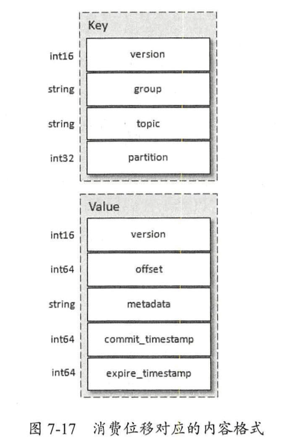

在处理完消费位移之后， Kafka 返回 OffsetCommitResponse 给客户端

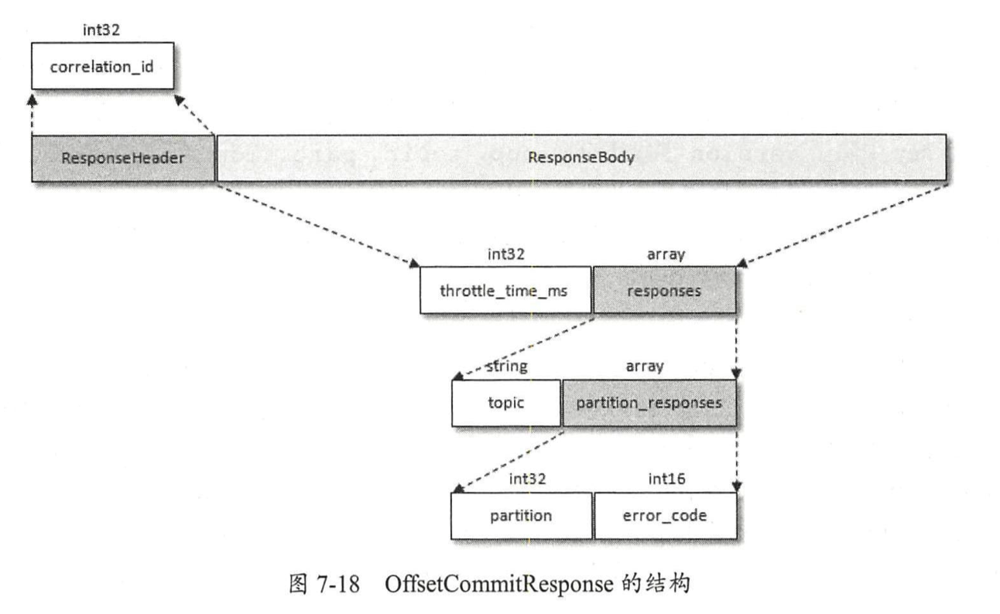

### 11.4 事务

一般而言， 消息中间件的消息传输保障有 3 个层级， 分别如下。

( 1 ) at most once：至多 一次。 消息可能会丢失， 但绝对不会重复传输。

( 2) at least once： 最少一次。 消息绝不会丢失， 但可能会重复传输。

 (3) exactly once ：恰好一次。 每条消息肯定会被传输一次且仅传输一次。

Kafka 从 0.11.0.0 版本开始引 入了幂等和事务这两个特性，以此来实现 EOS ( exactly once semantics ，精确一次处理语义） 。

##### 11.4.1幂等

所谓的幕等，简单地说就是对接口的多次调用所产生的结果和调用 一次是一致的 。开启幕等性功能的方式很简单，只需要显式地将生产者客户端参数 enab le.idempotence 设置为 true 即可（这个参数的默认值为 false ）

为了 实现生产者 的幕等性， Kafka 为此引入 了 producer id（ 以下简称 PID ）和序列号（ sequence number ）这两个概念

分别对应 v2 版的日志格式中 RecordBatch 的 producer id 和 first seqence 这两个宇段

。每个新的生产 者实例在初始化的时候都会被分配一个 PID ， 这个 PID 对用户而言是完全透明的 。 对于每个 PID, 消息发送到的每一个分区都有对应的序列号，这些序列号从 0 开始单调递增。生产者每发送一 条消息就会将＜PID ， 分区＞对应的序列号的值加 lo

broker 端会在内存中为每一对＜PID ，分区＞维护一个序列号。对于收到的每一条消息，只有 当它的序列号的值（ SN new ）比 broker 端中维护的对应的序列号的值（ SN old ）大 1 （ 即 SN new = SN old + 1 ）时， broker 才会接收它

##### 11.4.2 事务

事务可 以保证对多个分区写入操作的原子性。操作的原子性是指多个操作要么全部成功，要么全部失败，不存在部分成功、 部分失败的可能。

为了实现事务，应用程序必须提供唯一 的 transactionalld ，这个 transactionalld 通过客户端 参数 transact ional.id 来显式设置

transactionalld 与 PID 一一对应 ，两者之间所不同的是 transactionalld 由用户显式设置

另 外，为了保证新的生产者启动后具有相同 transactionalld 的旧生 产者能够立即失效，每个生产者通过 transactionalld 获取 PID 的 同时，还会获取一个单调递增的 producer epoch

为了实现事务的功能， Kafka还引入了事务协调器(TransactionCoordinator)来负责处理事 一 一 一 一 务， 这 点可以类比 下组协调器(GroupCoordinator)。 每 个生产者都会被指派 个特定的 TransactionCoordinator, 所有的事务逻辑包括分派PID等都是由TransactionCoordinator来负责 实施的。TransactionCoordinator会将事务状态持久化到内部主题_transaction_state中。 下面就 以最复杂的consume-transform-produce的流程（参考图7-21)为例来分析Kafka 事务的实现原 理。

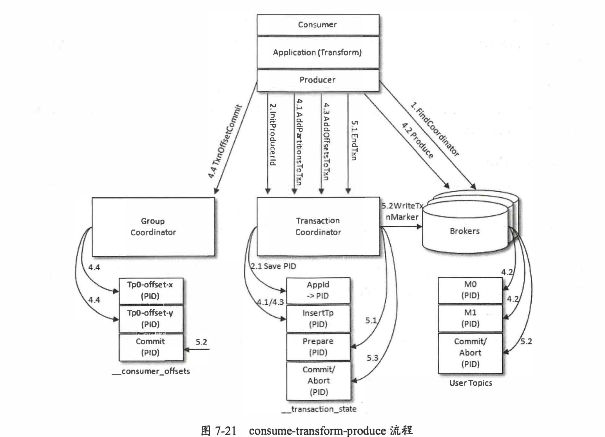

1. 查找TransactionCoordinator

TransactionCoordinator负责分配PID和管理事务， 因此生产者要做的第 一 件事情就是找出 对应的TransactionCoordinator所在的broker节点。 与查找GroupCoordinator节点 一 样， 也是通 过FindCoordinatorRequest请求来实现的， 只不过FindCoordinatorRequest中的coordinator_ type就由原来的O变成了I, 由此来表示与事务相关联(FindCoordinatorReq uest请求的具体结 构参考图 7-5)。

Kafka在收到FindCoorinatorRequest 请求之后， 会根据 coordinator_key (也就是 transactionalld)查找对应的TransactionCoordinator节点。如果找到，则会返回其相对应的node_id、 host和port信息。具体查找TransactionCoordinator的方式是根据transactionalld的哈希值计算主 题_transaction_state中的分区编号

2. 获取PID：在找到 TransactionCoordinator节点之后 ，就需要 为 当前生产者 分配 个PID 了。 凡是开启 了幕等性功能的生产者都必须执行这个操作，不需要考虑该生产者是否还开启了事务。 生产者 获取PID的操作是通过InitProducerldRequest请求来实现的， InitProducerldRequest请求体结构 如图 7-22所示 ， 其中transactianal—id表示事务的 transactionalld,transaction_ timeout_ms表示 TransactionCoordinaor等待事务状态 更新的超时时间， 通过 生产者客户端参 数transaction.timeout.ms配置， 默认值为60000。
3. 开启事 务

通过 KafkaProducer 的 beginTransactionO 方法可以开启 一 个事务

## 12_Kafka文件存储


由于生产者生产的消息会不断追加到 log 文件末尾， 为防止 log 文件过大导致数据定位效率低下， Kafka 采取了**分片**和**索引**机制，将每个 partition 分为多个 segment。

每个 segment对应两个文件——“.index”文件和“.log”文件。 这些文件位于一个文件夹下， 该文件夹的命名规则为： topic 名称+分区序号。例如， first 这个 topic 有三个分区，则其对应的文件夹为 first-0,first-1,first-2。

```
00000000000000000000.index
00000000000000000000.log
00000000000000170410.index
00000000000000170410.log
00000000000000239430.index
00000000000000239430.log
```

index 和 log 文件以当前 segment 的第一条消息的 offset 命名。下图为 index 文件和 log文件的结构示意图。

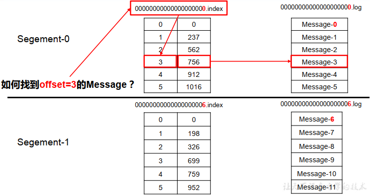

**“.index”文件存储大量的索引信息，“.log”文件存储大量的数据**，索引文件中的元数据指向对应数据文件中 message 的物理偏移地址。


## 13_Kafka 可靠性探究

### 13.1 副本剖析

#### 13.1.1 是小副本

正常情况下，分区的所有副本都处于ISR集合中，但是难免会有异常情况发生，从而某些 副本被剥离出ISR集合中。在ISR集合之外，也就是处于同步失效或功能失效（比如副本处于 非存活状态）的副本统称为失效副本， 失效副本对应的分区也就称为同步失效分区

前面提及失效副本不仅是指 处于功能失效状态的副本，处于同步失效状态的副本也可以看 一 作失效副本。怎么判定 个分区是否有副本处于同步失效 的状态呢? Kafka从0.9.x版本开始就 通过唯 一 的broker端参数replica.lag.time.max.ms来抉择，当ISR集合中的 一 个 follower 副本滞后leader副本的 时间超过此参数指定的值时则判定为同步失败，需要将此follower副本 剔除出ISR集合

体的实现原理也很容易理解，当follower副本将leader副本LEO (LogEndOffset)之 前 的日志全部同步时，则认为 该 follower 副本已经追赶上leader 副本， 此 时更新该副本的 lastCaughtUpTimeMs标识。Kafka 的副本管理器会启动 一个副本过期检测的定时任务，而这个 定 时任 务会定 时检查当前时间与副 本 的 lastCaughtUpTimeMs差值是否大 于参 数 replica.lag.time.max.ms 指定的值 。

#### 13.1.2 ISR的伸缩

Kafka 在启动的时候会开启两个与ISR相关的定时任务，名称分别为"isr-expiration"和 isr-change-propagation"。isr- expiration任务会周期性地检测每个分区是否需要缩减其ISR集 合。这个周期和replica.lag.time.max.ms参数有关，大小是这个参数值的 一半

当检测到ISR集合中有失效副本 时，就会收缩ISR集合 。如果某个分区的ISR集合 发生变更， 则会将变更后的数据 记录到ZooKeeper 对应的/brokers/topics/<topic＞／ partituon/ <partition>/state节点中

`{ "controller_epoch": 26, "leader": 0, "version": 1, "leader_epoch" :2, "isr": [0, l]}`

其中 controller—epoch表示当前 Kafka控制器的epoch, leader表示当前分区的leader 副本所在的broker的过编号， version表示 版本号（当前版本固定为1) , leader_epoch 表 示当前分区的leader纪元 ， isr表示变更后的ISR列表。

#### 13.1.3 LEO与HW

对于副本而言，还有两个概念：本地副本(Local Replica)和远程副本( Remote Replica) 本地副本是指对应的Log分配在当前 的broker节点上，远程副本是指对应的Log分配在其他的 broker节点上。

整个消息追加的过程可以概括如下:

( 1)生产者客户端发送消息至leader副本（副本1)中。

( 2)消息被追加到leader副本的本地日志，并且会更新日志的偏移量。 

( 3) follower副本（副本2和副本3)向leader副本请求同步数据。 (4) leader副本所在的服务器读取本地日志，并更新对应拉取 的 follower副本的信息。

(5) leader副本所在的服务器将拉取结果返回给follower副本。

(6) follower副本收到leader副本返回的拉取结果，将消息追加到本地日志中，并更新日 志的偏移量信息。

之后follower副本 （不带阴影的方框）向leader副本拉取消息， 在拉取的请求中会带有自 身的LEO信息， 这个LEO信息对应的是FetchReques t请求中的fetch_offset 。leader副本 返回给follower副本相应的消息，并且还带有自身的HW信息， 如图8-5所示，这个HW信息 对应的是FetchResponse中的high_watermark。

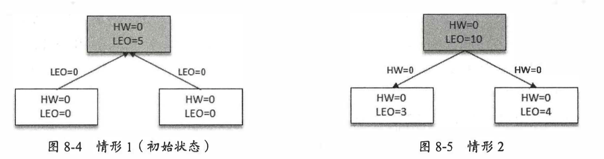

#### 13.1.4 Leader Epoch介入

首先我们来看 一 下数据丢失的问题， 如图8-9所示， Replica B是当前的leader 副本（用 L 标记）， Replica A是follower 副本。 参照8.1.3节中的图8-4至图8-7的 过程来进行分析：在某 一时刻， B中有2条消息 ml和m2 , A从B中 同步了这两条消息， 此时A和B的LEO都为2, 同时HW 都为l; 之后A再向B中发送请求以拉取消息， FetchRequest请求中带上了A的LEO 信息， B 在收到请求之后 更新了自己的HW为2; B中虽然没有更多的消息， 但还是在 延时一  段时间之后（参考6. 3节中的延时拉取）返回FetchResponse, 并在其中包含了HW信息；最后 A 根据FetchResponse中的 HW信息 更新自己的HW为2。

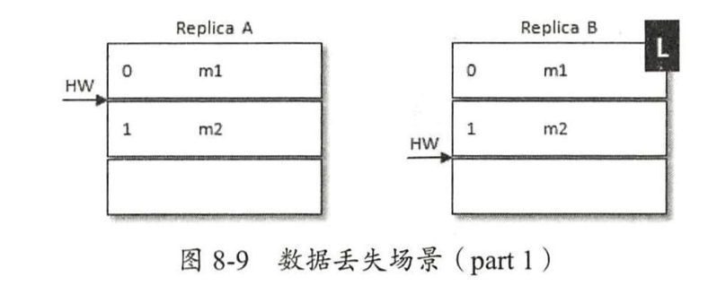

可以看到整个过程中两者之间的 HW 同步有一个问隙， 在 A 写入消息 m2 之后 C LEO 更新 为 2 ）需要再一轮的 FetchRequest/ FetchR巳sponse 才能更新自身的 HW 为 2 。如图 8- 10 所示， 如 果在这个时候 A 岩机了 ，那么在 A 重启之后会根据之前 HW 位置（这个值会存入本地的复制 点文件 replication-offset-checkpoint ）进行日志截断 ， 这样便会将 m2 这条消息删除 ，此时 A 只 剩下 ml 这一条消息， 之后 A 再向 B 发送 FetchRequest 请求拉取消息。

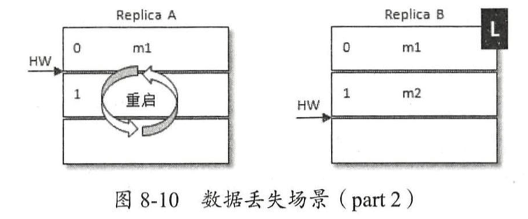

此时若 B 再右机， 那么 A 就会被选举为新的 leader， 如图 8-1 l 所示。 B 恢复之后会成为 follower， 由于 follower 副本 HW 不能 比 leader 副本的 HW 高，所 以还会做一次日志截断 ，以此 将 HW 调整为 l 。这样一来 m2 这条消息就丢失了（就算 B 不能恢复 ， 这条消息也同样丢失）。

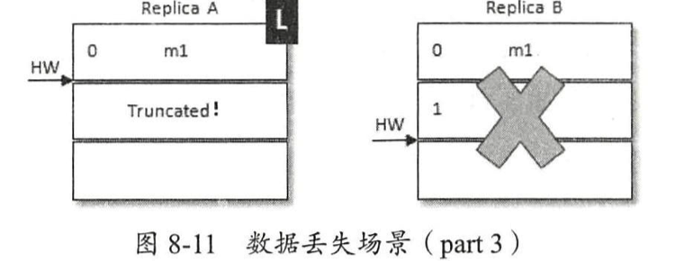

如图 8-12 所示， 当前 leader 副本为 A, follower 副本为 B , A 中有 2 条消息 m l 和 m2 ，并 且 HW 和 LEO 都为 2, B 中 有 1 条消息 ml ， 井且 HW 和 LEO 都为 l 。假设 A 和 B 同时“挂掉”，然后 B 第一个恢复过来并成为 leader，如图 8-13 所示 。

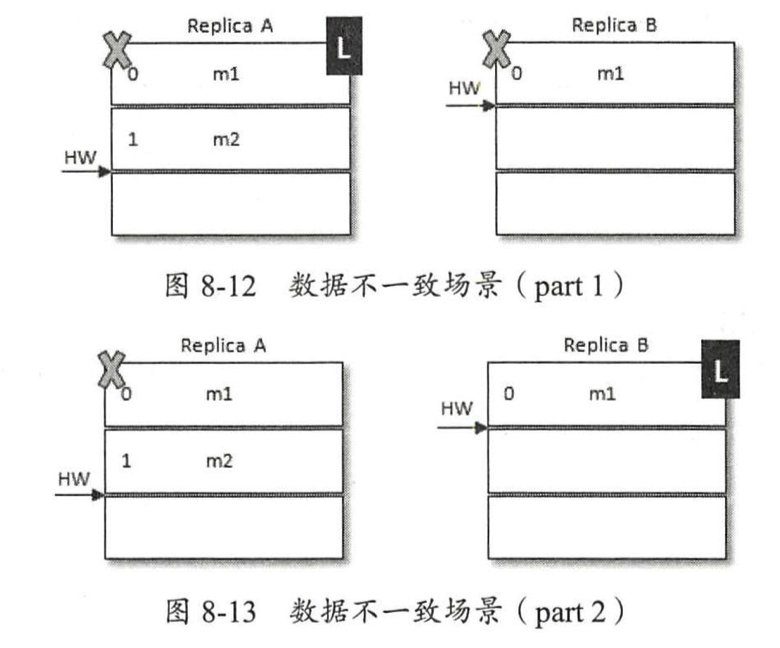

之后 B 写入消息 m3 ， 并将 LEO 和 HW 更新至 2 （假设所有场景中的 rnin . insync.replicas 参数配置为 1 ） 。此时 A 也恢复过来了，根据前面数据丢失场景 中的介绍可知它会被赋予 follower

的角色，井且需要根据 HW 截断日志及发送 FetchRequest 至 B ，不过此时 A 的 HW 正好也为 2, 那么就可以不做任何调整了，如图 8-14 所示 。

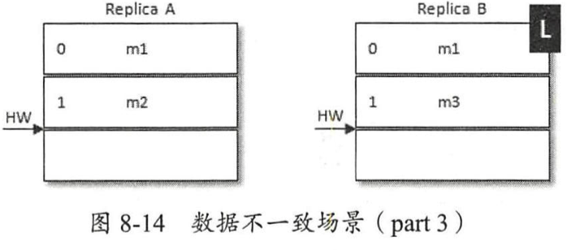

如此一来 A 中保留了 m2 而 B 中没有， B 中新增了 m3 而 A 也同步不到，这样 A 和 B 就出 现了数据不一致的情形 。

**解决数据丢失**

为了解决上述两种问题， Kafka 从 0.11.0.0 开始引入了 leader epoch 的概念，在需要截断数 据的时候使用 leader epoch 作为参考依据而不是原本的 HW。 leader epoch 代表 leader 的纪元信 息（ epoch ），初始值为 0。每当 leader 变更一次， leader epoch 的值就会加 l ，相当于为 leader 增设了 一个版本号 。与此同时，每个副本中还会增设一个矢量＜LeaderEpoch => StartOffset＞，其 中 StartOffset 表示当前 LeaderEpoch 下写入的第一条消息 的偏移量。每个副本的 Log 下都有一 个 leader-epoch-checkpoint 文件，在发生 leader epoch 变更时 ，会将对应的矢量对追加 到这个文 件中，其实这个文件在图 5-2 中己有所呈现。 5 .2.5 节中讲述 v2 版本的消息格式时就提到了消息 集中的 partition leader epoch 宇段，而这个字段正对应这里讲述的 leader epoch。

下面我们再来看一下 引入 leader epoch 之后如何应付前面所说的数据丢失和数据不一致 的 场景。首先讲述应对数据丢失的问题，如图 8- 15 所示，这里只 比 图 8-9 中多了 LE (LeaderEpoch 的缩写 ，当前 A 和 B 中的 LE 都为 0 ） 。

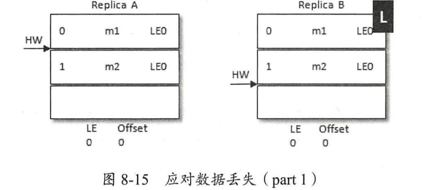

同样 A 发生重启 ，之后 A 不是先忙着截断日志而是先发送 OffsetsF orLeaderEpochRequest 请求给 B ( OffsetsForLeaderEpochRequest 请求体结构 如 图也16 所示 ，其中包含 A 当前 的 LeaderEpoch 值） ' B 作为目前的 leader 在收到请求之后会返回当 前的 LEO

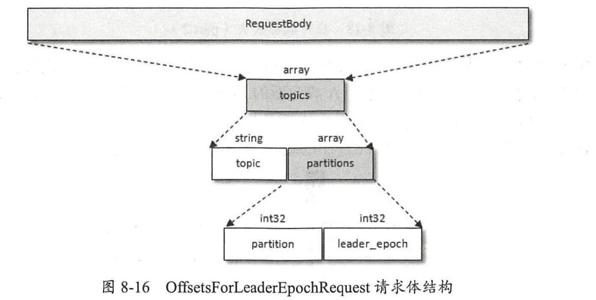

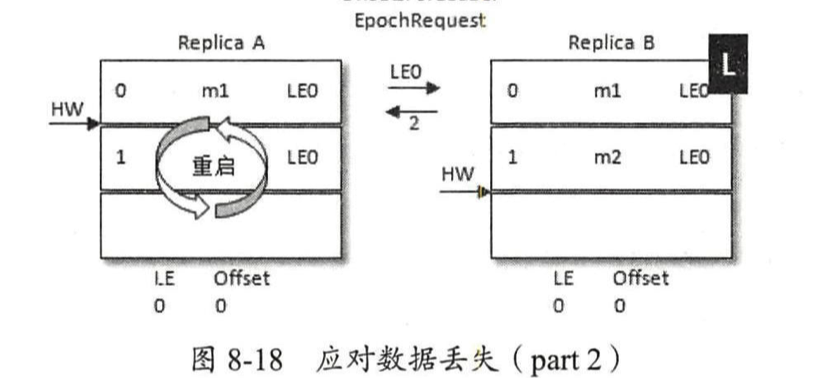

如果 A 中的 LeaderEpoch （假设为 LE_A ）和 B 中的不相同，那么 B 此时会查找 LeaderEpoch 为 LE A+l 对应的 StartOffset 并返回给 A ，也就是 LE A 对应的 LEO ，所以我们可以将 OffsetsF orLeaderEpochRequest 的请求看作用来查找 follower 副本当前 LeaderEpoch 的 LEO 。

如图 8-18 所示， A 在收到 2 之后发现和目前的 LEO 相同，也就不需要截断日志 了 。之后 同图 8-11 所示的一样， B 发生了右机， A 成为新的 leader，那么对应的 LE=O 也变成了 LE= l, 对应的消息 m2 此时就得到了保留


**解决数据不一致**

下面我们再来看一下 leader epoch 如何应对数据不一致的场景。

当前 A 为 leader, B 为 follower, A 中有 2 条消息 ml 和 m2 ，而 B 中有 1 条消息 ml 。假设 A 和 B 同时“挂 掉”，然后 B 第一个恢复过来并成为新的 leader。

之后B写入消息m3,并将LEO和HW更新至2, 如图8-21所示。注意此时的LeaderEpoch 已经从LEO增至LEI了

紧接着A也恢复过来成为follower并向B发送OffsetsForLeaderEpochRequest请求，此时A 的 LeaderEpoch为LEO。 B根据LEO查询到对应的offset为1并返回给A, A就截断日志并删 除了消息m2, 如图8-22所示。 之后A发送FetchRequest至B请求来同步数据

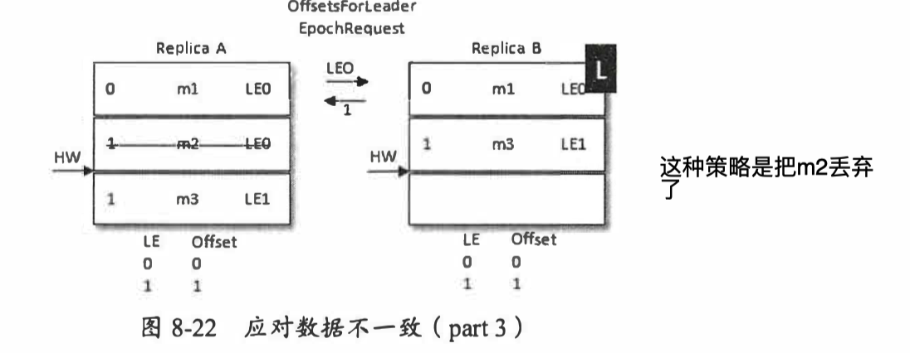

#### 13.1.5 为什么不支持读写分离

(1)数据 一 致性问题。数据从主节点转到从节点必然会有 一 个延时的时间窗口，这个时间窗口会导致主从节点之间的数据不 一 致。某 一 时刻，在主节点和从节点中A数据的值都为X, 之后将主节点中 A 的值修改为 Y, 那么在这个变更通知到从节点之前， 应用读取从节点中的 A 数据的值并不为最新的 Y, 由此便产生了数据不 一 致的问题。

(2) 延时问题。类似 Redis 这种组件，数据从写入主节点到同步至从节点中的过程需要经 历网络一主节点内存一网络一从节点内存这几个阶段，整个过程会耗费 一 定的时间。 而在 Kafka 中，主从同步会比 Redis 更加耗时，它需要经历网络一主节点内存一主节点磁盘一网络一从节 点内存一从节点磁盘这几个阶段。对延时敏感的应用 而言，主写从读的功能并不太适用。

## 14_Kafka生产者ISR

为保证 producer 发送的数据，能可靠的发送到指定的 topic， topic 的每个 partition 收到producer 发送的数据后，都需要向 producer 发送 ack（acknowledgement 确认收到），如果producer 收到 ack， 就会进行下一轮的发送，否则重新发送数据。


**如何发送ack**

确保有follower与leader同步完成，leader再发送ack，这样才能保证leader挂掉之后，能在follower中选举出新的leader。

----

### 1.副本数据同步策略

**多少个follower同步完成之后发送ack？**

1. 半数以上的follower同步完成，即可发送ack继续发送重新发送
2. 全部的follower同步完成，才可以发送ack

| 序号 | 方案                          | 优点                                                         | 缺点                                                         |
| ---- | ----------------------------- | ------------------------------------------------------------ | ------------------------------------------------------------ |
| 1    | 半数以上完成同步， 就发送 ack | 延迟低                                                       | 选举新的 leader 时，容忍 n 台节点的故障，需要 2n+1 个副本。（如果集群有2n+1台机器，选举leader的时候至少需要半数以上即n+1台机器投票，那么能容忍的故障，最多就是n台机器发生故障）容错率：1/2 |
| 2    | 全部完成同步，才发送ack       | 选举新的 leader 时， 容忍 n 台节点的故障，需要 n+1 个副本（如果集群有n+1台机器，选举leader的时候只要有一个副本就可以了）容错率：1 | 延迟高                                                       |

Kafka 选择了第二种方案，原因如下：

1. 同样为了容忍 n 台节点的故障，第一种方案需要 2n+1 个副本，而第二种方案只需要 n+1 个副本，而 Kafka 的每个分区都有大量的数据， 第一种方案会造成大量数据的冗余。
2. 虽然第二种方案的网络延迟会比较高，但网络延迟对 Kafka 的影响较小。

### 2.ISR

采用第二种方案之后，设想以下情景： leader 收到数据，所有 follower 都开始同步数据，但有一个 follower，因为某种故障，迟迟不能与 leader 进行同步，那 leader 就要一直等下去，直到它完成同步，才能发送 ack。这个问题怎么解决呢？

Leader 维护了一个动态的 **in-sync replica set** (ISR)，意为和 leader 保持同步的 follower 集合。当 ISR 中的 follower 完成数据的同步之后，就会给 leader 发送 ack。如果 follower长时间未向leader同步数据，则该follower将被踢出ISR，该时间阈值由`replica.lag.time.max.ms`参数设定。 Leader 发生故障之后，就会从 ISR 中选举新的 leader。


## 15_Kafka生产者ACK机制

对于某些不太重要的数据，对数据的可靠性要求不是很高，能够容忍数据的少量丢失，所以没必要等 ISR 中的 follower 全部接收成功。

所以 Kafka 为用户提供了三种可靠性级别，用户根据对可靠性和延迟的要求进行权衡，选择以下的配置。

### acks 参数配置：

- 0： producer 不等待 broker 的 ack，这一操作提供了一个最低的延迟， broker 一接收到还没有写入磁盘就已经返回，当 broker 故障时有可能**丢失数据**；
- 1： producer 等待 broker 的 ack， partition 的 leader 落盘成功后返回 ack，如果在 follower同步成功之前 leader 故障，那么将会**丢失数据**；

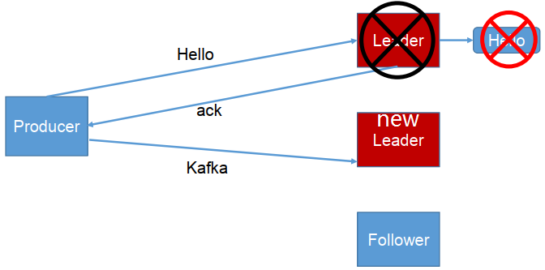

- -1（all） ： producer 等待 broker 的 ack， partition 的 leader 和 ISR 的follower 全部落盘成功后才返回 ack。但是如果在 follower 同步完成后， broker 发送 ack 之前， leader 发生故障，那么会造成**数据重复**。


```markdown
acks
The number of acknowledgments the producer requires the leader to have received before considering a request complete. This controls the durability of records that are sent. The following settings are allowed:

**acks=0** If set to zero then the producer will not wait for any acknowledgment from the server at all. The record will be immediately added to the socket buffer and considered sent. No guarantee can be made that the server has received the record in this case, and the retries configuration will not take effect (as the client won't generally know of any failures). The offset given back for each record will always be set to -1.
**acks=1** This will mean the leader will write the record to its local log but will respond without awaiting full acknowledgement from all followers. In this case should the leader fail immediately after acknowledging the record but before the followers have replicated it then the record will be lost.
**acks=all** This means the leader will wait for the full set of in-sync replicas to acknowledge the record. This guarantees that the record will not be lost as long as at least one in-sync replica remains alive. This is the strongest available guarantee. This is equivalent to the acks=-1 setting.
Type:	string
Default:	1
Valid Values:	[all, -1, 0, 1]
Importance:	high
```


## 16_Kafka应用

### 16.1消费组管理

在 Kafka 中，我们可以通过 kafka-consumer-groups.sh 脚本查看或变更消费组的信息 。 我们 可以通过 list 这个指令类型 的参数来罗列出当前集群 中所有的消费组名称

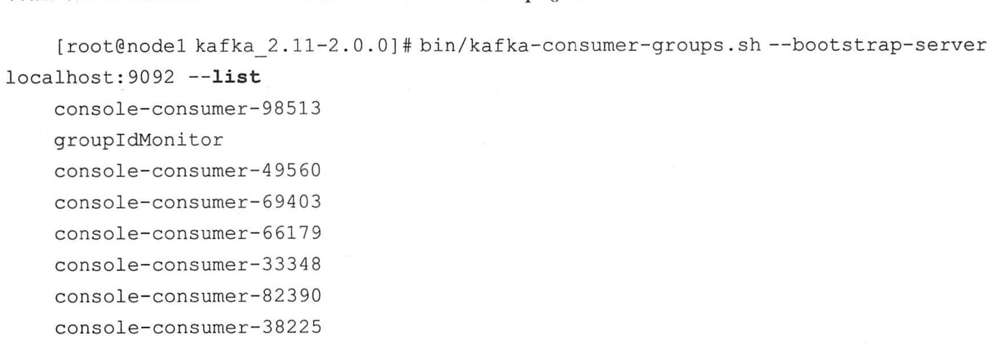

kafka-consumer-groups.sh 脚本还可以配合 describe 这个指令类型的参数来展示某一个消 费组的详细信息， 不过要完成此功能还需要配合 group 参数来一 同实现

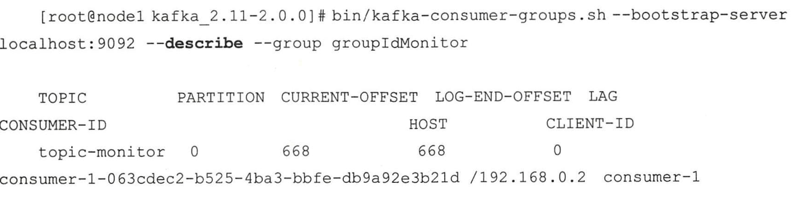

消费组一共有 Dead、 Empty 、 PreparingRebalance 、 CompletingRebalance 、 Stable 这几种状 态，正常情况下， 一个具有消费者成员的消费组的状态为 Stable。 我们可以通过 state 参数来 查看消费组当前的状态 ， 示例如下

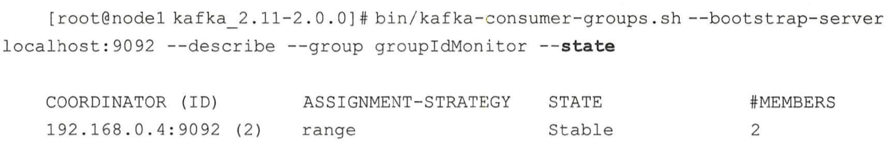

我们还可以通过 members 参数罗列出消费组内的消费者成员信息，参考如下：

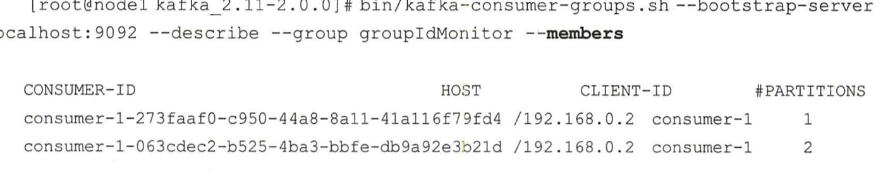

如果在此基础上再增加一个 verbose 参数，那么还会罗列出每个消费者成员的分配情况， 如下所示 。

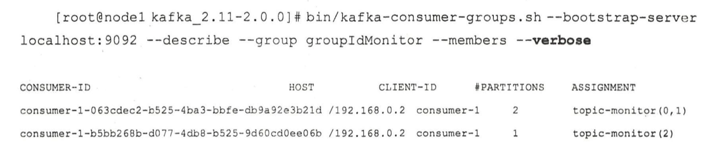

我们可 以通过 delete 这个指令类型的参数来删除一个指定的消费组，不过如果消费组中 有消费者成员正在运行，则删除操作会失败

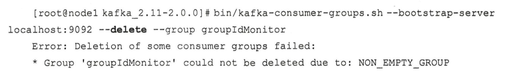

### 16.2 消费位移管理i

kafka-consumer-groups.sh 脚本还提供了重置消费组内消费位移的功能，具体是通过 reset-off sets 这个指令类型的参数来实施 的。，不过实现这一功能的前提是消费组内没有正 在运行的消费者成员。

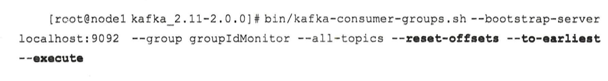

可 以 通过将一all-t。 pies 修改为一t。 pie 来实现更加细粒度的消费位移的重量 ， all -t。 pies 参数指定了消费组中所有主题，而 topic 参数可 以指定j在个主题 ， 甚至可 以是 主题中的若平分区 。下面的示例将主题 topic-monitor 分区 2 的消费位移置为分区 的末尾：

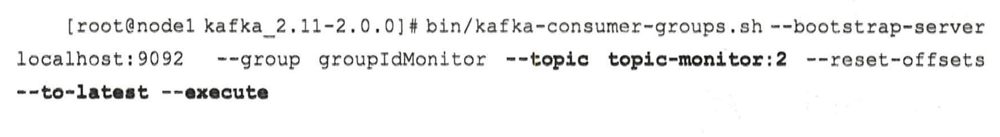

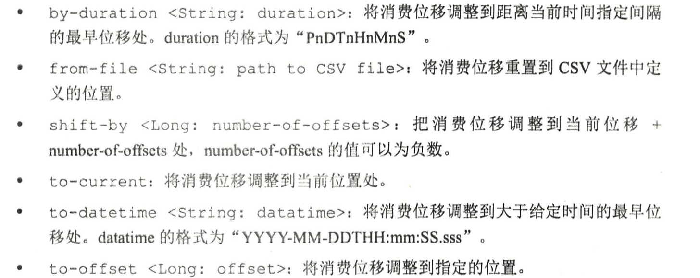

### 16.3 手动删除消息

下 面使用 kafka-delete-records. sh 脚本来删除部分消息 。 在执行具体的删除动作之前需要 先配置一个 JSON 文件 ，用来指定所要删除消息的分区及对应的位置 。 我们 需要分别删除主 题 topic-monitor 下 分区 。 中偏移 量为 l O 、分区 l 中偏移量 为 l I 和分区 2 中偏移量 为 1 2 的 消息：

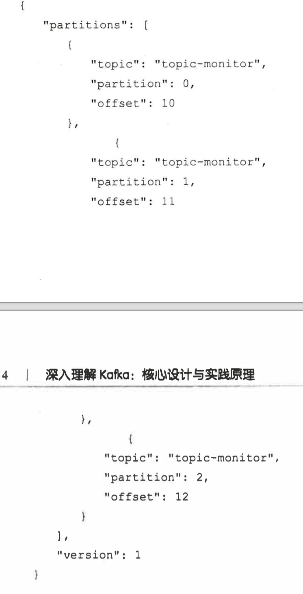

之后将这段内容保存到文件中， 比如取名为 delete.json, 在此之后， 我们就可以通过 kafka-delete-records.sh 脚本中的 offset-json-file 参数来指定这个 JSON 文件。具体的删除 操作如下：

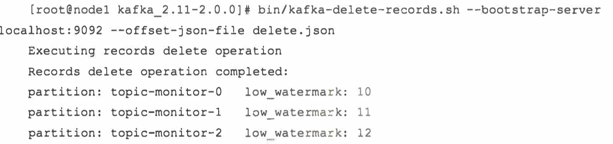

### 16.4 Kafka Connect

Kafka Connect 是 一 个工具， 它为在 Kafka 和外部数据存储系统之间移动数据提供了 一 种可 靠的且可伸缩的实现方式。 Kafka Connect 可以简单快捷地将数据从 Kafka 中导入或导出， 数据 范围涵盖关系型数据库、 日志和度痲数据、 Hadoop 和数据仓库、 NoSQL 数据存储、 搜索索引 等。 相对于生产者和消费者客户端而言， Kafka Connect 省掉了很多开发的工作

Kafka Connect 有两个核心概念： Source 和 Sink。参考图 9-1, Source 负责导入数据到 Kafl<a, Sink 负责从 Kafka 导出数据， 它们都被称为 Connector C连接器）。

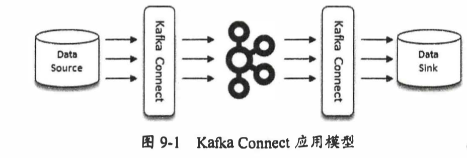

在 Kafka Connect 中还有两个重要的概念： Task 和 Worker。 Task 是 Kafka Connect 数据模型 的主角，每 一 个 Connector 都会协调 一 系列的 Task 去执行任务， Connector 可以把 一 项工作分割 成许多 Task, 然后把 Task 分发到各个 Worker 进程中去执行（分布式模式下）， Task 不保存自 己的状态信息， 而是交给特定的 Kafka 主题去保存。 Connector 和 Task 都是逻辑工作单位， 必 须安排在进程中执行， 而在 Kafka Connect 中， 这些进程就是 Worker 。

Kafka Connect 提供了以下特性 。

• 通用性：规范化其他数据系统与 Kafka 的集成， 简化了连接器的开发、 部署和管理。

• 支待独立模式 (standalone) 和分布式模式 (distributed) 。

• REST 接口：使用 REST API 提交和管理 Connector。

• 自动位移管理：自动管理位移提交， 不需要开发人员干预， 降低了开发成本。

• 分布式和可扩展性： Kafka Connect 基于现有的组管理协议来实现扩展 Kafka Connect 集群。

• 流式计算／批处理的集成。


## 17_Kafka_Exactly Once

将服务器的 ACK 级别设置为-1（all），可以保证 Producer 到 Server 之间不会丢失数据，即 **At Least Once** 语义。

相对的，将服务器 ACK 级别设置为 0，可以保证生产者每条消息只会被发送一次，即 **At Most Once** 语义。

At Least Once 可以保证数据不丢失，但是不能保证数据不重复；相对的， At Most Once可以保证数据不重复，但是不能保证数据不丢失。 但是，对于一些非常重要的信息，比如说**交易数据**，下游数据消费者要求数据既不重复也不丢失，即 **Exactly Once** 语义。

为了实现 Producer 的幂等语义，Kafka 引入了`Producer ID`（即`PID`）和`Sequence Number`。每个新的 Producer 在初始化的时候会被分配一个唯一的 PID，该 PID 对用户完全透明而不会暴露给用户。

对于每个 PID，该 Producer 发送数据的每个`<Topic, Partition>`都对应一个从 0 开始单调递增的`Sequence Number`。

类似地，Broker 端也会为每个`<PID, Topic, Partition>`维护一个序号，并且每次 Commit 一条消息时将其对应序号递增。对于接收的每条消息，如果其序号比 Broker 维护的序号（即最后一次 Commit 的消息的序号）大一，则 Broker 会接受它，否则将其丢弃：

- 如果消息序号比 Broker 维护的序号大一以上，说明中间有数据尚未写入，也即乱序，此时 Broker 拒绝该消息，Producer 抛出`InvalidSequenceNumber`
- 如果消息序号小于等于 Broker 维护的序号，说明该消息已被保存，即为重复消息，Broker 直接丢弃该消息，Producer 抛出`DuplicateSequenceNumber`

在 0.11 版本以前的 Kafka，对此是无能为力的，只能保证数据不丢失，再在下游消费者对数据做全局去重。对于多个下游应用的情况，每个都需要单独做全局去重，这就对性能造成了很大影响。

0.11 版本的 Kafka，引入了一项重大特性：**幂等性**。**所谓的幂等性就是指 Producer 不论向 Server 发送多少次重复数据， Server 端都只会持久化一条**。幂等性结合 At Least Once 语义，就构成了 Kafka 的 Exactly Once 语义。即：

```
At Least Once + 幂等性 = Exactly Once
```

要启用幂等性，只需要将 Producer 的参数中 `enable.idempotence` 设置为 true 即可。 Kafka的幂等性实现其实就是将原来下游需要做的去重放在了数据上游。开启幂等性的 Producer 在初始化的时候会被分配一个 PID，发往同一 Partition 的消息会附带 Sequence Number。而Broker 端会对`<PID, Partition, SeqNumber>`做缓存，当具有相同主键的消息提交时， Broker 只会持久化一条。

但是 PID 重启就会变化，同时不同的 Partition 也具有不同主键，所以幂等性无法保证跨分区跨会话的 Exactly Once。


## 18_Kafka生产者总结（略）


## 19_Kafka消费者分区分配策略

### 1.消费方式

**consumer 采用 pull（拉） 模式从 broker 中读取数据**。

**push（推）模式很难适应消费速率不同的消费者，因为消息发送速率是由 broker 决定的**。它的目标是尽可能以最快速度传递消息，但是这样很容易造成 consumer 来不及处理消息，典型的表现就是拒绝服务以及网络拥塞。而 pull 模式则可以根据 consumer 的消费能力以适当的速率消费消息。

**pull 模式不足之处**是，如果 kafka 没有数据，消费者可能会陷入循环中， 一直返回空数据。 针对这一点， Kafka 的消费者在消费数据时会传入一个时长参数 timeout，如果当前没有数据可供消费， consumer 会等待一段时间之后再返回，这段时长即为 timeout。

### 2.分区分配策略

一个 consumer group 中有多个 consumer，一个 topic 有多个 partition，所以必然会涉及到 partition 的分配问题，即确定那个 partition 由哪个 consumer 来消费。

Kafka 有两种分配策略：

- round-robin循环
- range

#### 2.1 Round

关于Roudn Robin重分配策略，其主要采用的是一种轮询的方式分配所有的分区，该策略主要实现的步骤如下。这里我们首先假设有三个topic：t0、t1和t2，这三个topic拥有的分区数分别为1、2和3，那么总共有六个分区，这六个分区分别为：t0-0、t1-0、t1-1、t2-0、t2-1和t2-2。这里假设我们有三个consumer：C0、C1和C2，它们订阅情况为：C0订阅t0，C1订阅t0和t1，C2订阅t0、t1和t2。那么这些分区的分配步骤如下：

- 首先将所有的partition和consumer按照字典序进行排序，所谓的字典序，就是按照其名称的字符串顺序，那么上面的六个分区和三个consumer排序之后分别为：


- 然后依次以按顺序轮询的方式将这六个分区分配给三个consumer，如果当前consumer没有订阅当前分区所在的topic，则轮询的判断下一个consumer：
- 尝试将t0-0分配给C0，由于C0订阅了t0，因而可以分配成功；
- 尝试将t1-0分配给C1，由于C1订阅了t1，因而可以分配成功；
- 尝试将t1-1分配给C2，由于C2订阅了t1，因而可以分配成功；
- 尝试将t2-0分配给C0，由于C0没有订阅t2，因而会轮询下一个consumer；
- 尝试将t2-0分配给C1，由于C1没有订阅t2，因而会轮询下一个consumer；
- 尝试将t2-0分配给C2，由于C2订阅了t2，因而可以分配成功；
- 同理由于t2-1和t2-2所在的topic都没有被C0和C1所订阅，因而都不会分配成功，最终都会分配给C2。
- 按照上述的步骤将所有的分区都分配完毕之后，最终分区的订阅情况如下：

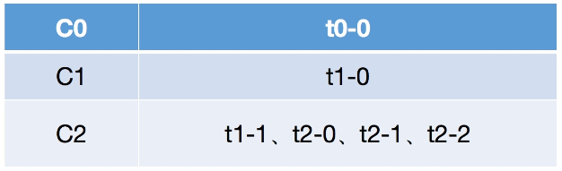

从上面的步骤分析可以看出，轮询的策略就是简单的将所有的partition和consumer按照字典序进行排序之后，然后依次将partition分配给各个consumer，如果当前的consumer没有订阅当前的partition，那么就会轮询下一个consumer，直至最终将所有的分区都分配完毕。但是从上面的分配结果可以看出，轮询的方式会导致每个consumer所承载的分区数量不一致，从而导致各个consumer压力不均一。

#### 2.2 Range

所谓的Range重分配策略，就是首先会计算各个consumer将会承载的分区数量，然后将指定数量的分区分配给该consumer。这里我们假设有两个consumer：C0和C1，两个topic：t0和t1，这两个topic分别都有三个分区，那么总共的分区有六个：t0-0、t0-1、t0-2、t1-0、t1-1和t1-2。那么Range分配策略将会按照如下步骤进行分区的分配：

- 需要注意的是，Range策略是按照topic依次进行分配的，比如我们以t0进行讲解，其首先会获取t0的所有分区：t0-0、t0-1和t0-2，以及所有订阅了该topic的consumer：C0和C1，并且会将这些分区和consumer按照字典序进行排序；
- 然后按照平均分配的方式计算每个consumer会得到多少个分区，如果没有除尽，则会将多出来的分区依次计算到前面几个consumer。比如这里是三个分区和两个consumer，那么每个consumer至少会得到1个分区，而3除以2后还余1，那么就会将多余的部分依次算到前面几个consumer，也就是这里的1会分配给第一个consumer，总结来说，那么C0将会从第0个分区开始，分配2个分区，而C1将会从第2个分区开始，分配1个分区；
- 同理，按照上面的步骤依次进行后面的topic的分配。
- 最终上面六个分区的分配情况如下：


可以看到，如果按照`Range`分区方式进行分配，其本质上是依次遍历每个topic，然后将这些topic的分区按照其所订阅的consumer数量进行平均的范围分配。这种方式从计算原理上就会导致排序在前面的consumer分配到更多的分区，从而导致各个consumer的压力不均衡。

## 20_Kafka高级_消费者offset存储

等待补充


## 21_Kafka消费者组

### 需求

测试同一个消费者组中的消费者， **同一时刻只能有一个**消费者消费。

### 操作步骤

1.修改`%KAFKA_HOME\config\consumer.properties%`文件中的`group.id`属性。

```properties
group.id={{name}}
```

2.打开两个cmd，分别启动两个消费者。（以`%KAFKA_HOME\config\consumer.properties%`作配置参数）

```bat
kafka-console-consumer --bootstrap-server localhost:9092 --topic test
```

3.再打开一个cmd，启动一个生产者。

```bat
kafka-console-producer --broker-list localhost:9092 --topic test
```

4.在生产者窗口输入消息，观察两个消费者窗口。**会发现两个消费者窗口中，只有一个才会弹出消息**。


## 23_Kafka 高效读写数据

### 3.Zookeeper在Kafka中的作用

Kafka 集群中有一个 broker 会被选举为 Controller，负责管理集群 broker 的上下线，所有 topic 的分区副本分配和 leader 选举等工作。

Controller 的管理工作都是依赖于 Zookeeper 的。

以下为 partition 的 leader 选举过程：


## 24_Kafka Range分区

略


## 25_Kafka事物

### 1.Producer 事务

为了实现跨分区跨会话的事务，需要引入一个全局唯一的 Transaction ID，并将 Producer 获得的PID 和Transaction ID 绑定。这样当Producer 重启后就可以通过正在进行的 TransactionID 获得原来的 PID。

为了管理 Transaction， Kafka 引入了一个新的组件 Transaction Coordinator。 Producer 就是通过和 Transaction Coordinator 交互获得 Transaction ID 对应的任务状态。 Transaction Coordinator 还负责将事务所有写入 Kafka 的一个内部 Topic，这样即使整个服务重启，由于事务状态得到保存，进行中的事务状态可以得到恢复，从而继续进行。

### 2.Consumer事务

上述事务机制主要是从 Producer 方面考虑，对于 Consumer 而言，事务的保证就会相对较弱，尤其时无法保证 Commit 的信息被精确消费。这是由于 Consumer 可以通过 offset 访问任意信息，而且不同的 Segment File 生命周期不同，同一事务的消息可能会出现重启后被删除的情况。


## 26_Kafka_API生产者流程

Kafka 的 Producer 发送消息采用的是**异步发送**的方式。在消息发送的过程中，涉及到了**两个线程——main 线程和 Sender 线程**，以及**一个线程共享变量——RecordAccumulator**。 main 线程将消息发送给 RecordAccumulator， Sender 线程不断从 RecordAccumulator 中拉取消息发送到 Kafka broker。


- **batch.size**： 只有数据积累到 batch.size 之后， sender 才会发送数据。
- **linger.ms**： 如果数据迟迟未达到 batch.size， sender 等待 linger.time 之后就会发送数据。


## 待定
