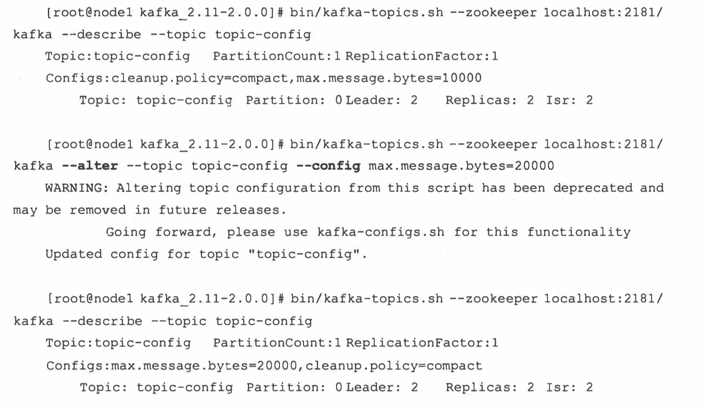

# Kafka学习

## 01_大纲部分

1.[官方网站](https://kafka.apache.org/documentation/)

2.[学习视频](https://www.bilibili.com/video/BV1a4411B7V9?p=1)

3.Kafka深入,看书<<深入理解Kakfa 核心设计与实践原理>> (doing)

4.官方文档

## 02_Kafka入门

Kafka 是一个**分布式**的基于**发布/订阅模式**的**消息队列**（Message Queue）

Kafka是一个分布式流式处理平台，它以**高吞吐、可持久化、可水平扩展、支持流数据处理**等多种特性而被广泛使用。

> Kafka扮演的三大角色

+ **消息系统**：Kafka和传统的消息系统（也称消息中间件）都具备系统解耦、冗余存储、流量削峰、缓冲、异步通信、扩展性、可恢复性等功能。Kafka也提供了大多数消息系统难以实现的消息顺序性保障以及回溯消费的功能。
+ **存储系统**：Kafka把消息持久化到磁盘，有效的降低了数据丢失的风险。得益于Kafka的消息持久化功能和多副本机制，我们可以把Kafka作为长期的数据存储系统使用（把数据保留策略设置为”永久“或者启用主题的日志压缩功能）。
+ **流式处理平台**：Kafka不仅为每个流式处理框架提供了可靠的数据来源，还提供了一个完整的流式处理类库，比如窗口、连接、变换和聚合等各类操作。

### 1.发布/订阅

在软件架构中，**发布-订阅**是一种消息范式，消息的发送者（称为发布者）不会将消息直接发送给特定的接收者（称为订阅者）。而是将发布的消息分为不同的类别，无需了解哪些订阅者（如果有的话）可能存在。同样的，订阅者可以表达对一个或多个类别的兴趣，只接收感兴趣的消息，无需了解哪些发布者（如果有的话）存在。

### 2.消息队列
当不需要立即获得结果，但是并发量又需要进行控制的时候，差不多就是需要使用消息队列的时候。

消息队列主要解决了应用耦合、异步处理、流量削锋等问题。


## 03_Kafka入门_定义


### 使用消息队列的好处
1. **解耦**
   - 允许你独立的扩展或修改两边的处理过程，只要确保它们遵守同样的接口约束。
2. **可恢复性**
   - 系统的一部分组件失效时，不会影响到整个系统。消息队列降低了进程间的耦合度，所以即使一个处理消息的进程挂掉，加入队列中的消息仍然可以在系统恢复后被处理。
3. **缓冲**
   - 有助于控制和优化数据流经过系统的速度， 解决生产消息和消费消息的处理速度不一致的情况。
4. **灵活性 & 峰值处理能力（削峰）**
   - 在访问量剧增的情况下，应用仍然需要继续发挥作用，但是这样的突发流量并不常见。如果为以能处理这类峰值访问为标准来投入资源随时待命无疑是巨大的浪费。使用消息队列能够使关键组件顶住突发的访问压力，而不会因为突发的超负荷的请求而完全崩溃。
5. **异步通信**
   - 很多时候，用户不想也不需要立即处理消息。消息队列提供了异步处理机制，允许用户把一个消息放入队列，但并不立即处理它。想向队列中放入多少消息就放多少，然后在需要的时候再去处理它们。
6. **可扩展性**
   + kafka集群支持热扩展
7. **冗余存储**
   + Kafka可以通过设置`replication`副本数来冗余存储


## 04_消息队列的两种模式

### 1.点对点模式

**一对一，消费者主动拉取数据，消息收到后消息清除**

消息生产者生产消息发送到Queue中，然后消息消费者从Queue中取出并且消费消息。消息被消费以后， queue 中不再有存储，所以消息消费者不可能消费到已经被消费的消息。Queue 支持存在多个消费者，但是对一个消息而言，只会有一个消费者可以消费。


### 2.发布/订阅模式

**一对多，消费者消费数据之后不会清除消息**

消息生产者（发布）将消息发布到 topic 中，同时有多个消息消费者（订阅）消费该消息。和点对点方式不同，发布到 topic 的消息会被所有订阅者消费。

发布订阅模式：

1. 由队列推送数据  

2. 由消费者拉取数据（kafka使用这方式）

kafka使用第二种,可能存在问题，消费者一直询问


## 05_Kafka基础架构


1. **Producer** ： 消息生产者，就是向 Kafka生产数据；
2. **Consumer** ： 消息消费者，向 Kafka broker 取消息的客户端；
3. **Consumer Group （CG）**： 消费者组，由多个 consumer 组成。 消费者组内每个消费者负责消费不同分区的数据，一个分区只能由一个组内消费者消费；消费者组之间互不影响。 所有的消费者都属于某个消费者组，即消费者组是逻辑上的一个订阅者。**消费者存储具体的消费位置**

   + **一个消费者可以消费多个分区的数据，反过来不行**

   + **消费者小于等于分区，消费者和分区的分区相等比较好**
4. **Broker** ：服务代理结点 一台 Kafka 服务器就是一个 broker。一个集群由多个 broker 组成。一个 broker可以容纳多个 topic。
5. **Topic** ： 主题，可以理解为一个队列， 生产者和消费者面向的都是一个 topic；
6. **Partition**： 分区，为了实现扩展性，一个非常大的 topic 可以分布到多个 broker（即服务器）上，一个 topic 可以分为多个 partition，每个 partition 是一个有序的队列；

分区中的所有副本称为**AR（Assigned Rewplicas）**。所有与leader副本保持一定程度同步的副本称为**ISR（In-Sync Replicas）**(包括leader)。消息先发送到leader副本然后发送到follower副本。与leader滞后过多的副本称为**OSR（Out-of-Sync Replicas）**。**AR=ISR+OSR**

leader副本负责维护ISR。当有follower落后时从ISR移除。如果有OSR有follower”“追上”“则加入ISR。

+ HW:high watermark 高水位。标志了一个offset，消费者只能拉取到这个offset以及之前的消息。
+ LEO:Log End Offset：当前日志文件中下一个待写入的offset.LEO相当于当前日志最后一条offset加一


1. **Replica**： 副本（Replication），为保证集群中的某个节点发生故障时， 该节点上的 partition 数据不丢失，且 Kafka仍然能够继续工作， Kafka 提供了副本机制，一个 topic 的每个分区都有若干个副本，一个 leader 和若干个 follower。
2. **Leader**： 每个分区多个副本的“主”，生产者发送数据的对象，以及消费者消费数据的对象都是 leader。
3. **Follower**： 每个分区多个副本中的“从”，实时从 leader 中同步数据，保持和 leader 数据的同步。 leader 发生故障时，某个 Follower 会成为新的 leader。
4. **Zookeeper**：存储Kafka集群信息 ,负责集群元数据管理、控制器的选举等操作

**一些服务端Kafka重要参数**

+ zookeeper.connect:设置要连接的zookeeper集群地址。`zookeeper.connect=localhost1:2181,localhost2:2181`
+ *listeners*:指定broker监听客户端的链接地址列表,`listeners=PLAINTEXT://:9092`.如果有多个地址，使用`,`隔开.支持的协议有PLAINTEXT/SSSL/SASL_SSL等。
+ broker.id:   broker的唯一标志，kafka集群唯一
+ log.dir和log.dirs：配置Kafka日志文件根目录。log.dirs比log.dir优先级高，log.dirs可以设置多个目录，使用`,`分割
+ message.max.bytes: broker可以接受的最大值.


## 06_Kafka安装-启动-关闭

### 1.安装

略

### 2.启动

+ 启动前可以修改`conf`文件夹下的配置
+ 使用`kafka-server-start config/server.properties`启动，注意，这是mac的启动。推荐简单的启动方法，使用homebrew安装，然后使用`brew services start kafka`可以快速启动
+ 如果想要后台运行可以加上`-daemon`

### 3.关闭

直接使用`kafka-server-stop`进行关闭


## 07_Kafka 主题和分区

主题作为消息的归类，可以再细分为一个或多个分区，分区 也可以看作对消息的二次归类。 分区的划分不仅为 Kafka 提供了可伸缩性、水平扩展的功能， 还通过多副本机制来为 Kafka 提供数据冗余以提高数据可靠性 。

从 Kafka 的底层实现来说，主题和分区都是逻辑上的概念，分区可以有一至多个副本，每个副本对应一个日志文件 ，每个日志文件对应一至多个日志分段（ LogSegment ），每个日志分

段还可以细分为索引文件、日志存储文件和快照文件等 。

### 1.主题的管理

#### 1.1 创建主题

主题的管理包括创建主题、 查看主题信息、修改主题和删除主题等操作。可以通过 Kafka 提供的 kafka-topics.sh 脚本来执行这些操作,核心代码只有一行


可以看到其实质上是调用了 kafka.admin.TopicCommand 类来执行主题管理的操作 。

如果 broker 端配置参数 `auto .create.topics .enable` 设置为 true （默认值就是 true) , 那么当生产者向一个尚未创建的主题发送消息时，会自动创建一个分区数为 `num . partitions` （默认值为 1 ）、副本因子为 `default.replication.factor` （默认值为 1 ）的主题，当一个消费者开始从未知主题中读取消息时，或者当任意一个客户端向未知主题发送元 数据请求时，都会按照配置参数 num.partitions 和 default.replication .factor 的 值来创建一个相应的主题。

`kafka-topics --create --zookeeper localhost:2181 --topic topic-demo --partitions 1 --replication-factor 1`

- --topic 定义 topic 名,这里建立了一个名字叫`topic-demo`的topic
- --replication-factor 定义副本数
- --partitions 定义分区数

***默认auto.create.topics.enable='true'***

***auto.create.topics.enable='true'***情况

在执行完脚本之后，

Kafka 会在 `log.dir` 或 `log.dirs` 参数所配置的目录下创建相应的主题分区

主题、分区、副本和 Log （日志）的关系如图 4-1 所示， 主题和分区都是提供给上层用户 的抽象， 而在副本层面或更加确切地说是 Log 层面才有实际物理上的存在。 同一个分区中的多 个副本必须分布在不同的 broker 中，这样才能提供有效的数据冗余。


在 kafka-topics.sh 脚本中 对应的还有 `list` 、` describe` 、 `alter` 和 `delete` 这 4 个同级别的指令类型 ， 每个类型所需 要的参数也不尽相同。

还可以通过 describe 指令类型来查看分区副本的分配细节，

`kafka-topics --topic topic-demo --describe --zookeeper localhost:2181`


示例中的 Topic 和 Partition 分别表示主题名称和分区号 。 Partition 表示主 题中分区的个数 ， ReplicationFactor 表示副本因子 ， 而 Configs 表示创建或修改主题时 指定的参数配置 。 Leader 表示分区的 leader 副本所对应的 brokerld , Isr 表示分区的 ISR 集合， Replicas 表示分区的所有 的副本分配情况 ，即 AR 集合，其中 的数字都表示的是 brokerld.

`kafka-topics.sh`脚 本中还提 供 了 一 个`replica - assignment` 参数来手动 指 定分区副本的分配方案。


这种方式根据分区号的数值大小按照从小到大的顺序进行排 列 ， 分区与分区之间用 逗号 “，” 隔开， 分区内多个副本用冒号“：”隔开。并且在使用 replica-assignment 参数创建主题时 不需要原本必备 的 partitions 和 replication - factor 这两个参数。


注意同一个分区内的副本不能有重复， 比如指定了 0 : 0 , 1 : 1 这种

在创建主题时我们还可以通过 con fig 参数来设置所要创建主题的相关参数 ， 通过这个参 数可以覆盖原本的默认配置。在创建主题时可 以 同时设置多个参数

`--config <String : namel=valuel> --config <String:name2=value2>`


我们再次通过 descr ibe 指令来查看所创建的主题信息：


在 kafka-topics.sh 脚本中还提供了一个 if-not-exists 参数 ， 如果在创建主题时带上了这个参 数，那么在发生命名冲突时将不做任何处理（既不创建主题，也不报错）


kafka-topics.sh 脚本在创建主题时还会检测是否包含“．”或“－”字符。 为什么要检测这两 个字符呢？ 因 为在 Kafka 的 内部做埋点时会根据主题的名称来命名 metrics 的名称， 并且会将点 号“．”改成下画线 “_’。 假设遇到一个名称为“ topic.1_2 ＇’的主题， 还有一个名称为“ topic_1 .2 ” 的主题， 那么最后的 metrics 的名称都会为“ topic_ 1_2 ”，这样就发生了名称冲突。 举例如下， 首先创建一个以“ topic.1_2 ”为名称的主题， 提示 WARNING 警告 ， 之后再创建“topic. 1_2 ” 时发生 InvalidTopicException 异常。

Kafka 从 0.10.x 版本开始支持指定 broker 的机架信息（机架的名称）。如果指定了机架信息，则在分区副本分配时会尽可能地让分区副本分配到不同的机架上。指定机架信息是通过 broker 端参数 broker . rack 来配置的，比如配置当前 broker 所在的机架为“ RACK1”

`broker.rack=RACKl`

如果一个集群中有部分 broker 指定了机架信息，并且其余的 broker 没有指定机架信息，那 么在执行 kafka-topics.sh 脚本创建主题时会报出的 AdminOperationException 的异常

此时若要成功创建主题 ， 要么将集群中的所有 broker 都加上机架信息或都去掉机架信息 ， 要么使用 `disable-rack- aware` 参数来忽略机架信息 


如果集群中 的所有 broker 都有机架信息，那么也可以使用 `disable - rack- aware` 参数来 忽略机架信息对分区副本的分配影响

代码：

```go
func main() {
	config := sarama.NewConfig()

	topicDetial := sarama.TopicDetail{
		NumPartitions:     2,
		ReplicationFactor: 1,
	}

	admin, err := sarama.NewClusterAdmin([]string{"localhost:9092"}, config)
	if err != nil {
		panic(err)
	}
	defer admin.Close()

	err = admin.CreateTopic("topic-demo", &topicDetial, false)
	if err != nil {
		panic(err)
	}
}
```

#### 1.2 分区副本的分配

存疑？


### 2.查看主题

1. 通过了`list`指令可以查看当前所有可用的主题

`kafka-topics --list --zookeeper localhost:2181`

代码实现:

**查看所有Topic**

```go
func main() {
	consumer, err := sarama.NewConsumer([]string{"localhost:9092"}, nil)
	defer consumer.Close()
	if err != nil {
		panic(err)
	}

	topics, err := consumer.Topics()
	if err != nil {
		panic(err)
	}
	for _, topic := range topics {
		fmt.Println("topic:", topic)
	}
}
```

2. --topic还支待指定多个主题，可以和`--describe`结合使用


**查看topic详细信息**

```go
func main() {
	client, err := sarama.NewClient([]string{"localhost:9092"}, nil)
	defer client.Close()
	if err != nil {
		panic(err)
	}
  // admin
	admin, err := sarama.NewClusterAdminFromClient(client)
	defer admin.Close()
	if err != nil {
		panic(err)
	}
  // get topics
	topics, err := client.Topics()
	if err != nil {
		panic(err)
	}
  // get describe of topic
	topicsMetadata, err := admin.DescribeTopics(topics)
	if err != nil {
		panic(err)
	}
	for _, metadata := range topicsMetadata {
		fmt.Printf("topic name: %v\n", metadata.Name)
		for _, partition := range metadata.Partitions {
			fmt.Printf("partition: %v, ISR: %v, Replicas: %v, Leader: %v\n", partition.ID, partition.Isr, partition.Replicas, partition.Leader)
		}
	}
}
```

在使用 describe 指令查看主题信息时还可以额外指定 `topics-with-overrides`、 `under-repplicated-partitions`和`unavailable-partitions`这三个参数来增加 一 些 附加功能。

增加`topics-with-overrides`参数可以找出所有包含覆盖配置的主题， 它只会列出包含了与集群不一样配置的主题。


`under-replicated-partitions`和`unavailable-partitions`参数都可以找出有 问题的分区。 通过`under-replicated-partitions` 参数可以找出所有包含失效副本的分 区。 包含失效副本的分区可能正在进行同步操作， 也有可能同步发生异常， 此时分区的JSR集 合小于AR集合。


通过`unavailable-partitions`参数可以查看主题中没有leader副本的分区


### 3.修改主题

个修改的功能就是由`kafka-topics.sh`脚本中的`alter`指令提供的

我们首先来看如何增加主题的分区数。 以前面的主题`topic-config`为例， 当前分区数为1, 修改为3


kafka不支持减少分区：

```
按照Kafka现有的代码逻辑， 此功能完全可以实现，不过也会使代码的复杂度急剧增大。 实现此功能需要考虑的因素很多， 比如删除的分区中的消息该如何处理？如果随着分区一起消 失则消息的可靠性得不到保障；如果需要保留则又需要考虑如何保留。 直接存储到现有分区的 尾部， 消息的时间戳就不会递增， 如此对于Spark、Flink这类需要消息时间戳（事件时间）的 组件将会受到影响；如果分散插入现有的分区， 那么在消息量很大的时候， 内部的数据复制会 占用很大的资源， 而且在复制期间， 此主题的可用性 又如何得到保障？与此同时， 顺序性问题、 事务性问题， 以及分区和副本的状态机切换问题都是不得不面对的。 反观这个功能的收益点却 是很低的， 如果真的需要实现此类功能， 则完全可以重新创建一个分区数较小的主题， 然后将 现有主题中的消息按照既定的逻辑复制过去即可。
```

在创建主题时有 一 个·`if-not-exists`·参数来忽略异常 ， 在 这里也有对应的参数 ， 如 果所要修改的主题不存在 ， 可以通过`if-exists`参数来忽略异常


除了修改分区数 ， 我们还可以使用kafka-topics.sh脚本的`alter`指令来变更主题的配置。 在创建主题的时候我们可以通过config参数来设置所要创建主题的相关参数 ， 通过这个参数 可以覆盖原本的默认配置



我们可以通过`delete-config`参数来删除之前覆盖的配置


### 4.配置管理

kaflca-configs.sh 脚本是专门用来对配置进行操作的， 这里的操作是指在运行状态下修改原 有的配置，如此可以达到动态变更的目的。kaflca-configs.sh脚本包含变更配置alter和查看配 一 置describe这两种指令类型。 同使用kaflca-topics.sh脚本变更配置的原则 样， 增、 删、 改 的行为都可以看作变更操作， 不过kaflca-configs.sh脚本不仅可以支持操作主题相关的配置， 还 可以支待操作broker、 用户和客户端这3个类型的配置。

kafka-configs.sh脚本使用entity-type参数来指定操作配置的类型，并且使用entity-name 参数来指定操作配置的名称。 比如查看主题 topic-config的配置可以按如下方式执行：


--describe指定了查看配置的指令动作，--entity-type指定了查看配置的实体类型， 一entity - name指定了查看配置的实体名称。 entity-type只可以配置4个值： topics、 brokers 、clients和users


使用alter指令变更配置时，需要配合add-config和delete-config这两个参数 起使用。 add-config参数用来实现配置的增、 改， 即覆盖原有的配置； delete-config参 数用来实现配置的删， 即删除被覆盖的配置以恢复默认值。


使用delete-con丘g参数删除配置时， 同add-config参数 一 样支持多个配置的操作，多个配置之间用逗号


**改变配置**

改变主题端参数配置

```go
func main() {
	client, err := sarama.NewClient([]string{"localhost:9092"}, nil)
	defer client.Close()
	if err != nil {
		panic(err)
	}
	admin, err := sarama.NewClusterAdminFromClient(client)
	defer admin.Close()
	if err != nil {
		panic(err)
	}

	entries := make(map[string]*string)
	value := "60000"
	entries["retention.ms"] = &value
	err = admin.AlterConfig(sarama.TopicResource, "topic-A", entries, false)
	if err != nil {
		panic(err)
	}
	fmt.Println("更改成功")
}

```

### 5.删除Topic

`kafka-topics --delete --zookeeper localhost:2181 --topic topic-demo`

**删除代码**

```go
func main() {
	client, err := sarama.NewClient([]string{"localhost:9092"}, nil)
	defer client.Close()
	if err != nil {
		panic(err)
	}
	admin, err := sarama.NewClusterAdminFromClient(client)
	err = admin.DeleteTopic("topic-A")
	defer admin.Close()
	if err != nil {
		panic(err)
	}
	fmt.Println("删除成功")
}
```

### 6.主题端参数

| 主题端参数                               | 释义                                                         | 对应的broker端参数                       |
| ---------------------------------------- | ------------------------------------------------------------ | ---------------------------------------- |
| cleanup.policy                           | 日志压缩策略。 默认值为 delete, 还可以配 置为compactcompression.type消息的压缩类型。 默认值为producer, 表示 保留生产者中所使用的原始压缩类型。还可 以配置为uncompressed 、 snappy 、 lz4 、 gzip | log.cleanup.policy                       |
| compression.type                         | 消息的压缩类型。 默认值为producer, 表示 保留生产者中所使用的原始压缩类型。还可 以配置为uncompressed 、 snappy 、 lz4 、 gzip | compression.type                         |
| delete.retention.ms                      | 被标识为删除的数据能够保留多久。默认值 为86400000, 即 1 天   | log.cleaner.delete.retention. ms         |
| file.delete.delay.ms                     | 清理文件之前可以等待多长时间，默认值为 60000, 即 l 分钟      | log.segment.delete.delay.ms              |
| flush.messages                           | 需要收集多少消息才会将它们强制刷新到 磁盘， 默认值为Long.MAX_VALUE, 即让 操作系统来决定。建议不要修改此参数的默 认值 | log.flush.interval.messages              |
| flush.ms                                 | 需要等待多久才会将消息强制刷新到磁盘， 默认值为Long.M心又VALUE, 即让操作系 统来决定。 建议不要修改此参数的默认值 | log.flush.interval.ms                    |
| follower.replication.throttled. replicas | 用来配 置 被 限 制 速 率 的 主题所 对 应 的 follower副本列表 | follower.replication.throttled. replicas |
| index.interval.bytes                     | 用来控制添加索引项的频率。每超过这个参 一 数所设置的消息 字节数时就可以添加 个 新的索引项， 默认值为4096 | log.index.interval.bytes                 |
| leader.replication.throttled. replicas   | 用来配置被限制速率的主题所对应的leader 副本列表              | leader.replication.throttled. replicas   |
| max.message.bytes                        | 消息的最大字节数， 默认值为1000012                           | message. max. bytes                      |
| message.format.version                   | 消息格式的版本， 默认值为2.0-IVI                             | log.message.format.version               |
| message.timestamp.difference. max.ms     | 消息中自带的时间戳与broker收到消息时 的 时 间戳之间最 大的差值， 默 认 值 为 Long.MAX_VALUE。此参数只有在meesage. timestamp.type参数设置为CreateTime 时才 有效 | log.message.timestamp. difference.max.ms |
| message.timestamp.type                   | 消息的时间戳类型。 默认值为CreateTime , 还可以设置为ogAppendTime | Llog.message.timestamp. type             |
| min.cleanable.dirty.ratio                | 日志清理时的最小污浊率， 默认值为0.5                         | log.cleaner.mm.cleanable. ratio          |
| min.compaction.lag.ms                    | 日志再被清理前的最小保留时间， 默认值为0log.cleaner.min.compaction. lag.ms分区ISR集合中至少要有多少个副本，默认 值为1 | min.insync.replicas                      |
| min.insync.replicas                      |                                                              |                                          |
| preallocate                              | 在创建日志分段的时候是否要预分配空间， 默认值为false         | log.preallocate                          |
| retention.bytes                          | 分区中所能保留的消息总量， 默认值为-1 , 即没有限制           | log.retention.bytes                      |
| retention.ms                             | 使用delete的日志清理策略时消息能够保留 多长时间， 默认值为604800000, 即 7天。 如果设置为-1, 则表示没有限制 | log.retention.ms                         |
| segment.bytes                            | 日志分段的最大值， 默认值为1073741824, 即 1GBsegment.mdex.bytes日志分段索引的最大值， 默认值为10485760, 即 10MB | log.segment.bytes                        |
| log.index.size.max.bytes                 | 日志分段索引的最大值， 默认值为10485760, 即 10MB             | log.index.size.max.bytes                 |
| segment.jitter.ms                        | 滚动日志分段时，在segment.ms的基础之上 增加的随机数， 默认为0 | log.roll.Jitter.ms                       |
| segment.ms                               | 最长多久滚动一 次日志分段， 默认值为 604800000, 即 7天       | log.roll.ms                              |
| unclean.leader.election.enable           | 是否可以从非ISR集合中选举leader副本， 默认值为false, 如果设置为true, 则可能造 成数据丢失 | unclean.leader.election. enable          |

### 7.kafka-topic脚本的参数

| 参 数名称                     | 释义                                                         |
| ----------------------------- | ------------------------------------------------------------ |
| alter                         | 用于修改主题， 包括分区数及主题的配置                        |
| config <键值对＞              | 创建或修改主题时， 用于设置主题级别的参数                    |
| create                        | 创建主题                                                     |
| delete                        | 删除主题                                                     |
| delete-config <配置名称＞     | 删除主题级别被覆盖的配置                                     |
| describe                      | 查看主题的详细信息                                           |
| disable-rack-aware            | 创建主题时不考虑机架信息                                     |
| help                          | 打印帮助信息修改或删除主题时使用，只有当主题存在时才会执行动作 |
| if-exists                     | 修改或删除主题时使用，只有当主题存在时才会执行动作           |
| if-not-exists                 | 创建主题时使用，只有主题不存在时才会执行动作                 |
| list                          | 列出所有可用的主题                                           |
| partitions <分区数＞          | 创建主题或增加分区时指定分区数                               |
| replica-assignment<分配方案＞ | 手工指定分区副本分配方案                                     |
| replication-factor<副本数＞   | 创建主题时指定副本因子                                       |

## 08_生产者消费者发送消息

### 1.消费者消费消息

`kafka-console-consumer --bootstrap-server localhost:9092 --topic topic-demo`

+ --bootstrap-server:指定了连接的kafka集群

#### 1.1 消费者组

消费者(Consumer)负责订阅Kaflca 中的主题(Topic), 并且从订阅的主题上拉取消息。 一 与其他 一 些消息中间件不同的是： 在Kaflca 的消费理念中还有 层消费组(Consumer Group) 一 的概念， 每个消费者都有 个对应的消费组。


如图3-1所示， 某个主题中共有4个分区(Partition): P0 、 P1、 P2 、 P3。 有两个消费组A 和B都订阅了这个主题， 消费组A中有4个消费者(C0、 C1、 C2 和C3), 消费组B中有2 个消费者(C4和CS)。 按照Kafka默认的规则， 最后的分配结果是消费组A中的每 一 个消费 者分配到1个分区， 消费组B中的每 一 个消费者分配到 2 个分区， 两个消费组之间互不影响。 每个消费者只能消费所分配到的分区中的消息。 换言之， 每 一 个分区只能被 一 个消费组中的一  个消费者所消费。

消费者与消费组这种模型可以让整体的消费能力具备横向伸缩性，我们可以增加（或减少） 消费者的个数来提高（或降低）整体的消费能力。对分区数固定的清况， 一 味地增加消费者 并不会让消费能力 一 直得到提升，如果消费者过多，出现了消费者的个数大于分区个数的清况， 就会有消费者分配不到任何分区。

以上分配逻辑都是基于默认的分区分配策略进行分析的， 可以通过消费者客户端参数 `partition.assignment.strategy`来设置消费者与订阅主题之间的分区分配策略.

消费组是 一 个逻辑上的概念， 它将旗下的消费者归为 一 类，每 一 个消费者只隶属于 一 个消 费组。每 一 个消费组都会有 一 个固定的名称，消费者在进行消费前需要指定其所属消费组的名 称，这个可以通过消费者客户端参数`group.id`来配置， 默认值为空字符串。 消费者并非逻辑上的概念，它是实际的应用实例，它可以是 一 个线程，也可以是 一 个进程。 同 一 个消费组内的消费者既可以部署在同 一 台机器上， 也可以部署在不同的机器上。

#### 1.2 客户端开发

```go
func main() {
	groupId := "group-demo"
	topics := "topic-demo"

	config := sarama.NewConfig()

	/**
	 * Setup a new Sarama consumer group
	 */
	consumer := Consumer{
		ready: make(chan bool),
	}

	ctx, cancel := context.WithCancel(context.Background())
	client, err := sarama.NewConsumerGroup([]string{"localhost:9092"}, groupId, config)
	if err != nil {
		log.Panicf("Error creating consumer group client: %v", err)
	}

	wg := &sync.WaitGroup{}
	wg.Add(1)
	go func() {
		defer wg.Done()
		for {
			// `Consume` should be called inside an infinite loop, when a
			// server-side rebalance happens, the consumer session will need to be
			// recreated to get the new claims
			if err := client.Consume(ctx, strings.Split(topics, ","), &consumer); err != nil {
				log.Panicf("Error from consumer: %v", err)
			}
			// check if context was cancelled, signaling that the consumer should stop
			if ctx.Err() != nil {
				return
			}
			consumer.ready = make(chan bool)
		}
	}()

	<-consumer.ready // Await till the consumer has been set up
	log.Println("Sarama consumer up and running!...")

	sigterm := make(chan os.Signal, 1)
	signal.Notify(sigterm, syscall.SIGINT, syscall.SIGTERM)
	select {
	case <-ctx.Done():
		log.Println("terminating: context cancelled")
	case <-sigterm:
		log.Println("terminating: via signal")
	}
	cancel()
	wg.Wait()
	if err = client.Close(); err != nil {
		log.Panicf("Error closing client: %v", err)
	}
}

// Consumer represents a Sarama consumer group consumer
type Consumer struct {
	ready chan bool
}

// Setup is run at the beginning of a new session, before ConsumeClaim
func (consumer *Consumer) Setup(sarama.ConsumerGroupSession) error {
	// Mark the consumer as ready
	close(consumer.ready)
	return nil
}

// Cleanup is run at the end of a session, once all ConsumeClaim goroutines have exited
func (consumer *Consumer) Cleanup(sarama.ConsumerGroupSession) error {
	return nil
}

// ConsumeClaim must start a consumer loop of ConsumerGroupClaim's Messages().
func (consumer *Consumer) ConsumeClaim(session sarama.ConsumerGroupSession, claim sarama.ConsumerGroupClaim) error {
	// NOTE:
	// Do not move the code below to a goroutine.
	// The `ConsumeClaim` itself is called within a goroutine, see:
	// https://github.com/Shopify/sarama/blob/master/consumer_group.go#L27-L29
	for message := range claim.Messages() {
		log.Printf("Message claimed: value = %s, timestamp = %v, topic = %s", string(message.Value), message.Timestamp, message.Topic)
		session.MarkMessage(message, "")
	}

	return nil
}

```

#### 1.3 必要的参数配置

+ bootstrap . servers:该参数的释义和生产者客户端KafkaProducer 中的相同，用 来指定 连 接 Kafka 集 群所需的 broker 地 址清 单，具体内容形式为 `host:port,host2:post`, 可以设置 一个或多个地址， 中间用逗号隔开
+ group.id:消费者隶属的消费组的名称

#### 1.4 消费消息

Kafka中的消费是基于 拉模式的。消息的消费 一 般有两种模式：推模式和 拉模式。推模式 是服务端主动将消息推送给消费者， 而 拉模式是消费者主动向服务端发起请求来拉取消息。

配置的时候有一个参数`config.Consumer.MaxWaitTime`:用来配置没有消息的时候最大等待时间，默认是250ms

消费者消费到 的每条消息的类型为`ConsumerRecord` (注意与ConsumerRecords 的区别）， 这个和生产者发送的消息类型ProducerRecord相对应，不过ConsumerRecord中的内容更加丰富

#### 1.5 位移提交

对于 Kafka 中的分区而言，它的每条消息都有唯一 的 offset，用来表示消息在分区中对应 的 位置 。 对于消费者而言 ， 它也有一个 offset 的概念，消费者使用 offset 来表示消费到分区中某个 消息所在的位置。

在旧消费者客户端中，消费位移是存储在 ZooKeeper 中的 。 而在新消费者客户端中，消费 位移存储在 Kafka 内 部的主题 `__consumer_offsets` 中 。 这里把将消费位移存储起来（持久化）的 动作称为“提交’3 ，消费者在消费完消息之后需要执行消费位移的提交。

参考图 3-6 的消费位移 ， x 表示某一次拉取操作 中此分 区消息 的最大偏移量 ，假设当前消费 者已经消费了 x 位 置 的消息，那么我们就可以说消费者的消 费位移 为 X ，图中也用了 lastConsumedOffset 这个单词来标识它 。


不过需要非常明确的是 ， 当前消费者需要提交的消 费位移并不是 x，而是 x+ 1,在消费者中还有一个 `committed offset` 的概念，它表示已经提交过的消费位移。

在 Kafka 中默认的消费位移的提交方式是自动提交，这个由消费者客户端参数 `enable . auto . commit` 配置，默认值为 true。当然这个默认的自动提交不是每消费一条消息 就提交一次，而是定期提交，这个定期的周期时间由客户端参数 `auto . commit . interval . ms` 配置，默认值为 5 秒，此参数生效的前提是 enable . auto.commit 参数为 true 。

+ 消息丢失:对于位移提交的具体时机的把握也很有讲究，有可能会造成重复消费和消息丢失的现象 。 参考图 3-7 ，当前一次 自动提交操作所拉取的消息集为［x+2, x+7], x+2 代表上一次提交的消费位移， 说明己经完成了 x+1之前（包括 x+1 在内）的所有消息的消费， x+5 表示当前正在处理的位置。 如果拉取到消息之后就进行了位移提交，即提交了 x+8，那么 当 前消费 x+5 的时候遇到了异常， 在故障恢复之后，我们重新拉取的消息是从 x+8 开始的。也就是说， x+5 至 x+7 之间的消息并 未能被消费，如此便发生了消息丢失的现象。
+ 重复消费：位移提交的动作是在消费完所有拉取到的消息之后才执行的，那么当消费 x+5 的时候遇到了异常，在故障恢复之后，我们重新拉取的消息是从 x+2 开始的。也就 是说， x+2 至 x+4 之间的消息又重新消费了 一遍，故而又发生了重复消费的现象 。

#### 1.6 指定位移消费

```go
// 指定最晚
config.Consumer.Offsets.Initial = sarama.OffsetOldest
// 指定最早
config.Consumer.Offsets.Initial = sarama.OffsetNewest
```

#### 1.7 消费者分区再均衡

再均衡是指分区的所属权从一 个消费者转移到另 一 消费者的行为， 它为消费组具备高可用 性和伸缩性提供保障， 使我们可以既方便又安全地删除消费组内的消费者或往消费组内添加消 费者。 不过在再均衡发生期间， 消费组内的消费者是无法读取消息的。 也就是说， 在再均衡发 生期间的这 一 小段时间内， 消费组会变得不可用。 另外， 当一 个分区被重新分配给另 一 个消费 者时， 消费者当前的状态也会丢失。 比如消费者消费完某个分区中的 一 部分消息时还没有来得 及提交消费位移就发生了再均衡操作， 之后这个分区又被分配给了消费组内的另 一 个消费者， 原来被消费完的那部分消息又被重新消费 一 遍， 也就是发生了重复消费。 一 般情况下， 应尽量 避免不必要的再均衡的发生。

再均衡监听器用来设定发生再 均衡动作前后的 一些准备或收尾的动作。

```go
config.Consumer.Group.Rebalance.Strategy
// 需要实现接口
// BalanceStrategy is used to balance topics and partitions
// across members of a consumer group
type BalanceStrategy interface {
	// Name uniquely identifies the strategy.
	Name() string

	// Plan accepts a map of `memberID -> metadata` and a map of `topic -> partitions`
	// and returns a distribution plan.
	Plan(members map[string]ConsumerGroupMemberMetadata, topics map[string][]int32) (BalanceStrategyPlan, error)

	// AssignmentData returns the serialized assignment data for the specified
	// memberID
	AssignmentData(memberID string, topics map[string][]int32, generationID int32) ([]byte, error)
}
```

#### 1.8 消费者拦截器

实现接口

```go
type ConsumerInterceptor interface {

	// OnConsume is called when the consumed message is intercepted. Please
	// avoid modifying the message until it's safe to do so, as this is _not_ a
	// copy of the message.
	OnConsume(*ConsumerMessage)
}
```

#### 1.9 重要的消费者参数

1. fetch .min.bytes:该参数用来配置 Consumer 在一次拉取请求（调用 poll（）方法）中能从 Kafka 中拉取的最小 数据量，默认值为 1 ( B ）Kafka 在收到 Consumer 的拉取请求时，如果返回给 Consumer 的数 据量小于这个参数所配置的值，那么它就需要进行等待，直到数据量满足这个参数的配置大小。
2. fetch .max.bytes:该参数与 fetch . max . bytes 参数对应，它用来配置 Consumer 在一次拉取请求中从 Kafka 中拉取的最大数据量，默认值为0，也就是 不限制。
3. fetch.max.wait.ms

这个参数也和 fetch.min . bytes 参数有关，如果 Kafka 仅仅参考 fetch.min.byt e s 参数的要求，那么有可能会一直阻塞等待而无法发送响应给 Consumer， 显然这是不合理的 。 fetch.max.wait.ms 参数用于指定 Kafka 的等待时间

4. receive.buffer.bytes:个参数用来设置 Socket 接收消息缓冲区（ SO_RECBUF)的大小
5. request.timeout.ms:这个参数用来配置 Consumer 等待请求响应的最长时间
6. metadata.max.age.ms:这个参数用来配置元数据的过期时间
7. reconnect.backoff.ms:这个参数用来配置尝试重新连接指定主机之前的等待时间
8. retry.backoff.ms:这个参数用来配置尝试重新发送失败的请求到指定的主题分区 等待时间
9. isolation.level:这个参数用来配置消费者的事务隔离级别。 字符串类型， 有效值为“ read uncommitted" ，和 “ read committed ＂，表示消费者所消费到的位置， 如果设置为“ read committed ”，那么消费 者就会忽略事务未提交的消息， 即只能消费到 LSO ( LastStableOffset ）的位置， 默认情况下为“ read_ uncommitted ”，即可以消 费到 HW (High Watermark ）处的位置
10. 其他参数

| 参数名称                     | 默认值 | 参数释义                                                     |
| ---------------------------- | ------ | ------------------------------------------------------------ |
| bootstrap.servers            |        | 指定连接 Kafka 集群所需的 broker 地址清单                    |
| key.deserializer             |        | 消息中 key 所对应的反序列化类                                |
| value.deserializer           |        | 消息中 key 所对应的反序列化类                                |
| group.id                     |        | 此消费者所隶属的消费组的唯一标识                             |
| client.id                    |        | 消费者客户端的 id                                            |
| heartbeat.interval.ms        | 3000   | 当使用 Kafka 的分组管理功能时， 心跳到消费者 协调器之间的预计时间。心跳用于确保消费者的 会话保持活动状态 ， 当有新消费者加入或离开组 时方便重新平衡 。 |
| session. timeout.ms          | 10000  | 组管理协议中用来检测消费者是否失效的超时时间                 |
| auto.offset.reset            | latest | 参数值为字符串类型，有效值为“ earliest”＂ latest” “ none ”，配置为其余值会报 出 异常 |
| enable.auto.commit           | false  | boolean 类型 ， 配置是否开启自动提交消费位移的 功能          |
| auto.commit.interval.ms      | 5000   | 当 enbale剧to.commit 参数设置为 true 时才生效 ， 表示开启自动提交消费位移功能 时自 动提交消 费位移的时间间 隔 |
| partiton.assignment.strategy |        | 消费者的分区分配策略                                         |


### 2.生产者发送消息

`kafka-console-producer --broker-list localhost:9092 --topic topic-demo`

+ --broker-list:指定连接的Kafka集群地址

```go
import (
	"fmt"
	"github.com/Shopify/sarama"
)

func main() {
	config := sarama.NewConfig()
	// 等待服务器所有副本都保存成功后的响应
	config.Producer.RequiredAcks = sarama.WaitForAll
	// 随机的分区类型：返回一个分区器，该分区器每次选择一个随机分区
	config.Producer.Partitioner = sarama.NewRandomPartitioner
	// 是否等待成功和失败后的响应
	config.Producer.Return.Successes = true
	// 使用给定代理地址和配置创建一个同步生产者
	producer, err := sarama.NewSyncProducer([]string{"localhost:9092"}, config)
	if err != nil {
		panic(err)
	}
	defer producer.Close()

	msg := &sarama.ProducerMessage{
		Topic: "topic-demo",
		Value: sarama.StringEncoder("Hello, Kafka!"),
	}

	partition, offset, err := producer.SendMessage(msg)
	fmt.Printf("Partition = %d, offset=%d\n", partition, offset)
}
```

**ProducerMessage结构体**

```go
sarama.ProducerMessage{
		Topic:     "",	//主题
		Key:       nil,	//键
		Value:     nil,	//值
		Headers:   nil,	//消息头部
		Metadata:  nil,	//元数据
		Offset:    0,		//偏移量
		Partition: 0,		//指定分区
		Timestamp: time.Time{},	//时间戳
	}
```

+ headers:消息的头部，设定一些与应用相关的信息
+ key：可以用来计算分区号让消息发往指定的分区
+ timestamp是消息的时间戳，有`CreateTime`和`LogAppendTime`两种类型

#### 2.1 自定义发送消息的编码

在sarama中有一个接口类型，只要实现这个接口就可以自定义编码

```go
// Encoder is a simple interface for any type that can be encoded as an array of bytes
// in order to be sent as the key or value of a Kafka message. Length() is provided as an
// optimization, and must return the same as len() on the result of Encode().
type Encoder interface {
   Encode() ([]byte, error)
   Length() int
}
// 在发送消息的时候使用  Value: sarama.StringEncoder("Hello, Kafka!"),
```

#### 2.2分区器

如果消息中指定了`Partition`字段，就不需要分区器。否则就需要依赖分区器根据`Key`的值来计算分区。

```go
type Partitioner interface {
	// Partition takes a message and partition count and chooses a partition
	Partition(message *ProducerMessage, numPartitions int32) (int32, error)

	// RequiresConsistency indicates to the user of the partitioner whether the
	// mapping of key->partition is consistent or not. Specifically, if a
	// partitioner requires consistency then it must be allowed to choose from all
	// partitions (even ones known to be unavailable), and its choice must be
	// respected by the caller. The obvious example is the HashPartitioner.
	RequiresConsistency() bool
}

// 在配置config的时候使用  config.Producer.Partitioner=sarama.NewRoundRobinPartitioner
```

#### 2.3 生产者拦截器

生产者拦截器可以在发送之前做一些准备工作，比如过滤不符合要求的消息，修改消息内容，也可以做一些定制化的需求，比如统计的工作.

```go
// ProducerInterceptor allows you to intercept (and possibly mutate) the records
// received by the producer before they are published to the Kafka cluster.
// https://cwiki.apache.org/confluence/display/KAFKA/KIP-42%3A+Add+Producer+and+Consumer+Interceptors#KIP42:AddProducerandConsumerInterceptors-Motivation
type ProducerInterceptor interface {

	// OnSend is called when the producer message is intercepted. Please avoid
	// modifying the message until it's safe to do so, as this is _not_ a copy
	// of the message.
	OnSend(*ProducerMessage)
}

// 设置一个生产者拦截器。
	interceptor := NewOTelInterceptor()
// 可以发现，生产者拦截器可以设置多个
	config.Producer.Interceptors = []sarama.ProducerInterceptor{interceptor}

// 生产者拦截器OTelInterceptor,实现了ProducerInterceptor接口
type OTelInterceptor struct {
	num int //统计发送了多少个
}

func NewOTelInterceptor() *OTelInterceptor {
	oi := OTelInterceptor{}
	return &oi
}

func (oi *OTelInterceptor) OnSend(msg *sarama.ProducerMessage) {
	oi.num++
}

func (oi *OTelInterceptor) GetNum() int {
	return oi.num
}
```

#### 2.4 原理分析

生产者客户端的架构


整个生产者客户端由两个线程协调运行，这两个线程分别为`主线程`和 `Sender 线程` （发送线程）。 在主线程中由 KafkaProducer 创建消息， 然后通过可能的拦截器、序列化器和分区器的作 用之后缓存到`消息累加器`（ RecordAccumulator， 也称为消息收集器〉中。 Sender 线程负责从 RecordAccumulator 中 获取消息并将其发送到 Kafka 中 。

`RecordAccumulator `主要用来缓存消息 以便 Sender 线程可以批量发送， 进而减少网络传输 的资源消耗以提升性能 。 RecordAccumulator 缓存的大 小可以通过生产者客户端参数 `buffer . memory` 配置， 默认值为 33554432B ，即 32MB 。 如果生产者发送消息的速度超过发 送到服务器的速度 ，则会导致生产者空间不足， 这个时候 KafkaProducer 的 send（）方法调用要么 被阻塞， 要么抛出异常， 这个取决于参数 `max . block . ms` 的配置， 此参数的默认值为 60000, 即 60 秒 。

主线程中发送过来的消息都会被迫加到 RecordAccumulator 的某个双端队列（ Deque ）中， 在 RecordAccumulator 的内部为每个分区都维护了 一 个双端队列， 队列中的内容就是 `Producer Batch`， 即 `Deque<ProducerBatch＞`。 消息写入缓存时， 追加到双端队列的尾部： Sender读取消息时 ，从双端队列的头部读取。注意 ProducerBatch 不是 ProducerRecord, ProducerBatch 中可以包含一至多个 ProducerRecord。 通俗地说，` ProducerRecord `是生产者中创建的消息，而 `ProducerBatch` 是指一个消息批次 ， ProducerRecord 会被包含在 ProducerBatch 中，这样可以使宇 节的使用更加紧凑。与此同时，将较小的 ProducerRecord 拼凑成一个较大的 ProducerBatch，也 可以减少网络请求的次数以提升整体的吞吐量 。 ProducerBatch 和消息的具体格式有关.如果生产者客户端需要向很多分区发送消息， 则可以 将 buffer . memory 参数适当调大以增加整体的吞吐量 。

消息在网络上都是以字节 Byte 的形式传输的，在发送之前需要创建一块内存区域来保 存对应的消息 。 不过频繁的创建和释放是比较耗费资源的，在 RecordAccumulator 的内部还有一个 BufferPool, 它主要用来实现 ByteBuffer 的复用，以实现缓存的高效利用 。不过 BufferPool 只针对特定大小 的 ByteBuffer 进行管理，而其他大小的 ByteBuffer 不会缓存进 BufferPool 中，这个特定的大小 由 `batch.size` 参数来指定，默认值为 16384B ，即 16KB 。 我们可以适当地调大 `batch.size`参数 以便多缓存一些消息。

ProducerBatch 的大小和 batch . size 参数也有着密切的关系。当一条消息（ProducerRecord) 流入 RecordAccumulator 时，会先寻找与消息分区所对应的双端队列（如果没有则新建），再从 这个双端队列的尾部获取一个 ProducerBatch （如果没有则新建），查看 ProducerBatch 中是否 还可以写入这个 ProducerRecord ，如 果可以 则 写入，如果不可 以则 需要 创 建一个新 的 ProducerBatch。在新建 ProducerBatch 时评估这条消息的大小是否超过 batch . size 参数 的大 小，如果不超过，那么就以 batch . size 参数的大小来创建 ProducerBatch，这样在使用完这 段内存区域之后，可以通过 BufferPool 的管理来进行复用；如果超过，那么就以评估的大小来 创建 ProducerBatch， 这段内存区域不会被复用。

Sender 从 RecordAccumulator 中 获取缓存的消息之后，会进一 步将原本＜分区， Deque< ProducerBatch＞＞的保存形式转变成＜Node, List< ProducerBatch＞的形式，其中 Node 表示 Kafka 集群的 broker 节点 。对于网络连接来说，生产者客户端是与具体 的 broker 节点建立的连接，也 就是 向具体的 broker 节点发送消息，而并不关心消息属于哪一个分区；

在转换成＜Node, List<ProducerBatch＞＞的形式之后， Sender 还 会进一步封装成＜Node, Request>的形式，这样就可以将 Request 请求发往各个 Nod巳了， 这里的 Request 是指 Kafka 的 各种协议请求

请求在从 Sender 线程发往 Kafka 之前还会保存到 InFlightRequests 中，InFlightRequests 保存对象的具体形式为 Map<Nodeld, Deque<R巳quest>＞，它的主要作用是缓存 了已经发出去但还

没有收到响应的请求（ Nodeld 是一个 String 类型，表示节点的 id 编号）。与此同时， InFlightRequests 还提供了许多管理类 的方法，并且通过配置参数还可 以限制每个连接（也就是 客户端与 Node 之间的连接）最多缓存的请求数。这个配置参数为` max.  in . flight.requests . per. connection `，默认值为 5 ，即每个连接最多只能缓存 5 个未响应的请求，超过该数值 之后就不能再向这个连接发送更多的请求了，除非有缓存的请求收到了响应（ Response ）。通 过比较 Deque<Request>的 size 与这个参数的大小来判断对应的 Node 中是否己经堆积了很多未 响应的消息，如果真是如此，那么说明这个 Node 节点负载较大或网络连接有问题，再继续 向 其发送请求会增大请求超时的可能。

#### 2.5 元数据的更新

InFlightRequests 还可以获得 leastLoadedNode ，即所有 Node 中负载最小的 那一个 。这里的负载最小是通过每个 Node 在 InFlightRequests 中还未确认的请求决定的，未确认的请求越多则认为负载越大。 对于图 2-2 中的 InFlightRequests 来说，图中展示了 三个节点Node0、Node1 和 Node2 ，很明显 Nodel 的负载最小 。 也就是说， Node1 为当前的 leastLoadedNode。 选择 leastLoadedNode 发送请求可以使它能够尽快发出(发送元数据更新相关的请求)，避免因网络拥塞等异常而影响整体的进 度。 leastLoadedNode 的概念可以用于多个应用场合，比如元数据请求、消费者组播协议的交互。


我们前面发送的消息

```go
msg := &sarama.ProducerMessage{
		Topic: "topic-demo",
		Value: sarama.StringEncoder("Hello, Kafka!"),
	}
```

我们只知道主题的名称，对于其他一些必要的信息却一无所知 。 KafkaProducer 要将此消息 追加到指定主题的某个分区所对应的 leader 副本之前，首先需要知道主题的分区数量，然后经 过计算得出（或者直接指定〉目标分区，之后 KafkaProducer 需要知道目标分区的 leader 副本所 在的 broker 节点的地址、端口等信息才能建立连接，最终才能将消息发送到 Kafka，在这一过程中 所需要 的信息都属于元数据信息。

元数据是指 Kafka 集群的元数据，这些元数据具体记录了集群中有哪些主题，这些主题有 哪些分区，每个分区的 lead巳r 副本分配在哪个节点上， follower 副本分配在哪些节点上，哪些副 本在 AR、 ISR 等集合中，集群中有哪些节点，控制器节点又是哪一个等信息。

当客户端中没有需要使用的元数据信息时，比如没有指定的主题信息，或者超 过`metadata . max.age.ms`

时间没有更新元数据都会引起元数据的更新操作 。客户端参数`metadata . max.age.ms` 的默认值为 300000 ，即 5 分钟。元数据的更新操作是在客户端 内部进行的，对客户端的外部使用者不可见 。当需要更新元数据时，会先挑选出 leastLoadedNode, 然后 向这个 Node 发送 MetadataRequest 请求来获取具体的元数据信息。这个更新操作是由 Sender 线程发起 的， 在创建完 MetadataRequest 之后 同样会存入 InFlightRequests ，之后的步骤就和发送 消息时的类似 。 元数据虽然由 Sender 线程负责更新，但是主线程也需要读取这些信息，这里的 数据同步通过 synchronized 和 final 关键字来保障。


#### 2.6 生产者的一些重要参数

1. acks

这个参数用来指定分区中必须要有多少个副本收到这条消息，之后生产者才会认为这条消 息是成功写入的。 acks 是生产者客户端中一个非常重要 的参数 ，它涉及消息的可靠性和吞吐 量之间的权衡 。 a cks 参数有 3 种类型的值（都是字符串类型）。

+ acks = 1 。默认值即为 1 。生产者发送消息之后，只要分区的 leader 副本成功写入消 息，那么它就会收到来自服务端的成功响应 。 如果消息无法写入 leader 副本，比如在 leader 副本崩溃、重新选举新的 leader 副本的过程中，那么生产者就会收到一个错误 的响应，为了避免消息丢失，生产者可以选择重发消息 。如果消息写入 leader 副本并 返回成功响应给生产者，且在被其他 follower 副本拉取之前 leader 副本崩溃，那么此 时消息还是会丢失，因为新选举的 leader 副本中并没有这条对应的消息 。 acks 设置为1，是消息可靠性和吞吐量之 间的折中方案。 
+ acks = 0 。生产者发送消 息之后不需要等待任何服务端的响应。如果在消息从发送到 写入 Kafka 的过程中出现某些异常，导致 Kafka 并没有收到这条消息，那么生产者也 无从得知，消息也就丢失了。在其他配置环境相同的情况下， acks 设置为 0 可以达 到最大的吞吐量。 
+ acks ＝ 一1或 acks =all 。生产者在消 息发送之后，需要等待 ISR 中的所有副本都成功 写入消息之后才能够收到来自服务端的成功响应。在其他配置环境相同的情况下， acks 设置为 -1 (all ）可以达到最强的可靠性。但这并不意味着消息就一定可靠，因 为 JSR 中可能只有 leader 副本，这样就退化成了 acks= 1 的情况。要获得更高的消息 可靠性需要配合 `min.insync.replicas` 等参数的联动，

2. max.request.size

这个参数用来限制生产者客户端能发送的消息的最大值，默认值为 1048576B ，即 10MB 。 一般情况下，这个默认值就可以满足大多数的应用场景了。笔者并不建议读者盲目地增大这个 参数的配置值，尤其是在对 Kafka 整体脉络没有足够把控的时候。因为这个参数还涉及一些其 他参数的联动，比如 broker 端的 `message.max . bytes` 参数，如果配置错误可能会引起一些不 必要的异常 。 比如将 broker 端的 `message . max.bytes` 参数配置为 10 ，而 `max.request . size` 参数配置为 20 ， 那么当我们发送一条大小为 15B 的消息时，生产者客户端就会报出异常

3. retries 和 retry. backoff.ms

retries 参数用来配置生产者重试的次数，默认值为 0，即在发生异常的时候不进行任何 重试动作。消息在从生产者发出到成功写入服务器之前可能发生一些临时性的异常， 比如网络 抖动、 leader 副本的选举等，这种异常往往是可以自行恢复的，生产者可以通过配置 retries 大于 0 的值，以此通过 内 部重试来恢复而不是一昧地将异常抛给生产者的应用程序。 如果重试 达到设定的次数 ，那么生产者就会放弃重试并返回异常。不过并不是所有的异常都是可以通过 重试来解决的，比如消息太大，超过 max . request . size 参数配置的值时，这种方式就不可 行了 。

重试还和另一个参数 retry . backoff.ms 有关，这个参数的默认值为 100 ，

它用来设定

两次重试之间的时间间隔，避免无效的频繁重试。在配置 retries 和 retry . backoff.ms 之前，最好先估算一下可能的异常恢复时间，这样可以设定总的重试时间大于这个异常恢复时 间，以此来避免生产者过早地放弃重试。

Kafka 可以保证同一个分区中的消息是有序的。如果生产者按照一定的顺序发送消息，那 么这些消息也会顺序地写入分区，进而消费者也可以按照同样的顺序消费它们。对于某些应用

来说，顺序性非常重要 ，比如 MySQL 的 binlog 传输，如果出现错误就会造成非常严重的后果 。 如果将 acks 参数配置为非零值，并且 `max . in .flight.requests . per . connection` 参数 配置为大于 l 的值，那么就会出现错序的现象 ： 如果第一批次消息写入失败， 而第二批次消息 写入成功，那么生产者会重试发送第一批次的消息， 此时如果第一批次的消息写入成功，那么 这两个批次的消息就出现了错序 。 一般而言，在需要保证消息顺序的场合建议把参数 max.in.flight . requests . per.connection 配置为 1 ，而不是把 acks 配置为 0， 不过 这样也会影响整体的吞吐。

4. compression.type

这个参数用来指定消息的压缩方式，默认值为“ none ”，即默认情况下，消息不会被压缩。该参数还可以配置为“ gzip ”“ snappy ” 和

“ lz4 ” 。对消息进行压缩可以极大地减少网络传输量 、降低网络 1/0 ，从而提高整体的性能 。消息压缩是一种使用时间换空间的优化方式，如果对 时延有一定的要求，则不推荐对消息进行压缩 。

5. connections.max.idle.ms

这个参数用来指定在多久之后关闭闲置的连接，默认值是 540000（ms），即九分钟

6. linger.ms

这个参数用来指定生产者发送 ProducerBatch 之前等待更多消息（ ProducerRecord ）加入 ProducerBatch 的时间，默认值为 0。生产者客户端会在 ProducerBatch 被填满或等待时间超过 linger . ms 值时发迭出去。增大这个参数的值会增加消息的延迟，但是同时能提升一定的吞 吐量。

7. receive.buffer.bytes

这个参数用来设置 Socket 接收消息缓冲区（ SO_RECBUF ）的大小，默认值为 32768 （ B， 即 32MB。如果设置为-1 ，则使用操作系统的默认值。如果 Producer 与 Kafka 处于不同的机房 ， 则可以适地调大这个参数值 。

8. send.buffer. bytes

这个参数用来设置 Socket 发送消息缓冲区 (SO_RECBUF ）的大小 ，默认值为 131072 (B) , 即 128KB 。与 receive . buffer . bytes 参数一样 ， 如果设置为 -1，则使用操作系统的默认值。

9. request.timeout.ms

这个参数用来配置 Producer 等待请求响应的最长时间，默认值为 3 0000 ( ms ）。请求超时 之后可以选择进行重试。注意这个参数需要 比 broker 端参数 `replica. lag . t ime . max . ms` 的 值要大 ，这样可 以减少因客户端重试而引起的消息重复的概率。

10. 其他参数


| 参数名称                              | 默认值                                                       | 参数释义                                                     |
| :------------------------------------ | ------------------------------------------------------------ | ------------------------------------------------------------ |
| bootstrap.servers                     | ""                                                           | 设定kafka连接的broker地址                                    |
| key.serializer                        | ""                                                           | 消息key的序列化类                                            |
| value.serializer                      | ""                                                           | 消息中value 对应的序列化类， 需要实现接口                    |
| buffer.memory                         | 33554432 (32MB)                                              | 生产者客户端中用于缓存消息的缓冲区大小                       |
| batch.size                            | 16384 (16KB)                                                 | 用于指定ProducerBatch可以复用内存区域的 大小                 |
| client.Id                             | ""                                                           | 用来设定KafkaProducer对应的客户端id                          |
| max.block.ms                          | 60000                                                        | 用 来控制KafkaProducer中send()方 法和 partitionsFor()方法的阻塞时间。 当生产者的发 送缓冲区已满， 或者没有可用的元数据时，这 些方法就会阻塞 |
| partitioner.class                     | org.apache.kafka.clients.producer intemals.DefaultPartitLoner | 用来指定分区器， 需要实现 分区器接口                         |
| enable.idempotence                    | false                                                        | 是否开启幕等性功能                                           |
| max.m.flight.requests. per.connection | 5                                                            | 限制每个连接（也就是客户端与Node之间的 连接）最多缓存的请求数， |
| metadata.max.age.ms                   | 300000 (5分钟）                                              | 如果在这个时间内元数据没有 强制更新， 详见22.2节更新的话会被 |
| Interceptor.classes                   | “”                                                           | 用来指定拦截器                                               |
| transactional.id                      | null                                                         | 设置事物id，必须唯一                                         |

## 09_Kafka数据日志分离

略


## 10_Kafka入门_回顾

略


## 11_Kafka工作流程


+ topic 是逻辑上的概念，而 partition 是物理上的概念，每个 partition 对应于一个 log 文件，该 log 文件中存储的就是 producer 生产的数据。（topic = N partition，partition = log）

+ Producer 生产的数据会被不断追加到该log 文件末端，且每条数据都有自己的 offset。 consumer组中的每个consumer， 都会实时记录自己消费到了哪个 offset，以便出错恢复时，从上次的位置继续消费。（producer -> log with offset -> consumer(s)）


## 12_Kafka文件存储


由于生产者生产的消息会不断追加到 log 文件末尾， 为防止 log 文件过大导致数据定位效率低下， Kafka 采取了**分片**和**索引**机制，将每个 partition 分为多个 segment。

每个 segment对应两个文件——“.index”文件和“.log”文件。 这些文件位于一个文件夹下， 该文件夹的命名规则为： topic 名称+分区序号。例如， first 这个 topic 有三个分区，则其对应的文件夹为 first-0,first-1,first-2。

```
00000000000000000000.index
00000000000000000000.log
00000000000000170410.index
00000000000000170410.log
00000000000000239430.index
00000000000000239430.log
```

index 和 log 文件以当前 segment 的第一条消息的 offset 命名。下图为 index 文件和 log文件的结构示意图。


**“.index”文件存储大量的索引信息，“.log”文件存储大量的数据**，索引文件中的元数据指向对应数据文件中 message 的物理偏移地址。


## 13_Kafka 生产者分区策略

### 1.分区的原因

1. **方便在集群中扩展**，每个 Partition 可以通过调整以适应它所在的机器，而一个 topic又可以有多个 Partition 组成，因此整个集群就可以适应适合的数据了；
2. **可以提高并发**，因为可以以 Partition 为单位读写了。（联想到ConcurrentHashMap在高并发环境下读写效率比HashTable的高效）

### 2.分区的原则


1. 指明 partition 的情况下，直接将指明的值直接作为 partiton 值；
2. 没有指明 partition 值但有 key 的情况下，将 key 的 hash 值与 topic 的 partition 数进行取余得到 partition 值；
3. 既没有 partition 值又没有 key 值的情况下，第一次调用时随机生成一个整数（后面每次调用在这个整数上自增），将这个值与 topic 可用的 partition 总数取余得到 partition值，也就是常说的 round-robin 算法。

## 14_Kafka生产者ISR

为保证 producer 发送的数据，能可靠的发送到指定的 topic， topic 的每个 partition 收到producer 发送的数据后，都需要向 producer 发送 ack（acknowledgement 确认收到），如果producer 收到 ack， 就会进行下一轮的发送，否则重新发送数据。


**如何发送ack**

确保有follower与leader同步完成，leader再发送ack，这样才能保证leader挂掉之后，能在follower中选举出新的leader。

----

### 1.副本数据同步策略

**多少个follower同步完成之后发送ack？**

1. 半数以上的follower同步完成，即可发送ack继续发送重新发送
2. 全部的follower同步完成，才可以发送ack

| 序号 | 方案                          | 优点                                                         | 缺点                                                         |
| ---- | ----------------------------- | ------------------------------------------------------------ | ------------------------------------------------------------ |
| 1    | 半数以上完成同步， 就发送 ack | 延迟低                                                       | 选举新的 leader 时，容忍 n 台节点的故障，需要 2n+1 个副本。（如果集群有2n+1台机器，选举leader的时候至少需要半数以上即n+1台机器投票，那么能容忍的故障，最多就是n台机器发生故障）容错率：1/2 |
| 2    | 全部完成同步，才发送ack       | 选举新的 leader 时， 容忍 n 台节点的故障，需要 n+1 个副本（如果集群有n+1台机器，选举leader的时候只要有一个副本就可以了）容错率：1 | 延迟高                                                       |

Kafka 选择了第二种方案，原因如下：

1. 同样为了容忍 n 台节点的故障，第一种方案需要 2n+1 个副本，而第二种方案只需要 n+1 个副本，而 Kafka 的每个分区都有大量的数据， 第一种方案会造成大量数据的冗余。
2. 虽然第二种方案的网络延迟会比较高，但网络延迟对 Kafka 的影响较小。

### 2.ISR

采用第二种方案之后，设想以下情景： leader 收到数据，所有 follower 都开始同步数据，但有一个 follower，因为某种故障，迟迟不能与 leader 进行同步，那 leader 就要一直等下去，直到它完成同步，才能发送 ack。这个问题怎么解决呢？

Leader 维护了一个动态的 **in-sync replica set** (ISR)，意为和 leader 保持同步的 follower 集合。当 ISR 中的 follower 完成数据的同步之后，就会给 leader 发送 ack。如果 follower长时间未向leader同步数据，则该follower将被踢出ISR，该时间阈值由`replica.lag.time.max.ms`参数设定。 Leader 发生故障之后，就会从 ISR 中选举新的 leader。


## 15_Kafka生产者ACK机制

对于某些不太重要的数据，对数据的可靠性要求不是很高，能够容忍数据的少量丢失，所以没必要等 ISR 中的 follower 全部接收成功。

所以 Kafka 为用户提供了三种可靠性级别，用户根据对可靠性和延迟的要求进行权衡，选择以下的配置。

### acks 参数配置：

- 0： producer 不等待 broker 的 ack，这一操作提供了一个最低的延迟， broker 一接收到还没有写入磁盘就已经返回，当 broker 故障时有可能**丢失数据**；
- 1： producer 等待 broker 的 ack， partition 的 leader 落盘成功后返回 ack，如果在 follower同步成功之前 leader 故障，那么将会**丢失数据**；


- -1（all） ： producer 等待 broker 的 ack， partition 的 leader 和 ISR 的follower 全部落盘成功后才返回 ack。但是如果在 follower 同步完成后， broker 发送 ack 之前， leader 发生故障，那么会造成**数据重复**。


```markdown
acks
The number of acknowledgments the producer requires the leader to have received before considering a request complete. This controls the durability of records that are sent. The following settings are allowed:

**acks=0** If set to zero then the producer will not wait for any acknowledgment from the server at all. The record will be immediately added to the socket buffer and considered sent. No guarantee can be made that the server has received the record in this case, and the retries configuration will not take effect (as the client won't generally know of any failures). The offset given back for each record will always be set to -1.
**acks=1** This will mean the leader will write the record to its local log but will respond without awaiting full acknowledgement from all followers. In this case should the leader fail immediately after acknowledging the record but before the followers have replicated it then the record will be lost.
**acks=all** This means the leader will wait for the full set of in-sync replicas to acknowledge the record. This guarantees that the record will not be lost as long as at least one in-sync replica remains alive. This is the strongest available guarantee. This is equivalent to the acks=-1 setting.
Type:	string
Default:	1
Valid Values:	[all, -1, 0, 1]
Importance:	high
```


## 16_数据一致性问题


- LEO：（Log End Offset）每个副本的最后一个offset
- HW：（High Watermark）高水位，指的是消费者能见到的最大的 offset， ISR 队列中最小的 LEO

### 1.follower 故障和 leader 故障

- **follower 故障**：follower 发生故障后会被临时踢出 ISR，待该 follower 恢复后， follower 会读取本地磁盘记录的上次的 HW，并将 log 文件高于 HW 的部分截取掉，从 HW 开始向 leader 进行同步。等该 follower 的 LEO 大于等于该 Partition 的 HW，即 follower 追上 leader 之后，就可以重新加入 ISR 了。
- **leader 故障**：leader 发生故障之后，会从 ISR 中选出一个新的 leader，之后，为保证多个副本之间的数据一致性， 其余的 follower 会先将各自的 log 文件高于 HW 的部分截掉，然后从新的 leader同步数据。

注意： 这只能保证副本之间的数据一致性，并不能保证数据不丢失或者不重复。


## 17_Kafka_Exactly Once

将服务器的 ACK 级别设置为-1（all），可以保证 Producer 到 Server 之间不会丢失数据，即 **At Least Once** 语义。

相对的，将服务器 ACK 级别设置为 0，可以保证生产者每条消息只会被发送一次，即 **At Most Once** 语义。

At Least Once 可以保证数据不丢失，但是不能保证数据不重复；相对的， At Most Once可以保证数据不重复，但是不能保证数据不丢失。 但是，对于一些非常重要的信息，比如说**交易数据**，下游数据消费者要求数据既不重复也不丢失，即 **Exactly Once** 语义。

为了实现 Producer 的幂等语义，Kafka 引入了`Producer ID`（即`PID`）和`Sequence Number`。每个新的 Producer 在初始化的时候会被分配一个唯一的 PID，该 PID 对用户完全透明而不会暴露给用户。

对于每个 PID，该 Producer 发送数据的每个`<Topic, Partition>`都对应一个从 0 开始单调递增的`Sequence Number`。

类似地，Broker 端也会为每个`<PID, Topic, Partition>`维护一个序号，并且每次 Commit 一条消息时将其对应序号递增。对于接收的每条消息，如果其序号比 Broker 维护的序号（即最后一次 Commit 的消息的序号）大一，则 Broker 会接受它，否则将其丢弃：

- 如果消息序号比 Broker 维护的序号大一以上，说明中间有数据尚未写入，也即乱序，此时 Broker 拒绝该消息，Producer 抛出`InvalidSequenceNumber`
- 如果消息序号小于等于 Broker 维护的序号，说明该消息已被保存，即为重复消息，Broker 直接丢弃该消息，Producer 抛出`DuplicateSequenceNumber`

在 0.11 版本以前的 Kafka，对此是无能为力的，只能保证数据不丢失，再在下游消费者对数据做全局去重。对于多个下游应用的情况，每个都需要单独做全局去重，这就对性能造成了很大影响。

0.11 版本的 Kafka，引入了一项重大特性：**幂等性**。**所谓的幂等性就是指 Producer 不论向 Server 发送多少次重复数据， Server 端都只会持久化一条**。幂等性结合 At Least Once 语义，就构成了 Kafka 的 Exactly Once 语义。即：

```
At Least Once + 幂等性 = Exactly Once
```

要启用幂等性，只需要将 Producer 的参数中 `enable.idempotence` 设置为 true 即可。 Kafka的幂等性实现其实就是将原来下游需要做的去重放在了数据上游。开启幂等性的 Producer 在初始化的时候会被分配一个 PID，发往同一 Partition 的消息会附带 Sequence Number。而Broker 端会对`<PID, Partition, SeqNumber>`做缓存，当具有相同主键的消息提交时， Broker 只会持久化一条。

但是 PID 重启就会变化，同时不同的 Partition 也具有不同主键，所以幂等性无法保证跨分区跨会话的 Exactly Once。


## 18_Kafka生产者总结（略）


## 19_Kafka消费者分区分配策略

### 1.消费方式

**consumer 采用 pull（拉） 模式从 broker 中读取数据**。

**push（推）模式很难适应消费速率不同的消费者，因为消息发送速率是由 broker 决定的**。它的目标是尽可能以最快速度传递消息，但是这样很容易造成 consumer 来不及处理消息，典型的表现就是拒绝服务以及网络拥塞。而 pull 模式则可以根据 consumer 的消费能力以适当的速率消费消息。

**pull 模式不足之处**是，如果 kafka 没有数据，消费者可能会陷入循环中， 一直返回空数据。 针对这一点， Kafka 的消费者在消费数据时会传入一个时长参数 timeout，如果当前没有数据可供消费， consumer 会等待一段时间之后再返回，这段时长即为 timeout。

### 2.分区分配策略

一个 consumer group 中有多个 consumer，一个 topic 有多个 partition，所以必然会涉及到 partition 的分配问题，即确定那个 partition 由哪个 consumer 来消费。

Kafka 有两种分配策略：

- round-robin循环
- range

#### 2.1 Round

关于Roudn Robin重分配策略，其主要采用的是一种轮询的方式分配所有的分区，该策略主要实现的步骤如下。这里我们首先假设有三个topic：t0、t1和t2，这三个topic拥有的分区数分别为1、2和3，那么总共有六个分区，这六个分区分别为：t0-0、t1-0、t1-1、t2-0、t2-1和t2-2。这里假设我们有三个consumer：C0、C1和C2，它们订阅情况为：C0订阅t0，C1订阅t0和t1，C2订阅t0、t1和t2。那么这些分区的分配步骤如下：

- 首先将所有的partition和consumer按照字典序进行排序，所谓的字典序，就是按照其名称的字符串顺序，那么上面的六个分区和三个consumer排序之后分别为：


- 然后依次以按顺序轮询的方式将这六个分区分配给三个consumer，如果当前consumer没有订阅当前分区所在的topic，则轮询的判断下一个consumer：
- 尝试将t0-0分配给C0，由于C0订阅了t0，因而可以分配成功；
- 尝试将t1-0分配给C1，由于C1订阅了t1，因而可以分配成功；
- 尝试将t1-1分配给C2，由于C2订阅了t1，因而可以分配成功；
- 尝试将t2-0分配给C0，由于C0没有订阅t2，因而会轮询下一个consumer；
- 尝试将t2-0分配给C1，由于C1没有订阅t2，因而会轮询下一个consumer；
- 尝试将t2-0分配给C2，由于C2订阅了t2，因而可以分配成功；
- 同理由于t2-1和t2-2所在的topic都没有被C0和C1所订阅，因而都不会分配成功，最终都会分配给C2。
- 按照上述的步骤将所有的分区都分配完毕之后，最终分区的订阅情况如下：


从上面的步骤分析可以看出，轮询的策略就是简单的将所有的partition和consumer按照字典序进行排序之后，然后依次将partition分配给各个consumer，如果当前的consumer没有订阅当前的partition，那么就会轮询下一个consumer，直至最终将所有的分区都分配完毕。但是从上面的分配结果可以看出，轮询的方式会导致每个consumer所承载的分区数量不一致，从而导致各个consumer压力不均一。

#### 2.2 Range

所谓的Range重分配策略，就是首先会计算各个consumer将会承载的分区数量，然后将指定数量的分区分配给该consumer。这里我们假设有两个consumer：C0和C1，两个topic：t0和t1，这两个topic分别都有三个分区，那么总共的分区有六个：t0-0、t0-1、t0-2、t1-0、t1-1和t1-2。那么Range分配策略将会按照如下步骤进行分区的分配：

- 需要注意的是，Range策略是按照topic依次进行分配的，比如我们以t0进行讲解，其首先会获取t0的所有分区：t0-0、t0-1和t0-2，以及所有订阅了该topic的consumer：C0和C1，并且会将这些分区和consumer按照字典序进行排序；
- 然后按照平均分配的方式计算每个consumer会得到多少个分区，如果没有除尽，则会将多出来的分区依次计算到前面几个consumer。比如这里是三个分区和两个consumer，那么每个consumer至少会得到1个分区，而3除以2后还余1，那么就会将多余的部分依次算到前面几个consumer，也就是这里的1会分配给第一个consumer，总结来说，那么C0将会从第0个分区开始，分配2个分区，而C1将会从第2个分区开始，分配1个分区；
- 同理，按照上面的步骤依次进行后面的topic的分配。
- 最终上面六个分区的分配情况如下：


可以看到，如果按照`Range`分区方式进行分配，其本质上是依次遍历每个topic，然后将这些topic的分区按照其所订阅的consumer数量进行平均的范围分配。这种方式从计算原理上就会导致排序在前面的consumer分配到更多的分区，从而导致各个consumer的压力不均衡。

## 20_Kafka高级_消费者offset存储

等待补充


## 21_Kafka消费者组

### 需求

测试同一个消费者组中的消费者， **同一时刻只能有一个**消费者消费。

### 操作步骤

1.修改`%KAFKA_HOME\config\consumer.properties%`文件中的`group.id`属性。

```properties
group.id={{name}}
```

2.打开两个cmd，分别启动两个消费者。（以`%KAFKA_HOME\config\consumer.properties%`作配置参数）

```bat
kafka-console-consumer --bootstrap-server localhost:9092 --topic test
```

3.再打开一个cmd，启动一个生产者。

```bat
kafka-console-producer --broker-list localhost:9092 --topic test
```

4.在生产者窗口输入消息，观察两个消费者窗口。**会发现两个消费者窗口中，只有一个才会弹出消息**。


## 23_Kafka 高效读写数据

### 1.顺序写磁盘

Kafka 的 producer 生产数据，要写入到 log 文件中，写的过程是一直追加到文件末端，为顺序写。 官网有数据表明，同样的磁盘，顺序写能到 600M/s，而随机写只有 100K/s。这与磁盘的机械机构有关，顺序写之所以快，是因为其**省去了大量磁头寻址的时间**。

### 2.零拷贝/零复制


- NIC network interface controller 网络接口控制器

### 3.Zookeeper在Kafka中的作用

Kafka 集群中有一个 broker 会被选举为 Controller，负责管理集群 broker 的上下线，所有 topic 的分区副本分配和 leader 选举等工作。

Controller 的管理工作都是依赖于 Zookeeper 的。

以下为 partition 的 leader 选举过程：


## 24_Kafka Range分区

略


## 25_Kafka事物

### 1.Producer 事务

为了实现跨分区跨会话的事务，需要引入一个全局唯一的 Transaction ID，并将 Producer 获得的PID 和Transaction ID 绑定。这样当Producer 重启后就可以通过正在进行的 TransactionID 获得原来的 PID。

为了管理 Transaction， Kafka 引入了一个新的组件 Transaction Coordinator。 Producer 就是通过和 Transaction Coordinator 交互获得 Transaction ID 对应的任务状态。 Transaction Coordinator 还负责将事务所有写入 Kafka 的一个内部 Topic，这样即使整个服务重启，由于事务状态得到保存，进行中的事务状态可以得到恢复，从而继续进行。

### 2.Consumer事务

上述事务机制主要是从 Producer 方面考虑，对于 Consumer 而言，事务的保证就会相对较弱，尤其时无法保证 Commit 的信息被精确消费。这是由于 Consumer 可以通过 offset 访问任意信息，而且不同的 Segment File 生命周期不同，同一事务的消息可能会出现重启后被删除的情况。


## 26_Kafka_API生产者流程

Kafka 的 Producer 发送消息采用的是**异步发送**的方式。在消息发送的过程中，涉及到了**两个线程——main 线程和 Sender 线程**，以及**一个线程共享变量——RecordAccumulator**。 main 线程将消息发送给 RecordAccumulator， Sender 线程不断从 RecordAccumulator 中拉取消息发送到 Kafka broker。


- **batch.size**： 只有数据积累到 batch.size 之后， sender 才会发送数据。
- **linger.ms**： 如果数据迟迟未达到 batch.size， sender 等待 linger.time 之后就会发送数据。


## 待定
