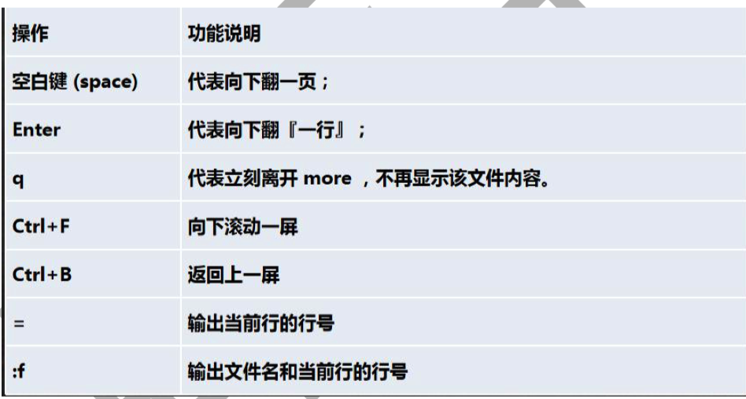
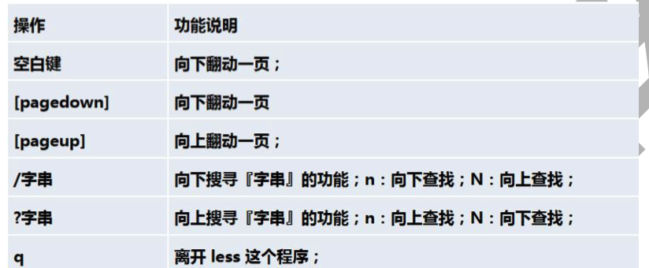
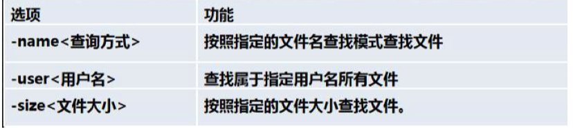
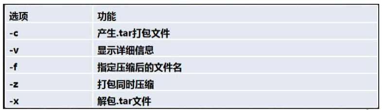

# Linux

## 1.规划

+ [视频教程](https://www.bilibili.com/video/BV187411y7hF)
+ 书籍教程<<鸟哥的Linux私房菜>>

## 2.入门概述

> 为什么学习Linux

linux诞生了这么多年，以前还喊着如何能取代windows系统，现在这个口号已经小多了，任何事物发展 都有其局限性都有其天花板。就如同在国内再搞一个社交软件取代腾讯一样，想想而已基本不可能，因 为用户已经习惯于使用微信交流，不是说技术上实现不了解而是老百姓已经习惯了，想让他们不用，即 使他们自己不用亲戚朋友还是要用，没有办法的事情。

用习惯了windows操作系统，再让大家切换到别的操作系统基本上是不可能的事情，改变一个人已经养 成的习惯太难。没有办法深入到普通老百姓的生活中，并不意味着linux就没有用武之地了。在服务器 端，在开发领域linux倒是越来越受欢迎，很多程序员都觉得不懂点linux都觉得不好意思，linux在开源 社区的地位依然岿然不动。

尤其是作为一个后端程序员，是必须要掌握Linux的，因为这都成为了你找工作的基础门槛了，所以不得 不学习！

> Linux简介

Linux 内核最初只是由芬兰人林纳斯·托瓦兹（Linus Torvalds）在赫尔辛基大学上学时出于个人爱好而 编写的。

Linux 是一套免费使用和自由传播的类 Unix 操作系统，是一个基于 POSIX（可移植操作系统接口） 和 UNIX 的多用户、多任务、支持多线程和多 CPU 的操作系统。

Linux 能运行主要的 UNIX 工具软件、应用程序和网络协议。它支持 32 位和 64 位硬件。Linux 继承了 Unix 以网络为核心的设计思想，是一个性能稳定的多用户网络操作系统。 

> Linux发行版

Linux 的发行版说简单点就是将 Linux 内核与应用软件做一个打包。


目前市面上较知名的发行版有：Ubuntu、RedHat、CentOS、Debian、Fedora、SuSE、OpenSUSE、 Arch Linux、SolusOS 等。


> Linux 应用领域

今天各种场合都有使用各种 Linux 发行版，从嵌入式设备到超级计算机，并且在服务器领域确定了地 位，通常服务器使用 LAMP（Linux + Apache + MySQL + PHP）或 LNMP（Linux + Nginx+ MySQL +

PHP）组合。

目前 Linux 不仅在家庭与企业中使用，并且在政府中也很受欢迎。

巴西联邦政府由于支持 Linux 而世界闻名。 有新闻报道俄罗斯军队自己制造的 Linux 发布版的，做为 G.H.ost 项目已经取得成果。 印度的 Kerala 联邦计划在向全联邦的高中推广使用 Linux。 中华人民共和国为取得技术独立，在龙芯处理器中排他性地使用 Linux。 在西班牙的一些地区开发了自己的 Linux 发布版，并且在政府与教育领域广泛使用，如 Extremadura 地区的 gnuLinEx 和 Andalusia 地区的 Guadalinex。 葡萄牙同样使用自己的 Linux 发布版 Caixa Mágica，用于 Magalh?es 笔记本电脑和 e-escola 政府 软件。 法国和德国同样开始逐步采用 Linux。

> Linux vs Windows


### 2.1 学习大纲


## 3.Linux基础部分

### 3.1 Linux安装vm和Centos

略https://www.bilibili.com/video/BV1Sv411r7vd?p=6

### 3.2 Linux网络连接三种模式

**桥接模式**

桥接模式就是将主机网卡与虚拟机虚拟的网卡利用虚拟网桥进行通信。在桥接的作用下，类似于把物理主机虚拟为一个交换机，所有桥接设置的虚拟机连接到这个交换机的一个接口上，物理主机也同样插在这个交换机当中，所以所有桥接下的网卡与网卡都是交换模式的，相互可以访问而不干扰。在桥接模式下，虚拟机ip地址需要与主机在同一个网段，如果需要联网，则网关与DNS需要与主机网卡一致。

**NAT模式**

在NAT模式中，主机网卡直接与虚拟NAT设备相连，然后虚拟NAT设备与虚拟DHCP服务器一起连接在虚拟交换机上，这样就实现了虚拟机联网。

**主机模式**

Host-Only模式其实就是NAT模式去除了虚拟NAT设备，然后使用VMware Network Adapter VMnet1（主机网卡）虚拟网卡连接VMnet1（虚拟机网卡）虚拟交换机来与虚拟机通信的，Host-Only模式将虚拟机与外网隔开，使得虚拟机成为一个独立的系统，只与主机相互通讯。

### 3.3虚拟机快照和克隆,VMTools

略

### 3.4 设置文件共享挂载

vm设置共享文件夹


### 3.5 Linux目录结构

 linux 的文件系统是采用级层式的树状目录结构，在此结构中的最上层是根目录“/”，然后在此目录下再创建其他的 目录。 

| 文件夹      | 英文全称                               | 文件夹作用                                                   |
| ----------- | -------------------------------------- | ------------------------------------------------------------ |
| ==/bin==    | Binaries                               | 存放系统命令的目录，所有用户都可以执行。                     |
| /sbin       | Super User Binaries                    | 保存和系统环境设置相关的命令，只有超级用户可以使用这些命令，有些命令可以允许普通用户查看 |
| ==/usr==    | Unix Shared Resources                  | Unix共享资源目录，存放所有命令、库、手册页等                 |
| /usr/bin    | Unix Shared Resources Binaries         | 存放系统命令的目录，所有用户可以执行。这些命令和系统启动无关，单用户模式下不能执行 |
| /usr/sbin   | Superuser Binaries                     | 存放根文件系统不必要的系统管理命令，超级用户可执行           |
| /dev        | Devices                                | 存放设备文件                                                 |
| ==/etc==    | Editable Text Configuration Chest      | 存放配置文件的地方,配置文件的目录                            |
| /opt        | Optional Application Software Packages | 可选应用软件包，第三方安装的软件保存位置                     |
| /lib        | Library                                | 存放系统程序运行所需的共享库                                 |
| /proc       | Processes                              | 虚拟文件系统，数据保存在内存中，存放当前进程信息             |
| ==/root==   | Root                                   | 存放root用户的相关文件,root用户的家目录。宿主目录 超级用户   |
| /tmp        | Temporary                              | 存放临时文件                                                 |
| ==/var==    | Variable                               | 是储存各种变化的文件，比如log等等                            |
| ==/home==   | Home                                   | 用户缺省宿主目录                                             |
| /lost+found | Lost And Found                         | 存放一些系统出错的检查结果                                   |
| /srv        | Server                                 | 服务数据目录                                                 |
| ==/mnt==    | Mount                                  | 挂载目录。临时文件系统的安装点，默认挂载光驱和软驱的目录     |
| ==/media==  | Media                                  | 挂载目录。 挂载媒体设备，如软盘和光盘                        |
| /misc       | Miscellaneous Device                   | 挂载目录。 挂载NFS服务                                       |

**在Linux里，一切都是文件**


## 4.实际操作篇

### 4.1 Linux远程登录

ssh:默认原生

ftp:Forklift

### 4.2 Vi和Vim编辑器

Linux 系统会内置 vi 文本编辑器 

Vim 具有程序编辑的能力，可以看做是 Vi 的增强版本，可以主动的以字体颜色辨别语法的正确性，方便程序设计。 代码补完、编译及错误跳转等方便编程的功能特别丰富，在程序员中被广泛使用。

#### 4.2.1 Vi和Vim常用的三种模式

+ 正常模式
  以 vim 打开一个档案就直接进入一般模式了(这是默认的模式)。在这个模式中， 你可以使用『上下左右』按键来 移动光标，你可以使用『删除字符』或『删除整行』来处理档案内容， 也可以使用『复制、粘贴』来处理你的文件数 据。

+ 插入模式

  按下 i, I, o, O, a, A, r, R 等任何一个字母之后才会进入编辑模式, 一般来说按 i 即可.

+ 命令行模式

  输入 esc 再输入：在这个模式当中， 可以提供你相关指令，完成读取、存盘、替换、离开 vim 、显 示行号等的动作则是在此模式中达成的！


### 4.3 开机关机、用户登录和注销

**关机&重启命令**

1) shutdown -h now //立即关机

2) shudown  -h -t 1 // 一分钟后关机 

3) shutdown -r now //重启

4) halt //关机，和上面一样

5) reboot  //重启，现在

6) sync // 把内存数据同步到磁盘

+ 不管是重启系统还是关闭系统，首先要运行 sync 命令，把内存中的数据写到磁盘中

+ 目前的 shutdown/reboot/halt 等命令均已经在关机前进行了 sync ， 老韩提醒: 小心驶得万年船

**用户登录和注销**

登录时尽量少用 root 帐号登录，因为它是系统管理员，最大的权限，避免操作失误。可以利用普通用户登录， 后再用`su - username`命令来切换身份.

在命令下输入 即可退出`su - username`的命令

### 4.4 Linux用户管理

Linux 系统是一个多用户多任务的操作系统，任何一个要使用系统资源的用户，都必须首先向系统管理员申请一个 账号，然后以这个账号的身份进入系统

#### 4.4.1 增删改查单个用户

1. 添加用户`useradd`,默认用户家目录在`/home/milan`. 

也可以通过`useradd -d {{目录}}` 指定目录

2. 指定/修改密码

`passwd {{用户名}}`

3. 删除用户

`userdel {{用户名}}`

把家目录也一起删除:`userdel -r {{用户名}}`

4. 查看用户信息

`id {{用户名}}`

5. 切换用户

`su - {{username}}`

从权限高的用户切换到权限低的用户，不需要输入密码，反之需要。

6. 查看当前用户`whoami`

#### 4.4.2 用户组

系统可以对有共性/权限的多个用户进行统一的管理

1. 新增组

`groupadd {{组名}}`

增加用户的时候到组`useradd -g {{组名}} {{用户名}}`

2. 删除组

`groupdel {{组名}}`

3. 修改用户的组

`usermod -g {{用户组}} {{用户名}}`

**相关文件**

1. /etc/passwd

用户（user）的配置文件，记录用户的各种信息 

每行的含义：用户名:口令:用户标识号:组标识号:注释性描述:主目录:登录 Shell

2. /etc/shadow

口令的配置文件 

每行的含义：登录名:加密口令:最后一次修改时间:最小时间间隔:最大时间间隔:警告时间:不活动时间:失效时间:标志

3. /etc/group

组(group)的配置文件，记录 Linux 包含的组的信息

每行含义：组名:口令:组标识号:组内用户列表

### 4.5 Linux实用指令

#### 4.5.1运行级别

运行级别说明： 

0 ：关机 

1 ：单用户【找回丢失密码】 

2：多用户状态没有网络服务 

3：多用户状态有网络服务 

4：系统未使用保留给用户 

5：图形界面 

6：系统重启 

常用运行级别是 3 和 5 ，也可以指定默认运行级别， 后面演示

**可以使用 `init {{运行级别}}`切换运行级别**

```shell
cat /etc/inittab 
# inittab is no longer used when using systemd.
#
# ADDING CONFIGURATION HERE WILL HAVE NO EFFECT ON YOUR SYSTEM.
#
# Ctrl-Alt-Delete is handled by /usr/lib/systemd/system/ctrl-alt-del.target
#
# systemd uses 'targets' instead of runlevels. By default, there are two main targets:
#
# multi-user.target: analogous to runlevel 3
# graphical.target: analogous to runlevel 5
#
# To view current default target, run:
# systemctl get-default
#
# To set a default target, run:
# systemctl set-default TARGET.target
#
```

`systemctl get-default`:查看当前运行级别

`systemctl set-default TARGET.target`:设置默认运行级别

#### 4.5.2 找回root密码

**不同版本找回root密码方式不同**

https://blog.csdn.net/weixin_40876986/article/details/89434656

#### 4.5.3 帮助命令

1. `man`获得帮助信息

基本语法：`man [命令或配置文件]`（功能描述：获得帮助信息）

2. `help`获得shell内置命令的帮助信息

基本语法：`help {{命令}}` （功能描述：获得 shell 内置命令的帮助信息）

#### 4.5.4 文件目录类命令

1. `pwd`：显示当前工作目录的绝对路径
2. `ls`:[选项] [目录或是文件]

-a:显示当前所有的文件和目录，包括隐藏的

-l:以列表方式显示

3. `cd` [参数] (切换到指定的目录)
4. `mkdir`：创建目录

-p:创建多级目录

5. `rmdir`：删除空目录

rmdir 删除的是空目录，如果目录下有内容时无法删除的。

 提示：如果需要删除非空目录，需要使用 rm -rf 要删除的目录

6. `touch`：创建空文件
7. `cp`:拷贝文件到指定目录

-r:递归复制整个文件夹

8. `rm`：移除文件或者目录

-r:递归删除

-f:强制删除不提示

9. `mv`：移动文件或者重命名
10. `cat`：查看文件内容

-n:显示行号

11. `more`：基于VI编辑器的文本过滤器，全屏的方式显示文本文件的内容。，它以全屏幕的方式按页显示文本文件的内容。more 指令中内置了若 干快捷键(交互的指令)
12. 

13. `less`指令：less 指令用来分屏查看文件内容，它的功能与 more 指令类似，但是比 more 指令更加强大，支持各种显示终端。less 指令在显示文件内容时，并不是一次将整个文件加载之后才显示，而是根据显示需要加载内容，对于显示大型文件具有 较高的效率。



14. `echo`:输出内容到控制台

15. `head`:用于显示文件的开头部分，默认10行

-n:指定查看多少行内容

16. `tail`：输出文件尾部的内容

-n:指定行数
-f:实时追踪文档的所有更新

17. `>`输出重定向，`>>`追加

（1）ls -l >文件 （功能描述：列表的内容写入文件 a.txt 中（覆盖写））

（2）ls -al >>文件 （功能描述：列表的内容追加到文件 aa.txt 的末尾）

（3）cat 文件 1 > 文件 2 （功能描述：将文件 1 的内容覆盖到文件 2）

（4）echo "内容">> 文件 (追加)

18. `ln`:软连接

**-s**  Create a symbolic link.

ln -s /root /home/myroot

当我们使用 pwd 指令查看目录时，仍然看到的是软链接所在目录。

19. `history`:查看已经执行过历史命令,也可以执行历史指令

history 10 查看最近使用的10个命令

#### 4.5.5 时间日期类

1) date （功能描述：显示当前时间）
2) date +%Y（功能描述：显示当前年份）
3) date +%m（功能描述：显示当前月份）
4) date +%d （功能描述：显示当前是哪一天）
5) date "+%Y-%m-%d %H:%M:%S"（功能描述：显示年月日时分秒）
6) 设置日期：`date -s 字符串时间`
7) 查看日历指令 cal,显示 2020 年日历 : cal 2020

#### 4.5.6 搜索查找类

**find**

find 指令将从指定目录向下递归地遍历其各个子目录，将满足条件的文件或者目录显示在终端。



**locate**

locate 指令可以快速定位文件路径。locate 指令利用事先建立的系统中所有文件名称及路径的 locate 数据库实现快速 定位给定的文件。Locate 指令无需遍历整个文件系统，查询速度较快。为了保证查询结果的准确度，管理员必须定期更 新 locate 时刻

+ 由于 locate 指令基于数据库进行查询，所以第一次运行前，必须使用 updatedb 指令创建 locate 数据库。

**which**

which 指令，可以查看某个指令在哪个目录下，比如 ls 指令在哪个目录

**grep指令和管道 | **

grep 过滤查找 ， 管道符，“|”，表示将前一个命令的处理结果输出传递给后面的命令处理。

案例 1: 请在 hello.txt 文件中，查找 "yes" 写法 1: cat /home/hello.txt | grep "yes" 

写法 2: grep -n "yes" /home/hello.txt

#### 4.5.6 压缩和解压

**gzip/gunzip 指令**

gzip 用于压缩文件， gunzip 用于解压的

gzip 文件 （功能描述：压缩文件，只能将文件压缩为*.gz 文件） 

gunzip 文件.gz （功能描述：解压缩文件命令）

**zip/unzip 指令**

zip 用于压缩文件， unzip 用于解压的，这个在项目打包发布中很有用的

zip [选项] XXX.zip 将要压缩的内容（功能描述：压缩文件和目录的命令） 

unzip [选项] XXX.zip （功能描述：解压缩文件）


 zip 常用选项

-r：递归压缩，即压缩目录  unzip 的常用选项

-d<目录> ：指定解压后文件的存放目录

**tar**

tar 指令 是打包指令，最后打包后的文件是 .tar.gz 的文件。

`tar [选项] XXX.tar.gz 打包的内容 (功能描述：打包目录，压缩后的文件格式.tar.gz)`



案例 1: 压缩多个文件，将 /home/pig.txt 和 /home/cat.txt 压缩成 tar -zcvf pc.tar.gz /home/pig.txt /home/cat.txt

案例 2: 将 pc.tar.gz 解压到当前目录 tar -zxvf pc.tar.gz

### 4.6 Linux 组管理和权限管理

#### 4.6.1 组基本介绍

在 linux 中的每个用户必须属于一个组，不能独立于组外。在 linux 中每个文件 有所有者、所在组、其它组的概念。

1) 所有者
2) 所在组
3) 其它组
4) 改变用户所在的组

一般为文件的创建者,谁创建了该文件，就自然的成为该文件的所有者。

**查看文件的所有者**

指令：ls –ahl

**修改文件的所有者**

指令：chown 用户名 文件名

#### 4.6.2 组的操作

**组的创建**

groupadd 组名

**修改文件/目录所在的组**

基本指令 `chgrp 组名 文件名`

应用实例 使用 root 用户创建文件 orange.txt ,看看当前这个文件属于哪个组，然后将这个文件所在组，修改到 fruit 组。

1. groupadd fruit
2. touch orange.txt
3. 看看当前这个文件属于哪个组 -> root 组
4. chgrp fruit orange.txt

**改变用户所在组**

`usermod -g 新组名 用户名`

`usermod -d 目录名 用户名`改变该用户登录的初始目录。特别说明：用户需要有进入到新目录的权限。

#### 4.6.3 权限管理

ls -l 中显示的内容如下： 

`drwx------@  7 yfb staff  224 7 10 11:59 Applications`

0-9 位说明

 第 0 位确定文件类型(d, - , l , c , b) 

+ l 是链接，相当于 windows 的快捷方式 

+ d 是目录，相当于 windows 的文件夹 

+ c 是字符设备文件，鼠标，键盘 

+ b 是块设备，比如硬盘 

第 1-3 位确定所有者（该文件的所有者）拥有该文件的权限。---User 

第 4-6 位确定所属组（同用户组的）拥有该文件的权限，---Group 

第 7-9 位确定其他用户拥有该文件的权限 ---Other

**rwx讲解**

1) [ r ]代表可读(read): 可以读取,查看
2) [ w ]代表可写(write): 可以修改,但是不代表可以删除该文件,删除一个文件的前提条件是对该文件所在的目录有写权 限，才能删除该文件.
3) [ x ]代表可执行(execute):可以被执行

可用数字表示为: r=4,w=2,x=1 因此 rwx=4+2+1=7 , 数字可以进行组合

`其它说明`:`-rwxrw-r-- 1 root root 1213 Feb 2 09:39 abc`

1 文件：硬连接数或 目录：子目录数 

root 用户 

root 组

1213 Feb 2 09:39 abc 文件大小(字节)，如果是文件夹，显示 4096 字节 最后修改日期 文件名


**修改权限**

`chmod`:通过 chmod 指令，可以修改文件或者目录的权限。

**第一种方式：+ 、-、= 变更权限**

u:所有者 g:所有组 o:其他人 a:所有人(u、g、o 的总和)

1) chmod u=rwx,g=rx,o=x 文件/目录名
2) chmod o+w 文件/目录名
3) chmod a-x 文件/目录名

**第二种方式：通过数字变更权限**

r=4 w=2 x=1 rwx=4+2+1=7

chmod u=rwx,g=rx,o=x 文件目录名

相当于 chmod 751 文件/目录名


**修改文件所有者**

chown newowner 文件/目录 改变所有者

chown newowner:newgroup 文件/目录 改变所有者和所在组 -R 如果是目录 则使其下所有子文件或目录递归生效


**修改文件/目录所在组-chgrp**

chgrp newgroup 文件/目录【 改变所在组】


## 5.高级篇


## 6.Shell编程
