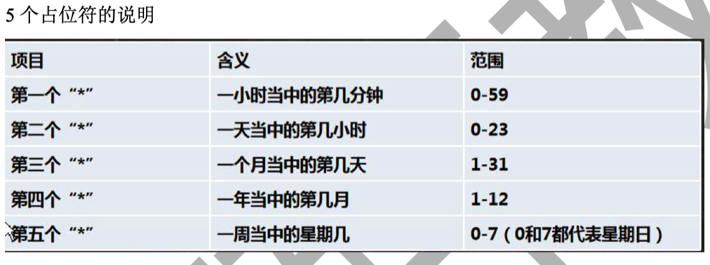

# Linux

## 1.规划

+ [视频教程](https://www.bilibili.com/video/BV187411y7hF)
+ 书籍教程<<鸟哥的Linux私房菜>>

## 2.入门概述

> 为什么学习Linux

linux诞生了这么多年，以前还喊着如何能取代windows系统，现在这个口号已经小多了，任何事物发展 都有其局限性都有其天花板。就如同在国内再搞一个社交软件取代腾讯一样，想想而已基本不可能，因 为用户已经习惯于使用微信交流，不是说技术上实现不了解而是老百姓已经习惯了，想让他们不用，即 使他们自己不用亲戚朋友还是要用，没有办法的事情。

用习惯了windows操作系统，再让大家切换到别的操作系统基本上是不可能的事情，改变一个人已经养 成的习惯太难。没有办法深入到普通老百姓的生活中，并不意味着linux就没有用武之地了。在服务器 端，在开发领域linux倒是越来越受欢迎，很多程序员都觉得不懂点linux都觉得不好意思，linux在开源 社区的地位依然岿然不动。

尤其是作为一个后端程序员，是必须要掌握Linux的，因为这都成为了你找工作的基础门槛了，所以不得 不学习！

> Linux简介

Linux 内核最初只是由芬兰人林纳斯·托瓦兹（Linus Torvalds）在赫尔辛基大学上学时出于个人爱好而 编写的。

Linux 是一套免费使用和自由传播的类 Unix 操作系统，是一个基于 POSIX（可移植操作系统接口） 和 UNIX 的多用户、多任务、支持多线程和多 CPU 的操作系统。

Linux 能运行主要的 UNIX 工具软件、应用程序和网络协议。它支持 32 位和 64 位硬件。Linux 继承了 Unix 以网络为核心的设计思想，是一个性能稳定的多用户网络操作系统。 

> Linux发行版

Linux 的发行版说简单点就是将 Linux 内核与应用软件做一个打包。


目前市面上较知名的发行版有：Ubuntu、RedHat、CentOS、Debian、Fedora、SuSE、OpenSUSE、 Arch Linux、SolusOS 等。


> Linux 应用领域

今天各种场合都有使用各种 Linux 发行版，从嵌入式设备到超级计算机，并且在服务器领域确定了地 位，通常服务器使用 LAMP（Linux + Apache + MySQL + PHP）或 LNMP（Linux + Nginx+ MySQL +

PHP）组合。

目前 Linux 不仅在家庭与企业中使用，并且在政府中也很受欢迎。

巴西联邦政府由于支持 Linux 而世界闻名。 有新闻报道俄罗斯军队自己制造的 Linux 发布版的，做为 G.H.ost 项目已经取得成果。 印度的 Kerala 联邦计划在向全联邦的高中推广使用 Linux。 中华人民共和国为取得技术独立，在龙芯处理器中排他性地使用 Linux。 在西班牙的一些地区开发了自己的 Linux 发布版，并且在政府与教育领域广泛使用，如 Extremadura 地区的 gnuLinEx 和 Andalusia 地区的 Guadalinex。 葡萄牙同样使用自己的 Linux 发布版 Caixa Mágica，用于 Magalh?es 笔记本电脑和 e-escola 政府 软件。 法国和德国同样开始逐步采用 Linux。

> Linux vs Windows


### 2.1 学习大纲


## 3.Linux基础部分

### 3.1 Linux安装vm和Centos

略https://www.bilibili.com/video/BV1Sv411r7vd?p=6

### 3.2 Linux网络连接三种模式

**桥接模式**

桥接模式就是将主机网卡与虚拟机虚拟的网卡利用虚拟网桥进行通信。在桥接的作用下，类似于把物理主机虚拟为一个交换机，所有桥接设置的虚拟机连接到这个交换机的一个接口上，物理主机也同样插在这个交换机当中，所以所有桥接下的网卡与网卡都是交换模式的，相互可以访问而不干扰。在桥接模式下，虚拟机ip地址需要与主机在同一个网段，如果需要联网，则网关与DNS需要与主机网卡一致。

**NAT模式**

在NAT模式中，主机网卡直接与虚拟NAT设备相连，然后虚拟NAT设备与虚拟DHCP服务器一起连接在虚拟交换机上，这样就实现了虚拟机联网。

**主机模式**

Host-Only模式其实就是NAT模式去除了虚拟NAT设备，然后使用VMware Network Adapter VMnet1（主机网卡）虚拟网卡连接VMnet1（虚拟机网卡）虚拟交换机来与虚拟机通信的，Host-Only模式将虚拟机与外网隔开，使得虚拟机成为一个独立的系统，只与主机相互通讯。

### 3.3虚拟机快照和克隆,VMTools

略

### 3.4 设置文件共享挂载

vm设置共享文件夹


### 3.5 Linux目录结构

 linux 的文件系统是采用级层式的树状目录结构，在此结构中的最上层是根目录“/”，然后在此目录下再创建其他的 目录。 

| 文件夹      | 英文全称                               | 文件夹作用                                                   |
| ----------- | -------------------------------------- | ------------------------------------------------------------ |
| ==/bin==    | Binaries                               | 存放系统命令的目录，所有用户都可以执行。                     |
| /sbin       | Super User Binaries                    | 保存和系统环境设置相关的命令，只有超级用户可以使用这些命令，有些命令可以允许普通用户查看 |
| ==/usr==    | Unix Shared Resources                  | Unix共享资源目录，存放所有命令、库、手册页等                 |
| /usr/bin    | Unix Shared Resources Binaries         | 存放系统命令的目录，所有用户可以执行。这些命令和系统启动无关，单用户模式下不能执行 |
| /usr/sbin   | Superuser Binaries                     | 存放根文件系统不必要的系统管理命令，超级用户可执行           |
| /dev        | Devices                                | 存放设备文件                                                 |
| ==/etc==    | Editable Text Configuration Chest      | 存放配置文件的地方,配置文件的目录                            |
| /opt        | Optional Application Software Packages | 可选应用软件包，第三方安装的软件保存位置                     |
| /lib        | Library                                | 存放系统程序运行所需的共享库                                 |
| /proc       | Processes                              | 虚拟文件系统，数据保存在内存中，存放当前进程信息             |
| ==/root==   | Root                                   | 存放root用户的相关文件,root用户的家目录。宿主目录 超级用户   |
| /tmp        | Temporary                              | 存放临时文件                                                 |
| ==/var==    | Variable                               | 是储存各种变化的文件，比如log等等                            |
| ==/home==   | Home                                   | 用户缺省宿主目录                                             |
| /lost+found | Lost And Found                         | 存放一些系统出错的检查结果                                   |
| /srv        | Server                                 | 服务数据目录                                                 |
| ==/mnt==    | Mount                                  | 挂载目录。临时文件系统的安装点，默认挂载光驱和软驱的目录     |
| ==/media==  | Media                                  | 挂载目录。 挂载媒体设备，如软盘和光盘                        |
| /misc       | Miscellaneous Device                   | 挂载目录。 挂载NFS服务                                       |

**在Linux里，一切都是文件**


## 4.实际操作篇

### 4.1 Linux远程登录

ssh:默认原生

ftp:Forklift

### 4.2 Vi和Vim编辑器

Linux 系统会内置 vi 文本编辑器 

Vim 具有程序编辑的能力，可以看做是 Vi 的增强版本，可以主动的以字体颜色辨别语法的正确性，方便程序设计。 代码补完、编译及错误跳转等方便编程的功能特别丰富，在程序员中被广泛使用。

#### 4.2.1 Vi和Vim常用的三种模式

+ 正常模式
  以 vim 打开一个档案就直接进入一般模式了(这是默认的模式)。在这个模式中， 你可以使用『上下左右』按键来 移动光标，你可以使用『删除字符』或『删除整行』来处理档案内容， 也可以使用『复制、粘贴』来处理你的文件数 据。

+ 插入模式

  按下 i, I, o, O, a, A, r, R 等任何一个字母之后才会进入编辑模式, 一般来说按 i 即可.

+ 命令行模式

  输入 esc 再输入：在这个模式当中， 可以提供你相关指令，完成读取、存盘、替换、离开 vim 、显 示行号等的动作则是在此模式中达成的！


### 4.3 开机关机、用户登录和注销

**关机&重启命令**

1) shutdown -h now //立即关机

2) shudown  -h -t 1 // 一分钟后关机 

3) shutdown -r now //重启

4) halt //关机，和上面一样

5) reboot  //重启，现在

6) sync // 把内存数据同步到磁盘

+ 不管是重启系统还是关闭系统，首先要运行 sync 命令，把内存中的数据写到磁盘中

+ 目前的 shutdown/reboot/halt 等命令均已经在关机前进行了 sync ， 老韩提醒: 小心驶得万年船

**用户登录和注销**

登录时尽量少用 root 帐号登录，因为它是系统管理员，最大的权限，避免操作失误。可以利用普通用户登录， 后再用`su - username`命令来切换身份.

在命令下输入 即可退出`su - username`的命令

### 4.4 Linux用户管理

Linux 系统是一个多用户多任务的操作系统，任何一个要使用系统资源的用户，都必须首先向系统管理员申请一个 账号，然后以这个账号的身份进入系统

#### 4.4.1 增删改查单个用户

1. 添加用户`useradd`,默认用户家目录在`/home/milan`. 

也可以通过`useradd -d {{目录}}` 指定目录

2. 指定/修改密码

`passwd {{用户名}}`

3. 删除用户

`userdel {{用户名}}`

把家目录也一起删除:`userdel -r {{用户名}}`

4. 查看用户信息

`id {{用户名}}`

5. 切换用户

`su - {{username}}`

从权限高的用户切换到权限低的用户，不需要输入密码，反之需要。

6. 查看当前用户`whoami`

#### 4.4.2 用户组

系统可以对有共性/权限的多个用户进行统一的管理

1. 新增组

`groupadd {{组名}}`

增加用户的时候到组`useradd -g {{组名}} {{用户名}}`

2. 删除组

`groupdel {{组名}}`

3. 修改用户的组

`usermod -g {{用户组}} {{用户名}}`

**相关文件**

1. /etc/passwd

用户（user）的配置文件，记录用户的各种信息 

每行的含义：用户名:口令:用户标识号:组标识号:注释性描述:主目录:登录 Shell

2. /etc/shadow

口令的配置文件 

每行的含义：登录名:加密口令:最后一次修改时间:最小时间间隔:最大时间间隔:警告时间:不活动时间:失效时间:标志

3. /etc/group

组(group)的配置文件，记录 Linux 包含的组的信息

每行含义：组名:口令:组标识号:组内用户列表

### 4.5 Linux实用指令

#### 4.5.1运行级别

运行级别说明： 

0 ：关机 

1 ：单用户【找回丢失密码】 

2：多用户状态没有网络服务 

3：多用户状态有网络服务 

4：系统未使用保留给用户 

5：图形界面 

6：系统重启 

常用运行级别是 3 和 5 ，也可以指定默认运行级别， 后面演示

**可以使用 `init {{运行级别}}`切换运行级别**

```shell
cat /etc/inittab 
# inittab is no longer used when using systemd.
#
# ADDING CONFIGURATION HERE WILL HAVE NO EFFECT ON YOUR SYSTEM.
#
# Ctrl-Alt-Delete is handled by /usr/lib/systemd/system/ctrl-alt-del.target
#
# systemd uses 'targets' instead of runlevels. By default, there are two main targets:
#
# multi-user.target: analogous to runlevel 3
# graphical.target: analogous to runlevel 5
#
# To view current default target, run:
# systemctl get-default
#
# To set a default target, run:
# systemctl set-default TARGET.target
#
```

`systemctl get-default`:查看当前运行级别

`systemctl set-default TARGET.target`:设置默认运行级别

#### 4.5.2 找回root密码

**不同版本找回root密码方式不同**

https://blog.csdn.net/weixin_40876986/article/details/89434656

#### 4.5.3 帮助命令

1. `man`获得帮助信息

基本语法：`man [命令或配置文件]`（功能描述：获得帮助信息）

2. `help`获得shell内置命令的帮助信息

基本语法：`help {{命令}}` （功能描述：获得 shell 内置命令的帮助信息）

#### 4.5.4 文件目录类命令

1. `pwd`：显示当前工作目录的绝对路径
2. `ls`:[选项] [目录或是文件]

-a:显示当前所有的文件和目录，包括隐藏的

-l:以列表方式显示

3. `cd` [参数] (切换到指定的目录)
4. `mkdir`：创建目录

-p:创建多级目录

5. `rmdir`：删除空目录

rmdir 删除的是空目录，如果目录下有内容时无法删除的。

 提示：如果需要删除非空目录，需要使用 rm -rf 要删除的目录

6. `touch`：创建空文件
7. `cp`:拷贝文件到指定目录

-r:递归复制整个文件夹

8. `rm`：移除文件或者目录

-r:递归删除

-f:强制删除不提示

9. `mv`：移动文件或者重命名
10. `cat`：查看文件内容

-n:显示行号

11. `more`：基于VI编辑器的文本过滤器，全屏的方式显示文本文件的内容。，它以全屏幕的方式按页显示文本文件的内容。more 指令中内置了若 干快捷键(交互的指令)
12. 

13. `less`指令：less 指令用来分屏查看文件内容，它的功能与 more 指令类似，但是比 more 指令更加强大，支持各种显示终端。less 指令在显示文件内容时，并不是一次将整个文件加载之后才显示，而是根据显示需要加载内容，对于显示大型文件具有 较高的效率。


14. `echo`:输出内容到控制台

15. `head`:用于显示文件的开头部分，默认10行

-n:指定查看多少行内容

16. `tail`：输出文件尾部的内容

-n:指定行数
-f:实时追踪文档的所有更新

17. `>`输出重定向，`>>`追加

（1）ls -l >文件 （功能描述：列表的内容写入文件 a.txt 中（覆盖写））

（2）ls -al >>文件 （功能描述：列表的内容追加到文件 aa.txt 的末尾）

（3）cat 文件 1 > 文件 2 （功能描述：将文件 1 的内容覆盖到文件 2）

（4）echo "内容">> 文件 (追加)

18. `ln`:软连接

**-s**  Create a symbolic link.

ln -s /root /home/myroot

当我们使用 pwd 指令查看目录时，仍然看到的是软链接所在目录。

19. `history`:查看已经执行过历史命令,也可以执行历史指令

history 10 查看最近使用的10个命令

#### 4.5.5 时间日期类

1) date （功能描述：显示当前时间）
2) date +%Y（功能描述：显示当前年份）
3) date +%m（功能描述：显示当前月份）
4) date +%d （功能描述：显示当前是哪一天）
5) date "+%Y-%m-%d %H:%M:%S"（功能描述：显示年月日时分秒）
6) 设置日期：`date -s 字符串时间`
7) 查看日历指令 cal,显示 2020 年日历 : cal 2020

#### 4.5.6 搜索查找类

**find**

find 指令将从指定目录向下递归地遍历其各个子目录，将满足条件的文件或者目录显示在终端。


**locate**

locate 指令可以快速定位文件路径。locate 指令利用事先建立的系统中所有文件名称及路径的 locate 数据库实现快速 定位给定的文件。Locate 指令无需遍历整个文件系统，查询速度较快。为了保证查询结果的准确度，管理员必须定期更 新 locate 时刻

+ 由于 locate 指令基于数据库进行查询，所以第一次运行前，必须使用 updatedb 指令创建 locate 数据库。

**which**

which 指令，可以查看某个指令在哪个目录下，比如 ls 指令在哪个目录

**grep指令和管道 | **

grep 过滤查找 ， 管道符，“|”，表示将前一个命令的处理结果输出传递给后面的命令处理。

案例 1: 请在 hello.txt 文件中，查找 "yes" 写法 1: cat /home/hello.txt | grep "yes" 

写法 2: grep -n "yes" /home/hello.txt

#### 4.5.6 压缩和解压

**gzip/gunzip 指令**

gzip 用于压缩文件， gunzip 用于解压的

gzip 文件 （功能描述：压缩文件，只能将文件压缩为*.gz 文件） 

gunzip 文件.gz （功能描述：解压缩文件命令）

**zip/unzip 指令**

zip 用于压缩文件， unzip 用于解压的，这个在项目打包发布中很有用的

zip [选项] XXX.zip 将要压缩的内容（功能描述：压缩文件和目录的命令） 

unzip [选项] XXX.zip （功能描述：解压缩文件）


 zip 常用选项

-r：递归压缩，即压缩目录  unzip 的常用选项

-d<目录> ：指定解压后文件的存放目录

**tar**

tar 指令 是打包指令，最后打包后的文件是 .tar.gz 的文件。

`tar [选项] XXX.tar.gz 打包的内容 (功能描述：打包目录，压缩后的文件格式.tar.gz)`


案例 1: 压缩多个文件，将 /home/pig.txt 和 /home/cat.txt 压缩成 tar -zcvf pc.tar.gz /home/pig.txt /home/cat.txt

案例 2: 将 pc.tar.gz 解压到当前目录 tar -zxvf pc.tar.gz

### 4.6 Linux 组管理和权限管理

#### 4.6.1 组基本介绍

在 linux 中的每个用户必须属于一个组，不能独立于组外。在 linux 中每个文件 有所有者、所在组、其它组的概念。

1) 所有者
2) 所在组
3) 其它组
4) 改变用户所在的组

一般为文件的创建者,谁创建了该文件，就自然的成为该文件的所有者。

**查看文件的所有者**

指令：ls –ahl

**修改文件的所有者**

指令：chown 用户名 文件名

#### 4.6.2 组的操作

**组的创建**

groupadd 组名

**修改文件/目录所在的组**

基本指令 `chgrp 组名 文件名`

应用实例 使用 root 用户创建文件 orange.txt ,看看当前这个文件属于哪个组，然后将这个文件所在组，修改到 fruit 组。

1. groupadd fruit
2. touch orange.txt
3. 看看当前这个文件属于哪个组 -> root 组
4. chgrp fruit orange.txt

**改变用户所在组**

`usermod -g 新组名 用户名`

`usermod -d 目录名 用户名`改变该用户登录的初始目录。特别说明：用户需要有进入到新目录的权限。

#### 4.6.3 权限管理

ls -l 中显示的内容如下： 

`drwx------@  7 yfb staff  224 7 10 11:59 Applications`

0-9 位说明

 第 0 位确定文件类型(d, - , l , c , b) 

+ l 是链接，相当于 windows 的快捷方式 

+ d 是目录，相当于 windows 的文件夹 

+ c 是字符设备文件，鼠标，键盘 

+ b 是块设备，比如硬盘 

第 1-3 位确定所有者（该文件的所有者）拥有该文件的权限。---User 

第 4-6 位确定所属组（同用户组的）拥有该文件的权限，---Group 

第 7-9 位确定其他用户拥有该文件的权限 ---Other

**rwx讲解**

1) [ r ]代表可读(read): 可以读取,查看
2) [ w ]代表可写(write): 可以修改,但是不代表可以删除该文件,删除一个文件的前提条件是对该文件所在的目录有写权 限，才能删除该文件.
3) [ x ]代表可执行(execute):可以被执行

可用数字表示为: r=4,w=2,x=1 因此 rwx=4+2+1=7 , 数字可以进行组合

`其它说明`:`-rwxrw-r-- 1 root root 1213 Feb 2 09:39 abc`

1 文件：硬连接数或 目录：子目录数 

root 用户 

root 组

1213 Feb 2 09:39 abc 文件大小(字节)，如果是文件夹，显示 4096 字节 最后修改日期 文件名


**修改权限**

`chmod`:通过 chmod 指令，可以修改文件或者目录的权限。

**第一种方式：+ 、-、= 变更权限**

u:所有者 g:所有组 o:其他人 a:所有人(u、g、o 的总和)

1) chmod u=rwx,g=rx,o=x 文件/目录名
2) chmod o+w 文件/目录名
3) chmod a-x 文件/目录名

**第二种方式：通过数字变更权限**

r=4 w=2 x=1 rwx=4+2+1=7

chmod u=rwx,g=rx,o=x 文件目录名

相当于 chmod 751 文件/目录名


**修改文件所有者**

chown newowner 文件/目录 改变所有者

chown newowner:newgroup 文件/目录 改变所有者和所在组 -R 如果是目录 则使其下所有子文件或目录递归生效


**修改文件/目录所在组-chgrp**

chgrp newgroup 文件/目录【 改变所在组】

### 4.7 Linux定时任务调度

任务调度：是指系统在某个时间执行的特定的命令或程序。 

任务调度分类：1.系统工作：有些重要的工作必须周而复始地执行。如病毒扫描等 

个别用户工作：个别用户可能希望执行某些程序，比如对 mysql 数据库的备份。


**基本语法**

crontab [选项]


**快速入门**

设置任务调度文件：/etc/crontab 

设置个人任务调度。执行 crontab –e 命令。 

接着输入任务到调度文件 

如：*/1 * * * * ls –l /etc/ > /tmp/to.txt

意思说每小时的每分钟执行 ls –l /etc/ > /tmp/to.txt 命令

**参数细节说明**



**特殊符号的说明**


**特殊时间执行案例**


**应用实例**

案例 1：每隔 1 分钟，就将当前的日期信息，追加到 /tmp/mydate 文件中

`*/1 * * * * date >> /tmp/mydate`

案例 2：每隔 1 分钟， 将当前日期和日历都追加到 /home/mycal 文件中 步骤:

(1) vim /home/my.sh 写入内容 date >> /home/mycal 和 cal >> /home/mycal

(2) 给 my.sh 增加执行权限，chmod u+x /home/my.sh

(3) crontab -e 增加 */1 * * * * /home/my.sh

**crond相关指令**

conrtab –r：终止任务调度。 

crontab –l：列出当前有那些任务调度 

service crond restart [重启任务调度]

#### 4.7.1  at定时任务

1) at 命令是一次性定时计划任务，at 的守护进程 atd 会以后台模式运行，检查作业队列来运行。
2) 默认情况下，atd 守护进程每 60 秒检查作业队列，有作业时，会检查作业运行时间，如果时间与当前时间匹配，则 运行此作业。
3) at 命令是一次性定时计划任务，执行完一个任务后不再执行此任务了
4) 在使用 at 命令的时候，一定要保证 atd 进程的启动 , 可以使用相关指令来查看 ps -ef | grep atd //可以检测 atd 是否在运行


**at 命令格式**

at [选项] [时间] 

Ctrl + D 结束 at 命令的输入， 输出两次


**at命令选项**


**at 时间定义**

at 指定时间的方法：

1) 接受在当天的 hh:mm（小时:分钟）式的时间指定。假如该时间已过去，那么就放在第二天执行。 例如：04:00
2) 使用 midnight（深夜），noon（中午），teatime（饮茶时间，一般是下午 4 点）等比较模糊的词语来指定时间。
3) 采用 12 小时计时制，即在时间后面加上 AM（上午）或 PM（下午）来说明是上午还是下午。 例如：12pm
4) 指定命令执行的具体日期，指定格式为 month day（月 日）或 mm/dd/yy（月/日/年）或 dd.mm.yy（日.月.年），指 定的日期必须跟在指定时间的后面。 例如：04:00 2021-03-1
5) 使用相对计时法。指定格式为：now + count time-units ，now 就是当前时间，time-units 是时间单位，这里能够是 minutes （分钟）、hours（小时）、days（天）、weeks（星期）。count 是时间的数量，几天，几小时。 例如：now + 5 minutes
6) 直接使用 today（今天）、tomorrow（明天）来指定完成命令的时间。

**实例**

2 天后的下午 5 点执行 /bin/ls /home


### 4.8 Linux网络配置

略

### 4.9 Linux磁盘分区、挂载

Linux 来说无论有几个分区，分给哪一目录使用，它归根结底就只有一个根目录，一个独立且唯一的文件结构 , Linux 中每个分区都是用来组成整个文件系统的一部分。

Linux 采用了一种叫“载入”的处理方法，它的整个文件系统中包含了一整套的文件和目录，且将一个分区和一个目录 联系起来。这时要载入的一个分区将使它的存储空间在一个目录下获得。


Linux 硬盘分 IDE 硬盘和 SCSI 硬盘，目前基本上是 SCSI 硬盘

对于 IDE 硬盘，驱动器标识符为“hdx~”,其中“hd”表明分区所在设备的类型，这里是指 IDE 硬盘了。“x”为盘号（a 为 基本盘，b 为基本从属盘，c 为辅助主盘，d 为辅助从属盘）,“~”代表分区，前四个分区用数字 1 到 4 表示，它们是主分区或扩展分区，从 5 开始就是逻辑分区。例，hda3 表示为第一个 IDE 硬盘上的第三个主分区或扩展分区,hdb2 表示为第二个 IDE 硬盘上的第二个主分区或扩展分区。

对于 SCSI 硬盘则标识为“sdx~”，SCSI 硬盘是用“sd”来表示分区所在设备的类型的，其余则和 IDE 硬盘的表示方法

**查看所有设备挂载情况**


### 4.10 Linux进程管理

1. 在 LINUX 中，每个执行的程序都称为一个进程。每一个进程都分配一个 ID 号(pid,进程号)。=>windows => linux

2. 每个进程都可能以两种方式存在的。前台与后台，所谓前台进程就是用户目前的屏幕上可以进行操作的。后台进程 则是实际在操作，但由于屏幕上无法看到的进程，通常使用后台方式执行。
3. 一般系统的服务都是以后台进程的方式存在，而且都会常驻在系统中。直到关机才才结束。
4. ps 命令是用来查看目前系统中，有哪些正在执行，以及它们执行的状况。可以不加任何参数.

**PS详解**

指令：ps –aux|grep xxx ，比如我看看有没有 sshd 服务

ps -ef 是以全格式显示当前所有的进程

-e 显示所有进程。-f 全格式

**终止进程kill和killall**

-9 :表示强迫进程立即停止

**查看进程树**

pstree [选项] ,可以更加直观的来看进程信息

**service管理**

服务(service) 本质就是进程，但是是运行在后台的，通常都会监听某个端口，等待其它程序的请求，比如(mysqld , sshd 防火墙等)，因此我们又称为守护进程，是 Linux 中非常重要的知识点。【原理图】


service管理制定

1) service 服务名 [start | stop | restart | reload | status]
2) 在 CentOS7.0 后 很多服务不再使用 service ,而是 systemctl (后面专门讲)
3) service 指令管理的服务在 /etc/init.d 查看


请使用 service 指令，查看，关闭，启动 network [注意：在虚拟系统演示，因为网络连接会关闭] 指令:

service network status 

service network stop 

service network start


Linux 系统有 7 种运行级别(runlevel)：常用的是级别 3 和 5 

运行级别 0：系统停机状态，系统默认运行级别不能设为 0，否则不能正常启动 

运行级别 1：单用户工作状态，root 权限，用于系统维护，禁止远程登陆 

运行级别 2：多用户状态(没有 NFS)，不支持网络 

运行级别 3：完全的多用户状态(有 NFS)，无界面，登陆后进入控制台命令行模式 

运行级别 4：系统未使用，保留 

运行级别 5：X11 控制台，登陆后进入图形 GUI 模式 

运行级别 6：系统正常关闭并重启，默认运行级别不能设为 6，否则不能正常启动

**systemctl**

基本语法： systemctl [start | stop | restart | status] 服务名 systemctl 指令管理的服务在 /usr/lib/systemd/system 查看

**systemctl 设置服务的自启动状态**

systemctl list-unit-files [ | grep 服务名] (查看服务开机启动状态, grep 可以进行过滤) systemctl enable 服务名 (设置服务开机启动) 

systemctl disable 服务名 (关闭服务开机启动) 

systemctl is-enabled 服务名 (查询某个服务是否是自启动的)

**打开或者关闭指定端口**

在真正的生产环境，往往需要将防火墙打开，但问题来了，如果我们把防火墙打开，那么外部请求数据包就不能跟 服务器监听端口通讯。这时，需要打开指定的端口。比如 80、22、8080 等，这个又怎么做呢？

1) 打开端口: firewall-cmd --permanent --add-port=端口号/协议
2) 关闭端口: firewall-cmd --permanent --remove-port=端口号/协议
3) 重新载入,才能生效 : firewall-cmd --reload
4) 查询端口是否开放: firewall-cmd --query-port=端口/协议

**top**

top 与 ps 命令很相似。它们都用来显示正在执行的进程。Top 与 ps 最大的不同之处，在于 top 在执行一段时间可以 更新正在运行的的进程。


交换操作说明


**监控网络状态**

基本语法 

​	netstat [选项] 

选项说明

​	-an 按一定顺序排列输出

​	-p 显示哪个进程在调用 

应用案例 

​	请查看服务名为 sshd 的服务的信息。 

​	netstat -anp | grep sshd


## 5.高级篇

### 5.1 Linux日志管理

1) 日志文件是重要的系统信息文件，其中记录了许多重要的系统事件，包括用户的登录信息、系统的启动信息、系统 的安全信息、邮件相关信息、各种服务相关信息等。
2) 日志对于安全来说也很重要，它记录了系统每天发生的各种事情，通过日志来检查错误发生的原因，或者受到攻击 时攻击者留下的痕迹。
3) 可以这样理解 日志是用来记录重大事件的工具

**系统常用的日志**

`/var/log/` 目录就是系统日志文件的保存位置


**日志类型：**

auth ##pam 产生的日志

authpriv ##ssh、ftp 等登录信息的验证信息 

corn ##时间任务相关 

kern ##内核 

lpr ##打印 

mail ##邮件 

mark(syslog)-rsyslog##服务内部的信息，时间标识 

news ##新闻组 

user ##用户程序产生的相关信息 

uucp ##unix to nuix copy 主机之间相关的通信 

local 1-7 ##自定义的日志设备

**日志级别**

debug ##有调试信息的，日志通信最多 

info ##一般信息日志，最常用 

notice ##最具有重要性的普通条件的信息 

warning ##警告级别 

err ##错误级别，阻止某个功能或者模块不能正常工作的信息 

crit ##严重级别，阻止整个系统或者整个软件不能正常工作的信息 

alert ##需要立刻修改的信息 

emerg ##内核崩溃等重要信息 

none ##什么都不记录

### 5.2 Linux备份与恢复

## 6.Shell编程

Shell 是一个命令行解释器，它为用户提供了一个向 Linux 内核发送请求以便运行程序的界面系统级程序，用户可以 用 Shell 来启动、挂起、停止甚至是编写一些程序。

**脚本常见的执行方式**

方式 1(输入脚本的绝对路径或相对路径) 说明：首先要赋予 helloworld.sh 脚本的+x 权限， 再执行脚本 比如 ./hello.sh 或者使用绝对路径 /root/shcode/hello.sh 

方式 2(sh+脚本) 说明：不用赋予脚本+x 权限，直接执行即可。 比如 sh hello.sh , 也可以使用绝对路径

**Shell变量**

1) Linux Shell 中的变量分为，系统变量和用户自定义变量。

2) 系统变量：$HOME、$PWD、$SHELL、$USER 等等，比如： echo $HOME

3) 显示当前 shell 中所有变量：set


>  基本语法：

1) 定义变量：变量名=值
2) 撤销变量：unset 变量
3) 声明静态变量：readonly 变量，注意：不能 unset


> 定义变量的规则

1) 变量名称可以由字母、数字和下划线组成，但是不能以数字开头。5A=200(×)
2) 等号两侧不能有空格
3) 变量名称一般习惯为大写， 这是一个规范，我们遵守即可

> 将命令的返回值赋值给变量

1) A=\`date\`反引号，运行里面的命令，并把结果返回给变量 A
2) A=$(date) 等价于反引号

> 设置环境变量

1) export 变量名=变量值 （功能描述：将 shell 变量输出为环境变量/全局变量）
2) source 配置文件 （功能描述：让修改后的配置信息立即生效）
3) echo $变量名 （功能描述：查询环境变量的值）

**位置参数变量**

> 位置参数变量

当我们执行一个 shell 脚本时，如果希望获取到命令行的参数信息，就可以使用到位置参数变量 比如 ： `./myshell.sh 100 200`, 这个就是一个执行 shell 的命令行，可以在 myshell 脚本中获取到参数信息

> 基本语法

$n （功能描述：n 为数字，$0 代表命令本身，$1-$9 代表第一到第九个参数，十以上的参数，十以上的参数需要用 大括号包含，如${10}） 

$* （功能描述：这个变量代表命令行中所有的参数，$*把所有的参数看成一个整体） 

$@（功能描述：这个变量也代表命令行中所有的参数，不过$@把每个参数区分对待）

$#（功能描述：这个变量代表命令行中所有参数的个数）


`$0 应该是本身`

**预定义变量**

就是 shell 设计者事先已经定义好的变量，可以直接在 shell 脚本中使用

> 基本语法

1) $$ （功能描述：当前进程的进程号（PID））
2) $! （功能描述：后台运行的最后一个进程的进程号（PID））
3) $？（功能描述：最后一次执行的命令的返回状态。 如果这个变量的值为 0， 证明上一个命令正确执行；如果这个变 量的值为非 0（具体是哪个数， 由命令自己来决定），则证明上一个命令执行不正确了。）

**运算符**

学习如何在 shell 中进行各种运算操作。

> 基本语法

1) “$((运算式))”或“$[运算式]”或者 expr m + n //expression 表达式
2) 注意 expr 运算符间要有空格, 如果希望将 expr 的结果赋给某个变量，使用 ``
3) expr m - n
4) expr \*, /, % 乘，除，取余

**条件判断**

> 判断语句

[ condition ]（注意 condition 前后要有空格） 

#非空返回 true， 可使用$?验证（0 为 true，>1 为 false）

常用判断条件

1. = 字符串比较

2. 两个整数的比较

   -lt 小于

   -le 小于等于 little equal

   -eq 等于

   -gt 大于

   -ge 大于等于

   -ne 不等于

3) 按照文件权限进行判断

-r 有读的权限

-w 有写的权限

-x 有执行的权限

4) 按照文件类型进行判断

-f 文件存在并且是一个常规的文件

-e 文件存在

-d 文件存在并是一个目录

**流程控制**

> if判断

if [ 条件判断式 ] 

then

 代码 

fi 

或者 , 多分支

---------

if [ 条件判断式 ] 

then 

代码 

elif [条件判断式] 

then 

代码 

fi

> case 语句

```shell
case $变量名 in 
" 值 1" ） 
如果变量的值等于值 1， 则执行程序 1 
;; 
" 值 2" ） 
如果变量的值等于值 2， 则执行程序 2 
;; 
…省略其他分支…
*） 如果变量的值都不是以上的值，则执行此程序 
;; 
esac
```

> for循环

语法1

```shell
for 变量 in 值 1 值 2 值 3…

do 
程序/代码 
done 应用实例 
testFor1.sh 
案例 1 ：打印命令行输入的参数 [这里可以看出$* 和 $@ 的区别]
```

语法2

```shell
基本语法 2 
for (( 初始值;循环控制条件;变量变化 ))
do 
程序/代码 
done
```


> while循环

```shell
基本语法 1 
while [ 条件判断式 ]
do 
程序 /代码 
done

#!/bin/bash 
#案例 1 ：从命令行输入一个数 n，统计从 1+..+ n 的值是多少？ 
SUM=0 
i=0 
while [ $i -le $1 ] 
do

	SUM=$[$SUM+$i]

#i 自增

	i=$[$i+1] 
	done 
	echo "执行结果=$SUM"
```

**读取控制台输入**

> 基本语法

read(选项)(参数) 选项：

-p：指定读取值时的提示符；

-t：指定读取值时等待的时间（秒）， 如果没有在指定的时间内输入，就不再等待了。。

参数 

变量：指定读取值的变量名

```shell
#!/bin/bash 
#案例 1：读取控制台输入一个 NUM1 值 
read -p "请输入一个数 NUM1=" NUM1 
echo "你输入的 NUM1=$NUM1" 
#案例 2：读取控制台输入一个 NUM2 值，在 10 秒内输入。 
read -t 10 -p "请输入一个数 NUM2=" NUM2 
echo "你输入的 NUM2=$NUM2"
```

**函数**

shell 编程和其它编程语言一样，有系统函数，也可以自定义函数。系统函数中，我们这里就介绍两个。

> 系统函数

1.basename 基本语法 

功能：返回完整路径最后 / 部分，用于获取文件名

basename [pathname] [suffix]

basename [string] [suffix] （功能描述：basename 命令会删掉所有的前缀包括最后一个（‘/’）字符，然后将字符串显示出来

选项：

suffix 为后缀，如果 suffix 被指定了,basename 会将 pathname 或 string 中的 suffix 去掉。

案例 1：请返回 /home/aaa/test.txt 的 "test.txt" 部分

basename /home/aaa/test.txt

2.dirname基本语法

功能：返回完整路径最后 / 的前面的部分，常用于返回路径部分

dirname 文件绝对路径 （功能描述：从给定的包含绝对路径的文件名中去除文件名（非目录的部分），然后返回剩 下的路径（目录的部分））

案例：

案例 1：请返回 /home/aaa/test.txt 的 /home/aaa

dirname /home/aaa/test.txt

**自定义函数**

```shell
基本语法

[ function ] funname[()] 
{
  Action;
  [return int;] 
}
```

调用直接写函数名：funname [值]

应用实例:案例 1：计算输入两个参数的和(动态的获取)， getSum

```shell
#!/bin/bash 
#案例 1：计算输入两个参数的和(动态的获取)， getSum
#定义函数 getSum 
function getSum() {

	SUM=$[$n1+$n2] 
	echo "和是=$SUM"

}

#输入两个值 
read -p "请输入一个数 n1=" n1 
read -p "请输入一个数 n2=" n2 
#调用自定义函数 
getSum $n1 $n2

```

