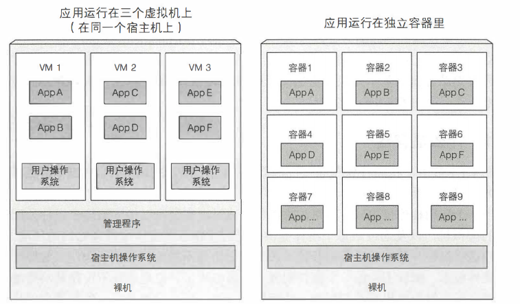
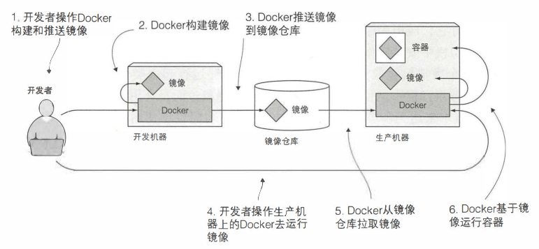
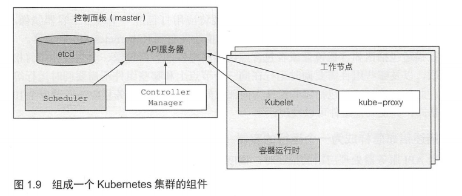
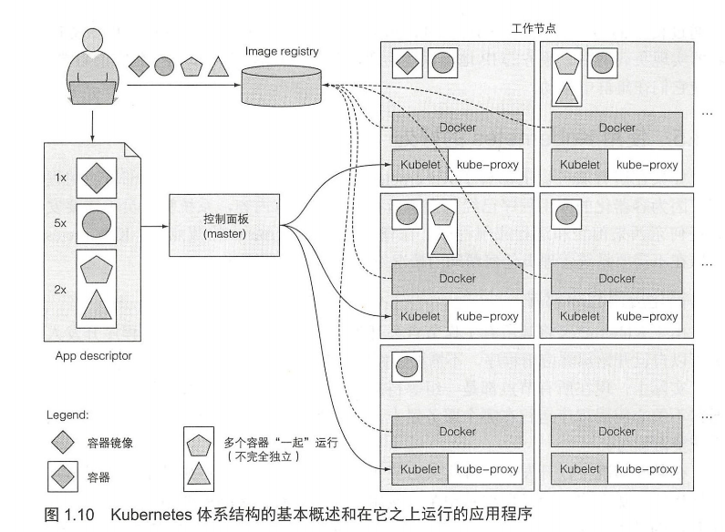
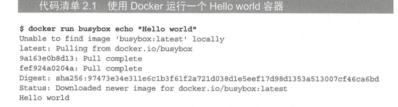
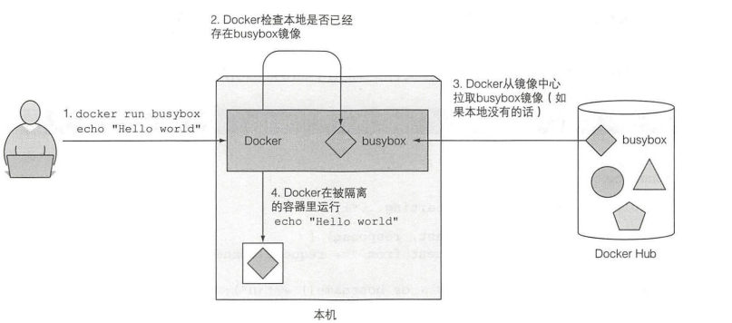
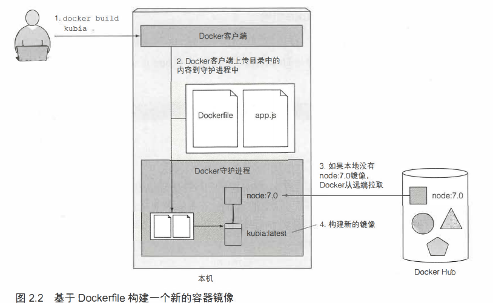
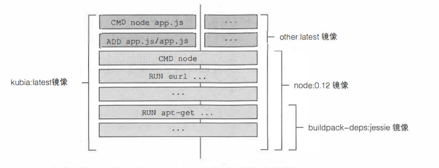

[k8s官网](https://kubernetes.io/)

[k8s博客](https://kubernetes.io/blog/)

[代码](https://github.com/luksa/kubernetes-in-action),注意有些命令更改了


----

# Kubernetes介绍

>  比较容器和虚拟机

和虚拟机比较， 容器更加轻量级， 它允许在相同的硬件上运行更多数量的组件。主要是因为每个虚拟机需要运行自己的一组系统进程， 这就产生了除组件进程消耗以外的额外计算资源损耗。 从另 一方面说， 一个容器仅仅是运行在宿主机上被隔离的单个进程， 仅消耗应用容器消耗的资源， 不会有其他进程的开销.



当你在一 台主机上运行三个虚拟机的时候， 你拥有了三个完全分离的操作系统，它们运行并共享一台裸机。 在那些虚拟机之下是宿主机的操作系统与一个管理程序，它将物理硬件资源分成较小部分的虚拟硬件资源， 从而被每个虚拟机里的操作系统使用。 运行在那些虚拟机里的应用程序会执行虚拟机操作系统的系统调用， 然后虚拟机内核会通过管理程序在宿主机上的物理来CPU执行x86指令。

多个容器则会完全执行运行在宿主机上的同一个内核的系统调用.

> 容器实现隔离机制介绍

你可能会好奇， 如果多个进程运行在同一个操作系统上， 那容器到底是怎样隔离它们的。 有两个机制可用：第一个是 **Linux** 命名空间， 它使每个进程只看到它自己的系统视图（文件、进程、网络接口、主机名等）；第二个是**Linux** 控制组 **(cgroups),**它限制了进程能使用的资源量 **(CPU**、 内存、 网络带宽等）

**用Linux命名空间隔离进程**

默认情况下， 每个 **Linux** 系统最初仅有一个命名空间。 所有系统资源（诸如文件系统、 用户 **ID**、 网络接口等） 属于这一个命名空间。 但是你能创建额外的命名空间， 以及在它们之间组织资源。 对于一个进程， 可以在其中一个命名空间中运行它。进程将只能看到同一个命名空间下的资源。 当然， 会存在多种类型的多个命名空间，所以一个进程不单单只属于某一个命名空间， 而属于每个类型的一个命名空间

**限制进程的可用资源**

另外的隔离性就是限制容器能使用的系统资 源。 这通过 **cgroups** 来实现。**cgroups** 是一个 **Linux** 内核功能， 它被用来限制一个进程或者一组进程的资源使用。

一个进程的资源(CPU、 内存、 网络带宽等）使用量不能超出被分配的量。 这种方式下， 进程不能过分使用为其他进程保留的资源， 这和进程运行在不同的机器上是类似的。

## Docker

**Docker** 是一个打包、 分发和运行应用程序的平台。 正如我们所说， 它允许将你的应用程序和应用程序所依赖的整个环境打包在一起。 这既可以是一些应用程序需要的库， 也可以是一个被安装的操作系统所有可用的文件。 **Docker** 使得传输这个包到一个中央仓库成为可能， 然后这个包就能被分发到任何运行 **Docker** 的机器上， 在那儿被执行

三个主要概念组成了这种情形：

• 镜像 —Docker镜像里包含了你打包的应用程序及其所依赖的环境。 它包含应用程序可用的文件系统和其他元数据， 如镜像运行时的可执行文件路径。

• 镜像仓库 —Docker镜像仓库用于存放Docker镜像， 以及促进不同人和不同电脑之间共享这些镜像。 当你编译你的镜像时，要么可以在编译它的电脑上运行，要么可以先上传镜像到一个镜像仓库， 然后下载到另外一 台电脑上并运行它。 某些仓库是公开的， 允许所有人从中拉取镜像， 同时也有一些是私有的， 仅部分人和机器可接入。

• 容器 —Docker容器通常是一个Linux容器， 它基于Docker镜像被创建。 一个运行中的容器是一个运行在Docker主机上的进程， 但它和主机， 以及所有运行在主机上的其他进程都是隔离的。 这个进程也是资源受限的， 意味着它只能访问和使用分配给它的资源(CPU、 内存等）

> 构建、分发和运行Docker镜像

开发人员首先构建一个镜像，然后把镜像推到镜像仓库中。 因此， 任何可以访问镜像仓库的人都可以使用该镜像。然后， 他们可以将镜像拉取到任何运行着Docker的机器上并运行镜像。 Docker会基于镜像创建一个独立的容器， 并运行二进制可执行文件指定其作为镜像的一部分。



## Kubernetes

Kubernetes使你在数以千计的电脑节点上运行软件时就像所有这些节点是单个大节点一样。它将底层基础设施抽象，简化了应用开发部署，以及对开发和运维团队的管理。

### Kubernetes集群架构

一个Kubernetes集群由很多节点组成

这些节点被分成以下两种类型

+ 主节点 ，它承载Kubernetes 控制和管理整个集群系统的控制面板

+ 工作节点，它们运行用户实际部署的应用



> 控制面板

控制面板用于控制集群并使它工作。它包含多个组件，组件可以运行在单个主节点上或者通过副本分别部署在多个主节点以确保高可用性这些组件是：

+ *Kubernetes* API 服务器，你和其他控制面板组件都要和它通信
+ Scheculer ，它调度你的应用（为应用的每个可部署组件分配一个工作节点〕
+ *Controller* Manager，它执行集群级别的功能，如复制组件、持续跟踪工作节点、处理节点失败
+ etcd ，一个可靠的分布式数据存储，它能持久化存储集群配置

> 工作节点

工作节点是运行容器化应用的机器。运行、监控和 理应用服务的任务是由以下组件完成的

+ Docker 或其他的容器类型
+ Kubelet ，它与 API 务器通信，并管理它所在节点的容器
+ *Kubernetes Service Proxy* (kube proxy ，它负责组件之间的负载均衡网络流量。

### 在Kubernetes中运行应用

为了在 Kubernetes 中运行应用，首先需要将应用打包进一个或多个容器镜像，再将那些镜像推送到镜像仓库，然后将应用的`描述`发布到 Kubernetes API 服务器

> 描述信息怎样成为一个运行的容器

当API服务器处理应用的描述时，调度器调度指定组的容器到可用的工作节点 ，调度是基于每组所需的计算资源，以及调度时每个节点未分配的资源。然后， 节点上的 Kubelet 指示容器运行时（例如 Docker ）拉取所需的镜像并运行容器。

仔细看图 1.10 以更好地理解如何在 Kubernetes 中部署应用程序。应用描述符列出了四个容器，并将它们分为3组（这些集合被称为 pod ，我们将在第3章中解释它们是什么）。前两个pod只包含 

1个容器，而最后 1个包含两个。这意味着两个容器都需要协作运行 ，不应该相互隔离。在每 pod 旁边，还可以看到1个数字表示需要并行运行的每个 pod 副本数量。在向 Kubernetes 提交描述符之后，它将把每个pod的指定副本数 调度到可用的工作节点上，节点上的 Kubelets 将告知Docker 从镜像仓库中拉取容器镜像并且运行容器。



> 扩展副本数量

当应用程序运行时，可以决定要增加或减少副本 ，而 kubernetes 将分别增加附加的或停止多余的副本。甚至可以把决定最佳副本数目的工作交给 kubernetes。它可以根据实时指标（如 CPU 负载、内存消耗、每秒 询或应用程序公开的任何其他指标）自动调整副本数。

> 命中移动目标

我们己经说过， 

Kubernetes 可能需要在集群中迁移你的容器。当它 运行的节点失败时，或者为了给其他容器腾出地方而从节点移除时，就会发生这种情况。当容器在集群内频繁调度时，它们该如何正确使用这个容器？当这些容器被复制并分布在整个集群中时，客户端如何连接到提供服务的容器呢？

为了让客户能够轻松地找到提供特定服务的容器，可以告诉 Kubernetes 哪些容器提供相同的服务，而 Kubernetes 将通过一个静态 IP 地址暴露所有容器，并将该地址暴露给集群中运行的所有应用程序。

ku-proxy将确保到服务的连接可跨提供服务的容器实现负载均衡。服务的IP 地址保持不变，因此客户端始终可以连接到它的容器，即使它们在集群中移动。

### 使用kubernetes好处

+ 简化应用程序部署
+ 更好的利用硬件
+ 健康检查和自修复
+ 自动扩容
+ 简化应用部署


# 开始使用Kubernetes和Docker

## 创建、运行及共享容器镜像

---

> 注意，学习Kubernetes前要先学习Docker，推荐《深入浅出Docker》

---


### 安装Docker并运行Hello World

首先，需要在linux主机上安装Docker 。如果使用的不是Linux操作系统，就需要启动 Linux 虚拟机（ VM ）并在虚拟机中运行 Docker 如果使用的是 Mac、Windows 系统， Docker将会自己启动一个虚拟机并在虚拟机中运行 Docker 守护进程

busybox 是一个单一可执行文件，包含多种标准 UNIX 命令行工具，如 echo、ls 、gzip等。



下图展示了 执行 `docker run` 之后发生的事情。

Docker 会检查`busybox:latest` 镜像是否己经存在。如果没有， Docker会从 http://docker.io 的Docker 镜像中拉取镜像.之后Docker基于这个镜像创建容器并在容器中运行命令。 

`echo`打印文字 标准输出流，然后进程终止运行。



> 容器中的版本管理

当然，所有的软包都会更新，所以通常每个包都不止1个版本 。Docker支持同一镜像多版本。每版本必须有唯一的 `tag` 。当没有指定tag时候，Docker会默认指定tag为`latest`.乳沟想要运行别的版本，需要这样指定镜像版本。`docker run <image>:<tag>`

> 创建一个简单的Node.js应用。

这个应用会接收 HTTP 请求并响应应用运行的主机名 。这样 ，应用运行在容器中，看到的是自己的主机名而不是宿主机名，即使它也像其他进程样运行在宿主机上，这在后面会非常有用，当应用部署kubernetes 上并进行伸缩时（水平伸缩，复制应用到多个节点），你会发现 HTTP请求切换到了应用的不同实例上。

应用代码情况如下 `app.js` kubernetes-in-action/Chapter02/kubia/app.js

```js
const http = require('http');
const os = require('os');

console.log("Kubia server starting...");

var handler = function(request, response) {
  console.log("Received request from " + request.connection.remoteAddress);
  response.writeHead(200);
  response.end("You've hit " + os.hostname() + "\n");
};

var www = http.createServer(handler);
www.listen(8080);
```

这里在 8080 端口启动了 HTTP 服务器,服务器会以状态码 200 OK 和文字 `"You've hit <hostname>"` 来响应每个请求.请求 handler 会把客户端的 IP 打印 到标准输出 ，以便日后查看。

现在可以直接下载安装 Node.js 来测试代码了，但是这不是必需的，因为可以直接用 Docker 应用打包成镜像，这样在需要运行的主机上就无须下载和安装其他东西（当然不包括安装 Docker 来运行镜像）

> 为镜像创建Dockerfile

为了把应用打包成镜像，首先需要创建 个叫 Dockerfile 的文件，它包含了系列构建镜像事才会执行的指令 

Dockerfile 文件需要和 app.js 文件在同一目录，并包含下面代码清单中的命令。


```dockerfile
FROM node
ADD app.js /app.js
ENTRYPOINT ["node", "app.js"]
```

From 行定义了镜像的起始内容（构建所基于的基础镜像） 这个例子中使用的是node 镜像的 tag 7 版本。第二行中把 app.js 文件从本地 件夹添加到镜像的根目录，保持 app.js这个文件名 

最后一行定义了当镜像被运行时需要被执行的命令，这个例子中，命令是 node app.js

> 构建容器镜像

现在有了 Dockerfile app .js 文件，这是用来构建镜像的所有文件 运行下面 Docker 命令来构建镜像：

```bash
docker build -t kubia .
```

用户告诉 Docker 需要 于当前目录（注意命令结尾的点）构建 个叫 kubia 的镜像， Dock 会在目录中 Dockerfile ，然后于其中的指令构建镜像



构建过程不是由Docker客户端进行的， 而是将整个目录的文件上传到Docker守护进程并在那里进行的。 Docker客户端和守护进程不要求在同一台机器上。 

> 镜像分层

镜像不是一个大的二进制块， 而是由多层组成不同镜像可能会共享分层， 这会让存储和传输变得更加高效。所有组成基础镜像的分层只会被存储一次。 拉取镜像的时候，**Docker** 会独立下载每一层。 

一些分层可能已经存储在机器上了。

你或许会认为每个 **Dockerfile**只创建一个新层，但是并不是这样的。构建镜像时，**Dockerfile** 中每一条单独的指令都会创建一个新层




构建完成时，新的镜像会存储在本地。

> 运行镜像容器

```bash
docker run --name kubia-container -p 8080:8080 -d kubia
```

这条命令告知Docker基于kubia镜像创建一个叫kubia-container的新容器。 这个容器与命令行分离(-d标志）， 这意味着在后台运行。 本机上的8080端口会被映射到容器内的8080端口(-p8080: 8080选项）， 所以可以通过http://localhost:8080访间这个应用。

> 略过查看容器内部、探索容器信息
>
> docker exec 和 docker container inspect

> 停止和删除容器

可以通过告知Docker停止kubia-container容器来停止应用：

```bash
docker stop kubia-container
```

可以删除容器，想要真正地删除一个容器，需要运行docker rm

```bash
docker rm kubia-container
```

## 配置Kubernetes集群

