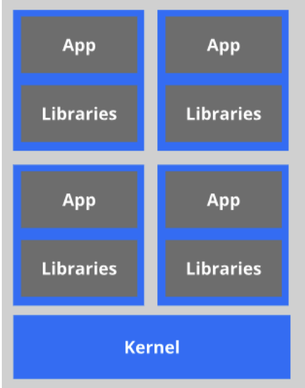
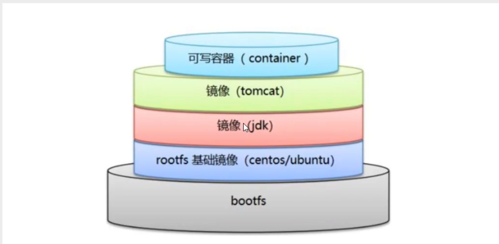
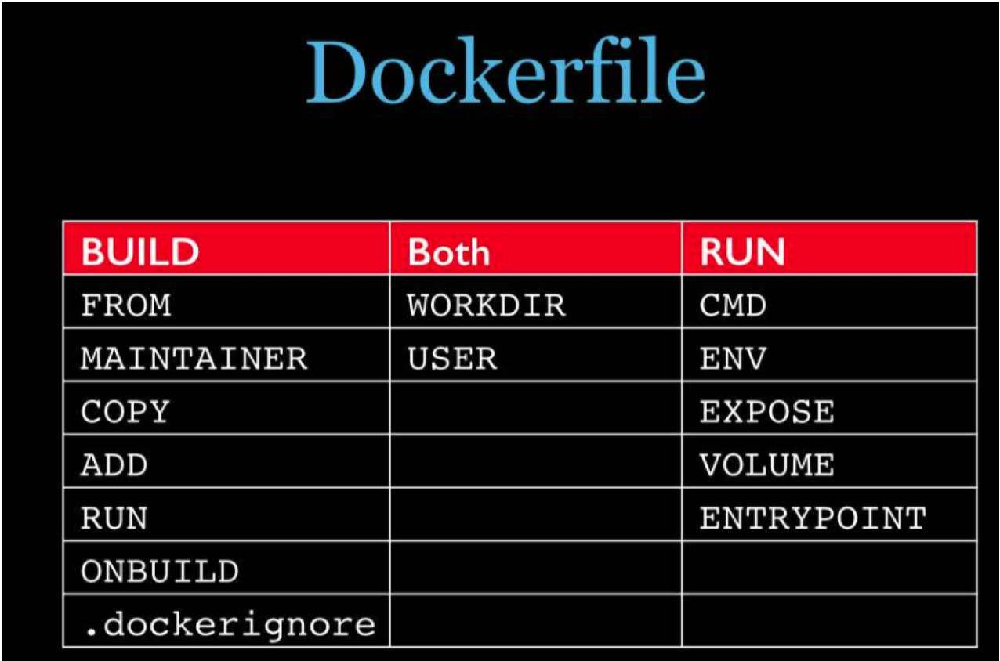

# Docker

> 弱小和无知不是生存的障碍，傲慢才是!

## 1.Docker学习

+ Docker概述
+ Docker安装
+ Docker命令
  + 镜像命令
  + 容器命令
  + 操作命令
+ Docker镜像
+ 容器数据卷
+ DockerFile
+ Docker网络原理
+ Goland整合Docker
+ Docker Compose
+ Docker Swarm
+ CI/CD 持续集成/持续部署


> 授人以鱼不如授人以渔


## 2.Docker概述

### 2.1Docker为什么会出现

一款产品从开发到上线，从操作系统，到运行环境，再到应用配置。作为开发+运维之间的协作我们需要 关心很多东西，这也是很多互联网公司都不得不面对的问题，特别是各种版本的迭代之后，不同版本环 境的兼容，对运维人员是极大的考验！

环境配置如此麻烦，换一台机器，就要重来一次，费力费时。很多人想到，能不能从根本上解决问题， 软件可以**带环境安装？**也就是说，安装的时候，把原始环境一模一样地复制过来。解决开发人员说的“ 在 我的机器上可正常工作”的问题。

之前在服务器配置一个应用的运行环境，要安装各种软件，就拿一个基本的工程项目的环境来说吧， Java/Tomcat/MySQL/JDBC驱动包等。安装和配置这些东西有多麻烦就不说了，它还不能跨平台。假如 我们是在 Windows 上安装的这些环境，到了 Linux 又得重新装。况且就算不跨操作系统，换另一台同 样操作系统的服务器，要移植应用也是非常麻烦的。

传统上认为，软件编码开发/测试结束后，所产出的成果即是程序或是能够编译执行的二进制字节码文件 等（Java为例）。而为了让这些程序可以顺利执行，开发团队也得准备完整的部署文件，让维运团队得 以部署应用程式，**开发需要清楚的告诉运维部署团队，用的全部配置文件+所有软件环境。**不过，即便如 此，仍然常常发生部署失败的状况。

Docker之所以发展如此迅速，也是因为它对此给出了一个标准化的解决方案。

Docker镜像的设计，**使得Docker得以打破过去「程序即应用」的观念。通过Docker镜像 ( images ) 将 应用程序所需要的系统环境，由下而上打包，达到应用程序跨平台间的无缝接轨运作。**

Docker的思想来自于集装箱，集装箱解决了什么问题？在一艘大船上，可以把货物规整的摆放起来。并 且各种各样的货物被集装箱标准化了，集装箱和集装箱之间不会互相影响。那么我就不需要专门运送水 果的船和专门运送化学品的船了。只要这些货物在集装箱里封装的好好的，那我就可以用一艘大船把他 们都运走。 docker就是类似的理念。

### 2.2 历史与理念

2010年，几个搞IT的年轻人，在美国旧金山成立了一家名叫“dotCloud”的公司。 这家公司主要提供基于PaaS的云计算技术服务。具体来说，是和LXC(LXC为Linux Container的简写。可以提供轻量级的虚拟化，以便隔离进程和资源，而且不需要提供指令解释机制以及全虚拟化的其他复杂性。)有关的容器技术。 后来，dotCloud公司将自己的容器技术进行了简化和标准化，并命名为——**Docker**。 Docker技术诞生之后，并没有引起行业的关注。而dotCloud公司，作为一家小型创业企业，在激烈的竞 争之下，也步履维艰。 正当他们快要坚持不下去的时候，脑子里蹦出了“开源”的想法。 什么是“开源”？开源，就是开放源代码。也就是将原来内部保密的程序源代码开放给所有人，然后让大 家一起参与进来，贡献代码和意见。 有的软件是一开始就开源的。也有的软件，是混不下去，创造者又不想放弃，所以选择开源。自己养不 活，就吃“百家饭”嘛。 2013年3月，dotCloud公司的创始人之一，Docker之父，28岁的Solomon Hykes正式决定，将 Docker项目开源。 不开则已，一开惊人。 越来越多的IT工程师发现了Docker的优点，然后蜂拥而至，加入Docker开源社区。 Docker的人气迅速攀升，速度之快，令人瞠目结舌。 开源当月，Docker 0.1 版本发布。此后的每一个月，Docker都会发布一个版本。到2014年6月9日， Docker 1.0 版本正式发布。 此时的Docker，已经成为行业里人气最火爆的开源技术，没有之一。甚至像Google、微软、Amazon、 VMware这样的巨头，都对它青睐有加，表示将全力支持。 Docker和容器技术为什么会这么火爆？说白了，就是因为它“轻”。 在容器技术之前，业界的网红是**虚拟机**。虚拟机技术的代表，是**VMWare**和**OpenStack**。 相信很多人都用过虚拟机。虚拟机，就是在你的操作系统里面，装一个软件，然后通过这个软件，再模 拟一台甚至多台“子电脑”出来。

在“子电脑”里，你可以和正常电脑一样运行程序，例如开QQ。如果你愿意，你可以变出好几个“子电 脑”，里面都开上QQ。“子电脑”和“子电脑”之间，是**相互隔离**的，互不影响。

虚拟机属于虚拟化技术。而Docker这样的容器技术，也是虚拟化技术，属于**轻量级的虚拟化**。

虚拟机虽然可以隔离出很多“子电脑”，但占用空间更大，启动更慢，虚拟机软件可能还要花钱（例如 VMWare）。

而容器技术恰好没有这些缺点。它不需要虚拟出整个操作系统，只需要虚拟一个小规模的环境（类似“沙 箱”）。

它启动时间很快，几秒钟就能完成。而且，它对资源的利用率很高（一台主机可以同时运行几千个 Docker容器）。此外，它占的空间很小，虚拟机一般要几GB到几十GB的空间，而容器只需要MB级甚至 KB级。

正因为如此，容器技术受到了热烈的欢迎和追捧，发展迅速。

> Docker 理念

Docker是基于Go语言实现的云开源项目。

Docker的主要目标是“Build，Ship and Run Any App , Anywhere”，也就是通过对应用组件的封装、分 发、部署、运行等生命周期的管理，使用户的APP（可以是一个WEB应用或数据库应用等等）及其运行 环境能够做到“一次封装，到处运行”。

Linux 容器技术的出现就解决了这样一个问题，而 Docker 就是在它的基础上发展过来的。将应用运行在 Docker 容器上面，而 Docker 容器在任何操作系统上都是一致的，这就实现了跨平台、跨服务器。只需 要一次配置好环境，换到别的机子上就可以一键部署好，大大简化了操作。

### 2.3 Docker 能干什么

> 以前的虚拟机技术

虚拟机（virtual machine）就是带环境安装的一种解决方案。

它可以在一种操作系统里面运行另一种操作系统，比如在Windows 系统里面运行Linux 系统。应用程序 对此毫无感知，因为虚拟机看上去跟真实系统一模一样，而对于底层系统来说，虚拟机就是一个普通文 件，不需要了就删掉，对其他部分毫无影响。这类虚拟机完美的运行了另一套系统，能够使应用程序， 操作系统和硬件三者之间的逻辑不变。


虚拟机的缺点：

1、资源占用多 2、冗余步骤多 3 、启动慢


> 虚拟化容器技术

由于前面虚拟机存在这些缺点，Linux 发展出了另一种虚拟化技术：Linux 容器（Linux Containers，缩 写为 LXC）。

Linux 容器不是模拟一个完整的操作系统，而是对进程进行隔离。有了容器，就可以将软件运行所需的 所有资源打包到一个隔离的容器中。容器与虚拟机不同，不需要捆绑一整套操作系统，只需要软件工作 所需的库资源和设置。系统因此而变得高效轻量并保证部署在任何环境中的软件都能始终如一地运行。



比较了 Docker 和传统虚拟化方式的不同之处：

+ 传统虚拟机技术是虚拟出一套硬件后，在其上运行一个完整操作系统，在该系统上再运行所需应用 进程； 

+ 而容器内的应用进程直接运行于宿主的内核，容器内没有自己的内核，而且也没有进行硬件虚拟。 因此容器要比传统虚拟机更为轻便。 

+ 每个容器之间互相隔离，每个容器有自己的文件系统 ，容器之间进程不会相互影响，能区分计算资 源。


> 开发、运维(DevOps)

**更快速的应用交付和部署：**

传统的应用开发完成后，需要提供一堆安装程序和配置说明文档，安装部署后需根据配置文档进行繁杂 的配置才能正常运行。

Docker化之后只需要交付少量容器镜像文件，在正式生产环境加载镜像并运行即 可，应用安装配置在镜像里已经内置好，大大节省部署配置和测试验证时间。

**更便捷的升级和扩缩容：**

随着微服务架构和Docker的发展，大量的应用会通过微服务方式架构，应用的开发构建将变成搭乐高积 木一样，

每个Docker容器将变成一块“积木”，应用的升级将变得非常容易。当现有的容器不足以支撑业 务处理时，可通过镜像运行新的容器进行快速扩容，使应用系统的扩容从原先的天级变成分钟级甚至秒 级。

**更简单的系统运维：**

应用容器化运行后，生产环境运行的应用可与开发、测试环境的应用高度一致，容器会将应用程序相关 的环境和状态完全封装起来，不会因为底层基础架构和操作系统的不一致性给应用带来影响，产生新的 BUG。当出现程序异常时，也可以通过测试环境的相同容器进行快速定位和修复。

**更高效的计算资源利用：**

 Docker是内核级虚拟化，其不像传统的虚拟化技术一样需要额外的Hypervisor [管理程序] 支持，所以在 一台物理机上可以运行很多个容器实例，可大大提升物理服务器的CPU和内存的利用率。


## 3.Docker安装

### 3.1Docker基本组成

Docker的架构图


**镜像(image)**:

Docker 镜像（Image）就是一个只读的模板。镜像可以用来创建 Docker 容器，一个镜像可以创建很 多容器。 就好似 Java 中的 类和对象，类就是镜像，容器就是对象！

最终服务运行在容器里。

**容器(container)**:

Docker 利用容器（Container）独立运行的一个或一组应用。容器是用镜像创建的运行实例。 它可以被启动、开始、停止、删除。每个容器都是相互隔离的，保证安全的平台。 可以把容器看做是一个简易版的 Linux 环境（包括root用户权限、进程空间、用户空间和网络空间等） 和运行在其中的应用程序。 容器的定义和镜像几乎一模一样，也是一堆层的统一视角，唯一区别在于容器的最上面那一层是可读可写 的。

**仓库(repository)**:

仓库（Repository）是集中存放镜像文件的场所。 仓库(Repository)和仓库注册服务器（Registry）是有区别的。仓库注册服务器上往往存放着多个仓 库，每个仓库中又包含了多个镜像，每个镜像有不同的标签（tag）。 仓库分为公开仓库（Public）和私有仓库（Private）两种形式。 最大的公开仓库是 Docker Hub(https://hub.docker.com/)，存放了数量庞大的镜像供用户下载。 国内的公开仓库包括阿里云 、网易云 等

**小结**

需要正确的理解仓储/镜像/容器这几个概念 :

+ Docker 本身是一个容器运行载体或称之为管理引擎。我们把应用程序和配置依赖打包好形成一个 可交付的运行环境，这个打包好的运行环境就似乎 image镜像文件。只有通过这个镜像文件才能生 成 Docker 容器。image 文件可以看作是容器的模板。Docker 根据 image 文件生成容器的实例。 同一个 image 文件，可以生成多个同时运行的容器实例。

+ image 文件生成的容器实例，本身也是一个文件，称为镜像文件。

+  一个容器运行一种服务，当我们需要的时候，就可以通过docker客户端创建一个对应的运行实例， 也就是我们的容器 

+ 至于仓库，就是放了一堆镜像的地方，我们可以把镜像发布到仓库中，需要的时候从仓库中拉下来 就可以了。


### 3.2 环境说明

**查看自己的内核**

`uname -r` 命令用于打印当前系统相关信息（内核版本号、硬件架构、主机名称和操作系统类型

等）。

```shell
[root@kuangshen ~]# uname -r 
3.10.0-1062.12.1.el7.x86_64
```

**查看版本信息**

```shell
[root@yfb ~]# cat /etc/os-release
NAME="CentOS Linux"
VERSION="7 (Core)"
ID="centos"
ID_LIKE="rhel fedora"
VERSION_ID="7"
PRETTY_NAME="CentOS Linux 7 (Core)"
ANSI_COLOR="0;31"
CPE_NAME="cpe:/o:centos:centos:7"
HOME_URL="https://www.centos.org/"
BUG_REPORT_URL="https://bugs.centos.org/"

CENTOS_MANTISBT_PROJECT="CentOS-7"
CENTOS_MANTISBT_PROJECT_VERSION="7"
REDHAT_SUPPORT_PRODUCT="centos"
REDHAT_SUPPORT_PRODUCT_VERSION="7"

```

**安装**

1、官网安装参考手册：https://docs.docker.com/engine/install/centos/

2、确定你是CentOS7及以上版本，我们已经做过了 

3、yum安装gcc相关环境（需要确保 虚拟机可以上外网 ）

4、卸载旧版本

```shell
yum remove docker \ docker-client \ docker-client-latest \ docker-common \ docker-latest \ docker-latest-logrotate \ docker-logrotate \ docker-engine
```

5、安装需要的软件包

```shell
yum install -y yum-utils
```

6、设置镜像仓库

```shell
# 错误 yum-config-manager --add-repo 
https://download.docker.com/linux/centos/docker-ce.repo 
## 报错 [Errno 14] 
curl#35 - TCP connection reset by peer [Errno 12] 
curl#35 - Timeout

# 正确推荐使用国内的 
yum-config-manager --add-repo http://mirrors.aliyun.com/dockerce/linux/centos/docker-ce.repo
```

7、更新yum软件包索引

```
yum makecache fast
```

8、安装 Docker CE

```
yum install docker-ce docker-ce-cli containerd.io
```
9、启动 Docker

```
systemctl start docker
```
10、测试命令

```shell
docker version

docker run hello-world

docker images
```

11、卸载

```shell
systemctl stop docker

yum -y remove docker-ce docker-ce-cli containerd.io

rm -rf /var/lib/docker
```

### 3.3 运行hell-world

1. 启动hello-world

```shell
docker run hello-world
```


### 3.4 底层原理

**Docker怎么工作的**

Docker是一个Client-Server结构的系统，Docker守护进程运行在主机上， 然后通过Socket连接从客户 端访问！

守护进程从客户端接受命令并管理运行在主机上的容器。 容器，是一个运行时环境，就是我们 前面说到的集装箱。


**为什么Docker比较 VM 快**

1、docker有着比虚拟机更少的抽象层。由亍docker不需要Hypervisor实现硬件资源虚拟化,运行在 docker容器上的程序直接使用的都是实际物理机的硬件资源。因此在CPU、内存利用率上docker将会在 效率上有明显优势。

2、docker利用的是宿主机的内核,而不需要Guest OS。因此,当新建一个容器时,docker不需要和虚拟机 一样重新加载一个操作系统内核。仍而避免引寻、加载操作系统内核返个比较费时费资源的过程,当新建 一个虚拟机时,虚拟机软件需要加载Guest OS,返个新建过程是分钟级别的。而docker由于直接利用宿主 机的操作系统,则省略了这个过程,因此新建一个docker容器只需要几秒钟。


## 4.Docker常用命令

### 4.1帮助命令

```shell
docker version # 显示 Docker 版本信息。
docker info  # 显示 Docker 系统信息，包括镜像和容器数。
docker --help   # 帮助
```

帮助文档地址：https://docs.docker.com/

### 4.2 镜像命令

**docker images**

```shell
# 列出本地主机上的镜像 [root@kuangshen ~]# docker images REPOSITORY TAG
REPOSITORY    TAG       IMAGE ID       CREATED        SIZE
hello-world   latest    d1165f221234   5 months ago   13.3kB

# 解释 REPOSITORY TAG IMAGE ID CREATED SIZE

镜像的仓库源 镜像的标签 镜像的ID 镜像创建时间 镜像大小

# 同一个仓库源可以有多个 TAG，代表这个仓库源的不同版本，我们使用REPOSITORY：TAG 定义不同 的镜像，如果你不定义镜像的标签版本，docker将默认使用 lastest 镜像！

# 可选项

-a： 列出本地所有镜像

-q： 只显示镜像id

--digests： 显示镜像的摘要信息
```

**docker search**

```shell
# 搜索镜像 [root@kuangshen ~]# docker search mysql 
NAME                              DESCRIPTION                                    STARS     OFFICIAL   AUTOMATED
mysql                             MySQL is a widely used, open-source relation…   11269     [OK]

# docker search 某个镜像的名称

对应DockerHub仓库中的镜像

# 可选项 
--filter stars=50 ： 列出收藏数不小于指定值的镜像。
```

**docker pull**

```shell
# 下载镜像 [root@kuangshen ~]# docker pull mysql 
Using default tag: latest # 不写tag，默认是latest 
latest: Pulling from library/mysql 
54fec2fa59d0: Already exists # 分层下载 
bcc6c6145912: Already exists 
951c3d959c9d: Already exists 
05de4d0e206e: Already exists 
319f0394ef42: Already exists 
d9185034607b: Already exists 
013a9c64dadc: Already exists 
42f3f7d10903: Pull complete 
c4a3851d9207: Pull complete
82a1cc65c182: Pull complete 
a0a6b01efa55: Pull complete 
bca5ce71f9ea: Pull complete 
Digest: sha256:61a2a33f4b8b4bc93b7b6b9e65e64044aaec594809f818aeffbff69a893d1944 #签名 
Status: Downloaded newer image for mysql:latest 
docker.io/library/mysql:latest # 真实位置

# 指定版本下载 [root@kuangshen ~]# docker pull mysql:5.7 ....
```

**docker rmi**

```shell
# 删除镜像 
docker rmi -f 镜像id  #删除单个
docker rmi -f 镜像名:tag 镜像名:tag #删除多个
docker rmi -f $(docker images -qa)	#删除全部
```


### 4.3 容器命令

说明：有镜像才能创建容器，我们这里使用 centos 的镜像来测试，就是虚拟一个 centos ！

```shell
docker pull centos
```

**新建容器并启动**

```shell
# 命令 
docker run [OPTIONS] IMAGE [COMMAND][ARG...]

# 常用参数说明
--name="Name" # 给容器指定一个名字
-d  # 后台方式运行容器，并返回容器的id
-i # 以交互模式运行容器，通过和 -t 一起使用
-t    # 给容器重新分配一个终端，通常和 -i 一起使用
-P   # 随机端口映射（大写）
-p  # 指定端口映射（小结），一般可以有四种写法
		ip:hostPort:containerPort
		ip::containerPort
		hostPort:containerPort (常用)
		containerPort
		
		

# 使用centos进行用交互模式启动容器，在容器内执行/bin/bash命令！
[root@kuangshen ~]# docker run -it centos /bin/bash
[root@kuangshen ~]exit  # 使用 exit 退出容器
```

**列出所有运行时的容器**

```shell
# 命令
docker ps [OPTIONS]
# 常用参数说明
-a # 列出当前所有正在运行的容器 + 历史运行过的容器
-l # 显示最近创建的容器
-n=? # 显示最近n个创建的容器
-q # 静默模式，只显示容器编号。
```

**删除容器**

```shell
docker rm 容器id
docker rm -f $(docker ps -a -q) #删除所有容器
docker ps -a -q|xargs docker rm #删除所有容器
```

**退出容器**

```shell
exit
crtl+P+Q  #容器不停止退出
```

**启动停止的容器**

```shell
docker start (容器id or 容器名)  #启动容器
docker restart (容器id or 容器名) #重启重启
docker stop (容器id or 容器名) #停止容器
docker kill (容器id or 容器名) # 强制停止容器
```

### 4.4 常用的其他命令

**后台启动容器**

```shell
# 命令 
docker run -d 容器名

# 问题： 使用docker ps 查看，发现容器已经退出了！ 
# 解释：Docker容器后台运行，就必须有一个前台进程，容器运行的命令如果不是那些一直挂起的命 令，就会自动退出。 
# 比如，你运行了nginx服务，但是docker前台没有运行应用，这种情况下，容器启动后，会立即自 杀，因为他觉得没有程序了，所以最好的情况是，将你的应用使用前台进程的方式运行启动。
```


**查看日志**

```shell
# 命令 
docker logs -f -t --tail 容器id
# -t 显示时间戳 # -f 打印最新的日志 # --tail 数字 显示多少条！

# 例子：我们启动 centos，并编写一段脚本来测试玩玩！最后查看日志
# docker run -d centos /bin/sh -c "while true;do echo kuangshen;sleep 1;done"
```

**查看容器运行中的进程信息**

```shell
# 命令 
docker top 容器id
```

**查看容器/镜像的元数据**

```shell
docker inspect 容器id
```

**进入正在运行的容器**

```shell
# 命令1
docker exec -it 容器id bashShell

# 命令2 
docker attach 容器id

# 区别 
# exec 是在容器中打开新的终端，并且可以启动新的进程 
# attach 直接进入容器启动命令的终端，不会启动新的进程
```

**从容器内拷贝文件到主机上**

```shell
# 命令 
docker cp 容器id:容器内路径 目的主机路径
```


### 4.5小结


```shell
# 当前shell下连接指定运行镜像
attach Attach to a running container attach 
# 通过Dockerfile定制镜像
bulid Build an image from a Dcokerfile
# 提交当前容器作为新的镜像
commit Create a new image from a container changes
# 从容器中拷贝指定文件或目录到宿主机
cp Copy files/folders from the containers filesystem to the host path create Create a new container
# 创建一个容器，同run 但是不启动
carete  Create a new container
# 查看docker容器变化
diff Inspect changes on a container's filesystem
# 从docker服务获取容器实时时间
events Get real time events from the server
# 在已存在的容器上运行命令
exec Run a command in an existing container
# 导出容器的内容作为一个tar归档文件
export Stream the contents of a container as a tar archive
# 展示一个镜像形成历史
history Show the history of an image
# 列出系统当前镜像
images List images
# 从tar包的内容创建一个新的文件系统映像
import Create a new filesystem image from the contents of a tarball
# 显示系统相关信息
info Display system-wide information
# 查看容器详细信息
inspect Return low-level information on a container
# Kill指定docker容器
kill Kill a running container
# 从一个tar包加载一个镜像
load Load an image from a tar archive
# 注册或者登陆一个docker源服务器
login Register or Login to the docker registry server
# 从当前docker register注册退出
logout Log out from a Docker registry server
logs Fetch the logs of a container # 输出当前容器日志信息
# 查看映射端口对应的容器内部源端口
port Lookup the public-facing port which is NAT-ed to PRIVATE_PORT
pause Pause all processes within a container # 暂停容器
ps List containers # 列出容器列表
# 从docker镜像源服务器拉取指定镜像或者库镜像
pull Pull an image or a repository from the docker registry server
# 推送指定镜像或者库镜像至docker源服务器
push Push an image or a repository to the docker registry server
restart Restart a running container # 重启运行的容器
rm Remove one or more containers # 移除一个或者多个容器
# 移除一个或多个镜像[无容器使用该 镜像才可删除，否则需删除相关容器才可继续或 -f 强制删除]
rmi Remove one or more images
run Run a command in a new container # 创建一个新的容器并运行一个命令
save Save an image to a tar archive # 保存一个镜像为一个 tar 包[对应 load]
search Search for an image on the Docker Hub # 在 docker hub 中搜 索镜像

start Start a stopped containers # 启动容器 
stop Stop a running containers # 停止容器 
tag Tag an image into a repository # 给源中镜像打标签
top Lookup the running processes of a container # 查看容器中运行的进程信 息
unpause Unpause a paused container # 取消暂停容器 
version Show the docker version information # 查看 docker 版本号
wait Block until a container stops, then print its exit code # 截取容 器停止时的退出状态值
```

**可视化**

Portainer（先用这个）

```shell
docker run -d -p 8088:9000 \ --restart=always -v /var/run/docker.sock:/var/run/docker.sock -privileged=true portainer/portainer
```

Rancher（CI/CD再用这个）

```shell
#安装rancher-server 
docker run --name rancher-server -p 8000:8080 -v 
/etc/localtime:/etc/localtime:ro -d rancher/server 
#安装agent 
docker run --rm --privileged -v /var/run/docker.sock:/var/run/docker.sock -v /var/lib/rancher:/var/lib/rancher rancher/agent:v1.2.11 http://39.101.191.131:8000/v1/scripts/D3DBD43F263109BB881F:1577750400000:7M0y BzCw4XSxJklD7TpysYIpI
```


## 5.Docker镜像讲解

### 5.1镜像是什么

镜像是一种轻量级、可执行的独立软件包，用来打包软件运行环境和基于运行环境开发的软件，它包含 运行某个软件所需的所有内容，包括代码、运行时、库、环境变量和配置文件。

### 5.2Docker镜像加载原理

> UnionFS(联合文件系统)

UnionFS（联合文件系统）：Union文件系统（UnionFS）是一种分层、轻量级并且高性能的文件系统， 它支持对文件系统的修改作为一次提交来一层层的叠加，同时可以将不同目录挂载到同一个虚拟文件系 统下(unite several directories into a single virtual filesystem)。Union 文件系统是 Docker 镜像的基础。镜像可以通过分层来进行继承，基于基础镜像（没有父镜像），可以制作各种具体的应用镜像。

特性：一次同时加载多个文件系统，但从外面看起来，只能看到一个文件系统，联合加载会把各层文件 系统叠加起来，这样最终的文件系统会包含所有底层的文件和目录


> Docker镜像加载原理

docker的镜像实际上由一层一层的文件系统组成，这种层级的文件系统UnionFS。

bootfs(boot file system)主要包含bootloader和kernel, bootloader主要是引导加载kernel, Linux刚启动时会加载bootfs文件系统，在Docker镜像的最底层是bootfs。这一层与我们典型的Linux/Unix系统是 一样的，包含boot加载器和内核。当boot加载完成之后整个内核就都在内存中了，此时内存的使用权已 由bootfs转交给内核，此时系统也会卸载bootfs。

rootfs (root file system) ，在bootfs之上。包含的就是典型 Linux 系统中的 /dev, /proc, /bin, /etc 等标准目录和文件。rootfs就是各种不同的操作系统发行版，比如Ubuntu，Centos等等。


平时我们安装进虚拟机的CentOS都是好几个G，为什么Docker这里才200M？


对于一个精简的OS，rootfs 可以很小，只需要包含最基本的命令，工具和程序库就可以了，因为底层直 接用Host的kernel，自己只需要提供rootfs就可以了。由此可见对于不同的linux发行版, bootfs基本是一 致的, rootfs会有差别, 因此不同的发行版可以公用bootfs。

### 5.3 分层理解

> 分层的镜像

我们可以去下载一个镜像，注意观察下载的日志输出，可以看到是一层一层的在下载！


思考：为什么Docker镜像要采用这种分层的结构呢？

最大的好处，我觉得莫过于是资源共享了！比如有多个镜像都从相同的Base镜像构建而来，那么宿主机 只需在磁盘上保留一份base镜像，同时内存中也只需要加载一份base镜像，这样就可以为所有的容器服 务了，而且镜像的每一层都可以被共享。

查看镜像分层的方式可以通过 docker image inspect 命令！

**理解**

所有的 Docker 镜像都起始于一个基础镜像层，当进行修改或增加新的内容时，就会在当前镜像层之 上，创建新的镜像层。

举一个简单的例子，假如基于 Ubuntu Linux 16.04 创建一个新的镜像，这就是新镜像的第一层；如果 在该镜像中添加 Python包，就会在基础镜像层之上创建第二个镜像层；如果继续添加一个安全补丁，就 会创建第三个镜像层。

该镜像当前已经包含 3 个镜像层，如下图所示（这只是一个用于演示的很简单的例子）。


在添加额外的镜像层的同时，镜像始终保持是当前所有镜像的组合，理解这一点非常重要。下图中举了 一个简单的例子，每个镜像层包含 3 个文件，而镜像包含了来自两个镜像层的 6 个文件。


上图中的镜像层跟之前图中的略有区别，主要目的是便于展示文件。

下图中展示了一个稍微复杂的三层镜像，在外部看来整个镜像只有 6 个文件，这是因为最上层中的文件 7 是文件 5 的一个更新版本。


这种情况下，上层镜像层中的文件覆盖了底层镜像层中的文件。这样就使得文件的更新版本作为一个新 镜像层添加到镜像当中。

 Docker 通过存储引擎（新版本采用快照机制）的方式来实现镜像层堆栈，并保证多镜像层对外展示为统 一的文件系统。

 Linux 上可用的存储引擎有 AUFS、Overlay2、Device Mapper、Btrfs 以及 ZFS。顾名思义，每种存储 引擎都基于 Linux 中对应的文件系统或者块设备技术，并且每种存储引擎都有其独有的性能特点。

 Docker 在 Windows 上仅支持 windowsfilter 一种存储引擎，该引擎基于 NTFS 文件系统之上实现了分 层和 CoW[1]。 

下图展示了与系统显示相同的三层镜像。所有镜像层堆叠并合并，对外提供统一的视图。


> 特点

Docker镜像都是只读的，当容器启动时，一个新的可写层被加载到镜像的顶部！ 这一层就是我们通常说的容器层，容器之下的都叫镜像层！


### 5.4 commit镜像

docker commit 从容器创建一个新的镜像。

```shell
docker commit 提交容器副本使之成为一个新的镜像！
# 语法
docker commit -m="提交的描述信息" -a="作者" 容器id 要创建的目标镜像名:[标签名]
```

**实战**

```shell
# 启动一个镜像
docker run -it -d centos
docker exec -it d3efa3368429 bin/bash
# 修改文件
...
# 提交镜像
docker commit -a="yfb" -m="add file" d3efa3368429 centos2:1.0
```


## 6.容器数据卷

### 6.1什么是容器数据卷

**docker的理念回顾：**

将应用和运行的环境打包形成容器运行，运行可以伴随着容器，但是我们对于数据的要求，是希望能够 == 持久化的 ==

就好比，你安装一个MySQL，结果你把容器删了，就相当于删库跑路了，这TM也太扯了吧！

所以我们希望容器之间有可能可以共享数据，Docker容器产生的数据，如果不通过docker commit 生成 新的镜像，使得数据作为镜像的一部分保存下来，那么当容器删除后，数据自然也就没有了！这样是行 不通的！

为了能保存数据在Docker中我们就可以使用卷！让数据挂载到我们本地！这样数据就不会因为容器删除 而丢失了！

**作用：**

卷就是目录或者文件，存在一个或者多个容器中，由docker挂载到容器，但不属于联合文件系统，因此 能够绕过 Union File System ， 提供一些用于持续存储或共享数据的特性：

卷的设计目的就是数据的持久化，完全独立于容器的生存周期，因此Docker不会在容器删除时删除其挂 载的数据卷。

**特点：**

1、数据卷可在容器之间共享或重用数据 2、卷中的更改可以直接生效 3、数据卷中的更改不会包含在镜像的更新中 4、数据卷的生命周期一直持续到没有容器使用它为止 

**所以：总结一句话： 就是容器的持久化，以及容器间的继承和数据共享！**

### 6.2 使用数据卷

> 方式一：容器中直接使用命令来添加

```shell
# 命令 
docker run -it -v 宿主机绝对路径目录:容器内目录 镜像名
```

查看数据卷是否挂载成功

`docker inspect 容器id`


测试容器和宿主机之间数据共享：可以发现，在容器中，创建的会在宿主机中看到！


测试容器停止退出后，主机修改数据是否会同步！

1. 停止容器

2. 在宿主机上修改文件，增加些内容

3. 启动刚才停止的容器

4. 然后查看对应的文件，发现数据依旧同步！ok

### 6.3 Mysql实战

```shell
docker pull mysql:5.7

# 3、启动容器 -e 环境变量！
# 注意： mysql的数据应该不丢失！先体验下 -v 挂载卷！ 参考官方文档
docker run -d -p 3310:3306 -v /home/mysql/conf:/etc/mysql/conf.d -v /home/mysql/data:/var/lib/mysql -e MYSQL_ROOT_PASSWORD=123456 --name mysql01 mysql:5.7

# 4、使用本地的sqlyog连接测试一下 3310

# 5、查看本地的 /home/mysql 目录
pwd


```

### 6.4 具名挂载和匿名挂载

```shell
# 匿名挂载 
-v 容器内路径
docker run -d -P --name nginx01 -v /etc/nginx nginx
# 匿名挂载的缺点，就是不好维护，通常使用命令 docker volume维护
docker volume ls

# 具名挂载 
-v 卷名:/容器内路径 
docker run -d -P --name nginx02 -v nginxconfig:/etc/nginx nginx

# 查看挂载的路径 
docker volume inspect nginxconfig 
[
	{ 
    "CreatedAt": "2020-05-13T17:23:00+08:00", 
    "Driver": "local", 
    "Labels": null,
    "Mountpoint": "/var/lib/docker/volumes/nginxconfig/_data", 
    "Name": "nginxconfig", 
    "Options": null, 
    "Scope": "local"
	}
]

# 怎么判断挂载的是卷名而不是本机目录名？ 
不是/开始就是卷名，是/开始就是目录名

# 改变文件的读写权限 
# ro: readonly 只能通过宿主机操作，容器不能操作
# rw: readwrite 
# 指定容器对我们挂载出来的内容的读写权限 
docker run -d -P --name nginx02 -v nginxconfig:/etc/nginx:ro nginx docker run -d -P --name nginx02 -v nginxconfig:/etc/nginx:rw nginx
```

所有docker容器内的卷，没有指定目录下都是在`/var/lib/docker/volumes/xxxx/_data`


> 通过Docker File 来添加（了解）

DockerFile 是用来构建Docker镜像的构建文件，是由一些列命令和参数构成的脚本。 我们在这里，先体验下，后面我们会详细讲解 DockerFile ！

```shell
# 1、我们在宿主机 /home 目录下新建一个 docker-test-volume文件夹 [root@kuangshen home]# mkdir docker-test-volume

# 说明：在编写DockerFile文件中使用 VOLUME 指令来给镜像添加一个或多个数据卷
VOLUME["/dataVolumeContainer1","/dataVolumeContainer2","/dataVolumeContainer 3"] 
# 出于可移植和分享的考虑，我们之前使用的 -v 主机目录:容器目录 这种方式不能够直接在 DockerFile中实现。 
# 由于宿主机目录是依赖于特定宿主机的，并不能够保证在所有宿主机上都存在这样的特定目录.

# 2、编写DockerFile文件 
[root@kuangshen docker-test-volume]# pwd /home/docker-test-volume [root@kuangshen docker-test-volume]# vim dockerfile1 
[root@kuangshen docker-test-volume]# cat dockerfile1 
# volume test 
FROM centos
VOLUME ["/dataVolumeContainer1","/dataVolumeContainer2"] 
CMD echo "-------end------" 
CMD /bin/bash

# 3、build后生成镜像，获得一个新镜像 kuangshen/centos
docker build -f /home/docker-test-volume/dockerfile1 -t kuangshen/centos . # 注意最后有个.

# 4、启动容器 
[root@kuangshen docker-test-volume]# docker run -it 0e97e1891a3d /bin/bash # 启动容器

# 5、我们在数据卷中新建一个文件 
[root@f5824970eefc dataVolumeContainer1]# pwd /dataVolumeContainer1 [root@f5824970eefc dataVolumeContainer1]# touch container.txt [root@f5824970eefc dataVolumeContainer1]# ls -l total 0 -rw-r--r-- 1 root root 0 May 11 11:58 container.txt

# 6、查看下这个容器的信息 
[root@kuangshen ~]# docker inspect 0e97e1891a3d 
# 查看输出的Volumes 
"Volumes": {
	"/dataVolumeContainer1": {},
	"/dataVolumeContainer2": {} 
	},

# 7、这个卷在主机对应的默认位置
```

注意：如果访问出现了 cannot open directory: Permission denied 解决办法：在挂载目录后多加一个 --privileged=true参数即可

### 6.5 数据卷容器

命名的容器挂载数据卷，其他容器通过挂载这个（父容器）实现数据共享，挂载数据卷的容器，称之为 数据卷容器。

我们使用上一步的镜像：kuangshen/centos 为模板，运行容器 docker01，docker02，docker03，他们都会具有容器卷

**挂载到主机同一个目录下**

```shell
docker run -it --name docker02 -volumes-from docker01 kuangshen/centos
```

**容器之间配置信息的传递，数据卷的生命周期一直持续到没有容器使用它为止。 存储在本机的文件则会一直保留！**


## 7.DockerFile

大家想想，Nginx，tomcat，mysql 这些镜像都是哪里来的？官方能写，我们不能写吗？ 

我们要研究自己如何做一个镜像，而且我们写的微服务项目以及springboot打包上云部署，Docker就是 最方便的。

 微服务打包成镜像，任何装了Docker的地方，都可以下载使用，极其的方便。

 流程：开发应用=>DockerFile=>打包为镜像=>上传到仓库（私有仓库，公有仓库）=> 下载镜像 => 启动 运行。 

还可以方便移植！

### 7.1什么是DockerFile

dockerfile是用来构建Docker镜像的构建文件，是由一系列命令和参数构成的脚本。 

构建步骤： 

1、编写DockerFile文件 

2、docker build 构建镜像 

3、docker run

地址：https://hub.docker.com/_/centos


### 7.2 DockerFile构建过程

**基础知识**

1、每条保留字指令都必须为大写字母且后面要跟随至少一个参数 

2、指令按照从上到下，顺序执行 

3、# 表示注释 

4、每条指令都会创建一个新的镜像层，并对镜像进行提交

**流程**

1、docker从基础镜像运行一个容器 

2、执行一条指令并对容器做出修改 

3、执行类似 docker commit 的操作提交一个新的镜像层 

4、Docker再基于刚提交的镜像运行一个新容器 

5、执行dockerfile中的下一条指令直到所有指令都执行完成！



**说明**

 从应用软件的角度来看，DockerFile，docker镜像与docker容器分别代表软件的三个不同阶段。

+ DockerFile 是软件的原材料 （代码）

+ Docker 镜像则是软件的交付品 （.apk）

+ Docker 容器则是软件的运行状态 （客户下载安装执行） 

DockerFile 面向开发，Docker镜像成为交付标准，Docker容器则涉及部署与运维，三者缺一不可！


DockerFile：需要定义一个DockerFile，DockerFile定义了进程需要的一切东西。DockerFile涉及的内容 包括执行代码或者是文件、环境变量、依赖包、运行时环境、动态链接库、操作系统的发行版、服务进 程和内核进程（当引用进行需要和系统服务和内核进程打交道，这时需要考虑如何设计 namespace的权 限控制）等等。

Docker镜像：在DockerFile 定义了一个文件之后，Docker build 时会产生一个Docker镜像，当运行 Docker 镜像时，会真正开始提供服务；

Docker容器：容器是直接提供服务的。

### 7.3 DockerFile的指令

```shell
FROM  # 基础镜像，当前镜像基于哪个
# MAINTAINER # 镜像维护者的姓名混合邮箱地址(弃用)
LABEL  # 镜像维护者的姓名混合邮箱地址
RUN #容器构建时需要运行的命令
EXPOSE # 当前容器对外保留出的端口
WORKDIR # 指定创建容器后，终端默认登录的工作目录
ENV # 用来构建镜像过程中设置环境变量
ADD # 将宿主机目录下的文件拷贝进镜像且ADD自动处理URL和解压tar压缩包
COPY #类似ADD，拷贝文件和目录到镜像中
VOLUME # 容器数据卷，用于数据保存和持久化工作
CMD  # 一个容器启动时候要运行的命令，可以有多个CMD命令，只有最后一个生效
ENTRYPOINT # 指定一个容器要指定的时候运行的命令，可以追加命令
ONBUILD # 当构建一个被继承的DockerFile时运行命令，父镜像被子镜像继承后，父镜像的ONBULLD被触发
```




### 7.4 实战

Docker Hub 中99% 的镜像都是通过在base镜像（Scratch）中安装和配置需要的软件构建出来的

> 自定义一个centos

1.编写DockerFile

目的：使我们自己的镜像具备如下：登陆后的默认路径、vim编辑器、查看网络配置ifconfig支持

准备编写DockerFlie文件

```shell
yfb@YeFangbiaodeMacBook-Pro dockerfile-test % cat dockerfile-centos 
FROM centos
LABEL yfb<test>

ENV MYPATH /usr/local
WORKDIR $MYPATH

RUN yum -y install vim
RUN yum -y install net-tools

EXPOSE 80

CMD echo $MYPATH
CMD echo "--end---"
CMD /bin/bash

```

2.构建

```shell
docker build -f {{dockerfile-centos}} -t {{mycentos:0.1}} .
docker build -f dockerfile地址 -t 新镜像名字:TAG .
```

3.运行

docker run -it 新镜像名字:TAG

4.列出镜像变更历史

docker history 镜像名


### 7.5 CMD和ENTRYPOINT区别

CMD只有最后一个命令生效，自己写命令会被替换


ENTRYPOINT CMD的命令会被 docker run 的命令覆盖而ENTRYPOINT不会

### 7.6 发布镜像

> DockerHub

1.登录

```shell
docker login -u {{yourname}}
```

2.将镜像发布出去

```shell
docker push {{yourname}}/{{images name}}:{{tag}}
```

### 7.7 总结


## 8.Docker 网络讲解

### 8.1 理解Docker0

1.**查看本地ip**

`ip addr`

```shell
[root@yfb ~]# ip addr
1: lo: <LOOPBACK,UP,LOWER_UP> mtu 65536 qdisc noqueue state UNKNOWN group default qlen 1000
    link/loopback 00:00:00:00:00:00 brd 00:00:00:00:00:00
    inet 127.0.0.1/8 scope host lo
       valid_lft forever preferred_lft forever
2: eth0: <BROADCAST,MULTICAST,UP,LOWER_UP> mtu 1500 qdisc pfifo_fast state UP group default qlen 1000
    link/ether 00:16:3e:08:b6:07 brd ff:ff:ff:ff:ff:ff
    inet 172.23.157.236/20 brd 172.23.159.255 scope global dynamic eth0
       valid_lft 315021856sec preferred_lft 315021856sec
3: docker0: <BROADCAST,MULTICAST,UP,LOWER_UP> mtu 1500 qdisc noqueue state UP group default 
    link/ether 02:42:4a:9e:db:9c brd ff:ff:ff:ff:ff:ff
    inet 172.17.0.1/16 brd 172.17.255.255 scope global docker0
       valid_lft forever preferred_lft forever

lo 127.0.0.1 # 本机回环地址 
eth0 172.23.157.236 # 阿里云的私有IP 
docker0 172.17.0.1 # docker网桥
# 问题：Docker 是如何处理容器网络访问的？
```

我们之前安装ES的时候，留过一个问题，就是安装Kibana的问题，Kibana得指定ES的地址！或者我们 实际场景中，我们开发了很多微服务项目，那些微服务项目都要连接数据库，需要指定数据库的url地 址，通过ip。但是我们用Docker管理的话，假设数据库出问题了，我们重新启动运行一个，这个时候数 据库的地址就会发生变化，docker会给每个容器都分配一个ip，且容器和容器之间是可以互相访问的。 我们可以测试下容器之间能不能ping通过：

```shell
# 启动tomcat01
docker run -d -P --name tomcat01 tomcat
# 查看tomcat01的ip地址，docker会给每个容器都分配一个ip！
[root@yfb ~]# docker exec -it tomcat01 ip addr
1: lo: <LOOPBACK,UP,LOWER_UP> mtu 65536 qdisc noqueue state UNKNOWN group default qlen 1000
    link/loopback 00:00:00:00:00:00 brd 00:00:00:00:00:00
    inet 127.0.0.1/8 scope host lo
       valid_lft forever preferred_lft forever
10: eth0@if11: <BROADCAST,MULTICAST,UP,LOWER_UP> mtu 1500 qdisc noqueue state UP group default 
    link/ether 02:42:ac:11:00:02 brd ff:ff:ff:ff:ff:ff link-netnsid 0
    inet 172.17.0.2/16 brd 172.17.255.255 scope global eth0
       valid_lft forever preferred_lft forever


# 我们的linux服务器可以ping通容器内的tomcat
```


> 原理

```shell
1、每一个安装了Docker的linux主机都有一个docker0的虚拟网卡。这是个桥接网卡，使用了veth-pair 技术！
# 我们再次查看主机的 ip addr
[root@yfb ~]# ip addr
1: lo: <LOOPBACK,UP,LOWER_UP> mtu 65536 qdisc noqueue state UNKNOWN group default qlen 1000
    link/loopback 00:00:00:00:00:00 brd 00:00:00:00:00:00
    inet 127.0.0.1/8 scope host lo
       valid_lft forever preferred_lft forever
2: eth0: <BROADCAST,MULTICAST,UP,LOWER_UP> mtu 1500 qdisc pfifo_fast state UP group default qlen 1000
    link/ether 00:16:3e:08:b6:07 brd ff:ff:ff:ff:ff:ff
    inet 172.23.157.236/20 brd 172.23.159.255 scope global dynamic eth0
       valid_lft 315021714sec preferred_lft 315021714sec
3: docker0: <BROADCAST,MULTICAST,UP,LOWER_UP> mtu 1500 qdisc noqueue state UP group default 
    link/ether 02:42:4a:9e:db:9c brd ff:ff:ff:ff:ff:ff
    inet 172.17.0.1/16 brd 172.17.255.255 scope global docker0
       valid_lft forever preferred_lft forever
11: veth425a4e0@if10: <BROADCAST,MULTICAST,UP,LOWER_UP> mtu 1500 qdisc noqueue master docker0 state UP group default 
    link/ether ae:48:76:53:d0:2a brd ff:ff:ff:ff:ff:ff link-netnsid 0

# 发现：本来我们有三个网络，我们在启动了个tomcat容器之后，多了一个！的网络！
```

2、每启动一个容器，linux主机就会多了一个虚拟网卡。

再启动一个tomcat02，看是否可以ping通tomcat01

```shell
docker exec -it tomcat02 ping 172.17.0.2
```

3.网络模型图


结论：tomcat1和tomcat2共用一个路由器。是的，他们使用的一个，就是docker0。任何一个容器启动 默认都是docker0网络。 docker默认会给容器分配一个可用ip。

> 小结

Docker使用Linux桥接，在宿主机虚拟一个Docker容器网桥(docker0)，Docker启动一个容器时会根据 Docker网桥的网段分配给容器一个IP地址，称为Container-IP，同时Docker网桥是每个容器的默认网 关。因为在同一宿主机内的容器都接入同一个网桥，这样容器之间就能够通过容器的Container-IP直接 通信。


Docker容器网络就很好的利用了Linux虚拟网络技术，在本地主机和容器内分别创建一个虚拟接口，并 让他们彼此联通（这样一对接口叫veth pair）；

Docker中的网络接口默认都是虚拟的接口。虚拟接口的优势就是转发效率极高（因为Linux是在内核中 进行数据的复制来实现虚拟接口之间的数据转发，无需通过外部的网络设备交换），对于本地系统和容 器系统来说，虚拟接口跟一个正常的以太网卡相比并没有区别，只是他的速度快很多。


### 8.2 --Link

思考一个场景，我们编写一个微服务，数据库连接地址原来是使用ip的，如果ip变化就不行了，那我们 能不能使用服务名访问呢？

jdbc:mysql://mysql:3306，这样的话哪怕mysql重启，我们也不需要修改配置了！docker提供了 --link 的操作！

```shell
# 我们使用tomcat02，直接通过容器名ping tomcat01，不使用ip

[root@kuangshen ~]# docker exec -it tomcat02 ping tomcat01 ping: tomcat01: Name or service not known # 发现ping不通

# 我们再启动一个tomcat03，但是启动的时候连接tomcat02
docker run -d -P --name tomcat03 --link tomcat02 tomcat

# 这个时候，我们就可以使用tomcat03 ping通tomcat02 了
docker exec -it tomcat03 ping tomcat02

# 再来测试，tomcat02 是否可以ping tomcat03 反向也ping不通
```

```shell
127.0.0.1	localhost
::1	localhost ip6-localhost ip6-loopback
fe00::0	ip6-localnet
ff00::0	ip6-mcastprefix
ff02::1	ip6-allnodes
ff02::2	ip6-allrouters
172.17.0.3	tomcat02 975c66136201  # tomcat2直接写在了这里
172.17.0.4	38357f4ba3aa

# 所以这里其实就是配置了一个 hosts 地址而已！ # 原因：--link的时候，直接把需要link的主机的域名和ip直接配置到了hosts文件中了。
```

--link早都过时了，我们不推荐使用！我们可以使用自定义网络的方式

### 8.3 自定义网络

> 基本命令查看

```shell
[root@yfb ~]# docker network --help

Usage:  docker network COMMAND

Manage networks

Commands:
  connect     Connect a container to a network
  create      Create a network
  disconnect  Disconnect a container from a network
  inspect     Display detailed information on one or more networks
  ls          List networks
  prune       Remove all unused networks
  rm          Remove one or more networks

Run 'docker network COMMAND --help' for more information on a command.
```

**查看所有网络**

```shell
docker network ls
```

**所有网路模式**

| 网络模式       | 配置                     | 说明                                                         |
| -------------- | ------------------------ | ------------------------------------------------------------ |
| bridge模 式    | --net=bridge             | 默认值，在Docker网桥docker0上为容器创建新的网络 栈           |
| none模式       | --net=none               | 不配置网络，用户可以稍后进入容器，自行配置                   |
| container 模式 | -- net=container:name/id | 容器和另外一个容器共享Network namespace。 kubernetes中的pod就是多个容器共享一个Network namespace。 |
| host模式       | --net=host               | 容器和宿主机共享Network namespace                            |
| 用户自定 义    | --net=自定义网络         | 用户自己使用network相关命令定义网络，创建容器的 时候可以指定为自己定义的网络 |

接下来我们来创建容器，但是我们知道默认创建的容器都是docker0网卡的

```shell
# 默认我们不配置网络，也就相当于默认值 --net bridge 使用的docker0
docker run -d -P --name tomcat01 --net bridge tomcat

# docker0网络的特点

1.它是默认的
2.域名访问不通
3.--link 域名通了，但是删了又不行
```

**我们可以让容器创建的时候使用自定义网络**

```shell
# 自定义创建的默认default "bridge"
docker network create --dirver bridge --subnet 192.168.0.0/16 --gateway 192.168.0.1 mynet

[root@yfb ~]# docker network ls
NETWORK ID     NAME      DRIVER    SCOPE
3c5474e5b2c6   bridge    bridge    local
6581b3c4db17   host      host      local
607e288383e9   mynet     bridge    local
b0d97379d7fd   none      null      local

# 查看自己创建的网络
[root@yfb ~]# docker network inspect mynet
[
    {
        "Name": "mynet",
        "Id": "607e288383e9f76658f12baf7b2888590b48a4ac1643076605feda941f45aa2a",
        "Created": "2021-08-18T21:39:21.376177704+08:00",
        "Scope": "local",
        "Driver": "bridge",
        "EnableIPv6": false,
        "IPAM": {
            "Driver": "default",
            "Options": {},
            "Config": [
                {
                    "Subnet": "192.168.0.0/16",
                    "Gateway": "192.168.0.1"
                }
            ]
        },
        "Internal": false,
        "Attachable": false,
        "Ingress": false,
        "ConfigFrom": {
            "Network": ""
        },
        "ConfigOnly": false,
        "Containers": {},
        "Options": {},
        "Labels": {}
    }
]

# 我们来启动两个容器测试，使用自己的 mynet！
[root@yfb ~]# docker exec -it tomcat-net-01 ping tomcat-net-02
PING tomcat-net-02 (192.168.0.3) 56(84) bytes of data.
64 bytes from tomcat-net-02.mynet (192.168.0.3): icmp_seq=1 ttl=64 time=0.073 ms
64 bytes from tomcat-net-02.mynet (192.168.0.3): icmp_seq=2 ttl=64 time=0.071 ms

# 发现，我们自定义的网络docker都已经帮我们维护好了对应的关系
# 所以我们平时都可以这样使用网络，不使用--link效果一样，所有东西实时维护好，直接域名 ping 通。

# 查看docker network inspect
"Containers": {
            "17cd17f7b9d4935a08b5d51b776cafc43ab28426a6b813433b11595bf7f6b0f5": {
                "Name": "tomcat-net-02",
                "EndpointID": "ca21c3c718b3771c6ac198764d4d362e7c01b60a335ec9b122a34438959cc4f0",
                "MacAddress": "02:42:c0:a8:00:03",
                "IPv4Address": "192.168.0.3/16",
                "IPv6Address": ""
            },
            "e28a5ed4fa73ea49fe15156a8cde45b75e181a063e8aab61fc6caf262e40ffce": {
                "Name": "tomcat-net-01",
                "EndpointID": "a7eecc370f0e0304e6911ff400dd4f70c5baac9ce3fc88836c4f80d75a8e6bfb",
                "MacAddress": "02:42:c0:a8:00:02",
                "IPv4Address": "192.168.0.2/16",
                "IPv6Address": ""
            }
        },
```

### 8.4 网络连通


docker0和自定义网络肯定不通，我们使用自定义网络的好处就是网络隔离：

大家公司项目部署的业务都非常多，假设我们有一个商城，我们会有订单业务（操作不同数据），会有 订单业务购物车业务（操作不同缓存）。如果在一个网络下，有的程序猿的恶意代码就不能防止了，所 以我们就在部署的时候网络隔离，创建两个桥接网卡，比如订单业务（里面的数据库，redis，mq，全 部业务 都在order-net网络下）其他业务在其他网络。


那关键的问题来了，如何让 tomcat-net-01 访问 tomcat1？

```shell
# 我们来查看下network帮助，发现一个命令 connect

docker network connect [OPTIONS] NETWORK CONTAINER

# 执行命令
docker network connect mynet tomcat01

# tomcat01 可以ping通了 
[root@kuangshen ~]# docker exec -it tomcat01 ping tomcat-net-01
```

## 9.Docker Compose

### 9.1 Compose简介

Docker

DockerFile build run 手动操作，单个容器！

微服务。100个微服务！依赖关系。 Docker Compose 来轻松高效的管理容器i。定义运行多个容器。

> 官方介绍

Compose is a tool for defining and running multi-container Docker applications. With Compose, you use a YAML file to configure your application’s services. Then, with a single command, you create and start all the services from your configuration. To learn more about all the features of Compose, see [the list of features](https://docs.docker.com/compose/#features).

Compose works in all environments: production, staging, development, testing, as well as CI workflows. You can learn more about each case in [Common Use Cases](https://docs.docker.com/compose/#common-use-cases).

Using Compose is basically a three-step process:

1. Define your app’s environment with a `Dockerfile` so it can be reproduced anywhere.
2. Define the services that make up your app in `docker-compose.yml` so they can be run together in an isolated environment.
3. Run `docker compose up` and the [Docker compose command](https://docs.docker.com/compose/cli-command/) starts and runs your entire app. You can alternatively run `docker-compose up` using the docker-compose binary.

### 9.2 安装

https://docs.docker.com/compose/install/

### 9.3 体验

https://docs.docker.com/compose/gettingstarted/

### 9.4 yaml规则

```shell
# 3层！
version: '' # 版本
services: # 服务
	服务1: web 
	# 服务配置 
	images 
	build
  network 
  .....
	服务2: 
	redis 
	....
	服务3: redis 
# 其他配置 网络/卷、全局规则 
volumes:
networks:
configs:
```


1、官网文档 

https://docs.docker.com/compose/compose-file/compose-file-v3/#build


**自己搭建项目**

https://docs.docker.com/compose/compose-file/compose-file-v3/#volumes


## 10.Docker Swarm

### 10.1工作模式


### 10.2 搭建集群


初始化节点

docker swarm init

docker swarm join 加入 一个节点！

```shell
# 获取令牌 
docker swarm join-token manager 
docker swarm join-token worker
```


把后面的节点都搭建进去！


**动态扩缩容**

实现高可用

### 10.3 概念总结

**swarm** 集群的管理和编号。 docker可以初始化一个 swarm 集群，其他节点可以加入。（管理、工作者） 

**Node** 就是一个docker节点。多个节点就组成了一个网络集群。（管理、工作者） 

**Service** 任务，可以在管理节点或者工作节点来运行。核心。！用户访问！ 

**Task** 容器内的命令，细节任务！


> 服务副本与全局服务


调整service以什么方式运行


```shell
--mode string 
Service mode (replicated or global) (default "replicated")

docker service create --mode replicated --name mytom tomcat:7 默认的

docker service create --mode global --name haha alpine ping baidu.com 
#场景？日志收集 
每一个节点有自己的日志收集器，过滤。把所有日志最终再传给日志中心 服务监控，状态性能。
```

拓展：网络模式： "PublishMode": "ingress" Swarm:

Overlay:

ingress : 特殊的 Overlay 网络！ 负载均衡的功能！ IPVS VIP！

虽然docker在4台机器上，实际网络是同一个！ ingress 网络 ，是一个特殊的 Overlay 网络

### 10.4 Docker Stack


### 10.5 Docker Secret


### 10.6 Docker Config

