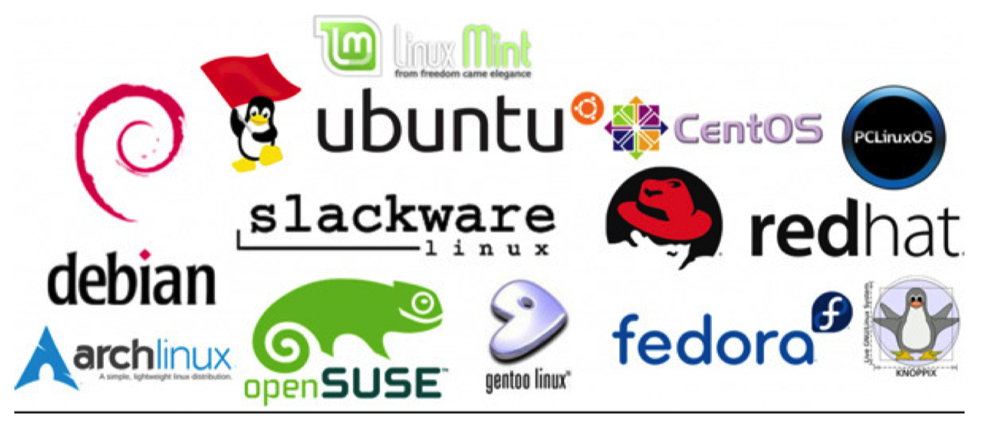

# Linux

## 1.规划

+ [视频教程](https://www.bilibili.com/video/BV187411y7hF)
+ 书籍教程<<鸟哥的Linux私房菜>>

## 2.入门概述

> 为什么学习Linux

linux诞生了这么多年，以前还喊着如何能取代windows系统，现在这个口号已经小多了，任何事物发展 都有其局限性都有其天花板。就如同在国内再搞一个社交软件取代腾讯一样，想想而已基本不可能，因 为用户已经习惯于使用微信交流，不是说技术上实现不了解而是老百姓已经习惯了，想让他们不用，即 使他们自己不用亲戚朋友还是要用，没有办法的事情。

用习惯了windows操作系统，再让大家切换到别的操作系统基本上是不可能的事情，改变一个人已经养 成的习惯太难。没有办法深入到普通老百姓的生活中，并不意味着linux就没有用武之地了。在服务器 端，在开发领域linux倒是越来越受欢迎，很多程序员都觉得不懂点linux都觉得不好意思，linux在开源 社区的地位依然岿然不动。

尤其是作为一个后端程序员，是必须要掌握Linux的，因为这都成为了你找工作的基础门槛了，所以不得 不学习！

> Linux简介

Linux 内核最初只是由芬兰人林纳斯·托瓦兹（Linus Torvalds）在赫尔辛基大学上学时出于个人爱好而 编写的。

Linux 是一套免费使用和自由传播的类 Unix 操作系统，是一个基于 POSIX（可移植操作系统接口） 和 UNIX 的多用户、多任务、支持多线程和多 CPU 的操作系统。

Linux 能运行主要的 UNIX 工具软件、应用程序和网络协议。它支持 32 位和 64 位硬件。Linux 继承了 Unix 以网络为核心的设计思想，是一个性能稳定的多用户网络操作系统。 

> Linux发行版

Linux 的发行版说简单点就是将 Linux 内核与应用软件做一个打包。

目前市面上较知名的发行版有：Ubuntu、RedHat、CentOS、Debian、Fedora、SuSE、OpenSUSE、 Arch Linux、SolusOS 等。

> Linux 应用领域

今天各种场合都有使用各种 Linux 发行版，从嵌入式设备到超级计算机，并且在服务器领域确定了地 位，通常服务器使用 LAMP（Linux + Apache + MySQL + PHP）或 LNMP（Linux + Nginx+ MySQL +

PHP）组合。

目前 Linux 不仅在家庭与企业中使用，并且在政府中也很受欢迎。

巴西联邦政府由于支持 Linux 而世界闻名。 有新闻报道俄罗斯军队自己制造的 Linux 发布版的，做为 G.H.ost 项目已经取得成果。 印度的 Kerala 联邦计划在向全联邦的高中推广使用 Linux。 中华人民共和国为取得技术独立，在龙芯处理器中排他性地使用 Linux。 在西班牙的一些地区开发了自己的 Linux 发布版，并且在政府与教育领域广泛使用，如 Extremadura 地区的 gnuLinEx 和 Andalusia 地区的 Guadalinex。 葡萄牙同样使用自己的 Linux 发布版 Caixa Mágica，用于 Magalh?es 笔记本电脑和 e-escola 政府 软件。 法国和德国同样开始逐步采用 Linux。

> Linux vs Windows

### 2.1 学习大纲

## 3.Linux基础部分

### 3.1 Linux安装vm和Centos

略https://www.bilibili.com/video/BV1Sv411r7vd?p=6

### 3.2 Linux网络连接三种模式

**桥接模式**

桥接模式就是将主机网卡与虚拟机虚拟的网卡利用虚拟网桥进行通信。在桥接的作用下，类似于把物理主机虚拟为一个交换机，所有桥接设置的虚拟机连接到这个交换机的一个接口上，物理主机也同样插在这个交换机当中，所以所有桥接下的网卡与网卡都是交换模式的，相互可以访问而不干扰。在桥接模式下，虚拟机ip地址需要与主机在同一个网段，如果需要联网，则网关与DNS需要与主机网卡一致。

**NAT模式**

在NAT模式中，主机网卡直接与虚拟NAT设备相连，然后虚拟NAT设备与虚拟DHCP服务器一起连接在虚拟交换机上，这样就实现了虚拟机联网。

**主机模式**

Host-Only模式其实就是NAT模式去除了虚拟NAT设备，然后使用VMware Network Adapter VMnet1（主机网卡）虚拟网卡连接VMnet1（虚拟机网卡）虚拟交换机来与虚拟机通信的，Host-Only模式将虚拟机与外网隔开，使得虚拟机成为一个独立的系统，只与主机相互通讯。

### 3.3虚拟机快照和克隆,VMTools

略

### 3.4 设置文件共享挂载

vm设置共享文件夹

### 3.5 Linux目录结构

 linux 的文件系统是采用级层式的树状目录结构，在此结构中的最上层是根目录“/”，然后在此目录下再创建其他的 目录。 

| 文件夹      | 英文全称                               | 文件夹作用                                                   |
| ----------- | -------------------------------------- | ------------------------------------------------------------ |
| ==/bin==    | Binaries                               | 存放系统命令的目录，所有用户都可以执行。                     |
| /sbin       | Super User Binaries                    | 保存和系统环境设置相关的命令，只有超级用户可以使用这些命令，有些命令可以允许普通用户查看 |
| ==/usr==    | Unix Shared Resources                  | Unix共享资源目录，存放所有命令、库、手册页等                 |
| /usr/bin    | Unix Shared Resources Binaries         | 存放系统命令的目录，所有用户可以执行。这些命令和系统启动无关，单用户模式下不能执行 |
| /usr/sbin   | Superuser Binaries                     | 存放根文件系统不必要的系统管理命令，超级用户可执行           |
| /dev        | Devices                                | 存放设备文件                                                 |
| ==/etc==    | Editable Text Configuration Chest      | 存放配置文件的地方,配置文件的目录                            |
| /opt        | Optional Application Software Packages | 可选应用软件包，第三方安装的软件保存位置                     |
| /lib        | Library                                | 存放系统程序运行所需的共享库                                 |
| /proc       | Processes                              | 虚拟文件系统，数据保存在内存中，存放当前进程信息             |
| ==/root==   | Root                                   | 存放root用户的相关文件,root用户的家目录。宿主目录 超级用户   |
| /tmp        | Temporary                              | 存放临时文件                                                 |
| ==/var==    | Variable                               | 是储存各种变化的文件，比如log等等                            |
| ==/home==   | Home                                   | 用户缺省宿主目录                                             |
| /lost+found | Lost And Found                         | 存放一些系统出错的检查结果                                   |
| /srv        | Server                                 | 服务数据目录                                                 |
| ==/mnt==    | Mount                                  | 挂载目录。临时文件系统的安装点，默认挂载光驱和软驱的目录     |
| ==/media==  | Media                                  | 挂载目录。 挂载媒体设备，如软盘和光盘                        |
| /misc       | Miscellaneous Device                   | 挂载目录。 挂载NFS服务                                       |

**在Linux里，一切都是文件**

## 4.实际操作篇

## 5.高级篇

## 6.Shell编程
