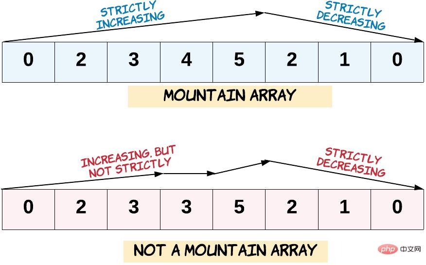

# 二分

分析题意，挖掘题目中隐含的 单调性；

+ while (left < right) 退出循环的时候有 left == right 成立，因此无需考虑返回 left 还是 right；

+ 始终思考下一轮搜索区间是什么，如果是 [mid, right] 就对应 left = mid ，如果是 [left, mid - 1] 就对应 right = mid - 1，是保留 mid 还是 +1+1、-1−1 就在这样的思考中完成；

+ **从一个元素什么时候不是解**开始考虑下一轮搜索区间是什么 ，把区间分为 2 个部分（一个部分肯定不存在目标元素，另一个部分有可能存在目标元素），问题会变得简单很多，这是一条 **非常有用** 的经验；

+ 每一轮区间被划分成 2 部分，理解 **区间划分** 决定中间数取法（ 无需记忆，需要练习 + 理解 ），在调试的过程中理解 区间和中间数划分的配对关系：

  + 划分` [left, mid] `与 `[mid + 1, right]` ，mid 被分到左边，对应 `int mid = left + (right - left) / 2`;；

  + 划分` [left, mid - 1] `与 `[mid, right] `，mid 被分到右边，对应 `int mid = left + (right - left + 1) / 2`;。

    ```
    至于为什么划分是这种对应关系，原因在于区间只有 2 个数的时候，如果中间数的取法不对，一旦进入的分支不能使得区间缩小，会出现 死循环。暂时不理解问题不大，需要在练习中进行调试；
    ```

退出循环的时候有` left == right `成立，此时如果能确定问题一定有解，返回 left 即可，如果不能确定，需要单独判断一次。


##二分查找的两种思路（请特别留意第 2 种思路，掌握它能思路清晰地解决「力扣」上的所有二分查找问题）

### 思路 1：在循环体内部查找元素

`while(left <= right)` 这种写法表示在循环体内部直接查找元素；
退出循环的时候 left 和 right 不重合，区间 [left, right] 是空区间。

### 思路 2：在循环体内部排除元素（重点）

`while(left < right)` 这种写法表示在循环体内部排除元素；
退出循环的时候 left 和 right 重合，区间 [left, right] 只剩下成 1 个元素，这个元素 有可能 就是我们要找的元素。


关于取中位数，基于此题解，我记忆的口诀是「左动取左，右动取右」，即 `if (...) left = mid + 1;` 归为「左动」，对应左中位数；`if (...) right = mid - 1;` 归为「右动」，对应右中位数。


### 为什么总是写不对「二分查找」

我的经验是把区间定义成为：**左闭右闭区间，两个变量向中间走**，定义的左右边界理应是无差别的，定义成`左闭右开，反而增加了解决问题的的复杂程度`，因为还要去考虑右边界是否能够取到，即使定义成左闭右开区间 [left, right) 也一定对应一个等价的左闭右闭区间 [left, right - 1]；


## 整数二分

==练习==

[数的范围](https://www.acwing.com/problem/content/791/)

## 浮点数二分

==练习==

[790. 数的三次方根](https://www.acwing.com/problem/content/792/)

## 在数组中查找符合条件的元素的下标

### 部分有序数组的二分查找（旋转数组）

待搜索区间头和尾的元素是位置特殊的元素。有两个比较自然的思路是：

思路 1：看看当前搜索区间的 **`左边界`** 和「中间数」（注意这里不是中位数），是不是可以缩小搜索区间的范围；
思路 2：看看当前搜索区间的 **`右边界`** 和「中间数」（注意这里不是中位数），是不是可以缩小搜索区间的范围；


[153. 寻找旋转排序数组中的最小值](https://leetcode-cn.com/problems/find-minimum-in-rotated-sorted-array/)

[154. 寻找旋转排序数组中的最小值 II](https://leetcode-cn.com/problems/find-minimum-in-rotated-sorted-array-ii/)

[33. 搜索旋转排序数组](https://leetcode-cn.com/problems/search-in-rotated-sorted-array/)

[81. 搜索旋转排序数组 II](https://leetcode-cn.com/problems/search-in-rotated-sorted-array-ii/)



[852. 山脉数组的峰顶索引](https://leetcode-cn.com/problems/peak-index-in-a-mountain-array/)

[1095. 山脉数组中查找目标值](https://leetcode-cn.com/problems/find-in-mountain-array/)

## 在一个有范围的区间里搜索一个整数

[69. 平方根（简单）](https://leetcode-cn.com/problems/sqrtx/)

略

## 衍生:复杂的二分查找问题.极大化极小

**目标变量和另一个变量有相关关系（一般而言是线性关系），目标变量的性质不好推测，但是另一个变量的性质相对容易推测（满足某种意义上的单调性）**

这类问题通常称为**「极大极小化」**问题

解题的思路是这样的：

+ 分析出题目要我们找一个整数，这个整数有范围，所以可以用二分查找；
+ 分析出**单调性**，一般来说是一个变量 a 的值大了，另一个变量 b 的值就变小，而「另一个变量的值」 b 有限制，因此可以通过调整 a 的值达到控制 b 的效果；
+ 这一类问题的题目条件一定会给出**连续、正整数** 这样的关键字，如果没有，问题场景也一定蕴含了这两个关键信息。

[875. 爱吃香蕉的珂珂](https://leetcode-cn.com/problems/koko-eating-bananas/)

分析题目呢我们可以发现，H已经固定了，我们使用一个二分搜索，搜索的下界是1，上界是香蕉堆中的最大值，mid就是我们猜测的数字

分析：

+ 珂珂吃香蕉的速度越小，耗时越多。反之，速度越大，耗时越少，这是这个问题的单调性；
+ 搜索的是速度。因为题目限制了珂珂一个小时之内只能选择一堆香蕉吃，因此速度最大值就是这几堆香蕉中，数量最多的那一堆。速度的最小值是 1，其实还可以再分析一下下界是多少，由于二分搜索的时间复杂度很低，严格的分析不是很有必要；
+ 还是因为珂珂一个小时之内只能选择一堆香蕉吃，因此：每堆香蕉吃完的耗时 = 这堆香蕉的数量 / 珂珂一小时吃香蕉的数量，这里的 / 在不能整除的时候，需要 上取整。

```go
func minEatingSpeed(piles []int, H int) int {
	lo, hi := 1, piles[0]
	for _, pile := range piles {
		if hi < pile {
			hi = pile
		}
	}
	for lo < hi {
		mid := (lo + hi) / 2
		h := calNum(piles, mid)
		if h <= H {
			hi = mid
		} else {
			lo = mid + 1
		}
	}

	return lo
}

// K是每小时吃多少个
func calNum(piles []int, K int) (h int) {
	for _, pile := range piles {

		h += int(math.Ceil(float64(pile) / float64(K)))
	}
	return
}
```

进阶:

[410. 分割数组的最大值](https://leetcode-cn.com/problems/split-array-largest-sum/)

## 模板

虽然我觉得没什么用。。。

==整数二分==

```c++
bool check(int x) {/* ... */} // 检查x是否满足某种性质

// 区间[l, r]被划分成[l, mid]和[mid + 1, r]时使用：
int bsearch_1(int l, int r)
{
    while (l < r)
    {
        int mid = l + r >> 1;
        if (check(mid)) r = mid;    // check()判断mid是否满足性质
        else l = mid + 1;
    }
    return l;
}
// 区间[l, r]被划分成[l, mid - 1]和[mid, r]时使用：
int bsearch_2(int l, int r)
{
    while (l < r)
    {
        int mid = l + r + 1 >> 1;
        if (check(mid)) l = mid;
        else r = mid - 1;
    }
    return l;
}
```

==浮点数二分==

```c++
bool check(double x) {/* ... */} // 检查x是否满足某种性质

double bsearch_3(double l, double r)
{
    const double eps = 1e-6;   // eps 表示精度，取决于题目对精度的要求
    while (r - l > eps)
    {
        double mid = (l + r) / 2;
        if (check(mid)) r = mid;
        else l = mid;
    }
    return l;
}
```

==二分查找变种==

```java
// 查找第一个值等于给定值的元素
private int firstEquals(int[] arr, int target) {
    int l = 0, r = arr.length - 1;
    while (l < r) {
        int mid = l + ((r - l) >> 1);
        if (arr[mid] < target) l = mid + 1;
        else r = mid; // 收缩右边界不影响 first equals
    }
    if (arr[l] == target && (l == 0 || arr[l - 1] < target)) return l;
    return -1;
}
// 查找最后一个值等于给定值的元素
private int lastEquals(int[] arr, int target) {
    int l = 0, r = arr.length - 1;
    while (l < r) {
        int mid = l + ((r - l + 1) >> 1);
        if (arr[mid] > target) r = mid - 1;
        else l = mid; // 收缩左边界不影响 last equals
    }
    if (arr[l] == target && (l == arr.length - 1 || arr[l + 1] > target)) return l;
    return -1;
}
// 查找第一个大于等于给定值的元素
private int firstLargeOrEquals(int[] arr, int target) {
    int l = 0, r = arr.length - 1;
    while (l < r) {
        int mid = l + ((r - l) >> 1);
        if (arr[mid] < target) l = mid + 1;
        else r = mid; // 收缩右边界不影响 first equals
    }
    if (arr[l] >= target && (l == 0 || arr[l - 1] < target)) return l; // >=
    return -1;
}
// 查找最后一个小于等于给定值的元素
private int lastLessOrEquals(int[] arr, int target) {
    int l = 0, r = arr.length - 1;
    while (l < r) {
        int mid = l + ((r - l + 1) >> 1);
        if (arr[mid] > target) r = mid - 1;
        else l = mid; // 收缩左边界不影响 last equals
    }
    if (arr[l] <= target && (l == arr.length - 1 || arr[l + 1] > target)) return l; // <=
    return -1;
}
```

