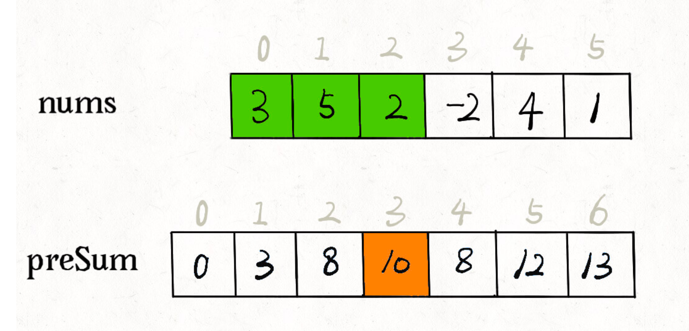
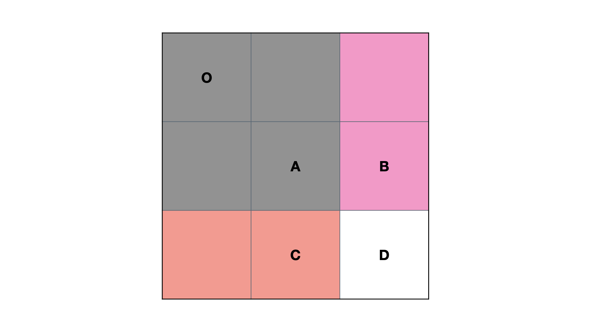

# 前缀和与差分

## 一维前缀和

### 原理

先通过nums构建出前缀和数组，如上图所示，如果我想求[1,4]内的所有元素之和，就可以通过preSum[5]-preSum[1]
前缀和主要的适用场景就原数组不会被修改的情况下，频繁查询某个区间的累加和

> S[i] = a[1] + a[2] + ... a[i]
> a[l] + ... + a[r] = S[r] - S[l - 1]

[AcWing 795. 前缀和](https://www.acwing.com/problem/content/797/)

[303. 区域和检索 - 数组不可变](https://leetcode-cn.com/problems/range-sum-query-immutable/)

前缀和结合哈希表:[560. 和为K的子数组](https://leetcode-cn.com/problems/subarray-sum-equals-k/)

## 二维前缀和

*S*(*O*,*D*)=*S*(*O*,*C*)+*S*(*O*,*B*)−*S*(*O*,*A*)+*D*

> S[i, j] = 第i行j列格子左上部分所有元素的和
> 以(x1, y1)为左上角，(x2, y2)为右下角的子矩阵的和为：
> S[x2, y2] - S[x1 - 1, y2] - S[x2, y1 - 1] + S[x1 - 1, y1 - 1]

[AcWing 796. 子矩阵的和](https://www.acwing.com/problem/content/798/)

## 一维差分

> 给区间[l, r]中的每个数加上c：B[l] += c, B[r + 1] -= c

> 如果有一数列 a[1],a[2],.…a[n]
> 且令 b[i]=a[i]-a[i-1],b[1]=a[1]
>
> 那么就有
> a[i]=b[1]+b[2]+.…+b[i]
>     =a[1]+a[2]-a[1]+a[3]-a[2]+.…+a[i]-a[i-1]
> 此时b数组称作a数组的差分数组
> 换句话来说a数组就是b数组的前缀和数组  例：
>      原始数组a：9  3  6  2  6  8
>      差分数组b：9 -6  3 -4  4  2
>      可以看到a数组是b的前缀和

[797. 差分](https://www.acwing.com/problem/content/799/)

https://www.acwing.com/problem/content/description/102/

https://www.acwing.com/problem/content/103/

## 二维差分

> 给以(x1, y1)为左上角，(x2, y2)为右下角的子矩阵中的所有元素加上c：
> S[x1, y1] += c, S[x2 + 1, y1] -= c, S[x1, y2 + 1] -= c, S[x2 + 1, y2 + 1] += c

[798. 差分矩阵](https://www.acwing.com/problem/content/800/)
