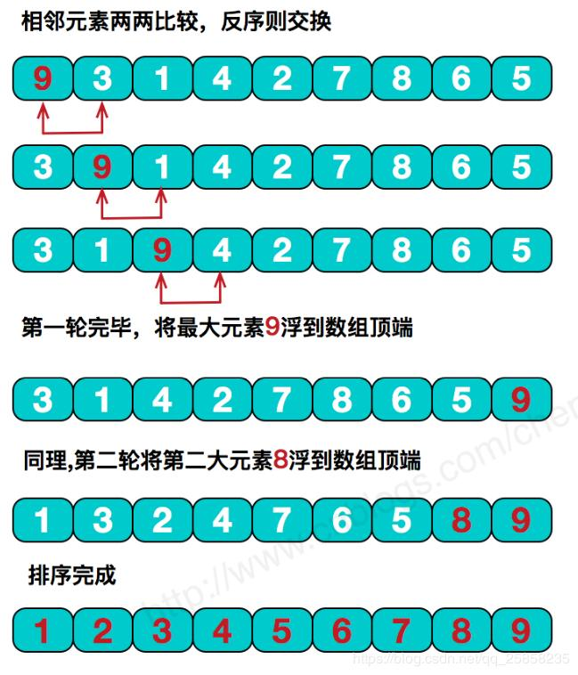
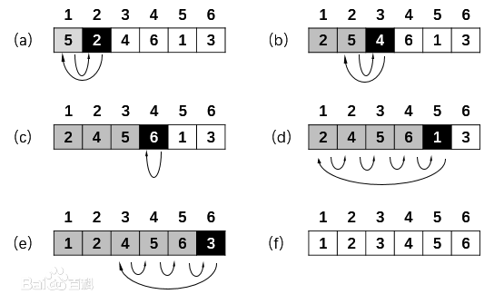
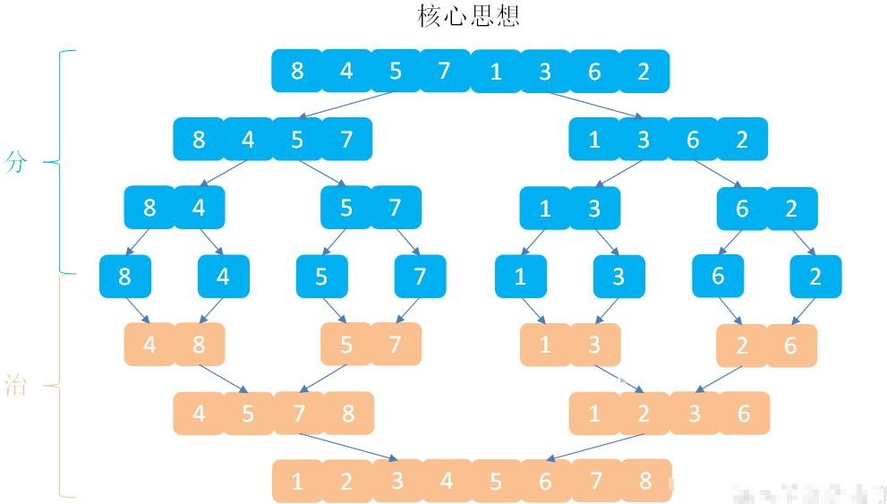
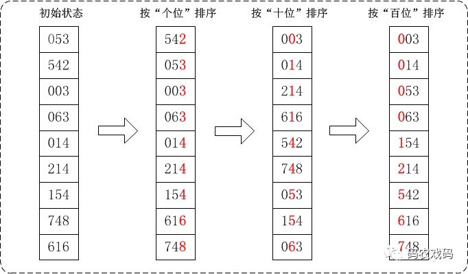

# 排序

## 稳定的排序

+ 冒泡排序（bubble sort）- $O（n^2）$
+ 插入排序（insertion sort）- $O(n^2)$
+ 桶排序（bucket sort） - $O(n)$;需要$O(k)$额外空间
+ 计数排序（counting sort）- $O(n+k)$
+ 归并排序（merge sort）- $O(n\log(n))$;需要$O(n)$额外空间
+ 基数排序（radix sort）- $O(nk)$;需要$O(n)$额外空间

## 不稳定的排序

+ 选择排序（selection sort）- $O(n^2)$
+ 希尔排序（shell sort）- $O(n\log^2(n))$
+ 堆排序（heap sort）- $O(n\log(n))$
+ 快速排序（quick sort）- $O(n\log(n))$;需要$O(\log(n))$额外空间

-----

**重点掌握**:==快速排序==、==归并排序==、==堆排序==

**重点理解**:==堆排序==、==桶排序==、==计数排序==

----

快速验证排序正确:

https://leetcode-cn.com/problems/sort-an-array/

# 冒泡排序

## 原理

它重复地走访过要排序的元素列，依次比较两个相邻的元素元素，如果顺序（如从大到小、首字母从Z到A）错误就把他们交换过来。走访元素的工作是重复地进行直到没有相邻元素需要交换，也就是说该元素列已经排序完成。



```go
func BubbleSort(nums []int) []int {
	flag := true
	n := len(nums)

	for i := 0; i < n-1; i++ {
		flag = true
		for j := 0; j < n-i-1; j++ {
			if nums[j] > nums[j+1] {
				nums[j], nums[j+1] = nums[j+1], nums[j]
				flag = false
			}
		}
		if flag {
			break
		}
	}
	return nums
}
```

# 插入排序

## 原理

插入排序，一般也被称为直接插入排序。对于少量元素的排序，它是一个有效的算法 。插入排序是一种最简单的排序方法，它的基本思想是将一个记录插入到已经排好序的有序表中，从而一个新的、记录数增1的有序表。在其实现过程使用双层循环，外层循环对除了第一个元素之外的所有元素，内层循环对当前元素前面有序表进行待插入位置查找，并进行移动



```go
func InsertionSort(nums []int) []int {
	n := len(nums)
	for i := 1; i < n; i++ {
		key := nums[i]
		j := i - 1
		for ; j >= 0 && nums[j] > key; j-- {
			nums[j+1] = nums[j]
		}
		nums[j+1] = key
	}
	return nums
}
```

# 桶排序

## 原理

**桶排序 (Bucket sort)**或所谓的**箱排序**，是一个排序算法，工作的原理是将数组分到有限数量的桶子里。每个桶子再个别排序（有可能再使用别的排序算法或是以递归方式继续使用桶排序进行排序）


```go
func BucketSort(nums []int) []int {
	if len(nums) <= 1 {
		return nums
	}
	min, max := nums[0], nums[0]
	for _, num := range nums {
		min = minInt(min, num)
		max = maxInt(max, num)
	}
	// 桶的间距。(防止出现[1,1])的情况
	d := maxInt(1, (max-min)/(len(nums)-1))
	// 桶的个数
	bucketSize := (max-min)/d + 1
	// 桶
	buckets := make([][]int, bucketSize)
	for _, num := range nums {
		buckets[(num-min)/d] = append(buckets[(num-min)/d], num)
	}

	// 每个桶排序
	for _, bucket := range buckets {
		// 这里可以用计数排序
		bucket = bucketCountingSort(bucket)
	}

	ans := make([]int, 0, len(nums))
	for _, bucket := range buckets {
		ans = append(ans, bucket...)
	}
	return ans
}

func bucketCountingSort(nums []int) []int {
	if len(nums) <= 1 {
		return nums
	}
	min, max := nums[0], nums[0]
	for _, num := range nums {
		min = minInt(min, num)
		max = maxInt(max, num)
	}

	count := make([]int, max-min+1)
	for _, num := range nums {
		count[num-min]++
	}

	for i := 1; i < len(count); i++ {
		count[i] += count[i-1]
	}

	ans := make([]int, len(nums))
	for i := len(nums) - 1; i >= 0; i-- {
		ans[count[nums[i]-min]-1] = nums[i]
		count[nums[i]-min]--
	}
	return ans
}
```

## 练习题

[164. 最大间距](https://leetcode-cn.com/problems/maximum-gap/)

# 计数排序

## 原理

计数排序是一个非基于比较的排序算法，该算法于1954年由 Harold H. Seward 提出。它的优势在于在对一定范围内的整数排序时，它的复杂度为Ο(n+k)（其中k是整数的范围），快于任何比较排序算法。  当然这是一种牺牲空间换取时间的做法，而且当O(k)>O(n*log(n))的时候其效率反而不如基于比较的排序（基于比较的排序的时间复杂度在理论上的下限是O(n*log(n)), 如归并排序，堆排序）


```go
func CountingSort(nums []int) []int {
	n := len(nums)
	if n <= 1 {
		return nums
	}
	// 统计最大值和最小值
	min, max := math.MaxInt32, math.MinInt32
	for _, num := range nums {
		min = minInt(min, num)
		max = maxInt(max, num)
	}

	// 统计变形
	count := make([]int, max-min+1)
	for _, num := range nums {
		count[num-min]++
	}
	for i := 1; i < len(count); i++ {
		count[i] += count[i-1]
	}

	// 填充结果数组
	res := make([]int, n)
	for _, num := range nums {
		res[count[num-min]-1] = num
		count[num-min]--
	}
	return res
}

func minInt(a, b int) int {
	if a < b {
		return a
	}
	return b
}

func maxInt(a, b int) int {
	if a > b {
		return a
	}
	return b
}
```

## 练习题

[1051. 高度检查器](https://leetcode-cn.com/problems/height-checker/)

[274. H 指数](https://leetcode-cn.com/problems/h-index/)

# 归并排序

## 原理

**归并排序**（Merge Sort）是建立在归并操作上的一种有效，稳定的排序算法，该算法是采用分治法（Divide and Conquer）的一个非常典型的应用。将已有序的子序列合并，得到完全有序的序列；即先使每个子序列有序，再使子序列段间有序。若将两个有序表合并成一个有序表，称为二路归并。



```go

func MergeSort(nums []int) []int {
	if len(nums) <= 1 {
		return nums
	}
	mid := len(nums) / 2
	left := MergeSort(nums[:mid])
	right := MergeSort(nums[mid:])
	return merge(left, right)
}

func merge(nums1, nums2 []int) []int {
	ans := make([]int, 0, len(nums1)+len(nums2))
	i, j := 0, 0

	for i < len(nums1) && j < len(nums2) {
		if nums1[i] < nums2[j] {
			ans = append(ans, nums1[i])
			i++
		} else {
			ans = append(ans, nums2[j])
			j++
		}
	}

	if i < len(nums1) {
		ans = append(ans, nums1[i:]...)
	}
	if j < len(nums2) {
		ans = append(ans, nums2[j:]...)
	}

	return ans
}
```

## 练习

[493. 翻转对](https://leetcode-cn.com/problems/reverse-pairs/)

[787. 归并排序](https://www.acwing.com/problem/content/789/)

# 基数排序

## 原理

基数排序（radix sort）属于“分配式排序”（distribution sort），又称“桶子法”（bucket sort）或bin sort，顾名思义，它是透过键值的部份资讯，将要排序的元素分配至某些“桶”中，藉以达到排序的作用，基数排序法是属于稳定性的排序



```go
func RadixSort(nums []int) []int {
	//分为正数和负数,对于负数,变成正数最后reverse
	negative := make([]int, 0)
	nonNegative := make([]int, 0)
	for _, num := range nums {
		if num < 0 {
			negative = append(negative, -num)
		} else {
			nonNegative = append(nonNegative, num)
		}
	}
	negative = radixSort(negative)
	i, j := 0, len(negative)-1
	for i < j {
		negative[i], negative[j] = -negative[j], -negative[i]
		i++
		j--
	}
	negative = append(negative, radixSort(nonNegative)...)
	return negative
}

func radixSort(nums []int) []int {
	if len(nums) <= 1 {
		return nums
	}
	maxNum := maxElem(nums)
	radix := 1
	for ; maxNum/radix > 0; radix *= 10 {
		nums = countSort(nums, radix)
	}
	return nums
}

func maxElem(nums []int) int {
	max := nums[0]
	for _, num := range nums {
		if num > max {
			max = num
		}
	}
	return max
}

// 具体的排序使用计数排序
func countSort(nums []int, radix int) []int {
	count := make([]int, 10)
	for _, num := range nums {
		count[(num/radix)%10]++
	}
	for i := 1; i < 10; i++ {
		count[i] += count[i-1]
	}

	ans := make([]int, len(nums))
	for i := len(nums) - 1; i >= 0; i-- {
		num := nums[i]
		ans[count[(num/radix)%10]-1] = num
		count[(num/radix)%10]--
	}

	return ans
}
```


# 选择排序

## 原理

第一次从待排序的数据元素中选出最小（或最大）的一个元素，存放在序列的起始位置，然后再从剩余的未排序元素中寻找到最小（大）元素，然后放到已排序的序列的末尾。以此类推，直到全部待排序的数据元素的个数为零。选择排序是不稳定的排序方法。


```go
func SelectionSort(nums []int) []int {
	n := len(nums)
	var minIndex int

	for i := 0; i < n; i++ {
		minIndex = i
		for j := i + 1; j < n; j++ {
			if nums[j] < nums[minIndex] {
				minIndex = j
			}
		}
		nums[i], nums[minIndex] = nums[minIndex], nums[i]
	}

	return nums
}

```

# 希尔排序


# 堆排序


# 快速排序

## 原理

Step1:确定边界点。 左边界、中间值、右边界、随机值

Step2:调整区间。划分区间。第一个区间的数小于等于x，第二个区间的数大于等于x。

Step3:递归的处理左右两边。

一个可以更清晰的理解的图片例子:


```go
func quickSort(nums []int, low, high int) {
	if low >= high {
		return
	}

	pivot := partition(nums, low, high)
	quickSort(nums, low, pivot-1)
	quickSort(nums, pivot+1, high)
}

func partition(nums []int, low, high int) int {
	// 这里可以选择左边，右边，中间，随机
	pivot := rand.Intn(high - low + 1) +low
	nums[pivot], nums[high] = nums[high], nums[pivot]
	pivotNum := nums[high]

	i := low - 1
	for j := low; j < high; j++ {
		if nums[j] <= pivotNum {
			i++
			nums[i], nums[j] = nums[j], nums[i]
		}
	}
	nums[i+1], nums[high] = nums[high], nums[i+1]

	return i + 1
}
```

-----

在Go语言中更推荐这种快排

```go
func quickSort1(nums []int) []int {
	if len(nums) <= 1 {
		return nums
	}
	
	// 这里可以选择左边，右边，中间，随机
	pivot := rand.Intn(len(nums))
	pivotNum := nums[pivot]

	lowPart := make([]int, 0)
	middlePart := make([]int, 0)
	highPart := make([]int, 0)

	for _, num := range nums {
		if num < pivotNum {
			lowPart = append(lowPart, num)
		}
		if num == pivotNum {
			middlePart = append(middlePart, num)
		}
		if num > pivotNum {
			highPart = append(highPart, num)
		}
	}

	lowPart = quickSort1(lowPart)
	highPart = quickSort1(highPart)

	lowPart = append(lowPart, middlePart...)
	lowPart = append(lowPart, highPart...)

	return lowPart
}
```

这种适合有非常多的`相同数字`情况下

## 练习题

[785. 快速排序](https://www.acwing.com/problem/content/787/)

[786. 第k个数](https://www.acwing.com/problem/content/788/)

