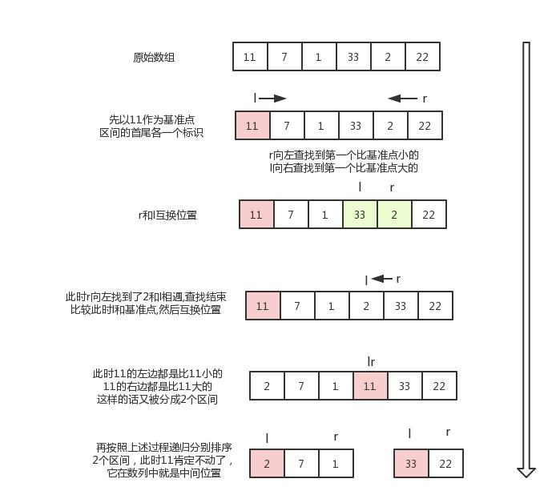

# 排序

## 稳定的排序

+ 冒泡排序（bubble sort）- $O（n^2）$
+ 插入排序（insertion sort）- $O(n^2)$
+ 桶排序（bucket sort） - $O(n)$;需要$O(k)$额外空间
+ 计数排序（counting sort）- $O(n+k)$
+ 归并排序（merge sort）- $O(n\log(n))$;需要$O(n)$额外空间
+ 基数排序（radix sort）- $O(nk)$;需要$O(n)$额外空间

## 不稳定的排序

+ 选择排序（selection sort）- $O(n^2)$
+ 希尔排序（shell sort）- $O(n\log^2(n))$
+ 堆排序（heap sort）- $O(n\log(n))$
+ 快速排序（quick sort）- $O(n\log(n))$

-----

**重点掌握**:==快速排序==、==归并排序==

**重点理解**:==堆排序==、==桶排序==

----

快速验证排序正确:

https://leetcode-cn.com/problems/sort-an-array/

# 冒泡排序


# 插入排序


# 桶排序


# 计数排序


# 归并排序


# 基数排序


# 选择排序

## 原理

第一次从待排序的数据元素中选出最小（或最大）的一个元素，存放在序列的起始位置，然后再从剩余的未排序元素中寻找到最小（大）元素，然后放到已排序的序列的末尾。以此类推，直到全部待排序的数据元素的个数为零。选择排序是不稳定的排序方法。


# 希尔排序


# 堆排序


# 快速排序

## 原理

Step1:确定边界点。 左边界、中间值、右边界、随机值

Step2:调整区间。划分区间。第一个区间的数小于等于x，第二个区间的数大于等于x。

Step3:递归的处理左右两边。

一个可以更清晰的理解的图片例子:



```go
func quickSort(nums []int, low, high int) {
	if low >= high {
		return
	}

	pivot := partition(nums, low, high)
	quickSort(nums, low, pivot-1)
	quickSort(nums, pivot+1, high)
}

func partition(nums []int, low, high int) int {
	// 这里可以选择左边，右边，中间，随机
	pivot := rand.Intn(high - low + 1) +low
	nums[pivot], nums[high] = nums[high], nums[pivot]
	pivotNum := nums[high]

	i := low - 1
	for j := low; j < high; j++ {
		if nums[j] <= pivotNum {
			i++
			nums[i], nums[j] = nums[j], nums[i]
		}
	}
	nums[i+1], nums[high] = nums[high], nums[i+1]

	return i + 1
}
```

-----

在Go语言中更推荐这种快排

```go
func quickSort1(nums []int) []int {
	if len(nums) <= 1 {
		return nums
	}
	
	// 这里可以选择左边，右边，中间，随机
	pivot := rand.Intn(len(nums))
	pivotNum := nums[pivot]

	lowPart := make([]int, 0)
	middlePart := make([]int, 0)
	highPart := make([]int, 0)

	for _, num := range nums {
		if num < pivotNum {
			lowPart = append(lowPart, num)
		}
		if num == pivotNum {
			middlePart = append(middlePart, num)
		}
		if num > pivotNum {
			highPart = append(highPart, num)
		}
	}

	lowPart = quickSort1(lowPart)
	highPart = quickSort1(highPart)

	lowPart = append(lowPart, middlePart...)
	lowPart = append(lowPart, highPart...)

	return lowPart
}
```

这种适合有非常多的`相同数字`情况下

## 练习题

[785. 快速排序](https://www.acwing.com/problem/content/787/)

[786. 第k个数](https://www.acwing.com/problem/content/788/)

