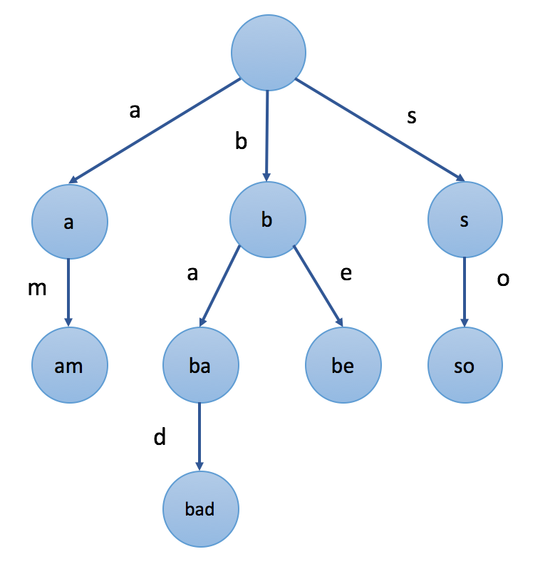

# Trie

`前缀树` 是 N叉树 的一种特殊形式。通常来说，一个前缀树是用来 `存储字符串` 的。前缀树的每一个节点代表一个 `字符串`（前缀）。每一个节点会有多个子节点，通往不同子节点的路径上有着不同的字符。子节点代表的字符串是由节点本身的 原始字符串 ，以及 通往该子节点路径上所有的字符 组成的。



值得注意的是，根节点表示 `空字符串`

前缀树的一个重要的特性是，节点所有的后代都与该节点相关的字符串有着共同的前缀。这就是 `前缀树` 名称的由来。

## 如何表示一颗前缀树

### 方法一 - 数组

第一种方法是用 `数组` 存储子节点。

例如，如果我们只存储含有字母 a 到 z 的字符串，我们可以在每个节点中声明一个大小为 26 的数组来存储其子节点。对于特定字符 c ，我们可以使用 c - 'a' 作为索引来查找数组中相应的子节点。

```go
type Trie struct{
  Child [26]*Trie
}
```

访问子节点十分 快捷 。访问一个特定的子节点比较 容易 ，因为在大多数情况下，我们很容易将一个字符转换为索引。但并非所有的子节点都需要这样的操作，所以这可能会导致 空间的浪费。

### 方法二 - Map


第二种方法是使用 `Hashmap` 来存储子节点。

```go
type Trie struct{
  Child map[byte]*Trie
}
```

## 前缀树的插入操作

当我们在二叉搜索树中插入目标值时，在每个节点中，我们都需要根据 `节点值` 和 `目标值` 之间的关系，来确定目标值需要去往哪个子节点。同样地，当我们向前缀树中插入一个目标值时，我们也需要根据插入的 `目标值` 来决定我们的路径。

```go
1. Initialize: cur = root
2. for each char c in target string S:
3. 		if cur does not have a child c:
4.			cur.children[c] = new Trie node
5.		cur = cur.children[c]
6. cur is the node which represents the string S
```

## 前缀树的删除操作

正如我们在前缀树的简介中提到的，所有节点的后代都与该节点相对应字符串的有着共同前缀。因此，很容易搜索以特定前缀开头的任何单词。

同样地，我们可以根据给定的前缀沿着树形结构搜索下去。一旦我们找不到我们想要的子节点，搜索就以失败终止。否则，搜索成功。

```go
1. Initialize: cur = root
2. for each char c in target string S:
3. 		if cur does not have a child c:
4.			search fails
5.		cur = cur.children[c]
6. search successes
```

## 基本操作

[一个字典树的基本实现](https://github.com/Yefangbiao/study-co/tree/main/03_algorithm/algorithm/2_data_structure/trie)

---

[208. 实现 Trie (前缀树)](https://leetcode-cn.com/problems/implement-trie-prefix-tree/)

[835. Trie字符串统计](https://www.acwing.com/problem/content/837/)

