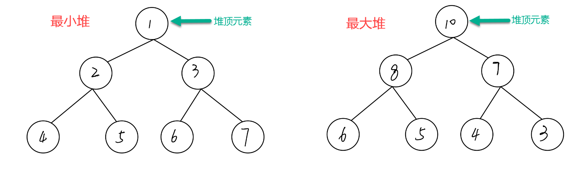

# 堆

 **优先队列** 是一种抽象的数据类型，而 **堆** 是一种数据结构。所以 **堆** 并不是 **优先队列** ， **堆** 是实现 **优先队列** 的一种方式。

实现 优先队列 的方式有很多种，比如数组和链表。但是，这些实现方式只能保证插入操作和删除操作中的一种操作可以在 O(1)O(1) 的时间复杂度内完成，而另外一个操作则需要在 O(N)O(N) 的时间复杂度内完成。而 堆 能够使 优先队列 的插入操作在 O(log N) 的时间复杂度内完成，删除操作在 O(log N) 的时间复杂度内完成。那么 堆 到底是什么呢？

**堆** 是一种特别的二叉树，满足以下条件的二叉树，可以称之为 **堆**：

1. 完全二叉树；
2. 每一个节点的值都必须 **大于等于或者小于等于** 其孩子节点的值。

**堆** 具有以下的特点：

1. 可以在 O(logN)*O*(*l**o**gN*) 的时间复杂度内向 **堆** 中插入元素；
2. 可以在 O(logN)*O*(*l**o**gN*) 的时间复杂度内向 **堆** 中删除元素；
3. 可以在 O(1) 的时间复杂度内获取 **堆** 中的最大值或最小值。

## 堆的分类

**堆** 有两种类型：**最大堆** 和 **最小堆**。

最大堆：堆中每一个节点的值 **都大于等于** 其孩子节点的值。所以最大堆的特性是 **堆顶元素（根节点）是堆中的最大值**。

最小堆：堆中每一个节点的值 **都小于等于** 其孩子节点的值。所以最小堆的特性是 **堆顶元素（根节点）是堆中的最小值**。

[一个大根堆的实现](https://github.com/Yefangbiao/study-co/tree/main/03_algorithm/algorithm/2_data_structure/heap)

## TopK问题

### 求TopK最大或最小元素/求第K个最大或者最小元素

**理论**：利用「堆」的数据结构获取 Top K 大的元素或者 Top K 小的元素。

**「Top K 大元素」解法步骤：**

1. 创建一个大小为 K 的「最小堆」；
2. 依次将元素添加到「最小堆」中；
3. 当「最小堆」的元素个数达到 K 时，将当前元素与堆顶元素进行对比：

> 如果当前元素小于堆顶元素，则放弃当前元素，继续进行下一个元素；
>
> 如果当前元素大于堆顶元素，则删除堆顶元素，将当前元素加入到「最小堆」中。

4. 重复步骤 2 和步骤 3，直到所有元素遍历完毕。
5. 此时「最小堆」中的 K 个元素就是前 K 个最大的元素。

**「Top K 小元素」解法步骤：**

1. 创建一个大小为 K 的「最大堆」；
2. 依次将元素添加到「最大堆」中；
3. 当「最大堆」的元素个数达到 K 时，将当前元素与堆顶元素进行对比：

> 如果当前元素大堆顶元素，则放弃当前元素，继续进行下一个元素；
>
> 如果当前元素小于堆顶元素，则删除堆顶元素，将当前元素加入到「最小堆」中。

4. 重复步骤 2 和步骤 3，直到所有元素遍历完毕。
5. 此时「最大堆」中的 K 个元素就是前 K 个最小的元素。

**时间复杂度：** O(NlogK)

**空间复杂度：**O(K)

## 练习

[剑指 Offer 40. 最小的k个数](https://leetcode-cn.com/problems/zui-xiao-de-kge-shu-lcof/)

[215. 数组中的第K个最大元素](https://leetcode-cn.com/problems/kth-largest-element-in-an-array/)

[347. 前 K 个高频元素](https://leetcode-cn.com/problems/top-k-frequent-elements/)

