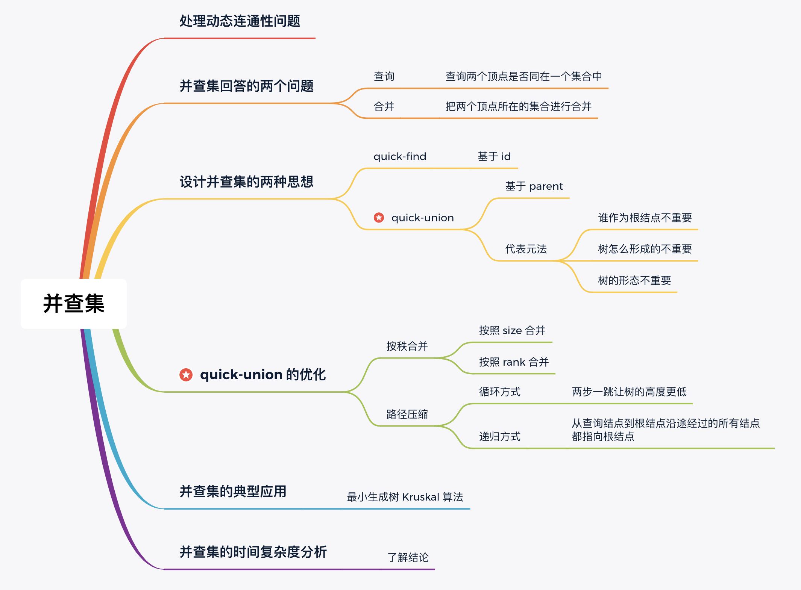

# 并查集

并查集（Union Find）也叫「不相交集合（Disjoint Set）」，专门用于 **动态处理** 不相交集合的「查询」与「合并」问题。

## 按秩合并

按「秩」合并的意思是：让树的「秩」较小的树的根结点，指向树的「秩」较大的树的根结点。

这里的「秩」有两种含义，分别用于不同的场景：

- 按 `size` 合并，用于需要维护每个连通分量结点个数的时候；
- 按 `rank` 合并，绝大多数时候。

### 按 `size` 合并

按 `size` 合并的意思是让树的「结点总数」较小的树的根结点，指向树的「结点总数」较大的树的根结点。

### 按 `rank` 合并

按 `rank` 合并的意思是让树的「高度」较小的树的根结点，指向树的「高度」较大的树的根结点。

## 路径压缩

**把沿途的每个节点的父节点都设为根节点**即可。

并查集的时间复杂度分析，其理论性较强，通常只需要知道结论即可。这里我们给出结论：

---

路径压缩和按秩合并如果一起使用，时间复杂度接近 O(n) ，但是很可能会破坏rank的准确性。

## 代码

[union-find代码](https://github.com/Yefangbiao/study-co/tree/main/03_algorithm/algorithm/2_data_structure/union-find)

## 练习

[990. 等式方程的可满足性](https://leetcode-cn.com/problems/satisfiability-of-equality-equations/)

[547. 省份数量](https://leetcode-cn.com/problems/number-of-provinces/)

[684. 冗余连接](https://leetcode-cn.com/problems/redundant-connection/)

[1319. 连通网络的操作次数](https://leetcode-cn.com/problems/number-of-operations-to-make-network-connected/)

[765. 情侣牵手](https://leetcode-cn.com/problems/couples-holding-hands/)

[803. 打砖块](https://leetcode-cn.com/problems/bricks-falling-when-hit/)

## 阅读参考

https://zhuanlan.zhihu.com/p/93647900

https://leetcode-cn.com/circle/discuss/3dPiT7/
