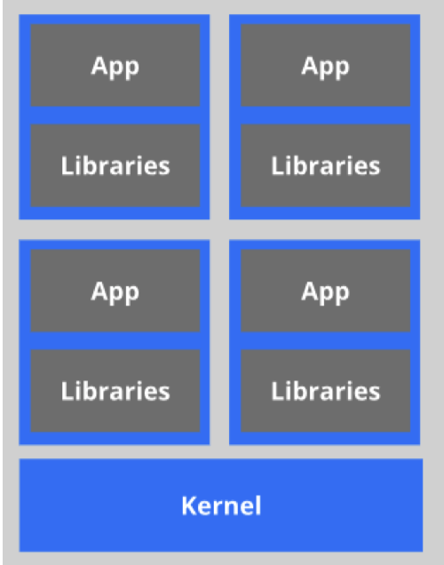

# Docker

> 弱小和无知不是生存的障碍，傲慢才是!

## 1.Docker学习

+ Docker概述
+ Docker安装
+ Docker命令
  + 镜像命令
  + 容器命令
  + 操作命令
+ Docker镜像
+ 容器数据卷
+ DockerFile
+ Docker网络原理
+ Goland整合Docker
+ Docker Compose
+ Docker Swarm
+ CI/CD 持续集成/持续部署

> 授人以鱼不如授人以渔

## 2.Docker概述

### 2.1Docker为什么会出现

一款产品从开发到上线，从操作系统，到运行环境，再到应用配置。作为开发+运维之间的协作我们需要 关心很多东西，这也是很多互联网公司都不得不面对的问题，特别是各种版本的迭代之后，不同版本环 境的兼容，对运维人员是极大的考验！

环境配置如此麻烦，换一台机器，就要重来一次，费力费时。很多人想到，能不能从根本上解决问题， 软件可以**带环境安装？**也就是说，安装的时候，把原始环境一模一样地复制过来。解决开发人员说的“ 在 我的机器上可正常工作”的问题。

之前在服务器配置一个应用的运行环境，要安装各种软件，就拿一个基本的工程项目的环境来说吧， Java/Tomcat/MySQL/JDBC驱动包等。安装和配置这些东西有多麻烦就不说了，它还不能跨平台。假如 我们是在 Windows 上安装的这些环境，到了 Linux 又得重新装。况且就算不跨操作系统，换另一台同 样操作系统的服务器，要移植应用也是非常麻烦的。

传统上认为，软件编码开发/测试结束后，所产出的成果即是程序或是能够编译执行的二进制字节码文件 等（Java为例）。而为了让这些程序可以顺利执行，开发团队也得准备完整的部署文件，让维运团队得 以部署应用程式，**开发需要清楚的告诉运维部署团队，用的全部配置文件+所有软件环境。**不过，即便如 此，仍然常常发生部署失败的状况。

Docker之所以发展如此迅速，也是因为它对此给出了一个标准化的解决方案。

Docker镜像的设计，**使得Docker得以打破过去「程序即应用」的观念。通过Docker镜像 ( images ) 将 应用程序所需要的系统环境，由下而上打包，达到应用程序跨平台间的无缝接轨运作。**

Docker的思想来自于集装箱，集装箱解决了什么问题？在一艘大船上，可以把货物规整的摆放起来。并 且各种各样的货物被集装箱标准化了，集装箱和集装箱之间不会互相影响。那么我就不需要专门运送水 果的船和专门运送化学品的船了。只要这些货物在集装箱里封装的好好的，那我就可以用一艘大船把他 们都运走。 docker就是类似的理念。

### 2.2 历史与理念

2010年，几个搞IT的年轻人，在美国旧金山成立了一家名叫“dotCloud”的公司。 这家公司主要提供基于PaaS的云计算技术服务。具体来说，是和LXC(LXC为Linux Container的简写。可以提供轻量级的虚拟化，以便隔离进程和资源，而且不需要提供指令解释机制以及全虚拟化的其他复杂性。)有关的容器技术。 后来，dotCloud公司将自己的容器技术进行了简化和标准化，并命名为——**Docker**。 Docker技术诞生之后，并没有引起行业的关注。而dotCloud公司，作为一家小型创业企业，在激烈的竞 争之下，也步履维艰。 正当他们快要坚持不下去的时候，脑子里蹦出了“开源”的想法。 什么是“开源”？开源，就是开放源代码。也就是将原来内部保密的程序源代码开放给所有人，然后让大 家一起参与进来，贡献代码和意见。 有的软件是一开始就开源的。也有的软件，是混不下去，创造者又不想放弃，所以选择开源。自己养不 活，就吃“百家饭”嘛。 2013年3月，dotCloud公司的创始人之一，Docker之父，28岁的Solomon Hykes正式决定，将 Docker项目开源。 不开则已，一开惊人。 越来越多的IT工程师发现了Docker的优点，然后蜂拥而至，加入Docker开源社区。 Docker的人气迅速攀升，速度之快，令人瞠目结舌。 开源当月，Docker 0.1 版本发布。此后的每一个月，Docker都会发布一个版本。到2014年6月9日， Docker 1.0 版本正式发布。 此时的Docker，已经成为行业里人气最火爆的开源技术，没有之一。甚至像Google、微软、Amazon、 VMware这样的巨头，都对它青睐有加，表示将全力支持。 Docker和容器技术为什么会这么火爆？说白了，就是因为它“轻”。 在容器技术之前，业界的网红是**虚拟机**。虚拟机技术的代表，是**VMWare**和**OpenStack**。 相信很多人都用过虚拟机。虚拟机，就是在你的操作系统里面，装一个软件，然后通过这个软件，再模 拟一台甚至多台“子电脑”出来。

在“子电脑”里，你可以和正常电脑一样运行程序，例如开QQ。如果你愿意，你可以变出好几个“子电 脑”，里面都开上QQ。“子电脑”和“子电脑”之间，是**相互隔离**的，互不影响。

虚拟机属于虚拟化技术。而Docker这样的容器技术，也是虚拟化技术，属于**轻量级的虚拟化**。

虚拟机虽然可以隔离出很多“子电脑”，但占用空间更大，启动更慢，虚拟机软件可能还要花钱（例如 VMWare）。

而容器技术恰好没有这些缺点。它不需要虚拟出整个操作系统，只需要虚拟一个小规模的环境（类似“沙 箱”）。

它启动时间很快，几秒钟就能完成。而且，它对资源的利用率很高（一台主机可以同时运行几千个 Docker容器）。此外，它占的空间很小，虚拟机一般要几GB到几十GB的空间，而容器只需要MB级甚至 KB级。

正因为如此，容器技术受到了热烈的欢迎和追捧，发展迅速。

> Docker 理念

Docker是基于Go语言实现的云开源项目。

Docker的主要目标是“Build，Ship and Run Any App , Anywhere”，也就是通过对应用组件的封装、分 发、部署、运行等生命周期的管理，使用户的APP（可以是一个WEB应用或数据库应用等等）及其运行 环境能够做到“一次封装，到处运行”。

Linux 容器技术的出现就解决了这样一个问题，而 Docker 就是在它的基础上发展过来的。将应用运行在 Docker 容器上面，而 Docker 容器在任何操作系统上都是一致的，这就实现了跨平台、跨服务器。只需 要一次配置好环境，换到别的机子上就可以一键部署好，大大简化了操作。

### 2.3 Docker 能干什么

> 以前的虚拟机技术

虚拟机（virtual machine）就是带环境安装的一种解决方案。

它可以在一种操作系统里面运行另一种操作系统，比如在Windows 系统里面运行Linux 系统。应用程序 对此毫无感知，因为虚拟机看上去跟真实系统一模一样，而对于底层系统来说，虚拟机就是一个普通文 件，不需要了就删掉，对其他部分毫无影响。这类虚拟机完美的运行了另一套系统，能够使应用程序， 操作系统和硬件三者之间的逻辑不变。

虚拟机的缺点：

1、资源占用多 2、冗余步骤多 3 、启动慢

> 虚拟化容器技术

由于前面虚拟机存在这些缺点，Linux 发展出了另一种虚拟化技术：Linux 容器（Linux Containers，缩 写为 LXC）。

Linux 容器不是模拟一个完整的操作系统，而是对进程进行隔离。有了容器，就可以将软件运行所需的 所有资源打包到一个隔离的容器中。容器与虚拟机不同，不需要捆绑一整套操作系统，只需要软件工作 所需的库资源和设置。系统因此而变得高效轻量并保证部署在任何环境中的软件都能始终如一地运行。

比较了 Docker 和传统虚拟化方式的不同之处：

传统虚拟机技术是虚拟出一套硬件后，在其上运行一个完整操作系统，在该系统上再运行所需应用 进程； 而容器内的应用进程直接运行于宿主的内核，容器内没有自己的内核，而且也没有进行硬件虚拟。 因此容器要比传统虚拟机更为轻便。 每个容器之间互相隔离，每个容器有自己的文件系统 ，容器之间进程不会相互影响，能区分计算资 源。

> 开发、运维

**更快速的应用交付和部署：**

传统的应用开发完成后，需要提供一堆安装程序和配置说明文档，安装部署后需根据配置文档进行繁杂 的配置才能正常运行。Docker化之后只需要交付少量容器镜像文件，在正式生产环境加载镜像并运行即 可，应用安装配置在镜像里已经内置好，大大节省部署配置和测试验证时间。

**更便捷的升级和扩缩容：**

随着微服务架构和Docker的发展，大量的应用会通过微服务方式架构，应用的开发构建将变成搭乐高积 木一样，每个Docker容器将变成一块“积木”，应用的升级将变得非常容易。当现有的容器不足以支撑业 务处理时，可通过镜像运行新的容器进行快速扩容，使应用系统的扩容从原先的天级变成分钟级甚至秒 级。

**更简单的系统运维：**

应用容器化运行后，生产环境运行的应用可与开发、测试环境的应用高度一致，容器会将应用程序相关 的环境和状态完全封装起来，不会因为底层基础架构和操作系统的不一致性给应用带来影响，产生新的 BUG。当出现程序异常时，也可以通过测试环境的相同容器进行快速定位和修复。

**更高效的计算资源利用：**

 Docker是内核级虚拟化，其不像传统的虚拟化技术一样需要额外的Hypervisor [管理程序] 支持，所以在 一台物理机上可以运行很多个容器实例，可大大提升物理服务器的CPU和内存的利用率。

