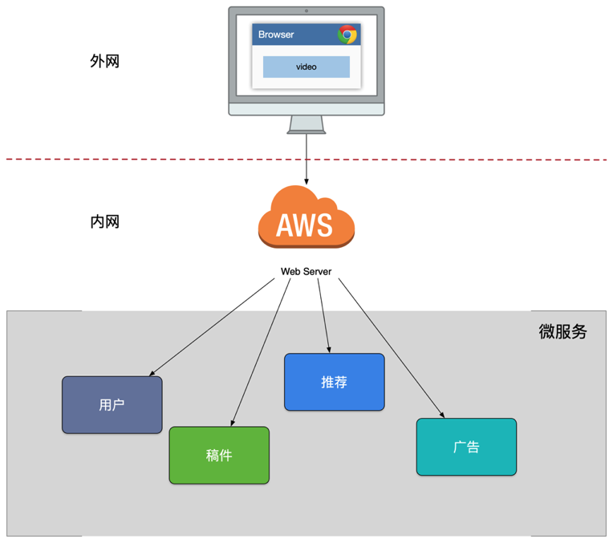
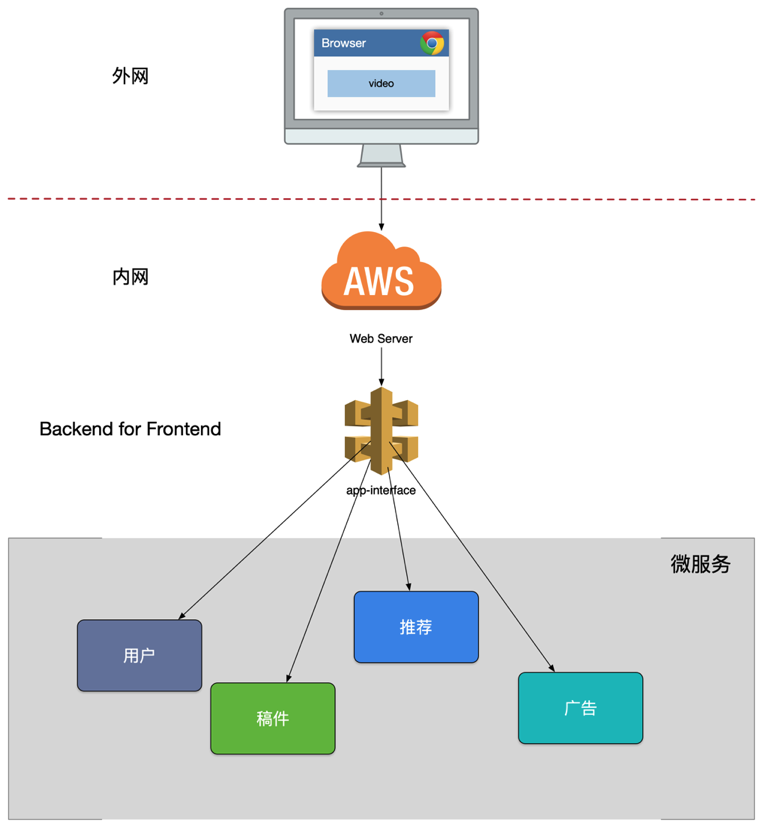
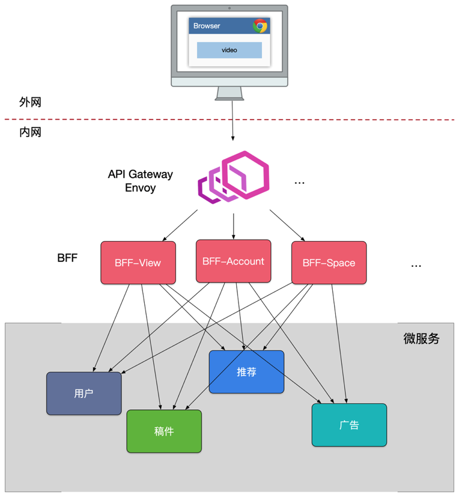
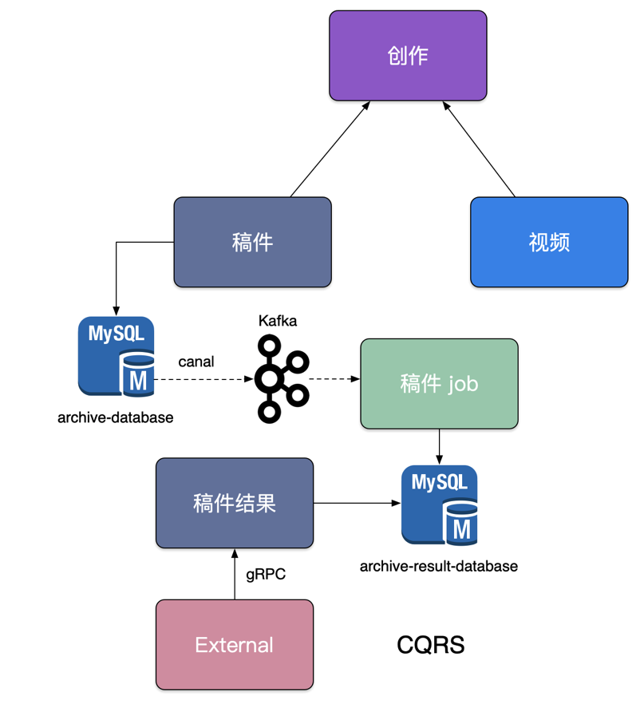
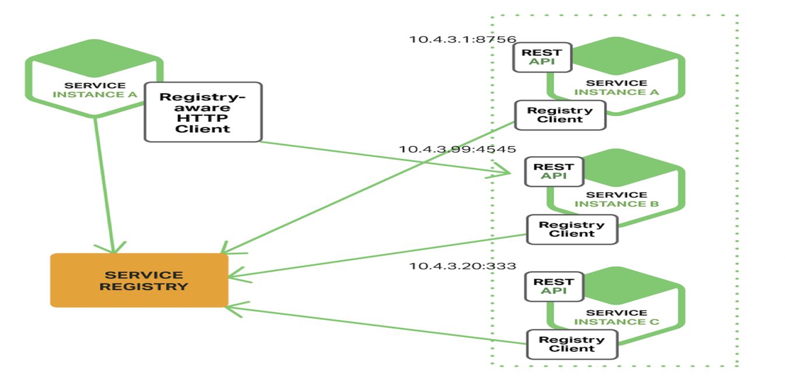
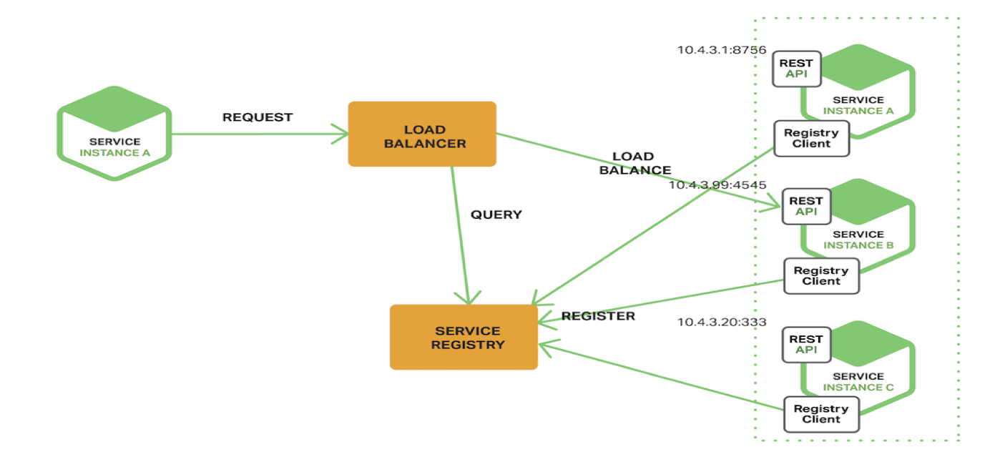
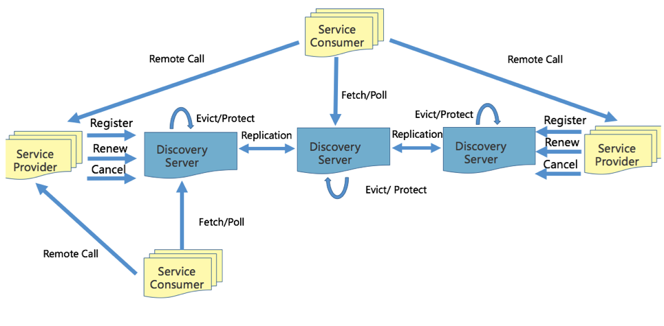
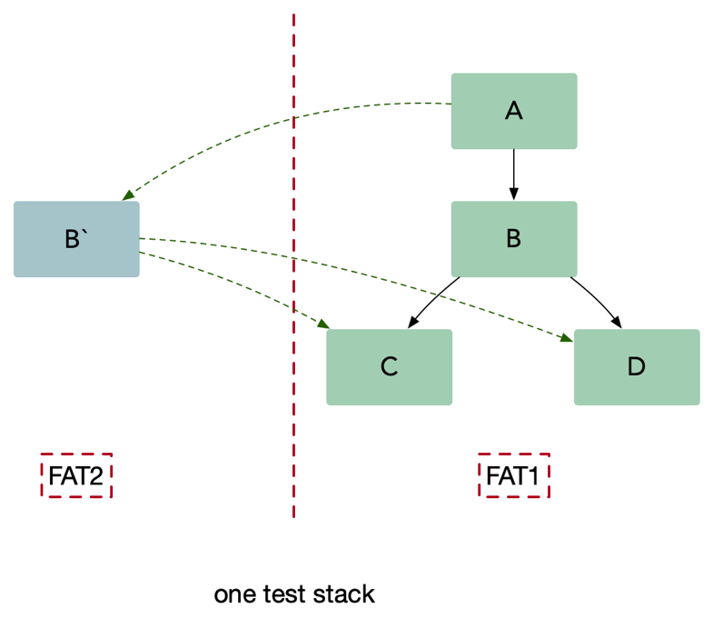
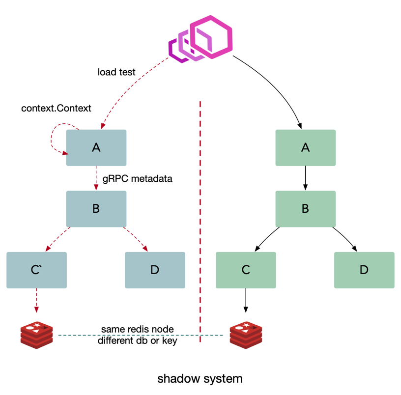

思考

- 为什么会有微服务？
- 微服务起源？
- 微服务是什么？
- 微服务可以带来什么好处，又有那些缺点？
- 微服务的特征？
- 微服务架构演进？
- 微服务如何划分？
- 微服务如何对外暴露？
- 微服务如何拆分？
- 如何保证微服务之间的安全？
- 服务间的通信方式？
- 服务发现？
- 多集群？
- 多租户？

# 微服务概览

1. 为什么会有微服务
  + 之前的巨石架构太复杂
  + 单体架构太复杂，任何开发者不可能搞懂。
  + 应用无法扩展，可靠性低。敏捷开发和部署难以完成

-------

2. 微服务起源

+ 大家经常谈论的是一个叫 SOA（面向服务的架构模式），它和微服务又是什么关系？你可以把微服务想成是 SOA 的一种实践。
+ 小即是美：小的服务代码少，bug 也少，易测试，易维护，也更容易不断迭代完善的精致进而美妙。
+ 单一职责：一个服务也只需要做好一件事，专注才能做好。
+ 尽可能早地创建原型：尽可能早的提供服务 API，建立服务契约，达成服务间沟通的一致性约定，至于实现和完善可以慢慢再做。**从类的依赖变成了服务之间的引用**
+ 可移植性比效率更重要：服务间的轻量级交互协议在效率和可移植性二者间，首要依然考虑兼容性和移植性。

------

3. 什么是微服务
  + 我特别喜欢的一个微服务定义：*“微服务架构”一词在过去几年中如雨后春笋般涌现，用来描述将软件应用程序设计为可独立部署的服务套件的特定方式。虽然这种架构风格没有精确的定义，但围绕业务能力、自动化部署、端点智能以及语言和数据的分散控制，围绕组织存在某些共同特征。*
  + 围绕业务功能构建的，服务关注单一业务，服务间采用轻量级的通信机制，可以全自动独立部署，可以使用不同的编程语言和数据存储技术。微服务架构通过业务拆分实现服务组件化，通过组件组合快速开发系统，业务单一的服务组件又可以独立部署，使得整个系统变得清晰灵活

----

4. 微服务可以带来什么好处，又有那些缺点？ 

+ 优点
  + 服务拆分后比较小，BUG 少，容易测试和维护，也容易扩展
  + **原子服务，**一个服务只做一件事情，并且这个属于这个服务的也不应该拆分到其他服务去
  + **独立进程，**一个服务只有一个独立进程，可以很好的和当前的容器化进行结合，无状态的服务可以很容易的享受到，k8s 上的故障转移，自动重启等好处
  + **隔离部署，**每个服务之间独立部署，可以避免相互影响，并且和按需进行分配资源，节省成本
  + 去中心化服务治理
    + 数据去中心化，每个服务独享数据库，缓存等设施，也有个别情况多个服务共享数据库，例如面向用户的管理后台和面向管理员的管理后台
    + 治理去中心化
    + 技术去中心化，每个服务可以使用适合自己的技术进行实施，但是注意如果技术栈过于发散对于企业或者团队本身也是不利的

+ 缺点

  - 服务之间的依赖关系复杂，成千上万个服务相互依赖就像一团乱麻一样，剪不断理还乱。

    - 常见的解决方案：全链路追踪，例如， opentracing

  - 微服务本身是分布式系统，需要使用 RPC 或者 消息进行通信，此外，必须要写代码来处理消息传递中速度过慢或者服务不可用等局部失效问题

    - 例子：服务调用流量会容易被放大，如果 服务 A -> B ->C 如果 A 有一个循环调用 B，B 也有一个循环调用 C，那么一个请求到达 C 之后就被放大了 100 倍甚至上千倍。这是扛不住的
    - **常见解决方案：粗粒度的进程间通信（batch 接口，批量请求，避免 n+1 问题），隔离，超时保护，负载保护，熔断、限流、降级、重试，负载均衡**
    
  - 会有分布式事务问题，因为现在每个微服务之间都会有一个独立的数据库，事务在单体应用中很好处理，但是在跨服务时会变得很麻烦
    
      - 常见解决方案：两阶段提交、TCC 等
      - [小米信息部技术团队: 分布式事务，这一篇就够了](https://xiaomi-info.github.io/2020/01/02/distributed-transaction/)
  
	- 测试会非常复杂，由于依赖多，无法得知是因为功能异常还是依赖的某个服务发版出现问题
  
      - 常见解决方案：独立测试环境，后面会有一个解决方案
  
   - 服务模块间的依赖，应用的升级有可能会波及多个服务模块的修改。
  
      - 切记，在服务需要变更时我们要特别小心，服务提供者的变更可能引发服务消费者的兼容性破坏，**时刻谨记保持服务契约(接口)的兼容性**
      - 发送时要保守，接收时要开放。按照伯斯塔尔法则的思想来设计和实现服务时，发送的数据要更保守，意味着最小化的传送必要的信息，接收时更开放意味着要最大限度的容忍冗余数据，保证兼容性。
    
    - 对基础建设的要求很高，基础设施需要自动化，日志采集，监控数据采集，告警，CICD，K8s 等
    
      - 常见解决方案：上云

---

5. 微服务的特征？**（扩展，微服务九大特性）**

+ 组件服务化
  + 传统实现组件的方式是通过库（library），库是和应用一起运行在进程中，库的局部变化意味着整个应用的重新部署。(巨石架构)
  + 通过服务来实现组件，意味着将应用拆散为一系列的服务运行在不同的进程中，那么单一服务的局部变化只需重新部署对应的服务进程。我们用 Go 实施一个微服务：
    + *kit：一个微服务的基础库（框架）*（例如kratos）
    + *service：业务代码* *+ kit* *依赖* *+* *第三方依赖组成的业务微服务*
    + *RPC* *+ message queue：轻量级通讯*
  + 本质上说：**多个微服务组合(compose)**完成了一个完整的用户场景
+ 按照业务组织服务
  + 传统组织是按照技术层面划分的，例如： UI团队、后台团队和数据库团队。该划分方式的弊端是当业务变更发生时，需要跨团队才得以完成，成本比较高。
  + 使用全栈或者自治的方法，一个团队里可能有前后端所有的开发人员
+ 去中心化（2个）
  + 每个服务面临的业务场景不同，可以针对性选择合适的技术解决方案。但也需要避免过度多样化，结合团队实际情况来选择取舍，要是每个服务都用不同的语言的技术栈来实现，维护成本就会很高。
    + 数据去中心化：每个服务独享自身的数据存储设施**（**缓存，数据库等**）**，**不像传统应用共享一个缓存和数据库，这样有利于服务的独立性，隔离相关干扰**。
    + 技术去中心化：各个服务之间不共享数据库，每个服务拥有自己独立的数据库
+ 基础设施自动化
  + 无自动化不微服务，自动化包括测试和部署。单一进程的传统应用被拆分为一系列的多进程服务后，意味着开发、调试、测试、监控和部署的复杂度都会相应增大，必须要有合适的自动化基础设施来支持微服务架构模式，否则开发、运维成本将大大增加。
    + *CI**/**CD**：**GitLab + GitLab Hooks + Kubernetes*
    + *Testing**：测试环境、单元测试、**API* *自动化测试*
    + *在线运行时：**Kubernetes，**以及一系列* *Prometheus**、**ELK、* *Control Panel*
+ **可用性** **&** **兼容性设计**（“容错”设计）
  + 一旦采用了微服务架构模式，那么在服务需要变更时我们要特别小心，服务提供者的变更可能引发服务消费者的兼容性破坏，时刻谨记保持服务契约（接口）的兼容性。
  + *发送时要保守，接收时要开放。按照伯斯塔尔法则的思想来设计和实现服务时，发送的数据要更保守，意味着最小化的传送必要的信息，接收时更开放意味着要最大限度的容忍冗余数据，保证兼容性。*
+ “做产品”而不是“做项目”
  + 开发人员以做产品的方式来开发服务，对其整个生命周期（包括：测试、部署及运维）负责。
+ “智能端点”与“傻瓜管道”
  + 服务自身能够自治，服务之间的交互要轻量化
    + 使用HTTP协议的RESTful API或轻量级的消息发送协议，来实现信息传递与服务调用的触发。
    + 通过在轻量级消息总线上传递消息，类似RabbitMQ等一些提供可靠异步交换的结构。
+ “演进式”设计
  + 服务可独立更换和升级
  + 需求变化是必然发生的，必须要考虑当一个服务发生变化时，依赖它并对其进行消费的其他服务将无法工作

# 微服务设计


1. 微服务架构演进？

我们进行了 SOA 服务化的架构演进，按照垂直功能进行了拆分，对外暴露了一批微服务，但是因为缺乏统一的出口面临了不少困难



+ 客户端到微服务直接通信，强耦合
+ 需要多次请求，客户端聚合数据，工作量巨大，延迟高（请求AI服务，稿件服务，广告服务......）
+ 协议不利于统一，各个部门之间有差异，需要端来兼容（各个部门可能有自己的一套协议）
+ 面向“端”的API适配，耦合到了内部服务（ipad版本、安卓版本的API适配问题。ipad、安卓版本可能api有需要不同适配的地方）
+ 多终端兼容逻辑复杂，每个服务都需要处理（因为直接耦合微服务，老版本的api无法下线）
+ 统一逻辑无法收敛，比如安全认证、限流

2. 新增API Gateway

我们新增了一个 app-interface 用于统一的协议出口，在服务内进行大量的 dataset join，按照业务场景来设计==粗粒度的 API==，给后续服务的演进带来的很多优势



+ 轻量交互：协议精简、聚合（不同的终端提供相同的API，可以聚合不同的协议）
+ 差异服务：数据剪裁以及聚合、针对终端定制化API
+ 动态升级：原有系统兼容升级，更新服务而非协议（API兼容，服务随时更新）
+ 沟通效率提升，协作模式演进为移动业务+网关小组

3. API Gateway的问题

最致命的一个问题是整个 app-interface 属于 single point of failure，严重代码缺陷或者流量洪峰可能引发集群宕机。

+ *单个模块也会导致后续业务集成复杂度高，根据康威法则，单块的无线 BFF 和多团队之间就出现不匹配问题，团队之间沟通协调成本高，交付效率低下。*
+ *很多跨横切面逻辑，比如安全认证，日志监控，限流熔断等。随着时间的推移，代码变得越来越复杂，技术债越堆越多。*

4. 抽出横切面的功能



跨横切面（Cross-Cutting Concerns）的功能，需要协调更新框架升级发版（路由、认证、限流、安全），因此全部上沉，引入了 *API Gateway*，把业务集成度高的 BFF 层和通用功能服务层 API Gateway 进行了分层处理

*在新的架构中，网关承担了重要的角色，它是解耦拆分和后续升级迁移的利器。在网关的配合下，单块 BFF 实现了解耦拆分，各业务线团队可以独立开发和交付各自的微服务，研发效率大大提升。另外，把跨横切面逻辑从 BFF 剥离到网关上去以后，BFF 的开发人员可以更加专注业务逻辑交付，实现了架构上的关注分离（Separation of Concerns）。*

>  业务的实际流量

*移动端* *-> API Gateway -> BFF -> Microservices，在* *FE Web**业务中，**BFF* *可以是* *Node.js* *来做服务端渲染（**SSR**，**Server-Side Rendering**），注意这里忽略了上游的* *CDN**、**4/7**层负载均衡（**ELB）。*

5. 微服务如何划分

微服务架构时遇到的第一个问题就是如何划分服务的边界。在实际项目中通常会采用两种不同的方式划分服务边界，即通过业务职能（Business Capability）或是 DDD 的限界上下文（Bounded Context）。

+ *Business Capability*

    *由公司内部不同部门提供的职能。例如客户服务部门提供客户服务的职能，财务部门提供财务相关的职能。*

+ *Bounded Context*

    *限界上下文是 DDD 中用来划分不同业务边界的元素，这里业务边界的含义是“解决不同业务问题”的问题域和对应的解决方案域，为了解决某种类型的业务问题，贴近领域知识，也就是业务。*

+ CQRS，将应用程序分为两部分：命令端和查询端。命令端处理程序创建，更新和删除请求，并在数据更改时发出事件。查询端通过针对一个或多个物化视图执行查询来处理查询，这些物化视图通过订阅数据更改时发出的事件流而保持最新

  

  *在稿件服务演进过程中，我们发现围绕着创作稿件、审核稿件、最终发布稿件有大量的逻辑揉在一块，其中稿件本身的状态也有非常多种，但是最终前台用户只关注稿件能否查看，我们依赖稿件数据库* *binlog* *以及订阅* *binlog* *的中间件* *canal，将我们的稿件结果发布到消息队列* *Kafka* *中，最终消费数据独立组建一个稿件查阅结果数据库，并对外提供一个独立查询服务，来拆分复杂架构和业务。*

  ==最终变成了命令端和查询段解耦==

6. 如何保证微服务之间的安全？

在内网主要看安全级别一般有三种：

- Full Trust：假定内网服务之间是安全的，在内网裸奔
- Half Trust：内网服务之间需要进行认证鉴权，但是不需要所有的都进行加密
- Zero Trust: 零信任，任务内部网络是不安全的，类似公网，所有的请求通过身份认证鉴权之后，都需要通过安全加密，防止被嗅探

# gRPC & 服务发现

1. 服务之间的通信方式：[gRPC](https://grpc.io/)

+ 多语言：语言中立，支持多种语言
+ 轻量级、高性能：序列化[PB(Protocol Buffer)](https://developers.google.com/protocol-buffers)和JSON，PB是一种语言无关的高性能的序列化框架
+ 可插拔
+ IDL：基于文件定义服务，通过proto3工具生成指定语言的数据结构、服务端接口以及客户端Stub
+ 移动端：基于标准的HTTP/2设计，支持双向流、消息头压缩、单TCP的多路复用、服务端推送等特性，这些特性使得gRPC在移动端设备更加省电和节省网络流量
+ 服务而非对象、消息而非引用：促进微服务的系统间粗粒度消息交互设计理念
+ 负载无关的：不同的服务使用不同的消息类型和编码，例如protocol buffers、JSON、XML和Thrift
+ 流：Streaming API
+ 阻塞式和非阻塞式：支持异步和同步处理在客户端和服务端间交互的消息序列。
+ 元数据交换：常见的横切关注点，如认证或跟踪，依赖数据交换。
+ [标准化状态码](https://grpc.github.io/grpc/core/md_doc_statuscodes.html)：客户端通常以有限的方式响应 API 调用返回的错误。

2. 优雅启动与优雅中止（健康检查）

**优雅启动**


1. Provider 启动，k8s 中的启动脚本会定时去检查服务的健康检查接口
2. 健康检查通过之后，服务注册脚本向注册中心注册服务（rpc://ip:port）
3. 消费者定时从服务注册中心获取服务方地址信息
4. 获取成功后，会定时的向服务方发起健康检查，健康检查通过后才会向这个地址发起请求
   1. 在运行过程中如果健康检查出现问题，会从消费者本地的负载均衡中移除

**优雅退出**


1. 触发下线操作: 首先用户在发布平台点击发版/下线按钮
2. 发布部署平台向注册中心发起服务注销请求，在注册中心下线服务的这个节点
   - 这里在发布部署平台实现有个好处，不用每个应用都去实现一遍相同的逻辑
   - 在应用受到退出信号之后由应用主动发起注销操作也是可以的

- 2.1 注册中心下线应用之后，消费者会获取到服务注销的事件，然后将服务方的节点从本地负载均衡当中移除
  1. 注意这一步操作会有一段时间，下面的第四步并不是这一步结束了才开始

1. 发布部署平台向应用发送`SIGTERM`信号，应用捕获到之后执行

   1. 将健康检查接口设置为不健康，返回错误
      1. 这个时候如果消费者还在调用应用程序，调用健康检查接口发现无法通过，也会将服务节点从本地负载均衡当中移除
   2. 调用 grpc/http 的 shutdown 接口，并且传递超时时间，等待连接全部关闭后退出
      1. 这个超时时间一般为 2 个心跳周期

2. 发布部署平台如果发现应用程序长时间没有完成退出，发送`SIGKILL`

   强制退出应用

   1. 这个超时时间根据应用进行设置一般为 10 - 60s


3. 服务发现

+ 客户端发现：一个服务实例被启动时，它的网络地址会被写到注册表上，当服务实例终止时，再从注册表中删除。这个服务实例的注册表通过心跳机制动态刷新。客户端使用一个负载均衡算法，去选择一个可用的服务实例，来响应这个请求。



+ 服务端发现：客户端通过负载均衡器向一个服务发送请求，这个负载均衡器会查询服务注册表，并将请求路由到可用的服务实例上。服务实例在服务注册表上被注册和注销(Consul Template+Nginx，Kubernetes+etcd)。



+ 不同的服务发现模式


### 客户端发现

- 直连，比服务端服务发现少一次网络跳转
- Consumer 需要内置特定的服务发现客户端和发现逻辑
  - 可以将负载均衡逻辑下放到 sidecar 中进行解耦

### 服务端发现

- Consumer 无需关注服务发现具体细节，只需知道服务的 DNS 域名即可

- 支持异构语言开发，需要基础设施支撑，多了一次网络跳转，可能有性能损失，基础设施会比较复杂

  > B 站这边采用的是客户端发现的模式

4. 注册中心

**CP、CA、还是 AP**
实际场景是海量服务发现和注册，服务状态可以弱一致, 需要的是 AP 系统，只需最终一致性即可

多个注册中心的对比：[微服务注册中心](https://developer.aliyun.com/article/698930)

B站时使用了Eureka实现了AP发现服务，后面补充介绍



+ 通过 Family(appid) 和 Addr(IP:Port) 定位实例，除此之外还可以附加更多的元数据：权重、染色标签、集群等。

  *appid:* *使用三段式命名，business.service.xxx*

+ Provider 注册后定期（30s）心跳一次，注册， 心跳，下线都需要进行同步，注册和下线需要进行长轮询推送。

  *新启动节点，需要* *load cache**，**JVM* *预热。*  *故障时，Provider* 不建议重启和发布。

+ Consumer 启动时拉取实例，发起 30s 长轮询。

  *故障时，需要* *client* *侧* *cache* *节点信息。*

+ Server 定期（60s）检测失效（90s）的实例，失效则剔除。短时间里丢失了大量的心跳连接（15分钟内心跳低于期望值*85%），开启自我保护，保留过期服务不删除。

# 多集群 & 多租户

1. 多集群

> 多集群的需求从何处而来

L0级别的服务。类似像我们账号，之前是一套大集群，一旦故障影响范围巨大，所以我们从几个角度考虑多集群的必要性。

- 从单一集群考虑，多个节点保证可用性，我们通常使用 N+2 的方式来冗余节点。
  - N 一般通过压测得出
- 从单一集群故障带来的影响面角度考虑冗余多套集群。
  - 例如依赖的 redis 出现问题，整个集群挂掉了
- 单个机房内的机房故障导致的问题
  - 多机房部署，如果在云上可能是多个可用区

> 什么是多集群

我们利用 PaaS 平台，给某个 appid 服务建立多套集群（物理上相当于两套资源，逻辑上维护 cluster 的概念），对于不同集群服务启动后，从环境变量里可以获取当下服务的 cluster，在服务发现注册的时候，带入这些元信息。当然，不同集群可以隔离使用不同的缓存资源等。

+ 看中了独立的缓存，提供了冗余和容错能力

> 如何降低健康流量检查

对于账号这种大量服务依赖的服务，仅仅是健康检查流量就会导致 30%以上的资源占用（B 站之前的真实情况）
可以使用子集算法，将后端的节点均分给所有的客户端

- 通常 20-100 个后端，部分场景需要大子集，比如大批量读写操作。
- 后端平均分给客户端。
- 客户端重启，保持重新均衡，同时对后端重启保持透明，同时连接的变动最小
  - 消费者变化的时候需要 重新平衡

```go
// from google sre
func Subset(backends []string, clientID, subsetSize int) []string {
	subsetCount := len(backends) / subsetSize

	// Group clients into rounds; each round uses the same shuffled list:
	round := clientID / subsetCount

	r := rand.New(rand.NewSource(int64(round)))
	r.Shuffle(len(backends), func(i, j int) { backends[i], backends[j] = backends[j], backends[i] })

	// The subset id corresponding to the current client:
	subsetID := clientID % subsetCount

	start := subsetID * subsetSize
	return backends[start : start+subsetSize]
}
```

**为什么上面这个算法可以保证可以均匀分布？**
首先，**shuffle 算法保证在 round 一致的情况下，backend 的排列一定是一致的。**
因为每个实例拥有从 0 开始的连续唯一的自增 id，且计算过程能够保证每个 round 内所有实例拿到的服务列表的排列一致，因此在同一个 round 内的 client 会分别 backend 排列的不同部分的切片作为选中的后端服务来建立连接。
所以只要 client id 是连续的，那么 client 发向 后端的连接就一定是连续的

2. 多租户

在一个微服务架构中**允许多系统共存**是利用微服务稳定性以及模块化最有效的方式之一，这种方式一般被称为多租户(multi-tenancy)。租户可以是测试，金丝雀发布，影子系统(shadow systems)，甚至服务层或者产品线，使用租户能够保证代码的隔离性并且能够基于流量租户做路由决策。

> 如何解决测试环境问题

解决1：多套物理环境（类似上文的多集群）

搭建多套测试环境，可以做到物理隔离，但是也会存在一些问题：

- 混用环境导致的不可靠测试。
- 多套环境带来的硬件成本。
- 难以做负载测试，仿真线上真实流量情况。
- 治标不治本，无法知道当前环境谁在使用，并且几套环境可以满足需求？万一又多几个人开发是不是又需要再来几套？

解决2：多租户，染色发布



- 注册流程
  - 假设我们现在有一套问题的 `FAT1` 测试环境，然后现在对应用 B 做了修改
  - 开发同学通过发布平台发布一个新的 B 应用 B`，并且带上环境标签，例如:`red`
  - 应用 B`向注册中心进行注册时候会带上`red` 标签
  - 消费者 A 在向注册中心获取服务节点数据的时候也会获取到这个标签，并且在本地的负载均衡当中使用 `map[string]pool` 的结构进行保存
- 调用流程
  - 测试同学通过 A 进行调用测试，如果是 http 就在 header 中打上这个 `red` 标签，如果是 grpc 就在 metadata 中加入这个标签
  - A 调用 B 的时候，发现 header 中存在 `red` 标签就会去本地负载均衡查询，发现负载均衡中有 red 标签的连接，这个之后就直接调用到 B`，并且在调用的时候 A 会将 header 的标签信息进行透传
  - B` 收到请求之后，需要调用 C、D 这时候也是一样的会去负载均衡中进行查询，发现没有就会退回到默认的连接池中
- 如何进行联调？
  - 需要联调的应用打上相同的标签就可以了
- 注意事项
  - 应用版本发布时数据结构，例如 db 中的表，redis 中的 key，必须保证向下兼容
  - 测试的时候需要使用不同的测试账号
  - 注意来自外网的请求中的 header 必须删除，确保安全
- **核心思路**
  - 跨服务传递请求携带上下文(context)，数据隔离的流量路由方案。
    - 根据标签进行流量路由，并且要确保可以透传
  - 利用服务发现注册租户信息，注册成特定的租户。
    - 发布部署平台需要支持方便启动多套环境，以及标签注入
    - 对不同的环境做了隔离，可以保证对关键业务没有影响

> 如何进行全链路压测



和上面的测试环境的解决方案类似，但是我们需要搭建一套和线上一致的影子系统

- 如何解决压测数据对线上数据的影响
  - 基础设施需要做改造，采用同样的基础设施节点
  - 缓存：影子应用存储的数据放到影子库中，使用不同的 db
  - 数据库：自动将线上的数据结构复制一份到影子数据库中。里面的表结构保持一致，数据库名做一些变化，例如 db_shadow
  - 消息队列: 推送消息的时候使用不同的 topic 或者是携带一些 metadata 信息
- 需要提前做一些数据初始化的操作，提前进行准备
- 压测时携带压测标签，将流量自动路由到影子服务进行压测

这种方案同样可以用于灰度发版当中

# 补充

1. SOA架构
2. BFF:面向前端应用的后端服务
3. DDD领域驱动设计
4. gRPC的健康检查

代码详见：https://github.com/grpc/grpc/blob/master/doc/health-checking.md

 gRPC作为RPC服务，跟普通的RPC服务类似，一个health check API检测是否可以正常返回

----

**服务定义**

```protobuf
syntax = "proto3";

package grpc.health.v1;

message HealthCheckRequest {
  string service = 1;
}

message HealthCheckResponse {
  enum ServingStatus {
	UNKNOWN = 0;
	SERVING = 1;
	NOT_SERVING = 2;
  }
  ServingStatus status = 1;
}

service Health {
  rpc Check(HealthCheckRequest) returns (HealthCheckResponse);

  rpc Watch(HealthCheckRequest) returns (stream HealthCheckResponse);
}
```

客户端应该调用 `Check` 服务来判断服务是否正常运行，并且设置 deadline。客户端可以设置需要查询的服务名称，来返回对应的服务是否正常。

服务器应手动注册所有的服务并单个设置状态，包括空服务名称及其状态。对于收到的每一个请求，从注册表中查询服务的状态并返回。如果未找到，返回 `NOT_FOUND` 状态。 服务器也可以根据实际的业务逻辑提供更为复杂的状态返回（比如：调用量判断，计费需求等）。

客户端还可以调用 `Watch` 方法执行流的健康检测，服务器会不断的返回服务的健康状态。

上面的说明，侧重于的都是应用层面的，但实际上面对的需求可能是平台层面的。

-----

gRPC-go 提供了健康检测库：https://pkg.go.dev/google.golang.org/grpc/health?tab=doc 把上面的文档接口化了。

对接只需要两行代码：

```go
healthcheck := health.NewServer()
healthpb.RegisterHealthServer(s, healthcheck)
```

我的示例代码：[gRPC健康检查](https://github.com/Yefangbiao/study-co/tree/main/Go%E8%BF%9B%E9%98%B6%E8%AE%AD%E7%BB%83%E8%90%A5/go-advance/chapter1/grpchealth)

5. Eurkea详解

# 阅读

+ [小米信息部技术团队: 分布式事务，这一篇就够了](https://xiaomi-info.github.io/2020/01/02/distributed-transaction/)
+ [Redis与MySQL双写一致性如何保证](https://zhuanlan.zhihu.com/p/413827571?utm_source=qq&utm_medium=social&utm_oi=827092282342801408)
+ [MicroservicesAndSoa](https://martinfowler.com/articles/microservices.html#MicroservicesAndSoa)
+ [微服务九大特性](http://kaelzhang81.github.io/2017/09/14/%E5%BE%AE%E6%9C%8D%E5%8A%A1%E4%B9%9D%E5%A4%A7%E7%89%B9%E6%80%A7/)
+ [微服务：从设计到部署](https://docshome.gitbook.io/microservices/1-introduction-to-microservices)
+ [主流微服务注册中心浅析和对比](https://developer.aliyun.com/article/698930)
+ [GoogleSRE](https://sre.google/sre-book/table-of-contents/)

