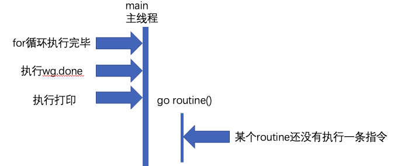

推荐阅读《Concurreny in go》


# Goroutine

1. Leave concurrency to the caller

把并发执行留给调用者来决定。

首先来看下面两个函数

```go
func ListDirectory(dir string) ([]string, error)

func ListDirectory(dir string) chan string
```

问题：

+ 将目录读取到一个 slice 中，然后返回整个切片，或者如果出现错误，则返回错误。这是同步调用的，ListDirectory 的调用方会阻塞，直到读取所有目录条目。根据目录的大小，这可能需要很长时间，并且可能会分配大量内存来构建目录条目名称的 slice。

+ 返回chan的方式具有几个问题
  + ListDirectory 返回一个 chan string，将通过该 chan 传递目录。当通道关闭时，这表示不再有目录。由于在 ListDirectory 返回后发生通道的填充，ListDirectory 可能内部启动 goroutine 来填充通道。
  + 通过使用一个关闭的通道作为不再需要处理的项目的信号，*ListDirectory* 无法告诉调用者通过通道返回的项目集不完整，因为中途遇到了错误。调用方无法区分空目录与完全从目录读取的错误之间的区别。这两种方法都会导致从 *ListDirectory* 返回的通道会立即关闭。
  + 调用者必须持续从通道读取，直到它关闭，因为这是调用者知道填充 *chan* 的 *goroutine* 已经停止的唯一方法。这对 *ListDirectory* 的使用是一个严重的限制，调用者必须花时间从通道读取数据，即使它可能已经收到了它想要的答案。对于大中型目录，它可能在内存使用方面更为高校，但这种方法并不比原始的基于 *slice* 的方法快。

解决:

```go
func ListDirectory(dir string, fn func(string))
```

==通常，将异步执行函数的决定权交给该函数的调用方通常更容易。==

2. Never start a goroutine without konwing when it will stop

==谁创建的goroutine，谁为goroutine的生命周期负责==

如下一个函数：

```go
//模拟一个长时间的函数调用
func Search() {
	ctx, cancel := context.WithCancel(context.Background())

	// 模拟一个函数调用，花费2s
	ch := make(chan struct{})
	go func() {
		time.Sleep(2 * time.Second)
		ch <- struct{}{}
	}()

	// 一秒后执行cancel
	cancel()

	select {
	case <-ctx.Done():
		fmt.Println("ctx done")
	case <-ch:
		fmt.Println("ch done")
	}

  time.Sleep(2 * time.Second)
	// 输出2，goroutine泄露
	fmt.Println(runtime.NumGoroutine())
}
```

分析:ch是一个无缓冲通道。发送时必须有人接收。我们在1s后执行了`cancel()`。所以用`ch<-struct{}`将会一直阻塞.无人清理，造成goroutine泄露。

怎么办？

初始化ch的时候给一个缓冲区即可

```go
//模拟一个长时间的函数调用
func Search() {
	ctx, cancel := context.WithCancel(context.Background())

	// 模拟一个函数调用，花费2s
	ch := make(chan struct{}, 1)
	go func() {
		time.Sleep(2 * time.Second)
		ch <- struct{}{}
	}()

	// 一秒后执行cancel
	cancel()

	select {
	case <-ctx.Done():
		fmt.Println("ctx done")
	case <-ch:
		fmt.Println("ch done")
	}

	time.Sleep(2 * time.Second)
	// 输出1
	fmt.Println(runtime.NumGoroutine())
}
```

----

下面看看另一个例子

```go
func main() {
	go Find()
}

//模拟一个长时间的函数调用
func Find() {
	rand.Seed(time.Now().UnixNano())

	// 一个10秒内的退出函数
	t := rand.Int31n(11)
	time.Sleep(time.Duration(t) * time.Second)

	fmt.Println("函数退出")
}
```

我们无法控制`Find()`函数的生命周期。

如果我们的主函数需要退出。我们需要能够让`Find`一同退出。这有非常多种的实现方式。下面列出了一种

```go
func main() {
	wg := sync.WaitGroup{}
	wg.Add(1)
	go func() {
		defer wg.Done()

		done := Find()
		defer close(done)
		time.Sleep(3 * time.Second)
	}()
	wg.Wait()

	// 等待一下打印
	time.Sleep(1 * time.Second)
}

//模拟一个长时间的函数调用
func Find() chan struct{} {
	// 函数执行结束信号
	stop := make(chan struct{})
	// 函数正常完成信号
	done := make(chan struct{})

	go func() {
		_find(done)
		select {
		case <-stop:
			fmt.Println("函数收到信号退出")
		case <-done:
			fmt.Println("函数正常退出")
		}
	}()

	return stop
}

func _find(done chan struct{}) {
	defer close(done)
	rand.Seed(time.Now().UnixNano())

	// 一个10秒内的退出函数
	t := rand.Int31n(11)
	fmt.Printf("函数执行时间为:%ds\n", t)
	time.Sleep(time.Duration(t) * time.Second)
}
```

# Memory model

如何保证在一个 *goroutine* 中看到在另一个 *goroutine* 修改的变量的值，如果程序中修改数据时有其他 *goroutine* 同时读取，那么必须将读取串行化。为了串行化访问，请使用 *channel* 或其他同步原语，例如 *sync* 和 *sync/atomic* 来保护数据。

用户写下的代码，先要编译成汇编代码，也就是各种指令，包括读写内存的指令。CPU 的设计者们，为了榨干 CPU 的性能，无所不用其极，各种手段都用上了，你可能听过不少，像流水线、分支预测等等。其中，为了提高读写内存的效率，会对读写指令进行重新排列，这就是所谓的内存重排，英文为 MemoryReordering。

1. Happens Before

为了说明读和写的必要条件，我们定义了先行发生（Happens Before）。如果事件 e1 发生在 e2 前，我们可以说 e2 发生在 e1 后。如果 e1不发生在 e2 前也不发生在 e2 后，我们就说 e1 和 e2 是并发的。

当下面条件满足时，对变量 v 的读操作 r 是被允许看到对 v 的写操作 w 的：

1. *r* 不先行发生于 *w*
2. 在 *w* 后 *r* 前没有对 *v* 的其他写操作

为了保证对变量 v 的读操作 r 看到对 v 的写操作 w，要确保 w 是 r 允许看到的唯一写操作。即当下面条件满足时，r 被保证看到 w：

1. *w* 先行发生于 *r*
2. 其他对共享变量 *v* 的写操作要么在 *w* 前，要么在 *r* 后。

==这一对条件比前面的条件更严格，需要没有其他写操作与 *w* 或 *r* 并发发生。==

单个 goroutine 中没有并发，所以上面两个定义是相同的：

读操作 r 看到最近一次的写操作 w 写入 v 的值。

当多个 goroutine 访问共享变量 v 时，它们必须使用同步事件来建立先行发生这一条件来保证读操作能看到需要的写操作。 

- 对变量 *v* 的零值初始化在内存模型中表现的与写操作相同。
- 对大于 *single machine word* 的变量的读写操作表现的像以不确定顺序对多个 *single machine word* 的变量的操作。


# 补充

1. `waitGroup/atomic`并发问题

==我在结合使用waitGroup和atomic的时候遇到了一个很有意思的问题==。查看如下代码：

```go
var wg sync.WaitGroup
var counter int64

func main() {
 // 多跑几次来看结果
 for i := 1; i <= 100000; i++ {
  go routine(1)
 }
 wg.Wait()
 fmt.Printf("Final Counter: %d\n", atomic.LoadInt64(&counter))
}

func routine(id int) {
 wg.Add(1)
 defer wg.Done()
 atomic.AddInt64(&counter, 1)
}
```

在我的代码里。`waitGroup`控制并发`goroutine`。而`atomic`原子的操作`counter`。

看起来最终结果`counter`应该返回结果是`100000`。实际上经常不够。

> 哪里出现了问题？

答案在于：for循环运行的太快。



当我们把并发执行的`每个程序/语句`想象的无限长，就可以理解了

改造：在for循环执行`wg.Add`

```go
var wg sync.WaitGroup
var counter int64

func main() {
	// 多跑几次来看结果
	for i := 1; i <= 100000; i++ {
		wg.Add(1)
		go routine(1)
	}
	wg.Wait()
	fmt.Printf("Final Counter: %d\n", atomic.LoadInt64(&counter))
}

func routine(id int) {
	defer wg.Done()
	atomic.AddInt64(&counter, 1)
}
```

