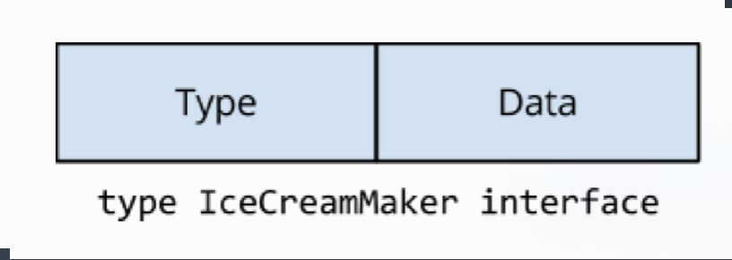
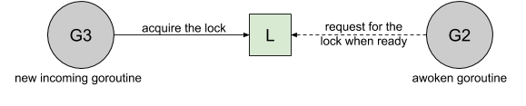
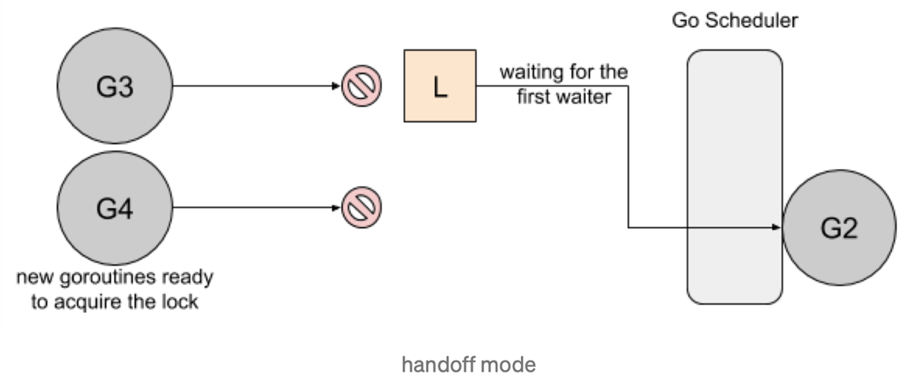
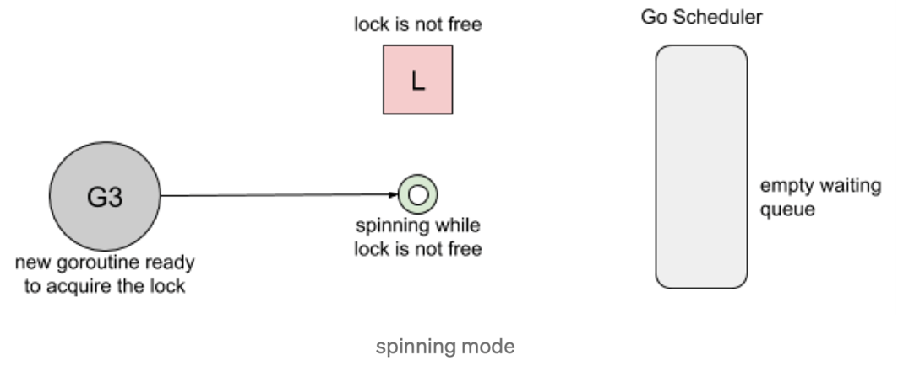
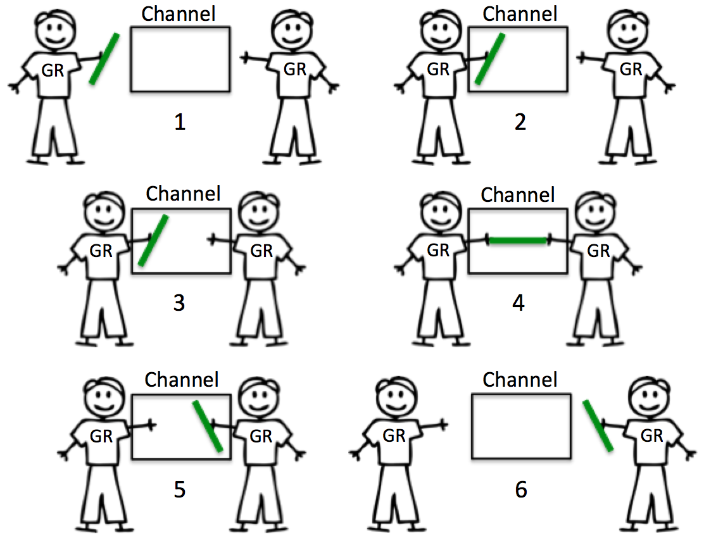
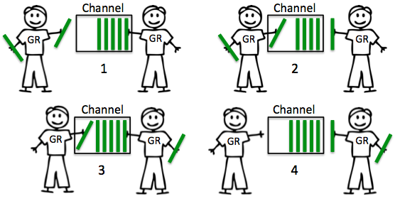
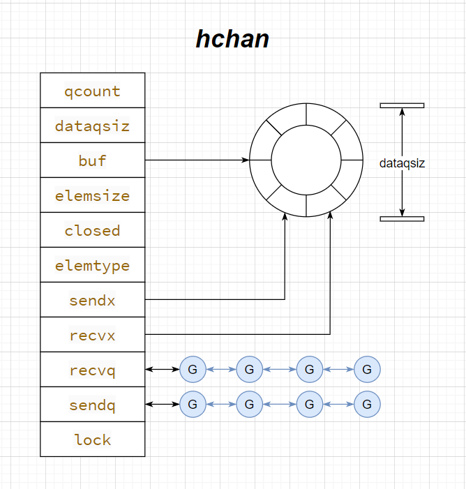

推荐阅读《Concurreny in go》


# Goroutine

##  Leave concurrency to the caller

把并发执行留给调用者来决定。

首先来看下面两个函数

```go
func ListDirectory(dir string) ([]string, error)

func ListDirectory(dir string) chan string
```

问题：

+ 将目录读取到一个 slice 中，然后返回整个切片，或者如果出现错误，则返回错误。这是同步调用的，ListDirectory 的调用方会阻塞，直到读取所有目录条目。根据目录的大小，这可能需要很长时间，并且可能会分配大量内存来构建目录条目名称的 slice。

+ 返回chan的方式具有几个问题
  + ListDirectory 返回一个 chan string，将通过该 chan 传递目录。当通道关闭时，这表示不再有目录。由于在 ListDirectory 返回后发生通道的填充，ListDirectory 可能内部启动 goroutine 来填充通道。
  + 通过使用一个关闭的通道作为不再需要处理的项目的信号，*ListDirectory* 无法告诉调用者通过通道返回的项目集不完整，因为中途遇到了错误。调用方无法区分空目录与完全从目录读取的错误之间的区别。这两种方法都会导致从 *ListDirectory* 返回的通道会立即关闭。
  + 调用者必须持续从通道读取，直到它关闭，因为这是调用者知道填充 *chan* 的 *goroutine* 已经停止的唯一方法。这对 *ListDirectory* 的使用是一个严重的限制，调用者必须花时间从通道读取数据，即使它可能已经收到了它想要的答案。对于大中型目录，它可能在内存使用方面更为高校，但这种方法并不比原始的基于 *slice* 的方法快。

解决:

```go
func ListDirectory(dir string, fn func(string))
```

==通常，将异步执行函数的决定权交给该函数的调用方通常更容易。==

## Never start a goroutine without konwing when it will stop

==谁创建的goroutine，谁为goroutine的生命周期负责==

如下一个函数：

```go
//模拟一个长时间的函数调用
func Search() {
	ctx, cancel := context.WithCancel(context.Background())

	// 模拟一个函数调用，花费2s
	ch := make(chan struct{})
	go func() {
		time.Sleep(2 * time.Second)
		ch <- struct{}{}
	}()

	// 一秒后执行cancel
	cancel()

	select {
	case <-ctx.Done():
		fmt.Println("ctx done")
	case <-ch:
		fmt.Println("ch done")
	}

  time.Sleep(2 * time.Second)
	// 输出2，goroutine泄露
	fmt.Println(runtime.NumGoroutine())
}
```

分析:ch是一个无缓冲通道。发送时必须有人接收。我们在1s后执行了`cancel()`。所以用`ch<-struct{}`将会一直阻塞.无人清理，造成goroutine泄露。

怎么办？

初始化ch的时候给一个缓冲区即可

```go
//模拟一个长时间的函数调用
func Search() {
	ctx, cancel := context.WithCancel(context.Background())

	// 模拟一个函数调用，花费2s
	ch := make(chan struct{}, 1)
	go func() {
		time.Sleep(2 * time.Second)
		ch <- struct{}{}
	}()

	// 一秒后执行cancel
	cancel()

	select {
	case <-ctx.Done():
		fmt.Println("ctx done")
	case <-ch:
		fmt.Println("ch done")
	}

	time.Sleep(2 * time.Second)
	// 输出1
	fmt.Println(runtime.NumGoroutine())
}
```

----

下面看看另一个例子

```go
func main() {
	go Find()
}

//模拟一个长时间的函数调用
func Find() {
	rand.Seed(time.Now().UnixNano())

	// 一个10秒内的退出函数
	t := rand.Int31n(11)
	time.Sleep(time.Duration(t) * time.Second)

	fmt.Println("函数退出")
}
```

我们无法控制`Find()`函数的生命周期。

如果我们的主函数需要退出。我们需要能够让`Find`一同退出。这有非常多种的实现方式。下面列出了一种

```go
func main() {
	wg := sync.WaitGroup{}
	wg.Add(1)
	go func() {
		defer wg.Done()

		done := Find()
		defer close(done)
		time.Sleep(3 * time.Second)
	}()
	wg.Wait()

	// 等待一下打印
	time.Sleep(1 * time.Second)
}

//模拟一个长时间的函数调用
func Find() chan struct{} {
	// 函数执行结束信号
	stop := make(chan struct{})
	// 函数正常完成信号
	done := make(chan struct{})

	go func() {
		_find(done)
		select {
		case <-stop:
			fmt.Println("函数收到信号退出")
		case <-done:
			fmt.Println("函数正常退出")
		}
	}()

	return stop
}

func _find(done chan struct{}) {
	defer close(done)
	rand.Seed(time.Now().UnixNano())

	// 一个10秒内的退出函数
	t := rand.Int31n(11)
	fmt.Printf("函数执行时间为:%ds\n", t)
	time.Sleep(time.Duration(t) * time.Second)
}
```

# Memory model

如何保证在一个 *goroutine* 中看到在另一个 *goroutine* 修改的变量的值，如果程序中修改数据时有其他 *goroutine* 同时读取，那么必须将读取串行化。为了串行化访问，请使用 *channel* 或其他同步原语，例如 *sync* 和 *sync/atomic* 来保护数据。

用户写下的代码，先要编译成汇编代码，也就是各种指令，包括读写内存的指令。CPU 的设计者们，为了榨干 CPU 的性能，无所不用其极，各种手段都用上了，你可能听过不少，像流水线、分支预测等等。其中，为了提高读写内存的效率，会对读写指令进行重新排列，这就是所谓的内存重排，英文为 MemoryReordering。

## Happens Before

为了说明读和写的必要条件，我们定义了先行发生（Happens Before）。如果事件 e1 发生在 e2 前，我们可以说 e2 发生在 e1 后。如果 e1不发生在 e2 前也不发生在 e2 后，我们就说 e1 和 e2 是并发的。

当下面条件满足时，对变量 v 的读操作 r 是被允许看到对 v 的写操作 w 的：

1. *r* 不先行发生于 *w*
2. 在 *w* 后 *r* 前没有对 *v* 的其他写操作

为了保证对变量 v 的读操作 r 看到对 v 的写操作 w，要确保 w 是 r 允许看到的唯一写操作。即当下面条件满足时，r 被保证看到 w：

1. *w* 先行发生于 *r*
2. 其他对共享变量 *v* 的写操作要么在 *w* 前，要么在 *r* 后。

==这一对条件比前面的条件更严格，需要没有其他写操作与 *w* 或 *r* 并发发生。==

单个 goroutine 中没有并发，所以上面两个定义是相同的：

读操作 r 看到最近一次的写操作 w 写入 v 的值。

当多个 goroutine 访问共享变量 v 时，它们必须使用同步事件来建立先行发生这一条件来保证读操作能看到需要的写操作。 

- 对变量 *v* 的零值初始化在内存模型中表现的与写操作相同。
- 对大于 *single machine word* 的变量的读写操作表现的像以不确定顺序对多个 *single machine word* 的变量的操作。

# Package sync

## data race

*data race* 是两个或多个 *goroutine* 访问同一个资源（如变量或数据结构），并尝试对该资源进行读写而不考虑其他 *goroutine*。这种类型的代码可以创建您见过的最疯狂和最随机的 *bug*。通常需要大量的日志记录和运气才能找到这些类型的*bug*。

官方早在 1.1 版本就引入了数据竞争的检测工具，我们只需要在执行测试或者是编译的时候加上 `-race` 的 flag 就可以开启数据竞争的检测

一个有趣的例子：

```go
package main

import "fmt"

type IceCreamMaker interface {
	// Great a customer.
	Hello()
}

type Ben struct {
	name string
}

func (b *Ben) Hello() {
	fmt.Printf("Ben says, \"Hello my name is %s\"\n", b.name)
}

type Jerry struct {
	name string
}

func (j *Jerry) Hello() {
	fmt.Printf("Jerry says, \"Hello my name is %s\"\n", j.name)
}

func main() {
	var ben = &Ben{name: "Ben"}
	var jerry = &Jerry{"Jerry"}
	var maker IceCreamMaker = ben

	var loop0, loop1 func()

	loop0 = func() {
		maker = ben
		go loop1()
	}

	loop1 = func() {
		maker = jerry
		go loop0()
	}

	go loop0()

	for {
		maker.Hello()
	}
}
```

有趣的地方在于：会出现下面的问题


我们知道，`single machine word`赋值是原子的。

在`interface`底层实现中，是有两个值得。一个是类型，另一个才是具体的值。



上面的情况在于：`Type`被更新为`Ben`。但是对应的`Data`并没有被更新

[示例代码](https://github.com/Yefangbiao/study-co/tree/main/Go-training/go-advance/chapter3/ice_cream)

---

在这个例子中，*Ben* 和 *Jerry* 内存结构布局是相同的，因此它们在某种意义上是兼容的。想象一下，如果他们有不同的内存布局会发生什么混乱？

==会报错==:如果出现上面的情况，即`Type`和`Data`没有对应。go通过反射来找值，会panic。

---

总结：

- 善用 data race 这个工具帮助我们提前发现并发错误
- 不要对未定义的行为做任何假设，虽然有时候我们写的只是一行代码，但是 go 编译器可能后面坐了很多事情，并不是说一行写完就一定是原子的
- 即使是原子的出现了 data race 也不能保证安全，因为我们还有可见性的问题，上篇我们讲到了现代的 cpu 基本上都会有一些缓存的操作。
- 所有出现了 data race 的地方都需要进行处理

## sync.atomic

如果去看文档会发现 atomic 的函数签名有很多，但是大部分都是重复的为了不同的数据类型创建了不同的签名，这就是没有泛型的坏处了，基础库会比较麻烦

+ 第一类 `AddXXX` 当需要添加的值为负数的时候，做减法，正数做加法

```go
// 第一类，AddXXX，delta 为
func AddInt32(addr *int32, delta int32) (new int32)
func AddInt64(addr *int64, delta int64) (new int64)
func AddUint32(addr *uint32, delta uint32) (new uint32)
func AddUint64(addr *uint64, delta uint64) (new uint64)
func AddUintptr(addr *uintptr, delta uintptr) (new uintptr)
```

+ 第二类 `CompareAndSwapXXX` CAS 操作， 会先比较传入的地址的值是否是 old，如果是的话就尝试赋新值，如果不是的话就直接返回 false，返回 true 时表示赋值成功。

```go
func CompareAndSwapInt32(addr *int32, old, new int32) (swapped bool)
func CompareAndSwapInt64(addr *int64, old, new int64) (swapped bool)
func CompareAndSwapPointer(addr *unsafe.Pointer, old, new unsafe.Pointer) (swapped bool)
func CompareAndSwapUint32(addr *uint32, old, new uint32) (swapped bool)
func CompareAndSwapUint64(addr *uint64, old, new uint64) (swapped bool)
func CompareAndSwapUintptr(addr *uintptr, old, new uintptr) (swapped bool)
```

+ 第三类 `LoadXXX` ，从某个地址中取值

```go
func LoadInt32(addr *int32) (val int32)
func LoadInt64(addr *int64) (val int64)
func LoadPointer(addr *unsafe.Pointer) (val unsafe.Pointer)
func LoadUint32(addr *uint32) (val uint32)
func LoadUint64(addr *uint64) (val uint64)
func LoadUintptr(addr *uintptr) (val uintptr)
```

+ 第四类 `StoreXXX` ，给某个地址赋值

```go
func StoreInt32(addr *int32, val int32)
func StoreInt64(addr *int64, val int64)
func StorePointer(addr *unsafe.Pointer, val unsafe.Pointer)
func StoreUint32(addr *uint32, val uint32)
func StoreUint64(addr *uint64, val uint64)
func StoreUintptr(addr *uintptr, val uintptr)
```

+ 第五类 `SwapXXX` ，交换两个值，并且返回老的值

```go
func SwapInt32(addr *int32, new int32) (old int32)
func SwapInt64(addr *int64, new int64) (old int64)
func SwapPointer(addr *unsafe.Pointer, new unsafe.Pointer) (old unsafe.Pointer)
func SwapUint32(addr *uint32, new uint32) (old uint32)
func SwapUint64(addr *uint64, new uint64) (old uint64)
func SwapUintptr(addr *uintptr, new uintptr) (old uintptr)
```

+ 最后一类 `Value` 用于任意类型的值的 Store、Load。签名的方法都只能作用于特定的类型，引入这个方法之后就可以用于任意类型了。

```go
type Value
func (v *Value) Load() (x interface{})
func (v *Value) Store(x interface{})
```

重点讲解一下`atomic.Value`

查看下面的代码：

```go
package main

import (
	"fmt"
	"sync/atomic"
)

type Coin struct {
	Num   int
	Total int
}

func main() {
	c1 := &Coin{
		Num:   5,
		Total: 15,
	}
	c2 := &Coin{
		Num:   10,
		Total: 20,
	}

	var value atomic.Value

	var loop0, loop1 func()
	loop0 = func() {
		value.Store(c1)
		go loop1()
	}

	loop1 = func() {
		value.Store(c2)
		go loop0()
	}

	go loop0()
	for {
		fmt.Println(value.Load())
	}
}
```

绝不会出现错误的情况，与刚才的例子形成鲜明对比。

[示例代码](https://github.com/Yefangbiao/study-co/tree/main/Go-training/go-advance/chapter3/atomic)

总结:

虽然在一些情况下 atomic 的性能要好很多，但是这个是一个 low level 的库，在实际的业务代码中最好还是使用 channel 但是我们也需要知道，在一些基础库，或者是需要极致性能的地方用上这个还是很爽的，但是使用的过程中一定要小心，不然还是会容易出 bug。

`atomic.Value` 这种适合配置文件这种读特别多，写特别少的场景，因为他是 COW（Copy On Write）写时复制的一种思想，COW 就是指我需要写入的时候我先把老的数据复制一份到一个新的对象，然后再写入新的值。

> 写入时复制（英语：Copy-on-write，简称 COW）是一种计算机程序设计领域的优化策略。其核心思想是，如果有多个调用者（callers）同时请求相同资源（如内存或磁盘上的数据存储），他们会共同获取相同的指针指向相同的资源，直到某个调用者试图修改资源的内容时，系统才会真正复制一份专用副本（private copy）给该调用者，而其他调用者所见到的最初的资源仍然保持不变。这过程对其他的调用者都是透明的。此作法主要的优点是如果调用者没有修改该资源，就不会有副本（private copy）被创建，因此多个调用者只是读取操作时可以共享同一份资源。

## sync.Mutex

==锁的实现模式==

+ **Barging**: 这种模式是为了提高吞吐量，当锁被释放时，它会唤醒第一个等待者，然后把锁给第一个等待者或者给第一个请求锁的人



+ **Handoff:** 当锁释放时候，锁会一直持有直到第一个等待者准备好获取锁。它降低了吞吐量，因为锁被持有，即使另一个 goroutine 准备获取它。这种模式可以解决公平性的问题，因为在 Barging 模式下可能会存在被唤醒的 goroutine 永远也获取不到锁的情况，毕竟一直在 cpu 上跑着的 goroutine 没有上下文切换会更快一些。缺点就是性能会相对差一些



+ **Spining：**自旋在等待队列为空或者应用程序重度使用锁时效果不错。Parking 和 Unparking goroutines 有不低的性能成本开销，相比自旋来说要慢得多。***但是自旋是有成本的，所以在 go 的实现中进入自旋的条件十分的苛刻。***




==go中锁的实现原理==

+ 加锁

1. 首先如果当前锁处于初始化状态就直接用 CAS 方法尝试获取锁，这是**_ Fast Path_**

2. 如果失败就进入

    *Slow Path*

   1. 会首先判断当前能不能进入自旋状态，如果可以就进入自旋，最多自旋 4 次
   2. 自旋完成之后，就会去计算当前的锁的状态
   3. 然后尝试通过 CAS 获取锁
   4. 如果没有获取到就调用 `runtime_SemacquireMutex` 方法休眠当前 goroutine 并且尝试获取信号量
   5. goroutine 被唤醒之后会先判断当前是否处在饥饿状态，（如果当前 goroutine 超过 1ms 都没有获取到锁就会进饥饿模式） 1. 如果处在饥饿状态就会获得互斥锁，如果等待队列中只存在当前 Goroutine，互斥锁还会从饥饿模式中退出 1. 如果不在，就会设置唤醒和饥饿标记、重置迭代次数并重新执行获取锁的循环

> CAS 方法在这里指的是 `atomic.CompareAndSwapInt32(addr, old, new) bool` 方法，这个方法会先比较传入的地址的值是否是 old，如果是的话就尝试赋新值，如果不是的话就直接返回 false，返回 true 时表示赋值成功
> 饥饿模式是 Go 1.9 版本之后引入的优化，用于解决公平性的问题[10]


+ 解锁

解锁的流程相对于加锁简单许多


==Mutex 基本结构==

知道其中的原理之后，我们再来看看源码分析

```go
type Mutex struct {
	state int32
	sema  uint32
}
Copy
```

`Mutex` 结构体由 `state` `sema` 两个 4 字节成员组成，其中 `state` 表示了当前锁的状态， `sema` 是用于控制锁的信号量
[](https://img.lailin.xyz/image/1608972241012-8c0fe8e2-b1c8-4696-a9c4-454e11753e0f.svg)

`state` 字段的最低三位表示三种状态，分别是 `mutexLocked` `mutexWoken` `mutexStarving` ，剩下的用于统计当前在等待锁的 goroutine 数量

- `mutexLocked` 表示是否处于锁定状态
- `mutexWoken` 表示是否处于唤醒状态
- `mutexStarving` 表示是否处于饥饿状态

**加锁**

回味一下上面看到的流程图，我们来看看互斥锁是如何加锁的

```go
func (m *Mutex) Lock() {
	// Fast path: grab unlocked mutex.
	if atomic.CompareAndSwapInt32(&m.state, 0, mutexLocked) {
		return
	}
	// Slow path (outlined so that the fast path can be inlined)
	m.lockSlow()
}
Copy
```

- 当我们调用 `Lock` 方法的时候，会先尝试走 Fast Path，也就是如果当前互斥锁如果处于未加锁的状态，尝试加锁，只要加锁成功就直接返回
- 否则的话就进入 slow path

```go
func (m *Mutex) lockSlow() {
	var waitStartTime int64 // 等待时间
	starving := false // 是否处于饥饿状态
	awoke := false // 是否处于唤醒状态
	iter := 0 // 自旋迭代次数
	old := m.state
	for {
		// Don't spin in starvation mode, ownership is handed off to waiters
		// so we won't be able to acquire the mutex anyway.
		if old&(mutexLocked|mutexStarving) == mutexLocked && runtime_canSpin(iter) {
			// Active spinning makes sense.
			// Try to set mutexWoken flag to inform Unlock
			// to not wake other blocked goroutines.
			if !awoke && old&mutexWoken == 0 && old>>mutexWaiterShift != 0 &&
				atomic.CompareAndSwapInt32(&m.state, old, old|mutexWoken) {
				awoke = true
			}
			runtime_doSpin()
			iter++
			old = m.state
			continue
		}
```

在 `lockSlow` 方法中我们可以看到，有一个大的 for 循环，不断的尝试去获取互斥锁，在循环的内部，第一步就是判断能否自旋状态。

进入自旋状态的判断比较苛刻，具体需要满足什么条件呢？ `runtime_canSpin` 源码见下方

- 当前互斥锁的状态是非饥饿状态，并且已经被锁定了
- 自旋次数不超过 4 次
- cpu 个数大于一，必须要是多核 cpu
- 当前正在执行当中，并且队列空闲的 p 的个数大于等于一

```go
// Active spinning for sync.Mutex.
//go:linkname sync_runtime_canSpin sync.runtime_canSpin
//go:nosplit
func sync_runtime_canSpin(i int) bool {
	if i >= active_spin || ncpu <= 1 || gomaxprocs <= int32(sched.npidle+sched.nmspinning)+1 {
		return false
	}
	if p := getg().m.p.ptr(); !runqempty(p) {
		return false
	}
	return true
}
```

如果可以进入自旋状态之后就会调用 `runtime_doSpin` 方法进入自旋， `doSpin` 方法会调用 `procyield(30)` 执行三十次 `PAUSE` 指令

```go
TEXT runtime·procyield(SB),NOSPLIT,$0-0
	MOVL	cycles+0(FP), AX
again:
	PAUSE
	SUBL	$1, AX
	JNZ	again
	RET
```

> 为什么使用 PAUSE 指令呢？
> PAUSE 指令会告诉 CPU 我当前处于处于自旋状态，这时候 CPU 会针对性的做一些优化，并且在执行这个指令的时候 CPU 会降低自己的功耗，减少能源消耗

```go
if !awoke && old&mutexWoken == 0 && old>>mutexWaiterShift != 0 &&
	atomic.CompareAndSwapInt32(&m.state, old, old|mutexWoken) {
	awoke = true
}
```

在自旋的过程中会尝试设置 `mutexWoken` 来通知解锁，从而避免唤醒其他已经休眠的 `goroutine` 在自旋模式下，当前的 `goroutine` 就能更快的获取到锁

```go
new := old
// Don't try to acquire starving mutex, new arriving goroutines must queue.
if old&mutexStarving == 0 {
	new |= mutexLocked
}
if old&(mutexLocked|mutexStarving) != 0 {
	new += 1 << mutexWaiterShift
}
// The current goroutine switches mutex to starvation mode.
// But if the mutex is currently unlocked, don't do the switch.
// Unlock expects that starving mutex has waiters, which will not
// be true in this case.
if starving && old&mutexLocked != 0 {
	new |= mutexStarving
}
if awoke {
	// The goroutine has been woken from sleep,
	// so we need to reset the flag in either case.
	if new&mutexWoken == 0 {
		throw("sync: inconsistent mutex state")
	}
	new &^= mutexWoken
}
```

自旋结束之后就会去计算当前互斥锁的状态，如果当前处在饥饿模式下则不会去请求锁，而是会将当前 goroutine 放到队列的末端

```go
if atomic.CompareAndSwapInt32(&m.state, old, new) {
    if old&(mutexLocked|mutexStarving) == 0 {
        break // locked the mutex with CAS
    }
    // If we were already waiting before, queue at the front of the queue.
    queueLifo := waitStartTime != 0
    if waitStartTime == 0 {
        waitStartTime = runtime_nanotime()
    }
    runtime_SemacquireMutex(&m.sema, queueLifo, 1)
    starving = starving || runtime_nanotime()-waitStartTime > starvationThresholdNs
    old = m.state
    if old&mutexStarving != 0 {
        // If this goroutine was woken and mutex is in starvation mode,
        // ownership was handed off to us but mutex is in somewhat
        // inconsistent state: mutexLocked is not set and we are still
        // accounted as waiter. Fix that.
        if old&(mutexLocked|mutexWoken) != 0 || old>>mutexWaiterShift == 0 {
            throw("sync: inconsistent mutex state")
        }
        delta := int32(mutexLocked - 1<<mutexWaiterShift)
        if !starving || old>>mutexWaiterShift == 1 {
            // Exit starvation mode.
            // Critical to do it here and consider wait time.
            // Starvation mode is so inefficient, that two goroutines
            // can go lock-step infinitely once they switch mutex
            // to starvation mode.
            delta -= mutexStarving
        }
        atomic.AddInt32(&m.state, delta)
        break
    }
    awoke = true
    iter = 0
}
Copy
```


状态计算完成之后就会尝试使用 CAS 操作获取锁，如果获取成功就会直接退出循环
如果获取失败，则会调用 `runtime_SemacquireMutex(&m.sema, queueLifo, 1)` 方法保证锁不会同时被两个 goroutine 获取。`runtime_SemacquireMutex` 方法的主要作用是:


- 不断调用尝试获取锁
- 休眠当前 goroutine
- 等待信号量，唤醒 goroutine

goroutine 被唤醒之后就会去判断当前是否处于饥饿模式，如果当前等待超过 `1ms` 就会进入饥饿模式

- 饥饿模式下：会获得互斥锁，如果等待队列中只存在当前 Goroutine，互斥锁还会从饥饿模式中退出
- 正常模式下：会设置唤醒和饥饿标记、重置迭代次数并重新执行获取锁的循环

**解锁**

和加锁比解锁就很简单了，直接看注释就好

```go
// 解锁一个没有锁定的互斥量会报运行时错误
// 解锁没有绑定关系，可以一个 goroutine 锁定，另外一个 goroutine 解锁
func (m *Mutex) Unlock() {
	// Fast path: 直接尝试设置 state 的值，进行解锁
	new := atomic.AddInt32(&m.state, -mutexLocked)
    // 如果减去了 mutexLocked 的值之后不为零就会进入慢速通道，这说明有可能失败了，或者是还有其他的 goroutine 等着
	if new != 0 {
		// Outlined slow path to allow inlining the fast path.
		// To hide unlockSlow during tracing we skip one extra frame when tracing GoUnblock.
		m.unlockSlow(new)
	}
}

func (m *Mutex) unlockSlow(new int32) {
    // 解锁一个没有锁定的互斥量会报运行时错误
	if (new+mutexLocked)&mutexLocked == 0 {
		throw("sync: unlock of unlocked mutex")
	}
    // 判断是否处于饥饿模式
	if new&mutexStarving == 0 {
        // 正常模式
		old := new
		for {
			// 如果当前没有等待者.或者 goroutine 已经被唤醒或者是处于锁定状态了，就直接返回
			if old>>mutexWaiterShift == 0 || old&(mutexLocked|mutexWoken|mutexStarving) != 0 {
				return
			}
			// 唤醒等待者并且移交锁的控制权
			new = (old - 1<<mutexWaiterShift) | mutexWoken
			if atomic.CompareAndSwapInt32(&m.state, old, new) {
				runtime_Semrelease(&m.sema, false, 1)
				return
			}
			old = m.state
		}
	} else {
		// 饥饿模式，走 handoff 流程，直接将锁交给下一个等待的 goroutine，注意这个时候不会从饥饿模式中退出
		runtime_Semrelease(&m.sema, true, 1)
	}
}
```

### RWMutex

读写锁相对于互斥锁来说粒度更细，使用读写锁可以并发读，但是不能并发读写，或者并发写写

|      | **读** | **写** |
| :--: | :----: | :----: |
|  读  |   Y    |   N    |
|  写  |   N    |   N    |

==案例==

其实大部分的业务应用都是读多写少的场景，这个时候使用读写锁的性能就会比互斥锁要好一些，例如下面的这个例子，是一个配置读写的例子，我们分别使用读写锁和互斥锁实现

```go
// RWMutexConfig 读写锁实现
type RWMutexConfig struct {
	rw   sync.RWMutex
	data []int
}

// Get get config data
func (c *RWMutexConfig) Get() []int {
	c.rw.RLock()
	defer c.rw.RUnlock()
	return c.data
}

// Set set config data
func (c *RWMutexConfig) Set(n []int) {
	c.rw.Lock()
	defer c.rw.Unlock()
	c.data = n
}
Copy
```

互斥锁实现

```go
// MutexConfig 互斥锁实现
type MutexConfig struct {
	data []int
	mu   sync.Mutex
}

// Get get config data
func (c *MutexConfig) Get() []int {
	c.mu.Lock()
	defer c.mu.Unlock()
	return c.data
}

// Set set config data
func (c *MutexConfig) Set(n []int) {
	c.mu.Lock()
	defer c.mu.Unlock()
	c.data = n
}
Copy
```

并发基准测试

```go
type iConfig interface {
	Get() []int
	Set([]int)
}

func bench(b *testing.B, c iConfig) {
	b.RunParallel(func(p *testing.PB) {
		for p.Next() {
			c.Set([]int{100})
			c.Get()
			c.Get()
			c.Get()
			c.Set([]int{100})
			c.Get()
			c.Get()
		}
	})
}

func BenchmarkMutexConfig(b *testing.B) {
	conf := &MutexConfig{data: []int{1, 2, 3}}
	bench(b, conf)
}

func BenchmarkRWMutexConfig(b *testing.B) {
	conf := &RWMutexConfig{data: []int{1, 2, 3}}
	bench(b, conf)
}
Copy
```

执行结果

```go
❯ go test -race -bench=.
goos: linux
goarch: amd64
pkg: github.com/mohuishou/go-training/Week03/blog/04_sync/02_rwmutex
BenchmarkMutexConfig-4            179577              6912 ns/op
BenchmarkRWMutexConfig-4          341620              3425 ns/op
PASS
ok      github.com/mohuishou/go-training/Week03/blog/04_sync/02_rwmutex 3.565s
Copy
```

可以看到首先是没有 data race 问题，其次读写锁的性能几乎是互斥锁的一倍

==源码解析==

基本结构

```go
type RWMutex struct {
	w           Mutex  // 复用互斥锁
	writerSem   uint32 // 信号量，用于写等待读
	readerSem   uint32 // 信号量，用于读等待写
	readerCount int32  // 当前执行读的 goroutine 数量
	readerWait  int32  // 写操作被阻塞的准备读的 goroutine 的数量
}
Copy
```

由于复用了互斥锁的代码，读写锁的源码很简单，这里我就不单独画图了

**读锁**

加锁

```go
func (rw *RWMutex) RLock() {
	if atomic.AddInt32(&rw.readerCount, 1) < 0 {
		// A writer is pending, wait for it.
		runtime_SemacquireMutex(&rw.readerSem, false, 0)
	}
}
Copy
```

首先是读锁， `atomic.AddInt32(&rw.readerCount, 1)` 调用这个原子方法，对当前在读的数量加一，如果返回负数，那么说明当前有其他写锁，这时候就调用 `runtime_SemacquireMutex` 休眠 goroutine 等待被唤醒

解锁

```go
func (rw *RWMutex) RUnlock() {
	if r := atomic.AddInt32(&rw.readerCount, -1); r < 0 {
		// Outlined slow-path to allow the fast-path to be inlined
		rw.rUnlockSlow(r)
	}
}
Copy
```

解锁的时候对正在读的操作减一，如果返回值小于 0 那么说明当前有在写的操作，这个时候调用 `rUnlockSlow` 进入慢速通道

```go
func (rw *RWMutex) rUnlockSlow(r int32) {
	if r+1 == 0 || r+1 == -rwmutexMaxReaders {
		race.Enable()
		throw("sync: RUnlock of unlocked RWMutex")
	}
	// A writer is pending.
	if atomic.AddInt32(&rw.readerWait, -1) == 0 {
		// The last reader unblocks the writer.
		runtime_Semrelease(&rw.writerSem, false, 1)
	}
}
Copy
```

被阻塞的准备读的 goroutine 的数量减一，readerWait 为 0，就表示当前没有正在准备读的 goroutine 这时候调用 `runtime_Semrelease` 唤醒写操作

==写锁==

**加锁**

```go
func (rw *RWMutex) Lock() {
	// First, resolve competition with other writers.
	rw.w.Lock()
	// Announce to readers there is a pending writer.
	r := atomic.AddInt32(&rw.readerCount, -rwmutexMaxReaders) + rwmutexMaxReaders
	// Wait for active readers.
	if r != 0 && atomic.AddInt32(&rw.readerWait, r) != 0 {
		runtime_SemacquireMutex(&rw.writerSem, false, 0)
	}
}
Copy
```

首先调用互斥锁的 lock，获取到互斥锁之后，

- `atomic.AddInt32(&rw.readerCount, -rwmutexMaxReaders)` 调用这个函数阻塞后续的读操作
- 如果计算之后当前仍然有其他 goroutine 持有读锁，那么就调用 `runtime_SemacquireMutex` 休眠当前的 goroutine 等待所有的读操作完成

**解锁**

```go
func (rw *RWMutex) Unlock() {
	// Announce to readers there is no active writer.
	r := atomic.AddInt32(&rw.readerCount, rwmutexMaxReaders)
	if r >= rwmutexMaxReaders {
		race.Enable()
		throw("sync: Unlock of unlocked RWMutex")
	}
	// Unblock blocked readers, if any.
	for i := 0; i < int(r); i++ {
		runtime_Semrelease(&rw.readerSem, false, 0)
	}
}
Copy
```

解锁的操作，会先调用 `atomic.AddInt32(&rw.readerCount, rwmutexMaxReaders)` 将恢复之前写入的负数，然后根据当前有多少个读操作在等待，循环唤醒

## sync.WaitGroup

## 

```go
type WaitGroup struct {
	noCopy noCopy

	// 64-bit value: high 32 bits are counter, low 32 bits are waiter count.
	// 64-bit atomic operations require 64-bit alignment, but 32-bit
	// compilers do not ensure it. So we allocate 12 bytes and then use
	// the aligned 8 bytes in them as state, and the other 4 as storage
	// for the sema.
	state1 [3]uint32
}
```

`WaitGroup` 结构十分简单，由 `nocopy` 和 `state1` 两个字段组成，其中 `nocopy` 是用来防止复制的

```go
type noCopy struct{}

// Lock is a no-op used by -copylocks checker from `go vet`.
func (*noCopy) Lock()   {}
func (*noCopy) Unlock() {}
```

`state1` 的设计非常巧妙，这是一个是十二字节的数据，这里面主要包含两大块，counter 占用了 8 字节用于计数，sema 占用 4 字节用做信号量

为什么要这么搞呢？直接用两个字段一个表示 counter，一个表示 sema 不行么？
不行，我们看看注释里面怎么写的。

> *// 64-bit value: high 32 bits are counter, low 32 bits are waiter count.* > *// 64-bit atomic operations require 64-bit alignment, but 32-bit* > *// compilers do not ensure it. So we allocate 12 bytes and then use* > *// the aligned 8 bytes in them as state, and the other 4 as storage* > *// for the sema.*

这段话的关键点在于，在做 64 位的原子操作的时候必须要保证 64 位（8 字节）对齐，如果没有对齐的就会有问题，但是 32 位的编译器并不能保证 64 位对齐所以这里用一个 12 字节的 state1 字段来存储这两个状态，然后根据是否 8 字节对齐选择不同的保存方式。



这个操作巧妙在哪里呢？

- 如果是 64 位的机器那肯定是 8 字节对齐了的，所以是上面第一种方式
- 如果在 32 位的机器上
  - 如果恰好 8 字节对齐了，那么也是第一种方式取前面的 8 字节数据
  - 如果是没有对齐，但是 32 位 4 字节是对齐了的，所以我们只需要后移四个字节，那么就 8 字节对齐了，所以是第二种方式

所以通过 sema 信号量这四个字节的位置不同，保证了 counter 这个字段无论在 32 位还是 64 为机器上都是 8 字节对齐的，后续做 64 位原子操作的时候就没问题了。
这个实现是在 `state` 方法实现的

```go
func (wg *WaitGroup) state() (statep *uint64, semap *uint32) {
	if uintptr(unsafe.Pointer(&wg.state1))%8 == 0 {
		return (*uint64)(unsafe.Pointer(&wg.state1)), &wg.state1[2]
	} else {
		return (*uint64)(unsafe.Pointer(&wg.state1[1])), &wg.state1[0]
	}
}
```

`state` 方法返回 counter 和信号量，通过 `uintptr(unsafe.Pointer(&wg.state1))%8 == 0` 来判断是否 8 字节对齐

### Add

```go
func (wg *WaitGroup) Add(delta int) {
    // 先从 state 当中把数据和信号量取出来
	statep, semap := wg.state()

    // 在 waiter 上加上 delta 值
	state := atomic.AddUint64(statep, uint64(delta)<<32)
    // 取出当前的 counter
	v := int32(state >> 32)
    // 取出当前的 waiter，正在等待 goroutine 数量
	w := uint32(state)

    // counter 不能为负数
	if v < 0 {
		panic("sync: negative WaitGroup counter")
	}

    // 这里属于防御性编程
    // w != 0 说明现在已经有 goroutine 在等待中，说明已经调用了 Wait() 方法
    // 这时候 delta > 0 && v == int32(delta) 说明在调用了 Wait() 方法之后又想加入新的等待者
    // 这种操作是不允许的
	if w != 0 && delta > 0 && v == int32(delta) {
		panic("sync: WaitGroup misuse: Add called concurrently with Wait")
	}
    // 如果当前没有人在等待就直接返回，并且 counter > 0
	if v > 0 || w == 0 {
		return
	}

    // 这里也是防御 主要避免并发调用 add 和 wait
	if *statep != state {
		panic("sync: WaitGroup misuse: Add called concurrently with Wait")
	}

	// 唤醒所有 waiter，看到这里就回答了上面的问题了
	*statep = 0
	for ; w != 0; w-- {
		runtime_Semrelease(semap, false, 0)
	}
}
```

### Wait

wait 主要就是等待其他的 goroutine 完事之后唤醒

```go
func (wg *WaitGroup) Wait() {
	// 先从 state 当中把数据和信号量的地址取出来
    statep, semap := wg.state()

	for {
     	// 这里去除 counter 和 waiter 的数据
		state := atomic.LoadUint64(statep)
		v := int32(state >> 32)
		w := uint32(state)

        // counter = 0 说明没有在等的，直接返回就行
        if v == 0 {
			// Counter is 0, no need to wait.
			return
		}

		// waiter + 1，调用一次就多一个等待者，然后休眠当前 goroutine 等待被唤醒
		if atomic.CompareAndSwapUint64(statep, state, state+1) {
			runtime_Semacquire(semap)
			if *statep != 0 {
				panic("sync: WaitGroup is reused before previous Wait has returned")
			}
			return
		}
	}
}
```

### Done

这个只是 add 的简单封装

```go
func (wg *WaitGroup) Done() {
	wg.Add(-1)
}
```

==总结==

- `WaitGroup`

  可以用于一个 goroutine 等待多个 goroutine 干活完成，也可以多个 goroutine 等待一个 goroutine 干活完成，是一个多对多的关系

  - 多个等待一个的典型案例是 [singleflight](https://pkg.go.dev/golang.org/x/sync/singleflight)，这个在后面将微服务可用性的时候还会再讲到，感兴趣可以看看源码

- `Add(n>0)` 方法应该在启动 goroutine 之前调用，然后在 goroution 内部调用 `Done` 方法

- `WaitGroup` 必须在 `Wait` 方法返回之后才能再次使用

- `Done` 只是 `Add` 的简单封装，所以实际上是可以通过一次加一个比较大的值减少调用，或者达到快速唤醒的目的。

## sync.Once

once 的使用很简单

```
func main() {
	var (
		o  sync.Once
		wg sync.WaitGroup
	)

	for i := 0; i < 10; i++ {
		wg.Add(1)

		go func(i int) {
			defer wg.Done()
			o.Do(func() {
				fmt.Println("once", i)
			})
		}(i)
	}

	wg.Wait()
}
Copy
```

输出

```
❯ go run ./main.go
once 9
Copy
```

==源码分析==

```
type Once struct {
	done uint32
	m    Mutex
}
Copy
```

done 用于判定函数是否执行，如果不为 0 会直接返回

```
func (o *Once) Do(f func()) {
	// Note: Here is an incorrect implementation of Do:
	//
	//	if atomic.CompareAndSwapUint32(&o.done, 0, 1) {
	//		f()
	//	}
	//
	// Do guarantees that when it returns, f has finished.
	// This implementation would not implement that guarantee:
	// given two simultaneous calls, the winner of the cas would
	// call f, and the second would return immediately, without
	// waiting for the first's call to f to complete.
	// This is why the slow path falls back to a mutex, and why
	// the atomic.StoreUint32 must be delayed until after f returns.

	if atomic.LoadUint32(&o.done) == 0 {
		// Outlined slow-path to allow inlining of the fast-path.
		o.doSlow(f)
	}
}
Copy
```

看 go 的源码真的可以学到很多东西，在这里还给出了很容易犯错的一种实现

```
if atomic.CompareAndSwapUint32(&o.done, 0, 1) {
	f()
}
Copy
```

如果这么实现最大的问题是，如果并发调用，一个 goroutine 执行，另外一个不会等正在执行的这个成功之后返回，而是直接就返回了，这就不能保证传入的方法一定会先执行一次了
所以回头看官方的实现

```
if atomic.LoadUint32(&o.done) == 0 {
    // Outlined slow-path to allow inlining of the fast-path.
    o.doSlow(f)
}
Copy
```

会先判断 done 是否为 0，如果不为 0 说明还没执行过，就进入 `doSlow`

```
func (o *Once) doSlow(f func()) {
	o.m.Lock()
	defer o.m.Unlock()
	if o.done == 0 {
		defer atomic.StoreUint32(&o.done, 1)
		f()
	}
}
Copy
```

在 `doSlow` 当中使用了互斥锁来保证只会执行一次

==总结==

- Once 保证了传入的函数只会执行一次，这常用在单例模式，配置文件加载，初始化这些场景下
- 但是需要注意。Once 是不能复用的，只要执行过了，再传入其他的方法也不会再执行了
- 并且 Once.Do 在执行的过程中如果 f 出现 panic，后面也不会再执行了

## sync.Context

**context 主要就是用来在多个 goroutine 中设置截止日期、同步信号，传递请求相关值。**
**每一次 context 都会从顶层一层一层的传递到下面一层的 goroutine 当上面的 context 取消的时候，下面所有的 context 也会随之取消。**

==使用准则==

- 对 server 应用而言，传入的请求应该创建一个 context，接受
- 通过 `WithCancel` , `WithDeadline` , `WithTimeout` 创建的 Context 会同时返回一个 cancel 方法，这个方法必须要被执行，不然会导致 context 泄漏，这个可以通过执行 `go vet` 命令进行检查
- 应该将 `context.Context` 作为函数的第一个参数进行传递，参数命名一般为 `ctx` 不应该将 Context 作为字段放在结构体中。
- 不要给 context 传递 nil，如果你不知道应该传什么的时候就传递 `context.TODO()`
- 不要将函数的可选参数放在 context 当中，context 中一般只放一些全局通用的 metadata 数据，例如 tracing id 等等
- context 是并发安全的可以在多个 goroutine 中并发调用

==函数签名==

context 包暴露的方法不多，看下方说明即可

```go
// 创建一个带有新的 Done channel 的 context，并且返回一个取消的方法
func WithCancel(parent Context) (ctx Context, cancel CancelFunc)
// 创建一个具有截止时间的 context
// 截止时间是 d 和 parent(如果有截止时间的话) 的截止时间中更早的那一个
// 当 parent 执行完毕，或 cancel 被调用 或者 截止时间到了的时候，这个 context done 掉
func WithDeadline(parent Context, d time.Time) (Context, CancelFunc)
// 其实就是调用的 WithDeadline
func WithTimeout(parent Context, timeout time.Duration) (Context, CancelFunc)
type CancelFunc
type Context
	// 一般用于创建 root context，这个 context 永远也不会被取消，或者是 done
    func Background() Context
	// 底层和 Background 一致，但是含义不同，当不清楚用什么的时候或者是还没准备好的时候可以用它
    func TODO() Context
	// 为 context 附加值
	// key 应该具有可比性，一般不应该是 string int 这种默认类型，应该自己创建一个类型
	// 避免出现冲突，一般 key 不应该导出，如果要导出的话应该是一个接口或者是指针
    func WithValue(parent Context, key, val interface{}) Context
```

==源码分析==

context.Context接口

```go
type Context interface {
    // 返回当前 context 的结束时间，如果 ok = false 说明当前 context 没有设置结束时间
	Deadline() (deadline time.Time, ok bool)
    // 返回一个 channel，用于判断 context 是否结束，多次调用同一个 context done 方法会返回相同的 channel
	Done() <-chan struct{}
    // 当 context 结束时才会返回错误，有两种情况
    // context 被主动调用 cancel 方法取消：Canceled
    // context 超时取消: DeadlineExceeded
	Err() error
    // 用于返回 context 中保存的值, 如何查找，这个后面会讲到
	Value(key interface{}) interface{}
}
```

**两个默认的context:**

+ **Backgroud()**， 一般用于创建 root context，这个 context 永远也不会被取消，或超时
+ **TODO()，** 底层和 Background 一致，但是含义不同，当不清楚用什么的时候或者是还没准备好的时候可以用它

```go
var (
	background = new(emptyCtx)
	todo       = new(emptyCtx)
)

func Background() Context {
	return background
}

func TODO() Context {
	return todo
}
```

**emptyCtx**

```go
type emptyCtx int

func (*emptyCtx) Deadline() (deadline time.Time, ok bool) {
	return
}

func (*emptyCtx) Done() <-chan struct{} {
	return nil
}

func (*emptyCtx) Err() error {
	return nil
}

func (*emptyCtx) Value(key interface{}) interface{} {
	return nil
}
```

全部返回空值而已

**取消context**

**WithCancel(),** 方法会创建一个可以取消的 context

```go
func WithCancel(parent Context) (ctx Context, cancel CancelFunc) {
	if parent == nil {
		panic("cannot create context from nil parent")
	}
    // 包装出新的 cancelContext
	c := newCancelCtx(parent)
    // 构建父子上下文的联系，确保当父 Context 取消的时候，子 Context 也会被取消
	propagateCancel(parent, &c)
	return &c, func() { c.cancel(true, Canceled) }
}
```

其中`newCancelCtx`返回一个`cancelCtx`结构体

```go
// A cancelCtx can be canceled. When canceled, it also cancels any children
// that implement canceler.
type cancelCtx struct {
	Context

	mu       sync.Mutex            // protects following fields
	done     chan struct{}         // created lazily, closed by first cancel call
	children map[canceler]struct{} // set to nil by the first cancel call
	err      error                 // set to non-nil by the first cancel call
}

func (c *cancelCtx) Value(key interface{}) interface{} {
	if key == &cancelCtxKey {
		return c
	}
	return c.Context.Value(key)
}

func (c *cancelCtx) Done() <-chan struct{} {
	c.mu.Lock()
	if c.done == nil {
		c.done = make(chan struct{})
	}
	d := c.done
	c.mu.Unlock()
	return d
}

func (c *cancelCtx) Err() error {
	c.mu.Lock()
	err := c.err
	c.mu.Unlock()
	return err
}
```

用了一个`sync.Mutex`保护各种变量

重点说一下`Value`这个函数

```go
func (c *cancelCtx) Value(key interface{}) interface{} {
	if key == &cancelCtxKey {
		return c
	}
	return c.Context.Value(key)
}
```

Value 方法很有意思，这里相当于是内部 `cancelCtxKey` 这个变量的地址作为了一个特殊的 key，当查询这个 key 的时候就会返回当前 context 如果不是这个 key 就会向上递归的去调用 parent context 的 Value 方法查找有没有对应的值

比较有意思的是`propagateCancel`方法

```go
func propagateCancel(parent Context, child canceler) {
	// 首先判断 parent 能不能被取消
    done := parent.Done()
	if done == nil {
		return // parent is never canceled
	}

    // 如果可以，看一下 parent 是不是已经被取消了，已经被取消的情况下直接取消 子 context
	select {
	case <-done:
		// parent is already canceled
		child.cancel(false, parent.Err())
		return
	default:
	}

    // 这里是向上查找可以被取消的 parent context
	if p, ok := parentCancelCtx(parent); ok {
        // 如果找到了并且没有被取消的话就把这个子 context 挂载到这个 parent context 上
        // 这样只要 parent context 取消了子 context 也会跟着被取消
		p.mu.Lock()
		if p.err != nil {
			// parent has already been canceled
			child.cancel(false, p.err)
		} else {
			if p.children == nil {
				p.children = make(map[canceler]struct{})
			}
			p.children[child] = struct{}{}
		}
		p.mu.Unlock()
	} else {
        // 如果没有找到的话就会启动一个 goroutine 去监听 parent context 的取消 channel
        // 收到取消信号之后再去调用 子 context 的 cancel 方法
		go func() {
			select {
			case <-parent.Done():
				child.cancel(false, parent.Err())
			case <-child.Done():
			}
		}()
	}
}
```

在前面讲到构建父子上下文之间的关系的时候，有一个去查找可以被取消的父 context 的方法 `parentCancelCtx` 就用到了这个特殊 value

```go
func parentCancelCtx(parent Context) (*cancelCtx, bool) {
    // 这里先判断传入的 parent 是不是永远不可取消的，如果是就直接返回了
	done := parent.Done()
	if done == closedchan || done == nil {
		return nil, false
	}

    // 这里利用了 context.Value 不断向上查询值的特点，只要出现第一个可以取消的 context 的时候就会返回
    // 如果没有的话，这时候 ok 就会等于 false
	p, ok := parent.Value(&cancelCtxKey).(*cancelCtx)
	if !ok {
		return nil, false
	}
    // 这里去判断返回的 parent 的 channel 和传入的 parent 是不是同一个，是的话就返回这个 parent
	p.mu.Lock()
	ok = p.done == done
	p.mu.Unlock()
	if !ok {
		return nil, false
	}
	return p, true
}
```

最后来看最重要的这个 cancel 方法，cancel 接收两个参数，removeFromParent 用于确认是不是把自己从 parent context 中移除，err 是 ctx.Err() 最后返回的错误信息

```go
func (c *cancelCtx) cancel(removeFromParent bool, err error) {
	if err == nil {
		panic("context: internal error: missing cancel error")
	}
	c.mu.Lock()
	if c.err != nil {
		c.mu.Unlock()
		return // already canceled
	}
	c.err = err
    // 由于 cancel context 的 done 是懒加载的，所以有可能存在还没有初始化的情况
	if c.done == nil {
		c.done = closedchan
	} else {
		close(c.done)
	}
    // 循环的将所有的子 context 取消掉
	for child := range c.children {
		// NOTE: acquiring the child's lock while holding parent's lock.
		child.cancel(false, err)
	}
    // 将所有的子 context 和当前 context 关系解除
	c.children = nil
	c.mu.Unlock()

    // 如果需要将当前 context 从 parent context 移除，就移除掉
	if removeFromParent {
		removeChild(c.Context, c)
	}
}
Copy
```

**超时自动取消如何实现: WithDeadline, WithTimeout**

我们先看看比较常用的 WithTimeout, 可以发现 WithTimeout 其实就是调用了 WithDeadline 然后再传入的参数上用当前时间加上了 timeout 的时间

```go
func WithTimeout(parent Context, timeout time.Duration) (Context, CancelFunc) {
	return WithDeadline(parent, time.Now().Add(timeout))
}
```

再来看一下实现超时的 timerCtx，WithDeadline 我们放到后面一点点

```go
type timerCtx struct {
	cancelCtx // 这里复用了 cancelCtx
	timer *time.Timer // Under cancelCtx.mu.

	deadline time.Time // 这里保存了快到期的时间
}
Copy
```

`Deadline()` 就是返回了结构体中保存的过期时间

```go
func (c *timerCtx) Deadline() (deadline time.Time, ok bool) {
	return c.deadline, true
}
Copy
```

`cancel` 其实就是复用了 cancelCtx 中的取消方法，唯一区别的地方就是在后面加上了对 timer 的判断，如果 timer 没有结束主动结束 timer

```go
func (c *timerCtx) cancel(removeFromParent bool, err error) {
	c.cancelCtx.cancel(false, err)
	if removeFromParent {
		// Remove this timerCtx from its parent cancelCtx's children.
		removeChild(c.cancelCtx.Context, c)
	}
	c.mu.Lock()
	if c.timer != nil {
		c.timer.Stop()
		c.timer = nil
	}
	c.mu.Unlock()
}
```

timerCtx 并没有重新实现 Done() 和 Value 方法，直接复用了 cancelCtx 的相关方法

最后我们再看看这个最重要的 WithDeadline 方法

```go
func WithDeadline(parent Context, d time.Time) (Context, CancelFunc) {
	if parent == nil {
		panic("cannot create context from nil parent")
	}

   	// 会先判断 parent context 的过期时间，如果过期时间比当前传入的时间要早的话，就没有必要再设置过期时间了
    // 只需要返回 WithCancel 就可以了，因为在 parent 过期的时候，子 context 也会被取消掉
	if cur, ok := parent.Deadline(); ok && cur.Before(d) {
		// The current deadline is already sooner than the new one.
		return WithCancel(parent)
	}

    // 构造相关结构体
	c := &timerCtx{
		cancelCtx: newCancelCtx(parent),
		deadline:  d,
	}

    // 和 WithCancel 中的逻辑相同，构建上下文关系
	propagateCancel(parent, c)

    // 判断传入的时间是不是已经过期，如果已经过期了就 cancel 掉然后再返回
	dur := time.Until(d)
	if dur <= 0 {
		c.cancel(true, DeadlineExceeded) // deadline has already passed
		return c, func() { c.cancel(false, Canceled) }
	}
	c.mu.Lock()
	defer c.mu.Unlock()

    // 这里是超时取消的逻辑，启动 timer 时间到了之后就会调用取消方法
	if c.err == nil {
		c.timer = time.AfterFunc(dur, func() {
			c.cancel(true, DeadlineExceeded)
		})
	}
	return c, func() { c.cancel(true, Canceled) }
}
```

可以发现超时控制其实就是在复用 cancelCtx 的基础上加上了一个 timer 来做定时取消

**如何为 Context 附加一些值: WithValue**

WithValue 相对简单一点，主要就是校验了一下 Key 是不是可比较的，然后构造出一个 valueCtx 的结构

```go
func WithValue(parent Context, key, val interface{}) Context {
	if parent == nil {
		panic("cannot create context from nil parent")
	}
	if key == nil {
		panic("nil key")
	}
	if !reflectlite.TypeOf(key).Comparable() {
		panic("key is not comparable")
	}
	return &valueCtx{parent, key, val}
}
Copy
```

valueCtx 主要就是嵌入了 parent context 然后附加了一个 key val

```go
type valueCtx struct {
	Context
	key, val interface{}
}
```

Value 的查找和之前 cancelCtx 类似，都是先判断当前有没有，没有就向上递归，只是在 cancelCtx 当中 key 是一个固定的 key 而已

```go
func (c *valueCtx) Value(key interface{}) interface{} {
	if c.key == key {
		return c.val
	}
	return c.Context.Value(key)
}
Copy
```

Value 就没有实现 Context 接口的其他方法了，其他的方法全都是复用的 parent context 的方法

==使用场景==

1. 超时控制

```go
func main() {
	handle(context.Background(), 1*time.Second)
}

// handle handle模拟了一个超时控制的处理。
// 有两种情况返回 1.超时 2.得到数据
func handle(ctx context.Context, duration time.Duration) {
	ctx, cancel := context.WithTimeout(ctx, duration)
	defer cancel()

	// 注意这里防止内存泄漏缓冲区为1
	r := make(chan int, 1)
	go func() {
		timeConsumingFunc(r)
	}()

	select {
	case <-ctx.Done():
		fmt.Printf("timeout: %v ms, context exit: %+v\n", duration, ctx.Err())
	case res := <-r:
		fmt.Printf("result: %d", res)
	}
}

func timeConsumingFunc(r chan<- int) {
	time.Sleep(3 * time.Second)
	r <- 1
}
```

[代码地址](https://github.com/Yefangbiao/study-co/tree/main/Go-training/go-advance/chapter3/context/timeout)

2. 传递参数

```go
func main() {
	ctx := context.Background()
	// 传递参数
	ctx = WithParam(ctx, "hello", "world")
	// 取出参数
	value := ParamFromCtx(ctx, "hello")
	fmt.Println(value)
}

func WithParam(ctx context.Context, key, value interface{}) context.Context {
	return context.WithValue(ctx, key, value)
}

func ParamFromCtx(ctx context.Context, key interface{}) interface{} {
	return ctx.Value(key)
}
```

[代码地址](https://github.com/Yefangbiao/study-co/tree/main/Go-training/go-advance/chapter3/context/param_passing)

==总结==

context 包一开始就告诉了我们应该怎么用，不应该怎么用，这是应该被共同遵守的约定。

- 对 server 应用而言，传入的请求应该创建一个 context，接受
- 通过 `WithCancel` , `WithDeadline` , `WithTimeout` 创建的 Context 会同时返回一个 cancel 方法，这个方法必须要被执行，不然会导致 context 泄漏，这个可以通过执行 `go vet` 命令进行检查
- 应该将 `context.Context` 作为函数的第一个参数进行传递，参数命名一般为 `ctx` 不应该将 Context 作为字段放在结构体中。
- 不要给 context 传递 nil，如果你不知道应该传什么的时候就传递 `context.TODO()`
- 不要将函数的可选参数放在 context 当中，context 中一般只放一些全局通用的 metadata 数据，例如 tracing id 等等
- context 是并发安全的可以在多个 goroutine 中并发调用

## Channel

虽然Go语言提供了并发原语。但使用Go语言时我们需要了解Go提供给我们的用于并发的通道使用。

**不要通过共享内存来通信，我们应该使用通信来共享内存**

大部分的语言采用的都是第一种方式直接去操作内存，然后通过互斥锁，CAS 等操作来保证并发安全。Go 引入了 Channel 和 Goroutine 实现 CSP 模型来解耦这个操作，这样做的好处是在 Goroutine 当中我们就不用手动去做资源的锁定与释放，同时将生产者和消费者进行了解耦，Channel 其实和消息队列很相似。

**小结**

- 相对于互斥锁，原子操作而言 channel 是一个更高层级的抽象，使用 channel 会更加方便，心智成本也更低，同时也更不容易出错（channel 保证了并发安全），后面就会讲到，由于 Channel 底层也是通过这些低级的同步原语实现的，所以性能上会差一些，如果有极高的性能要求时也可以用 sync 包中提供的低级同步原语
- 使用 channel 可以帮助我们解耦生产者和消费者，可以降低并发当中的耦合

==基本用法==

channel 的关键字为 `chan` ，使用时还需要给 channel 指定一个类型，所以完整的就是 `chan T` ，使用 `<-` 表示 channel 的数据流向，在定义变量时，我们也可以使用 `<- chan T` 、 `chan<- T` 来分别表示只读和只写的 channel。
channel 的初始化采用 `make(chan T, cap)` 表示， `cap` 为可选参数，如果不填默认值为 0 表示创建了一个无缓冲的 channel。

**无缓冲channel**

如下图所示，无缓冲的 channel 会阻塞直到数据接收完成，常用于两个 goroutine 互相等待同步



**有缓冲channel**

有缓冲的 channel 如果在缓冲区未满的情况下发送是不阻塞的，在缓冲区不为空时，接收是不阻塞的



==源码分析==

### 数据结构

```go
type hchan struct {
	qcount   uint           // 队列中元素总数量
	dataqsiz uint           // 循环队列的长度
	buf      unsafe.Pointer // 指向长度为 dataqsiz 的底层数组，只有在有缓冲时这个才有意义
	elemsize uint16         // 能够发送和接受的元素大小
	closed   uint32         // 是否关闭
	elemtype *_type // 元素的类型
	sendx    uint   // 当前已发送的元素在队列当中的索引位置
	recvx    uint   // 当前已接收的元素在队列当中的索引位置
	recvq    waitq  // 接收 Goroutine 链表
	sendq    waitq  // 发送 Goroutine 链表

	lock mutex // 互斥锁
}

// waitq 是一个双向链表，里面保存了 goroutine
type waitq struct {
	first *sudog
	last  *sudog
}
```

channel 底层其实是一个循环队列



### 创建

在 Go 中我们使用 `make(chan T, cap)` 来创建 channel，make 语法会在编译时，转换为 `makechan64` 和 `makechan`

```go
func makechan64(t *chantype, size int64) *hchan {
	if int64(int(size)) != size {
		panic(plainError("makechan: size out of range"))
	}

	return makechan(t, int(size))
}
Copy
```

`makechan64` 主要是做了一下检查，最终还是会调用 `makechan` ，在看 `makechan` 源码之前，我们先来看两个全局常量，接下来会用到

```go
const (
	maxAlign  = 8
	hchanSize = unsafe.Sizeof(hchan{}) + uintptr(-int(unsafe.Sizeof(hchan{}))&(maxAlign-1))
)
Copy
```

- `maxAlign` 是内存对齐的最大值，这个等于 64 位 CPU 下的 cacheline 的大小
- `hchanSize` 计算 `unsafe.Sizeof(hchan{})` 最近的 8 的倍数

```go
func makechan(t *chantype, size int) *hchan {
	elem := t.elem

	// 先做一些检查
    // 元素大小不能大于等于 64k
	if elem.size >= 1<<16 {
		throw("makechan: invalid channel element type")
	}
    // 判断当前的 hchanSize 是否是 maxAlign 整数倍，并且元素的对齐大小不能大于最大对齐的大小
	if hchanSize%maxAlign != 0 || elem.align > maxAlign {
		throw("makechan: bad alignment")
	}

    // 这里计算内存是否超过限制
	mem, overflow := math.MulUintptr(elem.size, uintptr(size))
	if overflow || mem > maxAlloc-hchanSize || size < 0 {
		panic(plainError("makechan: size out of range"))
	}

	var c *hchan
	switch {
	case mem == 0: // 如果是无缓冲通道
		c = (*hchan)(mallocgc(hchanSize, nil, true)) // 为 hchan 分配内存
		c.buf = c.raceaddr() // 这个是 for data race 检测的
	case elem.ptrdata == 0: // 元素不包含指针
		c = (*hchan)(mallocgc(hchanSize+mem, nil, true)) // 为 hchan 和底层数组分配一段连续的内存地址
		c.buf = add(unsafe.Pointer(c), hchanSize)
	default: // 如果元素包含指针，分别为 hchan 和 底层数组分配内存地址
		c = new(hchan)
		c.buf = mallocgc(mem, elem, true)
	}

    // 初始化一些值
	c.elemsize = uint16(elem.size)
	c.elemtype = elem
	c.dataqsiz = uint(size)
	lockInit(&c.lock, lockRankHchan)

	return c
}
```

注释已经写得很全了，简单做个小结：

- 创建时会做一些检查
  - 元素大小不能超过 64K
  - 元素的对齐大小不能超过 maxAlign 也就是 8 字节
  - 计算出来的内存是否超过限制
- 创建时的策略
  - 如果是无缓冲的 channel，会直接给 hchan 分配内存
  - 如果是有缓冲的 channel，并且元素不包含指针，那么会为 hchan 和底层数组分配一段连续的地址
  - 如果是有缓冲的 channel，并且元素包含指针，那么会为 hchan 和底层数组分别分配地址

### 发送数据

我们在 `x <- chan T` 进行发送数据的时候最终会被编译成 `chansend1`

```go
func chansend1(c *hchan, elem unsafe.Pointer) {
	chansend(c, elem, true, getcallerpc())
}
Copy
```

而 `chansend1` 最终还是调用了 `chansend` 主要的逻辑都在 `chansend` 上面，注意看下方源码和注释

```go
// 代码中删除了调试相关的代码
func chansend(c *hchan, ep unsafe.Pointer, block bool, callerpc uintptr) bool {
    // 如果是一个 nil 值的 channel
    // 如果是非阻塞的话就直接返回
    // 如果不是，那么则调用 gopark 休眠当前 goroutine 并且抛出 panic 错误
	if c == nil {
		if !block {
			return false
		}
		gopark(nil, nil, waitReasonChanSendNilChan, traceEvGoStop, 2)
		throw("unreachable")
	}

    // fast path 如果当前是非阻塞的
    // 并且通道尚未关闭
    // 并且缓冲区已满时，直接返回
	if !block && c.closed == 0 && full(c) {
		return false
	}

    // 加锁
	lock(&c.lock)

    // 如果通道已经关闭了，直接 panic，不允许向一个已经关闭的 channel 写入数据
	if c.closed != 0 {
		unlock(&c.lock)
		panic(plainError("send on closed channel"))
	}

    // 如果当前存在等待接收数据的 goroutine 直接取出第一个，将数据传递给第一个等待的 goroutine
	if sg := c.recvq.dequeue(); sg != nil {
		// send 用于发送数据，我们后面再看
		send(c, sg, ep, func() { unlock(&c.lock) }, 3)
		return true
	}

	// 如果当前 channel 包含缓冲区，并且缓冲区没有满
	if c.qcount < c.dataqsiz {
		// 计算数组中下一个可以存放数据的地址
		qp := chanbuf(c, c.sendx)

        // 将当前的数据放到缓冲区中
		typedmemmove(c.elemtype, qp, ep)

        // 索引加一
        c.sendx++

        // 由于是循环队列，如果索引地址等于数组长度，就需要将索引移动到 0
		if c.sendx == c.dataqsiz {
			c.sendx = 0
		}

        // 当前缓存数据量加一
		c.qcount++
		unlock(&c.lock)
		return true
	}

    // 如果是非阻塞的就直接返回了，因为非阻塞发送的情况已经走完了，下面是阻塞发送的逻辑
	if !block {
		unlock(&c.lock)
		return false
	}

	// 获取发送数据的 goroutine
	gp := getg()
    // 获取 sudog 结构体，并且设置相关信息，包括当前的 channel，是否是 select 等
	mysg := acquireSudog()
	mysg.releasetime = 0
	if t0 != 0 {
		mysg.releasetime = -1
	}
	mysg.elem = ep
	mysg.waitlink = nil
	mysg.g = gp
	mysg.isSelect = false
	mysg.c = c
	gp.waiting = mysg
	gp.param = nil

    // 将 sudog 结构加入到发送的队列中
	c.sendq.enqueue(mysg)

    // 挂起当前 goroutine 等待接收 channel数据
	gopark(chanparkcommit, unsafe.Pointer(&c.lock), waitReasonChanSend, traceEvGoBlockSend, 2)

    // 保证当前数据处于活跃状态避免被回收
	KeepAlive(ep)

	// 发送者 goroutine 被唤醒，检查当前 sg 的状态
	if mysg != gp.waiting {
		throw("G waiting list is corrupted")
	}
	gp.waiting = nil
	gp.activeStackChans = false
	if gp.param == nil {
		if c.closed == 0 {
			throw("chansend: spurious wakeup")
		}
		panic(plainError("send on closed channel"))
	}
	gp.param = nil
	if mysg.releasetime > 0 {
		blockevent(mysg.releasetime-t0, 2)
	}

    // 取消 channel 绑定
	mysg.c = nil
    // 释放 sudog
	releaseSudog(mysg)
	return true
}
```

send

```go
func send(c *hchan, sg *sudog, ep unsafe.Pointer, unlockf func(), skip int) {
    // 如果 sudog 上存在数据元素，就调用 sendDirect 直接把数据拷贝到接收变量的地址上
	if sg.elem != nil {
		sendDirect(c.elemtype, sg, ep)
		sg.elem = nil
	}
	gp := sg.g
	unlockf()
	gp.param = unsafe.Pointer(sg)
	if sg.releasetime != 0 {
		sg.releasetime = cputicks()
	}

    // 调用 goready 将接受者的 Goroutine 标记为可运行状态，并把它放到发送方的所在处理器的 runnext 等待执行，下次调度时就会执行到它。
    // 注意这里不是立即执行
	goready(gp, skip+1)
}
```

**小结**
向 channel 中发送数据时大概分为两大块，检查和数据发送，而数据发送又分为三种情况

- 如果 channel 的`recvq`

  存在阻塞等待的接收数据的 goroutine 那么将会直接将数据发送给第一个等待的 goroutine

  - 这里会直接将数据拷贝到 `x <-ch` 接收者的变量 `x` 上
  - 然后将接收者的 Goroutine 修改为可运行状态，并把它放到发送方所在处理器的 runnext 上等待下一次调度时执行。

- 如果 channel 是有缓冲的，并且缓冲区没有满，这个时候就会把数据放到缓冲区中

- 如果 channel 的缓冲区满了，这个时候就会走阻塞发送的流程，获取到 sudog 之后将当前 Goroutine 挂起等待唤醒，唤醒后将相关的数据解绑，回收掉 sudog

### 接收数据

在 Go 中接收 channel 数据有两种方式

- `x <- ch` 编译时会被转换为 `chanrecv1`
- `x, ok <- ch` 编译时会被转换为 `chanrecv2`

`chanrecv1` 和 `chanrecv2` 没有多大区别，只是 `chanrecv2` 比 `chanrecv1` 多了一个返回值，最终都是调用的 `chanrecv` 来实现的接收数据

```go
// selected 用于 select{} 语法中是否会选中该分支
// received 表示当前是否真正的接收到数据，用来判断 channel 是否 closed 掉了
func chanrecv(c *hchan, ep unsafe.Pointer, block bool) (selected, received bool) {
	// 和发送数据类似，先判断是否为nil，如果是 nil 并且阻塞接收就会 panic
	if c == nil {
		if !block {
			return
		}
		gopark(nil, nil, waitReasonChanReceiveNilChan, traceEvGoStop, 2)
		throw("unreachable")
	}

	// Fast path: 检查非阻塞的操作
    // empty 主要是有两种情况返回 true:
    // 1. 无缓冲channel，并且没有阻塞住发送者
    // 2. 有缓冲 channel，但是缓冲区没有数据
	if !block && empty(c) {
		// 这里判断通道是否关闭，如果是未关闭的通道说明当前还没准备好数据，直接返回
		if atomic.Load(&c.closed) == 0 {
			return
		}
		// 如果通道已经关闭了，再检查一下通道还有没有数据，如果已经没数据了，我们清理到 ep 指针中的数据并且返回
		if empty(c) {
			if ep != nil {
				typedmemclr(c.elemtype, ep)
			}
			return true, false
		}
	}

	// 上锁
	lock(&c.lock)

    // 和上面类似，如果通道已经关闭了，并且已经没数据了，我们清理到 ep 指针中的数据并且返回
	if c.closed != 0 && c.qcount == 0 {
		unlock(&c.lock)
		if ep != nil {
			typedmemclr(c.elemtype, ep)
		}
		return true, false
	}

    // 和发送类似，接收数据时也是先看一下有没有正在阻塞的等待发送数据的 Goroutine
    // 如果有的话 直接调用 recv 方法从发送者或者是缓冲区中接收数据，recv 方法后面会讲到
	if sg := c.sendq.dequeue(); sg != nil {
		recv(c, sg, ep, func() { unlock(&c.lock) }, 3)
		return true, true
	}

    // 如果 channel 的缓冲区还有数据
	if c.qcount > 0 {
		// 获取当前 channel 接收的地址
		qp := chanbuf(c, c.recvx)

        // 如果传入的指针不是 nil 直接把数据复制到对应的变量上
		if ep != nil {
			typedmemmove(c.elemtype, ep, qp)
		}
        // 清除队列中的数据，设置接受者索引并且返回
		typedmemclr(c.elemtype, qp)
		c.recvx++
		if c.recvx == c.dataqsiz {
			c.recvx = 0
		}
		c.qcount--
		unlock(&c.lock)
		return true, true
	}

    // 和发送一样剩下的就是阻塞操作了，如果是非阻塞的情况，直接返回
	if !block {
		unlock(&c.lock)
		return false, false
	}

	// 阻塞接受，和发送类似，拿到当前 Goroutine 和 sudog 并且做一些数据填充
	gp := getg()
	mysg := acquireSudog()
	mysg.releasetime = 0
	if t0 != 0 {
		mysg.releasetime = -1
	}
	mysg.elem = ep
	mysg.waitlink = nil
	gp.waiting = mysg
	mysg.g = gp
	mysg.isSelect = false
	mysg.c = c
	gp.param = nil

    // 把 sudog 放入到接收者队列当中
	c.recvq.enqueue(mysg)
    // 然后休眠当前 Goroutine 等待唤醒
	gopark(chanparkcommit, unsafe.Pointer(&c.lock), waitReasonChanReceive, traceEvGoBlockRecv, 2)

	// Goroutine 被唤醒，接收完数据，做一些数据清理的操作，释放掉 sudog 然后返回
	if mysg != gp.waiting {
		throw("G waiting list is corrupted")
	}
	gp.waiting = nil
	gp.activeStackChans = false
	if mysg.releasetime > 0 {
		blockevent(mysg.releasetime-t0, 2)
	}
	closed := gp.param == nil
	gp.param = nil
	mysg.c = nil
	releaseSudog(mysg)
	return true, !closed
}
Copy
```

**recv**

```go
func recv(c *hchan, sg *sudog, ep unsafe.Pointer, unlockf func(), skip int) {
	// 如果无缓冲的 channel 直接调用 recvDirect 将数据从发送者 Goroutine 拷贝到变量
    if c.dataqsiz == 0 {
		if ep != nil {
			// copy data from sender
			recvDirect(c.elemtype, sg, ep)
		}
	} else {
		// 否则的话说明这是一个有缓冲的 channel 并且缓冲已经满了

        // 先从底层数组中拿到数据地址
		qp := chanbuf(c, c.recvx)

		// 然后把数据复制到接收变量上
		if ep != nil {
			typedmemmove(c.elemtype, ep, qp)
		}

		// 然后将发送者 Goroutine 中的数据拷贝到底层数组上
		typedmemmove(c.elemtype, qp, sg.elem)
		c.recvx++
		if c.recvx == c.dataqsiz {
			c.recvx = 0
		}
		c.sendx = c.recvx // c.sendx = (c.sendx+1) % c.dataqsiz
	}
    // 最后做一些清理操作
	sg.elem = nil
	gp := sg.g
	unlockf()
	gp.param = unsafe.Pointer(sg)
	if sg.releasetime != 0 {
		sg.releasetime = cputicks()
	}
	goready(gp, skip+1)
}
Copy
```

**小结:** 数据接收和发送其实大同小异，也是分为检查和数据接收，数据接收又分三种情况

- 直接获取数据，如果当前有阻塞的发送者 Goroutine 走这条路
  - 如果是无缓冲 channel，直接从发送者那里把数据拷贝给接收变量
  - 如果是有缓冲 channel，并且 channel 已经满了，就先从 channel 的底层数组拷贝数据，再把阻塞的发送者 Goroutine 的数据拷贝到 channel 的循环队列中
- 从 channel 的缓冲中获取数据，有缓冲 channel 并且缓存队列有数据时走这条路
  - 直接从缓存队列中复制数据给接收变量
- 阻塞接收，剩余情况走这里
  - 和发送类似，先获取当前 Goroutine 信息，构造 sudog 加入到 channel 的 recvq 上
  - 然后休眠当前 Goroutine 等待唤醒
  - 唤醒后做一些清理工作，释放 sudog 返回

### 关闭channel

我们使用 `close(ch)` 来关闭 channel 最后会调用 runtime 中的 `closechan` 方法

```go
func closechan(c *hchan) {
    // 关闭 nil 的 channel 会导致 panic
	if c == nil {
		panic(plainError("close of nil channel"))
	}

    // 加锁
	lock(&c.lock)

    // 关闭已关闭的 channel 会导致 panic
	if c.closed != 0 {
		unlock(&c.lock)
		panic(plainError("close of closed channel"))
	}

	// 设置 channel 状态
	c.closed = 1

	var glist gList

	// 释放所有的接收者 Goroutine
	for {
		sg := c.recvq.dequeue()
		if sg == nil {
			break
		}
		if sg.elem != nil {
			typedmemclr(c.elemtype, sg.elem)
			sg.elem = nil
		}
		if sg.releasetime != 0 {
			sg.releasetime = cputicks()
		}
		gp := sg.g
		gp.param = nil

		glist.push(gp)
	}

	// 释放所有的发送者channel，会 panic 因为不允许向已关闭的 channel 发送数据
	for {
		sg := c.sendq.dequeue()
		if sg == nil {
			break
		}
		sg.elem = nil
		if sg.releasetime != 0 {
			sg.releasetime = cputicks()
		}
		gp := sg.g
		gp.param = nil
		if raceenabled {
			raceacquireg(gp, c.raceaddr())
		}
		glist.push(gp)
	}
	unlock(&c.lock)

	// 将所有的 Goroutine 设置为可运行状态
	for !glist.empty() {
		gp := glist.pop()
		gp.schedlink = 0
		goready(gp, 3)
	}
}
Copy
```

**小结:**

- 关闭一个 nil 的 channel 和已关闭了的 channel 都会导致 panic
- 关闭 channel 后会释放所有因为 channel 而阻塞的 Goroutine

**errgroup**

我们需要一个能够安全并发的函数，并且提供context

包errgroup提供同步、错误传递和上下文取消的功能

来查看一下数据结构

```go
type Group struct {
    err     error
    wg      sync.WaitGroup
    errOnce sync.Once
 
    workerOnce sync.Once
    ch         chan func(ctx context.Context) error
    chs        []func(ctx context.Context) error
 
    ctx    context.Context
    cancel func()
}
```

1. wg：使用了go原生的sync.WaitGroup
2. sync.Once：可以保证通过errOnce.Do(func())调用只执行一次
3. chs：要执行的函数func列表

==初始化==

包errgroup提供了两种初始化的方式

```go
// WithContext create a Group.
// given function from Go will receive this context,
func WithContext(ctx context.Context) *Group {
    return &Group{ctx: ctx}
}
 
// WithCancel create a new Group and an associated Context derived from ctx.
// given function from Go will receive context derived from this ctx,
// The derived Context is canceled the first time a function passed to Go
// returns a non-nil error or the first time Wait returns, whichever occurs
// first.
func WithCancel(ctx context.Context) *Group {
    ctx, cancel := context.WithCancel(ctx)
    return &Group{ctx: ctx, cancel: cancel}
}
```

区别在于：

1. WithContext：使用 WithContext 时不会因为一个任务失败导致所有任务被 cancel
2. WithCancel:使用 WithCancel 时如果有一个人任务失败会导致所有*未进行或进行中*的任务被 cancel

==并发执行任务==

执行任务需要使用Go(func ()error)

```go
// Go calls the given function in a new goroutine.
//
// The first call to return a non-nil error cancels the group; its error will be
// returned by Wait.
func (g *Group) Go(f func(ctx context.Context) error) {
    g.wg.Add(1)
    if g.ch != nil {
        select {
        case g.ch <- f:
        default:
            g.chs = append(g.chs, f)
        }
        return
    }
    go g.do(f)
}
```

如果没有设置GOMAXPROCS的话，g.ch默认是nil,到下面直接执行g.do(f)

我们看看do方法

```go
func (g *Group) do(f func(ctx context.Context) error) {
    ctx := g.ctx
    if ctx == nil {
        ctx = context.Background()
    }
    var err error
    defer func() {
        if r := recover(); r != nil {
            buf := make([]byte, 64<<10)
            buf = buf[:runtime.Stack(buf, false)]
            err = fmt.Errorf("errgroup: panic recovered: %s\n%s", r, buf)
            log.Error("panic in errgroup proc, err: %v, stack: %s", r, buf)
        }
        if err != nil {
            g.errOnce.Do(func() {
                g.err = err
                if g.cancel != nil {
                    g.cancel()
                }
            })
        }
        g.wg.Done()
    }()
    err = f(ctx)
}
```

1. err = f(ctx)：执行我们传递的函数
2. 重点在defer fun()功能里：

- r := recover()：首先如果执行出错，系统调用的层面，则记录系统调用的错误。
- if err != nil：如果出错，我们使用了WithCancel的时候，将会记录第一个出错的报告，然后取消其他任务的执行。

==Wait方法==

```go
// Wait blocks until all function calls from the Go method have returned, then
// returns the first non-nil error (if any) from them.
func (g *Group) Wait() error {
    if g.ch != nil {
        for _, f := range g.chs {
            g.ch <- f
        }
    }
    g.wg.Wait()
    if g.ch != nil {
        close(g.ch) // let all receiver exit
    }
    if g.cancel != nil {
        g.cancel()
    }
    return g.err
}
```

1. 如果g.ch即设置了并发执行数的时候，将所有等待执行的函数，放入通道。
2. 如果有问题并且是WithCanel就取消执行。
3. 最后返回可能的错误

==执行==

```go
// Package errgroup provides synchronization, error propagation, and Context
// errgroup 包为一组子任务的 goroutine 提供了 goroutine 同步,错误取消功能.
//
//errgroup 包含三种常用方式
//
//1、直接使用 此时不会因为一个任务失败导致所有任务被 cancel:
//      g := &errgroup.Group{}
//      g.Go(func(ctx context.Context) {
//          // NOTE: 此时 ctx 为 context.Background()
//          // do something
//      })
//
//2、WithContext 使用 WithContext 时不会因为一个任务失败导致所有任务被 cancel:
//      g := errgroup.WithContext(ctx)
//      g.Go(func(ctx context.Context) {
//          // NOTE: 此时 ctx 为 errgroup.WithContext 传递的 ctx
//          // do something
//      })
//
//3、WithCancel 使用 WithCancel 时如果有一个人任务失败会导致所有*未进行或进行中*的任务被 cancel:
//      g := errgroup.WithCancel(ctx)
//      g.Go(func(ctx context.Context) {
//          // NOTE: 此时 ctx 是从 errgroup.WithContext 传递的 ctx 派生出的 ctx
//          // do something
//      })
//
//设置最大并行数 GOMAXPROCS 对以上三种使用方式均起效
//NOTE: 由于 errgroup 实现问题,设定 GOMAXPROCS 的 errgroup 需要立即调用 Wait() 例如:
//
//      g := errgroup.WithCancel(ctx)
//      g.GOMAXPROCS(2)
//      // task1
//      g.Go(func(ctx context.Context) {
//          fmt.Println("task1")
//      })
//      // task2
//      g.Go(func(ctx context.Context) {
//          fmt.Println("task2")
//      })
//      // task3
//      g.Go(func(ctx context.Context) {
//          fmt.Println("task3")
//      })
//      // NOTE: 此时设置的 GOMAXPROCS 为2, 添加了三个任务 task1, task2, task3 此时 task3 是不会运行的!
//      // 只有调用了 Wait task3 才有运行的机会
//      g.Wait() // task3 运行
```

# 补充

1. `waitGroup/atomic`并发问题

==我在结合使用waitGroup和atomic的时候遇到了一个很有意思的问题==。查看如下代码：

```go
var wg sync.WaitGroup
var counter int64

func main() {
 // 多跑几次来看结果
 for i := 1; i <= 100000; i++ {
  go routine(1)
 }
 wg.Wait()
 fmt.Printf("Final Counter: %d\n", atomic.LoadInt64(&counter))
}

func routine(id int) {
 wg.Add(1)
 defer wg.Done()
 atomic.AddInt64(&counter, 1)
}
```

在我的代码里。`waitGroup`控制并发`goroutine`。而`atomic`原子的操作`counter`。

看起来最终结果`counter`应该返回结果是`100000`。实际上经常不够。

> 哪里出现了问题？

答案在于：for循环运行的太快。


当我们把并发执行的`每个程序/语句`想象的无限长，就可以理解了

改造：在for循环执行`wg.Add`

```go
var wg sync.WaitGroup
var counter int64

func main() {
	// 多跑几次来看结果
	for i := 1; i <= 100000; i++ {
		wg.Add(1)
		go routine(1)
	}
	wg.Wait()
	fmt.Printf("Final Counter: %d\n", atomic.LoadInt64(&counter))
}

func routine(id int) {
	defer wg.Done()
	atomic.AddInt64(&counter, 1)
}
```

