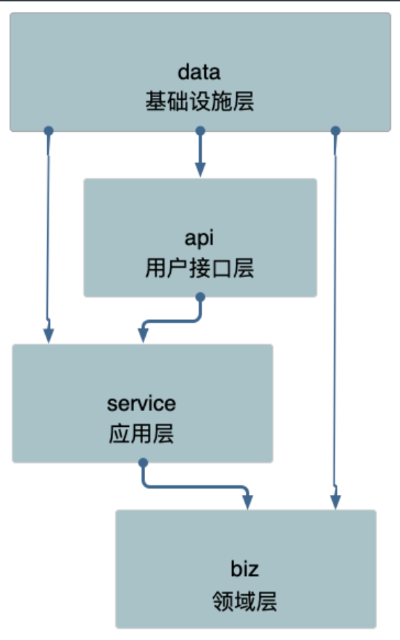

# 工程项目结构

==整体布局==

备注：

1.多个服务

2.每个服务具体布局

## 一个可以参考的网址

https://github.com/golang-standards/project-layout/blob/master/README_zh.md

+ /cmd

本项目的主干。

每个应用程序的目录名应该与你想要的可执行文件的名称相匹配*(*例如，*/cmd/myapp**)*。

不要在这个目录中放置太多代码。如果你认为代码可以导入并在其他项目中使用，那么它应该位于 */pkg* 目录中。如果代码不是可重用的，或者你不希望其他人重用它，请将该代码放到 */internal* 目录中。

+ /internal

 私有应用程序和库代码。这是你不希望其他人在其应用程序或库中导入代码。请注意，这个布局模式是由 *Go* 编译器本身执行的。有关更多细节，请参阅*Go 1.4* [*release notes*](https://golang.org/doc/go1.4#internalpackages)。注意，你并不局限于顶级 *internal* 目录。在项目树的任何级别上都可以有多个内部目录。

你可以选择向 *internal* 包中添加一些额外的结构，以分隔共享和非共享的内部代码。这不是必需的*(*特别是对于较小的项目*)*，但是最好有有可视化的线索来显示预期的包的用途。你的实际应用程序代码可以放在 */internal/app* 目录下*(*例如 */internal/app/myapp**)*，这些应用程序共享的代码可以放在 */internal/pkg* 目录下*(*例如 */internal/pkg/myprivlib)*。

+ /pkg

  外部应用程序可以使用的库代码*(*例如 */pkg/mypubliclib)*。其他项目会导入这些库，所以在这里放东西之前要三思*:-)*注意，*internal* 目录是确保私有包不可导入的更好方法，因为它是由 *Go* 强制执行的。*/pkg* 目录仍然是一种很好的方式，可以显式地表示该目录中的代码对于其他人来说是安全使用的好方法。


## Kit Project Layout

每个公司都应当为不同的微服务建立一个统一的 kit 工具包项目(基础库/框架) 和 app 项目。

基础库 kit 为独立项目，公司级建议只有一个，按照功能目录来拆分会带来不少的管理工作，因此建议合并整合。

- kit 库必须具有的特点：
  - 统一
  - 标准库方式布局
  - 高度抽象
  - 支持插件
  - 尽量减少依赖
  - 持续维护

## Service Application Project Layout

+ /api

  *API* 协议定义目录，*xxapi.proto protobuf* 文件，以及生成的 *go* 文件。我们通常把 *api* 文档直接在 *proto* 文件中描述。

+ /configs

配置文件模板或默认配置。

- /test

  额外的外部测试应用程序和测试数据。你可以随时根据需求构造 */test* 目录。对于较大的项目，有一个数据子目录是有意义的。例如，你可以使用 */test/data* 或 */test/testdata (*如果你需要忽略目录中的内容*)*。请注意，*Go* 还会忽略以*“.”*或*“_”*开头的目录或文件，因此在如何命名测试数据目录方面有更大的灵活性。

+ ==不应该包含/src==

有些 *Go* 项目确实有一个 *src* 文件夹，但这通常发生在开发人员有 *Java* 背景，在那里它是一种常见的模式。不要将项目级别 *src* 目录与 *Go* 用于其工作空间的 *src* 目录。

### 项目布局v1

app 目录下有 api、cmd、configs、internal 目录，目录里一般还会放置 README、CHANGELOG、OWNERS。

- *api:* 放置 *API* 定义*(protobuf)*，以及对应的生成的 *client* 代码，基于 *pb* 生成的 *swagger.json*。
- *configs:* 放服务所需要的配置文件，比如*database.yaml*、*redis.yaml*、*application.yaml*。
- *internal:* 是为了避免有同业务下有人跨目录引用了内部的 *model*、*dao* 等内部 *struct*。
- *server:* 放置 *HTTP/gRPC* 的路由代码，以及 *DTO* 转换的代码。


项目的依赖路径为: model -> dao -> service -> api，model struct 串联各个层，直到 api 需要做 DTO 对象转换。

- *model:* 放对应*“*存储层*”*的结构体，是对存储的一一隐射。
- *dao:* 数据读写层，数据库和缓存全部在这层统一处理，包括 *cache miss* 处理。
- *service:* 组合各种数据访问来构建业务逻辑。
- *server:* 依赖 *proto* 定义的服务作为入参，提供快捷的启动服务全局方法。
- *api:* 定义了 *API proto* 文件，和生成的 *stub* 代码，它生成的 *interface*，其实现者在 *service* 中。


==v1 存在的问题==

- 没有 DTO 对象，model 中的对象贯穿全局，所有层都有
  - model 层的数据不是每个接口都需要的，这个时候会有一些问题
  - 在上一篇文章中其实也反复提到了 “如果两段看似重复的代码，如果有不同的变更速率和原因，那么这两段代码就不算是真正的重复”
- server 层的代码可以通过基础库干掉，提供统一服务暴露方式

### 项目布局v2

app 目录下有 api、cmd、configs、internal 目录，目录里一般还会放置 README、CHANGELOG、OWNERS。

- *internal:* 是为了避免有同业务下有人跨目录引用了内部的 *biz*、*data*、*service* 等内部 *struct*。

- - *biz:* 业务逻辑的组装层，类似 *DDD* 的 *domain* 层，*data* 类似 *DDD* 的 *repo*，*repo* 接口在这里定义，使用依赖倒置的原则。
  - *data:* 业务数据访问，包含 *cache*、*db* 等封装，实现了 *biz* 的 *repo* 接口。我们可能会把 *data* 与 *dao* 混淆在一起，*data* 偏重业务的含义，它所要做的是将领域对象重新拿出来，我们去掉了 *DDD* 的 *infra* 层。
  - *service:* 实现了 *api* 定义的服务层，类似 *DDD* 的 *application* 层，处理 *DTO* 到 *biz* 领域实体的转换*(DTO -> DO)*，同时协同各类 *biz* 交互，但是不应处理复杂逻辑。


具体布局可以参考[kratos-layout](https://github.com/go-kratos/kratos-layout)

我们将 DDD 设计中的一些思想和工程结构做了一些简化，映射到 api、service、biz、data 各层。


### 不同的架构

==松散分层架构（Relaxed Layered System）==

层间关系不那么严格。每层都可能使用它下面所有层的服务，而不仅仅是下一层的服务。每层都可能是半透明的，这意味着有些服务只对上一层可见，而有些服务对上面的所有层都可见。


同时在领域驱动设计（DDD）中也采用了==继承分层架构（Layering Through Inheritance）==，高层继承并实现低层接口。我们需要调整一下各层的顺序，并且将基础设施层移动到最高层。

注意：继承分层架构依然是单向依赖，这也意味着领域层、应用层、表现层将不能依赖基础设施层，相反基础设施层可以依赖它们。

**依赖的是接口**



## Wire 依赖注入

阅读:[Go工程化-依赖注入](https://go-kratos.dev/blog/go-project-wire)

官方的文档已经十分完善。下面是我自己的一些demo和理解

如果你想直接查看官方文档，请看这里。[官方文档](https://github.com/google/wire/)

----

[部分代码](https://github.com/Yefangbiao/study-co/tree/main/Go-training/go-advance/chapter4/wire)

wire有两个核心的概念:`providers`和`injectors`

==providers==

Provider 是一个普通的函数，这个函数会返回构建依赖关系所需的组件。在Go是一些代码

```go
package foobarbaz

type Foo struct {
    X int
}

// ProvideFoo returns a Foo.
func ProvideFoo() Foo {
    return Foo{X: 42}
}
```

`ProvideFoo`可以被当做一个Provider。而且必须是`可导出的`。

`providers`可以有多个入参和多个返回值

`providers`可以被包含在一个**provider sets**中。

```go
package foobarbaz

import (
    // ...
    "github.com/google/wire"
)

// ...

var SuperSet = wire.NewSet(ProvideFoo, ProvideBar, ProvideBaz)
```

==injectors==

`injectors` 也是一个普通函数，我们常常在 `wire.go` 文件中定义 injector 函数签名，然后通过 `wire` 命令自动生成一个完整的函数

```go
// +build wireinject
// The build tag makes sure the stub is not built in the final build.

package main

import (
    "context"

    "github.com/google/wire"
    "example.com/foobarbaz"
)

func initializeBaz(ctx context.Context) (foobarbaz.Baz, error) {
    wire.Build(foobarbaz.MegaSet)
    return foobarbaz.Baz{}, nil
}
```

**绑定接口**

```go
type Fooer interface {
    Foo() string
}

type MyFooer string

func (b *MyFooer) Foo() string {
    return string(*b)
}

func provideMyFooer() *MyFooer {
    b := new(MyFooer)
    *b = "Hello, World!"
    return b
}

type Bar string

func provideBar(f Fooer) string {
    // f will be a *MyFooer.
    return f.Foo()
}

var Set = wire.NewSet(
    provideMyFooer,
    wire.Bind(new(Fooer), new(*MyFooer)),
    provideBar)
```

`Bind`是指向所需接口类型值的指针，第二个参数是指向实现接口的类型值的指针。任何包含接口绑定的集合都必须在同一集合中具有提供具体类型的提供者。

**Struct属性注入**

来看看官方的示例。可以生成一个结构体

```go
type Foo int
type Bar int

func ProvideFoo() Foo {
	return 1
}

func ProvideBar() Bar {
	return 2
}

type FooBar struct {
	MyFoo Foo
	MyBar Bar
}

var Set = wire.NewSet(
	ProvideFoo,
	ProvideBar,
	wire.Struct(new(FooBar), "MyFoo", "MyBar"))
```

我们可以确定生成的结构体和`ProvideFoo`和`ProvideBar`有关

**值绑定**

除了依赖某一个类型之外，有时候我们还会依赖一些具体的值，这时候我们就可以使用 `wire.Value` 或者是 `wire.InterfaceValue` ，为某个类型绑定具体的值

看看下面的`wire.go`

```go
type Point struct {
	X int
	Y int
}

func InitPoint() *Point {
	panic(wire.Build(wire.Value(&Point{
		X: 1,
		Y: 2,
	})))
	return &Point{}
}
```

`wire_gen.go`生成后会变成

```go
func InitPoint() *Point {
	point := _wirePointValue
	return point
}

var (
	_wirePointValue = &Point{
		X: 1,
		Y: 2,
	}
)
```

**使用一个结构体的值作为提供者**

```go
type Point struct {
	X int
	Y int
}

func NewPointExample() Point {
	return Point{
		X: 5,
		Y: 10,
	}
}

func InitPoint() (int) {
	panic(wire.Build(
		NewPointExample,
		wire.FieldsOf(new(Point), "X", ),
	),
	)
	return 0
}
```

这里可以返回`Point`中的`X`。

-----

Go语言最佳实践

+ 如果你想要注入一个类似`string`的类型。请创建一个新的类型

```go
type MySQLConnectionString string
```

+ 在实际的业务场景当中我们的 `NewXXX` 函数的参数列表可能会很长，这个时候就可以直接定义一个 Option Struct 然后使用 `wire.Strcut` 来构建 Option Strcut 的依赖

  ```go
  type typeA int
  type typeB int
  
  type Options struct {
  	A typeA
  	B typeB
  }
  
  type Greeter struct {
  	AAA typeA
  	BBB typeB
  }
  
  func NewGreeter(opts *Options) *Greeter {
  	// ...
  	return &Greeter{
  		AAA: opts.A,
  		BBB: opts.B,
  	}
  }
  
  var GreeterSet = wire.NewSet(wire.Struct(new(Options), "*"), NewGreeter)
  
  func InitGreeter() *Greeter {
  	panic(wire.Build(
  		wire.Value(typeA(10)),
  		wire.Value(typeB(20)),
  		GreeterSet,
  	),
  	)
  	return &Greeter{}
  }
  ```

# API设计

## API Compatibility

==向后兼容(非破坏性)的修改==

- 给 API 服务定义添加 API 接口

  从协议的角度来看，这始终是安全的。

- 给请求消息添加字段

  只要客户端在新版和旧版中对该字段的处理不保持一致，添加请求字段就是兼容的。

- 给响应消息添加字段

  在不改变其他响应字段的行为的前提下，非资源（例如，*ListBooksResponse*）的响应消息可以扩展而不必破坏客户端的兼容性。即使会引入冗余，先前在响应中填充的任何字段应继续使用相同的语义填充。

==向后不兼容(破坏性)的修改==

- 删除或重命名服务，字段，方法或枚举值

  从根本上说，如果客户端代码可以引用某些东西，那么删除或重命名它都是不兼容的变化，这时必须修改 *major* 版本号。 

- 修改字段的类型

  即使新类型是传输格式兼容的，这也可能会导致客户端库生成的代码发生变化，因此必须增加*major* 版本号。 对于编译型静态语言来说，会容易引入编译错误。

- 修改现有请求的可见行为

  客户端通常依赖于 *API* 行为和语义，即使这样的行为没有被明确支持或记录。 因此，在大多数情况下，修改 *API* 数据的行为或语义将被消费者视为是破坏性的。如果行为没有加密隐藏，您应该假设用户已经发现它，并将依赖于它。 

- 给资源消息添加 读取/写入 字段

## API Naming Conventions

包名为应用的标识(APP_ID)，用于生成 gRPC 请求路径，或者 proto 之间进行引用 Message。文件中声明的包名称应该与产品和服务名称保持一致。带有版本的 API 的软件包名称必须以此版本结尾。

- *my.package.v1*，为 *API* 目录，定义*service*相关接口，用于提供业务使用。

- // RequestURL: /<package_name>.<version>.<service_name>/{method}

  package <package_name>.<version>;

## API Errors

使用一小组标准错误配合大量资源

- 例如，服务器没有定义不同类型的*“*找不到*”*错误，而是使用一个标准 *google.rpc.Code.NOT_FOUND* 错误代码并告诉客户端找不到哪个特定资源。状态空间变小降低了文档的复杂性，在客户端库中提供了更好的惯用映射，并降低了客户端的逻辑复杂性，同时不限制是否包含可操作信息*(*[*/google/rpc/error_details*](https://github.com/googleapis/googleapis/blob/master/google/rpc/error_details.proto)*)*。

错误传播

如果您的 *API* 服务依赖于其他服务，则不应盲目地将这些服务的错误传播到您的客户端。在翻译错误时，我们建议执行以下操作：

- 隐藏实现详细信息和机密信息。
- 调整负责该错误的一方。例如，从另一个服务接收 *INVALID_ARGUMENT* 错误的服务器应该将 *INTERNAL* 传播给它自己的调用者。

之前写gRPC的时候，不好怎么处理错误，原来官方已经有解决方案，只是文档上没细说：

```go
package main

import (
    "context"

    "google.golang.org/grpc/codes"
    "google.golang.org/grpc/status"
    pb "yourpb"
)

func (s *Service) BlablaMethod(ctx context.Context, req *pb.Req) (*pb.Resp, error) {
    return nil, status.Errorf(codes.InvalidArgument, "Bad password(too short)")
}
```

# 配置管理

- 环境变量(配置)

  *Region*、*Zone*、*Cluster*、*Environment*、*Color*、*Discovery*、*AppID*、*Host*，等之类的环境信息，都是通过在线运行时平台打入到容器或者物理机，供 *kit* 库读取使用。

- 静态配置

  资源需要初始化的配置信息，比如 *http/gRPC server*、*redis*、*mysql* 等，这类资源在线变更配置的风险非常大，我通常不鼓励 *on-the-fly* 变更，很可能会导致业务出现不可预期的事故，变更静态配置和发布 *bianry app* 没有区别，应该走一次迭代发布的流程。

- 动态配置

  应用程序可能需要一些在线的开关，来控制业务的一些简单策略，会频繁的调整和使用，我们把这类是基础类型*(int, bool)*等配置，用于可以动态变更业务流的收归一起，同时可以考虑结合类似 *https://pkg.go.dev/expvar* 来结合使用。

- 全局配置

  通常，我们依赖的各类组件、中间件都有大量的默认配置或者指定配置，在各个项目里大量拷贝复制，容易出现意外，所以我们使用全局配置模板来定制化常用的组件，然后再特化的应用里进行局部替换。

# 包管理

- https://golang.org/ref/mod
- https://blog.golang.org/modules2019
- https://blog.golang.org/using-go-modules
- https://blog.golang.org/migrating-to-go-modules
- https://blog.golang.org/module-mirror-launch
- https://blog.golang.org/publishing-go-modules
- https://blog.golang.org/v2-go-modules
- https://blog.golang.org/module-compatibility

# 测试

- 小型测试带来优秀的代码质量、良好的异常处理、优雅的错误报告；大中型测试会带来整体产品质量和数据验证。
- 不同类型的项目，对测试的需求不同，总体上有一个经验法则，即70/20/10原则：70%是小型测试，20%是中型测试，10%是大型测试。
- 如果一个项目是面向用户的，拥有较高的集成度，或者用户接口比较复杂，他们就应该有更多的中型和大型测试；如果是基础平台或者面向数据的项目，例如索引或网络爬虫，则最好有大量的小型测试，中型测试和大型测试的数量要求会少很多。

利用 go 官方提供的: ==Subtests + Gomock== 完成整个单元测试。

- /api

  比较适合进行集成测试，直接测试 *API*，使用 *API* 测试框架*(*例如*: yapi)*，维护大量业务测试 *case*。

- /data

  *docker compose* 把底层基础设施真实模拟，因此可以去掉 *infra* 的抽象层。

- /biz

  依赖 *repo*、*rpc client*，利用 *gomock* 模拟 *interface* 的实现，来进行业务单元测试。

- /service

  依赖 *biz* 的实现，构建 *biz* 的实现类传入，进行单元测试。

## GoMock

[官方md](https://github.com/golang/mock/blob/master/README.md)

[官方文档](https://pkg.go.dev/github.com/golang/mock/gomock)

```shell
mockgen  -destination=写入文件的路径(没有这个参数输出到终端) 包路径 需要mock的接口名(多个接口逗号间隔)
```

一个简单的mock

1.定义接口

```go
type Repository interface {
	Create(key string, value []byte) error
	Retrieve(key string) ([]byte, error)
	Update(key string, value []byte) error
	Delete(key string) error
}
```

2.使用mockgen 生成文件

`mockgen -source=./interface.go -destination=./interface_mock.go`

3.进行测试

```go
func testRepository(repository Repository) {
	_, err := repository.Retrieve("123")
	fmt.Println(err)
	repository.Create("123", []byte("456"))
	resp, err := repository.Retrieve("123")
	if err != nil {
		fmt.Println(err)
	}
	fmt.Println(resp)
}

func TestMockRepository(t *testing.T) {
	ctrl := NewController(t)
	defer ctrl.Finish()

	mockRepo := NewMockRepository(ctrl)

	obj := struct {
		X, Y int
	}{}
	objBytes, _ := json.Marshal(obj)

	// 假设有这样一个场景：先Retrieve领域对象失败，然后Create领域对象成功，再次Retrieve领域对象就能成功。
	// 这个场景对应的mock对象的行为注入代码如下所示
	mockRepo.EXPECT().Retrieve(Any()).Return(nil, fmt.Errorf("can not Retrieve"))
	mockRepo.EXPECT().Create(Any(), Any()).Return(nil)
	mockRepo.EXPECT().Retrieve(Any()).Return(objBytes, nil)

	testRepository(mockRepo)
}
```

[示例代码](https://github.com/Yefangbiao/study-co/tree/main/Go-training/go-advance/chapter4/gomock)
