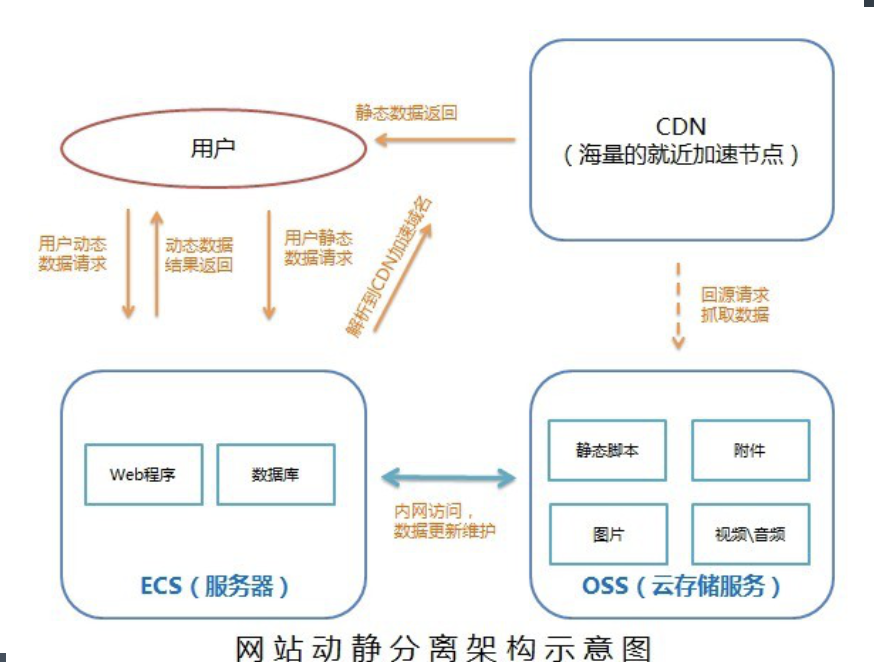
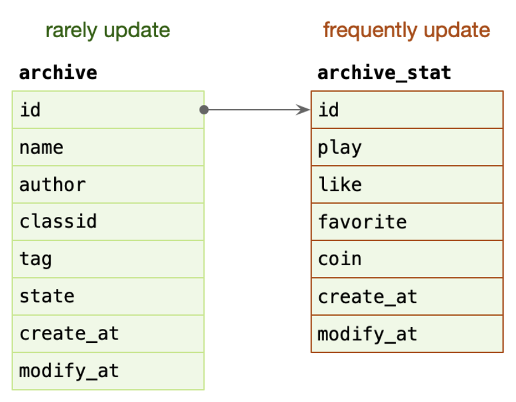
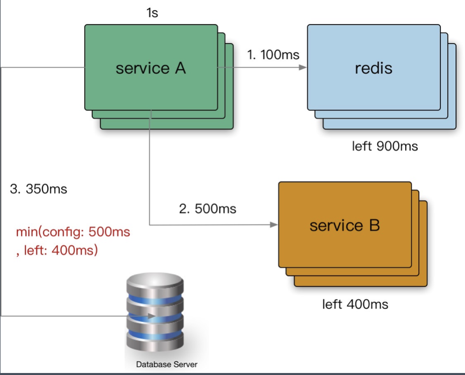
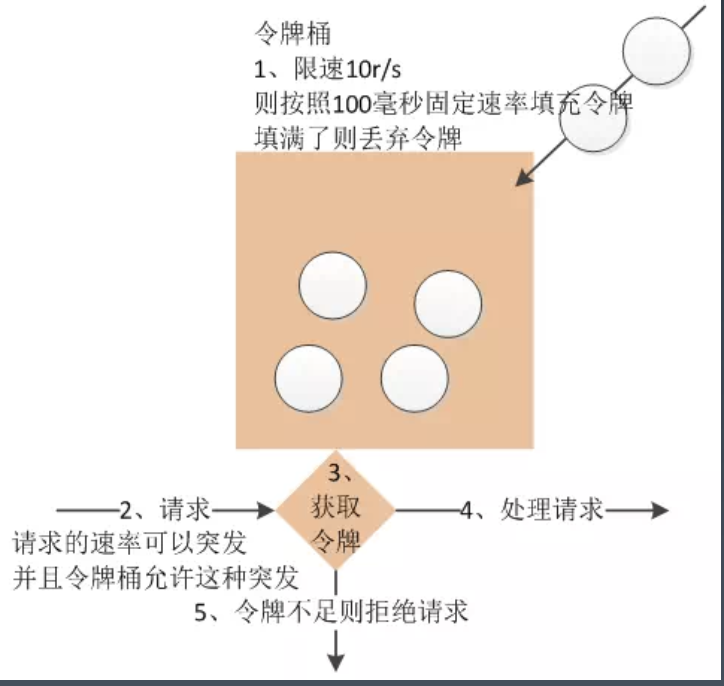
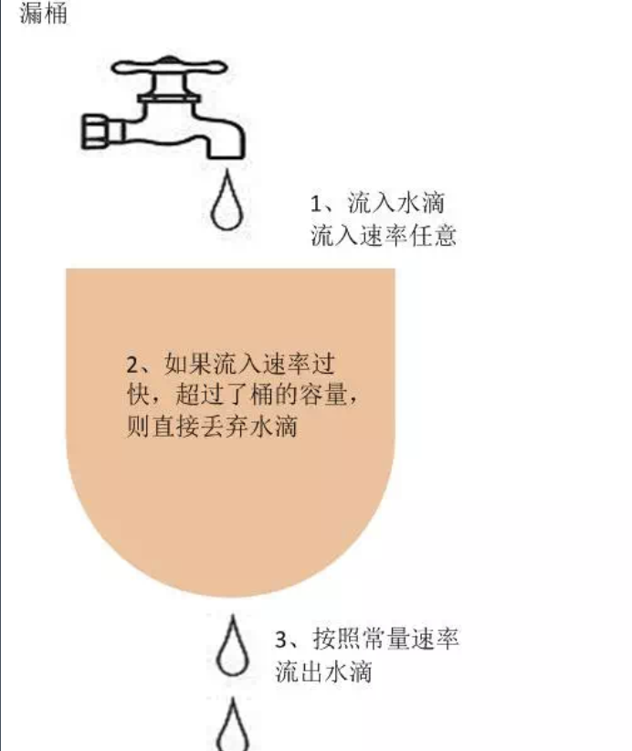
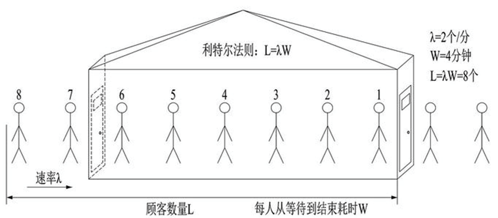
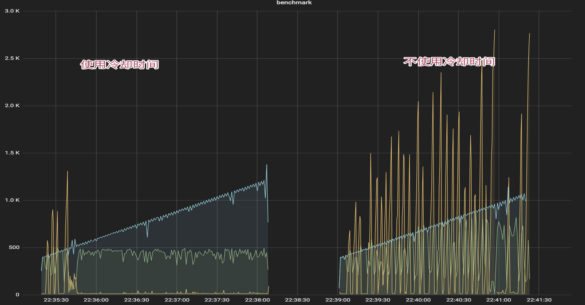

# 隔离

隔离，本质上是对系统或资源进行分割，从而实现当系统发生故障时能限定传播范围和影响范围，即发生故障后只有出问题的服务不可用，保证其他服务仍然可用。

## 服务隔离

+ 动静隔离:小到 CPU 的 cacheline [false sharing](https://www.cnblogs.com/cyfonly/p/5800758.html)、数据库 mysql 表设计中避免 bufferpool 频繁过期，隔离动静表，大到架构设计中的图片、静态资源等缓存加速。本质上都体现的一样的思路，即加速/缓存访问变换频次小的。比如 CDN 场景中，将静态资源和动态 API 分离，也是体现了隔离的思路:

    + 降低应用服务器负载，静态文件访问负载全部通过*CDN*。
  + 对象存储存储费用最低。
  + 海量存储空间，无需考虑存储架构升级。
  + 静态 *CDN* 带宽加速，延迟低。

  

+ 读写分离:主从、Replicaset、CQRS。

archive: 稿件表，存储稿件的名称、作者、分类、tag、状态等信息，表示稿件的基本信息。

在一个投稿流程中，一旦稿件创建改动的频率比较低。

archive_stat: 稿件统计表，表示稿件的播放、点赞、收藏、投币数量，比较高频的更新。

随着稿件获取流量，稿件被用户所消费，各类计数信息更新比较频繁。

*MySQL BufferPool* 是用于缓存 *DataPage* 的，*DataPage* 可以理解为缓存了表的行，那么如果频繁更新 *DataPage* 不断会置换，会导致命中率下降的问题，所以我们在表设计中，仍然可以沿用类似的思路，其主表基本更新，在上游 *Cache* 未命中，透穿到 *MySQL*，仍然有 *BufferPool* 的缓存。

## 轻重隔离

+ 核心隔离:业务按照 Level 进行资源池划分（L0/L1/L2）。
  - 核心*/*非核心的故障域的差异隔离（机器资源、依赖资源）。
  - 多集群，通过冗余资源来提升吞吐和容灾能力。
+ 快慢隔离:我们可以把服务的吞吐想象为一个池，当突然洪流进来时，池子需要一定时间才能排放完，这时候其他支流在池子里待的时间取决于前面的排放能力，耗时就会增高，对小请求产生影响。

+ 热点隔离:何为热点？热点即经常访问的数据。很多时候我们希望统计某个热点数据中访问频次最高的 Top K 数据，并对其访问进行缓存。比如：

+ - 小表广播*:* 从 *remotecache* 提升为 *localcache*，*app* 定时更新，甚至可以让运营平台支持广播刷新 *localcache*。[*atomic.Value*](https://pkg.go.dev/sync/atomic#example-Value-ReadMostly)
  - 主动预热*:* 比如直播房间页高在线情况下 *bypass* 监控主动防御。

## 物理隔离

+ 线程隔离:主要通过线程池进行隔离，也是实现服务隔离的基础。把业务进行分类并交给不同的线程池进行处理，当某个线程池处理一种业务请求发生问题时，不会讲故障扩散和影响到其他线程池，保证服务可用。

  对于 *Go* 来说，所有 *IO* 都是 *Nonblocking*，且托管给了 *Runtime*，只会阻塞 *Goroutine*，不阻塞 *M*，我们只需要考虑 *Goroutine* 总量的控制，不需要线程模型语言的线程隔离。

+ 进程隔离:容器化（*docker*），容器编排引擎（*k8s*）。我们*15*年在 *KVM* 上部署服务；*16*年使用 *Docker Swarm*；*17*年迁移到 *Kubernetes*，到年底在线应用就全托管了，之后很快在线应用弹性公有云上线；*20*年离线 *Yarn* 和 在线 *K8s* 做了在离线混部（错峰使用），之后计划弹性公有云配合自建 *IDC* 做到离线的混合云架构。

# 超时控制

超时控制，我们的组件能够快速失效（fail fast），因为我们不希望等到断开的实例直到超时。没有什么比挂起的请求和无响应的界面更令人失望。这不仅浪费资源，而且还会让用户体验变得更差。我们的服务是互相调用的，所以在这些延迟叠加前，应该特别注意防止那些超时的操作。

- 网路传递具有不确定性。
- 客户端和服务端不一致的超时策略导致资源浪费。
- *“*默认值*”*策略。
- 高延迟服务导致 *client* 浪费资源等待，使用超时传递*:* 进程间传递 *+* 跨进程传递。

超时传递: 当上游服务已经超时返回 504，但下游服务仍然在执行，会导致浪费资源做无用功。超时传递指的是把当前服务的剩余 Quota 传递到下游服务中，继承超时策略，控制请求级别的全局超时控制。

  一个请求在每个阶段*(*网络请求*)*开始前，就要检查是否还有足够的剩余来处理请求，以及继承他的超时策略，使用 *Go* 标准库的 [*context.WithTimeout*](https://pkg.go.dev/context#WithTimeout)。

- 双峰分布: 95%的请求耗时在100ms内，5%的请求可能永远不会完成（长超时）。
- 对于监控不要只看 mean，可以看看耗时分布统计，比如 95th，99th。
- 设置合理的超时，拒绝超长请求，或者当Server 不可用要主动失败。

# 过载保护

## 令牌桶算法

是一个存放固定容量令牌的桶，按照固定速率往桶里添加令牌。令牌桶算法的描述如下：

- 假设限制*2r/s*，则按照*500*毫秒的固定速率往桶中添加令牌。
- 桶中最多存放 *b* 个令牌，当桶满时，新添加的令牌被丢弃或拒绝。
- 当一个 *n* 个字节大小的数据包到达，将从桶中删除*n* 个令牌，接着数据包被发送到网络上。
- 如果桶中的令牌不足 *n* 个，则不会删除令牌，且该数据包将被限流（要么丢弃，要么缓冲区等待）。

*token-bucket rate limit algorithm:* [*/x/time/rate*](https://pkg.go.dev/golang.org/x/time/rate)

## 漏桶算法

作为计量工具（The Leaky Bucket Algorithm as a Meter）时，可以用于流量整形

（Traffic Shaping）和流量控制（TrafficPolicing），漏桶算法的描述如下：

- 一个固定容量的漏桶，按照常量固定速率流出水滴。
- 如果桶是空的，则不需流出水滴。
- 可以以任意速率流入水滴到漏桶。
- 如果流入水滴超出了桶的容量，则流入的水滴溢出了（被丢弃），而漏桶容量是不变的。

*leaky-bucket rate limit algorithm:* [*/go.uber.org/ratelimit*](https://pkg.go.dev/go.uber.org/ratelimit)

## 自适应算法-利特尔法则

漏斗桶/令牌桶确实能够保护系统不被拖垮, 但不管漏斗桶还是令牌桶, 其防护思路都是设定一个指标, 当超过该指标后就阻止或减少流量的继续进入，当系统负载降低到某一水平后则恢复流量的进入。但其通常都是被动的，其实际效果取决于限流阈值设置是否合理，但往往设置合理不是一件容易的事情。

- 集群增加机器或者减少机器限流阈值是否要重新设置*?*
- 设置限流阈值的依据是什么*?*
- 人力运维成本是否过高*?*
- 当调用方反馈*429*时*,* 这个时候重新设置限流*,* 其实流量高峰已经过了重新评估限流是否有意义*?*

这些其实都是采用漏斗桶*/*令牌桶的缺点*,* 总体来说就是太被动*,* 不能快速适应流量变化。

因此我们需要一种自适应的限流算法，即*:* 过载保护，根据系统当前的负载自动丢弃流量。

-----

前面我们遇到的主要问题就是每个服务实例的限流阈值实际应该是动态变化的，我们应该根据系统能够承载的最大吞吐量，来进行限流，当当前的流量大于最大吞吐的时候就限制流量进入，反之则允许通过。那现在的问题就是

- **系统的吞吐量该如何计算？**
- **什么时候系统的吞吐量就是最大的吞吐量了？**

#### 计算吞吐量：利特尔法则 L = λ * W

如上图所示，如果我们开一个小店，平均每分钟进店 2 个客人(λ)，每位客人从等待到完成交易需要 4 分钟(W)，那我们店里能承载的客人数量就是 2 * 4 = 8 个人

同理，我们可以将 `λ` 当做 QPS， `W` 呢是每个请求需要花费的时间，那我们的系统的吞吐就是 `L = λ * W` ，所以我们可以使用利特尔法则来计算系统的吞吐量。

**如何计算接近峰值时的系统吞吐？**

- *CPU:* 使用一个独立的线程采样，每隔 *250ms* 触发一次。在计算均值时，使用了简单滑动平均去除峰值的影响。
- *Inflight:* 当前服务中正在进行的请求的数量。
- *Pass&RT:* 最近*5s*，*pass* 为每*100ms*采样窗口内成功请求的数量，*rt* 为单个采样窗口中平均响应时间。

- 我们使用 *CPU* 的滑动均值（*CPU > 800*）作为启发阈值，一旦触发进入到过载保护阶段，算法为：*(pass\* rt) < inflight*
- 限流效果生效后，*CPU* 会在临界值（*800*）附近抖动，如果不使用冷却时间，那么一个短时间的 *CPU* 下降就可能导致大量请求被放行，严重时会打满 *CPU*。
- 在冷却时间后，重新判断阈值（*CPU > 800* ），是否持续进入过载保护。

黄色是延迟。蓝色是请求数目。绿色是放行请求

# 限流

# 降级

# 重试

# 负载均衡

# 最佳实践