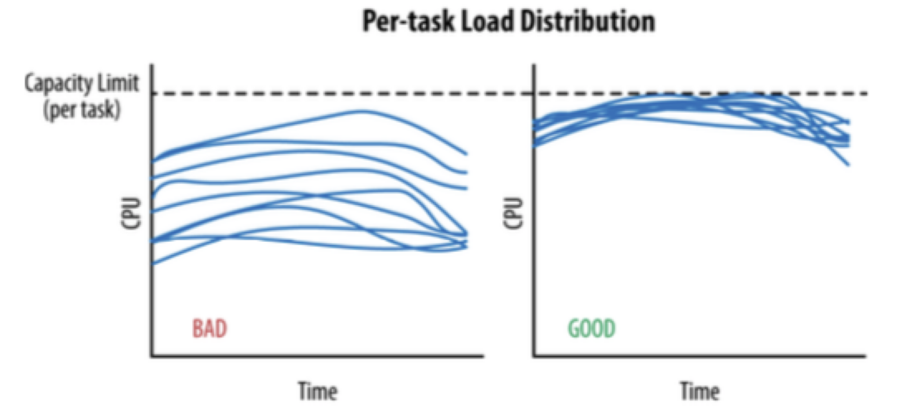
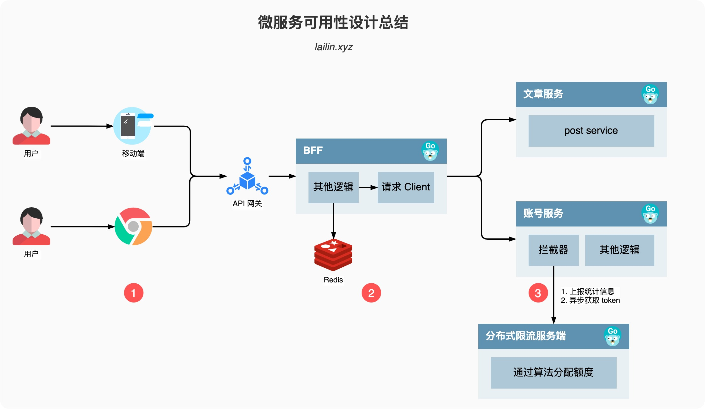

# 隔离

隔离，本质上是对系统或资源进行分割，从而实现当系统发生故障时能限定传播范围和影响范围，即发生故障后只有出问题的服务不可用，保证其他服务仍然可用。

## 服务隔离

+ 动静隔离:小到 CPU 的 cacheline [false sharing](https://www.cnblogs.com/cyfonly/p/5800758.html)、数据库 mysql 表设计中避免 bufferpool 频繁过期，隔离动静表，大到架构设计中的图片、静态资源等缓存加速。本质上都体现的一样的思路，即加速/缓存访问变换频次小的。比如 CDN 场景中，将静态资源和动态 API 分离，也是体现了隔离的思路:

    + 降低应用服务器负载，静态文件访问负载全部通过*CDN*。
  + 对象存储存储费用最低。
  + 海量存储空间，无需考虑存储架构升级。
  + 静态 *CDN* 带宽加速，延迟低。

  

+ 读写分离:主从、Replicaset、CQRS。

archive: 稿件表，存储稿件的名称、作者、分类、tag、状态等信息，表示稿件的基本信息。

在一个投稿流程中，一旦稿件创建改动的频率比较低。

archive_stat: 稿件统计表，表示稿件的播放、点赞、收藏、投币数量，比较高频的更新。

随着稿件获取流量，稿件被用户所消费，各类计数信息更新比较频繁。

*MySQL BufferPool* 是用于缓存 *DataPage* 的，*DataPage* 可以理解为缓存了表的行，那么如果频繁更新 *DataPage* 不断会置换，会导致命中率下降的问题，所以我们在表设计中，仍然可以沿用类似的思路，其主表基本更新，在上游 *Cache* 未命中，透穿到 *MySQL*，仍然有 *BufferPool* 的缓存。


## 轻重隔离

+ 核心隔离:业务按照 Level 进行资源池划分（L0/L1/L2）。
  - 核心*/*非核心的故障域的差异隔离（机器资源、依赖资源）。
  - 多集群，通过冗余资源来提升吞吐和容灾能力。
+ 快慢隔离:我们可以把服务的吞吐想象为一个池，当突然洪流进来时，池子需要一定时间才能排放完，这时候其他支流在池子里待的时间取决于前面的排放能力，耗时就会增高，对小请求产生影响。

+ 热点隔离:何为热点？热点即经常访问的数据。很多时候我们希望统计某个热点数据中访问频次最高的 Top K 数据，并对其访问进行缓存。比如：

+ - 小表广播*:* 从 *remotecache* 提升为 *localcache*，*app* 定时更新，甚至可以让运营平台支持广播刷新 *localcache*。[*atomic.Value*](https://pkg.go.dev/sync/atomic#example-Value-ReadMostly)
  - 主动预热*:* 比如直播房间页高在线情况下 *bypass* 监控主动防御。

## 物理隔离

+ 线程隔离:主要通过线程池进行隔离，也是实现服务隔离的基础。把业务进行分类并交给不同的线程池进行处理，当某个线程池处理一种业务请求发生问题时，不会讲故障扩散和影响到其他线程池，保证服务可用。

  对于 *Go* 来说，所有 *IO* 都是 *Nonblocking*，且托管给了 *Runtime*，只会阻塞 *Goroutine*，不阻塞 *M*，我们只需要考虑 *Goroutine* 总量的控制，不需要线程模型语言的线程隔离。

+ 进程隔离:容器化（*docker*），容器编排引擎（*k8s*）。我们*15*年在 *KVM* 上部署服务；*16*年使用 *Docker Swarm*；*17*年迁移到 *Kubernetes*，到年底在线应用就全托管了，之后很快在线应用弹性公有云上线；*20*年离线 *Yarn* 和 在线 *K8s* 做了在离线混部（错峰使用），之后计划弹性公有云配合自建 *IDC* 做到离线的混合云架构。

# 超时控制

超时控制，我们的组件能够快速失效（fail fast），因为我们不希望等到断开的实例直到超时。没有什么比挂起的请求和无响应的界面更令人失望。这不仅浪费资源，而且还会让用户体验变得更差。我们的服务是互相调用的，所以在这些延迟叠加前，应该特别注意防止那些超时的操作。

- 网路传递具有不确定性。
- 客户端和服务端不一致的超时策略导致资源浪费。
- *“*默认值*”*策略。
- 高延迟服务导致 *client* 浪费资源等待，使用超时传递*:* 进程间传递 *+* 跨进程传递。

超时传递: 当上游服务已经超时返回 504，但下游服务仍然在执行，会导致浪费资源做无用功。超时传递指的是把当前服务的剩余 Quota 传递到下游服务中，继承超时策略，控制请求级别的全局超时控制。

  一个请求在每个阶段*(*网络请求*)*开始前，就要检查是否还有足够的剩余来处理请求，以及继承他的超时策略，使用 *Go* 标准库的 [*context.WithTimeout*](https://pkg.go.dev/context#WithTimeout)。


- 双峰分布: 95%的请求耗时在100ms内，5%的请求可能永远不会完成（长超时）。
- 对于监控不要只看 mean，可以看看耗时分布统计，比如 95th，99th。
- 设置合理的超时，拒绝超长请求，或者当Server 不可用要主动失败。

# 过载保护(限流)

## 令牌桶算法

是一个存放固定容量令牌的桶，按照固定速率往桶里添加令牌。令牌桶算法的描述如下：

- 假设限制*2r/s*，则按照*500*毫秒的固定速率往桶中添加令牌。
- 桶中最多存放 *b* 个令牌，当桶满时，新添加的令牌被丢弃或拒绝。
- 当一个 *n* 个字节大小的数据包到达，将从桶中删除*n* 个令牌，接着数据包被发送到网络上。
- 如果桶中的令牌不足 *n* 个，则不会删除令牌，且该数据包将被限流（要么丢弃，要么缓冲区等待）。

*token-bucket rate limit algorithm:* [*/x/time/rate*](https://pkg.go.dev/golang.org/x/time/rate)


**方法一览**

```go
// 限流器结构体
type Limiter
	// 构建一个限流器，r 是每秒放入的令牌数量，b 是桶的大小
    func NewLimiter(r Limit, b int) *Limiter

	// 分别返回 b 和 r 的值
    func (lim *Limiter) Burst() int
    func (lim *Limiter) Limit() Limit

	// token 消费方法
    func (lim *Limiter) Allow() bool
    func (lim *Limiter) AllowN(now time.Time, n int) bool
	func (lim *Limiter) Reserve() *Reservation
    func (lim *Limiter) ReserveN(now time.Time, n int) *Reservation
    func (lim *Limiter) Wait(ctx context.Context) (err error)
    func (lim *Limiter) WaitN(ctx context.Context, n int) (err error)

	// 动态流控
    func (lim *Limiter) SetBurst(newBurst int)
    func (lim *Limiter) SetBurstAt(now time.Time, newBurst int)
    func (lim *Limiter) SetLimit(newLimit Limit)
    func (lim *Limiter) SetLimitAt(now time.Time, newLimit Limit)
```

### 初始化令牌桶

直接调用 `NewLimiter(r Limit, b int)` 即可， `r` 表示每秒产生 token 的速度， `b` 表示桶的大小

### Token 消费

总共有三种 token 消费的方式，最常用的是使用 `Wait` 阻塞等待
**Allow**

`Allow` 就是 `AllowN(now,1)` 的别名， `AllowN` 表示截止到 `now` 这个时间点，是否存在 `n` 个 token，如果存在那么就返回 true 反之返回 false，如果我们限流比较严格，没有资源就直接丢弃可以使用这个方法。

```go
func (lim *Limiter) Allow() bool
func (lim *Limiter) AllowN(now time.Time, n int) bool
```

同理 `Reserve` 也是 `ReserveN(now, 1)` 的别名， `ReserveN` 其实和 `AllowN` 类似，表示截止到 `now` 这个时间点，是否存在 `n` 个 token，只是 `AllowN` 直接返回 true or false，但是 `ReserveN` 返回一个 `Reservation` 对象

```go
func (lim *Limiter) Reserve() *Reservation
func (lim *Limiter) ReserveN(now time.Time, n int) *Reservation
```

`Reservation` 有 5 个方法，通过调用 `OK` 我们可以知道是否通过等待可以获取到 N 个 token，如果可以通过 `Delay` 方法我们可以得知需要等待的时间，如果我们不想等了可以调用 `Cancel` 方法归还 token

```go
type Reservation
    func (r *Reservation) Cancel()
    func (r *Reservation) CancelAt(now time.Time)
    func (r *Reservation) Delay() time.Duration
    func (r *Reservation) DelayFrom(now time.Time) time.Duration
    func (r *Reservation) OK() bool
```

`Wait` 是最常用的， `Wait` 是 `WaitN(ctx, 1)` 的别名， `WaitN(ctx, n)` 表示如果存在 `n` 个令牌就直接转发，不存在我们就等，等待存在为止，传入的 `ctx` 的 `Deadline` 就是等待的 Deadline

```go
func (lim *Limiter) Wait(ctx context.Context) (err error)
func (lim *Limiter) WaitN(ctx context.Context, n int) (err error)
```

### 动态流控

通过调用 `SetBurst` 和 `SetLimit` 可以动态的设置桶的大小和 token 生产速率，其中 `SetBurstAt` 和 `SetLimitAt` 会将传入的时间 `now` 设置为流控最后的更新时间

```go
func (lim *Limiter) SetBurst(newBurst int)
func (lim *Limiter) SetBurstAt(now time.Time, newBurst int)
func (lim *Limiter) SetLimit(newLimit Limit)
func (lim *Limiter) SetLimitAt(now time.Time, newLimit Limit)
```

[示例代码](https://github.com/Yefangbiao/study-co/tree/main/Go-training/go-advance/chapter5/token_bucket)

## 漏桶算法

作为计量工具（The Leaky Bucket Algorithm as a Meter）时，可以用于流量整形

（Traffic Shaping）和流量控制（TrafficPolicing），漏桶算法的描述如下：

- 一个固定容量的漏桶，按照常量固定速率流出水滴。
- 如果桶是空的，则不需流出水滴。
- 可以以任意速率流入水滴到漏桶。
- 如果流入水滴超出了桶的容量，则流入的水滴溢出了（被丢弃），而漏桶容量是不变的。

*leaky-bucket rate limit algorithm:* [*/go.uber.org/ratelimit*](https://pkg.go.dev/go.uber.org/ratelimit)


### API

```go
type Clock
type Limiter
    func New(rate int, opts ...Option) Limiter
    func NewUnlimited() Limiter
type Option
    func Per(per time.Duration) Option
    func WithClock(clock Clock) Option
    func WithSlack(slack int) Option
```

`Clock` 是一个接口，计时器的最小实现，有两个方法，分别是当前的时间和睡眠

```go
type Clock interface {
	Now() time.Time
	Sleep(time.Duration)
}
```

`Limiter` 也是一个接口，只有一个 `Take` 方法，执行这个方法的时候如果触发了 rps 限制则会阻塞住

```go
type Limiter interface {
	// Take should block to make sure that the RPS is met.
	Take() time.Time
}
```

`NewLimter` 和 `NewUnlimited` 会分别初始化一个无锁的限速器和没有任何限制的限速器

`Option` 是在初始化的时候的额外参数，这种使用姿势在之前 Go 工程化的文章[《Go 工程化(六) 配置管理》](https://lailin.xyz/post/go-training-week4-config.html)当中有讲到，这里我们就不再赘述了

`Option` 有三个方法

- `Per` 可以修改时间单位，默认是秒所以我们默认限制的是 rps，如果改成分钟那么就是 rpm 了
- `WithClock` 可以修改时钟，这个用于在测试的时候可以 mock 掉不使用真实的时间
- `WithSlack` 用于修改松弛时间，也就是可以允许的突发流量的大小，默认是 `Pre / 10` 

## 自适应算法-利特尔法则

漏斗桶/令牌桶确实能够保护系统不被拖垮, 但不管漏斗桶还是令牌桶, 其防护思路都是设定一个指标, 当超过该指标后就阻止或减少流量的继续进入，当系统负载降低到某一水平后则恢复流量的进入。但其通常都是被动的，其实际效果取决于限流阈值设置是否合理，但往往设置合理不是一件容易的事情。

- 集群增加机器或者减少机器限流阈值是否要重新设置*?*
- 设置限流阈值的依据是什么*?*
- 人力运维成本是否过高*?*
- 当调用方反馈*429*时*,* 这个时候重新设置限流*,* 其实流量高峰已经过了重新评估限流是否有意义*?*

这些其实都是采用漏斗桶*/*令牌桶的缺点*,* 总体来说就是太被动*,* 不能快速适应流量变化。

因此我们需要一种自适应的限流算法，即*:* 过载保护，根据系统当前的负载自动丢弃流量。

-----

前面我们遇到的主要问题就是每个服务实例的限流阈值实际应该是动态变化的，我们应该根据系统能够承载的最大吞吐量，来进行限流，当当前的流量大于最大吞吐的时候就限制流量进入，反之则允许通过。那现在的问题就是

- **系统的吞吐量该如何计算？**
- **什么时候系统的吞吐量就是最大的吞吐量了？**

**计算吞吐量：利特尔法则 L = λ * W**


如上图所示，如果我们开一个小店，平均每分钟进店 2 个客人(λ)，每位客人从等待到完成交易需要 4 分钟(W)，那我们店里能承载的客人数量就是 2 * 4 = 8 个人

同理，我们可以将 `λ` 当做 QPS， `W` 呢是每个请求需要花费的时间，那我们的系统的吞吐就是 `L = λ * W` ，所以我们可以使用利特尔法则来计算系统的吞吐量。

**如何计算接近峰值时的系统吞吐？**

- *CPU:* 使用一个独立的线程采样，每隔 *250ms* 触发一次。在计算均值时，使用了简单滑动平均去除峰值的影响。
- *Inflight:* 当前服务中正在进行的请求的数量。
- *Pass&RT:* 最近*5s*，*pass* 为每*100ms*采样窗口内成功请求的数量，*rt* 为单个采样窗口中平均响应时间。

- 我们使用 *CPU* 的滑动均值（*CPU > 800*）作为启发阈值，一旦触发进入到过载保护阶段，算法为：*(pass\* rt) < inflight*
- 限流效果生效后，*CPU* 会在临界值（*800*）附近抖动，如果不使用冷却时间，那么一个短时间的 *CPU* 下降就可能导致大量请求被放行，严重时会打满 *CPU*。
- 在冷却时间后，重新判断阈值（*CPU > 800* ），是否持续进入过载保护。


黄色是延迟。蓝色是请求数目。绿色是放行请求

### kratos 自适应限流分析

### 限流公式

```
// PS: 官方文档这里写的是 cpu > 800 AND (Now - PrevDrop) < 1s
// 应该是写错了，等下看源码就知道了
(cpu > 800 OR (Now - PrevDrop) < 1s) AND (MaxPass * MinRt * windows / 1000) < InFlight
Copy
```

- `cpu > 800` 表示 CPU 负载大于 80% 进入限流

- `(Now - PrevDrop) < 1s` 这个表示只要触发过 1 次限流，那么 1s 内都会去做限流的判定，这是为了避免反复出现限流恢复导致请求时间和系统负载产生大量毛刺

- ```
  (MaxPass * MinRt * windows / 1000) < InFlight
  ```

   

  判断当前负载是否大于最大负载

  - `InFlight` 表示当前系统中有多少请求
  - `(MaxPass * MinRt * windows / 1000)` 表示过去一段时间的最大负载
  - `MaxPass` 表示最近 5s 内，单个采样窗口中最大的请求数
  - `MinRt` 表示最近 5s 内，单个采样窗口中最小的响应时间
  - `windows` 表示一秒内采样窗口的数量，默认配置中是 5s 50 个采样，那么 windows 的值为 10。

### 源码分析

**BBR 结构体**

```go
type BBR struct {
	cpu             cpuGetter
    // 请求数，和响应时间的采样数据，使用滑动窗口进行统计
	passStat        metric.RollingCounter
	rtStat          metric.RollingCounter

    // 当前系统中的请求数
	inFlight        int64
	// 每秒钟内的采样数量，默认是10
    winBucketPerSec int64
    // 单个 bucket 的时间
	bucketDuration  time.Duration
	// 窗口数量
    winSize         int
	// 配置
    conf            *Config
	prevDrop        atomic.Value
    // 表示最近 5s 内，单个采样窗口中最大的请求数的缓存数据
	maxPASSCache    atomic.Value
    // 表示最近 5s 内，单个采样窗口中最小的响应时间的缓存数据
	minRtCache      atomic.Value
}
Copy
```

**Allow: 判断请求是否允许通过**

```go
func (l *BBR) Allow(ctx context.Context, opts ...limit.AllowOption) (func(info limit.DoneInfo), error) {
	// ... 省略配置修改代码

    if l.shouldDrop() {
		return nil, ecode.LimitExceed
	}

	atomic.AddInt64(&l.inFlight, 1)
	stime := time.Since(initTime)

	return func(do limit.DoneInfo) {
		rt := int64((time.Since(initTime) - stime) / time.Millisecond)
		l.rtStat.Add(rt)
		atomic.AddInt64(&l.inFlight, -1)
		switch do.Op {
		case limit.Success:
			l.passStat.Add(1)
			return
		default:
			return
		}
	}, nil
}
Copy
```

这个方法主要是给中间件使用的

- 首先使用 `shouldDrop` 方法判断这个请求是否应该丢弃

- 如果成功放行，那么当前系统中的请求数就 +1

- 然后返回一个`function`

  用于请求结束之后

  - 统计请求的响应时间
  - 如果请求成功了，给成功的请求数 +1
  - 并且当前系统中的请求数量 `Inflight` -1

**shouldDrop: 判断请求是否应该被丢弃**

```go
func (l *BBR) shouldDrop() bool {
	if l.cpu() < l.conf.CPUThreshold {
		prevDrop, _ := l.prevDrop.Load().(time.Duration)
		if prevDrop == 0 {
			return false
		}
		if time.Since(initTime)-prevDrop <= time.Second {
			inFlight := atomic.LoadInt64(&l.inFlight)
			return inFlight > 1 && inFlight > l.maxFlight()
		}
		l.prevDrop.Store(time.Duration(0))
		return false
	}
	inFlight := atomic.LoadInt64(&l.inFlight)
	drop := inFlight > 1 && inFlight > l.maxFlight()
	if drop {
		prevDrop, _ := l.prevDrop.Load().(time.Duration)
		if prevDrop != 0 {
			return drop
		}
		l.prevDrop.Store(time.Since(initTime))
	}
	return drop
}
Copy
```

这个方法其实就是开头讲到的限流公式了，逻辑如下图所示
[](https://img.lailin.xyz/image/1618158541909-f94f46a3-fad8-47d3-a389-395a57116c55.png)

[Go可用性 限流-分布式限流-kratos 限流策略.png](https://img.lailin.xyz/image/1618158541909-f94f46a3-fad8-47d3-a389-395a57116c55.png)


- 首先看 CPU 的使用率是否达到了阈值
- 如果没到，则回去判断一下上次触发限流到现在是否在一秒以内
  - 如果在一秒内，就判断当前负载是否超过限制，如果超过了就需要丢弃
  - 如果不在 1s 内或者是请求数量已经降下来了，那么就吧 `prevDrop` 清零然后返回 false
- 如果到了，则判断一下当前负载是否超过限制
  - 如果超过了，则设置丢弃时间 `prevDrop`，返回 true 需要丢弃请求
  - 如果没超过直接返回 false

**maxFlight: 系统的最大负载**

```go
func (l *BBR) maxFlight() int64 {
	return int64(math.Floor(float64(l.maxPASS()*l.minRT()*l.winBucketPerSec)/1000.0 + 0.5))
}
Copy
```

这个就是计算过去一段时间系统的最大负载是多少

# 限流

限流是指在一段时间内，定义某个客户或应用可以接收或处理多少个请求的技术。例如，通过限流，你可以过滤掉产生流量峰值的客户和微服务，或者可以确保你的应用程序在自动扩展（Auto Scaling）失效前都不会出现过载的情况。

- 令牌桶、漏桶 针对**单个节点**，无法分布式限流。

- *QPS* 限流

- - 不同的请求可能需要数量迥异的资源来处理。
  - 某种静态 *QPS* 限流不是特别准。

- 给每个用户设置限制

- - 全局过载发生时候，针对某些*“*异常*”*进行控制。
  - 一定程度的*“*超卖*”*配额。

- 按照优先级丢弃。

- 拒绝请求也需要成本。

## 限流-分布式限流

### 客户端

**整体架构**


客户端以对应语言的SDK方式提供 

客户端内存中维护一个滑动窗口存储当前的访问频率信息 配额数据定期和服务端同步 同步后修改SDK中的令牌桶限制

**客户端启动流程**

先初始化限流服务的warden grpc 客户端 

在执行Get方法获取资源的时候 先请求warden grpc 客户端 从服务端随机访问一个节点 根据服务端返回的master addr 重新请求对应的资源master节点 获取配额

请求服务端时 可选择同步或者异步的方式获取第一次的配额

**客户端关闭流程**

并发的调用客户端所有资源的close方法 释放客户端持有的资源 避免资源浪费 如果客户端下线没有调用close方法 则在一个刷新周期+1s的时间没有和服务端通信后 服务端会认为客户端下线 主动释放资源

**客户端ID**

资源以客户端id为唯一标志来分配 默认会使用ip和pid当做客户端id 

**Waiter逻辑**

主要供job使用 为防止用户输错资源id 初始化时连不上quota-server则panic 

连接后获取配额 运行中时候获取资源失败则使用前一次的配置 

**allower逻辑**

初始化连接不上 quota-server则忽略 默认放行

连接server后获取配额 运行中时候获取资源失败则使用前一次的配置 

### 服务端

**架构图**


服务端接受客户端定期上报的请求 收集请求数据 根据资源所使用的算法 告知客户端所能使用的额度

资源的全局配额数据 从数据库拉取 记录在缓存中 定期更新 当用户在管理后台修改配额后 找到对应资源的节点 实时更新内存中的数据 

--------

分布式限流，是为了控制某个应用全局的流量，而非真对单个节点纬度。

- 单个大流量的接口，使用 *redis* 容易产生热点。
- *pre-request* 模式对性能有一定影响，高频的网络往返。

思考：

- 从获取单个 *quota* 升级成批量 *quota*。*quota:* 表示速率，获取后使用令牌桶算法来限制。


- 每次心跳后，异步批量获取 quota，可以大大减少请求 redis 的频次，获取完以后本地消费，基于令牌桶拦截。
- 每次申请的配额需要手动设定静态值略欠灵活，比如每次要20，还是50。

如何基于单个节点按需申请，并且避免出现不公平的现象？

初次使用默认值，一旦有过去历史窗口的数据，可以基于历史窗口数据进行 *quota* 请求。

思考：

- 我们经常面临给一组用户划分稀有资源的问题，他们都享有等价的权利来获取资源，但是其中一些用户实际上只需要比其他用户少的资源。

那么我们如何来分配资源呢？一种在实际中广泛使用的分享技术称作“最大最小公平分享”（Max-Min Fairness）。

直观上，公平分享分配给每个用户想要的可以满足的最小需求，然后将没有使用的资源均匀的分配给需要‘大资源’的用户。

最大最小公平分配算法的形式化定义如下：

- 资源按照需求递增的顺序进行分配。
- 不存在用户得到的资源超过自己的需求。
- 未得到满足的用户等价的分享资源。


---


----

每个接口配置阈值，运营工作繁重，最简单的我们配置服务级别 quota，更细粒度的，我们可以根据不同重要性设定 quota，我们引入了重要性（criticality）:

- 最重要 *CRITICAL_PLUS*，为最终的要求预留的类型，拒绝这些请求会造成非常严重的用户可见的问题。
- 重要 *CRITICAL*，生产任务发出的默认请求类型。拒绝这些请求也会造成用户可见的问题。但是可能没那么严重。
- 可丢弃的 *SHEDDABLE_PLUS* 这些流量可以容忍某种程度的不可用性。这是批量任务发出的请求的默认值。这些请求通常可以过几分钟、几小时后重试。
- 可丢弃的 *SHEDDABLE* 这些流量可能会经常遇到部分不可用情况，偶尔会完全不可用。

*gRPC* 系统之间，需要自动传递重要性信息。如果后端接受到请求 *A*，在处理过程中发出了请求 *B* 和 *C* 给其他后端，请求 *B* 和 *C* 会使用与 *A* 相同的重要性属性。

- 全局配额不足时，优先拒绝低优先级的。
- 全局配额，可以按照重要性分别设置。
- 过载保护时，低优先级的请求先被拒绝。

阅读:

https://www.cnblogs.com/lqlqlq/p/14052877.html

## 限流-熔断

断路器（Circuit Breakers）: 为了限制操作的持续时间，我们可以使用超时，超时可以防止挂起操作并保证系统可以响应。因为我们处于高度动态的环境中，几乎不可能确定在每种情况下都能正常工作的准确的时间限制。断路器以现实世界的电子元件命名，因为它们的行为是都是相同的。断路器在分布式系统中非常有用，因为重复的故障可能会导致雪球效应，并使整个系统崩溃。

- 服务依赖的资源出现大量错误。
- 某个用户超过资源配额时，后端任务会快速拒绝请求，返回*“*配额不足*”*的错误，但是拒绝回复仍然会消耗一定资源。有可能后端忙着不停发送拒绝请求，导致过载。


## 限流-客户端控流

positive feedback: 用户总是积极重试，访问一个不可达的服务。

- 客户端需要限制请求频次，*retry backoff* 做一定的请求退让。 

# 降级

通过降级回复来减少工作量，或者丢弃不重要的请求。而且需要了解哪些流量可以降级，并且有能力区分不同的请求。我们通常提供降低回复的质量来答复减少所需的计算量或者时间。

降级本质为: 提供有损服务。

- *UI* 模块化，非核心模块降级。

- - *BFF* 层聚合 *API*，模块降级。

- 页面上一次缓存副本。

- 默认值、热门推荐等。

- 流量拦截 *+* 定期数据缓存*(*过期副本策略*)*。

处理策略

- 页面降级、延迟服务、写*/*读降级、缓存降级
- 抛异常、返回约定协议、*Mock* 数据、*Fallback* 处理

# 重试

当请求返回错误（例: 配额不足、超时、内部错误等），对于 backend 部分节点过载的情况下，倾向于立刻重试，但是需要留意重试带来的流量放大:

- 限制重试次数和基于重试分布的策略（重试比率*: 10%*）。
- 随机化、指数型递增的重试周期*: exponential backoff + jitter*。
- *client* 测记录重试次数直方图，传递到 *server*，进行分布判定，交由 *server* 判定拒绝。
- **只应该在失败的这层进行重试**，当重试仍然失败，全局约定错误码*“*过载，无须重试*”*，避免级联重试。

# 负载均衡

我们发现在 backend 之间的 load 差异比较大：

- 每个请求的处理成本不同。

- 物理机环境的差异*:*

- - 服务器很难强同质性。
  - 存在共享资源争用（内存缓存、带宽、*IO*等）。

- 性能因素*:*

- - *FullGC*。
  - *JVM JIT*。

参考*JSQ*（最闲轮训）负载均衡算法带来的问题，缺乏的是服务端全局视图，因此我们目标需要综合考虑：负载*+*可用性。



----

参考了《[The power of two choices in randomized load balancing](https://ieeexplore.ieee.org/document/963420)》的思路，我们使用 p2c 算法，随机选取的两个节点进行打分，选择更优的节点:

- 选择 *backend*：*CPU*，*client*：*health*、*inflight*、*latency* 作为指标，使用一个简单的线性方程进行打分。
- 对新启动的节点使用常量惩罚值（*penalty*），以及使用探针方式最小化放量，进行预热。
- 打分比较低的节点，避免进入*“*永久黑名单*”*而无法恢复，使用统计衰减的方式，让节点指标逐渐恢复到初始状态*(*即默认值*)*。
- 当前发出去的请求超过了 *predict lagtency*，就会加惩罚。

指标计算结合 moving average，使用时间衰减，计算vt = v(t-1) * β + at * (1-β) ，β 为若干次幂的倒数即: Math.Exp((-span) / 600ms)

==warden/balance/p2c==

# 总结

我们从一个简单的用户访问出发，用户访问到我们的服务一般是先通过我们的移动客户端或者是浏览器，然后请求再依次通过 CDN、防火墙、API网关、BFF以及各个后端服务，整条链路还是比较长的。



### 1. 移动客户端/浏览器

客户端是触及用户的第一线，所以这一层做的可用性优化尤为的重要

- 降级:

  降级的本质是提供给用户有损服务，所以在触及用户的第一线如何安抚好或者说如何骗过用户的眼睛尤为重要

  - 本地缓存，客户端需要有一些本地缓存数据，不仅可以加速用户首屏的加载时间，还可以在后端服务出现故障的时候起到一定的缓冲作用
  - 降级数据兼容，服务端有时为了降级会返回一些 mock 数据或者是空数据，这些数据一定要和客户端的对接好，如果没有对接好很容易就会出现异常或者是白屏

- 流控:

  在服务出现问题的时候，用户总是会不断的主动尝试重试，如果不加以限制会让我们本就不堪重负的后端服务雪上加霜

  - 所以在客户端需要做类似熔断的流控措施，常见的思路有指数级退让，或者是通过服务端的返回获取冷却的时间

### 2. BFF/Client

BFF 是我们后端服务的桥头堡，当请求来到 BFF 层的时候，BFF 既是服务端，又是客户端，因为它一般需要请求很多其他的后端服务来完成数据的编排，提供客户端想要的数据

- 超时控制：

  超时控制需要注意的两点是默认值和超时传递

  - 默认值，基础库需要有一些默认值，避免客户端用户漏填，错填，举个例子，如果开发填写一个明显过大的值 100s 才超时，这时候我们基础库可以直接抛出错误，或者是警告只有手动忽略才可以正常启动。我之前有一个应用就是因为忘记配置超时时间，依赖的服务 hang 住导致我的服务也无法正常服务了，即使我之前做了缓存也没有用，因为之前的逻辑是只有请求报错才会降级使用缓存数据。
  - 超时传递，例如我们上图，假设我们整个请求的超时时间配置的 500ms，BFF 里面首先经过一些逻辑判断消耗了 100ms，然后去请求 redis，我们给 redis 配置的超时时间 `max_con` 是 500ms，这时候就不能用 500ms 作为超时时间，得用 `min(请求剩余的超时时间，max_con)`也就是 400ms 作为我们的超时时间，同样我们请求下游的服务也需要将超时时间携带到 header 信息里面，这样下游服务就可以继承上游的超时时间来进行超时判断。

- 负载均衡：

  一般我们比较常用的负载均衡策略就是轮训，或者说加个权重，这个比较大的问题就是，我们的服务性能并不是每个实例都一样，受到宿主机的型号，当前机器上服务的数量等等因素的影响，并且由于我们的服务是在随时漂移和变化的，所以我们没有办法为每个实例配上合适的权重。

  - 所以我们可以根据一些统计数据，例如 cpu、load 等信息获取当前服务的负载情况，然后根据不同的负载情况进行打分，然后来进行流量的分配，这样就可以将我们的流量比较合理的分配到各个实例上了。

- 重试：

  重试一定要注意避免雪崩

  - 当我们的服务出现一些错误的时候，我们可以通过重试来解决，例如如果部分实例过载导致请求很慢，我们通过重试，加上面的负载均衡可以将请求发送到正常的实例，这样可以提高我们的 SLA
  - 但是需要的注意的是，重试只能在错误发生的地方进行重试，不能级联重试，级联重试很容易造成雪崩，一般的做法就是约定一个 code 只要出现这个 code 我们就知道下游已经尝试过重试了，我们就不要再重试了

- 熔断：

  一般来说如果只是部分实例出现了问题，我们通过负载均衡阶段+重试一般就可以解决，但如果服务整体出现了问题，作为客户端就需要使用熔断的措施了。

  - 熔断常见的有开启，关闭，半开启的状态，例如 hystrix-go 的实现，但是这种方式比较死板，只要触发了熔断就一个请求都无法放过，所以就又学习了 Google SRE 的做法，同构计算概率来进行判断，没有了半开启的状态，开启的时候也不会说是一刀切。

- **降级：**当我们请求一些不那么重要的服务出现错误时，我们可以通过降级的方式来返回请求，降级一般在 BFF 层做，可以有效的防止污染其他服务的缓存。常见的讨论有返回 mock 数据，缓存数据，空数据等

### 3. Server

BFF 其实也是服务端，但是为了流畅的讲解，主要将其作为了客户端的角色。服务端主要的是限流的措施，当流量从 BFF 来到我们的服务之后，我们会使用令牌桶算法尝试获取 token，如果 token 不够就丢弃，如果 token 足够就完成请求逻辑。

我们的 token 是从哪里来的呢？

拦截器会定时的向 Token Server 上报心跳数据，包含了一些统计信息，同时从 Token Server 获取一定数量的 Token，当 Token Server 接受到请求之后会通过最大最小公平分享的算法，根据每个服务实例上报的统计信息进行 Token 的分配。在单个服务实例上使用了单机限流的算法