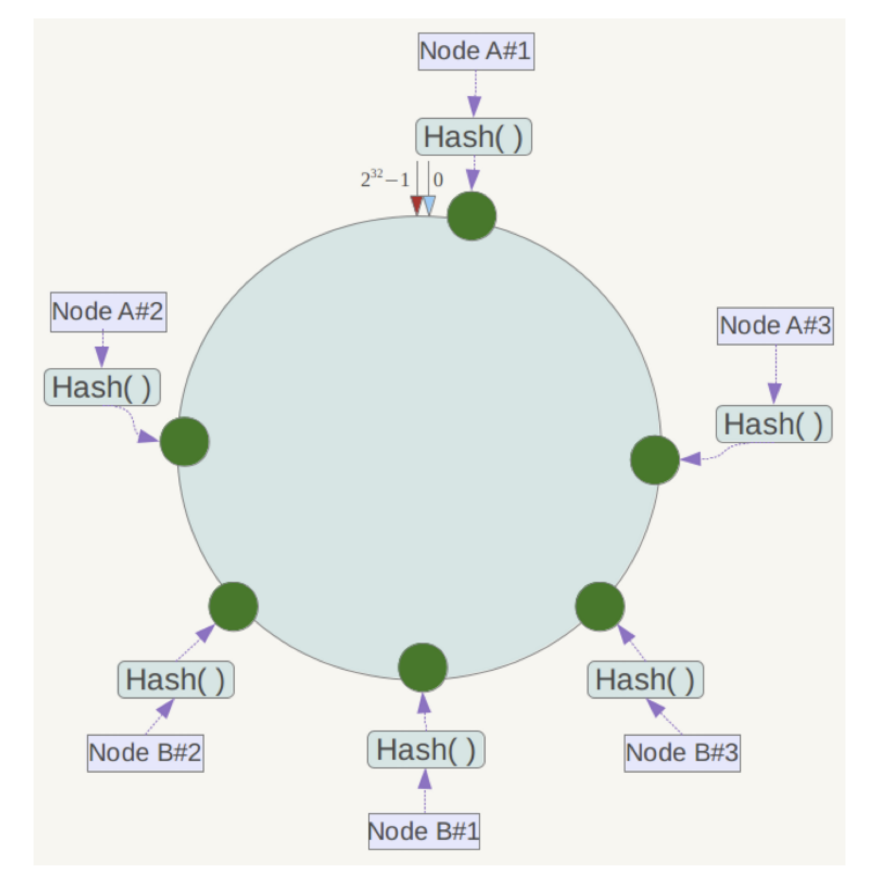
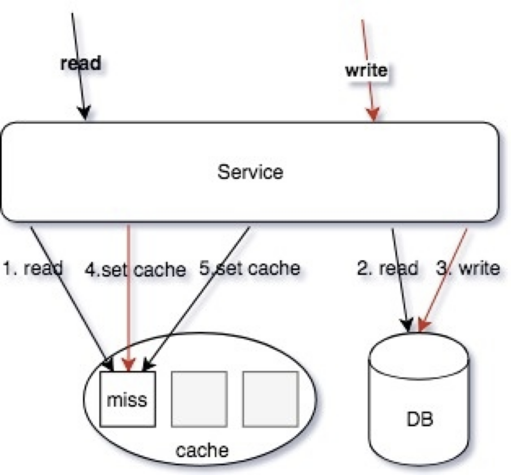

# 分布式缓存

## 缓存选型

### 缓存选型 - memcache

Memcache 提供简单的 kv cache 存储，value 大小不超过1mb。

我使用 Memcache 作为大文本或者简单的 kv结构使用。

Memcache 使用了slab 方式做内存管理，存在一定的浪费，如果大量接近的 item，建议调整 Memcache 参数来优化每一个 slab 增长的 ratio、可以通过设置 slab_automove & slab_reassign 开启 Memcache 的动态/手动 move slab，防止某些 slab 热点导致内存足够的情况下引发 LRU。

大部分情况下，简单 KV 推荐使用 Memcache，吞吐和相应都足够好。

每个 slab 包含若干大小为1M的内存页，这些内存又被分割成多个 chunk，每个 chunk 存储一个 item；

在 Memcache 启动初始化时，每个 slab 都预分配一个 1M 的内存页，由slabs_preallocate 完成（也可将相应代码注释掉关闭预分配功能）。

chunk 的增长因子由 -f 指定，默认1.25，起始大小为48字节。

### 缓存选型 - redis

Redis 有丰富的数据类型，支持增量方式的修改部分数据，比如排行榜，集合，数组等。

比较常用的方式是使用 Redis 作为数据索引，比如评论的列表 ID，播放历史的列表 ID 集合，我们的关系链列表 ID。

Redis 因为没有使用内存池，所以是存在一定的内存碎片的，一般会使用 jemalloc 来优化内存分配，需要编译时候使用 jemalloc 库代替 glib 的 malloc 使用。

Redis 和 Memcache 最大的区别其实是 redis 单线程（新版本双线程），memcache 多线程，所以 QPS 可能两者差异不大，但是吞吐会有很大的差别，比如大数据 value 返回的时候，redis qps 会抖动下降的的很厉害，因为单线程工作，其他查询进不来（新版本有不少的改善）。

所以建议纯 kv 都走 memcache，比如我们的关系链服务中用了 hashs 存储双向关系，但是我们也会使用 memcache 档一层来避免hgetall 导致的吞吐下降问题。

我们系统中多次使用 memcache + redis 双缓存设计。

### 缓存选型 - Proxy

早期使用 twemproxy 作为缓存代理，但是在使用上有如下一些痛点：

- 单进程单线程模型和 *Redis* 类似，在处理一些大 *key* 的时候可能出现 *io* 瓶颈；
- 二次开发成本难度高，难以于公司运维平台进行深度集成；
- 不支持自动伸缩，不支持 *autorebalance* 增删节点需要重启才能生效；
- 运维不友好，没有控制面板；

 从集中式访问缓存到 Sidecar 访问缓存：

  - 微服务强调去中心化；
  - LVS 运维困难，容易流量热点，随下游扩容而扩容，连接不均衡等问题；
  - Sidecar 伴生容器随 App 容器启动而启动，配置简化；

### 缓存选型 - 一致性Hash

一致性 hash 是将数据按照特征值映射到一个首尾相接的 hash 环上，同时也将节点（按照 IP 地址或者机器名 hash）映射到这个环上。

对于数据，从数据在环上的位置开始，顺时针找到的第一个节点即为数据的存储节点。

余数分布式算法由于保存键的服务器会发生巨大变化而影响缓存的命中率，但Consistent Hashing 中，只有在园（continuum）上增加服务器的地点逆时针方向的第一台服务器上的键会受到影响。

- 平衡性（Balance）：尽可能分布到所有的缓冲中去
- 单调性（Monotonicity）：单调性是指如果已经有一些内容通过哈希分派到了相应的缓冲中，又有新的缓冲区加入到系统中，那么哈希的结果应能够保证原有已分配的内容可以被映射到新的缓冲区中去，而不会被映射到旧的缓冲集合中的其他缓冲区。
- 分散性（Spread）：相同内容被存储到不同缓冲中去，降低了系统存储的效率，需要尽量降低分散性。
- 负载（Load）：哈希算法应能够尽量降低缓冲的负荷。
- 平滑性（Smoothness）：缓存服务器的数目平滑改变和缓存对象的平滑改变是一致的。

---

问题:

一致性哈希算法在服务节点太少时，容易因为节点分部不均匀而造成数据倾斜问题。

此时必然造成大量数据集中到 Node A 上，而只有极少量会定位到 Node B 上。为了解决这种数据倾斜问题，一致性哈希算法引入了虚拟节点机制，即对每一个服务节点计算多个哈希，每个计算结果位置都放置一个此服务节点，称为虚拟节点。

具体做法可以在服务器 IP 或主机名的后面增加编号来实现。

例如上面的情况，可以为每台服务器计算三个虚拟节点，于是可以分别计算 

“Node A#1”、“Node A#2”、“Node A#3”、“Node B#1”、“Node B#2”、“Node B#3”的哈希值，于是形成六个虚拟节点。

同时数据定位算法不变，只是多了一步虚拟节点到实际节点的映射，例如定位到

“Node A#1”、“Node A#2”、“Node A#3”三个虚拟节点的数据均定位到 Node A 上。这样就解决了服务节点少时数据倾斜的问题。

### 缓存选型 - Hash

数据分片的 hash 方式也是这个思想，即按照数据的某一特征（key）来计算哈希值，并将哈希值与系统中的节点建立映射关系,从而将哈希值不同的数据分布到不同的节点上。

按照 hash 方式做数据分片，映射关系非常简单；需要管理的元数据也非常之少，只需要记录节点的数目以及 hash 方式就行了。

当加入或者删除一个节点的时候，大量的数据需要移动。比如在这里增加一个节点 N3，因此 hash 方式变为了 mod 4。

均衡问题：原始数据的特征值分布不均匀，导致大量的数据集中到一个物理节点上；第二，对于可修改的记录数据，单条记录的数据变大。

> 高级玩法是抽象 *slot*，基于 *Hash* 的 *Slot Sharding*，例如 *Redis-Cluster*。

### 缓存选型 - Slot

redis-cluster 把16384 槽按照节点数量进行平均分配，由节点进行管理。

对每个 key 按照 CRC16 规则进行 hash 运算，把 hash 结果对16383进行取余，把余数发送给 Redis 节点。

需要注意的是：Redis Cluster 的节点之间会共享消息，每个节点都会知道是哪个节点负责哪个范围内的数据槽

## 缓存模式

### 缓存模式 - 数据一致性

Storage 和 Cache 同步更新容易出现数据不一致。

模拟 MySQL Slave 做数据复制，再把消息投递到 Kafka，保证至少一次消费：

*1.*同步操作 *DB*；

*2.*同步操作 *Cache*；

*3.*利用 *Job* 消费消息，重新补偿一次缓存操作

保证时效性和一致性。

---

下面是一个案例:

读/写同时操作：

读操作，读缓存，缓存 MISS

读操作，读 DB，读取到数据

写操作，更新 DB 数据

写操作 SET/DELETE Cache（可 Job 异步操作）

读操作，SET 操作数据回写缓存（可 Job 异步操作）

这种交互下，由于4和5操作步骤都是设置缓存，导致写入的值互相覆盖；并且操作的顺序性不确定，从而导致 cache 存在脏缓存的情况。

---

解决:

读/写同时操作：

读操作，读缓存，缓存 MISS

读操作，读 DB，读取到数据

写操作，更新 DB 数据

写操作 SET Cache（可异步 Job 操作，Redis 可以使用 SETEX 操作）

读操作，ADD 操作数据回写缓存（可 Job异步操作，Redis 可以使用 `SETNX` 操作）

写操作使用 SET 操作命令，覆盖写缓存；读操作，使用 ADD 操作回写 MISS 数据，从而保证写操作的最新数据不会被读操作的回写数据覆盖。

### 缓存模式 - 数据一致性

微服务拆分细粒度原子业务下的整合服务（聚合服务），用于提供粗粒度的接口，以及二级缓存加速，减少扇出的 RPC 网络请求，减少延迟。

最重要是保证多级缓存的一致性：

- 清理的优先级是有要求的，先优先清理下游再上游；
- 下游的缓存 *expire* 要大于上游，里面穿透回源；

### 缓存模式 - 热点缓存

对于热点缓存 Key，按照如下思路解决：

- 小表广播，从 RemoteCache 提升为LocalCache，App 定时更新，甚至可以让运营平台支持广播刷新 LocalCache；

- 主动监控防御预热，比如直播房间页高在线情况下直接外挂服务主动防御；

- 基础库框架支持热点发现，自动短时的 short-live cache；

- 多 Cluster 支持；

- - 多 Key 设计: 使用多副本，减小节点热点的问题

- - - 使用多副本 ms_1,ms_2,ms_3 每个节点保存一份数据，使得请求分散到多个节点，避免单点热点问题。

+ 建立多个 Cluster ，和微服务、存储等一起组成一个 Region。

这样相当于是用空间换时间：

同一个 *key* 在每一个 *frontend cluster* 都可能有一个 *copy*，这样会带来 *consistency* 的问题，但是这样能够降低 *latency* 和提高 *availability*。利用 *MySQL Binlog* 消息 *anycast* 到不同集群的某个节点清理或者更新缓存；

+ 当业务频繁更新时候，cache 频繁过期，会导致命中率低: stale sets

如果应用程序层可以忍受稍微过期一点的数据，针对这点可以进一步降低系统负载。当一个 *key* 被删除的时候（*delete* 请求或者 *cache* 爆棚清空间了），它被放倒一个临时的数据结构里，会再续上比较短的一段时间。当有请求进来的时候会返回这个数据并标记为*“Stale”*。对于大部分应用场景而言，*Stale Value* 是可以忍受的。*(*需要改 *memcache*、*Redis* 源码，或者基础库支持）；

### 缓存模式 - 缓存穿透

- - singlefly

对关键字进行一致性 hash，使其某一个维度的 key 一定命中某个节点，然后在节点内使用互斥锁，保证归并回源，但是对于批量查询无解；

- - 分布式锁

设置一个 lock key，有且只有一个人成功，并且返回，交由这个人来执行回源操作，其他候选者轮训 cache 这个 lock key，如果不存在去读数据缓存，hit 就返回，miss 继续抢锁；

- - 队列

如果 cache miss，交由队列聚合一个 key，来 load 数据回写缓存，对于 miss 当前请求可以使用 singlefly 保证回源，如评论架构实现。适合回源加载数据重的任务，比如评论 miss 只返回第一页，但是需要构建完成评论数据索引。

- - lease

通过加入 lease 机制，可以很好避免这两个问题，lease 是 64-bit 的 token，与客户端请求的 key 绑定，对于过时设置，在写入时验证 lease，可以解决这个问题；对于 thundering herd，每个key 10s 分配一次，当 client 在没有获取到 lease 时，可以稍微等一下再访问 cache，这时往往 cache 中已有数据。（基础库支持 & 修改 cache 源码）；

# 分布式事务

## 分布式事务 - 事务消息

- *Transactional outbox*
- *Polling publisher*
- *Transaction log tailing*
- *2PC Message Queue*

### 分布式事务 - Transactional outbox

*Transactional outbox*，支付宝在完成扣款的同时，同时记录消息数据，这个消息数据与业务数据保存在同一数据库实例里（消息记录表表名为 msg）。

*BEGIN TRANSACTION*

  *UPDATE A SET amount = amount - 10000 WHERE user_id = 1;*

  *INSERT INTO msg(user_id, amount, status) VALUES(1, 10000, 1);*

*END TRANSACTION*

*COMMIT;*

上述事务能保证只要支付宝账户里被扣了钱，消息一定能保存下来。当上述事务提交成功后，我们想办法将此消息通知余额宝，余额宝处理成功后发送回复成功消息，支付宝收到回复后删除该条消息数据。

### 分布式事务 - Polling publisher

*Polling publisher*，我们定时的轮训 *msg* 表，把 *status = 1* 的消息统统拿出来消费，可以按照自增 *id* 排序，保证顺序消费。在这里我们独立了一个 *pay_task* 服务，把拖出来的消息 *publish* 给我们消息队列，*balance* 服务自己来消费队列，或者直接 *rpc* 发送给 *balance* 服务。

### 分布式事务 - Transaction log tailing

*Transaction log tailing*，上述保存消息的方式使得消息数据和业务数据紧耦合在一起，从架构上看不够优雅，而且容易诱发其他问题。

有一些业务场景，可以直接使用主表被 canal 订阅使用，有一些业务场景自带这类 message 表，比如订单或者交易流水，可以直接使用这类流水表作为 message 表使用。

### 分布式事务 - 幂等

为什么相同的消息会被重复投递？比如余额宝处理完消息 *msg* 后，发送了处理成功的消息给支付宝，正常情况下支付宝应该要删除消息*msg*，但如果支付宝这时候悲剧的挂了，重启后一看消息 *msg* 还在，就会继续发送消息 *msg*。

- 全局唯一 *ID+* 去重表

  在余额宝这边增加消息应用状态表 msg_apply，通俗来说就是个账本，用于记录消息的消费情况，每次来一个消息，在真正执行之前，先去消息应用状态表中查询一遍，如果找到说明是重复消息，丢弃即可，如果没找到才执行，同时插入到消息应用状态表（同一事务）。

- 版本号

### 分布式事务 - 2PC

两阶段提交协议（Two Phase Commitment Protocol）中，涉及到两种角色

- 一个事务协调者（*coordinator*）：负责协调多个参与者进行事务投票及提交*(*回滚*)*
- 多个事务参与者（*participants*）：即本地事务执行者

总共处理步骤有两个

（*1*）投票阶段（*voting phase*）：协调者将通知事务参与者准备提交或取消事务，然后进入表决过程。参与者将告知协调者自己的决策：同意（事务参与者本地事务执行成功，但未提交）或取消（本地事务执行故障）；

（*2*）提交阶段（*commit phase*）：收到参与者的通知后，协调者再向参与者发出通知，根据反馈情况决定各参与者是否要提交还是回滚；

# 阅读

https://www.cnblogs.com/dyzcs/p/13780668.html
