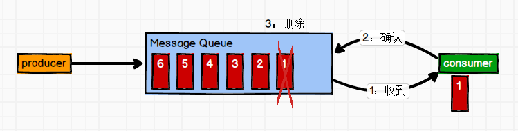
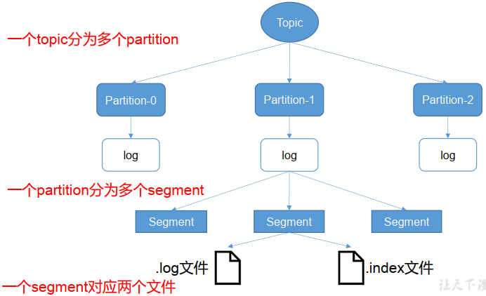
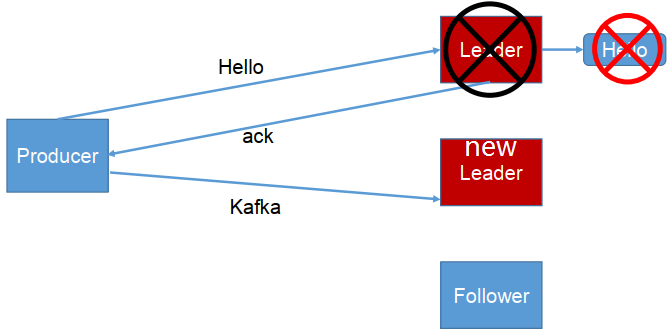
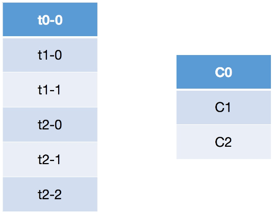

# Kafka学习

## 01_大纲部分

[Kafka学习笔记](https://my.oschina.net/jallenkwong/blog/4449224)

## 02_Kafka入门

Kafka 是一个**分布式**的基于**发布/订阅模式**的**消息队列**（Message Queue）

### 1.发布/订阅

在软件架构中，**发布-订阅**是一种消息范式，消息的发送者（称为发布者）不会将消息直接发送给特定的接收者（称为订阅者）。而是将发布的消息分为不同的类别，无需了解哪些订阅者（如果有的话）可能存在。同样的，订阅者可以表达对一个或多个类别的兴趣，只接收感兴趣的消息，无需了解哪些发布者（如果有的话）存在。

### 2.消息队列
当不需要立即获得结果，但是并发量又需要进行控制的时候，差不多就是需要使用消息队列的时候。

消息队列主要解决了应用耦合、异步处理、流量削锋等问题。


## 03_Kafka入门_定义


### 使用消息队列的好处
1. **解耦**
   - 允许你独立的扩展或修改两边的处理过程，只要确保它们遵守同样的接口约束。
2. **可恢复性**
   - 系统的一部分组件失效时，不会影响到整个系统。消息队列降低了进程间的耦合度，所以即使一个处理消息的进程挂掉，加入队列中的消息仍然可以在系统恢复后被处理。
3. **缓冲**
   - 有助于控制和优化数据流经过系统的速度， 解决生产消息和消费消息的处理速度不一致的情况。
4. **灵活性 & 峰值处理能力（削峰）**
   - 在访问量剧增的情况下，应用仍然需要继续发挥作用，但是这样的突发流量并不常见。如果为以能处理这类峰值访问为标准来投入资源随时待命无疑是巨大的浪费。使用消息队列能够使关键组件顶住突发的访问压力，而不会因为突发的超负荷的请求而完全崩溃。
5. **异步通信**
   - 很多时候，用户不想也不需要立即处理消息。消息队列提供了异步处理机制，允许用户把一个消息放入队列，但并不立即处理它。想向队列中放入多少消息就放多少，然后在需要的时候再去处理它们。


## 04_消息队列的两种模式

### 1.点对点模式

**一对一，消费者主动拉取数据，消息收到后消息清除**

消息生产者生产消息发送到Queue中，然后消息消费者从Queue中取出并且消费消息。消息被消费以后， queue 中不再有存储，所以消息消费者不可能消费到已经被消费的消息。Queue 支持存在多个消费者，但是对一个消息而言，只会有一个消费者可以消费。



### 2.发布/订阅模式

**一对多，消费者消费数据之后不会清除消息**

消息生产者（发布）将消息发布到 topic 中，同时有多个消息消费者（订阅）消费该消息。和点对点方式不同，发布到 topic 的消息会被所有订阅者消费。

发布订阅模式：

1. 由队列推送数据  

2. 由消费者拉取数据（kafka使用这方式）

kafka使用第二种,可能存在问题，消费者一直询问


## 05_Kafka基础架构


1. **Producer** ： 消息生产者，就是向 Kafka生产数据；

2. **Consumer** ： 消息消费者，向 Kafka broker 取消息的客户端；

3. **Consumer Group （CG）**： 消费者组，由多个 consumer 组成。 消费者组内每个消费者负责消费不同分区的数据，一个分区只能由一个组内消费者消费；消费者组之间互不影响。 所有的消费者都属于某个消费者组，即消费者组是逻辑上的一个订阅者。**消费者存储具体的消费位置**

   + **一个消费者可以消费多个分区的数据，反过来不行**

   + **消费者小于等于分区，消费者和分区的分区相等比较好**

4. **Broker** ：服务代理结点 一台 Kafka 服务器就是一个 broker。一个集群由多个 broker 组成。一个 broker可以容纳多个 topic。

5. **Topic** ： 主题，可以理解为一个队列， 生产者和消费者面向的都是一个 topic；

6. **Partition**： 分区，为了实现扩展性，一个非常大的 topic 可以分布到多个 broker（即服务器）上，一个 topic 可以分为多个 partition，每个 partition 是一个有序的队列；
7. **Replica**： 副本（Replication），为保证集群中的某个节点发生故障时， 该节点上的 partition 数据不丢失，且 Kafka仍然能够继续工作， Kafka 提供了副本机制，一个 topic 的每个分区都有若干个副本，一个 leader 和若干个 follower。
8. **Leader**： 每个分区多个副本的“主”，生产者发送数据的对象，以及消费者消费数据的对象都是 leader。
9. **Follower**： 每个分区多个副本中的“从”，实时从 leader 中同步数据，保持和 leader 数据的同步。 leader 发生故障时，某个 Follower 会成为新的 leader。
10. **Zookeeper**：存储Kafka集群信息  


## 06_Kafka安装-启动-关闭

### 1.安装

略

### 2.启动

+ 启动前可以修改`conf`文件夹下的配置
+ 使用`kafka-server-start config/server.properties`启动，注意，这是mac的启动。推荐简单的启动方法，使用homebrew安装，然后使用`brew services start kafka`可以快速启动
+ 如果想要后台运行可以加上`-daemon`

### 3.关闭

直接使用`kafka-server-stop`进行关闭


## 07_Kafka Topic增删查

### 1.查看Topic

`kafka-topics --list --zookeeper localhost:2181`

```go
func main() {
	conn, err := kafka.Dial("tcp", "localhost:9092")
	if err != nil {
		panic(err.Error())
	}
	defer conn.Close()

	// 得到所有分区的相关信息
	partitions, err := conn.ReadPartitions()
	if err != nil {
		panic(err.Error())
	}

	// 因为一个topic可能又多个分区,去重
	m := map[string]struct{}{}
	for _, p := range partitions {
		m[p.Topic] = struct{}{}
	}

	// 列出所有topic
	for k := range m {
		fmt.Println(k)
	}
}
```

### 2.创建Topic

`kafka-topics --create --zookeeper localhost:2181 --topic first --partitions 1 --replication-factor 1`

- --topic 定义 topic 名,这里建立了一个名字叫`first`的topic
- --replication-factor 定义副本数
- --partitions 定义分区数

***默认auto.create.topics.enable='true'***

```go
import (
	"context"
	"github.com/segmentio/kafka-go"
)

func main() {
	conn, err := kafka.DialLeader(context.Background(), "tcp", "localhost:9092", "my-topic", 0)
	defer conn.Close()
	if err != nil {
		panic(err.Error())
	}
}
```

***auto.create.topics.enable='true'***情况

```text
https://github.com/segmentio/kafka-go   To Create Topic部分
```


### 3.删除Topic

`kafka-topics --delete --zookeeper localhost:2181 --topic first`

### 4.查看详细信息

`kafka-topics --topic test --describe --zookeeper localhost:2181`


### 5.其他问题：副本数不能超过机器数

## 08_生产者消费者发送消息

### 1.消费者消费消息

`kafka-console-consumer --bootstrap-server localhost:9092 --topic test`

+ --bootstrap-server:指定了连接的kafka集群

```go
r := kafka.NewReader(kafka.ReaderConfig{
    Brokers:   []string{"localhost:9092"},
    Topic:     "topic-A",
    Partition: 0,
    MinBytes:  10e3, // 10KB
    MaxBytes:  10e6, // 10MB
})
r.SetOffset(42)

for {
    m, err := r.ReadMessage(context.Background())
    if err != nil {
        break
    }
    fmt.Printf("message at offset %d: %s = %s\n", m.Offset, string(m.Key), string(m.Value))
}

if err := r.Close(); err != nil {
    log.Fatal("failed to close reader:", err)
}
```

还有其他接收消息的方式

### 2.生产者发送消息

`kafka-console-producer --broker-list localhost:9092 --topic test`

+ --broker-list:指定连接的Kafka集群地址

**方法一**

```go
func main() {
	// 建立连接
	conn, err := kafka.DialLeader(context.Background(), "tcp", "localhost:9092", "my-topic", 0)
	defer conn.Close()
	if err != nil {
		log.Fatal("failed to dial leader:", err)
	}
	// 设置写超时
	conn.SetWriteDeadline(time.Now().Add(10 * time.Second))
	// 写入数据
	conn.WriteMessages(
		kafka.Message{Value: []byte("one")},
		kafka.Message{Value: []byte("two"),})
	if err != nil {
		panic(err.Error())
	}
}
```

**方法二(推荐)**

```go
w := &kafka.Writer{
		Addr:     kafka.TCP("localhost:9092"),
		Topic:   "my-topic",
		Balancer: &kafka.LeastBytes{},
	}

	err := w.WriteMessages(context.Background(),
		kafka.Message{
			Key:   []byte("Key-A"),
			Value: []byte("Hello World!"),
		},
		kafka.Message{
			Key:   []byte("Key-B"),
			Value: []byte("Hi Everybody!"),
		},
		kafka.Message{
			Key:   []byte("Key-C"),
			Value: []byte("Is Anyone there!"),
		},
	)
	if err != nil {
		log.Fatal("failed to write messages:", err)
	}

	if err := w.Close(); err != nil {
		log.Fatal("failed to close writer:", err)
	}
```


## 09_Kafka数据日志分离

略


## 10_Kafka入门_回顾

略


## 11_Kafka工作流程


+ topic 是逻辑上的概念，而 partition 是物理上的概念，每个 partition 对应于一个 log 文件，该 log 文件中存储的就是 producer 生产的数据。（topic = N partition，partition = log）

+ Producer 生产的数据会被不断追加到该log 文件末端，且每条数据都有自己的 offset。 consumer组中的每个consumer， 都会实时记录自己消费到了哪个 offset，以便出错恢复时，从上次的位置继续消费。（producer -> log with offset -> consumer(s)）


## 12_Kafka文件存储



由于生产者生产的消息会不断追加到 log 文件末尾， 为防止 log 文件过大导致数据定位效率低下， Kafka 采取了**分片**和**索引**机制，将每个 partition 分为多个 segment。

每个 segment对应两个文件——“.index”文件和“.log”文件。 这些文件位于一个文件夹下， 该文件夹的命名规则为： topic 名称+分区序号。例如， first 这个 topic 有三个分区，则其对应的文件夹为 first-0,first-1,first-2。

```
00000000000000000000.index
00000000000000000000.log
00000000000000170410.index
00000000000000170410.log
00000000000000239430.index
00000000000000239430.log
```

index 和 log 文件以当前 segment 的第一条消息的 offset 命名。下图为 index 文件和 log文件的结构示意图。


**“.index”文件存储大量的索引信息，“.log”文件存储大量的数据**，索引文件中的元数据指向对应数据文件中 message 的物理偏移地址。


## 13_Kafka 生产者分区策略

### 1.分区的原因

1. **方便在集群中扩展**，每个 Partition 可以通过调整以适应它所在的机器，而一个 topic又可以有多个 Partition 组成，因此整个集群就可以适应适合的数据了；
2. **可以提高并发**，因为可以以 Partition 为单位读写了。（联想到ConcurrentHashMap在高并发环境下读写效率比HashTable的高效）

### 2.分区的原则


1. 指明 partition 的情况下，直接将指明的值直接作为 partiton 值；
2. 没有指明 partition 值但有 key 的情况下，将 key 的 hash 值与 topic 的 partition 数进行取余得到 partition 值；
3. 既没有 partition 值又没有 key 值的情况下，第一次调用时随机生成一个整数（后面每次调用在这个整数上自增），将这个值与 topic 可用的 partition 总数取余得到 partition值，也就是常说的 round-robin 算法。

## 14_Kafka生产者ISR

为保证 producer 发送的数据，能可靠的发送到指定的 topic， topic 的每个 partition 收到producer 发送的数据后，都需要向 producer 发送 ack（acknowledgement 确认收到），如果producer 收到 ack， 就会进行下一轮的发送，否则重新发送数据。


**如法发送ack**

确保有follower与leader同步完成，leader再发送ack，这样才能保证leader挂掉之后，能在follower中选举出新的leader。

----

### 1.副本数据同步策略

**多少个follower同步完成之后发送ack？**

1. 半数以上的follower同步完成，即可发送ack继续发送重新发送
2. 全部的follower同步完成，才可以发送ack

| 序号 | 方案                          | 优点                                                         | 缺点                                                         |
| ---- | ----------------------------- | ------------------------------------------------------------ | ------------------------------------------------------------ |
| 1    | 半数以上完成同步， 就发送 ack | 延迟低                                                       | 选举新的 leader 时，容忍 n 台节点的故障，需要 2n+1 个副本。（如果集群有2n+1台机器，选举leader的时候至少需要半数以上即n+1台机器投票，那么能容忍的故障，最多就是n台机器发生故障）容错率：1/2 |
| 2    | 全部完成同步，才发送ack       | 选举新的 leader 时， 容忍 n 台节点的故障，需要 n+1 个副本（如果集群有n+1台机器，选举leader的时候只要有一个副本就可以了）容错率：1 | 延迟高                                                       |

Kafka 选择了第二种方案，原因如下：

1. 同样为了容忍 n 台节点的故障，第一种方案需要 2n+1 个副本，而第二种方案只需要 n+1 个副本，而 Kafka 的每个分区都有大量的数据， 第一种方案会造成大量数据的冗余。
2. 虽然第二种方案的网络延迟会比较高，但网络延迟对 Kafka 的影响较小。

### 2.ISR

采用第二种方案之后，设想以下情景： leader 收到数据，所有 follower 都开始同步数据，但有一个 follower，因为某种故障，迟迟不能与 leader 进行同步，那 leader 就要一直等下去，直到它完成同步，才能发送 ack。这个问题怎么解决呢？

Leader 维护了一个动态的 **in-sync replica set** (ISR)，意为和 leader 保持同步的 follower 集合。当 ISR 中的 follower 完成数据的同步之后，就会给 leader 发送 ack。如果 follower长时间未向leader同步数据，则该follower将被踢出ISR，该时间阈值由`replica.lag.time.max.ms`参数设定。 Leader 发生故障之后，就会从 ISR 中选举新的 leader。


## 15_Kafka生产者ACK机制

对于某些不太重要的数据，对数据的可靠性要求不是很高，能够容忍数据的少量丢失，所以没必要等 ISR 中的 follower 全部接收成功。

所以 Kafka 为用户提供了三种可靠性级别，用户根据对可靠性和延迟的要求进行权衡，选择以下的配置。

### acks 参数配置：

- 0： producer 不等待 broker 的 ack，这一操作提供了一个最低的延迟， broker 一接收到还没有写入磁盘就已经返回，当 broker 故障时有可能**丢失数据**；
- 1： producer 等待 broker 的 ack， partition 的 leader 落盘成功后返回 ack，如果在 follower同步成功之前 leader 故障，那么将会**丢失数据**；



- -1（all） ： producer 等待 broker 的 ack， partition 的 leader 和 ISR 的follower 全部落盘成功后才返回 ack。但是如果在 follower 同步完成后， broker 发送 ack 之前， leader 发生故障，那么会造成**数据重复**。


```markdown
acks
The number of acknowledgments the producer requires the leader to have received before considering a request complete. This controls the durability of records that are sent. The following settings are allowed:

**acks=0** If set to zero then the producer will not wait for any acknowledgment from the server at all. The record will be immediately added to the socket buffer and considered sent. No guarantee can be made that the server has received the record in this case, and the retries configuration will not take effect (as the client won't generally know of any failures). The offset given back for each record will always be set to -1.
**acks=1** This will mean the leader will write the record to its local log but will respond without awaiting full acknowledgement from all followers. In this case should the leader fail immediately after acknowledging the record but before the followers have replicated it then the record will be lost.
**acks=all** This means the leader will wait for the full set of in-sync replicas to acknowledge the record. This guarantees that the record will not be lost as long as at least one in-sync replica remains alive. This is the strongest available guarantee. This is equivalent to the acks=-1 setting.
Type:	string
Default:	1
Valid Values:	[all, -1, 0, 1]
Importance:	high
```


## 16_数据一致性问题


- LEO：（Log End Offset）每个副本的最后一个offset
- HW：（High Watermark）高水位，指的是消费者能见到的最大的 offset， ISR 队列中最小的 LEO

### 1.follower 故障和 leader 故障

- **follower 故障**：follower 发生故障后会被临时踢出 ISR，待该 follower 恢复后， follower 会读取本地磁盘记录的上次的 HW，并将 log 文件高于 HW 的部分截取掉，从 HW 开始向 leader 进行同步。等该 follower 的 LEO 大于等于该 Partition 的 HW，即 follower 追上 leader 之后，就可以重新加入 ISR 了。
- **leader 故障**：leader 发生故障之后，会从 ISR 中选出一个新的 leader，之后，为保证多个副本之间的数据一致性， 其余的 follower 会先将各自的 log 文件高于 HW 的部分截掉，然后从新的 leader同步数据。

注意： 这只能保证副本之间的数据一致性，并不能保证数据不丢失或者不重复。


## 17_Kafka_Exactly Once

将服务器的 ACK 级别设置为-1（all），可以保证 Producer 到 Server 之间不会丢失数据，即 **At Least Once** 语义。

相对的，将服务器 ACK 级别设置为 0，可以保证生产者每条消息只会被发送一次，即 **At Most Once** 语义。

At Least Once 可以保证数据不丢失，但是不能保证数据不重复；相对的， At Most Once可以保证数据不重复，但是不能保证数据不丢失。 但是，对于一些非常重要的信息，比如说**交易数据**，下游数据消费者要求数据既不重复也不丢失，即 **Exactly Once** 语义。


在 0.11 版本以前的 Kafka，对此是无能为力的，只能保证数据不丢失，再在下游消费者对数据做全局去重。对于多个下游应用的情况，每个都需要单独做全局去重，这就对性能造成了很大影响。

0.11 版本的 Kafka，引入了一项重大特性：**幂等性**。**所谓的幂等性就是指 Producer 不论向 Server 发送多少次重复数据， Server 端都只会持久化一条**。幂等性结合 At Least Once 语义，就构成了 Kafka 的 Exactly Once 语义。即：

```
At Least Once + 幂等性 = Exactly Once
```

要启用幂等性，只需要将 Producer 的参数中 `enable.idempotence` 设置为 true 即可。 Kafka的幂等性实现其实就是将原来下游需要做的去重放在了数据上游。开启幂等性的 Producer 在初始化的时候会被分配一个 PID，发往同一 Partition 的消息会附带 Sequence Number。而Broker 端会对`<PID, Partition, SeqNumber>`做缓存，当具有相同主键的消息提交时， Broker 只会持久化一条。

但是 PID 重启就会变化，同时不同的 Partition 也具有不同主键，所以幂等性无法保证跨分区跨会话的 Exactly Once。


## 18_Kafka生产者总结（略）


## 19_Kafka消费者分区分配策略

### 1.消费方式

**consumer 采用 pull（拉） 模式从 broker 中读取数据**。

**push（推）模式很难适应消费速率不同的消费者，因为消息发送速率是由 broker 决定的**。它的目标是尽可能以最快速度传递消息，但是这样很容易造成 consumer 来不及处理消息，典型的表现就是拒绝服务以及网络拥塞。而 pull 模式则可以根据 consumer 的消费能力以适当的速率消费消息。

**pull 模式不足之处**是，如果 kafka 没有数据，消费者可能会陷入循环中， 一直返回空数据。 针对这一点， Kafka 的消费者在消费数据时会传入一个时长参数 timeout，如果当前没有数据可供消费， consumer 会等待一段时间之后再返回，这段时长即为 timeout。

### 2.分区分配策略

一个 consumer group 中有多个 consumer，一个 topic 有多个 partition，所以必然会涉及到 partition 的分配问题，即确定那个 partition 由哪个 consumer 来消费。

Kafka 有两种分配策略：

- round-robin循环
- range

#### 2.1 Round

关于Roudn Robin重分配策略，其主要采用的是一种轮询的方式分配所有的分区，该策略主要实现的步骤如下。这里我们首先假设有三个topic：t0、t1和t2，这三个topic拥有的分区数分别为1、2和3，那么总共有六个分区，这六个分区分别为：t0-0、t1-0、t1-1、t2-0、t2-1和t2-2。这里假设我们有三个consumer：C0、C1和C2，它们订阅情况为：C0订阅t0，C1订阅t0和t1，C2订阅t0、t1和t2。那么这些分区的分配步骤如下：

- 首先将所有的partition和consumer按照字典序进行排序，所谓的字典序，就是按照其名称的字符串顺序，那么上面的六个分区和三个consumer排序之后分别为：



- 然后依次以按顺序轮询的方式将这六个分区分配给三个consumer，如果当前consumer没有订阅当前分区所在的topic，则轮询的判断下一个consumer：
- 尝试将t0-0分配给C0，由于C0订阅了t0，因而可以分配成功；
- 尝试将t1-0分配给C1，由于C1订阅了t1，因而可以分配成功；
- 尝试将t1-1分配给C2，由于C2订阅了t1，因而可以分配成功；
- 尝试将t2-0分配给C0，由于C0没有订阅t2，因而会轮询下一个consumer；
- 尝试将t2-0分配给C1，由于C1没有订阅t2，因而会轮询下一个consumer；
- 尝试将t2-0分配给C2，由于C2订阅了t2，因而可以分配成功；
- 同理由于t2-1和t2-2所在的topic都没有被C0和C1所订阅，因而都不会分配成功，最终都会分配给C2。
- 按照上述的步骤将所有的分区都分配完毕之后，最终分区的订阅情况如下：


从上面的步骤分析可以看出，轮询的策略就是简单的将所有的partition和consumer按照字典序进行排序之后，然后依次将partition分配给各个consumer，如果当前的consumer没有订阅当前的partition，那么就会轮询下一个consumer，直至最终将所有的分区都分配完毕。但是从上面的分配结果可以看出，轮询的方式会导致每个consumer所承载的分区数量不一致，从而导致各个consumer压力不均一。

#### 2.2 Range

所谓的Range重分配策略，就是首先会计算各个consumer将会承载的分区数量，然后将指定数量的分区分配给该consumer。这里我们假设有两个consumer：C0和C1，两个topic：t0和t1，这两个topic分别都有三个分区，那么总共的分区有六个：t0-0、t0-1、t0-2、t1-0、t1-1和t1-2。那么Range分配策略将会按照如下步骤进行分区的分配：

- 需要注意的是，Range策略是按照topic依次进行分配的，比如我们以t0进行讲解，其首先会获取t0的所有分区：t0-0、t0-1和t0-2，以及所有订阅了该topic的consumer：C0和C1，并且会将这些分区和consumer按照字典序进行排序；
- 然后按照平均分配的方式计算每个consumer会得到多少个分区，如果没有除尽，则会将多出来的分区依次计算到前面几个consumer。比如这里是三个分区和两个consumer，那么每个consumer至少会得到1个分区，而3除以2后还余1，那么就会将多余的部分依次算到前面几个consumer，也就是这里的1会分配给第一个consumer，总结来说，那么C0将会从第0个分区开始，分配2个分区，而C1将会从第2个分区开始，分配1个分区；
- 同理，按照上面的步骤依次进行后面的topic的分配。
- 最终上面六个分区的分配情况如下：


可以看到，如果按照`Range`分区方式进行分配，其本质上是依次遍历每个topic，然后将这些topic的分区按照其所订阅的consumer数量进行平均的范围分配。这种方式从计算原理上就会导致排序在前面的consumer分配到更多的分区，从而导致各个consumer的压力不均衡。

## 20_Kafka高级_消费者offset存储

等待补充


## 21_Kafka消费者组

### 需求

测试同一个消费者组中的消费者， **同一时刻只能有一个**消费者消费。

### 操作步骤

1.修改`%KAFKA_HOME\config\consumer.properties%`文件中的`group.id`属性。

```properties
group.id={{name}}
```

2.打开两个cmd，分别启动两个消费者。（以`%KAFKA_HOME\config\consumer.properties%`作配置参数）

```bat
kafka-console-consumer --bootstrap-server localhost:9092 --topic test
```

3.再打开一个cmd，启动一个生产者。

```bat
kafka-console-producer --broker-list localhost:9092 --topic test
```

4.在生产者窗口输入消息，观察两个消费者窗口。**会发现两个消费者窗口中，只有一个才会弹出消息**。


## 待定

### 1.Kafka创建消费者集群(默认分区数=消费者数目)

```go
// make a new reader that consumes from topic-A
r := kafka.NewReader(kafka.ReaderConfig{
    Brokers:   []string{"localhost:9092"},
    GroupID:   "consumer-group-id",
    Topic:     "topic-A",
    MinBytes:  10e3, // 10KB
    MaxBytes:  10e6, // 10MB
})

for {
    m, err := r.ReadMessage(context.Background())
    if err != nil {
        break
    }
    fmt.Printf("message at topic/partition/offset %v/%v/%v: %s = %s\n", m.Topic, m.Partition, m.Offset, string(m.Key), string(m.Value))
}

if err := r.Close(); err != nil {
    log.Fatal("failed to close reader:", err)
}
```

There are a number of limitations when using consumer groups:

- `(*Reader).SetOffset` will return an error when GroupID is set
- `(*Reader).Offset` will always return `-1` when GroupID is set
- `(*Reader).Lag` will always return `-1` when GroupID is set
- `(*Reader).ReadLag` will return an error when GroupID is set
- `(*Reader).Stats` will return a partition of `-1` when GroupID is set


查看消费者集群

`kafka-consumer-groups --bootstrap-server localhost:9092 --list`

查看具体消费者信息

`kafka-consumer-groups --bootstrap-server localhost:9092 --describe --group {{group_name}}`


### 2. 代码显示提交

Instead of calling `ReadMessage`, call `FetchMessage` followed by `CommitMessages`.

```go
ctx := context.Background()
for {
    m, err := r.FetchMessage(ctx)
    if err != nil {
        break
    }
    fmt.Printf("message at topic/partition/offset %v/%v/%v: %s = %s\n", m.Topic, m.Partition, m.Offset, string(m.Key), string(m.Value))
    if err := r.CommitMessages(ctx, m); err != nil {
        log.Fatal("failed to commit messages:", err)
    }
}
```

### 3.在Config中设置`commitInterval`定期提交偏移量

```go
// make a new reader that consumes from topic-A
r := kafka.NewReader(kafka.ReaderConfig{
    Brokers:        []string{"localhost:9092"},
    GroupID:        "consumer-group-id",
    Topic:          "topic-A",
    MinBytes:       10e3, // 10KB
    MaxBytes:       10e6, // 10MB
    CommitInterval: time.Second, // flushes commits to Kafka every second
})
```

