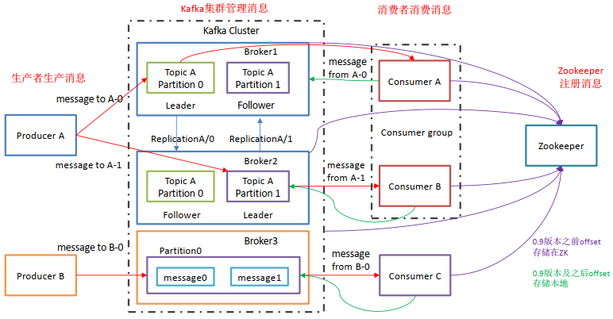

# Kafka学习

## 01_大纲部分

[Kafka学习笔记](https://my.oschina.net/jallenkwong/blog/4449224)

## 02_Kafka入门

Kafka 是一个**分布式**的基于**发布/订阅模式**的**消息队列**（Message Queue）

### 发布/订阅

在软件架构中，**发布-订阅**是一种消息范式，消息的发送者（称为发布者）不会将消息直接发送给特定的接收者（称为订阅者）。而是将发布的消息分为不同的类别，无需了解哪些订阅者（如果有的话）可能存在。同样的，订阅者可以表达对一个或多个类别的兴趣，只接收感兴趣的消息，无需了解哪些发布者（如果有的话）存在。

### 消息队列
当不需要立即获得结果，但是并发量又需要进行控制的时候，差不多就是需要使用消息队列的时候。

消息队列主要解决了应用耦合、异步处理、流量削锋等问题。


## 03_Kafka入门_定义


### 使用消息队列的好处
1. **解耦**
   - 允许你独立的扩展或修改两边的处理过程，只要确保它们遵守同样的接口约束。
2. **可恢复性**
   - 系统的一部分组件失效时，不会影响到整个系统。消息队列降低了进程间的耦合度，所以即使一个处理消息的进程挂掉，加入队列中的消息仍然可以在系统恢复后被处理。
3. **缓冲**
   - 有助于控制和优化数据流经过系统的速度， 解决生产消息和消费消息的处理速度不一致的情况。
4. **灵活性 & 峰值处理能力（削峰）**
   - 在访问量剧增的情况下，应用仍然需要继续发挥作用，但是这样的突发流量并不常见。如果为以能处理这类峰值访问为标准来投入资源随时待命无疑是巨大的浪费。使用消息队列能够使关键组件顶住突发的访问压力，而不会因为突发的超负荷的请求而完全崩溃。
5. **异步通信**
   - 很多时候，用户不想也不需要立即处理消息。消息队列提供了异步处理机制，允许用户把一个消息放入队列，但并不立即处理它。想向队列中放入多少消息就放多少，然后在需要的时候再去处理它们。


## 04_消息队列的两种模式

### 1.点对点模式

**一对一，消费者主动拉取数据，消息收到后消息清除**

消息生产者生产消息发送到Queue中，然后消息消费者从Queue中取出并且消费消息。消息被消费以后， queue 中不再有存储，所以消息消费者不可能消费到已经被消费的消息。Queue 支持存在多个消费者，但是对一个消息而言，只会有一个消费者可以消费。


### 2.发布/订阅模式

**一对多，消费者消费数据之后不会清除消息**

消息生产者（发布）将消息发布到 topic 中，同时有多个消息消费者（订阅）消费该消息。和点对点方式不同，发布到 topic 的消息会被所有订阅者消费。

发布订阅模式：

1. 由队列推送数据  

2. 由消费者拉取数据（kafka使用这方式）

kafka使用第二种,可能存在问题，消费者一直询问


## 05_Kafka基础架构



1. **Producer** ： 消息生产者，就是向 Kafka生产数据；

2. **Consumer** ： 消息消费者，向 Kafka broker 取消息的客户端；

3. **Consumer Group （CG）**： 消费者组，由多个 consumer 组成。 消费者组内每个消费者负责消费不同分区的数据，一个分区只能由一个组内消费者消费；消费者组之间互不影响。 所有的消费者都属于某个消费者组，即消费者组是逻辑上的一个订阅者。**消费者存储具体的消费位置**

   + **一个消费者可以消费多个分区的数据，反过来不行**

   + **消费者小于等于分区，消费者和分区的分区相等比较好**

4. **Broker** ：服务代理结点 一台 Kafka 服务器就是一个 broker。一个集群由多个 broker 组成。一个 broker可以容纳多个 topic。

5. **Topic** ： 主题，可以理解为一个队列， 生产者和消费者面向的都是一个 topic；

6. **Partition**： 分区，为了实现扩展性，一个非常大的 topic 可以分布到多个 broker（即服务器）上，一个 topic 可以分为多个 partition，每个 partition 是一个有序的队列；
7. **Replica**： 副本（Replication），为保证集群中的某个节点发生故障时， 该节点上的 partition 数据不丢失，且 Kafka仍然能够继续工作， Kafka 提供了副本机制，一个 topic 的每个分区都有若干个副本，一个 leader 和若干个 follower。
8. **Leader**： 每个分区多个副本的“主”，生产者发送数据的对象，以及消费者消费数据的对象都是 leader。
9. **Follower**： 每个分区多个副本中的“从”，实时从 leader 中同步数据，保持和 leader 数据的同步。 leader 发生故障时，某个 Follower 会成为新的 leader。
10. **Zookeeper**：存储Kafka集群信息  


## 06_Kafka安装-启动-关闭

### 1.安装

略

### 2.启动

+ 启动前可以修改`conf`文件夹下的配置
+ 使用`kafka-server-start config/server.properties`启动，注意，这是mac的启动。推荐简单的启动方法，使用homebrew安装，然后使用`brew services start kafka`可以快速启动
+ 如果想要后台运行可以加上`-daemon`

### 3.关闭

直接使用`kafka-server-stop`进行关闭


## 07_Kafka Topic增删查

### 1.查看Topic

`kafka-topics --list --zookeeper localhost:2181`

```go
func main() {
	conn, err := kafka.Dial("tcp", "localhost:9092")
	if err != nil {
		panic(err.Error())
	}
	defer conn.Close()

	// 得到所有分区的相关信息
	partitions, err := conn.ReadPartitions()
	if err != nil {
		panic(err.Error())
	}

	// 因为一个topic可能又多个分区,去重
	m := map[string]struct{}{}
	for _, p := range partitions {
		m[p.Topic] = struct{}{}
	}

	// 列出所有topic
	for k := range m {
		fmt.Println(k)
	}
}
```

### 2.创建Topic

`kafka-topics --create --zookeeper localhost:2181 --topic first --partitions 1 --replication-factor 1`

- --topic 定义 topic 名,这里建立了一个名字叫`first`的topic
- --replication-factor 定义副本数
- --partitions 定义分区数

***默认auto.create.topics.enable='true'***

```go
import (
	"context"
	"github.com/segmentio/kafka-go"
)

func main() {
	conn, err := kafka.DialLeader(context.Background(), "tcp", "localhost:9092", "my-topic", 0)
	defer conn.Close()
	if err != nil {
		panic(err.Error())
	}
}
```

***auto.create.topics.enable='true'***情况

```text
https://github.com/segmentio/kafka-go   To Create Topic部分
```


### 3.删除Topic

`kafka-topics --delete --zookeeper localhost:2181 --topic first`

### 4.查看详细信息

`kafka-topics --topic test --describe --zookeeper localhost:2181`


### 其他问题：副本数不能超过机器数

## 07_生产者消费者发送消息

### 1.消费者消费消息

`kafka-console-consumer --bootstrap-server localhost:9092 --topic test`

+ --bootstrap-server:指定了连接的kafka集群

```go
r := kafka.NewReader(kafka.ReaderConfig{
    Brokers:   []string{"localhost:9092"},
    Topic:     "topic-A",
    Partition: 0,
    MinBytes:  10e3, // 10KB
    MaxBytes:  10e6, // 10MB
})
r.SetOffset(42)

for {
    m, err := r.ReadMessage(context.Background())
    if err != nil {
        break
    }
    fmt.Printf("message at offset %d: %s = %s\n", m.Offset, string(m.Key), string(m.Value))
}

if err := r.Close(); err != nil {
    log.Fatal("failed to close reader:", err)
}
```

还有其他接收消息的方式

### 2.生产者发送消息

`kafka-console-producer --broker-list localhost:9092 --topic test`

+ --broker-list:指定连接的Kafka集群地址

```go
func main() {
	// 建立连接
	conn, err := kafka.DialLeader(context.Background(), "tcp", "localhost:9092", "my-topic", 0)
	defer conn.Close()
	if err != nil {
		log.Fatal("failed to dial leader:", err)
	}
	// 设置写超时
	conn.SetWriteDeadline(time.Now().Add(10 * time.Second))
	// 写入数据
	conn.WriteMessages(
		kafka.Message{Value: []byte("one")},
		kafka.Message{Value: []byte("two"),})
	if err != nil {
		panic(err.Error())
	}
}
```


